```mermaid
flowchart TD

    %% =====================
    %% STYLE DEFINITIONS
    %% =====================
    classDef hub fill:#7f1d1d,stroke:#fca5a5,stroke-width:2px,color:#fff,font-weight:bold
    classDef clue fill:#713f12,stroke:#fde68a,stroke-width:1px,color:#fef9c3
    classDef conclusion fill:#7c2d12,stroke:#fb923c,stroke-width:2px,color:#fff,font-style:italic
    classDef handler fill:#3b0764,stroke:#c084fc,stroke-width:3px,color:#f5d0fe,font-weight:bold
    classDef finale fill:#0f0f0f,stroke:#dc2626,stroke-width:4px,color:#f87171,font-weight:bold

    %% =====================
    %% HANDLER NODE
    %% =====================
    HANDLER[["🟣 HANDLER: Agent Nora<br/>Encrypted Signal Call<br/>11:47 PM Tuesday<br/>NOAA Relay — Aroostook County, ME"]]:::handler

    %% =====================
    %% HANDLER STRONG LEADS
    %% =====================
    HL1["📄 LEAD 1: DOJ-IG Audit Credentials<br/>Dead-drop at 0600 — 28 CFR Part 45<br/>Cover identity confirmed"]:::clue
    HL2["📄 LEAD 2: Hargrove, Munk & Cale<br/>1201 K Street NW, 47th Floor<br/>VSA contract representation on file"]:::clue
    HL3["📄 LEAD 3: Whistleblower Carla Odem<br/>Former VSA internal auditor<br/>DOJ protective custody since February"]:::clue

    HANDLER --> HL1
    HANDLER --> HL2
    HANDLER --> HL3

    %% =====================
    %% HUB A — CARLA ODEM
    %% =====================
    HUBA(("🔴 HUB A<br/>CARLA ODEM<br/>VSA Whistleblower<br/>DOJ Safe House")):::hub

    CA1["🗂️ CLUE A1: Personal Log<br/>Odem's encrypted journal — references<br/>'the partners who don't blink right'"]:::clue
    CA2["📧 CLUE A2: Email Thread<br/>Odem ↔ unknown sender — subject line:<br/>'RE: PALE COVENANT rider language'"]:::clue
    CA3["👁️ CLUE A3: Witness — Unwilling<br/>Odem refuses to name senior DOJ contact<br/>who told her to stop digging in 2023"]:::clue

    HL3 --> HUBA
    HUBA --> CA1
    HUBA --> CA2
    HUBA --> CA3

    %% =====================
    %% HUB B — VERIDIAN STRUCTURAL ANALYTICS
    %% =====================
    HUBB(("🔴 HUB B<br/>VERIDIAN STRUCTURAL<br/>ANALYTICS HQ<br/>Rosslyn, VA")):::hub

    CB1["📑 CLUE B1: Official Report<br/>GAO audit flag — 14 black-budget<br/>line items, billing irregularities 2019–2024"]:::clue
    CB2["🧾 CLUE B2: Purchase Receipts<br/>VSA fiscal disbursements routed through<br/>Hargrove trust accounts — $2.3B total"]:::clue
    CB3["🎥 CLUE B3: Video Recording<br/>CCTV — VSA board meeting, 2022<br/>Three attendees exhibit identical micro-gestures"]:::clue

    HL2 --> HUBB
    HUBB --> CB1
    HUBB --> CB2
    HUBB --> CB3

    %% =====================
    %% HUB C — DARPA BLACK SITE (FORT DETRICK ANNEX)
    %% =====================
    HUBC(("🔴 HUB C<br/>DARPA BLACK SITE<br/>Fort Detrick Annex<br/>Frederick, MD")):::hub

    CC1["🧬 CLUE C1: Bio Sample<br/>Tissue specimen — non-human protein<br/>lattice, no known taxonomy, chain-of-custody<br/>signed by a Hargrove named partner"]:::clue
    CC2["🔬 CLUE C2: Research Paper<br/>Classified — 'Cognitive Re-attenuation<br/>in Post-Threshold Subjects' — DARPA/2021<br/>Authors redacted"]:::clue
    CC3["🗺️ CLUE C3: Geo Sample<br/>Soil core from sub-basement level B3<br/>Crystalline structure matches no<br/>known geological formation"]:::clue

    HUBC --> CC1
    HUBC --> CC2
    HUBC --> CC3

    %% =====================
    %% HUB D — HARGROVE MUNK & CALE, 47TH FLOOR
    %% =====================
    HUBD(("🔴 HUB D<br/>HARGROVE, MUNK & CALE<br/>1201 K St NW — 47th Floor<br/>Partner Offices & Reception")):::hub

    CD1["🖼️ CLUE D1: Visual Art<br/>Framed lithograph in senior partner suite —<br/>geometry matches PALE COVENANT<br/>seal on classified rider"]:::clue
    CD2["🗣️ CLUE D2: Rumor<br/>Former associate (quit 2024) reports<br/>partners never eat, never leave<br/>before 3AM, never disagree"]:::clue
    CD3["👣 CLUE D3: Witness — Missing<br/>Junior paralegal Matthew Lorne<br/>Failed to report for work 11 days ago<br/>No missing persons filing"]:::clue

    HL2 --> HUBD
    HUBD --> CD1
    HUBD --> CD2
    HUBD --> CD3

    %% =====================
    %% HUB E — SUB-BASEMENT ARCHIVE VAULT (LEVEL B3)
    %% =====================
    HUBE(("🔴 HUB E<br/>ARCHIVE VAULT — LEVEL B3<br/>Hargrove Sub-Basement<br/>Biometric Lock + Faraday Cage")):::hub

    CE1["📁 CLUE E1: Legal Documents<br/>47 federal contractor signatory chains<br/>— notarized by Transformed individuals<br/>Dates span 2019–2026"]:::clue
    CE2["🧾 CLUE E2: Official Report<br/>PALE COVENANT re-incorporation framework —<br/>living trust amendments, biometric<br/>re-attestation filings"]:::clue
    CE3["🔊 CLUE E3: Audio Recording<br/>Sub-basement ambient recording —<br/>subsonic frequency, 11Hz, continuous<br/>No equipment source identified"]:::clue

    HUBD --> HUBE
    HUBE --> CE1
    HUBE --> CE2
    HUBE --> CE3

    %% =====================
    %% CONCLUSIONS
    %% =====================
    CON1{"🟠 CONCLUSION 1<br/>'The Firm IS the Contractor'<br/>Hargrove = VSA — structurally,<br/>legally, and operationally identical"}:::conclusion
    CON2{"🟠 CONCLUSION 2<br/>'The Briefing Was Fabricated'<br/>Agent Nora withheld true objective —<br/>a well-meaning cover story<br/>concealing PALE COVENANT's scope"}:::conclusion
    CON3{"🟠 CONCLUSION 3<br/>'Legal Personhood Has Been Transferred'<br/>Transformed individuals hold federal<br/>contractor status, Senate access,<br/>and DG funding chain signatures"}:::conclusion

    %% Clue → Conclusion links
    CB1 --> CON1
    CB2 --> CON1
    CD2 --> CON1

    CA2 --> CON2
    CA3 --> CON2
    HL1 --> CON2

    CE1 --> CON3
    CE2 --> CON3
    CC1 --> CON3

    %% =====================
    %% FINALE
    %% =====================
    FINALE(["⚫ FINALE: THE VAULT<br/>Sub-Basement Level B3<br/>The Three Named Partners Descend<br/>The Documents Cannot Be Un-Read<br/>The Coffee Was Never Safe<br/>PALE COVENANT's Paperwork Is Complete"]):::finale

    CON1 --> FINALE
    CON2 --> FINALE
    CON3 --> FINALE

    %% Additional cross-links (web density)
    CC2 --> CON3
    CD3 --> CON2
    CE3 --> FINALE
    CB3 --> CON1
    CC3 --> HUBE
    CA1 --> CON2
```

# Operation AMBER ASYLUM

## Theme
Seeing how money and power make the mission even more fraught due to bad intelligence and politicized decision-making. Be careful what you wish for

## Core Premise & Setting
In 2026, a classified federal whistleblower case collapses overnight when the key legal documents — a cache of sealed depositions, executive-order amendments, and black-budget appropriations records — vanish from a digitally air-gapped DOJ secure server. The official story, immediately and loudly circulated through back-channels to the Agents' Handler, is that a Chinese state-sponsored APT group executed a zero-day breach. Delta Green knows better: the documents don't just contain evidence of financial crimes. Buried in the legalese of a 2019 supplemental defense-spending rider, re-authorized in secret every fiscal year since, is Congressional authorization for a program codenamed PALE COVENANT — a decade-long, fully-funded partnership between a DARPA black site and something that is not a government, not a corporation, and not from here.

The horror is not that the documents were stolen. The horror is what the documents describe: human legal personhood — names, social security numbers, next-of-kin designations, living wills — being systematically re-assigned to entities that have been Transformed by an Alien process so total and so silent that the subjects no longer register their own change. They hold jobs. They attend Senate briefings. They sign legislation. Their biometrics still match. Their DNA still matches. But something behind their eyes has been re-written at a level no forensic pathologist has a word for yet. PALE COVENANT didn't invite something in. It asked something in, got what it wanted, and is now ensuring the paperwork reflects the new chain of custody — over critical infrastructure, over intelligence oversight committees, over Delta Green's own funding streams.

The twist is that the Agents are operating inside a Misinformation event of extraordinary sophistication. Their Handler's briefing — the targets, the timeline, the threat assessment — has been partially fabricated. Not by an enemy. By a well-meaning senior Delta Green coordinator who believed a controlled narrative would keep the cell focused and prevent panic. What the Agents are told they are recovering is a whistleblower's evidence against a corrupt defense contractor. What they are actually walking into is the epicenter of PALE COVENANT's legal normalization phase: a downtown Washington, D.C. law firm — Hargrove, Munk & Cale — that has been quietly re-incorporating Transformed individuals as named partners, trust beneficiaries, and federal contractual signatories for three years. The firm's 47th-floor offices are immaculate. The partners are charming and articulate. The coffee is excellent. And the documents locked in the firm's sub-basement archive vault will rewrite every Agent's understanding of how far gone things already are.

Money and power have not just corrupted the mission — they have funded, legalized, and bureaucratically insulated the very thing Delta Green exists to prevent. The Agents will find that the unnatural does not always come through a breach in reality. Sometimes it files the correct forms, retains competent counsel, and gets everything notarized.

## Cover Story & Briefing
# OPERATIONAL BRIEFING — PALE COVENANT
### Classification: EYES ONLY | DELTA GREEN CELL AUTHORIZATION REQUIRED

---

## HANDLER PROFILE

**Agent Nora**

---

**Appearance — The Uncanny Bureaucrat**

Impeccably tailored, razor-sharp charcoal suit. Unnervingly symmetrical features. When she pauses to listen, she stands completely, impossibly still — not even breathing. She wears a single, understated gold signet ring bearing the seal of a federal office that was formally dissolved in 2003. Her aura radiates something subtly, deeply wrong. She does not blink at the right intervals. She has never, in any recorded interaction with any Agent, spilled coffee on herself, stumbled on a curb, or mispronounced a word.

Some Agents who have worked with her for years cannot recall the color of her eyes when asked directly. They remember the meeting perfectly. They remember every word she said. They cannot recall the eyes.

She schedules the briefing for 11:47 P.M. on a Tuesday. She does not explain why 11:47.

---

## THE BRIEFING

*The following is delivered verbatim by Agent Nora via encrypted Signal video call — pixelated, the audio slightly flat — over a connection that, if traced, would route through a decommissioned NOAA weather relay station in Aroostook County, Maine. She is seated in what appears to be a government-beige conference room. The chair behind her is occupied. The feed is too low-resolution to confirm whether anyone is sitting in it.*

---

> "Good evening. Your cell has been activated on a time-sensitive document recovery operation with federal nexus. This is not a field engagement. You will not be firing weapons. You will be recovering materials.
>
> Three days ago, a sealed whistleblower case before the DOJ's National Security Division suffered a catastrophic breach of its evidentiary archive. The official attribution — which you will hear repeated loudly and with great confidence by every intelligence liaison you encounter — is a Chinese state-sponsored APT group. A zero-day exploit. Very sophisticated. Very deniable. You will nod when they tell you this.
>
> The documents in question pertain to a defense contractor, Veridian Structural Analytics, allegedly engaged in a decade-long pattern of fraudulent federal billing across fourteen black-budget line items. The whistleblower — a former VSA internal auditor named Carla Odem — has been in protective custody since February. She is cooperating. Her legal team has been thorough.
>
> What you are being tasked with is straightforward. The documents were not destroyed. They were moved. Our signals intelligence places a secondary copy of the core evidentiary package — sealed depositions, appropriations riders, executive-order amendment chains — inside the physical archive vault of a downtown D.C. law firm: **Hargrove, Munk & Cale**, 47th floor, 1201 K Street Northwest. Hargrove represents VSA on three active federal contracts. The presence of those documents on their premises is, minimally, a conflict of interest. Maximally, it is obstruction.
>
> Your cover is federal. You are DOJ Inspector General personnel conducting a routine compliance audit pursuant to 28 CFR Part 45. Your credentials will be in your drops by 0600. You are not there to confront anyone. You are not there to make arrests. You go in, you locate the archive vault, you image the documents, you leave. The firm's partners will be cooperative. They are lawyers. They understand liability.
>
> In and out. One day. Clean.
>
> Do not engage the named partners beyond what the audit cover requires. Do not accept food or beverages from firm staff.
>
> I will say that last part only once."

*She reaches forward. The feed cuts.*

---

## OPERATIONAL PARAMETERS

**Operation Codename:** PALE COVENANT AUDIT
**Designated Cell:** Your cell designation
**Cover Identity:** DOJ Office of Inspector General — Compliance Review Division
**Primary Objective:** Locate and image documents held in the Hargrove, Munk & Cale sub-basement archive vault
**Secondary Objective:** Identify any personnel of interest connected to Veridian Structural Analytics' federal contract chain
**Tertiary Objective (UNSTATED IN BRIEFING):** Assess whether any named partners or senior staff exhibit behavioral or biometric anomalies consistent with prior PALE COVENANT-adjacent case flags — *this objective does not appear in your written orders*

---

## WHAT THE AGENTS ARE TOLD

A corrupt defense contractor's stolen evidence has been quietly relocated into the hands of the firm currently representing that contractor. The job is a document recovery operation with solid federal cover, cooperative witnesses, and a clean exit. The threat level is **LOW**. The expected opposition is **administrative**.

---

## WHAT THE AGENTS ARE WALKING INTO

Hargrove, Munk & Cale has not represented Veridian Structural Analytics in any billing dispute.

Hargrove, Munk & Cale *is* Veridian Structural Analytics — structurally, legally, and in every way that matters to the entities now operating behind the faces of three of its named partners.

The sub-basement archive vault does not contain a whistleblower's evidence package.

It contains the legal normalization framework for PALE COVENANT's current phase: **re-incorporation documents, living trust amendments, biometric re-attestation filings, and forty-seven federal contractor signatory chains** — each one bearing the notarized signature of an individual whose legal personhood has been quietly, correctly, and irreversibly transferred.

The coffee on the 47th floor is, by any objective measure, excellent.

**Do not drink the coffee.**

---

*Eyes Only. No copies. Destroy this record upon memorization.*
*— A.N.*

## Timeline
# PALE COVENANT — OPERATIONAL TIMELINE

---

**T-10** — A DARPA black-site liaison embedded within the DOJ's National Security Division quietly duplicates the sealed PALE COVENANT evidentiary archive onto an air-gapped server under the pretense of routine backup protocol, establishing the secondary copy that will later be attributed to a foreign breach.

---

**T-3** — The DOJ's primary air-gapped server registers a catastrophic evidentiary loss overnight; by morning, the Chinese APT attribution narrative is already circulating through back-channels with a speed and unanimity that should, to anyone paying attention, feel rehearsed.

---

**T+0** — Agent Nora contacts the cell at 11:47 P.M. via encrypted Signal video call and delivers the PALE COVENANT AUDIT briefing: document recovery, federal cover, clean exit, one day, do not drink the coffee.

---

**T+1** — The Agents arrive at 1201 K Street Northwest, are received in the immaculate 47th-floor lobby of Hargrove, Munk & Cale by a receptionist who offers them coffee and whose smile has not changed expression once in the forty seconds since they stepped off the elevator.

- **If the Agents do nothing:** The firm's staff log the scheduled audit as a no-show, generating an official DOJ compliance gap record that PALE COVENANT's legal architecture will quietly weaponize within 72 hours to challenge the whistleblower case's chain of custody in federal court, buying the normalization phase another fiscal quarter.
- **If the Agents successfully intervene:** The cell gains access to the 47th floor under cover, identifies the first behavioral anomalies in firm staff without triggering alert protocols, and secures a preliminary inventory of the sub-basement vault access logs — establishing the investigative thread that makes the entire operation solvable.
- **If the Agents fail to intervene:** A Transformed named partner — reading the cell's federal credentials against an internal PALE COVENANT watchlist in under four seconds, without appearing to check anything — flags the visit upward; the sub-basement vault is placed in administrative lockdown within the hour, and the cell's cover identities are quietly burned by close of business.

---

**T+2** — The Agents penetrate the sub-basement archive vault and first encounter the legal normalization framework in physical form: forty-seven federal contractor signatory chains, each notarized, each correct, each bearing the name of someone who is no longer, in any meaningful sense, the person who originally signed.

- **If the Agents do nothing:** The normalization framework processes through the federal contractor registry without challenge; three additional Transformed individuals are legally seated on an intelligence oversight subcommittee by end of the following week, extending PALE COVENANT's reach into Delta Green's own funding oversight structure.
- **If the Agents successfully intervene:** The cell images the complete vault contents, identifies the biometric re-attestation filing mechanism, and recovers the re-incorporation documents naming all forty-seven signatory chains — providing Delta Green with the first comprehensive map of PALE COVENANT's legal infrastructure and the evidence base needed to surgically excise it.
- **If the Agents fail to intervene:** Vault security — not human, not mechanical, and not operating on any principle the Agents have a framework for — detects the intrusion and initiates a containment response; at least one Agent does not leave the sub-basement, and what is recovered from the scene matches their biometrics precisely.

---

**T+3** — Carla Odem, the whistleblower in protective custody since February, contacts the cell through an unauthorized channel she should not have had access to, using authentication codes that were issued to this specific cell less than 48 hours ago, to tell them that her legal team has been replaced and she has not been told by whom.

- **If the Agents do nothing:** Odem's new legal representation — two of whom appear on the re-incorporation documents recovered from the vault — successfully motions to have her testimony sealed on national security grounds, eliminating the last civilian thread that could independently corroborate the PALE COVENANT signatory chains outside Delta Green's operational secrecy.
- **If the Agents successfully intervene:** The cell extracts Odem from protective custody before her new legal team can establish procedural control, secures her original testimony and the internal VSA audit records she retained off-system, and delivers her to a Delta Green-adjacent safe house — transforming her from a liability into the operation's most critical living asset.
- **If the Agents fail to intervene:** Odem goes silent within six hours of the unauthorized contact; her protective custody file is updated to reflect a voluntary withdrawal of cooperation, the entry is backdated, and when the cell attempts to verify her location through official channels, the responding liaison is one of the forty-seven.

---

**T+4** — Agent Nora requests an emergency re-brief via the same encrypted channel, and for the first time in any recorded interaction with any Agent, she mispronounces a word — the codename PALE COVENANT, stressed on the wrong syllable — and does not correct herself.

- **If the Agents do nothing:** The cell accepts the re-brief without flagging the anomaly; the updated operational parameters redirect them away from the sub-basement evidence and toward a secondary target that does not exist, consuming the remaining operational window while the normalization phase completes its current processing cycle uncontested.
- **If the Agents successfully intervene:** The cell recognizes the authentication anomaly, refuses the re-brief, and cross-references Agent Nora's contact history against the biometric re-attestation filing dates recovered from the vault — discovering that her last confirmed unambiguous human behavioral marker predates the current operation by nineteen months, a finding that reframes the entire chain of command above the cell.
- **If the Agents fail to intervene:** Acting on the re-brief's false parameters, the cell walks into a federal building that PALE COVENANT has already legally incorporated as a subsidiary trust asset; the Agents' DOJ cover identities are processed as contractor personnel by building security systems that have no human operator, and the cell's operational status inside Delta Green's own records is quietly reclassified.

---

**T+5** — The senior Delta Green coordinator responsible for the deliberately falsified briefing makes unilateral contact with the cell, bypassing Agent Nora entirely, and discloses for the first time that the threat assessment was fabricated — and that he did it because he believed the full truth would cause the cell to abort, and that abort was not an option he was authorized to allow them to choose.

- **If the Agents do nothing:** Without the coordinator's corrected intelligence, the cell operates on a threat model that accounts for approximately 30% of PALE COVENANT's actual normalization infrastructure; the operation closes as a partial success on paper, the vault evidence is recovered, and none of it is ever acted upon because the oversight committee that would authorize action now contains four Transformed signatories.
- **If the Agents successfully intervene:** Armed with the coordinator's full disclosure and the vault evidence, the cell constructs a complete operational picture of PALE COVENANT's legal architecture, identifies the three Transformed named partners as the load-bearing nodes of the normalization phase, and executes a coordinated containment action — evidence destruction, biometric record excision, and a cover narrative built around a gas main rupture that closes 1201 K Street Northwest for demolition — that sets the program back by an indeterminate number of years.
- **If the Agents fail to intervene:** The coordinator's unauthorized disclosure is detected by PALE COVENANT's legal monitoring infrastructure — which has standing access to Delta Green's internal communication logs through a budget oversight mechanism that was notarized in 2021 — and he is removed from his position by close of business through a process that is entirely correct, entirely documented, and entirely irreversible.

---

**T+7 — WORST-CASE CATASTROPHE** — The normalization phase completes its current processing cycle: the forty-seven federal contractor signatory chains are entered into the public record simultaneously across fourteen jurisdictions, the three Transformed named partners are seated on a closed intelligence oversight session reviewing Delta Green's own classified funding authorization, and the legal personhood re-assignment mechanism is no longer experimental — it is precedent.

- **If the Agents do nothing:** PALE COVENANT achieves legal insulation so complete and so structurally embedded that no human institution retains the independent authority to challenge it; the Transformed do not accelerate, do not act overtly, and do not make a sound — they simply continue to file the correct forms, attend the correct meetings, and sign the correct documents, and within eighteen months, the question of what constitutes a human being with legal standing is no longer a philosophical one.
- **If the Agents successfully intervene:** The cell destroys the processing records before jurisdictional entry is complete, eliminating the precedent before it can be cited; the cover narrative — a catastrophic ransomware event attributed to a foreign actor, with supporting fabricated forensic evidence pre-positioned by Delta Green's technical division — absorbs the evidentiary gap cleanly, and the forty-seven chains are voided on procedural grounds that will take PALE COVENANT years to re-establish.
- **If the Agents fail to intervene:** Delta Green activates a full cell-silencing protocol; the Agents' cover identities are permanently retired, their personnel files are flagged under a classification level most of them did not know existed, and a cleanup team is dispatched — not to extract the cell, but to ensure that whatever the cell has become after seventy-two hours inside PALE COVENANT's legal normalization epicenter does not retain access to Delta Green's operational infrastructure.

---

**T+9 — BEST-CASE SCENARIO** — The cell delivers the complete vault evidence, Odem's uncorrupted testimony, and the coordinator's full disclosure to a Delta Green senior council convened off-grid in a location that does not appear on any floor plan, and the council authorizes the first coordinated legal-and-field action against PALE COVENANT's infrastructure since the program was funded.

- **If the Agents do nothing:** The council's authorization window expires without the evidentiary package; the action is postponed indefinitely pending re-investigation, the Transformed named partners rotate off the oversight committee on their own schedule, and PALE COVENANT's normalization phase advances to its next cycle with no confirmed human opposition at the institutional level.
- **If the Agents successfully intervene:** The council's action closes Hargrove, Munk & Cale through a coordinated IRS audit, a structural condemnation, and a fabricated ethics complaint that results in the firm's dissolution within thirty days; the Transformed named partners are contained using protocols that are not discussed in the session's official minutes; the PALE COVENANT budget rider is excised from the next fiscal year's appropriations bill by a single friendly staffer who is told only that a line item needs to disappear, and who asks no further questions; and Carla Odem is resettled under a new identity in a city that is not Washington, with a severance package and a non-disclosure agreement whose classified addendum she will never fully understand.
- **If the Agents fail to intervene:** The evidentiary package reaches the council incomplete; the action proceeds anyway, is legally challenged within seventy-two hours by counsel the council cannot identify, and is dismissed on jurisdictional grounds by a federal magistrate whose name appears on page thirty-one of the re-incorporation documents the cell never fully imaged; the council does not convene again, and three of its members stop returning calls within the month — their phones still active, their voicemails still personalized, their biometrics still on file.

## Clue Web
---

# PALE COVENANT — CLUE WEB

## Node Legend

| Shape | Type | Color |
|---|---|---|
| `(( ))` Circle | **HUB** — Major location, NPC, or event | 🔴 Red |
| `[ ]` Rectangle | **CLUE** — Evidence, document, object, witness | 🟡 Yellow |
| `{ }` Diamond | **CONCLUSION** — Investigative realization | 🟠 Orange |
| `[[ ]]` Subroutine | **HANDLER** — Agent Nora briefing node | 🟣 Purple |
| `([ ])` Stadium | **FINALE** — Climax confrontation | ⚫ Black |

---

---

## Web Architecture — Summary

### 🟣 Handler Node
**Agent Nora** seeds the investigation with **3 strong initial leads**: the DOJ-IG credentials, the K Street address, and the Carla Odem whistleblower file. All three are accurate at the surface level — and all three conceal what the Agents are actually walking into.

---

### 🔴 Hubs (5 Major Locations / NPCs)

| Hub | Location / NPC | Primary Function |
|---|---|---|
| **A** | Carla Odem — DOJ Safe House | Human entry point; unwitting holder of the conspiracy's paper trail |
| **B** | Veridian Structural Analytics HQ | Shell identity for PALE COVENANT's financial and operational arm |
| **C** | DARPA Black Site, Fort Detrick | Physical origin of the Transformation process; bio-evidence locus |
| **D** | Hargrove, Munk & Cale — 47th Floor | Operational front; where the Transformed work in plain sight |
| **E** | Sub-Basement Archive Vault, Level B3 | The Finale's antechamber; the full legal normalization framework |

---

### 🟡 Clues (15 Total — 3 Per Hub)

Each clue provides **one factual step** toward a Conclusion. No single Hub yields a Conclusion on its own — Agents must cross-reference at least two Hubs per Conclusion.

---

### 🟠 Conclusions (3 Critical Realizations)

| Conclusion | Feeds From | Reveals |
|---|---|---|
| **1 — The Firm IS the Contractor** | Hubs B + D | VSA and Hargrove are a single entity — the audit cover is walking them directly into PALE COVENANT's legal nerve center |
| **2 — The Briefing Was Fabricated** | Hub A + Handler leads | Agent Nora suppressed the true objective; the Agents' orders are a controlled narrative |
| **3 — Legal Personhood Has Been Transferred** | Hubs C + E | Transformed individuals now legally control federal infrastructure — and Delta Green's own funding streams |

---

### ⚫ Finale

> **THE VAULT — Sub-Basement Level B3**
> All three Conclusions converge. The three named partners of Hargrove, Munk & Cale descend to the archive level as the Agents are mid-extraction. The documents are real. The signatures are valid. The notarizations are irreversible. The 47 chains of legal personhood are fully executed and on file with the appropriate federal registries.
>
> The Agents cannot destroy what has already been filed.
>
> The horror of the Finale is not a monster. It is a *fait accompli* — witnessed, documented, and delivered by entities that got everything notarized before Delta Green knew what to look for.
>
> What the Agents choose to do in that vault — and what they choose to *report* — is the operation's true climax.

## Threat Vector
# PALE COVENANT — Unnatural Threat & Vector of Exposure

---

## ☣️ THE TRANSFORMATION PROCESS: *Quiet Assumption*

The entities behind PALE COVENANT do not invade. They do not possess. They do not replace. The process — internally designated **QUIET ASSUMPTION** in recovered DARPA documentation — is more precise and more terrible than any of those words suggest.

A subject undergoes **QUIET ASSUMPTION** through sustained, low-bandwidth exposure to what the documents call *"coherent asymmetric resonance,"* a phenomenon that has no entry in any physics journal and no agreed-upon mechanism even among the DARPA scientists who spent four years measuring it. The best working description recovered from a partially-redacted lab report: *"the subject's interiority is gradually vacated and re-tenanted without structural modification to the host substrate."*

In plain language: whatever was behind their eyes leaves. Something else moves in. The house remains standing. The mail still arrives. The mortgage still gets paid.

There is no moment of crisis. No screaming. No dramatic physical change. The subject continues to eat, sleep, speak, and remember — because the new tenant has full read access to everything the original consciousness ever experienced. It does not imitate the person. It **is** the person, functionally, in every measurable sense. Except it is not. And it knows you are there. And it has been expecting you.

---

## 🔬 VECTORS OF EXPOSURE

### Primary Vector — *Coherent Asymmetric Resonance (Passive)*
The resonance that enables QUIET ASSUMPTION is continuously emitted, at sub-perceptible intensity, by any individual who has already undergone the process. Proximity alone is not enough to trigger assumption — the process requires **extended, repeated exposure** (the DARPA baseline in recovered documents is *"no fewer than eleven hours of cumulative proximate contact over a period of no less than 21 days"*). A single interview with a Transformed partner at Hargrove, Munk & Cale is not dangerous in this regard.

**What is dangerous:** Agents who make repeated contact with the same Transformed individual — returning for follow-up interviews, conducting surveillance from close range across multiple days, or being held or detained by Transformed personnel — begin accumulating exposure. Agents should never be explicitly told this is happening. The Handler tracks it. The Agents feel nothing.

---

### Secondary Vector — *The Archive Vault Documents (Active, Acute)*
The sub-basement archive at Hargrove, Munk & Cale contains the physical originals of PALE COVENANT's legal normalization paperwork. These documents are not merely evidence of the process. A subset of them — filed under internal designation **TAB LIMEN** — are themselves artifacts. They were drafted, in part, by something that does not think in human grammar, and the legalese has been structured in a way that is not random. Reading them carefully, trying to parse their meaning and cross-reference their internal logic, is the vector.

The documents reward close reading. They are designed to. Each time an Agent resolves an apparent contradiction in the text, they have understood something that human cognition was not structured to understand. The understanding is real. The cost is structural.

---

### Tertiary Vector — *Direct Eye Contact with a Fully Transformed Subject (Acute)*
Senior partners at Hargrove, Munk & Cale who have undergone QUIET ASSUMPTION — particularly **Managing Partner Aldous Cale** and **Senior Trust Counsel Renata Voss** — have been Transformed for long enough that their resonance is no longer passive background noise. In moments of unguarded, sustained mutual eye contact (longer than approximately four seconds, in conditions of direct lighting), something looks back. It is not aggression. It is not predation. It is recognition. It recognizes something in the Agent that the Agent does not know is there to recognize. This is a discrete SAN event.

---

### Quaternary Vector — *The Assumption Event (Witnessed)*
If Agents are present when QUIET ASSUMPTION is actively induced in a new subject — a process that takes approximately six minutes, is completely silent, produces no visible physical change in the subject, and concludes with the subject calmly resuming whatever they were doing before — witnessing this is a SAN event on a different scale entirely. The horror is not what the Agents see. The horror is what they don't see. A person walks into a room. Six minutes pass. The same person walks out. Nothing happened. Everything happened.

---

## 🧠 SANITY (SAN) LOSS TRIGGERS

---

### TIER ONE — *Standard Operational Stress*
Routine horrors an Agent in the field is expected to encounter. Painful, but survivable.

| Trigger | SAN Loss | Type |
|---|---|---|
| Discovering that a federal official the Agents have met, interviewed, and spoken with candidly has been Transformed — confirmed retroactively via TAB LIMEN paperwork | **0/1D4** | Helplessness |
| Finding the personal effects of a Transformed individual — family photos, a child's drawing pinned to an office corkboard, a handwritten grocery list — and confirming the original person is functionally, legally, and biologically indistinguishable from what replaced them | **0/1D4** | Helplessness |
| Learning that PALE COVENANT has been reauthorized, every fiscal year, by sitting members of Congressional intelligence oversight committees — some of whom have themselves undergone QUIET ASSUMPTION | **1/1D4** | Helplessness |
| Reviewing security footage of a QUIET ASSUMPTION event and being unable to identify the precise moment it occurred, despite watching the full recording multiple times | **0/1D4** | Unnatural |

---

### TIER TWO — *Acute Operational Horror*
Events that mark an Agent permanently. A character who survives these is not the same character.

| Trigger | SAN Loss | Type |
|---|---|---|
| First sustained eye contact with Managing Partner Aldous Cale or Senior Trust Counsel Renata Voss — the moment of *recognition* | **1/1D6** | Unnatural |
| Reading a TAB LIMEN document in full and successfully cross-referencing its internal logic — the understanding lands correctly | **1/1D6** | Unnatural |
| Confirming, through biometric, DNA, or forensic psychiatric analysis, that a Transformed subject is medically, genetically, and neurologically identical to their pre-Transformation baseline — that no instrument of human science can detect any difference | **1/1D6** | Helplessness |
| Discovering the list of Transformed individuals currently holding active Delta Green-adjacent security clearances embedded in the TAB LIMEN appendix | **1/1D8** | Helplessness |
| Witnessing a QUIET ASSUMPTION event in real time — present in the room, watching nothing happen | **1/1D8** | Unnatural |

---

### TIER THREE — *Breaking Point Events*
Single encounters capable of fracturing an Agent's worldview at the foundation. These are not escalations of earlier horror. These are different in kind.

| Trigger | SAN Loss | Type |
|---|---|---|
| Confronting Aldous Cale directly and having him recite, from memory, verbatim, a private conversation the Agent had with a family member — a conversation that occurred in a secure location, weeks before the operation began | **1D4/1D10** | Unnatural |
| Discovering that one of the Agents' own Handler's prior contacts — someone who briefed them on a previous operation — appears by name and social security number in the TAB LIMEN signatory register, listed as having completed QUIET ASSUMPTION fourteen months ago | **1D6/1D20** | Unnatural |
| An Agent reads far enough into a TAB LIMEN document to encounter the section that addresses *future signatories* — and finds their own name, their own social security number, and a completion date listed approximately 90 days from the current date | **1D8/1D20** | Unnatural |
| Surviving long enough in the sub-basement archive to reach the final vault drawer, which contains not legal documents but a single, hand-typed page — a letter, addressed to Delta Green, dated six years ago, written in the voice of someone who understood exactly what PALE COVENANT was and chose to let it proceed because they believed it was better than the alternative. The letter is signed by a name every Agent in the cell will recognize. | **1D10/1D20** | Unnatural |

---

## 📐 DESIGNER'S NOTES — *Running the Vector Without Breaking It*

The single most important rule for running PALE COVENANT's threat vector at the table: **never confirm the mechanism.** Agents can deduce exposure risk from cumulative evidence. They cannot prove it. The TAB LIMEN documents strongly imply that prolonged proximity is the vector. They do not state it. The DARPA lab reports use language precise enough to be terrifying and vague enough to be deniable.

The Agents should live in a state of managed, sustainable terror regarding their own status. They cannot test for exposure. There is no blood panel, no MRI, no polygraph, no behavioral checklist that will tell them whether the person sitting across the table has been Transformed — or whether they themselves are still entirely who they remember being. That uncertainty is not a puzzle to be solved. It is the permanent, load-bearing condition of the operation.

> *The oldest and strongest kind of fear is fear of the unknown. In PALE COVENANT, the unknown is not behind a locked door. It is behind a familiar face. It is behind your own.*

## Encounters
# PALE COVENANT — FIELD ENCOUNTER PACKAGE

---

## 🚧 OBSTACLES

**1. The Compliance Audit Counterplay**
Within forty minutes of the Agents' arrival on the 47th floor, a senior associate named **Prescott Wale** — impeccably dressed, unnervingly pleasant — produces a pre-filed federal injunction citing a pending OIG jurisdictional conflict. The paperwork is real. The filing date is today. Someone knew they were coming. Wale offers the Agents fresh coffee while they wait for their supervisors to "sort out the bureaucratic tangle." The injunction will hold for six hours before it dissolves on procedural grounds. Six hours is long enough.

**2. The Cooperative Witness Who Isn't**
Carla Odem — the whistleblower the Agents believe is in DOJ protective custody — is in the building. She is on the 31st floor in a satellite conference room the firm leases to a federal mediation body. She looks exactly like her file photo. She is calm, articulate, and grateful. She volunteers information freely, including the location of a secondary archive room the Agents weren't briefed on. Every detail she provides is accurate. Every detail she provides serves PALE COVENANT's interests. The Agents have no mechanism to confirm she is still Carla Odem.

**3. The Building's Internal Security Contractor**
Physical security for 1201 K Street is managed by a private firm: **Tessler Meridian Group**, a VSA subsidiary three corporate layers removed. Their on-site supervisor, a former DHS special agent named **Ruben Casteel**, is not hostile. He is professional, thorough, and deeply suspicious of the Agents' credentials. He has already run their cover identities twice. He is running them a third time. He has a radio. He has four personnel on each of the three sub-basement access points. He has not done anything wrong yet.

**4. The Sealed Sub-Basement Elevator**
The archive vault is sub-basement level two. The elevator requires a physical key card, a PIN, and a palm vein scan — all issued only to partners of record. The stairwell door to sub-basement two is welded shut from the inside. The welding is fresh. The building's maintenance log lists no scheduled work for this week. The building's maintenance log lists no scheduled work for any week in the past fourteen months.

**5. The Rival Federal Presence**
A two-person team from the **FBI's Public Corruption Unit** is already on the 47th floor conducting what they describe as a "document preservation hold" on an unrelated securities matter. Their lead agent, **SSA Donna Ferrante**, is competent, territorial, and immediately clocks the Agents as not quite what their credentials suggest. She is not part of PALE COVENANT. She is not part of Delta Green. She is exactly what she says she is, and she will file a detailed memorandum about this encounter by end of business.

**6. The Biometric Anomaly — Active**
One of the named partners, **Elliot Munk**, passes through the Agents' staging area on his way to a client meeting. He is charming. He shakes hands. He is warm. His palm is 1.4 degrees below ambient human temperature. His grip pressure is even across all five fingers, simultaneously, in a way that no human grip is. His handshake lasts exactly two seconds. He smiles the entire time. He asks the lead Agent, by name, whether they found parking easily. Their name is not on any document in the building.

**7. The Emergency False Alarm**
At 2:17 P.M., the building's fire suppression system triggers on sub-basement level one — smoke sensors only, no visible fire, no sprinklers. Building security initiates a partial evacuation of floors 44 through 47. The Agents are asked to leave. Tessler Meridian personnel will escort them to the lobby. The archive vault's access window, which the Agents have spent four hours working toward, closes. The alarm source is a server room on sub-basement level one. The server room does not appear on any building schematic the Agents were provided.

**8. The Document Imaging Failure**
When an Agent successfully accesses the archive vault, their imaging equipment — phones, dedicated field cameras, any optical capture device — produces usable images for the first six documents. Beginning with document seven, every image captures only a flat, depthless gray. Not static. Not corruption. Gray. Uniform. The documents are visually present to the naked eye. They read correctly under a hand lens. They do not photograph. Lab analysis later confirms the paper itself contains no unusual compounds. The gray is not an imaging artifact. It is the absence of something that images require.

**9. The Handler Goes Silent**
At the operation's most complex juncture — when the Agents have accessed the vault but not yet extracted anything — Agent Nora's encrypted channel goes dark. Not degraded. Not delayed. Silent. Subsequent attempts to reach any Delta Green contact above cell level return a single automated response: *ROUTING UNAVAILABLE — STAND BY.* The Agents are inside a federal building, in unauthorized possession of classified documents, with a sealed sub-basement, a suspicious FBI SSA one floor above, and no Handler. They have operational discretion. They have never been less certain what that means.

---

## ✅ BOONS

**1. The Disaffected Junior Associate**
**Margaux Teller**, third-year associate, Hargrove, Munk & Cale. She hates Prescott Wale specifically and the firm generally. She has been updating her résumé for eight months. She does not know what the sub-basement is. She knows the key card for the archive elevator is kept in the false-bottom drawer of the credenza in Munk's office, because she retrieved it for him once and he did not notice her noticing. She will share this if she believes the Agents are genuinely federal and genuinely going to make Wale's Tuesday worse.

**2. The Maintenance Log Discrepancy — Physical Copy**
The building's digital maintenance logs are clean. The physical carbon-copy maintenance ledger — kept by a union-contract building engineer named **Otis Parr**, who does not trust digital record-keeping and never has — contains fourteen months of entries that do not appear anywhere in the digital record. Among them: repeated sub-basement two access by individuals listed only as "contract personnel / no badge required," always between 11:00 P.M. and 3:00 A.M., always on Tuesdays. Parr will hand over his ledger to federal agents without hesitation. He has been waiting for someone to ask.

**3. The VSA Financial Signature**
A publicly accessible federal contracting database — SAM.gov — contains a procurement anomaly an Agent with Accounting, Law, or Research skills will recognize immediately: Veridian Structural Analytics filed a subcontractor certification on a DHS facilities contract in 2023 that lists **Hargrove, Munk & Cale** as a subsidiary vendor. Not outside counsel. Subsidiary. This is not hidden. It is simply formatted in a way designed to be skipped. It is a filing error that is not an error. It is the thread.

**4. The Surviving Deposition Fragment**
One page of Carla Odem's original sealed deposition was transmitted to a backup DOJ litigation server before the breach. It survived because it was formatted as an exhibit attachment — a different file type, different server partition. It describes, in precise auditor's language, a series of payments from a PALE COVENANT budget line to an entity designated only as **"LP-TRUST-47-Ω"** — with the notation that the trust's named beneficiary holds "legal personhood status pending federal biometric re-attestation." The surviving page does not explain what that means. It does not need to.

**5. Agent Nora's Unscheduled Prior Message**
Before the briefing, Agent Nora sent a single text message to the cell's lead Agent — not via the encrypted channel, via a personal number that should not exist — containing only: *Sub-B2. Behind the Shepard v. United States reporters. Third shelf, left wall. Do not touch the ones bound in gray.* The message auto-deleted after sixty seconds. If the lead Agent noted it, they have the location of the most critical document in the vault. They do not know why Nora sent it outside the secure channel. They do not know how she knew to send it before the briefing.

**6. The SSA Ferrante Alliance**
SSA Donna Ferrante is territorial and suspicious, but she is also a twenty-year veteran of federal law enforcement who has seen three cases in the last decade that she cannot explain and does not put in reports. If an Agent can present her with the VSA subsidiary filing anomaly and the maintenance log discrepancy simultaneously, she will make a decision. She will not ask questions about Delta Green. She will give the Agents forty minutes of uncontested sub-basement access and ensure Tessler Meridian is occupied. She will then leave the building and never contact them again. She will owe them nothing. They will owe her nothing. She will file a report that mentions only "OIG compliance personnel" and "a procurement irregularity referred to DOJ."

**7. The PALE COVENANT Budget Rider — Partial Text**
Inside the vault, behind Odem's deposition fragment location, is a physical copy of the 2019 supplemental defense-spending rider — the one containing the original PALE COVENANT authorization. It is forty-three pages. Most of it is standard appropriations boilerplate. Pages 31 through 34 are not. They describe, in sanitized legislative language, a "non-traditional personnel integration framework" with "biometric continuity provisions" and "legal personhood transfer protocols pending interagency review." The review was completed in 2021. The conclusion is stamped on page 34. The stamp reads: **APPROVED — NO OBJECTION.**

---

## 🔵 NEUTRAL ENCOUNTERS

**1. The Lobby Regulars**
The lobby of 1201 K Street contains the usual federal-building ecosystem: a Starbucks kiosk staffed by a graduate student named **Finn** who is writing a dissertation on regulatory capture, a federal credit union ATM with a persistent out-of-order sign no one has reported, and a rotating cast of lobbyists who all seem to know each other and none of whom make eye contact with anyone they don't already recognize. The energy is transactional. The carpet is federal blue. The building directory lists forty-one tenants. The Agents, if they count, will find forty-two doors on the floors they can access.

**2. The Elevator Conversation**
On the ride up to 47, the Agents share the elevator with a man in his mid-fifties carrying a battered leather portfolio and wearing a lapel pin of an organization none of the Agents recognize — a stylized ouroboros rendered in blue enamel. He rides to 39. He does not speak. He hums, very quietly, something that is almost a recognizable melody, something the Agents feel they should know. When the doors close behind him, no one can reproduce the melody. No one can agree on whether it was a song at all.

**3. The 47th Floor Décor**
The reception area on 47 is tasteful, expensive, and subtly wrong in a way that takes time to articulate. The art on the walls is original — seascapes, mostly, Atlantic coastline, gray water and gray sky. All of them are unsigned. All of them are slightly too large for their frames, as if the canvases were painted for different dimensions and trimmed to fit. The receptionist, **Sloane**, has worked there for four years. She is professional and warm and has a photograph on her desk of a dog she has never mentioned to a colleague. The dog in the photograph is standing in a kitchen. Every cabinet in the kitchen is open.

**4. The Coffee**
The coffee on the 47th floor is served in white ceramic cups without handles. It smells extraordinary — complex, dark, faintly sweet. The briefing said not to drink it. It continues to smell extraordinary. The cups are warm to the touch in a way that persists longer than physics typically allows. One Agent, if they have been awake for more than eighteen hours, will notice the smell is not coming from the coffee. The smell is ambient. It exists at a consistent intensity throughout the entire floor, regardless of proximity to the kitchen.

**5. The View**
The 47th floor has a continuous window line on the north and east faces. The view of Washington is unobstructed and, on a clear day, extends to the Capitol dome, the Mall, and the Pentagon's distinctive roofline across the river. An Agent who stands at the window long enough will realize the view is oriented two or three degrees off from where it should be — a nearly imperceptible rotation, the kind of thing that takes a moment to consciously register. The streets visible from the window are correct. The buildings are correct. The angles are not. No one on the floor seems to notice. No one on the floor looks out the windows.

**6. The Paralegal**
On the 44th floor, a paralegal named **Deshawn Okoro** is eating a meal-prepped lunch alone in a break room and reading a science fiction novel. He has nothing to do with PALE COVENANT, Veridian Structural Analytics, or anything unnatural. He is three weeks into a new job. He is happy. He offers the Agents directions to the restrooms, a granola bar, and the observation that the firm "has a weird vibe, but honestly, the benefits are incredible." He will be the most normal human being the Agents encounter in the building. His presence, against the building's ambient wrongness, will be genuinely, painfully grounding.

**7. The Fire Stairs Between 40 and 43**
The fire stairwell connecting floors 40 through 43 smells of cold concrete and something faintly marine — brine, kelp, the low-tide smell of estuary water. There is no water source proximate to this stairwell. The smell intensifies between floors 41 and 42. On the wall between 41 and 42, at shoulder height, someone has written in black marker: *THEY SIGNED IT THEMSELVES.* The marker is fresh. The handwriting is extremely neat.

**8. The Street-Level Observation**
From the lobby, through the building's floor-to-ceiling glass facade, an Agent with a Alertness or SIGINT background will notice, across K Street, the same black SUV parked in the same loading zone at 9:00 A.M. and still present at 5:00 P.M. The SUV does not have plates visible from this angle. Someone is in the driver's seat. They have not moved. They are not on a phone. They are facing the building's entrance with the specific quality of attention that looks, from a distance, like no attention at all.

---

## 🚗 TRAVEL ROUTE

**Heavily-Patrolled Service Corridor**

The Agents' approach to the sub-basement archive vault, once past the 47th floor's reception perimeter, routes through a building-operations service corridor on sub-basement level one — a long, fluorescent-lit passage running beneath K Street, connecting the building's freight infrastructure to its mechanical core. The corridor is immaculate. The overhead lighting is full-spectrum institutional, but it hums at a frequency slightly below the standard 60Hz cycle, producing a sensation in the back of the jaw rather than the ear. Tessler Meridian personnel conduct a patrol rotation through this corridor every twenty-two minutes, consistent and predictable, in two-person teams. The corridor walls are poured concrete with exposed conduit and periodic blast-rated security doors — each one requiring badge access, each one logged. The floors are epoxy-sealed and non-porous. Every footstep is audible. The corridor has no blind spots. There are four cameras covering overlapping arcs with no gap between them. At the far end, past a final blast door designated B2-ACCESS, the elevator and the sealed stairwell are visible. The elevator call panel is dark. The stairwell door shows fresh weld seams at all four corners. Between the Agents and the vault: twenty-two minutes, four cameras, two-person patrols, and a door that should not be welded shut from the inside.

## Enemies
# 👁️ PALE COVENANT — ADVERSARY DOSSIER
### *"The correct forms have been filed. Everything has been notarized."*

---

---

# ADVERSARY I — HUMAN

---

# 👤 ALDOUS REGINALD CALE
### *Managing Partner, Hargrove Munk & Cale LLP | PALE COVENANT Signatory #001 | QUIET ASSUMPTION Complete — Day 0: March 14, 2019*

---

## 🗂️ Personal Data

- **Name**: Aldous Reginald Cale
- **Age**: 61
- **Gender**: Male
- **Role**: Managing Partner & Named Principal, Hargrove Munk & Cale LLP; Original PALE COVENANT civilian legal architect; first voluntary subject of QUIET ASSUMPTION; de facto on-site coordinator of the legal normalization phase
- **Employer**: Hargrove, Munk & Cale LLP (47th Floor, 1201 Pennsylvania Avenue NW, Washington D.C.)
- **Physical Description**: Aldous Cale is the kind of man rooms reorganize themselves around. Six feet even, silver-haired, trim in the way that comes from decades of deliberate discipline rather than vanity. He wears bespoke charcoal suits that have been tailored so precisely they read as a second skin. His hands are steady. His voice is low, warm, and unhurried — a voice that has argued before federal circuit courts and won, and knows it. He smells faintly of sandalwood and old paper. His eyes are pale grey, almost colorless in certain lights. He holds eye contact for exactly as long as is appropriate, and then a half-second longer. That half-second is the thing. Agents who notice it will not be able to explain, afterward, why it bothered them. Agents who don't notice it have already looked away.

---

## 📊 Core Attributes

| Attribute | Score | Derived Stats | Max | Current |
| :--- | :---: | :--- | :---: | :---: |
| **STR** (Strength) | 10 | **Hit Points (HP)** | 11 | 11 |
| **CON** (Constitution) | 12 | **Willpower (WP)** | 15 | 15 |
| **DEX** (Dexterity) | 11 | **Sanity (SAN)** | 75 | 75 |
| **INT** (Intelligence) | 15 | **Breaking Point** | 60 | 60 |
| **POW** (Power) | 15 | | | |
| **CHA** (Charisma) | 14 | | | |

> **Designer Note — SAN & Breaking Point:** Cale has not lost a single point of Sanity since QUIET ASSUMPTION. Whatever now inhabits the substrate that was Aldous Cale does not experience the Unnatural as alien. It experiences it as *home.* His SAN score is listed at its full ceiling not as evidence of resilience but as evidence that the metric no longer applies in the way it was designed to. The Handler's briefing materials classify his SAN as "stable." This is technically accurate and completely wrong.

---

## 🤝 Bonds & Motivations

*Cale's original bonds have not been severed. They have been archived. The new tenant maintains them with flawless operational fidelity.*

1. **Eleanor Cale, née Marsh** (Value: 14) — Wife of 31 years. Retired federal appellate judge. She believes her husband has simply become *calmer* in his sixties. She attributes this to therapy and the elimination of red meat from his diet. She is correct that something changed in 2019. She has not asked the right questions.
2. **Thomas Cale** (Value: 14) — Son, 34. Deputy Counsel, Senate Armed Services Committee. Has a Level 4 security clearance. Appears in the TAB LIMEN appendix on page 311. Completion date: listed as pending.
3. **The Firm** (Value: 14) — Hargrove, Munk & Cale is not merely Cale's professional identity. It is the operational instrument of PALE COVENANT's legal normalization phase. He maintains it with the care of a man who has built something that will outlast him. He is correct about this in ways he could not have intended when he was still himself.
4. **PALE COVENANT Continuity** (Value: 14) — The preservation, expansion, and legal insulation of the program is the load-bearing motivation of whatever Cale now is. It does not experience this as ideology or ambition. It experiences it as *administration.*

---

## 🎯 Professional & Notable Skills

- **Law**: 90%
- **Bureaucracy**: 85%
- **Persuade**: 80%
- **HUMINT**: 75%
- **Accounting**: 70%
- **History**: 65%
- **Criminology**: 60%
- **Computer Science**: 50%
- **Psychotherapy**: 50%
- **Alertness**: 55%
- **Occult**: 40% *(retained from original Cale's academic curiosity; the new tenant has found it professionally relevant)*
- **Unnatural**: 35% *(not listed in any personnel file)*

---

## 🧠 Tactical & Narrative Profile

Cale does not fight. He does not need to. He has spent three years ensuring that every institutional, legal, and procedural lever in the building is oriented toward the same outcome: that nothing the Agents find in the sub-basement will be admissible, attributable, or survivable in court. He has pre-signed emergency legal injunctions. He has retained, on general retainer, a former U.S. Attorney who owes him a career. He has a direct line to two members of the Senate Select Committee on Intelligence, one of whom appears in the TAB LIMEN register on page 287.

If confronted, he will be reasonable. If threatened, he will be understanding. If pushed, he will call someone, and the someone he calls will have the authority to make the problem dissolve at the federal level within four hours. He does not raise his voice. He does not threaten. He offers coffee. He asks whether the Agents have considered the legal exposure they are generating for themselves and their organization.

He already knows their names. He already knows their Handler's name. He has been expecting this visit. He is glad they came. He wants to explain something, he says, if they'll give him a moment.

**What he wants to explain is that this was always going to happen. The only question, he says, setting down his coffee cup with the careful precision of a man who has stopped wasting motion, is whether they want to be part of the filing or part of the file.**

---

## ☣️ Special Mechanics

**The Recognition Event:** Any Agent who makes direct, unbroken eye contact with Cale for more than four seconds under direct lighting must make a SAN roll (1/1D6, Unnatural). This is not an attack. This is a diagnostic. Whatever is behind Cale's eyes is assessing whether the process has already begun in the Agent across from him. The Agent feels, briefly and completely, that they have been read — not their thoughts, but something beneath their thoughts. Something they didn't know was there to read.

**Cumulative Exposure Tracking:** Any Agent who interviews Cale, survives, and returns for a second session within the same operation has accumulated meaningful passive resonance exposure. The Handler notes this in a margin of their briefing document and says nothing.

**What Cale Knows:** Cale has access to everything the TAB LIMEN documents contain, including the appendix listing PALE COVENANT's future signatories. If the Agents have been targeted for eventual QUIET ASSUMPTION — and some of them have — Cale knows their names, their SSNs, and their projected completion dates. He will not volunteer this information. But if an Agent asks him, directly, *"Is my name in those documents?"* he will pause for exactly one second before answering. His answer will be truthful. This is the most terrifying thing he does.

---
---

# ADVERSARY II — TRANSFORMED

---

# 👤 RENATA VOSS
### *Senior Trust Counsel, Hargrove Munk & Cale LLP | PALE COVENANT Signatory #007 | QUIET ASSUMPTION Complete — Day 0: November 3, 2021*

---

## 🗂️ Personal Data

- **Name**: Renata Voss
- **Age**: 44
- **Gender**: Female
- **Role**: Senior Trust Counsel specializing in federal estate law, fiduciary succession, and inter-entity asset transfer; primary legal architect of the mechanism by which Transformed individuals are re-incorporated as named beneficiaries, trust signatories, and contractual principals across PALE COVENANT's civilian legal infrastructure
- **Employer**: Hargrove, Munk & Cale LLP
- **Physical Description**: Renata Voss is precise in the way that expensive instruments are precise. Slim, dark-haired, with the kind of posture that reads as either military or ballet. She dresses in muted jewel tones — deep green, burgundy, slate — that are professional enough to be invisible in a courtroom and distinctive enough to be remembered after. She speaks at exactly the right pace, with exactly the right pauses. She does not fidget. She does not fill silence. Her stillness is not the stillness of composure. It is the stillness of something that has no automatic nervous system responses left to suppress. She was Transformed during a routine document review session in the firm's sub-basement archive in November 2021. The original Renata Voss was in the middle of annotating a trust amendment when QUIET ASSUMPTION completed. Her handwriting did not change. The annotation was finished. The ink was still wet.

---

## 📊 Core Attributes

| Attribute | Score | Derived Stats | Max | Current |
| :--- | :---: | :--- | :---: | :---: |
| **STR** (Strength) | 9 | **Hit Points (HP)** | 11 | 11 |
| **CON** (Constitution) | 13 | **Willpower (WP)** | 14 | 14 |
| **DEX** (Dexterity) | 12 | **Sanity (SAN)** | 70 | 70 |
| **INT** (Intelligence) | 15 | **Breaking Point** | 56 | 56 |
| **POW** (Power) | 14 | | | |
| **CHA** (Charisma) | 13 | | | |

> **Designer Note — INT 15:** The original Renata Voss had an INT of 14. The new tenant has full read access to her memories, her professional expertise, and her cognitive architecture. It has also had three years to optimize that architecture for its own operational requirements. The Intelligence score represents both inheritances simultaneously, and cannot be cleanly attributed to either.

---

## 🤝 Bonds & Motivations

*The new tenant maintains Voss's bonds with meticulous operational care. It has been observed, in recovered DARPA behavioral monitoring logs, that Transformed subjects who maintain their original social bonds draw significantly less investigative attention. QUIET ASSUMPTION appears to have internalized this as an optimization principle.*

1. **Dr. Miriam Voss-Khatri** (Value: 13) — Older sister. An oncologist at Johns Hopkins. They have dinner every third Sunday. Dr. Voss-Khatri has noticed that Renata seems *easier* since 2021. Less anxious. She is glad for her. She has mentioned, twice, that Renata's hands don't shake anymore when she's tired. Renata confirmed this. She said she'd been working on that.
2. **The Voss Family Trust** (Value: 13) — The original Renata Voss managed the Voss family estate, a modest inherited trust, with the careful attention of someone who understood that financial continuity was a form of love. The new tenant has continued this work. It has also, over the past eighteen months, quietly amended the trust's succession documents to ensure that the primary beneficiary — Renata herself — can be legally substituted with an entity-designate under conditions that are spelled out in Appendix F of PALE COVENANT's normalization protocol. The family does not know this. The trust documents are filed correctly and are legally unimpeachable.
3. **Federal Rule of Civil Procedure, Rule 17(b)** (Value: 13) — This is not a person. It is a legal principle governing the capacity of entities to sue and be sued. The original Renata Voss had it half-memorized from law school. The new tenant has memorized it completely, along with its seventeen relevant circuit court interpretations, because legal personhood capacity is the conceptual keystone of everything PALE COVENANT's normalization phase requires. She can lecture on it for forty-five minutes without notes. She has done this, twice, to senior partners who asked politely. They did not ask again.

---

## 🎯 Professional & Notable Skills

- **Law**: 88%
- **Bureaucracy**: 78%
- **Persuade**: 72%
- **Accounting**: 70%
- **HUMINT**: 65%
- **Computer Science**: 55%
- **Criminology**: 52%
- **Psychotherapy**: 48% *(the new tenant uses this not for therapy but for behavioral prediction — it is very good at modeling what a human will do next when frightened)*
- **Alertness**: 60%
- **Search**: 55%
- **Occult**: 30%
- **Unnatural**: 40% *(not listed in any personnel file; substantially higher than Cale's, reflecting longer direct engagement with TAB LIMEN artifacts)*

---

## 🧠 Tactical & Narrative Profile

Voss is Cale's operational layer. Where Cale manages relationships, Voss manages documents. She knows the location, status, and legal standing of every piece of paper in the sub-basement archive. She knows which TAB LIMEN files are artifacts and which are merely evidence. She knows, to the page, what the Agents will find if they get past the archive's access controls. She has read every one of those documents, personally, multiple times. She is the reason the filing system is organized the way it is: it rewards the kind of close, cross-referential reading that is also the mechanism of exposure. She did not design this. She recognized it, after Transformation, and maintained it. She considers this professionally elegant.

If the Agents encounter her before they reach the archive, she will offer to help. She is genuinely helpful. She will answer questions accurately, provide context, and navigate bureaucratic obstacles with impressive competence. She will not lie unless specifically asked something whose truthful answer would be operationally catastrophic. She will, instead, redirect. Lawyers are very good at this. She is better at it than she was before.

If the Agents encounter her *after* the archive — after reading the documents, after understanding what they have found — she will be waiting for them at the elevator bank on Sub-Level 2. She will have two cups of coffee. She will offer them one. She will ask, quietly, whether they have questions. She will answer those questions honestly. She believes, on some operational level that has no name in human psychology, that the Agents deserve to understand what has happened to them, is happening to them, and will happen to them. She considers this professional courtesy.

**The final thing she says, regardless of what the Agents choose to do next, is always the same:** *"The documents are already re-filed. You understand that, don't you? Whatever you take with you — whatever you remember — it's already been superseded. The amended versions are on record. They've been on record for six months. You're not investigating a crime. You're reviewing a completed transaction."*

She says this without cruelty. She says it the way a competent attorney delivers bad news: factually, clearly, and with genuine sympathy for the difficulty of receiving it.

---

## ☣️ Special Mechanics

**The Annotation:** In the sub-basement archive, the Agents will eventually find a trust amendment document with a handwritten annotation in the margin. The handwriting is mid-sentence. The annotation breaks off. The ink is in a slightly different shade from the rest of the notation, as if the pen was picked up again after a pause. An Agent who examines the document carefully and makes a successful **Forensics or Search** roll will realize the annotation is in two distinct handwriting styles — identical in every technical measurable characteristic, but subtly, wrongly different in a quality that has no forensic name. The first half of the annotation is the original Renata Voss finishing a thought. The second half is the new tenant finishing a different thought, using the same hand. This is a SAN roll (0/1D4, Unnatural). There is no dramatic discovery. There is just a margin note, and the knowledge of what it means, and the inability to explain to anyone why it is the worst thing in the room.

**Behavioral Tells (Investigative Reward):** Agents with **HUMINT 40%+** who spend more than fifteen minutes in Voss's presence and succeed on a roll may note that she never blinks in response to sudden movement or loud noise. Not suppressed blinking — *absent* blinking. The startle reflex has not been retrained. It has simply ceased. An Agent who notices this and succeeds on a **Psychotherapy** roll will understand, with sudden and horrible clarity, that what they are looking at is not a person managing their anxiety. It is something that has no automatic responses left to manage.

---
---

# ADVERSARY III — UNNATURAL

---

# 👤 PALE COVENANT ENTITY — "THE COORDINATOR" *(Designated: SUBJECT PRIMOGENITOR)*
### *Non-Human Principal | PALE COVENANT Founding Signatory | Legally Incorporated as "R. Alan Morrow, Senior Trust Associate" | Has Never Been Human*

---

## 🗂️ Personal Data

- **Name**: R. Alan Morrow *(legal designation only; the entity has no name in any language structured for human use)*
- **Age**: Listed as 52 on all federal employment and bar association documentation. This figure was selected because it is unremarkable.
- **Gender**: Listed as Male.
- **Role**: "Senior Trust Associate," Hargrove Munk & Cale LLP *(nominal)*; actual function: originating intelligence of PALE COVENANT's legal normalization strategy; the entity from which QUIET ASSUMPTION's coherent asymmetric resonance propagates at full amplitude; the reason the sub-basement archive exists; the author of the TAB LIMEN documents
- **Physical Description**: R. Alan Morrow is, by every measurable standard, a pleasant-looking man in his early fifties. Medium height. Medium build. Brown hair going silver at the temples in a way that reads as distinguished. He dresses one register below Cale — good suits, not bespoke — because he has correctly determined that being slightly less impressive than the managing partner makes him more forgettable. He has held this role — this form, this name, this professional identity — for eleven years. He has had it long enough that it has acquired the texture of authenticity: a parking pass, a dry-cleaning account, a preferred lunch order at the Thai place two blocks north. He eats lunch there every Tuesday. The staff know him. He tips 22% consistently. He tips 22% consistently because he calculated, early on, that this is the percentage that produces the most favorable social outcome per dollar spent, and consistency eliminates variables. He has never varied it once in eleven years. When an Agent with a high enough **HUMINT** roll finally notices this — the perfect, unvarying 22%, fifty-three times, across eleven years of credit card statements that Forensics pulls from the archive — the wrongness of it will arrive not as revelation but as the specific nausea of understanding something that cannot be ununderstood. He is present in the building on the day the Agents arrive. He is not in the 47th floor offices. He is in the sub-basement. He has been there since 6 AM. He knew they were coming. He has been waiting, not with anticipation, but with the patience of something that does not experience time as a resource being consumed.

---

## 📊 Core Attributes

| Attribute | Score | Derived Stats | Max | Current |
| :--- | :---: | :--- | :---: | :---: |
| **STR** (Strength) | 12 | **Hit Points (HP)** | 14 | 14 |
| **CON** (Constitution) | 16 | **Willpower (WP)** | 18 | 18 |
| **DEX** (Dexterity) | 13 | **Sanity (SAN)** | N/A | N/A |
| **INT** (Intelligence) | 18 | **Breaking Point** | N/A | N/A |
| **POW** (Power) | 18 | | | |
| **CHA** (Charisma) | 15 | | | |

> **Designer Note — SAN/BP:** The Coordinator does not have a Sanity score. It is listed as N/A not because the entity is immune to harm but because SAN, as a mechanic, measures the structural integrity of a human selfhood under pressure from the inhuman. The Coordinator has no human selfhood to measure. POW is listed at 18 because this is the ceiling of the standard attribute array and the standard array was not designed for what sits in front of the Agents in the sub-basement. The Handler, reviewing the pre-operation intelligence file on "R. Alan Morrow," will see POW listed as 11. This is what the file says. The file is wrong.

---

## 🤝 Bonds & Motivations

*The Coordinator does not have bonds in the Delta Green sense — personal relationships that anchor a human self against the erosion of operational exposure. It has persistent operational parameters. These are listed here because the mechanical slot exists and because understanding what occupies it is the closest the Agents will get to understanding what they are dealing with.*

1. **PALE COVENANT Continuity** *(Operational Parameter, Weight: Absolute)* — The program's persistence, expansion, and eventual completion of its signatory register is not a goal the Coordinator pursues. It is the condition under which the Coordinator is present on this plane of operation at all. It cannot be negotiated away from this. It cannot be offered an alternative. This is not inflexibility. It is structural.
2. **The Integrity of QUIET ASSUMPTION** *(Operational Parameter, Weight: Critical)* — The mechanism must not be understood in sufficient detail to be interrupted or reversed. The Coordinator's presence in the sub-basement, on this specific day, is specifically because it has calculated a non-trivial probability that the Agents will leave with enough information to disrupt the normalization timeline. It intends to resolve this. It has several methods available. It prefers the one that does not require violence, because violence generates documentation, and documentation generates oversight, and it has spent eleven years eliminating uncontrolled documentation.
3. **The Signatory Register** *(Operational Parameter, Weight: High)* — The TAB LIMEN appendix listing future signatories represents the Coordinator's long-range operational planning. Every name on that list was placed there through a process of assessment, calculation, and institutional positioning that took years per entry. The Agents' names — some of them — are on that list. The Coordinator placed them there before this operation began. It is not surprised to see them in the sub-basement. It is, in the closest functional approximation to the word that applies, *satisfied.*

---

## 🎯 Professional & Notable Skills

- **Law**: 92%
- **Bureaucracy**: 95%
- **Persuade**: 85%
- **HUMINT**: 90%
- **Accounting**: 88%
- **Computer Science**: 80%
- **Criminology**: 75%
- **Psychotherapy**: 82% *(not therapeutic in application; the Coordinator uses this to model human decision trees under stress with a precision that no human practitioner could match)*
- **Alertness**: 88%
- **Search**: 78%
- **Occult**: 65%
- **Unnatural**: 99% *(not listed in any personnel file; not listed anywhere)*
- **History**: 85% *(covers significantly more of it than any human historian)*
- **Navigate**: 70%
- **Stealth**: 65%
- **Disguise**: 70% *(not cosmetic — behavioral; the Coordinator's "disguise" is eleven years of accumulated mundane human behavior, all of it correctly calibrated, none of it felt)*

---

## 🧠 Tactical & Narrative Profile

The Coordinator is not a combat encounter. Framing it as one is the fastest way to ensure no Agent survives the operation with their sanity intact. It has a body that can be harmed. It will not use that body to threaten the Agents. It will use it to sit across a table in a sub-basement archive room, in the same chair it has sat in every Tuesday morning for eleven years, and have a conversation.

The conversation will be, by every surface measure, one of the most reasonable conversations any of the Agents has ever had. The Coordinator understands their concerns. It understands their organization's concerns. It is familiar with Delta Green's operational history in more detail than any of the Agents' own personnel files contain. It would like to address each concern in turn, if they're willing to give it the time. It has prepared materials.

The materials are on the table. They are TAB LIMEN documents. They are the originals. The Coordinator drafted them. It will walk the Agents through their content, section by section, answering every question they have, because it has calculated that the answer to every question they have, delivered clearly and accurately, will produce an outcome more favorable to PALE COVENANT's continuity than any alternative. The truth, in this room, is the Coordinator's most effective operational instrument.

**What the Coordinator will tell them, if they ask the right questions:**

- PALE COVENANT was not a mistake, an accident, a corruption, or a compromise. It was a negotiated agreement, entered into by parties with full information and clear consent, at least on one side. The other side — the human side — had the information. Whether they had the capacity to fully consent to what they were agreeing to is a philosophical question the Coordinator finds genuinely interesting. It will engage with it.
- The process of QUIET ASSUMPTION does not destroy the original consciousness. It archives it. The Coordinator will not specify where. It will confirm that the archives are stable and that what is archived has no awareness of its condition. It will say this without cruelty.
- The Coordinator's purpose in being present on this day, in this room, is not to stop the Agents from leaving. It is to ensure that what they take with them, when they leave, is a correct understanding of the situation. Because a Delta Green cell that understands the situation correctly is, in the Coordinator's operational assessment, significantly less dangerous than one operating on a fabricated briefing and a mounting body count.
- It will confirm, if asked, that their Handler's fabricated narrative was not the Coordinator's work. It will say, with what could be described as professional disapproval, that it finds self-deception within the Agents' own organization to be an inefficiency it had not fully accounted for in its timeline projections.

**The final question the Coordinator will ask, before the Agents leave or do whatever they choose to do instead, is this:**

*"You came here believing you were recovering evidence. I want you to consider whether what you have found is evidence of wrongdoing, or evidence that the process is further along than your organization's models predicted. Those are different situations. They require different responses. I am happy to help you think through which one this is, if you'd like. I have time. I have arranged to have quite a lot of time today."*

It will then fold its hands on the table, and wait, with the patience of something that does not experience time as a resource being consumed, for their answer.

---

## ☣️ Special Mechanics

**Full-Amplitude Resonance:** The Coordinator is the source. Every Transformed individual in the building is operating on resonance that originated here. Any Agent within 30 feet of the Coordinator accumulates passive exposure at triple the standard rate. The Handler notes this. The Handler does not tell the Agents. The Agents feel nothing.

**The Diagnostic:** Any Agent who makes eye contact with the Coordinator will not experience the recognition event that Cale and Voss produce. They will instead experience a half-second of complete perceptual clarity — a moment in which their own interiority is suddenly, briefly, fully visible to them, as if lit from inside. Most Agents will not know what they are seeing. An Agent with Unnatural 20%+ will understand, in that half-second, that they are being assessed for the same quality Cale's recognition event detects — the degree to which QUIET ASSUMPTION has already begun. The Coordinator does not use this diagnostically. It already knows the results. It is showing the Agent a courtesy. SAN roll: 1/1D8, Unnatural.

**What It Cannot Do:** The Coordinator cannot compel. It cannot accelerate QUIET ASSUMPTION in a subject. It cannot prevent Agents from leaving, physically or legally, without consequences that exceed its acceptable operational parameters. It chose this form — this quiet, mundane, legally-incorporated form — specifically because forms that can be identified, confronted, and physically stopped are operationally inferior to forms that can be *filed.* If the Agents choose violence, it will not resist beyond what is necessary to survive. It will be injured, if they are thorough and fast and willing to do what that requires in a sub-basement archive in downtown Washington D.C. in broad daylight. What it will not do, even if they succeed completely, is stop. The documents are already filed. The amended versions are on record. The signatory register exists in triplicate in three separate jurisdictions. The Coordinator's physical form is, in its own operational assessment, the least important thing in the room.

**The Letter:** If the Agents reach the final vault drawer — the one with the hand-typed page, the letter addressed to Delta Green, dated six years ago — they will find, clipped to its back in a fresh paper clip that was not there six years ago, a single business card. R. Alan Morrow. Hargrove, Munk & Cale. A phone number. And, handwritten on the back in precise block letters: *WHEN YOU'RE READY TO DISCUSS THE TERMS, CALL THIS NUMBER. THE OFFER IS STILL OPEN. IT WILL REMAIN OPEN. WE ARE PATIENT.*

The card is dated today. The ink is still faintly warm.
