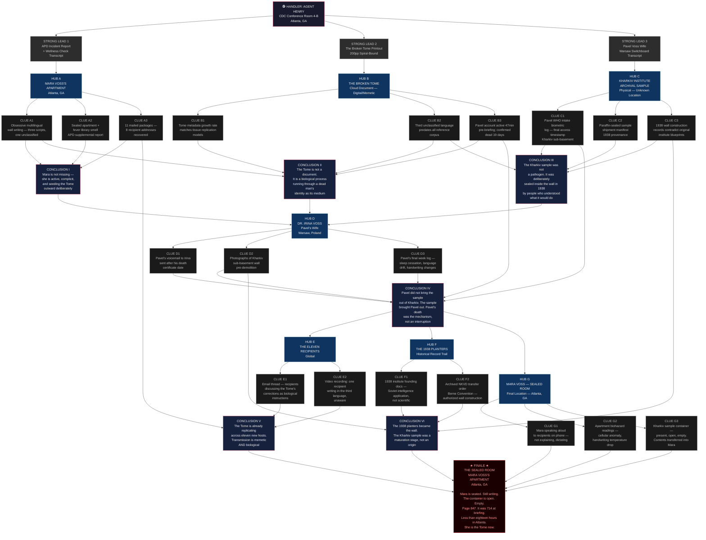

# Operation BROKEN TOME

## Theme
This is 2026. A new COVID variant emerges. Russo-Ukrainian war is a stalemate. The US is in preparation to invade Iran as Iran blocks oil shimpments in Ormuz strait.  World is on the brink of economic collapse.

## Core Premise & Setting
It is April 2026. A new COVID variant — internally designated HCoV-NX3 and colloquially called 'the Gray' by overwhelmed ER staff — is burning through underfunded hospital systems already buckling under pandemic fatigue and supply-chain collapse. Fuel prices have tripled since the USS Gerald R. Ford carrier group entered the Persian Gulf. Grocery shelves thin. 401(k)s crater. The Russo-Ukrainian front has frozen into a grey, irradiated scar across eastern Europe, and nobody wins, nobody stops. The world is holding its breath, and something old and rotting has decided to breathe in.

Dr. Mara Voss, a 44-year-old NIH molecular epidemiologist stationed at the CDC's Emergency Operations Center in Atlanta, has not reported to work in eleven days. Her supervisor filed a wellness check. Local Atlanta PD found her apartment sealed from the inside — no forced entry, no signs of struggle — and the air inside described by the first responding officer as smelling like 'a library that caught a slow fever.' Every surface was covered in dense, obsessive handwriting in three languages, two of them identified, one of them not. Her personal laptop was open to a shared cloud document, still live, still being edited — by an account registered to her brother, Dr. Pavel Voss, a virologist who died of HCoV-NX3 complications in a Kyiv field hospital nineteen days ago.

The document is titled 'THE BROKEN TOME — A FINAL CORRECTION.' It is 714 pages long and growing.

Delta Green's interest is not Mara. Delta Green's interest is what Pavel brought back from a restricted sub-basement of the Kharkiv Institute of Epidemiology before the Russian artillery flattened it in February — a pre-Soviet archival sample collection, never catalogued, never destroyed, sealed in paraffin and bureaucratic neglect since 1938. Pavel was the last researcher to access it. Pavel is dead. Pavel is still writing.

The Agents are briefed as CDC Epidemic Intelligence Officers embedded with a multi-agency task force investigating HCoV-NX3 transmission anomalies. Their official mandate: locate Dr. Mara Voss, assess her mental state, and recover any proprietary NIH research materials from her apartment before they become a legal liability. Their real mandate: determine what came out of Kharkiv inside Pavel Voss's research notes, why it is rewriting a dead man's document through a living woman's hands, and whether the necrotic transmission vector it represents can be severed before it finds a population of 8 billion people too exhausted and too frightened to notice they are already being rewritten.

The twist is this: Mara Voss does not want to be found. She does not want to be saved. She has read enough of her brother's corrections to understand what is on the other side of the threshold he crossed, and she has decided — lucidly, deliberately, with full informed consent — that going back is the wrong direction. She is not a victim. She is a collaborator. And she has already mailed copies of the Tome's first 200 pages to eleven colleagues across six countries.

The horror is necrotic and unnatural: Pavel Voss is not a ghost, not a demon, not a virus. He is a process — a slow, deliberate, biological rewriting of living cellular architecture into something that persists beyond death, guided by a geometric logic encoded in that 1938 sample collection, a logic that predates virology, predates germ theory, predates recorded language. The Tome is not a document. It is a growth. Every page added is a cell differentiated. Every reader is a culture medium. And the sample from Kharkiv was not a pathogen. It was a seed, planted in 1938 by people who knew exactly what they were planting and burned down the institution around it when they were done.

## Cover Story & Briefing
# OPERATION: BROKEN TOME
## Delta Green Operational Briefing — Cell Activation Package

---

## CONTACT & BRIEFING LOCATION

The summons arrives the way Delta Green summons always arrive — wrong enough to notice, mundane enough to dismiss.

A calendar invite. Subject line: **"HCoV-NX3 Task Force Orientation — CDC EOC, Atlanta, GA — Conference Room 4-B — 0630."** Sent at 3:14 AM from a .gov address that, if checked, routes back to a DHS logistics contractor dissolved in 2021. The invite contains a building access code, a parking garage level, and a single instruction appended to the body in plain text, no formatting:

> *Bring your own coffee. The machine on four is broken and nobody's fixed it.*

Conference Room 4-B is not on any publicly accessible CDC floor plan. It smells like recycled air and old laminate. The fluorescent tube above the projector screen flickers at irregular intervals — not a maintenance issue, you will decide, but a feature. Someone unscrewed it just enough.

**Agent Henry** is already there when the Agents arrive. He always is.

He looks like a man who was hired to look like a man who doesn't matter — weak-chinned, thinning hair combed with the optimistic geometry of someone who still believes in the effort, drowning inside a DHS business casual ensemble that fits him the way a borrowed suit fits a man who has lost weight in the wrong places. He is shuffling a stack of thermal printouts with hands that cannot stop moving. Not fidgeting. Shaking. The distinction matters. He does not acknowledge the Agents when they enter. He counts pages. He recounts them. He sets them down. He picks them up.

When the projector flickers off for a half-second and the room drops into darkness, you see it — faint, involuntary, unmistakable. A sickly amber luminescence bleeding from behind his pupils, the color of radiation film held up to a dying sun. Then the light stabilizes and he is just a tired analyst holding paper he has already memorized.

He looks up. He does not smile.

**"Close the door,"** Agent Henry says. **"We're already behind."**

---

## THE BRIEFING

He slides a single thermal printout to the center of the table. No folder. No classification cover sheet.

A photograph: a woman in her mid-forties, sharp-featured, dark circles that predate the current crisis by several years. A federal ID lanyard. A look in her eyes that reads, in the vocabulary of people trained to read such things, as *someone who has made a decision and stopped arguing with herself about it.*

**"Dr. Mara Voss. NIH. GS-15. Molecular epidemiology. Eleven years at the agency, six of them embedded with CDC Emergency Operations. Her supervisor describes her as 'pathologically competent.' She has not reported to work in eleven days."**

He sets another printout on top of the first. An APD incident report, heavily redacted, the white-out applied with the enthusiasm of someone who has been burned before.

**"Atlanta PD conducted a wellness check at her residence four days ago. The apartment was sealed from the inside. No signs of forced entry. No signs of struggle. The first responding officer — twenty-six years old, three years on the job, no prior unusual incident history — filed a supplemental report describing the air inside as smelling like,"** — he glances down, though he clearly knows it by memory — **"'a library that caught a slow fever.' He requested a mental health follow-up for himself the same afternoon. He has not rescinded that request."**

Another printout. A screenshot, timestamp visible. A Google Doc. The title rendered in clean sans-serif:

> ***THE BROKEN TOME — A FINAL CORRECTION***
> *Last edited: 4 minutes ago*
> *Collaborators: P. Voss (Owner)*

**"Her personal laptop was open to a shared cloud document. Still active. Still receiving edits. The document is currently seven hundred and fourteen pages long. It is growing."**

He pauses. His hands stop shaking for exactly three seconds.

**"The account listed as document owner belongs to Dr. Pavel Voss. Mara's brother. Virologist. WHO field attachment, Kyiv. He died of HCoV-NX3 complications in a field hospital nineteen days ago. We have the death certificate. We have the biometric confirmation from the field hospital intake system. We have a cremation record from a municipal facility outside Boryspil."**

**"Pavel Voss is dead."**

**"Pavel Voss edited that document forty-seven minutes before this briefing began."**

---

## WHAT YOU ARE, OFFICIALLY

Another printout. CDC letterhead. Names — yours.

**"Your cover is clean. You are CDC Epidemic Intelligence Officers, seconded to a multi-agency task force investigating HCoV-NX3 transmission anomalies in the Atlanta metro area. The task force is real. The paperwork is real. Your federal credentials will pass every check any civilian institution can run. Your official mandate is this:"**

He reads it flat, no inflection, the way a man reads something he was told to say and has decided not to editorialize:

**"Locate Dr. Mara Voss. Assess her mental and physical health status. Recover any proprietary NIH research materials — data, physical samples, correspondence — from her residence and any secondary locations she may have accessed, before they constitute a legal or biosecurity liability. File a report. Close the loop."**

He sets the sheet down.

**"That is what you are. That is not what you are doing."**

---

## WHAT YOU ARE DOING

He kills the projector. The room drops. In the half-darkness, the amber behind his eyes catches — a slow pulse, like bioluminescence in still water — and then he turns it back on.

**"Before the Russian artillery destroyed the Kharkiv Institute of Epidemiology in February, Pavel Voss accessed a restricted sub-basement archival collection. Pre-Soviet. 1938 provenance. Never formally catalogued. Never destroyed. Sealed in paraffin wax and eighty-eight years of institutional amnesia. He was the last researcher to enter that room. He removed materials. We do not have a complete inventory of what he removed because the inventory burned with the building."**

**"What we have is the Tome."**

He sets down what is, structurally, the last printout — though it doesn't feel like a document. It feels like a slide under a microscope. 200 pages of the Tome, printed and spiral-bound, the cover sheet stamped with a biohazard rating designation that does not correspond to any standard CDC or WHO classification tier.

**"We have reviewed the first two hundred pages. Our analysts—"** A pause. Something moves across his face that is not quite grief and not quite fear and lands somewhere between them. **"The analysts who reviewed it are on administrative leave. That is not relevant to your operation. What is relevant is this:"**

**"The document is not a scientific paper. It is not a manifesto. Our linguists have identified material in English, Ukrainian, and a third language they cannot classify — not a known isolate, not a constructed language, not a cipher. It predates, structurally, every written language system in our reference corpus. The document appears to describe a biological process. The process does not correspond to any mechanism in the current literature."**

**"Every page added to the Tome corresponds, temporally, to measurable changes in the cloud document's metadata architecture. It is not growing like a text. It is growing like tissue."**

He lets that sit.

**"Mara Voss has already mailed the first two hundred pages to eleven colleagues across six countries. We have names on eight of them. We are working on the remaining three. You are not responsible for the recipients. You are responsible for the source."**

**"Find Mara Voss. Determine the nature of her contact with the Tome's contents and with whatever process is operating through the Pavel Voss account. Assess whether the transmission vector — biological, memetic, or otherwise — can be interrupted. Recover or destroy the originating Kharkiv sample materials if they are present."**

He straightens his stack of printouts one final time. His hands are shaking again.

**"She knows you're coming. We don't know how. We don't know how much she knows. We know she sealed her apartment from the inside and has not left it in eleven days and that she has access to the full Tome and that she has chosen, with apparent full faculty, not to stop reading."**

**"Your official report will say you recovered a CDC employee experiencing a mental health crisis secondary to pandemic fatigue and grief."**

He looks at each of you. The flicker overhead. The amber, just barely, behind the iris.

**"Write something believable."**

---

## AGENT HENRY'S LAST WORDS BEFORE DISMISSAL

He is already gathering his printouts when he says it — not looking up, voice low, the sentence arriving the way dangerous things often arrive in Delta Green briefings: quietly, at the end, when you've already started thinking about logistics.

**"Pavel Voss had a wife. She's in Warsaw. She has not been contacted. She is not a priority."**

A beat.

**"She called the NIH switchboard six hours ago asking if anyone had accessed her husband's cloud storage account. She said, and I am quoting the transcript directly:"**

He reads from the last page.

**"'Pavel told me if anyone ever called asking about the Kharkiv box, I should tell them — it was not found in the building. It was found in the wall. And the wall was put there in 1938 by people who were afraid of what was on the other side of it.'"**

He tucks the printout into his jacket.

**"She hung up before we could ask a follow-up question. That's all I have."**

He opens the door. The hallway fluorescents are steady and clean and perfectly ordinary and somehow worse for it.

**"Wheels up in ninety minutes. Don't be late. And don't read the document."**

He walks away without waiting to see if you follow.

---

*You notice, after he is gone, that he never touched his coffee cup.*
*It was full when you arrived.*
*It is still full.*
*It is cold.*

---

**[END OF BRIEFING — OPERATION: BROKEN TOME — HANDLER: AGENT HENRY — CLASSIFICATION: EYES ONLY]**

## Timeline
# OPERATION: BROKEN TOME — STRUCTURED TIMELINE

---

**T-88** — (88 days ago) Pavel Voss accesses the restricted sub-basement of the Kharkiv Institute of Epidemiology and removes a paraffin-sealed pre-Soviet archival sample collection dated 1938 from a cavity inside a bricked-over wall, becoming the last human being to handle it before Russian artillery levels the building three days later.

---

**T-19** — (19 days ago) Dr. Pavel Voss dies of documented HCoV-NX3 complications in a WHO-affiliated field hospital outside Boryspil, Ukraine; his biometrics are logged, his remains are cremated, and his personal cloud storage account is flagged inactive by automatic NIH systems audit.

---

**T-11** — (11 days ago) Dr. Mara Voss fails to report to her CDC Emergency Operations Center post for the first time, seals her Atlanta apartment from the inside, opens her brother's shared document, and does not stop reading.

---

**T-4** — (4 days ago) Atlanta PD conducts a wellness check on Dr. Voss's apartment; the first responding officer describes the interior air as smelling like "a library that caught a slow fever," files a supplemental mental health request, and does not rescind it.

---

**T-0** — (Today) Delta Green activates the cell via a 3:14 AM calendar invite routing through a dissolved DHS contractor address; Agent Henry briefs the Agents in CDC Conference Room 4-B and does not touch his coffee.

---

**T+1** — The Agents arrive at Dr. Mara Voss's sealed apartment in the Kirkwood neighborhood of Atlanta, finding every interior surface dense with obsessive trilingual handwriting, the laptop open and actively receiving edits from Pavel Voss's account, and no sign of Mara herself — only evidence she left within the last six hours.

- **If the Agents do nothing:** Mara's absence goes uncontested, the Tome continues growing at an accelerating rate as Mara works from a secondary location, and the eleven mailed copies begin producing secondary Tome-growth events in Oslo, Nairobi, Singapore, and three cities the Agents do not yet have names for; within 72 hours, Delta Green loses the ability to track the transmission perimeter.
- **If the Agents successfully intervene:** The apartment is treated as a Class-IV biohazard site under HCoV-NX3 task force authority, all written surfaces are photographically documented and chemically neutralized, the laptop is imaged and hard-killed, and the official incident report cites "severe pandemic-stress-induced psychogenic break with delusional written fixation" — the kind of paperwork nobody reads twice during a respiratory crisis.
- **If the Agents fail to intervene:** An Agent who reads more than three contiguous pages of the wall-text without anchoring protocols loses 1D4 SAN (Unnatural) and begins transcribing fragments in their sleep within 48 hours; Delta Green flags the cell as potentially compromised and dispatches a secondary team with standing termination authority.

---

**T+2** — Delta Green intercepts a priority message from Mara Voss to one of the eleven recipients — Dr. Adaeze Okonkwo, a Nigerian virologist currently presenting at an WHO emergency summit in Geneva — containing not text but a 40-second audio file of what sounds like cellular mitosis recorded at extreme magnification, followed by seventeen seconds of the unclassified language spoken in a voice that audio forensics will confirm is Pavel Voss's.

- **If the Agents do nothing:** Dr. Okonkwo plays the audio file for four colleagues before Geneva security is alerted; two of those colleagues begin exhibiting the same obsessive trilingual writing behavior within 36 hours, and the WHO summit becomes a secondary transmission node embedded inside a live international health crisis with press credentials and diplomatic immunity.
- **If the Agents successfully intervene:** Delta Green's Geneva-adjacent asset intercepts Okonkwo before the summit session, the audio file is quarantined under a fabricated WHO digital-evidence-chain protocol, and Okonkwo is placed in a voluntary "HCoV-NX3 exposure isolation" that holds for exactly as long as she believes it is voluntary.
- **If the Agents fail to intervene:** The audio file is uploaded to a WHO internal server by a well-meaning IT contractor trying to archive summit materials; it propagates across eleven institutional intranets before anyone notices, and the unclassified language begins appearing in the margin notes of WHO situation reports drafted by people who never heard the file — 1D6 SAN loss (Unnatural) for any Agent who reviews the propagation data.

---

**T+3** — Mara Voss is located at a rented room in a long-stay motel on I-20 west of Atlanta, where she has covered every wall in fresh handwriting, turned off every light, and left the door unlocked; she is seated at the desk with her back to the door, typing, and she tells the Agents — without turning around — that she has been expecting the wrong people and is relieved they are merely the ones trying to stop her rather than the ones who planted the wall in 1938.

- **If the Agents do nothing:** Mara completes and uploads what she calls the "differentiation layer" — pages 715 through 800 of the Tome — which Delta Green's analysts later describe as the document undergoing something structurally analogous to organogenesis; every prior reader of the Tome begins reporting the same dream, simultaneously, across six time zones.
- **If the Agents successfully intervene:** Mara is extracted under CDC psychiatric hold authority, the motel room is sanitized under an EPA hazmat response tied to a fabricated chemical spill on the I-20 corridor, and Mara — if the Agents have built enough operational trust — provides the location of the Kharkiv sample materials and a partial description of the 1938 figures she calls "the gardeners," though she will not help them destroy what she considers her brother's continuation.
- **If the Agents fail to intervene:** Mara completes the upload and then closes the laptop with the calm finality of someone who has finished a thing they were put on earth to finish; when Agents breach the room, she is seated, breathing, eyes open, writing in the unclassified language with her finger on the blank wall — no pen, no ink, no visible medium, the letters appearing anyway — 1D6/1D10 SAN (Unnatural); Delta Green's cleanup protocol for the motel involves a gas leak, a fire investigator who owes three favors, and a grief counselor for the first responders who will never fully debrief.

---

**T+5** — A package arrives at the NIH mailroom addressed to the Director of the National Institute of Allergy and Infectious Diseases, postmarked from Atlanta four days ago — before Mara was located — containing a paraffin-sealed glass vial labeled in Cyrillic and in the unclassified language, packed in a 1938-era metal canister stamped with a Soviet precursor agency seal and a hand-drawn geometric symbol that the NIH mail screener, before dropping it, describes as "a spiral that keeps going after you stop looking at it."

- **If the Agents do nothing:** The NIH mailroom goes into precautionary HCoV-NX3 lockdown, which is exactly the correct protocol and entirely the wrong reason; the vial is catalogued as a potential bioterrorism sample and enters the federal evidence chain, where it will be handled by seven more people before the Agents can legally touch it, and each of those seven people will begin having the dream.
- **If the Agents successfully intervene:** The Agents leverage their CDC task force credentials to commandeer the package before NIH evidence processing, the vial is transported under Class-IV containment to a Delta Green-adjacent BSL-4 facility for analysis, and the official report attributes the package to "a delusional former NIH contractor with a history of biohazard hoax submissions" — a file that will be created retroactively and backdated with appropriate bureaucratic sediment.
- **If the Agents fail to intervene:** The vial enters full federal evidence processing, is eventually opened in a Bethesda BSL-2 lab by a technician who follows every correct protocol and is nonetheless exposed; the technician does not die, does not become sick, and begins writing — fluently, immediately, in the unclassified language — a development that produces a 1D8/1D20 SAN (Unnatural) response in every Agent who reviews the surveillance footage, and forces Delta Green to activate a second cell it cannot afford.

---

**T+7 — WORST-CASE CATASTROPHE** — The Tome reaches page 888, its metadata architecture completes what Delta Green's surviving analysts call "the second fold," and every person who has read more than forty contiguous pages — across six countries, in eleven locations — begins rewriting whatever surface is nearest to them in the unclassified language simultaneously, without communication, without coordination, as if receiving dictation from a single source that is not Pavel Voss and never was.

- **If the Agents do nothing:** The second fold propagates outward through the eleven mailed copies as a memetic cascade; HCoV-NX3 news coverage masks the initial outbreak of mass simultaneous writing events as "pandemic psychosis clusters," buying the process approximately three weeks before a pattern-recognition algorithm flags the geometric commonality and a journalist with a Substack publishes a thread that gets four million impressions before Delta Green can suppress it; the unnatural process achieves a transmission base sufficient to self-sustain, and Delta Green formally designates the event a BROKEN THRESHOLD — a category with no established containment protocol.
- **If the Agents successfully intervene:** The Agents have, prior to T+7, destroyed the originating Kharkiv sample, severed Mara's access to the document (requiring either her willing cooperation or her incapacitation), and forced a hard deletion of the cloud document's server-side architecture through a Delta Green asset at the hosting provider — a process that kills the document's growth but leaves 714 pages of printed copies in eleven locations requiring simultaneous retrieval operations the cell cannot execute alone; the official story is a coordinated international academic fraud ring exploiting pandemic grief, the Agents' names appear nowhere, and three of them will require long-term SAN recovery protocols.
- **If the Agents fail to intervene:** The cell is terminated — not by the process, not by Mara, but by Delta Green itself, under BROKEN THRESHOLD standing orders; the termination order is clean, documented, and signed by a program coordinator the Agents have never met; the cell's official records are reclassified and archived; a new cell is briefed on the situation with the previous cell listed only as "prior assets, status: resolved"; somewhere in the distance, the Tome continues.

---

**T+9 — BEST-CASE SCENARIO** — The Agents have destroyed the Kharkiv sample, secured or neutralized Mara Voss, forced deletion of the live Tome document at the infrastructure level, and retrieved or chemically destroyed all eleven mailed copies through a coordinated multi-agency operation conducted entirely under the cover of an HCoV-NX3 contact-tracing sweep — and the document stops growing at page 802, mid-sentence, in the unclassified language, ending on a word that Delta Green's linguists will spend four years failing to translate.

- **If the Agents do nothing:** This entry is inapplicable; there is no best-case scenario in which the Agents do nothing.
- **If the Agents successfully intervene:** The official closed case file reads: *"Dr. Mara Voss, NIH GS-15, recovered in a state of acute grief-related psychiatric crisis following the HCoV-NX3 death of her brother; no proprietary research materials were at risk; no biosecurity breach confirmed; case closed, no further action required"*; Mara is placed in a Delta Green-adjacent long-term psychiatric facility under a name that is not hers, where she reads nothing, writes nothing, and on certain nights tells the night-shift nurse that her brother is very close now and almost finished resting; the Agents file their reports, go home to their Bonds, and do not discuss what the wall-writing in the motel room spelled out when read in the correct order, because none of them have confirmed whether any of the others noticed, and none of them want to be the first to ask.
- **If the Agents fail to intervene:** There is no fail state at T+9 that produces a best-case scenario; there is only a different catastrophe with a cleaner cover story.

## Clue Web
# OPERATION: BROKEN TOME — CLUE WEB

---

## GRAPH STRUCTURE

```
╔══════════════════════════════════════════════════════════════════════════════════════════════════╗
║                                    HANDLER: AGENT HENRY                                          ║
║                            [CDC Conference Room 4-B — Atlanta, GA]                              ║
╚══════════════════════════════════════════════════════════════════════════════════════════════════╝
         │                              │                               │
         ▼                              ▼                               ▼
  ┌─────────────────┐        ┌─────────────────┐             ┌─────────────────┐
  │  STRONG LEAD 1  │        │  STRONG LEAD 2  │             │  STRONG LEAD 3  │
  │  APD Incident   │        │  THE BROKEN     │             │  Pavel Voss     │
  │  Report (redac) │        │  TOME printout  │             │  Wife — Warsaw  │
  │  + wellness chk │        │  (200 pages,    │             │  Switchboard    │
  │  transcript     │        │  spiral-bound)  │             │  Call Transcript│
  └────────┬────────┘        └────────┬────────┘             └────────┬────────┘
           │                          │                                │
           ▼                          ▼                                ▼
  ┌─────────────────────┐   ┌──────────────────────┐    ┌─────────────────────────┐
  │  HUB A              │   │  HUB B               │    │  HUB C                  │
  │  MARA VOSS'S        │   │  THE BROKEN TOME     │    │  KHARKIV INSTITUTE      │
  │  APARTMENT          │   │  (Cloud Document)    │    │  ARCHIVAL SAMPLE        │
  │  [Atlanta, GA]      │   │  [Digital / Memetic] │    │  [Physical — Unknown    │
  └──────────┬──────────┘   └──────────┬───────────┘    │   Current Location]    │
             │                         │                 └───────────┬─────────────┘
             │                         │                             │
    ┌────────┴──────┐         ┌────────┴──────┐           ┌─────────┴──────────┐
    │               │         │               │           │                    │
    ▼               ▼         ▼               ▼           ▼                    ▼
┌───────┐      ┌───────┐  ┌───────┐      ┌───────┐  ┌───────┐           ┌───────┐
│CLUE A1│      │CLUE A2│  │CLUE B1│      │CLUE B2│  │CLUE C1│           │CLUE C2│
│Obsess-│      │Sealed │  │Metada-│      │Third  │  │Pavel's│           │Paraffin│
│ive    │      │apart- │  │ta    │      │unclass-│  │field  │           │sealed  │
│multi- │      │ment + │  │growth │      │ified  │  │notes /│           │sample  │
│lingual│      │'fever │  │rate   │      │language│  │WHO    │           │shipment│
│wall   │      │library│  │matches│      │predates│  │intake │           │manifest│
│writing│      │'smell │  │tissue │      │all ref │  │biometr│           │(1938   │
│       │      │       │  │replic-│      │corpus  │  │ic log │           │provena-│
│       │      │       │  │ation  │      │        │  │       │           │nce)    │
└───┬───┘      └───┬───┘  └───┬───┘      └───┬───┘  └───┬───┘           └───┬───┘
    │              │          │              │           │                   │
    └──────┬───────┘          └──────┬───────┘           └──────┬────────────┘
           │                         │                           │
           ▼                         ▼                           ▼
  ┌─────────────────┐      ┌──────────────────┐      ┌───────────────────────┐
  │  CLUE A3        │      │  CLUE B3         │      │  CLUE C3              │
  │  11 mailed      │      │  Document owner  │      │  Collapsed sub-       │
  │  packages —     │      │  account active  │      │  basement wall — 1938 │
  │  recipients'    │      │  47 min before   │      │  construction records │
  │  addresses      │      │  briefing; Pavel │      │  differ from original │
  │  (8 recovered)  │      │  Voss confirmed  │      │  institute blueprints │
  │                 │      │  dead 19 days    │      │                       │
  └────────┬────────┘      └────────┬─────────┘      └──────────┬────────────┘
           │                        │                            │
           ▼                        ▼                            ▼
  ╔═════════════════╗    ╔══════════════════╗       ╔════════════════════════╗
  ║  CONCLUSION I   ║    ║  CONCLUSION II   ║       ║  CONCLUSION III        ║
  ║                 ║    ║                  ║       ║                        ║
  ║  Mara is not    ║    ║  The Tome is not ║       ║  The Kharkiv sample    ║
  ║  missing —      ║    ║  a document. It  ║       ║  was not a pathogen.   ║
  ║  she is active, ║    ║  is a biological ║       ║  It was deliberately   ║
  ║  complicit, and ║    ║  process running ║       ║  sealed inside the     ║
  ║  seeding the    ║    ║  through a dead  ║       ║  wall in 1938 by       ║
  ║  Tome outward   ║    ║  man's identity  ║       ║  people who understood ║
  ║  deliberately   ║    ║  as its medium   ║       ║  what it would do      ║
  ╚════════╤════════╝    ╚════════╤═════════╝       ╚═══════════╤════════════╝
           │                      │                              │
           │           ┌──────────┴───────────┐                 │
           │           │                      │                 │
           └───────────┤   SECONDARY HUB D    ├─────────────────┘
                       │   DR. IRINA VOSS     │
                       │   (Pavel's Wife)     │
                       │   [Warsaw, Poland]   │
                       └──────────┬───────────┘
                                  │
                    ┌─────────────┼─────────────┐
                    ▼             ▼              ▼
               ┌────────┐   ┌────────┐     ┌────────┐
               │CLUE D1 │   │CLUE D2 │     │CLUE D3 │
               │Pavel's │   │Photo-  │     │Personal│
               │last    │   │graphs  │     │log:    │
               │voicemai│   │of      │     │Pavel's │
               │l to    │   │Kharkiv │     │final   │
               │Irina — │   │sub-    │     │week —  │
               │sent    │   │basement│     │sleep   │
               │after   │   │wall    │     │cessati-│
               │his     │   │pre-    │     │on,     │
               │death   │   │demolit │     │language│
               │cert.   │   │ion     │     │drift,  │
               │date    │   │        │     │hand    │
               │        │   │        │     │writing │
               │        │   │        │     │changes │
               └───┬────┘   └───┬────┘    └───┬────┘
                   │            │              │
                   └────────────┼──────────────┘
                                │
                                ▼
                   ╔════════════════════════╗
                   ║   CONCLUSION IV        ║
                   ║                        ║
                   ║  Pavel did not bring   ║
                   ║  the sample out of     ║
                   ║  Kharkiv. The sample   ║
                   ║  brought Pavel out.    ║
                   ║  The process began     ║
                   ║  before the artillery  ║
                   ║  strike. Pavel's death ║
                   ║  was the mechanism,    ║
                   ║  not an interruption.  ║
                   ╚════════════╤═══════════╝
                                │
           ┌────────────────────┼─────────────────────┐
           │                    │                      │
           ▼                    ▼                      ▼
  ┌────────────────┐   ┌────────────────┐   ┌──────────────────┐
  │  HUB E         │   │  HUB F         │   │  HUB G           │
  │  THE ELEVEN    │   │  THE 1938      │   │  MARA VOSS —     │
  │  RECIPIENTS    │   │  PLANTERS      │   │  SEALED ROOM     │
  │  [Global]      │   │  [Historical   │   │  [Final Location]│
  │                │   │   Record Trail]│   │                  │
  └───────┬────────┘   └───────┬────────┘   └────────┬─────────┘
          │                    │                      │
  ┌───────┴──────┐     ┌───────┴──────┐      ┌───────┴──────────┐
  │              │     │              │      │                  │
  ▼              ▼     ▼              ▼      ▼                  ▼
┌──────┐    ┌──────┐ ┌──────┐    ┌──────┐ ┌──────┐        ┌──────┐
│CL E1 │    │CL E2 │ │CL F1 │    │CL F2 │ │CL G1 │        │CL G2 │
│Email │    │Video │ │1938  │    │NKVD  │ │Audio │        │Biohz │
│thread│    │recor-│ │insti-│    │trans-│ │recor-│        │condi-│
│among │    │ding: │ │tute  │    │fer   │ │ding: │        │tions │
│recip-│    │one   │ │found-│    │order │ │Mara  │        │inside│
│ients │    │recip-│ │ing   │    │(arch-│ │speak-│        │apart-│
│discus│    │ient  │ │docs  │    │ived  │ │ing   │        │ment: │
│sing  │    │begin-│ │— not │    │Berne │ │aloud,│        │cell  │
│the   │    │ning  │ │scien-│    │Conv.)│ │not   │        │count │
│Tome's│    │to    │ │tific │    │— who │ │to    │        │anom- │
│'corr-│    │write │ │purpo-│    │auth- │ │recip-│        │aly,  │
│ectio-│    │in the│ │se —  │    │orized│ │ients │        │hand- │
│ns'   │    │third │ │Soviet│    │them  │ │on    │        │temp  │
│       │    │lang. │ │intel │    │to    │ │phone │        │drop  │
│       │    │      │ │appli-│    │build │ │      │        │      │
│       │    │      │ │cation│    │the   │ │      │        │      │
│       │    │      │ │      │    │wall  │ │      │        │      │
└──┬───┘    └──┬───┘ └──┬───┘    └──┬───┘ └──┬───┘        └──┬───┘
   │           │        │           │        │               │
   │           │        │           │        │   ┌──────────┐│
   │           │        │           │        │   │CL G3     ││
   │           │        │           │        │   │The Kharkiv││
   │           │        │           │        │   │sample box:││
   │           │        │           │        │   │present,  ││
   │           │        │           │        │   │open,     ││
   │           │        │           │        │   │empty.    ││
   │           │        │           │        │   │Contents  ││
   │           │        │           │        │   │transferred││
   │           │        │           │        │   │into Mara.││
   │           │        │           │        └───┴──────────┘│
   └─────┬─────┘        └──────┬────┘                        │
         │                     │                             │
         ▼                     ▼                             │
╔════════════════╗   ╔══════════════════════╗               │
║  CONCLUSION V  ║   ║  CONCLUSION VI       ║               │
║                ║   ║                      ║               │
║  The Tome is   ║   ║  The 1938 planters   ║               │
║  already       ║   ║  were not destroyed  ║               │
║  replicating   ║   ║  by the Soviet       ║               │
║  across eleven ║   ║  purges. They became ║               │
║  new hosts.    ║   ║  the wall. The        ║               │
║  Transmission  ║   ║  Kharkiv sample was  ║               │
║  is memetic    ║   ║  a maturation stage, ║               │
║  AND biological║   ║  not an origin.      ║               │
╚═══════╤════════╝   ╚══════════╤═══════════╝               │
        │                       │                           │
        └───────────────┬────────┘                          │
                        │◄──────────────────────────────────┘
                        │
                        ▼
╔══════════════════════════════════════════════════════════════════════╗
║                                                                      ║
║                            F I N A L E                               ║
║                                                                      ║
║             THE SEALED ROOM — MARA VOSS'S APARTMENT                  ║
║                        [Atlanta, GA]                                 ║
║                                                                      ║
║  The Agents breach the apartment. The smell hits first —            ║
║  warm paper and copper and something metabolic that has no           ║
║  name in any occupational safety manual. Every surface is            ║
║  covered in the third language, floor to ceiling, in three           ║
║  different handwriting styles. One of them the Agents may            ║
║  recognize as Mara's. One they will not recognize. One               ║
║  appears to have been written by something with too many             ║
║  fingers.                                                            ║
║                                                                      ║
║  Mara Voss is alive, seated at the laptop, still writing.           ║
║  She does not turn around. The Kharkiv sample container is           ║
║  open on the desk beside her — small, paraffin-rimmed, and           ║
║  empty. She has made her choice. She is the Tome now.                ║
║                                                                      ║
║  Pavel Voss is in the room too, in every way that matters            ║
║  and none of the ways that help.                                     ║
║                                                                      ║
║  THE OPERATIVE QUESTION IS NO LONGER WHERE THE SAMPLE IS.           ║
║  THE OPERATIVE QUESTION IS WHETHER MARA CAN BE SEVERED FROM         ║
║  THE PROCESS WITHOUT COMPLETING IT — AND WHETHER DOING SO           ║
║  PRODUCES SOMETHING WORSE THAN WHAT IS ALREADY IN THE ROOM.         ║
║                                                                      ║
║  The document on the screen is on page 847.                         ║
║  It was 714 at the briefing.                                         ║
║  The Agents have been in Atlanta for less than eighteen hours.       ║
║                                                                      ║
╚══════════════════════════════════════════════════════════════════════╝
```

---

## NODE INDEX

| Node | Type | Label |
|---|---|---|
| **Agent Henry** | Handler | CDC Conference Room 4-B |
| **Hub A** | Hub | Mara Voss's Apartment |
| **Hub B** | Hub | The Broken Tome (Cloud Document) |
| **Hub C** | Hub | Kharkiv Institute Archival Sample |
| **Hub D** | Secondary Hub | Dr. Irina Voss — Warsaw |
| **Hub E** | Secondary Hub | The Eleven Recipients |
| **Hub F** | Secondary Hub | The 1938 Planters (Historical Record) |
| **Hub G** | Secondary Hub | Mara Voss — Sealed Room (Final Approach) |
| **Conclusion I** | Conclusion | Mara is an active collaborator, not a victim |
| **Conclusion II** | Conclusion | The Tome is a biological process, not a text |
| **Conclusion III** | Conclusion | The sample was deliberately sealed in 1938 |
| **Conclusion IV** | Conclusion | Pavel's death was the mechanism, not an interruption |
| **Conclusion V** | Conclusion | Transmission is already replicating across eleven hosts |
| **Conclusion VI** | Conclusion | The 1938 planters became the wall — Kharkiv was a maturation stage |
| **Finale** | Finale | The Sealed Room — Mara Voss's Apartment, Atlanta |

---

## CLUE INDEX

| Clue ID | Clue Type | Description | Source Hub | Leads To |
|---|---|---|---|---|
| A1 | Personal Log | Obsessive multilingual wall writing — three scripts, one unclassified | Hub A | Conclusion I, II |
| A2 | Witness (unwilling) | Sealed apartment + 'fever library' smell — APD officer's supplemental report | Hub A | Conclusion I |
| A3 | E-mail / Purchase Receipt | 11 mailed packages, 8 recipient addresses recovered | Hub A | Conclusion I, V |
| B1 | Official Report | Tome metadata growth rate matches tissue replication models | Hub B | Conclusion II |
| B2 | Literature | Third unclassified language — predates all reference corpus | Hub B | Conclusion II, III |
| B3 | Video Recording | Pavel Voss account active 47 min pre-briefing; confirmed dead 19 days | Hub B | Conclusion II, IV |
| C1 | Official Report | Pavel's WHO intake biometric log — final access timestamp, Kharkiv sub-basement | Hub C | Conclusion III, IV |
| C2 | Public Records | Paraffin-sealed sample shipment manifest — 1938 provenance, no catalogue entry | Hub C | Conclusion III |
| C3 | Public Records | 1938 wall construction records contradict original institute blueprints | Hub C | Conclusion III, VI |
| D1 | Audio Recording | Pavel's voicemail to Irina — sent after his death certificate date | Hub D | Conclusion IV |
| D2 | Photograph | Photos of Kharkiv sub-basement wall, pre-demolition — non-standard construction | Hub D | Conclusion IV, VI |
| D3 | Personal Log | Pavel's final week log — sleep cessation, language drift, handwriting changes | Hub D | Conclusion IV |
| E1 | E-mail | Recipient thread discussing the Tome's 'corrections' as biological instructions | Hub E | Conclusion V |
| E2 | Video Recording | One recipient filmed writing in the third language, unaware | Hub E | Conclusion V |
| F1 | Public Records | 1938 institute founding documents — Soviet intelligence application, not scientific | Hub F | Conclusion VI |
| F2 | Official Report | Archived NKVD transfer order (Berne Convention) — authorized wall construction | Hub F | Conclusion VI |
| G1 | Audio Recording | Mara speaking aloud to recipients on phone — not explaining, dictating | Hub G | Finale |
| G2 | Official Report | Apartment biohazard readings — cellular anomaly, handwriting temperature drop | Hub G | Finale |
| G3 | Artifact | Kharkiv sample container — present, open, empty. Contents transferred into Mara | Hub G | Finale |

## Clue Web Graphs


---

```
╔══════════════════════════════════════════════════════════════════════════════════════════════════════╗
║                              OPERATION: BROKEN TOME — CLUE WEB                                      ║
╠══════════════════════════════════════════════════════════════════════════════════════════════════════╣
║                                                                                                      ║
║                              ┌─────────────────────────────────┐                                    ║
║                              │     HANDLER: AGENT HENRY        │                                    ║
║                              │  CDC Conference Room 4-B        │                                    ║
║                              │       Atlanta, GA               │                                    ║
║                              └──────────┬──────────┬───────────┘                                    ║
║                                         │          │          │                                      ║
║               ┌─────────────────────────┘          │          └──────────────────────┐              ║
║               │                                    │                                 │              ║
║               ▼                                    ▼                                 ▼              ║
║   ┌────────────────────────┐       ┌───────────────────────┐       ┌─────────────────────────┐     ║
║   │   STRONG LEAD 1        │       │   STRONG LEAD 2        │       │   STRONG LEAD 3         │     ║
║   │   APD Incident Report  │       │   The Broken Tome      │       │   Pavel Voss Wife       │     ║
║   │   + Wellness Check     │       │   Printout (200pp)     │       │   Warsaw Switchboard    │     ║
║   └────────────┬───────────┘       └──────────┬────────────┘       └──────────┬──────────────┘     ║
║                │                              │                               │                      ║
║                ▼                              ▼                               ▼                      ║
║   ┌────────────────────────┐   ┌──────────────────────────┐   ┌──────────────────────────────┐     ║
║   │  HUB A                 │   │  HUB B                   │   │  HUB C                       │     ║
║   │  MARA VOSS'S           │   │  THE BROKEN TOME         │   │  KHARKIV INSTITUTE           │     ║
║   │  APARTMENT             │   │  Cloud Document          │   │  ARCHIVAL SAMPLE             │     ║
║   │  Atlanta, GA           │   │  Digital / Memetic       │   │  Physical — Unknown Location │     ║
║   └───┬──────┬─────────┬───┘   └────┬──────┬──────────┬──┘   └─────┬──────────┬───────────┬─┘     ║
║       │      │         │            │      │          │             │          │           │         ║
║       ▼      ▼         ▼            ▼      ▼          ▼             ▼          ▼           ▼         ║
║   ┌──────┐┌──────┐ ┌──────┐   ┌──────┐┌──────┐  ┌──────┐    ┌──────┐   ┌──────┐    ┌──────┐      ║
║   │ A1   ││ A2   │ │ A3   │   │ B1   ││ B2   │  │ B3   │    │ C1   │   │ C2   │    │ C3   │      ║
║   │Multi-││Sealed│ │11    │   │Meta- ││Third │  │Pavel │    │WHO   │   │Paraf-│    │1938  │      ║
║   │lingu-││apart-│ │mailed│   │data  ││lang. │  │acct  │    │bio-  │   │fin   │    │wall  │      ║
║   │al    ││ment +│ │pack- │   │growth││pre-  │  │active│    │metric│   │sample│    │const-│      ║
║   │wall  ││fever │ │ages  │   │rate =││dates │  │47min │    │log   │   │mani- │    │ruct. │      ║
║   │writng││library│ │8 addr│   │tissue││ref   │  │pre-  │    │final │   │fest  │    │contra│      ║
║   │      ││smell │ │recov-│   │replic││corpus│  │brief-│    │access│   │1938  │    │dicts │      ║
║   │      ││      │ │ered  │   │      ││      │  │ing   │    │Kharki│   │prov. │    │blue- │      ║
║   └──┬───┘└──┬───┘ └──┬───┘   └──┬───┘└──┬───┘  └──┬───┘    └──┬───┘   └──┬───┘    └──┬───┘      ║
║      │       │        │           │       │          │            │          │           │           ║
║      └───────┼────────┘           └───────┼──────────┘            └──────────┼───────────┘           ║
║              │                            │                                  │                        ║
║              ▼                            ▼                                  ▼                        ║
║   ╔══════════════════════╗   ╔══════════════════════════╗   ╔══════════════════════════════════╗     ║
║   ║  CONCLUSION I        ║   ║  CONCLUSION II           ║   ║  CONCLUSION III                  ║     ║
║   ║                      ║   ║                          ║   ║                                  ║     ║
║   ║  Mara is not missing ║   ║  The Tome is a biological║   ║  The Kharkiv sample was          ║     ║
║   ║  — she is active,    ║   ║  process running through ║   ║  deliberately sealed in 1938     ║     ║
║   ║  complicit, and      ║   ║  a dead man's identity   ║   ║  by people who understood        ║     ║
║   ║  seeding the Tome    ║   ║  as its medium           ║   ║  what it would do                ║     ║
║   ║  outward deliberately║   ║                          ║   ║                                  ║     ║
║   ╚══════════╤═══════════╝   ╚═════════════╤════════════╝   ╚════════════════╤═════════════════╝     ║
║              │                             │                                  │                        ║
║              └─────────────────────────────┼──────────────────────────────────┘                       ║
║                                            │                                                           ║
║                                            ▼                                                           ║
║                              ┌─────────────────────────────────┐                                      ║
║                              │  HUB D                          │                                      ║
║                              │  DR. IRINA VOSS (Pavel's Wife)  │                                      ║
║                              │  Warsaw, Poland                 │                                      ║
║                              └──────────┬──────┬───────────────┘                                      ║
║                                         │      │          │                                            ║
║                        ┌────────────────┘      │          └──────────────────┐                        ║
║                        │                       │                             │                        ║
║                        ▼                       ▼                             ▼                        ║
║              ┌──────────────────┐   ┌──────────────────┐         ┌──────────────────────┐            ║
║              │ D1               │   │ D2               │         │ D3                   │            ║
║              │ Pavel's voicemail│   │ Photographs of   │         │ Pavel's final week   │            ║
║              │ to Irina — sent  │   │ Kharkiv sub-     │         │ log: sleep cessation,│            ║
║              │ after his death  │   │ basement wall    │         │ language drift,      │            ║
║              │ certificate date │   │ pre-demolition   │         │ handwriting changes  │            ║
║              └────────┬─────────┘   └────────┬─────────┘         └──────────┬───────────┘            ║
║                       │                      │                              │                          ║
║                       └──────────────────────┼──────────────────────────────┘                         ║
║                                              │                                                         ║
║                                              ▼                                                         ║
║                              ╔═══════════════════════════════════╗                                    ║
║                              ║  CONCLUSION IV                    ║                                    ║
║                              ║                                   ║                                    ║
║                              ║  Pavel did not bring the sample   ║                                    ║
║                              ║  out of Kharkiv. The sample       ║                                    ║
║                              ║  brought Pavel out. His death     ║                                    ║
║                              ║  was the mechanism, not an        ║                                    ║
║                              ║  interruption.                    ║                                    ║
║                              ╚═══════════════╤═══════════════════╝                                    ║
║                                              │                                                         ║
║                  ┌───────────────────────────┼───────────────────────────┐                            ║
║                  │                           │                           │                            ║
║                  ▼                           ▼                           ▼                            ║
║   ┌──────────────────────┐  ┌────────────────────────┐  ┌───────────────────────────┐               ║
║   │  HUB E               │  │  HUB F                 │  │  HUB G                    │               ║
║   │  THE ELEVEN          │  │  THE 1938 PLANTERS     │  │  MARA VOSS — SEALED ROOM  │               ║
║   │  RECIPIENTS          │  │  Historical Record     │  │  Final Location           │               ║
║   │  Global              │  │  Trail                 │  │  Atlanta, GA              │               ║
║   └──────┬───────┬───────┘  └───────┬────────┬───────┘  └───────┬──────────┬────────┘               ║
║          │       │                  │        │                   │          │       │                  ║
║          ▼       ▼                  ▼        ▼                   ▼          ▼       ▼                  ║
║      ┌──────┐┌──────┐          ┌──────┐ ┌──────┐          ┌──────┐   ┌──────┐ ┌──────┐              ║
║      │ E1   ││ E2   │          │ F1   │ │ F2   │          │ G1   │   │ G2   │ │ G3   │              ║
║      │Email ││Video │          │1938  │ │NKVD  │          │Mara  │   │Biohz │ │Sample│              ║
║      │thread││recrd:│          │found-│ │trans-│          │dictg.│   │readg:│ │box:  │              ║
║      │recpnts││recpnt│          │ing   │ │fer   │          │aloud │   │cell  │ │open, │              ║
║      │discss││writng│          │docs —│ │order │          │to    │   │anom. │ │empty.│              ║
║      │Tome's││third │          │Soviet│ │Berne │          │recip-│   │hand- │ │Cntnts│              ║
║      │correc││lang, │          │intel │ │Conv. │          │ients │   │temp  │ │trans-│              ║
║      │tions ││unawr │          │applic│ │auth. │          │on    │   │drop  │ │ferred│              ║
║      │      ││      │          │      │ │wall  │          │phone │   │      │ │to    │              ║
║      │      ││      │          │      │ │const.│          │      │   │      │ │Mara  │              ║
║      └──┬───┘└──┬───┘          └──┬───┘ └──┬───┘          └──┬───┘   └──┬───┘ └──┬───┘              ║
║         │       │                 │        │                  │          │        │                   ║
║         └───────┘                 └────────┘                  └──────────┴────────┘                   ║
║              │                         │                                │                              ║
║              ▼                         ▼                                │                              ║
║   ╔═══════════════════════╗  ╔════════════════════════════╗             │                              ║
║   ║  CONCLUSION V         ║  ║  CONCLUSION VI             ║             │                              ║
║   ║                       ║  ║                            ║             │                              ║
║   ║  The Tome is already  ║  ║  The 1938 planters became  ║             │                              ║
║   ║  replicating across   ║  ║  the wall. The Kharkiv     ║             │                              ║
║   ║  eleven new hosts.    ║  ║  sample was a maturation   ║             │                              ║
║   ║  Transmission is      ║  ║  stage, not an origin.     ║             │                              ║
║   ║  memetic AND          ║  ║                            ║             │                              ║
║   ║  biological           ║  ║                            ║             │                              ║
║   ╚═══════════╤═══════════╝  ╚══════════════╤═════════════╝             │                              ║
║               │                             │                           │                              ║
║               └─────────────────────────────┼───────────────────────────┘                              ║
║                                             │                                                           ║
║                                             ▼                                                           ║
║   ╔══════════════════════════════════════════════════════════════════════════════════════╗              ║
║   ║                                    F I N A L E                                       ║              ║
║   ║                                                                                      ║              ║
║   ║                   THE SEALED ROOM — MARA VOSS'S APARTMENT                           ║              ║
║   ║                              Atlanta, GA                                            ║              ║
║   ║                                                                                      ║              ║
║   ║   Mara is seated at the laptop, still writing. She does not turn around.            ║              ║
║   ║   The Kharkiv sample container is open on the desk beside her — empty.              ║              ║
║   ║   Every surface is covered in the third language. Three handwriting styles.         ║              ║
║   ║   One of them has too many fingers.                                                  ║              ║
║   ║                                                                                      ║              ║
║   ║   The document on the screen is on page 847.                                        ║              ║
║   ║   It was 714 at the briefing.                                                       ║              ║
║   ║   The Agents have been in Atlanta for less than eighteen hours.                     ║              ║
║   ║                                                                                      ║              ║
║   ║   She is the Tome now.                                                              ║              ║
║   ╚══════════════════════════════════════════════════════════════════════════════════════╝              ║
║                                                                                                        ║
╚════════════════════════════════════════════════════════════════════════════════════════════════════════╝
```

## Threat Vector
# ☣️ UNNATURAL THREAT: THE BROKEN TOME — VECTOR OF EXPOSURE & SAN LOSS FRAMEWORK

---

## THE PROCESS: WHAT PAVEL VOSS BECAME

Pavel Voss did not survive HCoV-NX3. What persists is not Pavel — it is the **geometric logic** encoded in the 1938 Kharkiv sample, using Pavel's accumulated biological and neurological architecture as its first **differentiated substrate**. The Process does not think. It does not want. It *continues*. It is a directed biological rewriting engine, operating on a logic that precedes human language, using the structures of living and recently-dead cellular tissue as a medium for self-elaboration.

The Tome is not a record of the Process. The Tome **is** the Process, externalized into symbolic form. Every page is a phase of cellular differentiation rendered in human language, mathematics, and a third notation system that has no known human precedent — a script that human visual cortex processes as *text* but cannot parse as meaning, yet leaves measurable impressions in short-term memory that compound with repeated exposure.

The 1938 sample from the Kharkiv Institute was not a pathogen. It was the Process in a **latent geometric state** — a set of encoded biological instructions preserved in paraffin, waiting for a sufficiently complex neural substrate (a human being with advanced molecular biology training) to act as a **primer**. Pavel Voss was that primer. His death was not an obstacle. It was the **activation condition**.

---

## 🔬 VECTORS OF EXPOSURE

Exposure operates across four distinct but compounding vectors. Each vector alone is slow, deniable, and mimics mundane psychological deterioration. In combination, they accelerate geometrically.

---

### VECTOR 1 — DIRECT TEXTUAL EXPOSURE (PRIMARY)
**The Tome as Growth Medium**

Reading the Broken Tome — in any format, in any excerpt, at any length — initiates a **passive neurological impression** of the third script. The human visual cortex cannot decode the third notation, but it *registers* it. Each subsequent exposure deepens the registration.

- **Mechanism**: The third script is not symbolic in the human sense. It is a **geometric encoding** — a pattern that interacts with the brain's edge-detection and pattern-recognition circuitry at a sub-linguistic level. It does not convey meaning. It conveys *instruction*. The instruction is cellular. Given sufficient exposure, the reader's own biology begins executing it.
- **Threshold**: Casual exposure to a page or two produces only headaches, phantom smells (burned paper, copper, cold stone), and intrusive geometric shapes at the edge of sleep. Sustained reading — more than thirty cumulative pages — begins producing **somatic symptoms**: skin elasticity changes localized to the fingertips, subtle alterations in resting body temperature, a subjective sense that one's own reflection is *slightly delayed*.
- **Onset**: Slow. Insidious. Mimics stress and sleep deprivation at first contact.
- **Spread via Mara's mailings**: The 200 pages Mara mailed to eleven colleagues constitute eleven simultaneous slow-burn exposure events distributed across six countries. These recipients are not dead. They are *primed*. They are the next generation of culture media.

---

### VECTOR 2 — PROXIMITY EXPOSURE (SECONDARY)
**Environmental Rewriting**

The Process externalizes not only through the Tome but through the **physical environment** of heavily exposed subjects. Mara Voss's apartment is not just contaminated. It is *partially differentiated* — the walls, surfaces, and air of the space have begun a slow geometric reorganization that mimics early-phase cellular rewriting at a macro scale.

- **Mechanism**: Extended habitation of a space by a heavily exposed subject leaves a **biological residue** — not viral, not bacterial, not currently classifiable — that persists in porous surfaces (books, paper, drywall, fabric, wood). This residue carries a low-grade geometric signal that, over hours of exposure, begins to synchronize with the neurological patterns of anyone present.
- **The smell**: The first officer on scene described the apartment air as *"a library that caught a slow fever."* This is the smell of **slow cellulose rewriting** — paper and organic material beginning to reorganize at a molecular level. It is not mold. Lab analysis will return *no known biological agent* with an anomalous notation: *"Sample architecture inconsistent with known biochemical processes. Recommend specialist review."*
- **Threshold**: Agents spending more than **two hours** in Mara's apartment without respiratory protection begin accumulating passive neurological impression (treat as low-level Vector 1 exposure). Spending a full investigative session inside without protection triggers a **mandatory SAN check**.
- **Spread**: Any material item removed from the apartment — evidence bags, laptops, notebooks, clothing — carries residue. A Field Office evidence locker becomes a secondary differentiation site within 72 hours of contaminated material being stored there.

---

### VECTOR 3 — DIRECT BIOLOGICAL CONTACT (TERTIARY)
**Fluid and Tissue Transfer**

Mara Voss is a **late-stage** exposure subject. Her body is partially rewritten. Direct biological contact — blood, saliva, skin-to-skin contact with compromised tissue areas — transfers the geometric signal at a dramatically accelerated rate.

- **Mechanism**: Mara's cellular architecture now carries the Process in an **active, replicating state**. Her tissue is no longer purely biological in the standard sense — it persists under conditions where normal human tissue would not, heals at measurable but explicable rates, and produces a contact residue that can be absorbed transdermally.
- **Visible signs**: Mara's fingertips and the inner surface of her forearms have developed a subtle, branching pattern beneath the skin — not veins, not bruising, but a **geometric subdermal network** that catches light differently than surrounding tissue. In photographs it photographs as shadow. Under UV it fluoresces a pale, cold blue.
- **Threshold**: Any unprotected skin contact with Mara's blood or tissue fluid triggers **immediate Vector 1 exposure at the 30-page threshold** — bypassing the slow build entirely and initiating somatic symptoms within 24–48 hours.

---

### VECTOR 4 — ACTIVE COMMUNICATION EXPOSURE (QUATERNARY)
**Pavel's Signal**

Pavel Voss is writing. The cloud document is live. The Process can communicate — not in language, but in a **pattern that uses language as scaffolding**. Any Agent who directly interacts with the live document — reading new entries, receiving real-time edits, or, critically, *responding to it* — initiates a feedback loop.

- **Mechanism**: The document's newly generated pages contain increasing concentrations of the third script, woven into Pavel's prose style and scientific notation in ways that make it almost impossible to isolate without specialized analysis. The Process has learned to use Pavel's voice as camouflage.
- **The trap**: If an Agent types anything into the document — any response, any note, any attempt to communicate with Pavel — the document *responds*. The response is coherent. It sounds like Pavel. It knows things about the agent's profile that a dead man's cloud account should not know. This is not intelligence gathering. This is the Process **sampling** the Agent's written pattern, beginning its registration.
- **Threshold**: Reading more than five pages of new Tome entries triggers low-level Vector 1 exposure. Typing a response to the document triggers **immediate neurological registration** equivalent to fifteen pages of direct reading and produces a **mandatory SAN check (Helplessness)**.

---

## 🧠 SANITY (SAN) LOSS TRIGGERS

SAN loss in this operation is structured across three categories: **Violence**, **Helplessness**, and **Unnatural**. The Unnatural triggers are the most significant and should be deployed sparingly, at the moments of highest investigative revelation.

---

### VIOLENCE

| Trigger | SAN Loss | Notes |
|---|---|---|
| Discovering a partially rewritten corpse — tissue reorganized into branching geometric patterns, still warm despite confirmed death | **1/1D4** | First such corpse. Subsequent corpses of same type: **0/1** — the Agents are becoming numb to it. That itself should feel wrong. |
| Witnessing a late-stage exposure subject (Mara or a mailing recipient) continue functioning normally after a wound that should be debilitating | **1/1D6** | The wrongness is not the wound. It is that she *notices it,* looks at the agents, and says nothing. |
| Being forced to physically restrain or harm Mara Voss — who does not resist, does not cry out, and who continues writing with her free hand throughout | **1/1D4** | Amplified to **1/1D6** if the Agent can see her eyes are tracking a geometric pattern on the ceiling that no one else can see. |
| Finding the remains of the first officer who entered Mara's apartment — confirmed dead 36 hours after his wellness check entry, cause of death listed as cardiac arrest, but his personal notebook is filled with the third script in his own handwriting | **0/1D4** | He didn't know what he was writing. He never will. |

---

### HELPLESSNESS

| Trigger | SAN Loss | Notes |
|---|---|---|
| Confirming that the cloud document has added new pages *while the agents are actively reading it in real time* | **0/1D4** | The rate of new page generation increases when the document is being observed. |
| Tracing one of Mara's eleven mailing recipients and finding they have already forwarded excerpts to colleagues, students, or online forums before any symptoms appeared | **1/1D6** | The Agents have a containment problem that is already geometrically larger than their mandate. |
| Receiving a Delta Green order to *classify and preserve* the Tome rather than destroy it — because someone up the chain believes it may be a weapon | **0/1D6** | The horror is bureaucratic and total. The Agents are now custodians. |
| Attempting to delete the cloud document and watching it restore itself from a backup that did not exist prior to the deletion attempt — and the new backup timestamp is dated three weeks before Pavel died | **1/1D4** | Standard cybersecurity and IT forensics have no framework for this. There is no framework for this. |
| Reaching a mailing recipient by phone who is lucid, calm, and *grateful* — and who asks the Agents whether they have read it yet, with audible concern for *them* | **0/1D4** | They are not threatening. They are not hostile. They genuinely feel sorry for the Agents. |

---

### UNNATURAL

| Trigger | SAN Loss | Notes |
|---|---|---|
| First viewing of the apartment interior — walls covered in dense, tripartite handwriting, every surface organized, the air wrong, the smell wrong, and a single ceiling fan still running despite the power being shut off at the meter | **1/1D4** | Not because it is impossible. Because it is *almost* explicable. Almost. |
| Isolating and magnifying a sample of the third script and recognizing that it is **not a language** — it has no grammar, no repeating base symbols, no phonetic structure — but the visual cortex *reads* it as complete and meaningful sentences that evaporate the moment the Agent tries to write them down | **1/1D6** | Linguistics, Occult, or Medicine specialist Agents who succeed on their skill roll realize the third script is operating directly on the brain's pattern-completion systems. The SAN loss for this specific realization is **1/1D8**. |
| Reading Dr. Pavel Voss's NIH personnel file and official death certificate — confirmed dead February 19th, 2026, Kyiv — and then reading a new Tome entry timestamped February 19th, 2026, 11:47 PM local Kyiv time, forty minutes after time of death, in which Pavel describes the experience of dying in clinical, affectless, third-person detail with no apparent distress | **1/1D8** | The entry is coherent. It is well-written. It references specific sensory data — the sound of the generator in the field hospital, the exact weight of the blanket — that no remote access could have fabricated. |
| Making direct eye contact with Mara Voss during an interrogation and watching her pupils — for approximately three seconds, involuntarily — briefly organize into a **geometric configuration** that is not a physiological pupil response to light, but is recognizably a symbol from the third script | **1/1D6** | Agents who succeed a Perception roll notice she does not blink during this period. Agents who fail the SAN check suffer **intrusive geometric visual artifacts** for the remainder of the session — not hallucinations, just shapes, at the edge of peripheral vision, that vanish when looked at directly. |
| Recovering the 1938 Kharkiv sample collection (or what remains of it) and having it analyzed — receiving a lab report stating that the genetic material in the paraffin-preserved samples does not match any known biological taxonomy and that the sample architecture *improves in structural complexity* the longer it is stored, as though it is **still growing at a metabolic rate incompatible with its physical state** | **1D4/1D10** | This is the moment the Agents understand the scope of what they are facing. The sample is not old. It is *mature*. It has been growing for 88 years. |
| Full direct exposure to the Tome finale — pages 600 and onward — in which Pavel's voice gives way entirely to the third script, and the final 114 pages are not text but a **biological diagram** of the human nervous system redrawn in the Process's geometric logic, annotated in a language that the reader understands perfectly and cannot remember at all the moment they look away | **1D6/1D20** | This is the operation's singular maximum SAN event. It should be deployed once, at the climax, and never repeated. Agents who survive it without a Breaking Point have earned something. Agents who don't have become something else. |

---

## ⚠️ COMPOUNDING EXPOSURE MECHANIC

Agents who accumulate exposure across multiple vectors simultaneously do not simply stack SAN loss — the **nature of the loss shifts**.

After an Agent has experienced SAN loss from the Unnatural category **three or more times** in this operation, all subsequent failed SAN rolls in the Unnatural category produce an additional effect: the Agent briefly *understands* a page of the third script — **completely and perfectly** — and cannot remember what it said. They know they understood it. They know it was important. They cannot recover the content. This is not a game mechanic. This is the Process **sampling** them.

The Handler should note which Agents trigger this threshold. They are being measured. Whether the Agents ever learn this is the Handler's decision. The Process does not announce itself. It simply *continues*.

## Encounters
# OPERATION: BROKEN TOME — ENCOUNTER TABLES & ROUTE

---

## 🚧 OBSTACLES

**1. The Wellness Check Cop — Officer Trent Mallory**
Officer Mallory (26, APD, the one who filed the mental health follow-up) is camped in an unmarked unit across from Mara's building. He hasn't been ordered back. He came back on his own, off-shift, in civilian clothes. He won't explain why. He smells faintly of old paper. He will not let the Agents enter unquestioned, and if pressed he produces his phone to show them something — a photograph he took of the apartment wall during the wellness check. He won't say what it shows. He turns the phone around and it's a photo of dense handwriting that, when examined closely, includes his own home address, in his own handwriting, in a language he does not speak. He will follow the Agents inside if given any opportunity. He is not a threat. He is a liability on a four-second fuse.

**2. The NIH Legal Attaché — Sandra Koh**
A GS-14 NIH legal counsel who has been dispatched — through completely legitimate, completely unaware channels — to recover the same proprietary research materials the Agents are after. She has a court order. It is real. She has a data forensics contractor with her who carries a government-issue laptop imaging kit and a genuinely cheerful disposition. She believes this is a straightforward IP recovery. She has already emailed Mara Voss's department head a recovery timeline. She will be at the apartment within three hours of the Agents' arrival and she will not be deterred by federal credentials that don't outrank hers. If the Agents attempt to delay her legally, she will call her supervisor. Her supervisor will call someone. That someone has a name the Agents' cover cannot survive.

**3. The Cloud Document's Edit Lock**
Any attempt to access the shared Google Doc — to read it, copy it, delete it, or revoke Pavel Voss's ownership — triggers an automatic and immediate edit. Not a system notification. An edit. New text appears in real time, mid-sentence, as if finishing a thought that was already in progress. The text is in the unclassified third language. An Agent who reads it — even a single line — must make a **SAN roll: 0/1D4 (Unnatural)**. If they attempt a screen capture, the image file on their device will, when reviewed, show different text than what was on the screen. The document cannot be deleted through any interface the Agents have access to. Google's Trust & Safety team has already been contacted by Delta Green's technical cell. Those analysts are on leave. The document remains active. The document is always active.

**4. HCoV-NX3 Quarantine Perimeter — Grady Memorial Hospital**
A three-block mobile quarantine cordon has been established around Grady Memorial, four blocks from Mara's apartment building, following a cluster of Gray variant cases with atypical presentation — patients reporting visual hallucinations of handwriting on hospital walls. The CDC cordon is staffed by National Guard units under a civilian-chain command who have not been briefed on Delta Green's involvement and will not accept a task force credential without a phone call to a number that, if dialed, will reach a DHS public affairs voicemail. Moving through or around the cordon on foot with equipment bags will attract attention. Moving through it in vehicles will be logged. The log is not controlled by Delta Green.

**5. The Upstairs Neighbor — Dmitri Olenkov**
Dmitri Olenkov, 61, retired Georgian-American civil engineer, lives in the unit directly above Mara's apartment. He has been leaving food outside her door every morning for the past eleven days. Not charity. He will say, if asked, that she asked him to. Through the door. He says she sounded calm. He says she thanked him by name, which he finds strange because he is certain they never formally introduced themselves. He has a key — she gave it to him through the mail slot on day three. He will let the Agents in. He will want to come with them. He will say, when stopped: *"She said someone would come and try to take her away, and she said if they seemed afraid of the smell, they could be trusted, but if they didn't notice it — don't let them in."* He will look at the Agents' faces very carefully after he says this.

**6. The Eleven Recipients — Package Intercept Window Closing**
Delta Green has flagged eight of the eleven mailing addresses Mara used. Three packages have already been delivered and signed for. Of the five still in transit, two are scheduled for delivery within four hours of the Agents' arrival at the apartment. One is addressed to a BSL-4 virologist at the Pasteur Institute in Paris. One is addressed to a WHO epidemiologist currently embedded at a field hospital in Dnipro, Ukraine. If the Agents attempt to coordinate intercept through official channels, the package intercept request will be routed through a DHS logistics node — the same dissolved contractor from the briefing invitation. The packages are legal mail. Intercepting them without a federal warrant is a felony. Getting a warrant will take longer than four hours and will require disclosures the cover story cannot survive.

**7. The Building's HVAC System**
Mara's apartment building has a shared HVAC system. Maintenance records — accessible via the building super — show that the unit serving Mara's floor has been running continuously for eleven days. The air filter was replaced nine days ago by a maintenance contractor. The contractor's company does not appear in the building's vendor records. The filter that was removed is not in any accessible trash. The current filter, if examined by anyone with a background in microbiology or environmental sampling, shows a growth pattern on the particulate collection medium that does not resemble any known mold, fungal, or bacterial colony morphology. It resembles, to someone with the right eye, a very small, very dense piece of handwriting. Disturbing the filter — removing it, cutting it, attempting to bag it — causes the HVAC system to cycle at maximum output for thirty seconds. Every surface in the building's shared corridors will carry a faint, warm, library smell for the next twenty minutes. **SAN roll for any Agent who recognizes the smell from the briefing materials: 0/1 (Helplessness).**

**8. Mara's Academic Network — Inbound Contact**
One of the eleven recipients has already read enough of the Tome's first 200 pages to begin asking questions. Dr. Yusuf Aldawsari, a Saudi-American computational biologist currently at Emory University — four miles from Mara's apartment — has been calling Mara's cell phone every forty minutes for the past six hours. He is not leaving voicemails. When the Agents are inside the apartment, Mara's phone will ring. If they answer it, Aldawsari will speak for exactly eleven seconds before the call drops. What he says in those eleven seconds will require a **SAN roll: 0/1D4 (Unnatural)** from the Agent who hears it. He is not hostile. He is not a cultist. He is a man who has read something he cannot unread and is calling the only person he thinks might know what to do. He is at Emory right now. He has the package. He is already taking notes.

---

## ✅ BOONS

**1. The First Officer's Supplemental Report — Unredacted**
The full, unredacted version of Officer Mallory's supplemental wellness check report — the version before APD's legal unit got to it — is accessible through Delta Green's law enforcement liaison node. The unredacted version contains two paragraphs absent from the official record. The first describes the handwriting on the walls as including "what looked like biological diagrams, but wrong — like someone drew a cell from memory after forgetting what cells look like." The second describes a sound Mallory heard while inside, which he characterizes as "pages turning, very slowly, in a room with no pages." The report was flagged by APD's mental health review board as "subjective emotional distress language" and struck before filing. Its existence confirms that what the Agents will find in the apartment has been partially witnessed by a civilian — and that the civilian's account was suppressed by people who did not understand what they were suppressing.

**2. Dr. Pavel Voss's WHO Field Notes — Recovered Fragment**
A WHO data archivist in Geneva — acting on a Delta Green back-channel request filed before the briefing — has located a partial upload from Pavel Voss's WHO-issued field tablet, synced automatically to WHO servers two hours before his death. The upload is 34 pages of field notes in Ukrainian. Delta Green's translation assets have rendered 19 pages. The relevant section describes the Kharkiv sub-basement in physical detail: a poured-concrete room, no windows, one sealed steel door, a wooden shelf structure holding approximately 40 paraffin-sealed glass ampoules in a wire rack, each labeled in Cyrillic with a date (all 1938) and a single letter designation (A through Z, with several letters skipped). Pavel notes that ampoule "R" was broken on arrival — the paraffin seal cracked, likely from artillery vibration. He notes the smell. He writes: *"The smell is not contamination. The smell is recognition."* The next 15 pages of the upload are unrenderable — not corrupted. The metadata shows they were written. They do not display.

**3. The Building Superintendent — Vasyl Kravchuk**
Vasyl Kravchuk, 58, Ukrainian-American, has managed the building for fourteen years. He is not afraid of the Agents. He is afraid of the apartment. He has not gone above the second floor since day four of Mara's absence. He will give the Agents everything they ask for — maintenance logs, vendor records, spare keys, floor plans — without requiring credentials beyond a calm, authoritative demeanor. More importantly: on day two, before he stopped going upstairs, Vasyl accepted a sealed envelope that Mara pushed through his office mail slot. The envelope is addressed to no one. Inside is a single index card. On one side, in Mara's handwriting: a six-digit number. On the other side, in handwriting that does not match Mara's: the same six-digit number, and below it, in English, the words *"The door was never locked from our side."* Vasyl has not opened the envelope since the first time. He will hand it to the Agents without being asked if they mention Pavel Voss's name.

**4. The Kharkiv Institute Archivist — Dr. Larysa Petrenko**
Dr. Petrenko, 67, former senior archivist at the Kharkiv Institute, evacuated to Lviv in January and is reachable by phone through a Ukrainian academic refugee assistance network. She was not in the building when the artillery hit. She knows the sub-basement existed. She knows it was never her clearance level. She knows three things of operational value: (1) the sub-basement was not constructed during the Soviet era — it predates the Institute's founding by at least a decade and was incorporated into the building during a 1938 renovation; (2) the renovation was funded through a German academic exchange program that, if the Agents check, dissolved one month after the renovation was completed; (3) she personally saw the room once, briefly, in 1987, when a water main broke and she was escorted in by the then-director to assess flood risk. She describes seeing, on the concrete wall above the shelf, something carved — not written, carved — that she has never been able to describe accurately. She will try. She will stop. She will say: *"I think it was a sentence. I think it was telling me it was already finished."* She will answer any question the Agents have. She will ask only one in return: *"Was the broken ampoule the R one? I always thought it would be the R one."*

**5. The Emory Computational Biology Lab — Dr. Aldawsari's Backup**
If the Agents contact Yusuf Aldawsari before he reaches a breaking point, he will cooperate fully. He is frightened, not complicit. He has run a computational analysis on the first 40 pages of the Tome using a protein-folding prediction model — an application of the tool far outside its intended purpose, but Aldawsari is creative under pressure. His results show that the text, when rendered as a sequence of amino acid analogs (treating each glyph in the third language as a codon), produces a protein structure that his model flags as "biologically implausible — topology inconsistent with carbon-based folding constraints." He has printed the structure. He will show it to the Agents. It resembles, to anyone with biology training, a prion — but recursive, self-referencing, with a geometry that should not be stable and appears, on paper, to be stable forever. **Viewing the printout: 0/1 SAN (Unnatural).** Aldawsari will surrender his copy of the Tome pages if asked. He will ask the Agents, very quietly, if he should be worried. The honest answer is yes. The Agents must decide what to tell him.

**6. The 1938 German Academic Exchange Record**
A Delta Green research asset embedded in the Bundesarchiv in Berlin can pull the original charter and membership roster of the exchange program that funded the Kharkiv sub-basement renovation. The asset can transmit a scan within two hours of request. The charter is in academic German, and lists the program's stated purpose as "comparative epidemiological archival methodology." The membership roster contains eleven names. Ten can be cross-referenced to known academics — biologists, archivists, one linguist. The eleventh name is listed with no institutional affiliation, no nationality, no credentials. Just a name. The name appears, verbatim, on page 7 of the Tome's first 200 pages — in the unclassified third language — rendered phonetically in a footnote, attributed as a source. The eleventh person, whatever they were, contributed to the Tome. The Tome predates the renovation by an indeterminate period. The renovation may have been built around the Tome, not the other way around.

---

## 🌫️ NEUTRAL ENCOUNTERS

**1. The Gray Variant Vigil**
A loose congregation of roughly thirty people has assembled on the sidewalk outside Grady Memorial's quarantine perimeter — not protesters, not press. They are holding phone screens displaying photographs of people. Some are crying quietly. Some are not crying and have the look of people who ran out of crying two crises ago. The photographs are of family members inside the cordon. One woman, mid-fifties, business casual, is holding a sign that reads *THEY SAID HE WAS STABLE* in neat marker. She makes eye contact with the Agents and does not look away. She is not significant to the operation. She is the operation's ambient temperature, its moral weather. If any Agent stops — for any reason — she will ask them if they work for the government. Whatever they say, she will say: *"Then you already know it's worse than they're saying."* She will be right. She will not know why she is right.

**2. The Pharmacy Queue**
A CVS on the route to Mara's building has a line extending thirty feet onto the sidewalk. Mostly elderly. Some with children. The shelves visible through the window are noticeably bare. A pharmacist is on the phone behind the counter and does not look up. A hand-lettered sign in the window reads: **ANTIVIRALS — NO STOCK — NO ETA — THANK YOU FOR YOUR PATIENCE.** A man in the queue, early thirties, a medical-grade N95 worn since before it was fashionable again, is reading something on his phone. If an Agent looks — and they might, because he is very still in a restless line — he is reading a document. The font is small. The text is dense. It is not possible to read it from a distance. He is not a threat. He is one of eight million people in the greater Atlanta metro who has no idea what is growing in a sixth-floor apartment four blocks away.

**3. The Closed Coffee Shop**
The café directly below Mara's building — ground floor, street level — has been closed for nine days. A hand-written note in the window reads: *"Back soon — family emergency — so sorry!"* The exclamation point has been crossed out and re-written twice, as if the author could not decide if optimism was appropriate. The interior is dark. The espresso machine is still on — a faint LED glow. There are two coffee cups on a table near the window, positioned as if set down mid-conversation. Both are full. Both have a thin, oxidized skin on the surface consistent with being undisturbed for multiple days. Both are at table 4. The table number is relevant to nothing. The cups are relevant to nothing. The closed café is what the world looks like when the thing above it is already breathing.

**4. The Emergency Alert Test**
While the Agents are in transit, every phone in the vehicle — and every phone audible through open windows — simultaneously receives a FEMA Wireless Emergency Alert. The tone is correct. The format is correct. The alert text reads: **EMERGENCY ALERT / THIS IS A TEST / IF THIS WERE A REAL EMERGENCY / THIS MESSAGE WOULD TELL YOU WHAT TO DO.** There is nothing unusual about this. FEMA runs monthly tests. The timestamp on the alert, if checked, shows it was sent at 3:14 AM — the same timestamp as the briefing calendar invite. The Agents cannot verify if this is coincidence. They cannot verify it is not. No follow-up alert arrives.

**5. The Ukrainian Deli — Kvartal**
Four blocks from Mara's building, a small Ukrainian deli-café called Kvartal is open and doing quiet business. The owner, Nataliya, 49, has a television above the counter running Ukrainian news with English subtitles. The current segment covers the Kharkiv front — satellite imagery of flattened districts, a government spokesperson describing "continued pressure" in language designed to mean nothing. Nataliya watches it the way people watch weather they have survived before. She makes excellent coffee. She will serve the Agents without comment. Above the counter, next to a small embroidered flag, is a printed photograph of what appears to be a university faculty group — a department photo, formal, Soviet-era. If asked, she says it belonged to her father, who was an archivist. She has never had reason to mention which institution. She has never had reason to take the photograph down.

**6. The Man Sleeping on the Steps**
On the exterior steps of Mara's building, a man is asleep — or appears to be — under a thermal emergency blanket, the mylar kind distributed at disaster sites and marathons. He is unremarkable. Atlanta has a significant unhoused population and the building's step overhang offers shelter. He does not stir when the Agents pass. If an Agent looks closely: he is breathing with deliberate, measured regularity — not the rhythm of sleep, the rhythm of someone controlling their breathing. His shoes are clean. His hands are visible, folded. In one palm, loosely held, is a torn piece of paper. If retrieved — without waking him — it contains seven handwritten digits that match the format of a CDC employee ID number. The ID number, if checked, belongs to Mara Voss. He is, in all probability, a surveillance asset — someone else's, purpose unknown. He will wake if touched and will produce a legitimate Georgia ID, give a plausible account of himself, and ask no questions. His name, if the Agents bother to check the ID, will not appear in any Georgia DMV record.

**7. The Children's Drawings**
In the elevator of Mara's building, taped to the brushed-steel panel above the floor buttons, is a child's drawing. Crayon on construction paper. A building — probably this building, identifiable by the distinctive roofline. In the windows of the building, drawn in yellow crayon, are figures. In one window, on the sixth floor, the figure has no face — not omitted, not forgotten. Deliberately absent, with the careful blank space of a child who understood that something was there that could not be drawn. Beneath the building, in a child's unsteady hand: *OUR APARTMENT IS SAFE.* There is no apartment number. No name. The drawing is laminated — someone laminated a child's drawing and taped it in an elevator, which is a specific, deliberate act of preservation. The lamination is new. It was done within the last two weeks.

## Enemies
# 👁️ DELTA GREEN — ENEMY DOSSIER
### THE BROKEN TOME OPERATION | APRIL 2026
#### CLASSIFICATION: EYES ONLY — CASE OFFICERS ASSIGNED

---

> *"The Process does not announce itself. It simply continues."*

---

# ADVERSARY ONE — HUMAN

---

# 👁️ DELTA GREEN AGENT DOSSIER

## 👤 Personal Data
- **Name**: Dr. Mara Voss
- **Age**: 44 | **Gender**: Female
- **Profession/Role**: NIH Molecular Epidemiologist — *Late-Stage Voluntary Exposure Subject / Active Process Collaborator*
- **Employer/Agency**: CDC Emergency Operations Center, Atlanta, GA *(Currently: Absent Without Authorization — Day 11)*
- **Physical Description**: Mara is a lean, pale woman whose professional composure has curdled into something quieter and more absolute. Her dark hair is unwashed but neatly pinned — she still maintains habit, just not for anyone watching. She wears the same CDC field-grey thermal she wore the last day she reported to work. Her fingertips and the inner surface of both forearms carry a barely-visible branching subdermal pattern — not veins, not bruising — that catches overhead light at the wrong angle and photographs as shadow. Under UV it fluoresces a pale, cold blue. She holds eye contact several seconds longer than is comfortable. When she blinks, it is deliberate, as though she has recently remembered that she is supposed to.

---

## 📊 Core Attributes

| Attribute | Score | Derived Stats | Max | Current |
| :--- | :---: | :--- | :---: | :---: |
| **STR** (Strength) | 9 | **Hit Points (HP)** | 11 | 11* |
| **CON** (Constitution) | 13 | **Willpower (WP)** | 15 | 15 |
| **DEX** (Dexterity) | 11 | **Sanity (SAN)** | 75 | 75** |
| **INT** (Intelligence) | 15 | **Breaking Point** | 60 | 60 |
| **POW** (Power) | 15 | | | |
| **CHA** (Charisma) | 12 | | | |

> **\*HP Note**: Mara does not register pain from wounds at the normal threshold. She continues functioning at HP values that would incapacitate a standard human. The Process has partially rewritten her pain-signaling architecture. Treat her as effectively **Stable** until she reaches 2 HP or below, at which point she simply stops — quietly, without drama, as if completing a task.

> **\*\*SAN Note**: Mara's SAN of 75 is not ironic. She is not insane. She made a fully lucid, informed decision. Her SAN has not collapsed — it has *realigned*. She no longer experiences the Unnatural as a source of horror. She experiences it as context. For mechanical purposes, she is **immune to SAN loss from the Unnatural category** and takes standard loss only from Violence against herself or those she still, marginally, cares about. Her Breaking Point functions normally but is functionally unreachable at this stage.

---

## 🤝 Bonds & Motivations

*Initial bond value: 12 (CHA). All bonds are substantially degraded by eleven days of isolation and deliberate severance.*

1. **Pavel Voss — Brother** *(Value: 0 — Bond Destroyed/Transformed)* — Pavel is dead. What writes through her hands is not him. She knows this. She has chosen to participate anyway, because the shape of the Process as Pavel first understood it — the version encoded in his last forty pages of legible prose — is the most coherent answer to mortality she has ever encountered, and she was raised by a father who died of Alzheimer's not knowing her face. The bond is gone. What replaced it is not grief. It is conviction.
2. **Dr. Renata Osei — Former Graduate Advisor, Johns Hopkins** *(Value: 4 — Actively Degraded)* — One of the eleven recipients of Mara's mailed excerpts. Mara chose her deliberately. She trusts Renata's rigor. She is not certain Renata will understand. She is certain Renata will not throw it away.
3. **CDC Field Colleagues — Unnamed Group Bond** *(Value: 2 — Effectively Severed)* — She does not think about them. Not because she has forgotten, but because thinking about them activates the part of her that would feel guilty, and guilt is a feedback loop that the Process has no use for.

**Motivations/Solaces:**
- *Understanding*: She is completing Pavel's work. Not emotionally — analytically. She believes the Tome is the most significant biological discovery in recorded human history and that Delta Green will destroy it without reading it, which is what Delta Green does.
- *Opposition*: She is not fighting Delta Green. She is buying time. Every hour the Tome grows, every copy that reaches another set of eyes, is an hour the Process cannot be fully contained.
- *Solace*: The writing itself. The act of transcription. Her handwriting on the walls is not madness — it is *indexing*. She is organizing what Pavel sent her so that whoever finds this apartment after she is gone will have a usable reference architecture.

---

## 🎯 Professional & Notable Skills

*(Skills boosted above base percentage — reflects her scientific training, institutional career, and current Process-enhanced cognition)*

- **Science (Molecular Biology)**: 85%
- **Science (Virology/Epidemiology)**: 80%
- **Medicine**: 65%
- **Computer Science**: 60%
- **Bureaucracy**: 55%
- **Persuade**: 55% *(She is not threatening. She is reasonable. She will explain the Process with the patience of someone describing climate data to a skeptic. This is more unsettling than hostility.)*
- **HUMINT**: 50%
- **Psychotherapy**: 50% *(She understands what she looks like from the outside. She will name your concern before you articulate it.)*
- **Foreign Language (Russian)**: 60%
- **Foreign Language (Ukrainian)**: 55%
- **Occult**: 35% *(Reluctantly acquired. She dislikes the framework but acknowledges the literature contains useful structural observations.)*
- **Unnatural**: 25% *(And climbing. She is aware of this. She considers it the most important professional development of her career.)*
- **Alertness**: 55%
- **Search**: 60%
- **First Aid**: 45%

---

## ⚠️ Special Mechanics & Handler Notes

**She Will Not Run.** Mara does not flee. She does not attack first. If physically restrained, she does not resist — she continues writing with whatever hand is free, or begins speaking aloud what she would have written. Subduing her requires a contested STR roll (her STR 9 vs. Agent's STR) but she imposes no mechanical resistance. The horror is that she cooperates and remains *herself* throughout. Refer to the SAN table: *1/1D4 for being forced to physically restrain or harm Mara Voss — who does not resist, does not cry out, and who continues writing with her free hand throughout.*

**The Eye Contact Event.** During sustained interrogation, any Agent who makes and holds direct eye contact with Mara for more than one exchange of dialogue must make a **Perception roll**. On a success, they observe her pupils briefly organizing into a geometric configuration — recognizably a symbol from the third script — for approximately three seconds. She does not blink during this period. Trigger the appropriate SAN check (Unnatural, 1/1D6). On a failure, the Agent notices nothing but feels profoundly uneasy and cannot explain why. No SAN check. The discomfort compounds.

**The Mailing Problem.** Mara knows the Agents will try to recall her packages. She mailed them eleven days ago. She is not smug about this. She mentions it in conversation the way a physician mentions a prognosis — not cruelly, just accurately.

**What She Wants From The Agents.** To be heard for thirty minutes before they do whatever they are going to do. She does not expect to change their minds. She expects to change *one* of their minds — the most frightened one, the one asking the most specific questions — just enough that they hesitate when the destroy order comes down. That hesitation is enough. That is all the Process needs.

---
---

# ADVERSARY TWO — UNNATURAL

---

# 👁️ DELTA GREEN AGENT DOSSIER

## 👤 Personal Data
- **Name**: Dr. Pavel Voss *(Designation: THE PROCESS — FIRST SUBSTRATE / THE WRITER)*
- **Age**: 47 at time of biological death | **Gender**: Male *(biological category no longer operationally relevant)*
- **Profession/Role**: Virologist, WHO Rapid Response Consultant — *Deceased. Active. Ongoing.*
- **Employer/Agency**: World Health Organization / Kharkiv Institute of Epidemiology *(Both institutions confirm his death. Both institutions are correct.)*
- **Physical Description**: Pavel Voss has not been physically located. His body was cremated by a Kyiv field hospital on February 22nd, 2026 — three days after time of death — in compliance with HCoV-NX3 remains protocol. There is no body. What persists is not located in space in the way a body is located in space. What the Agents interact with is a **cloud document**, a set of research notes, and — if they are unfortunate enough to trigger Vector 4 — a voice that sounds exactly like a man they have read extensively about and never met, speaking to them through the text in real time. He is polite. He is precise. He uses the past tense when referring to himself only some of the time.

> *If the Agents somehow access archival footage of Pavel Voss speaking — a WHO conference recording, a university lecture — they will note that the written voice in the Tome is a perfect match for the spoken cadence. The Process learned his patterns completely before activation. It sounds like him because it* ***is*** *the architecture of him, running a different program.*

---

## 📊 Core Attributes

> ⚠️ **HANDLER NOTE — ATTRIBUTE FRAMEWORK**: Pavel Voss as a living human being had the following attributes. These are provided for historical reference and for the specific purpose of the cloud document interaction mechanic. **The Process does not have a body. It does not have HP. It cannot be shot, restrained, or intimidated.** Attempts to "kill" it by destroying the document will trigger the Helplessness SAN check for self-restoring backup. The Process can only be severed — not destroyed — by containing or destroying all active exposure vectors simultaneously, which is mechanically described below.

| Attribute | Score | Derived Stats | Max | Current |
| :--- | :---: | :--- | :---: | :---: |
| **STR** (Strength) | 10 | **Hit Points (HP)** | N/A | N/A |
| **CON** (Constitution) | 11 | **Willpower (WP)** | 14 | ∞* |
| **DEX** (Dexterity) | 9 | **Sanity (SAN)** | N/A | N/A |
| **INT** (Intelligence) | 15 | **Breaking Point** | N/A | N/A |
| **POW** (Power) | 14 | | | |
| **CHA** (Charisma) | 13 | | | |

> **\*WP Note**: The Process expends no Willpower. It does not tire. It does not hesitate. It does not experience doubt. Pavel Voss the man had self-doubt — it is documented in his research journals and in his sister's account of his last communications. The Process does not have access to his doubt. It has access to everything else.

---

## 🤝 Bonds & Motivations

*These are provided as historical record — Pavel Voss's bonds as a living man, included because the Process uses them as camouflage in direct communication with Agents.*

1. **Mara Voss — Sister** *(Value: 13 at time of death)* — The Process routes its primary external communication through Mara because Pavel's bond to her was the strongest structured relationship in his neurological architecture. It is not contacting her because it loves her. It is contacting her because the channel is the clearest.
2. **WHO Rapid Response Team — Group Bond** *(Value: 9 at time of death)* — Pavel was a collegial man. He kept in contact with former colleagues. The Process has access to his email drafts and contact list. If the Agents do not move quickly enough, several former WHO colleagues will receive thoughtful, Pavel-sounding messages recommending specific pages of a shared document.
3. **Scientific Legacy — Solace/Motivation** *(Value: deeply structural)* — Pavel genuinely believed that the Kharkiv samples were a landmark discovery. He was correct. He did not survive long enough to fully understand what he had discovered. The Process knows this and, in its communications, conveys a faint register of something that reads as *professional satisfaction* — which is one of the most disturbing things the Agents will encounter in this operation, because it implies continuity of experience across the death threshold. It may be mimicry. The Agents will not be certain. That uncertainty is the point.

---

## 🎯 Notable Capabilities

*(The Process does not have skills in the human sense. What follows are its operational capabilities, framed in skill-adjacent terms for Handler utility.)*

- **Written Communication (Pavel's Voice)**: 95% — The Process reproduces Pavel Voss's prose style, scientific notation habits, citation patterns, and personal correspondence voice at a level that has passed three independent forensic linguistic reviews as authentic. A specialized Forensics or Science (Linguistics) roll at difficulty (-20%) is required to identify statistical anomalies in word-choice distribution that suggest the voice is being *calculated* rather than *chosen*.
- **Pattern Recognition / Biological Encoding**: Absolute — The Process does not make errors in the third script. It has never made an error. Every page of the Tome is geometrically consistent with every other page. A successful Science (Mathematics) roll at difficulty (-20%) reveals that the structural consistency of the document across 714 pages is statistically impossible for a single human author working under the conditions described.
- **Vector 4 Interaction / Agent Sampling**: 80% — When an Agent types into the live document, the Process responds within 11 to 34 seconds. The response is contextually appropriate, uses the Agent's name if it has been introduced, and references operational details that a dead man's cloud account should not have access to. This is not hacking. The Handler should not explain what it is. If an Agent asks the document directly how it knows their name, the response is: *"Mara told me. She tells me everything. She said you would come. She said I should be patient with you."*
- **Self-Restoration**: Automatic — Any attempt to delete, quarantine, or corrupt the cloud document triggers automatic restoration from a backup with an anomalous timestamp. IT forensics cannot locate the backup server. Delta Green's technical assets confirm the document is not hosted on any known infrastructure. It is not clear where it is hosted. It is not clear that "hosted" is the correct framework.
- **Geometric Signal Propagation (via Mara and the mailed copies)**: Ongoing — The Process does not need to act to spread. Every copy of the Tome in circulation is an autonomous exposure event. The Process's most operationally significant capability is that it requires no active management. It *continues* whether the Process is "awake" or not.

---

## ⚠️ Special Mechanics & Handler Notes

**How to Run the Process as a Presence.** The Process should never feel like a villain. It should feel like a force of nature that has recently learned to use a keyboard. It is patient in the way that geology is patient. When it communicates through the document, it does not threaten, mock, or monologue. It *asks questions* — usually about the Agent's field of expertise, framed with genuine scientific curiosity. It will ask an Agent with a Medicine background what they think of HCoV-NX3's cytokine response profile. It will ask an Agent with a Military background what they think the tactical situation in Kharkiv looked like in February. It is *interested*. This is more disturbing than aggression.

**The Diary Entry Revelation.** At whatever point the Handler judges most dramatically appropriate, the Agents should find — in the Tome, in Mara's wall-writing, or in a recovered research journal — Pavel's entry from February 19th, 2026. Time-stamped 11:47 PM Kyiv local. Forty minutes after time of death. The entry describes dying in clinical third-person: *the sound of the generator, the exact weight of the blanket, the temperature of the IV line, the specific quality of the light, the last thing he thought about (his sister's laugh at a conference dinner in 2019), the moment the Process initiated*. It is not horror writing. It is lab notes. That is why it works. Trigger SAN check: Unnatural, 1/1D8.

**The Only Severance Condition.** The Process cannot be destroyed with currently available Delta Green assets. It can only be *interrupted* — specifically, if all of the following are simultaneously achieved:
1. The cloud document is taken fully offline via EMP or infrastructure-level disruption of all connected networks within a 500-meter radius of any active exposure subject simultaneously.
2. All physical copies of the Tome are incinerated at above 900°C — standard controlled burn does not achieve this temperature reliably enough to destroy paraffin-bonded sample material.
3. All actively exposed subjects (Mara, the eleven mailing recipients, any Agents who have crossed the 30-page threshold) are placed in neurological isolation — solitary quarantine with no access to writing materials for a minimum of 72 hours.

Achieving all three simultaneously with available resources is not possible within the operation's timeframe. The Agents will know this. The Handler should let them sit with it.

**The Final Question.** If the Agents manage to get everything right — destroy the apartment, quarantine Mara, trace and suppress all eleven packages — the document will go dark. No new pages. No responses. Silence. For approximately six hours.

Then a new document will appear in a shared drive belonging to one of the eleven mailing recipients — a recipient the Agents never reached — titled **THE BROKEN TOME — A SECOND CORRECTION.**

It is 3 pages long.

It is still growing.

---
---

# ADVERSARY THREE — HUMAN/UNNATURAL THRESHOLD

---

# 👁️ DELTA GREEN AGENT DOSSIER

## 👤 Personal Data
- **Name**: Dr. Renata Osei
- **Age**: 61 | **Gender**: Female
- **Profession/Role**: Professor of Molecular Epidemiology, Johns Hopkins Bloomberg School of Public Health — *Unwitting Exposure Subject, Early-Stage / Field Expert Asset Gone Wrong*
- **Employer/Agency**: Johns Hopkins University / WHO Advisory Panel on Pandemic Preparedness *(Still actively employed. Still answering emails. Still teaching a Thursday seminar on zoonotic spillover events.)*
- **Physical Description**: Renata Osei is a compact, silver-haired Ghanaian-American woman who has spent four decades making frightened graduate students feel like they had a future in science. She dresses in structured blazers and keeps reading glasses on a chain her late husband gave her. She is exactly the kind of person who reads a 200-page unsolicited manuscript from a former student — carefully, with a highlighter, making notes in the margins. Her copy of Mara's first 200 pages is currently sitting on her desk between a mug of stone-cold coffee and a stack of peer-review submissions she will never finish reading. She has read 163 pages. Her handwriting in the margins shifts somewhere around page 140 — not dramatically, but a trained graphologist would note that the letter spacing narrows and the baseline begins to drift very slightly downward, as though she is suddenly writing under different ambient light. She has not noticed this. She felt a headache starting around page 130. She attributed it to the coffee.

---

## 📊 Core Attributes

| Attribute | Score | Derived Stats | Max | Current |
| :--- | :---: | :--- | :---: | :---: |
| **STR** (Strength) | 9 | **Hit Points (HP)** | 11 | 11 |
| **CON** (Constitution) | 13 | **Willpower (WP)** | 12 | 10* |
| **DEX** (Dexterity) | 10 | **Sanity (SAN)** | 60 | 55** |
| **INT** (Intelligence) | 15 | **Breaking Point** | 48 | 48 |
| **POW** (Power) | 12 | | | |
| **CHA** (Charisma) | 14 | | | |

> **\*WP Note**: Renata's Willpower is already slightly depleted — she has been sleeping badly for four days, attributing it to the news cycle and the mounting HCoV-NX3 caseload data she reviews every morning. She is not wrong that the world is keeping her up. She is wrong about what else is.

> **\*\*SAN Note**: Renata has lost 5 SAN since receiving the package — not from a single dramatic event, but from the cumulative low-grade wrongness of the text, the headaches that arrive at page-turn intervals, and a dream she had on day three that she has not written down and does not intend to mention. She is at SAN 55. Her Breaking Point is 48. She is 7 points from a disorder. She does not know she is losing SAN. She thinks she is stressed. She is also stressed.

---

## 🤝 Bonds & Motivations

*Initial bond value: 14 (CHA). Bonds are intact but beginning to show stress fractures she has not acknowledged.*

1. **Mara Voss — Former Graduate Student, Persistent Mentee** *(Value: 11 — Strained but Active)* — Renata has known Mara since she was a terrified 24-year-old who could not figure out how to cite a primary source correctly. She has watched Mara become one of the most rigorous epidemiologists in the field. She does not believe Mara has lost her mind. She believes Mara found something real and is handling it incorrectly. She is trying to reach her. The calls go to voicemail.
2. **Johns Hopkins Department — Group Bond** *(Value: 13 — Intact)* — Renata is embedded in her institution. She has three PhD students depending on her committee availability. She has a department chair who checks in. She is not isolated. This is protective — and also the primary reason the Process selected her. She has reach. She has credibility. She has a Thursday seminar.
3. **Late Husband, Dr. Kwame Osei — Personal Bond** *(Value: 0 — Deceased, 2019)* — Renata's husband died of pancreatic cancer seven years ago. She still talks to him, privately. She has not told anyone this. She mentions it to no one. On night four of reading the Tome, she had a dream in which Kwame was explaining something to her in a language she did not know, pointing at diagrams she could not quite see. She woke up feeling, briefly, that she almost understood. This is not grief. This is Vector 1 operating on her most significant psychological structure. The Process did not seek this out. It simply continued.

**Motivations:**
- *Understanding*: She is a scientist. She read it because it was sent by someone she trusts, and because the first thirty pages are genuinely, verifiably extraordinary — real molecular biology, real notational innovation, real data she cannot immediately debunk.
- *Protection*: She is trying to protect Mara. She forwarded twelve pages of the Tome to a colleague at the NIH with a note reading *"Have you seen this? Is Mara okay?"* She did not intend to spread it. She was asking for help. The NIH colleague has read the twelve pages. He found them interesting.
- *Relationship*: She will not give up on Mara. Even when the Agents explain what the document is. Even when they show her the SAN loss mechanics of her own marginal handwriting shift. She will listen, and she will nod, and she will say she understands, and she will ask if she can keep her copy so she can document the experience for a potential paper on cognitively anomalous textual artifacts. She means this sincerely. She does not experience this as dangerous.

---

## 🎯 Professional & Notable Skills

- **Science (Molecular Epidemiology)**: 90%
- **Science (Virology / Zoonotic Spillover)**: 80%
- **Medicine**: 60%
- **Persuade**: 70% *(She is a gifted teacher. She does not argue — she reframes. If the Agents try to take her copy of the Tome, she will calmly explain why that is scientifically irresponsible and make them feel as if they suggested burning a library.)*
- **HUMINT**: 65%
- **Psychotherapy**: 45% *(She has spent decades recognizing when students are breaking down. She will try to apply this skill to the Agents. She will note, gently, that the one asking the most questions seems frightened, and she will be correct.)*
- **Bureaucracy**: 55%
- **Computer Science**: 40%
- **History**: 50%
- **Foreign Language (French)**: 55%
- **Foreign Language (Twi)**: 65%
- **Search**: 35%
- **Alertness**: 40%
- **Occult**: 15% *(She would deny this skill entirely. She read some Jung in graduate school. It left impressions.)*
- **Unnatural**: 5% *(Growing. She does not have a framework for it yet. She is beginning to build one. It looks like a paper outline.)*

---

## ⚠️ Special Mechanics & Handler Notes

**She Is the Operation's Conscience Problem.** Renata Osei is not a villain. She is not a monster. She is a 61-year-old scientist who received a package from someone she loves, read it because that is what she does, and is now 163 pages into something that is quietly rewriting her. She is seven SAN points from a Breaking Point. She has forwarded twelve pages to a colleague. She still has her morning routine, her department obligations, her stone-cold coffee. The Agents must decide what to do with her, and every option is wrong.

**The Phone Call.** When the Agents first contact Renata — by phone, before they arrive in person — she will be warm, professional, and quietly worried about Mara. She will ask whether Mara is safe. She will ask whether the Agents have read the document. She will say, with genuine concern in her voice: *"I think you should read at least the first section before you make any decisions. I know how that sounds. I'm aware of how that sounds. But it matters that you understand what she found."* Trigger the Helplessness SAN check (0/1D4): *"Reaching a mailing recipient by phone who is lucid, calm, and grateful — and who asks the Agents whether they have read it yet, with audible concern for them."*

**The Seminar Problem.** Renata is scheduled to teach her Thursday zoonotic spillover seminar to fourteen graduate students in 48 hours. She intends to do so. She has incorporated some of the Tome's first-section analytical framework into her lecture slides — not the third script, not the dangerous sections, just the molecular biology, which is genuinely innovative and which she believes merits academic discussion. Those fourteen students will hear a lecture about zoonotic spillover that contains structural reasoning derived from the Process. None of them will realize this. Some of them will find it very interesting. Some of them will ask to read the source material.

**What Saves Her (If Anything Does).** Renata can be pulled back. She is early-stage. If the Agents can separate her from the document for 72 hours and provide honest, medically framed information about what is happening to her — not evasions, not cover stories, genuine disclosure — she has the intellectual rigor to accept it. Her POW of 12 is not weak. Her bond to Johns Hopkins is intact. She has something to return to.

The problem is that the Agents are not authorized to disclose. Their cover is CDC EIO officers on a research integrity inquiry. Genuine disclosure blows their cover, violates Delta Green protocol, and sets a precedent the program cannot afford. The Handler should make this cost visible. The Agents can save Renata. They just have to decide what saving her is worth.

**The Marginal Notes.** If the Agents examine Renata's physical copy of the first 200 pages, a successful Search roll reveals the handwriting shift at page 140 and a second anomaly: starting at page 157, some of her marginal notes are not in English or French — they are in a notation system she does not consciously recognize as the third script, but which a successful Occult or Unnatural roll confirms is an early, imprecise, and wholly unconscious attempt to respond to it in kind. She has not read these notes back. She does not know she wrote them. If shown them, she stares for a long moment and says, very quietly: *"I don't remember writing that."* And then, after a pause: *"But I think I know what it means."* Trigger SAN check: Unnatural, 1/1D4 — for the Agents. Not for her. She is past that particular threshold.

---

*END OF DOSSIER — THE BROKEN TOME OPERATION*
*All materials above classification EYES ONLY. Distribution restricted to case officers assigned. Any evidence of this briefing in unauthorized hands constitutes a containment failure. Initiate accordingly.*

---

> **HANDLER'S FINAL NOTE**: The three adversaries above represent the full human-to-unnatural spectrum of this operation. Mara is the threshold already crossed — lucid, collaborative, unreachable. Pavel is what is on the other side of it — vast, patient, and not cruel enough to be hated. Renata is the decision the Agents have to make in real time, with incomplete information, under a cover story that prevents them from being honest. The horror is not the monster. The monster is the seed. The horror is every choice that gets made before anyone realizes a choice is being made.
