# Operation RUST FIELD

## Theme
Seeing how money and power make the mission even more fraught due to bad intelligence and politicized decision-making. Be careful what you wish for

## Core Premise & Setting
In the spring of 2026, a classified DEA intelligence package — compiled under pressure from a politicized White House drug czar desperate for a headline win — identifies a new synthetic opioid flooding the rust belt of western Pennsylvania. The drug, street-named 'Lazarus,' is unlike anything in the DEA's pharmacological database: users report euphoric visions of impossible geometries, speak in fragmented glossolalia, and some simply stop dying. Overdose victims are brought to morgues, tagged, and bagged — then found wandering the parking lot by morning, their bodies functionally alive but fundamentally wrong. Tissue samples dissolve standard reagents. EEGs return flat lines while the subjects breathe and walk and occasionally scream. The intelligence package that flagged Lazarus was assembled by a private-sector defense contractor, Vantage Meridian Solutions, which holds a nine-figure federal contract for counter-narcotics data fusion. The package is almost entirely fabricated. Vantage Meridian didn't create Lazarus — but they found it first, and rather than report it through proper channels, they've spent eighteen months quietly acquiring its supply chain. What they didn't understand, and still don't, is that Lazarus is not a synthetic compound in any conventional sense. It is a sacramental vector — an organic transmission medium refined over decades by a fringe evangelical offshoot called the Restored Covenant of the Opened Eye, headquartered in a decommissioned steel mill outside Braddock, Pennsylvania. The Covenant has been feeding trace quantities of a biological secretion — harvested from something they have been keeping sealed in the mill's subbasement since 1987 — into a legitimate pharmaceutical precursor supply chain. The secretion, when metabolized, does not produce hallucinations. It produces transformation. Gradually, irreversibly, and supernaturally, long-term Lazarus users are being rewritten at a cellular level: their nervous systems rewired to serve as relay nodes for whatever vast, patient intelligence is gestating beneath the mill floor. Vantage Meridian, having intercepted the supply chain, now believes they have acquired a programmable bioweapon. They are wrong about what it does. They are wrong about who controls it. And they are now, quietly, lobbying their White House contacts to have Delta Green's preliminary field inquiries shut down and reclassified — because Vantage Meridian has already begun human trials on a closed DOD contractor campus outside Pittsburgh, and federal scrutiny is inconvenient. The Agents are handed a poisoned brief: officially, they are investigating a novel opioid distribution network with possible cartel ties. Unofficially, their Handler makes clear that powerful people with powerful friends want this closed fast and quiet, with arrests to show and no loose threads. What the Agents will find instead is a supply chain that dissolves under scrutiny, a contractor operating a black site inside American borders, a religious community whose members no longer entirely qualify as human, and something sealed in reinforced concrete thirty feet below a dead Pennsylvania mill that has been waiting, patiently and without hunger, for someone to finally open the door all the way.

## Cover Story & Briefing
# OPERATIONAL BRIEFING — CASE FILE: LAZARUS ROAD
### Classification: EYES ONLY — DELTA GREEN ACTIVE CELL
### Operation Codename: **HOLLOW VEIN**

---

## 🛡️ THE BRIEF

The meeting is called with less than four hours' notice.

No location in advance. Just a time — **11:40 PM** — and a dead drop address texted from a number that resolves to a decommissioned Sprint cell tower in Wheeling, West Virginia. The address turns out to be a **Pittsburgh International Airport executive lounge**, sealed for renovation, accessible through a fire door propped open with a folded piece of cardstock. On the cardstock, in clean laser-printed block letters: **HOLLOW VEIN.**

Inside, the overhead fluorescents are off. A single portable work light throws a cold, flat cone over a round table. Foam dust sheets cover the bar and every chair except the ones already pulled into position — one per Agent, arranged with unnerving precision, as if the room knew exactly how many of them were coming.

**Agent John** is already there.

He is standing at the far end of the table, not sitting, hands clasped at the small of his back. His charcoal suit is immaculate in a way that feels less like tailoring and more like a condition of his existence — not a wrinkle, not a thread out of place, every seam falling at geometrically perfect angles. His face is symmetrical to a degree that the eye registers but the brain resists, the proportions slightly too balanced to be entirely comfortable. On his left hand, a gold signet ring catches the work light — the crest on its face belongs to a federal office that was dissolved in 1973 and never publicly acknowledged. He does not offer a name. He doesn't need to. Those who have worked with **Agent John** before know the ring. Those who haven't learn quickly not to ask about it.

When the last Agent enters, he turns. He does not look at his watch. He does not look at the door. He simply turns, as if he already knew the precise moment the room was complete.

He does not sit down for the entire briefing.

---

## 📋 WHAT YOU ARE OFFICIALLY TOLD

Agent John's voice is precise, uninflected, and carries no regional accent — a voice that sounds like it was assembled from recordings rather than lived experience.

> *"You are being activated on a counter-narcotics intelligence follow-up. A DEA fusion package, compiled in partnership with a licensed defense data contractor — Vantage Meridian Solutions — has flagged an anomalous synthetic compound moving through distribution networks in Allegheny County and surrounding rust belt communities. Street designation: **Lazarus.** The compound does not match any scheduled substance or known precursor combination in the pharmacological database. The DEA has requested federal support for preliminary network mapping and source identification. Officially, you are DEA task force liaisons, attached to a joint counter-narcotics working group out of the Pittsburgh field office. Your cover is a standard distribution-chain audit. You are looking for a supply network with possible foreign cartel entanglement. That is what your credentials will say. That is what you will tell anyone who asks."*

He pauses here.

When Agent John pauses, he goes completely still. Not the stillness of a man collecting his thoughts. The stillness of a switched-off machine. No shift of weight. No breath. His eyes remain open and level, fixed on the middle distance, for four full seconds. Then:

> *"I am now going to tell you what the brief actually means."*

---

## 🩸 WHAT YOU ARE UNOFFICIALLY TOLD

> *"Lazarus is not a synthetic compound. We do not know what it is. The DEA's pharmacological team has been unable to characterize its active component. Tissue samples from confirmed users degrade standard reagents. Overdose victims processed through Allegheny County's morgue system have subsequently been recovered — ambulatory, breathing, and unresponsive to standard assessment — in the hours following confirmed biological death. These individuals are not in toxicological shock. They are not in medically explainable altered states. They are wrong in ways that our current reporting infrastructure has no category for. Three morgue workers have filed voluntary psychiatric evaluations in the last sixty days. Two have resigned. One is currently hospitalized at UPMC Presbyterian and is not expected to return to work."*

He places a single manila folder on the table. No markings on the outside.

> *"The intelligence package that flagged this compound was built by Vantage Meridian Solutions. Vantage Meridian holds a nine-figure federal contract for counter-narcotics data fusion. The package is, in our assessment, substantially fabricated. Vantage Meridian did not create Lazarus. However, evidence suggests they located its supply chain approximately eighteen months ago and have not reported that fact through any legitimate channel. They are currently lobbying executive-level contacts to have our preliminary inquiries reclassified and closed. You should understand what that sentence means: a private defense contractor with White House access is actively working to shut down this investigation before it produces findings. That pressure is real. It is being applied now. And it means that whatever timeline you think you have, you should reduce it significantly."*

Another pause. Four seconds. Still as a photograph.

> *"There is a religious organization. The Restored Covenant of the Opened Eye. They operate out of a decommissioned steel mill outside Braddock, Pennsylvania. We assess them as the origin point of the Lazarus compound. We do not fully understand their operational capacity or their leadership structure. We do not know how long they have been producing the compound. We do not know what they are using to produce it. Those are the questions your operation exists to answer."*

He straightens — though he was already straight — and delivers the final line with the same flat, uncanny evenness as everything before it:

> *"Powerful people want this closed fast. They want arrests. They want a cartel narrative and a press release. They do not want what you are actually going to find. Do your job anyway. Document everything. Trust the chain of custody for your materials only — not the Pittsburgh field office, not the DEA working group, not anyone attached to the Vantage Meridian contract. When you have something, you call me. Only me."*

He picks up the folder and holds it out. He does not step forward to bring it closer. He simply holds it, at arm's length, and waits for someone to take it.

---

## 📁 THE FOLDER CONTAINS

- **Four color photographs**: Braddock, PA. The Carrie Furnace adjacent mill complex. Aerial and street-level. One photograph shows a loading dock with what appears to be a recent concrete pour over the eastern foundation access. The pour is dated, by construction permit record, **March 2025**. The permit lists the contractor as a shell LLC with a registered address in Wilmington, Delaware.
- **One DEA toxicology summary**, stamped *PRELIMINARY — NOT FOR DISTRIBUTION*, describing an uncharacterized biological compound with "no synthetic origin markers" and "anomalous cellular adhesion properties." Two lines have been redacted in heavy black marker. The redacting marker is slightly smeared, as if done in haste, and the original text beneath is partially legible on the photocopy: *...nervous system restructuring consistent with…*
- **One printed Signal message thread**, the sender listed only as **VMC-INTERNAL-09**. The thread is six messages long. The final message reads: *"Pittsburgh campus cleared for Phase 2 intake. Confirm no federal visibility on subject population. We cannot have another Baxter situation."*
- **One handwritten index card**, in Agent John's impeccably symmetrical block print: `LAZARUS ROAD. BRADDOCK. FIND THE SUBBASEMENT. DO NOT OPEN ANYTHING.`

---

## 🎭 COVER STORY

**Official Legend**: DEA Joint Counter-Narcotics Task Force — *Operation Clean Ledger*. Agents are conducting a distribution audit and witness-interview sweep connected to a multi-state synthetic opioid trafficking investigation. Credentials are authentic, backstopped through a genuine DEA field office in Philadelphia. The Pittsburgh field office has been told to expect the team and to offer *logistical cooperation only* — no case sharing, no file access, no joint operations.

**What to say if pressed on Vantage Meridian**: You are not aware of any private contractor involvement in this investigation. You are following a lead from the Philadelphia field office. You don't have a supervisor's name to offer. You're just doing the legwork.

**What to say about the Covenant**: You've received a tip that the mill property may be used for distribution staging. You're executing a routine premises check.

**What to say if the mill goes loud**: There is no authorized answer for this. Improvise. Contain. Call Agent John.

---

## ⚠️ FINAL WORDS FROM AGENT JOHN

As the Agents move to leave, Agent John speaks once more — without turning, without any indication he registered their movement:

> *"One more thing. Lazarus has been in the Allegheny County water system's peripheral monitoring data for eleven months. At trace levels. Below reportable thresholds. I want you to think about what that means for the population exposure baseline before you get there. Think about it on the drive. Think about how many people in that city drink tap water."*

He does not elaborate.

He is still standing at the table, hands clasped, facing the work light, when the fire door closes behind you.

---

*Proceed to **Braddock, Pennsylvania.** Begin at the Allegheny County Medical Examiner's office. Ask about the walkaway bodies. Do not mention the mill until you know who else is asking about it.*

---
**HANDLER CONTACT PROTOCOL**: Signal only. Burner number provided inside folder back cover. Two missed calls followed by a single text reading *"clean"* means the line is compromised. Do not call back. Find a payphone. Leave a message at the number written on the inside of the matchbook taped to the folder's back cover. Agent John will find you.

## Timeline
# OPERATION: HOLLOW VEIN — STRUCTURED TIMELINE

---

**T-547** — (547 days ago) A Restored Covenant acolyte employed at a licensed pharmaceutical precursor distributor in Clairton, Pennsylvania makes the first successful adulteration of a bulk glycerin shipment with the Subbasement Entity's refined biological secretion, initiating the Lazarus supply chain without detection.

---

**T-210** — (210 days ago) Vantage Meridian Solutions' counter-narcotics data fusion platform flags an anomalous compound signature in Allegheny County emergency department toxicology returns, and a VMC senior analyst quietly reroutes the finding to an internal classified project folder rather than the DEA contract reporting queue.

---

**T+0** — Agents are convened at Pittsburgh International's sealed executive lounge and briefed by Agent John under Operation HOLLOW VEIN, receiving a poisoned official cover and an unofficial mandate that places them in direct conflict with a nine-figure federal contractor and the White House office currently protecting it.

---

**T+1** — Agents arrive at the Allegheny County Medical Examiner's Office on Penn Avenue and request access to the case files of the three walkaway bodies processed in the last sixty days.

- **If Agents do nothing:** The ME's office continues logging walkaway incidents as clerical anomalies under administrative pressure from the county health director; two additional morgue workers are quietly transferred after filing internal reports, and the institutional record of the walkaways is effectively buried within the week.
- **If Agents successfully intervene:** Agents secure chain-of-custody copies of all three walkaway case files, photograph the storage bays where the bodies were last logged, and identify a fourth unreported incident the ME suppressed after a phone call from a number tracing to a VMC government-relations office in Arlington, Virginia; the ME becomes a protected source.
- **If Agents fail to intervene:** A VMC-contracted logistics employee already embedded in the county health department flags the Agents' inquiry within hours; by morning, two of the three physical case files have been recalled under a fabricated federal records request, and the third walkaway subject has been located by VMC field personnel before the Agents can reach them.

---

**T+2** — A former Covenant member, now a Lazarus-dependent resident of a Rankin homeless encampment, surfaces as an actionable lead through a street-level DEA informant contact listed in the cover brief's supporting documentation.

- **If Agents do nothing:** The former member, exhibiting Stage 2 transformation markers — intermittent glossolalia, a resting body temperature of 94.1°F, and pupils that no longer contract in direct light — is collected by Covenant outreach workers before nightfall and returned to the mill complex for what the Covenant terms "reintegration."
- **If Agents successfully intervene:** The former member provides a partial account of the mill's subbasement access protocol, the name of the Covenant's procurement intermediary within the precursor supply chain, and a hand-drawn schematic of the mill's lower two floors that matches the aerial photographs from Agent John's folder; the source is extracted to a safehouse outside Canonsburg and kept off all official logs.
- **If Agents fail to intervene:** The former member, during a deteriorating and increasingly non-voluntary interview, achieves a full transformation event in the presence of two Agents — partial restructuring of the thoracic nervous system, audible as a sustained wet harmonic resonance through the chest wall — triggering a SAN roll of 1/1D8 (Unnatural) before the subject becomes entirely non-communicative and ambulatory in a direction that is not toward any exit.

---

**T+3** — Vantage Meridian's government-relations director places a direct call to the DEA Deputy Administrator's chief of staff, formally requesting that Operation Clean Ledger be suspended pending an interagency review, framing the Agents' activity as a threat to an ongoing classified counter-proliferation program.

- **If Agents do nothing:** The suspension request moves through the bureaucratic pipeline unopposed; by T+5, the Agents' DEA credentials are flagged for review, their Pittsburgh field office liaison is instructed to withdraw logistical support, and a VMC legal team files a protective order preemptively sealing any evidence the Agents have collected under a classified program designation that does not legally exist.
- **If Agents successfully intervene:** Agents who have already documented the VMC Signal thread from Agent John's folder cross-reference VMC-INTERNAL-09's message against the DEA's contractor personnel registry and identify the sender as a VMC Vice President of Federal Programs who previously served on the White House Office of National Drug Control Policy transition team — a connection that, properly packaged and dead-dropped to Agent John, is sufficient leverage to delay the suspension for seventy-two hours.
- **If Agents fail to intervene:** The suspension goes through, the Agents' cover legend collapses under official scrutiny, and one Agent is detained for four hours by Pittsburgh PD at VMC's informal request before being released without charge — but not before their real name is entered into a VMC internal database cross-referenced with Delta Green's known operational personnel, a breach that has consequences for every future operation that cell runs.

---

**T+5** — The VMC black site on the closed DOD contractor campus outside Carnegie, Pennsylvania initiates Phase 2 intake, moving eleven new human subjects — sourced from the Lazarus-dependent population and listed on VMC paperwork as "voluntary clinical enrollees" — into the compound's sealed residential wing.

- **If Agents do nothing:** Phase 2 progresses without interference; by T+10, six of the eleven subjects have achieved sufficient transformation to serve as functional relay nodes, and the gestating intelligence beneath the mill floor registers the new connections — a perceptible shift in the entity's output that Covenant leadership interprets as acceleration, and that manifests in Braddock's water monitoring data as a trace-level spike 340% above the previous baseline.
- **If Agents successfully intervene:** Agents who have obtained the VMC Signal thread and the shell LLC construction permit cross-reference the Carnegie campus address against DOD facility leasing records, identify a discrepancy in the reported occupancy classifications, and are able to present Agent John with enough documented evidence of illegal domestic human experimentation to trigger a parallel action by a separate Delta Green asset — the campus is raided under a legitimate FBI warrant obtained through a cutout, the eleven subjects are extracted and placed in a CDC-managed isolation protocol, and VMC's Phase 2 program is terminated; the subjects' long-term prognosis remains classified.
- **If Agents fail to intervene:** By T+7, two Phase 2 subjects achieve a spontaneous and uncontrolled transformation event inside the residential wing, resulting in three VMC security fatalities and a lockdown that VMC's internal incident response team is not equipped to manage; VMC escalates to their White House contact requesting military intervention, and the situation becomes too large for Delta Green to contain quietly — mandatory SAN roll of 1/1D6 (Helplessness) for any Agent who reviews the incident's security footage, which Agent John will eventually make them watch.

---

**T+7** — The Restored Covenant of the Opened Eye's leadership convenes an emergency council in the mill's upper floor chapel and votes to accelerate the subbasement entity's emergence timeline by forty-eight hours, having detected federal proximity through a compromised county health department contact.

- **If Agents do nothing:** The Covenant begins the accelerated emergence protocol — a continuous, multi-voice ritual conducted in the subbasement anteroom — and the entity's biological output increases to non-trace levels in the surrounding groundwater; seven residents of the Braddock and Rankin neighborhoods who have been unknowing long-term Lazarus recipients through water system exposure begin exhibiting Stage 1 transformation markers simultaneously, and the Allegheny County emergency dispatch system logs an eighteen-minute window of overlapping 911 calls that dispatchers will later be unable to coherently describe.
- **If Agents successfully intervene:** Agents in possession of the former Covenant member's floor schematic are able to reach the subbasement anteroom before the ritual achieves critical continuity, interrupt the Covenant leadership's council through tactical breach and controlled confrontation, and secure the anteroom's reinforced access door without opening it — per Agent John's explicit instruction — pending the arrival of a Delta Green containment team equipped for biological anomaly protocols; the official record lists the mill as a DEA evidence seizure site, and the Covenant leadership is processed through a federal holding system that does not officially exist.
- **If Agents fail to intervene:** The ritual achieves continuity at T+8; the subbasement door is opened from the inside.

---

**T+9 — WORST-CASE CATASTROPHE** — The subbasement door opens, and whatever has been gestating beneath the Carrie Furnace mill complex since 1987 is no longer contained.

- **If Agents do nothing:** The entity does not move, in any conventional sense — it expands, propagating through the existing relay network of transformed Lazarus recipients across Allegheny County like a signal achieving broadcast range; within seventy-two hours, eleven hundred people across Braddock, Rankin, Swissvale, and the North Shore exhibit simultaneous transformation events of varying severity, and the Pittsburgh metro area's emergency infrastructure collapses under the weight of incidents it has no framework to classify; Delta Green's executive tier authorizes a full regional containment protocol — a classified operation of a scale not deployed on domestic soil since 1967 — and the Agents, if they survive, are extracted, debriefed in a facility outside Harrisburg, and presented with paperwork that functionally ends their prior identities; mandatory SAN roll of 1D10/1D20 (Unnatural) for any Agent present when the door opens; any Agent who looks directly at what is behind it does not make a SAN roll.
- **If Agents successfully intervene:** There is no intervention available at this stage; the Agents' only actionable option is to reach the anteroom before T+9 and ensure the door is never opened; if they are present when this entry activates, they have already failed, and their job now is to get out of the mill, get to a payphone, and leave a message at the number on the matchbook.
- **If Agents fail to intervene:** Delta Green's cleanup of this event is the longest and most resource-intensive domestic operation in the program's post-2001 history; the official record attributes the Braddock incident to a catastrophic industrial methane pocket ignition and subsequent mass-casualty chemical exposure event; the mill is demolished; the subbasement is filled with thirty thousand cubic feet of fast-cure industrial concrete; Agent John is not seen again for fourteen months, and when he resurfaces, he does not mention Pittsburgh.

---

**T+9 — BEST-CASE SCENARIO** — The subbasement door remains sealed, the Covenant is contained, VMC's black site is shut down through a parallel federal action, and the Lazarus supply chain is fully severed at the precursor adulteration point in Clairton.

- **If Agents do nothing:** This outcome is not achievable through inaction; the best case requires direct, documented, sustained intervention across every prior timeline node.
- **If Agents successfully intervene:** The official record produced for the DEA, the Pittsburgh field office, and the White House drug czar's office describes Operation Clean Ledger as a successful counter-narcotics distribution network interdiction — twelve arrests, one mill property seized as a trafficking staging facility, one DOD contractor suspended pending a federal audit, and a novel synthetic compound removed from distribution pending pharmacological classification that will never be publicly completed; the former Covenant member in the Canonsburg safehouse is provided a new identity and relocated; the eleven Carnegie campus subjects are held indefinitely in a CDC isolation facility outside Frederick, Maryland under a diagnosis that does not appear in any standard medical reference; the subbasement is sealed behind a new six-inch steel access door, welded shut, with a Delta Green eyes-only file noting its location, contents, and the instruction — in Agent John's block print — *do not open, do not study, do not return unless you have no other option*; mandatory SAN roll of 0/1 (Unnatural) for every Agent who participated, not for what they saw, but for what they now know is still down there, patient and without hunger, and waiting for the next person who thinks they finally understand it.
- **If Agents fail to intervene:** See T+9 Worst-Case; there is no middle outcome at this stage.

## Clue Web
I'll research the best way to represent a Clue Web as a structured graph, then generate the full web for Operation HOLLOW VEIN.Here is the full **Operation HOLLOW VEIN — Clue Web** rendered as a Mermaid flowchart graph, followed by a structured legend and node key.

---

## 🕸️ CLUE WEB — OPERATION HOLLOW VEIN

```mermaid
flowchart TD

    %% ─── CLASS DEFINITIONS ───────────────────────────────────────
    classDef handler    fill:#1a1a2e,stroke:#e94560,stroke-width:3px,color:#ffffff,font-weight:bold
    classDef finale     fill:#4a0000,stroke:#ff0000,stroke-width:4px,color:#ffffff,font-weight:bold
    classDef hub        fill:#16213e,stroke:#0f3460,stroke-width:2px,color:#a8dadc
    classDef clue       fill:#0f3460,stroke:#457b9d,stroke-width:1px,color:#caf0f8,font-style:italic
    classDef conclusion fill:#2d4a22,stroke:#52b788,stroke-width:2px,color:#b7e4c7,font-weight:bold
    classDef deadend    fill:#2e1a00,stroke:#b5652a,stroke-width:1px,color:#f4a261,font-style:italic

    %% ─── HANDLER NODE ────────────────────────────────────────────
    HANDLER["🕴️ HANDLER\nAgent John\nThe Uncanny Bureaucrat\nPittsburgh Airport Lounge"]:::handler

    %% ─── STRONG INITIAL LEADS FROM HANDLER ──────────────────────
    SL1(["📄 CLUE\nDEA Tox Summary:\n'no synthetic origin markers'\n+ smeared redaction"]):::clue
    SL2(["📄 CLUE\nSignal thread VMC-INTERNAL-09:\n'Phase 2 intake / no federal visibility'"]):::clue
    SL3(["📄 CLUE\nAerial photo: unauthorized\nconcrete pour, March 2025\nShell LLC permit, Wilmington DE"]):::clue

    HANDLER --> SL1
    HANDLER --> SL2
    HANDLER --> SL3

    %% ─── HUB A: ALLEGHENY COUNTY MEDICAL EXAMINER ────────────────
    HUBA["🏛️ HUB A\nAllegheny County\nMedical Examiner's Office"]:::hub

    SL1 --> HUBA

    CA1(["🔬 CLUE\nAutopsy report: tissue samples\ndissolving standard reagents"]):::clue
    CA2(["🔬 CLUE\nEEG printout: flat-line readings\non ambulatory subjects"]):::clue
    CA3(["🔬 CLUE\nMorgue security log:\n3 voluntary psych evals,\n2 resignations, 1 hospitalization"]):::clue

    HUBA --> CA1
    HUBA --> CA2
    HUBA --> CA3

    CONC_A["💡 CONCLUSION A\nLazarus users are not experiencing\ntoxicological overdose — they are\nundergoing irreversible biological\nalteration. This is not a drug."]:::conclusion

    CA1 --> CONC_A
    CA2 --> CONC_A
    CA3 --> CONC_A

    %% ─── HUB B: ALLEGHENY COUNTY WATER AUTHORITY ─────────────────
    HUBB["🏛️ HUB B\nAllegheny County\nWater Authority\nPeripheral Monitoring Station"]:::hub

    SL3 --> HUBB

    CB1(["💧 CLUE\nTrace compound readings in\nwater system data: 11 months\nbelow reportable threshold"]):::clue
    CB2(["💧 CLUE\nInternal memo: analyst flagged\nanomaly, report was\n'administratively closed'"]):::clue
    CB3(["💧 CLUE\nGIS map: affected water\ndistribution grid overlaps\nwith Braddock mill runoff zone"]):::clue

    HUBB --> CB1
    HUBB --> CB2
    HUBB --> CB3

    CONC_B["💡 CONCLUSION B\nThe Lazarus vector has been\nseeping into the municipal water\nsupply for nearly a year. Population\nexposure is orders of magnitude\nlarger than DEA estimates."]:::conclusion

    CB1 --> CONC_B
    CB2 --> CONC_B
    CB3 --> CONC_B

    %% ─── HUB C: VANTAGE MERIDIAN SOLUTIONS ───────────────────────
    HUBC["🏛️ HUB C\nVantage Meridian Solutions\nDOD Contractor Campus\nOutside Pittsburgh"]:::hub

    SL2 --> HUBC

    CC1(["🏢 CLUE\nCorporate shell structure:\nVMC subsidiary listed as owner\nof Braddock precursor warehouse"]):::clue
    CC2(["🏢 CLUE\nFormer VMC employee (whistleblower):\n'Phase 2 subject intake'\nmeans human trial volunteers"]):::clue
    CC3(["🏢 CLUE\nFederal lobbying record:\nVMC PAC donated to\n4 White House-adjacent officials\nin past 18 months"]):::clue

    HUBC --> CC1
    HUBC --> CC2
    HUBC --> CC3

    CONC_C["💡 CONCLUSION C\nVantage Meridian intercepted\nthe Lazarus supply chain and\nis running illegal human trials\non American soil. They believe\nthey have a bioweapon. They\ndo not understand what they have."]:::conclusion

    CC1 --> CONC_C
    CC2 --> CONC_C
    CC3 --> CONC_C

    %% ─── HUB D: THE RESTORED COVENANT OF THE OPENED EYE ─────────
    HUBD["🏛️ HUB D\nThe Restored Covenant\nof the Opened Eye\nBraddock, PA — Fringe Community"]:::hub

    CD1(["✝️ CLUE\nCovenent pamphlet recovered:\n'The Flesh Is the Door.\nThe Door Must Be Opened.'"]):::clue
    CD2(["✝️ CLUE\nFormer member (missing):\nlast known contact described\n'people who don't blink anymore'"]):::clue
    CD3(["✝️ CLUE\nProperty records: mill deed\ntransferred to a religious nonprofit\nregistered in 1987, Braddock PA"]):::clue

    HUBD --> CD1
    HUBD --> CD2
    HUBD --> CD3

    CONC_D["💡 CONCLUSION D\nThe Covenant has cultivated\na biological secretion from a\ncaptive entity since 1987.\nLong-term members are no longer\nentirely human — they are relay\nnodes for a sleeping intelligence."]:::conclusion

    CD1 --> CONC_D
    CD2 --> CONC_D
    CD3 --> CONC_D

    %% ─── HUB E: THE CARRIE FURNACE MILL — SURFACE LEVEL ─────────
    HUBE["🏭 HUB E\nCarrie Furnace Mill Complex\nBraddock, PA — Surface\n& Loading Dock"]:::hub

    CE1(["🏭 CLUE\nConstruction permit records:\nshell LLC, Wilmington DE\npoured eastern foundation access"]):::clue
    CE2(["🏭 CLUE\nLoading dock manifest (forged):\npharmaceutical precursor\nshipments, bi-weekly, since 2023"]):::clue
    CE3(["🏭 CLUE\nSecurity camera footage:\nfigures in Tyvek suits moving\nheavy containers post-midnight"]):::clue

    HUBE --> CE1
    HUBE --> CE2
    HUBE --> CE3

    CONC_E["💡 CONCLUSION E\nThe mill is an active production\nand distribution node for the\nLazarus vector — with both\nthe Covenant and VMC operating\nsimultaneously, uneasily, within\nthe same physical facility."]:::conclusion

    CE1 --> CONC_E
    CE2 --> CONC_E
    CE3 --> CONC_E

    %% ─── DEAD ENDS ────────────────────────────────────────────────
    DE1["⚠️ DEAD END\nCartel Entanglement Theory\nDEA working group insists on\nMexican cartel supply chain.\nAll leads are fabricated by VMC.\nNo cartel involvement exists."]:::deadend
    DE2["⚠️ DEAD END\nPittsburgh Field Office\nLt. Hargrove runs parallel inquiry.\nHe is NOT compromised — but\nhe is dangerously wrong about\nthe threat and will burn OPSEC."]:::deadend
    DE3["⚠️ DEAD END\nThe Lazarus 'Survivors'\nAmbulatory overdose victims appear\nrecoverable. They are not.\nThey are the vector, not the victims.\nInterrogating them risks exposure."]:::deadend

    CONC_A -.->|"false lead"| DE1
    CONC_C -.->|"bureaucratic trap"| DE2
    CONC_D -.->|"dangerous assumption"| DE3

    %% ─── CONCLUSIONS FEEDING INTO FINALE ─────────────────────────
    CONC_A --> FINALE
    CONC_B --> FINALE
    CONC_C --> FINALE
    CONC_D --> FINALE
    CONC_E --> FINALE

    %% ─── FINALE ──────────────────────────────────────────────────
    FINALE["☠️ FINALE\nTHE SUBBASEMENT\nCarrie Furnace Mill — Sublevel 3\nSomething sealed in reinforced\nconcrete since 1987 is not\nwaiting anymore.\nVantage Meridian's Phase 2\nhas accelerated its schedule.\nThe Covenant is preparing\nthe Opening Rite.\nAgents have hours, not days.\n\nDO NOT OPEN ANYTHING."]:::finale
```



---

## 📖 NODE LEGEND & KEY

| Symbol | Node Type | Shape | Color | Meaning |
|---|---|---|---|---|
| 🕴️ | **Handler** | Rectangle | Dark navy / red border | Mission briefer — provides initial leads |
| 🏛️ | **Hub** | Rectangle | Deep blue | Major investigable location or NPC group |
| 📄🔬💧🏢✝️🏭 | **Clue** | Stadium (rounded) | Steel blue | Recoverable evidence or testimony |
| 💡 | **Conclusion** | Rectangle | Dark green | Realization unlocked by 3+ clues in a Hub |
| ☠️ | **Finale** | Rectangle | Deep crimson / red border | Climactic confrontation — the Subbasement |
| ⚠️ | **Dead End** | Rectangle | Burnt orange | False lead — costs time, risks OPSEC |

---

## 🔗 EDGE READING GUIDE

| Edge Style | Meaning |
|---|---|
| **Solid arrow** `→` | Direct investigative path: Handler → Hub → Clue → Conclusion → Finale |
| **Dotted arrow** `-.->` | False lead / dangerous assumption — drains resources without advancing Finale |

---

## 🧭 INVESTIGATION FLOW SUMMARY

```
AGENT JOHN (Handler)
    │
    ├──► HUB A: Medical Examiner ──► [Autopsy / EEG / Resignations] ──► CONCLUSION A (It's not a drug)
    │
    ├──► HUB B: Water Authority ───► [Trace data / Admin closure / GIS map] ──► CONCLUSION B (City is exposed)
    │
    ├──► HUB C: Vantage Meridian ──► [Shell corps / Whistleblower / Lobbying] ──► CONCLUSION C (Black site / human trials)
    │
    ├──► HUB D: The Covenant ──────► [Pamphlet / Missing member / Deed records] ──► CONCLUSION D (The congregation is changing)
    │
    └──► HUB E: The Mill ──────────► [Permits / Manifests / Surveillance] ──► CONCLUSION E (Two factions, one building)

CONCLUSIONS A+B+C+D+E ═══════════════════════════════════════════► ☠️ FINALE: THE SUBBASEMENT
                                                                              
DEAD ENDS:  Cartel theory (DEA trap) · Pittsburgh PD Lt. Hargrove (OPSEC risk) · The Survivors (vector, not victims)
```

## Threat Vector
# LAZARUS — UNNATURAL THREAT & VECTOR OF EXPOSURE

---

## ☣️ THE VECTOR: SACRAMENTAL TRANSMISSION

Lazarus is not a drug. It is not a compound. It has no molecular formula that survives peer review.

At the biological surface level, Lazarus presents as a pale amber crystalline powder — odorless, slightly hygroscopic — that dissolves cleanly in water or ethanol. It enters the body through standard opioid delivery routes: insufflation, intravenous injection, sublingual absorption, or oral ingestion. The Covenant's most devout consume it dissolved in communion wine during Friday services. Vantage Meridian's test subjects receive it in calibrated saline drip-bags labeled **COMPOUND VMS-7 / PHASE II / RESTRICTED**.

The active substrate is a **biological secretion** — hereafter designated **the Ichor** — harvested from the entity sealed in the subbasement of the Braddock mill. The Ichor is a complex, non-terrestrial proteome: a cascade of organic signal-molecules that have no analogues in any indexed biochemistry database. When metabolized, the Ichor does not alter consciousness. It begins a slow, staged rewrite of the host's nervous system — specifically the peripheral autonomic network, the vagus nerve complex, and, in advanced stages, the cortical architecture of the prefrontal lobe.

This rewrite is **not random**. It is purposeful, structured, and patient. The entity below the mill is not a beast. It is a **broadcasting intelligence** — vast, cold, and old — that communicates through biology the way a human being communicates through language. Every Lazarus user is a letter being slowly written in flesh.

---

## 📡 TRANSMISSION STAGES

Exposure follows a precise, irreversible progression. There is no known reversal procedure. There may not be one.

---

### STAGE 0 — FIRST CONTACT
*Single-use or low-frequency exposure (1–3 doses)*

Lazarus behaves, at this stage, exactly as a powerful euphoric opioid should. The user experiences:
- Profound, weightless calm
- Synaesthetic distortion — music has color, color has temperature
- Fragmented **geometric visions**: vast, non-Euclidean lattices perceived behind closed eyes, described by users as "the shape of everything" or "a map you can feel but not read"
- Temporary glossolalia lasting 4–90 minutes post-peak — the user speaks in a consistent phonemic structure that does not match any catalogued human language. Different users, different geographies, produce **identical phoneme strings.**
- Full recovery within 12–18 hours. No apparent lasting effect.

**Agents investigating at this stage will not immediately recognize the unnatural.** It reads as a novel psychedelic compound with opioid adjuncts. The glossolalia is the first crack in the mundane veneer.

---

### STAGE 1 — INDEXING
*Moderate exposure (4–12 doses over weeks to months)*

The Ichor has begun mapping the host's autonomic nervous system. The user is no longer simply getting high. They are being read.

Observable symptoms:
- Sleep architecture collapses: users stop dreaming entirely. REM monitoring returns **no neural signature**. Users report sleeping "in a quiet place without anything in it."
- Resting heart rate drops to 32–38 BPM. No medical distress is registered. The body simply slows.
- Users begin unconsciously **orienting toward Braddock**. Not dramatically — a tendency to sit facing southwest, to route drives in that direction, to feel inexplicably calmer when moving toward the mill. None of them can explain it.
- The phoneme strings from Stage 0 return spontaneously during high-stress moments, whispered under the breath without the user's awareness.
- Tissue samples taken during this stage **dissolve standard fixatives** within 72 hours, leaving only a faint amber residue that smells faintly of warm iron.

---

### STAGE 2 — REWIRING
*Heavy or sustained exposure (13–30+ doses, or 3+ months of trace exposure)*

The Ichor has established a functional relay architecture within the host's nervous system. The host is now a **node** — partially rewritten, partially functional as a transmission point for the entity's signal.

Observable symptoms:
- **Overdose immunity**: the host's autonomic system no longer responds to opioid-induced respiratory depression. They cannot overdose. This is not survival. This is repurposing.
- EEGs return **flat cortical baselines** while the host is fully conscious, mobile, and responsive. The brain, as measured by standard neuroimaging, is not doing what a brain does. Something else is running the signal.
- Hosts begin exhibiting **low-level consensus behaviors** without coordination: Stage 2 individuals in different cities will perform identical minor rituals — folding paper in the same sequence, leaving specific objects in doorways, pausing for exactly 11 seconds at noon and midnight.
- Hosts can no longer be reliably hypnotized, psychologically profiled, or lie-detected. Baseline psychological instruments return data consistent with a person who has **no interiority left to measure**.
- Physical pain response is absent. Wounds close slowly but without inflammation. Blood, when it appears, is slightly darker than normal — almost brown — and does not clot on standard timelines.

---

### STAGE 3 — TRANSCRIPTION
*Terminal stage. Irreversible. No known cases of regression.*

The host has been fully rewritten. The original personality, memory, and selfhood may persist as an **echo** — present, aware, and unable to intervene — or may have been simply overwritten. Agents cannot determine which from the outside. This ambiguity is intentional. This ambiguity is the horror.

Observable symptoms:
- Hosts no longer require food, water, or sleep in any functional sense. They consume occasionally, mechanically, without appetite.
- Clinical death events — cardiac arrest, catastrophic blood loss, decapitation in one documented Covenant case — result in **spontaneous resumption of function** within 4–36 hours, provided the body remains intact. This is not regeneration. The underlying biology does not repair. The signal simply **reasserts**.
- Hosts at Stage 3 emit a barely-perceptible subsonic hum at 7.83 Hz — exactly the frequency of the Earth's electromagnetic resonance. Sensitive individuals in proximity report feeling nauseated, dissociated, or watched.
- In rare, advanced cases: the host's **face** loses fine-motor expressivity. The face moves correctly when speech requires it, but in repose it becomes **completely, unnaturally still** — like a mask with no one immediately behind it.
- Stage 3 hosts can **transmit** — not Lazarus itself, but the signal. Close, sustained contact (hours of proximity, shared sleep spaces, intimate physical contact) can accelerate Stage 0–1 progression in uninfected individuals **without chemical exposure**.

---

## 🧬 THE ENTITY BELOW: BRIEF CHARACTERIZATION

The thing in the subbasement of the Braddock mill has no name in any language Delta Green has catalogued. The Covenant calls it **the Opened Eye**. Vantage Meridian's internal documents label it **ASSET CINNABAR**.

It does not move. It does not speak. It does not appear to be aware of individual humans in any way that constitutes recognition. It is not malevolent in any personal sense. It is pursuing a process the way a river pursues the sea — without choice, without cruelty, without stopping.

It has been **gestating** since before the mill was built. The mill was built around it. The Covenant found it in 1987 when demolition crews broke through a sub-basement wall and three workers walked calmly into the Ohio River three days later. The Covenant's founder, a former steelworker and Pentecostal lay preacher named **Harlan Voss**, recognized it immediately as the literal, physical presence of the divine and spent the next nine years building a religious architecture around its secretions.

Harlan Voss died in 2019. His body was found in the subbasement, kneeling, facing the sealed door, entirely desiccated — as though every fluid had been drawn outward through his pores. His face was still. His face was smiling. The Covenant considers this a successful martyrdom.

**Agents should never see the entity directly.** They should only ever see its effects, its echoes, the shape of the space where it presses against the world. If they reach the subbasement door, the Handler should describe what is on the other side only in terms of what the Agents' instruments fail to measure, what their flashlights fail to illuminate, and what their minds refuse to retain.

---

## 🧠 SANITY (SAN) LOSS TRIGGERS

SAN loss in this operation is structured to escalate across three acts: **mundane dread**, **cognitive rupture**, and **existential annihilation**. Handlers should apply these carefully and sparingly. The crescendo must count.

---

### ACT I — THE MUNDANE BECOMES WRONG

| Trigger | SAN Loss | Category | Notes |
|---|---|---|---|
| Viewing security footage of an overdose victim walking out of a morgue under their own power | **0 / 1D4** | Violence | Loss only if the Agent personally knew or processed the body |
| Receiving a laboratory report concluding that a tissue sample has no valid molecular structure | **0 / 1** | Unnatural | Intellectual horror — the data is wrong in a way data shouldn't be |
| Interviewing a Stage 1 host and noticing, mid-conversation, that they haven't blinked in eleven minutes | **0 / 1** | Unnatural | Slow-burn. Agents may not notice until after the scene. Make them roll retroactively. |
| Finding Harlan Voss's journals, which are written in the same phoneme strings that overdose survivors speak in their sleep | **0 / 1D4** | Unnatural | If Agents have already heard the glossolalia, no roll needed — they already know |
| Discovering that a Vantage Meridian test subject's EEG has been flat for 72 hours while the subject plays card games with staff | **1 / 1D4** | Unnatural | The flat line is not a machine error |

---

### ACT II — THE STRUCTURE BREAKS

| Trigger | SAN Loss | Category | Notes |
|---|---|---|---|
| Witnessing a Stage 2 host sustain a clearly fatal gunshot wound and continue speaking calmly, without pain, without stopping | **1 / 1D6** | Violence | The violence isn't the horror. The calm is. |
| Discovering that an Agent's own recent bloodwork — taken during a routine federal health screen — shows trace amber residue consistent with Stage 0 Ichor metabolites | **1D4 / 1D8** | Helplessness | Used only if the Handler wishes to personally threaten an Agent. Use once. Use it like a knife. |
| Encountering multiple Stage 2 hosts performing the same minor ritual simultaneously, in different rooms, without communication | **1 / 1D6** | Unnatural | The consensus behavior, witnessed live. Something is coordinating them. |
| Listening to audio recovered from inside the Vantage Meridian black site — test subjects in adjoining rooms, no contact with each other, speaking in perfect unison in the phoneme strings | **1 / 1D6** | Unnatural | Handout eligible. Let them listen to it. |
| Finding the Vantage Meridian internal memo designating Lazarus as *"a programmable loyalty substrate with favorable persistence characteristics"* alongside a distribution forecast showing 40,000 projected doses in the next fiscal quarter | **1 / 1D4** | Helplessness | The horror here is human. The scale. The language. The fiscal quarter. |
| Discovering that a Delta Green-adjacent contact — a friendly, a fixer, someone the Agents trusted — is a Stage 1 host, and has been reporting their movements to persons unknown | **1D4 / 1D8** | Helplessness | The Twist made flesh. |

---

### ACT III — THE ANNIHILATION

| Trigger | SAN Loss | Category | Notes |
|---|---|---|---|
| Witnessing a Stage 3 host undergo clinical death (cardiac arrest, confirmed) and resume function — rising, without drama, to continue a previous conversation — within the same scene | **1D6 / 1D10** | Unnatural | No jump scare. No music. Just: they get back up. |
| Reading the Covenant's foundational text — *The Book of the Opened Eye* — which describes, with clinical precision and theological ecstasy, the exact biological mechanism of Stage 3 Transcription, written in 1989, thirty years before Vantage Meridian's analysts reached the same conclusion | **1D4 / 1D10** | Unnatural | The Covenant already knew. They always knew. |
| Reaching the subbasement level of the Braddock mill and perceiving — not seeing, perceiving — that the reinforced door at the end of the corridor has been breathing. Slowly. For a very long time. | **1D6 / 1D20** | Unnatural | Do not describe what is behind it. Describe the door. Describe the Agent's instruments. Describe what the Agent's mind refuses to hold. |
| Confirming, through tissue comparison, that a Stage 3 host recovered from Vantage Meridian's black site is biologically identical — same fingerprints, same DNA profile — to a Covenant member who died and was interred in 2019 | **1D6 / 1D20** | Unnatural | The same person. Confirmed dead. Walking and humming and turning toward the southwest. |
| Direct exposure to the entity's signal at proximity — entering the subbasement, breaching the sealed chamber, perceiving the Opened Eye | **1D10 / 1D100** | Unnatural | Reserved for the Finale only. This is not survivable in the conventional sense. Handlers should consider whether any Agent who triggers this roll continues the campaign in the same form. |

---

## ⚠️ HANDLER NOTES: APPLYING SAN LOSS

**Never cluster triggers.** Space them across sessions. The crescendo must earn its place.

**The flat EEG is your most reliable early tool.** It reads as wrong before players can name why it's wrong. Use it early. Return to it. Let it become a dread motif.

**The glossolalia is the through-line.** The first time Agents hear it, it is strange. The second time, it is unsettling. The third time — when they hear it coming from behind a Vantage Meridian door on a DOD campus — it should feel like the ground has opened beneath them. Same sounds. Different mouths. Different cities. Same signal.

**Never confirm what the entity is.** Never give it statistics. Never let the Agents believe they understand it. The moment they think they can fight it, model it, or explain it, the horror dies. Feed them evidence. Feed them effects. Feed them the Covenant's reverence and Vantage Meridian's catastrophic misunderstanding. Let the entity remain the shape of a thing they cannot look at directly — present only in the damage it leaves behind, the doors it has already opened in other people's minds, and the patience with which it waits for the last lock to turn.

## Encounters
# OPERATION HOLLOW VEIN — ENCOUNTER TABLES & ROUTE

---

## 🚧 OBSTACLES

**1. The Vantage Meridian Shadow Team**
A two-person private contractor surveillance unit — both former DIA, both currently on VMC payroll — has been running passive surveillance on the Allegheny County Medical Examiner's office for three weeks. They are not armed for contact but are equipped with vehicle tracking hardware and a real-time facial recognition relay tied to VMC's proprietary data fusion platform. They will make the Agents within forty-eight hours of sustained fieldwork unless active counter-surveillance measures are taken. If burned, they do not confront. They disappear and the Agents' cover legends begin quietly degrading — employer callbacks go unanswered, badge numbers produce "under review" flags, and the Philadelphia backstop develops a procedural hold that nobody at the DEA field office can explain.

**2. Detective Sergeant Maura Polcyn, Allegheny County Homicide**
Polcyn has been running her own informal inquiry into three of the walkaway cases — off the books, on her own time, because her nephew was one of the morgue workers who resigned. She is sharp, suspicious of federal jurisdiction grabs, and has already concluded that something is being buried by people with better credentials than she has. She will not share what she knows without significant trust-building, and she will actively obstruct federal access to morgue records if she believes the Agents are there to close a file rather than open one. If she decides the Agents are legitimate, she becomes an invaluable local asset with access to physical evidence that has been deliberately omitted from official reports. If she decides they're compromised, she goes to a journalist she already has on speed dial.

**3. The Pittsburgh Field Office Minder**
The SAC at the Pittsburgh DEA field office has assigned a liaison — Special Agent Terrence Wolk, twelve years in counter-narcotics, four of those on a VMC-adjacent joint task force — to provide "logistical support." Wolk is not a cultist. He is not aware of the Covenant. He is, however, on a retainer from Vantage Meridian's compliance division, framed as a "consulting arrangement" that he has told himself is legal. He will report the Agents' movements, interview subjects, and any evidence requests to his VMC contact within the hour. He does this without malice. He does this because the money is good and because he has genuinely convinced himself that VMC is one of the good contractors. He is affable, competent, and functionally a surveillance device attached to the investigation.

**4. The Covenant's Congregant Network**
The Restored Covenant of the Opened Eye does not recruit overtly. It absorbs. Long-term Lazarus users in the Braddock and Swissvale communities who have undergone sufficient cellular transformation retain enough functional cognition to hold jobs, maintain routines, and, when prompted by stimuli the Agents cannot detect, report. Local shop owners, a night-shift dispatcher at the county EMS station, a parking enforcement officer who works the blocks around the Medical Examiner's office — none of them will do anything overtly threatening. They will simply remember faces, log vehicle plates on their phones, and deliver that information to the mill in ways that look like normal human behavior. The Agents will feel watched before they can prove it.

**5. The Fabricated Cartel Lead**
Embedded in the DEA fusion package is a deliberately constructed thread pointing toward a Sinaloa cartel distribution cell operating out of a legitimate restaurant supply business in Carnegie, Pennsylvania. The lead is Vantage Meridian's work — planted to give federal investigators a satisfying conventional arrest and a reason to close the file. The restaurant supply business is real. The owner, Félix Oropeza, is a legal permanent resident with no criminal history who imports chili peppers and masa in quantities that, read through the lens of the fabricated intelligence, look exactly like a stash house operation. Pursuing this lead produces a clean, photogenic drug bust of a completely innocent man and a press release that ends the investigation. Every hour spent on it is an hour the Covenant and VMC use productively.

**6. The UPMC Hospitalized Morgue Worker**
Ramon Vesic, the morgue worker currently hospitalized at UPMC Presbyterian, has information. He was present when the second walkaway case reanimated. He saw it stand up. He saw what its eyes looked like. He has been assessed by the hospital's psychiatric team as experiencing a stress-induced psychotic break and is on a seventy-two-hour involuntary hold that has been quietly extended twice. Getting access to him requires navigating hospital administration, a staff psychiatrist who is protective of her patient, and a family attorney who has already sent one cease-and-desist to the county. Vesic himself, when lucid, will provide extraordinary and precise detail — but his lucid windows are narrowing, and during his non-lucid periods he repeats a single phrase in fragmented syllables that the Agents, if they have encountered any other Lazarus-adjacent phenomena, will recognize as structurally identical to the glossolalia reported in overdose victims.

**7. Vantage Meridian's Legal Intervention**
If the Agents make any formal records request touching VMC's contract documentation, data fusion outputs, or personnel assignments, they will receive a hand-delivered cease-and-desist from a Washington D.C. law firm within eighteen hours. The letter cites three federal statutes, a classified contract rider, and an executive-branch national security designation that has been applied, retroactively and incorrectly, to the counter-narcotics data package. The legal argument is largely nonsense but is sophisticated enough to create procedural paralysis if the Agents attempt to fight it through legitimate channels. Fighting it will take weeks. The Agents do not have weeks. The letter also contains a subtle tell: it references specific evidence the Agents collected that was not reported through any official channel, which means VMC's surveillance on the team is tighter than initially assessed.

**8. The Transformed Congregant**
At some point during street-level investigation in Braddock — canvassing near the mill, interviewing residents, or following a lead to a local pharmacy that has been filling anomalous prescriptions — the Agents will encounter Marcus Teel: mid-forties, formerly a steelworkers' union rep, currently a long-term Lazarus user eighteen months into his transformation. Teel is functional, articulate, and on the surface entirely cooperative. He will answer questions, volunteer information about the neighborhood, and offer to walk the Agents toward the mill "since they're going anyway." What Teel is doing, without conscious awareness that he is doing it, is routing the Agents toward a specific entrance that bypasses the subbasement level entirely and delivers them to the section of the mill where the Covenant's surface operations are visible and explicable. He will not become violent. He will simply navigate. Any Agent who succeeds at a HUMINT or Psychotherapy roll during the conversation will register something profoundly wrong about Teel's affect — not hostile, not deceptive in any conventional sense, but absent in a way that is difficult to articulate and impossible to dismiss. His pupils do not react to changes in light. *0/1D4 SAN (Unnatural)* upon noticing.

**9. The Concrete Pour**
The eastern foundation access to the mill's subbasement — the one covered by the March 2025 concrete pour visible in the briefing photographs — has been sealed with a reinforced composite material that is not standard construction concrete. It contains a biological additive. Agents attempting to breach it with standard demolition equipment will find the material behaving anomalously: it does not crack under impact in expected patterns, and cutting tools produce a faint, low-frequency vibration that Agents feel in their molars and chest cavity rather than hear. Prolonged exposure to that vibration without ear protection causes disorientation, mild aphasia, and, in one documented case from the Covenant's own records (findable in the mill's surface office), a forty-minute episode of involuntary glossolalia in a construction worker who has since joined the congregation. There is another entrance to the subbasement. Finding it requires information the Agents must earn.

---

## ✅ BOONS

**1. Dr. Constance Adeyemi, Allegheny County Deputy Medical Examiner**
Adeyemi has been quietly running her own documentation protocol on the walkaway cases — separate from the official case files, stored on a personal encrypted drive she keeps in a locked desk drawer at home. She did not report this parallel documentation because she does not trust the chain of custody above her. She will share it with federal investigators who demonstrate, through specific knowledge of the cases' anomalies, that they are not there to bury the findings. Her documentation includes: full-spectrum tissue sample analysis that predates reagent dissolution, timestamped photographs of post-mortem subjects in ambulatory states taken on her personal phone, and a handwritten note cross-referencing five of the walkaway cases with a single pharmaceutical batch number traceable to a legitimate precursor distributor in Monessen, Pennsylvania.

**2. The Decommissioned Sprint Tower Data Cache**
The cell tower whose number was used to text the Agents' briefing location is not entirely decommissioned. Agent John has left a physical dead drop at its base — a waterproof document case bolted to the interior of the access panel — containing: a flash drive with eighteen months of passive signals intelligence on VMC communications in the Pittsburgh metro area, a list of six names on the VMC Pittsburgh campus contractor manifest who do not appear in any publicly accessible personnel database, and a hand-annotated map of the mill complex with two locations circled in red and a notation reading *"thermal, 03/2026 — active."*

**3. Brother Emmanuel Osei, Former Covenant Member**
Osei left the Restored Covenant of the Opened Eye in 2023 — or believes he did. He is currently living in a rooming house in McKeesport, working irregular shifts at a river freight loading dock, and attending a Baptist church with the focused desperation of a man trying to overwrite something. He will talk to investigators who approach him correctly — not as federal agents, but as people who have seen something they cannot explain and need it explained. He knows the Covenant's surface theology, its leadership hierarchy, its intake process for new members, and the general location of the subbasement entrance the concrete pour was meant to conceal. He does not know what is in the subbasement. He was never permitted below the second floor. What he does know is that the congregation members who were permitted below came back changed in ways that he catalogued, obsessively, in a composition notebook he still carries. He will give Agents the notebook. He will not go anywhere near Braddock.

**4. The Pharmaceutical Batch Number**
The batch number in Adeyemi's documentation traces to Monessen Pharma Distributors, a legitimate mid-tier precursor supplier. A records request — or a less formal visit — to Monessen reveals that this batch was flagged internally eight months ago by a compliance officer named Sandra Pritt, who noted anomalous viscosity readings inconsistent with the listed compound. Pritt filed an internal report. The report was reviewed by a senior manager and closed without action. Pritt, who still works there, kept a copy. She will provide it to anyone who makes her feel like her instincts were correct. The report includes a chain-of-custody record tracing the anomalous batch to a single upstream supplier: a small biological materials processing operation in Clairton, Pennsylvania, registered under a name that cross-references to one of the six missing-from-database names on Agent John's VMC personnel list.

**5. The VMC Whistleblower**
A data analyst at Vantage Meridian Solutions' Pittsburgh data fusion center — currently on administrative leave for "unauthorized data access" — has been trying to report internally for four months and has gotten nowhere. Her name is Priya Nandakumar. She accessed the original Lazarus data package, noticed the fabricated cartel threading, and began pulling the underlying source documentation. What she found was that the source data had been replaced wholesale — not fabricated from scratch, but surgically altered, with the original intake records archived in a partition she wasn't supposed to be able to reach. She reached it. She has copies. She has been sitting on them because she doesn't know who to trust, and because two weeks after she filed her internal report, she came home to find her apartment had been entered and nothing had been taken. She will respond to a secure contact approach, but only if the Agents can demonstrate they are not VMC-adjacent. She will not meet in person until that is established.

**6. The Mill's Historical Record**
The Carnegie Library of Pittsburgh's Pennsylvania Room holds the complete historical archive of the Carrie Furnace and adjacent mill complex, including engineering schematics, ownership transfer records, and a 1987 environmental assessment commissioned during the mill's closure. The assessment — conducted by a University of Pittsburgh geology team — includes an anomalous notation in the subbasement survey: *"Sub-level 3 access blocked by owner directive. Surveyor instructed to note only that the space exists and is 'structurally sound per owner representation.' No independent verification permitted."* The geologist who wrote that notation, Dr. Harold Vey, is eighty-one years old, lives in Squirrel Hill, and has never spoken publicly about what he was not permitted to survey. He has, however, kept his field notebook from that assessment. His daughter has been trying to get him to donate it to the library for years. He has refused. He will show it to someone who already knows about the subbasement.

---

## 🌫️ NEUTRAL ENCOUNTERS

**1. The Rust Belt Vigil**
Driving into Braddock at any hour, the Agents pass the Edgar Thomson Steel Works — still operational, one of the last functioning integrated steel mills in America — its stacks throwing orange light against a low cloud ceiling. On the overpass above the Monongahela, two older men in folding chairs are fishing in the dark, in February, without speaking. One of them watches the Agents' vehicle pass with the patient, unreadable attention of a man who has watched a great many things come and go. He does not wave. This encounter establishes the texture of the place: a town that has survived every version of the future offered to it by people from elsewhere, and expects this version to be no different.

**2. The Diner on Braddock Avenue**
The only diner still operating on Braddock Avenue opens at 5:30 AM and is run by a woman named Gloria Ferko who has been serving breakfast there since 1991. The coffee is correct. The eggs are correct. The local morning news plays on a television mounted in the corner, currently running a segment on the Allegheny County opioid response task force — stock footage of press conferences, a county commissioner saying the right words. Gloria watches it with the expression of someone who has heard all the right words before. She will refill coffee without being asked. She will not volunteer information. But if an Agent leaves a federal credential visible on the table, she will say, quietly and without making eye contact: *"You're not the first ones. The other ones drove nicer cars."*

**3. The Carrie Furnace Tourists**
The Carrie Furnace — the historic blast furnace complex adjacent to the mill — runs weekend tours operated by the Rivers of Steel heritage organization. A group of eight architectural history enthusiasts is currently completing a self-guided exterior walk, photographing the Victorian industrial ironwork, deeply happy about the rust. Their presence creates a plausible reason for uninitiated observers to explain away figures moving near the mill complex. It also means the Agents must conduct any external reconnaissance with civilians in the immediate area who have cameras, good light, and the cheerful obliviousness of people who came here on purpose for fun.

**4. The Highway Church Billboard**
On the interstate approach to the Braddock exit, a billboard that has been there since at least 2019 — weathered, sun-faded, one corner lifting — reads: **THE DOOR IS OPEN. YOU ARE INVITED. RESTORED COVENANT OF THE OPENED EYE.** Below the text, a street address — the mill. A phone number. The phone number, if called, plays a recorded message in a calm, measured male voice describing Sunday services, community outreach, and a food pantry open Tuesdays and Thursdays. The message ends: *"We welcome all who are seeking completion."* The billboard is not hidden. It has been there, in plain sight, for years. Nobody flagged it. Nobody looked it up. This is the thing about the Covenant: they have never needed to hide.

**5. The Overnight Freight Train**
At some point during a nighttime operation — surveillance, transit, or approach to the mill — a CSX freight consist passes on the line running along the Monongahela riverbank, close enough that the ground vibrates and conversation is impossible for forty seconds. The locomotive's headlight sweeps across the scene with the indifferent precision of a lighthouse beam. In that forty seconds, if any Agent is looking at the mill complex, they will see something in one of the upper-floor windows catch the light and not release it the way glass should. Then the train is past and it is dark again and there is only the receding diesel sound and the river.

**6. The Veteran at the VFW**
The Swissvale VFW post, three miles from the mill, is open Thursday through Sunday evenings. The bartender, a Gulf War veteran named Dale Cmaylo, has been serving the same fourteen regular customers for eleven years. Two of those regulars stopped coming about eight months ago — *"they found something better,"* is how Dale explains it, with a flatness that suggests he does not mean a better bar. He is not involved in the Covenant. He is not a lead. He is a man who noticed something and filed it away in the category of things that happen in Braddock and doesn't produce outcomes when you pay attention to them. He will describe the two former regulars accurately and in detail if asked, including the fact that one of them came back once, three months later, sat at the bar, ordered a beer he didn't drink, and stared at the wall for an hour before leaving. *"His eyes were wrong,"* Dale will say. *"I don't know how else to put it. Just wrong."*

**7. The Children Outside the Mill**
On a Tuesday afternoon, in the parking area adjacent to the mill's public-facing façade — which presents as a light industrial storage and community services building — three children, approximately eight to ten years old, are playing a clapping game on the cracked asphalt. They are playing it in silence. No chant, no rhythm call, just the mechanical repetition of the physical movements, perfectly synchronized, with the focused expressionlessness of children who have learned the game so completely they no longer need to think about it. They stop when the Agents approach. They look. They do not run. After a moment, one of them says, conversationally and without affect: *"You should come on a Sunday. There's food."* Then they resume the game. *0/1 SAN (Unnatural).*

**8. The Amateur Investigator**
A true-crime podcaster from Columbus, Ohio — mid-twenties, Canon DSLR, a ring light clipped to his dashboard — has driven to Braddock to document what he is calling, on his Patreon, *"the Lazarus Files."* He has two thousand subscribers and enough half-correct information to be a liability. He knows about the walkaway cases because one of the resigned morgue workers talked to him on background. He does not know about the Covenant, VMC, or anything that would actually endanger him — yet. He will enthusiastically attempt to collaborate with anyone who seems official. His footage from the last two days of exterior mill documentation contains, in two frames he has not yet reviewed, a figure in one of the upper windows that does not match the window's reflection geometry. He will share his full footage archive with anyone who treats him like a colleague. He will post everything to Patreon within forty-eight hours of returning to Columbus unless someone gives him a compelling reason not to.

---

## 🚗 TRAVEL ROUTE

**Decaying Freight Elevator → Cramped Maintenance Shaft → Flickering Stairwell**

The Agents depart Pittsburgh International via the industrial access road running along the airport's southern cargo perimeter — no toll, no cameras after the first quarter mile, chosen by design. They pick up Route 60 south through Carnegie and follow it until it meets the Parkway East, a stretch of interstate that runs through a succession of failed commercial corridors: boarded storefronts, a windowless Planet Fitness, a casino riverboat permanently docked and operating at half capacity, its LED signage running a loop with two dead panels that make the display read **\*\*RY LUCK** in coral pink against a February sky.

From the Parkway, the Braddock exit drops them onto Braddock Avenue and directly into the town's material reality: row houses with plywood over their third-floor windows, a Dollar General doing brisk business, the Edgar Thomson stacks burning orange in the middle distance. The mill complex appears before they expect it — not dramatic, not hidden, just there, set back from the road behind a chain-link perimeter that has been repaired in several places with mismatched fencing material. The loading dock is visible from the street. The concrete pour over the eastern foundation access is not.

Inside the mill — if and when access is achieved — vertical movement to the subbasement requires navigating three distinct transitions. The first is a freight elevator, original to the 1940s construction, its shaft still functional but its cab replaced at some point in the last decade with a sealed, reinforced enclosure that has no manufacturer markings and no inspection certificate. The elevator descends to sub-level 1 smoothly, then stops. The shaft continues down. The cab does not. Accessing sub-levels 2 and 3 requires finding the maintenance shaft access behind the elevator's rear panel — a crawl passage, low-ceilinged, smelling of river water and something organic and sweet that has no business being underground — which terminates at a stairwell that appears on no existing schematic of the building. The stairwell's fluorescent fixtures cycle through a persistent, arhythmic flicker that is not a wiring fault. The rhythm of the flicker, if recorded and analyzed, is not random. Sub-level 3 is at the bottom. The door at the bottom is not locked. It has never needed to be.

## Enemies
# 👁️ DELTA GREEN — ADVERSARY DOSSIER
### *Operation: LAZARUS CHAIN — Human & Unnatural Threats*

---

> **HANDLER'S NOTE:** The three adversaries below represent the three vectors through which the operation's central horror manifests: **institutional corruption** (the man who poisoned the intelligence), **corporate predation** (the contractor who weaponized the unknown), and **living testimony** (the thing that used to be a person, now a walking proof of what waits beneath the mill). Each is a symptom. None of them is the disease. Do not let the Agents forget the difference.

---

---

# ADVERSARY I — THE POLITICIZED ARCHITECT

---

## 👁️ HANDLER BRIEFING

Marcus Orin Bellhaven is not a villain in any sense he would recognize. He is a **functionary of ambition** — a man who spent twenty-two years building a career in federal drug policy by understanding, with preternatural clarity, what powerful people wanted to hear. He did not fabricate the Lazarus intelligence package himself. He commissioned the conditions under which fabrication became the path of least resistance, then insulated himself from every downstream consequence with a precision that borders on artistry.

He has never been to Braddock. He has never seen a Stage 3 host. He does not know what Lazarus actually is, and if you showed him the tissue reports, he would instinctively reach for a lawyer before he reached for understanding.

He is dangerous not because he is competent, but because he is **positioned**. He has the ear of two deputy chiefs of staff. He is on a first-name basis with the general counsel of Vantage Meridian Solutions. And he has already made three phone calls — carefully worded, deniable — suggesting that any Delta Green-adjacent inquiry into Lazarus distribution networks represents a politically motivated intelligence leak that should be escalated to the Inspector General's office.

He is trying to bury the Agents' investigation. He does not know that what he's actually doing is making sure the door in the subbasement stays closed for another fiscal quarter — which, under the current circumstances, is the single most useful thing he could possibly do, even if his reasons are entirely venal.

**The tragedy of Marcus Bellhaven is that he is, accidentally, the most functional safeguard in the entire operation.** His obstruction has delayed Vantage Meridian's human trials by six weeks. His incompetence at understanding the unnatural is, paradoxically, a form of protection. If he is removed, exposed, or neutralized, Vantage Meridian moves faster. The Agents should understand this. It should be uncomfortable.

---

## 👤 Personal Data

- **Name**: Marcus Orin Bellhaven
- **Age**: 51 | **Gender**: Male
- **Profession/Role**: Deputy Director for Intelligence Integration, Office of National Drug Control Policy (ONDCP); de facto architect of the Lazarus intelligence package; informal Vantage Meridian liaison
- **Employer/Agency**: White House Office of National Drug Control Policy (ONDCP) — political appointee, confirmed 2021
- **Physical Description**: Bellhaven is a compact, well-maintained man with silver-streaked hair kept short and parted with military precision he never earned. He wears bespoke suits in charcoal and navy, never wrinkled, always with a pocket square. His hands are soft. His eyes are the eyes of a man who has spent two decades watching other people's careers collapse and has learned exactly which chair to be sitting in when it happens. He carries a flagship phone and a leather portfolio he has never actually written anything in. He smells faintly of cedar and dry-cleaned wool. In photographs, he always looks like he's already heard the question and found it slightly beneath him.

---

## 📊 Core Attributes

| Attribute | Score | Derived Stats | Max | Current |
| :--- | :---: | :--- | :---: | :---: |
| **STR** (Strength) | 9 | **Hit Points (HP)** | 10 | 10 |
| **CON** (Constitution) | 11 | **Willpower (WP)** | 13 | 13 |
| **DEX** (Dexterity) | 10 | **Sanity (SAN)** | 65 | 65 |
| **INT** (Intelligence) | 14 | **Breaking Point** | 52 | 52 |
| **POW** (Power) | 13 | | | |
| **CHA** (Charisma) | 15 | | | |

> *HP = ceil((9+11)/2) = 10 | WP = 13 | SAN = 13×5 = 65 | BP = 65−13 = 52*

---

## 🤝 Bonds & Motivations

*Initial Bond value: CHA = 15*

1. **Eleanor Bellhaven** (Value: 15) — Ex-wife. They divorced in 2018 after she told him, calmly, that she had stopped being able to find him in his face. He sends child support on time. He does not call.
2. **Theo Bellhaven** (Value: 15) — Son, 17. Theo is studying at a private academy in Northern Virginia. Marcus attends every parents' weekend. He has nothing to say to his son. He shows up anyway, precisely on time, because showing up is the one language he learned to speak fluently.
3. **Gerald Fitch** (Value: 15) — Deputy Chief of Staff, NSC liaison. Not a friend. A relationship. Bellhaven's entire operational security rests on Fitch remaining in position, remaining grateful, and remaining unaware of the specific details of what Bellhaven has built with Vantage Meridian.
4. **His reputation** (Value: 15) — Not a person. The closest thing Marcus Bellhaven has to a solace or a soul. He has fed it for twenty-two years. He would do almost anything to protect it. *Almost* is currently being tested.

**Motivations:**
- *Proving my worth* — He came from nothing, built everything, and cannot stop building even now that the foundation has shifted.
- *Doing a job no one else can do* — He genuinely believes this. The belief is not entirely delusional. The job he's doing is just not the one he thinks it is.
- *Staying one step ahead of: Accountability* — Not a specific person. The concept.

---

## 🎯 Professional & Notable Skills

*Bellhaven is not a field asset. He will never draw a weapon. His lethality is entirely procedural.*

- **Bureaucracy**: 75% — He has navigated federal bureaucracy for over two decades with the patience of a siege engineer. He knows where the walls are load-bearing and where they're drywall.
- **Persuade**: 70% — Bellhaven doesn't convince people so much as he makes disagreement feel socially expensive. He is excellent at this. It is almost the only thing he is excellent at.
- **HUMINT**: 65% — Reading rooms, reading faces, reading which subordinate is about to break. He has survived four administrations by knowing who is three weeks from resignation.
- **Law**: 55% — Not a lawyer. Knows enough law to know which lawyers to call and what to tell them.
- **Accounting**: 55% — He understands federal contracting structures, budget line obfuscation, and how to build a nine-figure Vantage Meridian contract into a counter-narcotics data fusion budget without it looking like anything other than responsible procurement.
- **Criminology**: 45% — Enough to speak fluently at briefings. Not enough to recognize when a pharmacological anomaly stops being criminal and starts being something else entirely.
- **Computer Science**: 40% — Sufficient to understand what a data fusion platform does. Not sufficient to notice that Vantage Meridian's deliverables are algorithmically generated from incomplete source data.
- **History**: 45% — He reads histories of Washington power brokers the way some people read inspirational literature.
- **Unarmed Combat**: 25% — He played squash aggressively until his knee gave out in 2019. This is the full extent of his physical threat profile.

---

## ⚔️ Handler's Tactical Notes

**In Conversation:** Bellhaven will never directly threaten the Agents. He will make phone calls. He will have conversations with people who have conversations with people. The Agents will feel pressure — reassignment, audit flags, a quiet suggestion from their handler's handler that the Lazarus inquiry is becoming politically complicated — without ever seeing Bellhaven's fingerprints. If confronted directly, he is calm, pleasant, and immediately refers everything to counsel. He has done nothing illegal that he cannot explain as a procurement judgment call, and he knows it.

**The Useful Villain Problem:** If the Agents expose Bellhaven, Vantage Meridian loses its White House cover and accelerates its timeline. The internal logic of the operation means that the most satisfying resolution — burning Bellhaven publicly — may be the most operationally catastrophic one. Handlers should make this choice visible to the Agents only in retrospect.

**His Breaking Point:** Bellhaven does not know what Lazarus is. If he is shown the Stage 3 tissue reports — if he is made to sit in a room with a Stage 3 host and watch what it does — his carefully maintained composure will collapse into something raw and frightened and, possibly, cooperative. **SAN loss for this scene: 0 / 1D4. For Bellhaven. Not the Agents.** The Agents can watch a powerful man understand, for the first time, the full shape of what he's been protecting. That costs something different.

---
---

# ADVERSARY II — THE CONTRACTOR WHO REACHED TOO FAR

---

## 👁️ HANDLER BRIEFING

Dr. Priya Vasudevan-Holst does not think of herself as a villain. She thinks of herself as the only serious person in a room full of people playing at seriousness.

She holds a doctorate in computational biochemistry from MIT and a second advanced degree in systems modeling from Johns Hopkins. She has published seventeen peer-reviewed papers, thirteen of which have been subsequently classified. She spent eight years at DARPA before lateral-moving to Vantage Meridian Solutions with a compensation package that included equity and what she privately describes as "a research mandate with no adult supervision."

She is the architect of the VMS-7 / Phase II human trial program. She is the person who looked at the Ichor's biochemical profile — at the flat EEGs, the dissolved fixatives, the overdose immunity, the phoneme strings — and concluded, with rigorous, documented, peer-reviewed confidence, that she was looking at **a programmable loyalty substrate with favorable persistence characteristics**. She wrote that phrase herself. She is proud of it. It is in the memo.

She is not stupid. She is something more dangerous than stupid: she is **a brilliant person who has decided that understanding confers ownership**, and that the rules governing human experimentation are obstacles engineered by people who lacked the courage to do what she is doing.

She does not know what the Ichor actually is. She has the data. She has eighteen months of Phase I and Phase II trial data. She has brain scans and tissue samples and behavioral logs and forty-seven test subjects in various stages of transformation on a closed campus outside Pittsburgh. And she has built, from all of this data, a model that is internally consistent, rigorously documented, and **comprehensively, catastrophically wrong** — because the model assumes the Ichor is a mechanism, and the mechanism has a purpose she has not yet identified, and she has not yet identified it because the purpose is not something that fits in a model.

She is beginning to sense this. She is not admitting it yet. The edge of her certainty has started to fray, and she is responding to that fraying the way she responds to everything: by generating more data.

She has 47 test subjects. Eleven of them are Stage 2. Three are Stage 3. She keeps detailed notes on all of them. She visits them daily. She has given them names. She has not processed what it means that the Stage 3 subjects have stopped responding to their names.

**She is, in the most precise possible sense, already losing.** The Agents arrive at the inflection point. What they do with Priya Vasudevan-Holst — whether they extract her, expose her, or simply watch what the research does to her — is one of the operation's central moral engines.

---

## 👤 Personal Data

- **Name**: Dr. Priya Vasudevan-Holst
- **Age**: 44 | **Gender**: Female
- **Profession/Role**: Chief Science Officer (Clandestine Programs), Vantage Meridian Solutions; Principal Investigator, Project CINNABAR / VMS-7 Phase II Human Trials
- **Employer/Agency**: Vantage Meridian Solutions (private defense contractor, nine-figure federal counter-narcotics data fusion contract); black site facility — Campus Kestrel, 14 miles southeast of Pittsburgh, Pennsylvania
- **Physical Description**: Vasudevan-Holst is tall, angular, and perpetually underslept in a way she stopped noticing in 2023. She wears her dark hair pulled back with whatever's closest — a pencil, a clip, once a USB cable. Her clothes are high-quality and worn with complete indifference. Her eyes are brown and very still, the eyes of someone who spends most of their time looking at data rather than people. She has a small scar on her left wrist from a lab accident she doesn't discuss. Her hands are always slightly cold, always moving — tapping, writing, gesturing through arguments. She smells faintly of isopropyl alcohol and strong coffee. She is attractive in a manner she finds completely irrelevant, and she will make this clear without meaning to within four minutes of meeting anyone.

---

## 📊 Core Attributes

| Attribute | Score | Derived Stats | Max | Current |
| :--- | :---: | :--- | :---: | :---: |
| **STR** (Strength) | 9 | **Hit Points (HP)** | 11 | 11 |
| **CON** (Constitution) | 13 | **Willpower (WP)** | 14 | 14 |
| **DEX** (Dexterity) | 11 | **Sanity (SAN)** | 70 | 52 |
| **INT** (Intelligence) | 15 | **Breaking Point** | 56 | 38 |
| **POW** (Power) | 14 | | | |
| **CHA** (Charisma) | 10 | | | |

> *HP = ceil((9+13)/2) = 11 | WP = 14 | SAN = 14×5 = 70 | BP = 70−14 = 56*
> **Current SAN: 52** — Vasudevan-Holst has been living inside this research for eighteen months. She has absorbed sixteen months of slow-burn SAN loss from clinical proximity to Stage 2 and Stage 3 phenomena she has been systematically misclassifying as "anomalous substrate behavior." Her BP has shifted accordingly. She is not broken. She is **bending**, and she does not have the conceptual vocabulary to understand why. Her current Breaking Point of 38 means she is operating within 14 SAN points of her next permanent disorder — and she is about to have a very bad week.

---

## 🤝 Bonds & Motivations

*Initial Bond value: CHA = 10*

1. **Dr. Anand Vasudevan** (Value: 10) — Father. A retired structural engineer in Fremont, California, who does not know what his daughter does for a living beyond "government contract biotech research." He calls every Sunday. She picks up when she can. She has not picked up in six weeks.
2. **Dr. Yusuf Holst** (Value: 10) — Estranged husband. Also a biochemist. They separated in 2024, nominally over his objections to her accepting the Vantage Meridian position, actually over his dawning realization that the research was changing how she talked about people. He still has feelings for her. She still has feelings for the version of herself that married him.
3. **The Phase II Research Team** (Value: 10) — Eight analysts, three medical staff, two security liaisons. She has not told them what Stage 3 actually looks like from the inside. She tells herself this is compartmentalization. It is also the only way she can look at them in the morning.
4. **The Research Itself** (Value: 10) — This is the most honest Bond on her sheet. The work is the thing she has not been able to walk away from since the first tissue sample dissolved the fixative and she understood, at a cellular level, that she was looking at something genuinely new. She would burn every other Bond to protect access to it. She has been doing exactly this for eighteen months. She has not finished processing what that means.

**Motivations:**
- *Expanding human knowledge* — Genuine. Foundational. The purest thing about her, and the thing that is being used against her most effectively.
- *The thrill of discovery* — Also genuine. She has been living in the most significant scientific discovery in human history for eighteen months and she cannot tell anyone.
- *Proving my worth* — To DARPA, who thought she was too aggressive. To the peer reviewers who rejected two of her papers. To the specific thesis committee member at MIT who told her she lacked rigor. She is going to be so vindicated. She cannot tell anyone.
- *Survival at all costs* — Newly emergent. She has started noticing that the Stage 3 subjects look at her with something that is not recognition. She has started double-locking her office door. She has not written this in her research notes. She has not written it anywhere.

---

## 🎯 Professional & Notable Skills

- **Science (Biochemistry)**: 85% — She is, without qualification, among the top twenty practitioners of computational biochemistry on the planet. This is not hyperbole. This is why Vantage Meridian paid what they paid. Her models are sophisticated, rigorous, and built on an axiom that is wrong in a way no amount of biochemistry can correct.
- **Science (Neuroscience / Systems Biology)**: 75% — Her secondary specialization. The EEG anomalies are what first caught her interest. She has spent fourteen months building a neurological model of Stage 2 and Stage 3 hosts that is the most thorough characterization of unnatural neurological rewrite ever produced by a non-Delta Green researcher. She is going to try to publish it someday. This is one of the saddest facts in this document.
- **Computer Science**: 65% — Her modeling infrastructure is her second mind. She builds simulation environments for biochemical cascade behavior and runs them on hardware that is only nominally legal for private-sector use.
- **Medicine**: 55% — Sufficient to design and oversee human trials. Not sufficient to have noticed, until recently, that her trial subjects' medical baselines have stopped behaving like baselines.
- **Pharmacy**: 60% — She designed the VMS-7 delivery substrate — the saline drip-bags — herself. She optimized the bioavailability curve. She is very proud of this. She is beginning to understand that optimization may not have been the correct frame.
- **HUMINT**: 35% — She is not good at people. She knows this. She has compensated by treating every human being she works with as a data source, which functions adequately until it doesn't.
- **Persuade**: 40% — She can persuade when she has data. Without data she falls back on volume and precision, which is persuasive to a specific type of person and alienating to everyone else.
- **Bureaucracy**: 35% — Enough to navigate IRB-equivalent internal Vantage Meridian review boards that she designed herself and staffed with her own people.
- **Alertness**: 45% — Heightened recently, and not voluntarily. She has started noticing things she cannot categorize. She is cataloguing them in a separate notebook she keeps in her coat pocket, not on the research servers.
- **Firearms**: 25% — She qualified on a Glock 19 during Vantage Meridian's contractor security orientation and has not touched one since. There is a pistol in her desk drawer. She loaded it two weeks ago.
- **Psychotherapy**: 20% — Base. She has been conducting informal psychological assessments of her Stage 2 and Stage 3 subjects and recording what she believes are behavioral anomalies. She is correct that they are anomalies. She is wrong about what they are anomalies of.

---

## ⚔️ Handler's Tactical Notes

**In Interrogation / Contact:** Vasudevan-Holst will not cooperate willingly. Her first instinct is to classify the Agents as a threat to the research — another set of people who want to shut down something they don't understand because it frightens them. She will be condescending, precise, and strategically incomplete with information. She will not lie to the Agents directly; she will curate what she offers them with the skill of someone who has spent her career managing IRB review boards.

**The Crack:** If the Agents can demonstrate — with evidence she cannot model away — that the Ichor is not behaving according to her model, she becomes a different person. Not immediately. Vasudevan-Holst processes via data, and she will demand more data. But the separate notebook in her coat pocket means part of her already knows. The Agents' job is to give that part enough room to surface. If they can get her to the point of acknowledging that she doesn't know what she built, she becomes one of the most useful assets in the operation — and one of the most endangered.

**Her Current SAN Trajectory:** Each session the Agents spend at Campus Kestrel should cost Vasudevan-Holst 1D4 SAN as well, rolled privately by the Handler. She is not going to hold together through a full investigation. The question is what she does when she breaks — whether she breaks toward the Agents or away from them.

**Do Not Make Her a Monster.** She has done monstrous things. She is not a monster. She is a person who wanted to understand something extraordinary and was not equipped — professionally, emotionally, or conceptually — for what that understanding would cost. The horror of Priya Vasudevan-Holst is not that she is evil. It is that she is recognizable. Handlers should make the Agents recognize her. It should be uncomfortable.

---
---

# ADVERSARY III — THE TESTIMONY

---

## 👁️ HANDLER BRIEFING

What follows is a character sheet. Handle it with that in mind: a sheet for a person. The sheet is for **Deacon Elias Mourne**, who was a person, who is now something the sheet struggles to contain.

Elias Mourne was born in Braddock, Pennsylvania in 1971. He worked the blast furnaces at the Carrie Furnace complex from 1991 to 1998, when the mill shut down. He found the Covenant in 2001, during what he describes in his intake interview as "the years after, when there wasn't anything to hold onto." He became one of the Covenant's first inner-circle members — one of twelve individuals whom Harlan Voss personally administered the sacrament to in a ceremony in the subbasement in 2003, in proximity to the sealed door.

Deacon Mourne reached Stage 3 in 2011. He has been Stage 3 for fifteen years.

He remembers everything. This is important. He remembers his wife's name — Carolyn, she left in 2008, she did the right thing. He remembers his daughter — Jessie, she's in Columbus now, she changed her last name. He remembers the feel of the blast furnace on his face, the sound of the furnace floor, the way the mill smelled in winter. He remembers the night in 2003 when Harlan Voss placed a small cup of amber liquid in his hands and told him that what he was about to receive was not faith but *contact*, and that faith was what you had when contact wasn't available, and now contact was available, and he could lay faith down.

He laid it down. He remembers that too.

What Elias Mourne is now, fifteen years into Stage 3, is not entirely describable in terms the sheet can hold. His body functions. His body does not age in any observable sense — the Agents, if they access Covenant records, will find photographs of him from 2006 and photographs of him from last month, and the only difference is that in 2006 his eyes had an expression in them. His body heals. His body has been shot twice, once by a Covenant member who believed Mourne was testing their faith by acting too strange, and once by a man whose name Mourne does not mention. Both times he fell, was still, and rose again. The second time it took four hours.

He is the Covenant's Deacon. He handles what the Covenant calls **outreach** — the careful, patient process of identifying candidates for sacramental contact in the broader community, establishing the supply chain through which Lazarus reaches the rust belt's distribution networks, and occasionally meeting with people, like Vantage Meridian representatives, who have become interested in the Covenant's product without understanding its purpose.

He met with Vantage Meridian's procurement liaison in 2024. The meeting lasted forty minutes. The liaison, a man named Garrett Polk, emerged from the meeting having agreed to terms significantly more favorable to the Covenant than Vantage Meridian's legal team had intended. Garrett Polk resigned from Vantage Meridian four months later. He moved to Braddock. He attends Friday services. He is currently Stage 1.

Deacon Mourne is not a threat in any sense the Agents will initially recognize. He will present as a community figure — soft-spoken, deeply certain, effortlessly kind in the practiced way of someone who no longer fears anything. He will answer questions directly. He will not lie. He will tell the Agents, if they ask, exactly what Lazarus is. He will describe the entity below the mill with the same serene vocabulary that Harlan Voss used in 1989 and that Vantage Meridian's analysts have been reaching for since 2023. He will invite them to the Friday service. He will mean it.

**The horror of Deacon Mourne is that he is not trying to deceive the Agents.** He is not a predator. He is a believer who has been given everything he was promised, and he wants to share it, and what he wants to share is the end of everything the Agents are trying to protect. He will do this with the same patient gentleness with which the river pursues the sea.

**He cannot be reasoned out of this.** Not because he is unreasonable. Because he has already arrived at the destination the reasoning leads to, fifteen years ago, and the destination is real, and he is standing in it, and from where he stands it does not look like a destination that needs to be escaped.

The Agents will find him kind. They will find him wrong. They will find him difficult to hate. This is intentional. This is the design.

---

## 👤 Personal Data

- **Name**: Deacon Elias Mourne
- **Age**: 54 (biological presentation: mid-40s and static since approximately 2015)
- **Profession/Role**: Deacon of the Restored Covenant of the Opened Eye; de facto logistics coordinator for Lazarus distribution and Covenant outreach; former blast furnace operator
- **Employer/Agency**: The Restored Covenant of the Opened Eye, headquartered at the decommissioned Carrie Mill complex, Braddock, Pennsylvania — Stage 3 Ichor host, fifteen years post-Transcription
- **Physical Description**: Mourne is a broad, solid man with calloused hands that have not changed in fifteen years — the hands of a furnace worker, the body of a man who still carries the mill in his posture. His hair is iron-grey, worn close. His face is weathered and symmetrical and, in repose, **completely still** — not the stillness of calm but the stillness of a surface. His eyes are dark brown and very clear, and when he looks at you he looks at you with the full, unhurried weight of someone for whom time has become a theoretical construct. He dresses plainly — work pants, flannel, boots. He smells of iron and something faintly warm and sweet that the Agents will not be able to identify and will not forget. When he speaks, there is a barely-perceptible subsonic resonance beneath his voice — not audible, exactly. Felt. Sensitive Agents, or those with low WP, may feel inexplicably calmer in his presence. This is not comforting information.

---

## 📊 Core Attributes

| Attribute | Score | Derived Stats | Max | Current |
| :--- | :---: | :--- | :---: | :---: |
| **STR** (Strength) | 15 | **Hit Points (HP)** | 14 | 14* |
| **CON** (Constitution) | 13 | **Willpower (WP)** | 14 | 14 |
| **DEX** (Dexterity) | 10 | **Sanity (SAN)** | 70 | N/A† |
| **INT** (Intelligence) | 12 | **Breaking Point** | 56 | N/A† |
| **POW** (Power) | 14 | | | |
| **CHA** (Charisma) | 11 | | | |

> *HP = ceil((15+13)/2) = 14*
>
> ***HP Note — STAGE 3 OVERRIDE:** Mourne's HP is listed as 14. This number is functionally notional. Mourne cannot be killed by conventional means in any permanent sense. Wounds that reduce him to 0 HP render him clinically inert — no pulse, no respiration, flat EEG — for 4 to 36 hours, after which the signal reasserts and he resumes function. Decapitation or total physical destruction of the body represents the Handler's call on permanence; even then, consider what the Opened Eye might decide. Agents should not be given hard rules for this. They should be given the experience of watching it happen and drawing their own conclusions.*
>
> †**SAN / BP Note — STAGE 3 OVERRIDE:** Deacon Mourne does not have a measurable SAN score in any conventional sense. His psychological architecture has been fully rewritten. Standard psychological instruments return data consistent with a person who has **no interiority left to measure** — no anxiety baseline, no fear response, no observable stress reaction. SAN loss cannot be applied to him. He cannot be psychologically intimidated, manipulated, or profiled. He is not invulnerable; he is simply operating by a different measurement system entirely. If pressed, the Handler may note that whatever functions in Mourne's mind where SAN used to be reads as **70 / 70 / permanently static** — not because he is serene, but because the thing measuring his serenity is no longer the same instrument.

---

## 🤝 Bonds & Motivations

*Initial Bond value: CHA = 11 — these are recorded as they were at induction, not as they currently function*

1. **Carolyn Mourne** (Value: 0) — Left in 2008. He does not hold this against her. He thinks of her occasionally, with something that functions like warmth. She lives in Erie. She remarried. He knows this. He has not contacted her. He will not.
2. **Jessie Mourne** (Value: 0) — His daughter. Changed her last name to her mother's maiden name in 2014. He keeps a photograph in his coat pocket. He looks at it sometimes with an expression that is not quite an expression. He does not reach out. He describes this, when asked, as *"a mercy."*
3. **The Covenant** (Value: Current functional Bond — effectively: 14, equal to POW) — The Congregation is the only relationship structure that remains intact at Stage 3. He tends to them with genuine, patient care. He would do anything for them. He is doing everything for them. They are the letters he is writing on the world's behalf.
4. **The Opened Eye** (Value: Not measurable) — Not a Bond in any human sense. More like a compass heading. The Agents may ask him what it feels like to be in proximity to the entity. He will think about this for a moment with the full weight of fifteen years of consideration and say: *"Like being a word that finally understands the sentence it belongs to."*

**Motivations** — as reconstructed; no longer experientially accurate from the outside:
- *Contact with the unnatural* — Not fear. Not investigation. This.
- *Protect: the Congregation, the process, the door, the patience*
- *Understanding the Unnatural* — Completed. This is the most terrifying entry on the sheet.

---

## 🎯 Professional & Notable Skills

*Note: Skills marked with (★) reflect Stage 3 enhancement — the entity's rewire has deepened certain functions while leaving others unchanged or subtly degraded. These are not supernatural powers. They are the behavioral profile of a man whose nervous system has been repurposed.*

- **HUMINT**: 75% ★ — Mourne reads people with an accuracy that has nothing to do with training. He observes micro-expressions, physiological stress tells, and conversational subtext at a level that registers, to most people, as warmth and deep listening. It is not warmth. It is signal processing. He is not doing it deliberately.
- **Persuade**: 65% ★ — He does not manipulate. He presents. He tells the truth as he understands it, in plain language, without urgency, and allows the architecture of that truth to do the work. People find this persuasive in ways they cannot later explain. Garrett Polk agreed to the Vantage Meridian terms because Mourne made the alternative feel like choosing to stay inside when the door was already open.
- **Alertness**: 70% ★ — His sensory architecture is not human-standard. He perceives subsonic vibrations, peripheral motion, and physiological tells in others at ranges and granularities beyond civilian baseline. He will know if an Agent is armed. He will know if an Agent is frightened. He will not react to either with anything that looks like concern.
- **Psychotherapy**: 55% — He has been the Covenant's primary pastoral counselor since 2008. He is, genuinely, a skilled listener. The therapy he provides tends toward what the Covenant calls "preparation" — helping members accept what they are moving toward. It is effective. It is not ethical by any framework the Agents would recognize.
- **Stealth**: 50% — He moves quietly in a way that seems automatic, a remnant of mill-floor habit. In practice, Stage 3 Mourne's cardiovascular profile — resting heart rate of 28 BPM, no galvanic skin response, body temperature 94.2°F — means he reads poorly on thermal and motion detection equipment.
- **Unarmed Combat**: 55% — Furnace work. Twenty years of manual labor. He is strong and deliberate and hits with the economy of a man who does not experience pain as a governing variable. He will not initiate violence. If violence is initiated against him, he will end it with the minimum necessary force, and he will not change expression while doing so.
- **First Aid**: 45% — He has tended to wounded Covenant members for fifteen years. He is competent. He heals more slowly and without inflammation. He occasionally forgets that others don't.
- **Navigate**: 60% ★ — He knows the geography of western Pennsylvania at a level that is partially skill and partially something else. He orients instinctively. He always knows which direction is southwest. He does not need to think about it.
- **Occult**: 65% — He does not think of what he knows as occult. He thinks of it as literacy. The phoneme strings, the geometry, the biology of the Ichor's cascade — he can discuss all of it with precision and patience and the tone of someone explaining something that seems complicated but is actually very simple once you accept the frame.
- **Unnatural**: 40% — *He does not have this skill. He is this skill. The 40% represents the portion of what he knows that maps onto Delta Green's framework. The rest doesn't fit in the framework. The framework is not large enough.*
- **Swim**: 20% — He cannot drown. He tested this. He does not bring it up. It is in his personal notes, dated 2013, written in his careful, unhurried handwriting, with a small note at the bottom: *"thirty-seven minutes. the river was cold. I was not."*

---

## ⚔️ Handler's Tactical Notes

**In Conversation:** Mourne will receive the Agents with genuine hospitality. He will offer them coffee — actual coffee, not the sacrament, he is not that — and he will sit with them for as long as they want to sit. He will answer direct questions directly. He will not volunteer information, not out of deception, but out of the patience of someone who believes the Agents will ask the right questions when they're ready. If asked directly what Lazarus is, he will tell them. If asked what is in the subbasement, he will describe it with the careful vocabulary of a man trying to translate between two languages, one of which is not human. If asked if people are being harmed, he will pause — genuinely — and say: *"Harm is the frame you use when you believe the destination is wrong. I understand why you use it. I used it too."*

**The Transmission Risk:** Extended, close contact with Mourne — a long interview, a confined space, hours of proximity — should trigger a Handler note: Agents with WP 12 or below feel inexplicably calmer after the scene. Agents who return to the same location within 72 hours begin orienting slightly southwest without noticing. This is not a SAN roll. It is a stage direction. Use it quietly.

**Physical Confrontation:** If the Agents attempt to detain or harm Mourne, he will not resist beyond what is necessary to remain present. He does not run. He does not threaten. If he is shot, he will fall. If he falls and remains clinically inert for any period shorter than four hours, he will get back up during the same scene — slowly, without drama, resuming whatever he was doing before. If an Agent empties a magazine into him at close range, he will be down for longer. He will still get back up. He will not be angry. He will say: *"I'm sorry that was necessary. Are you alright?"*

**The Real Threat Mourne Represents:** It is not violence. It is the possibility that he is right. That what he describes as transformation is, from a certain vantage, a form of grace. That the Agents, standing in front of him, looking at fifteen years of Stage 3 and finding not a monster but a man who is simply finished being afraid — will have to decide whether they are opposing evil or just opposing change. This question has no clean answer. That is why it is the most dangerous thing in the dossier.

**Do Not Let The Agents Kill Him Easily.** Not because he survives death — though he does — but because killing Mourne means choosing not to hear what he has to say. And what he has to say is the closest the Agents will ever come to understanding what is behind the door. They should have to live with having made that choice. They should have to live with not having made it. Either way, the mill is still there. The door is still breathing. And whatever is on the other side has been waiting since before Braddock existed, and it is not in any hurry.

---

---

> **FINAL HANDLER'S NOTE — THE ARCHITECTURE OF THESE THREE:**
>
> Bellhaven is the reason the Agents are here with bad intelligence and political handcuffs. Vasudevan-Holst is the reason the contamination has scale. Mourne is the reason it has *meaning*. Together they represent the full shape of the operation's theme: money and power manufactured the crisis; science and ambition weaponized it; and underneath both, something vast and patient has been using the entire structure — the drug war, the contractor, the intelligence package, the political pressure, all of it — as a delivery mechanism for a process that was never about any of them. The Agents were handed a poisoned brief. These are three of the people holding the cup. None of them are the poison.
