# Operation SUMMIT ABYSS

## Theme
This is 2026. A new COVID variant emerges. Russo-Ukrainian war is a stalemate. The US is in preparation to invade Iran as Iran blocks oil shimpments in Ormuz strait.  World is on the brink of economic collapse.

## Core Premise & Setting
It is March 2026. A new COVID variant — codenamed SCEPTER by the WHO — is burning through Southeast Asia and the Gulf states, straining supply chains already hemorrhaging from the Strait of Hormuz blockade. Iran's Revolutionary Guard has mined the strait, and three US carrier groups are staging in the Arabian Sea. Crude oil has hit $340 a barrel. The Russo-Ukrainian stalemate grinds on, a frozen wound that bleeds both sides white. Western governments are rationing emergency economic powers. Nobody is watching the quiet places. Nobody except Delta Green — and someone else.

Somewhere in the Zagros Mountains of western Iran, near the ancient Elamite necropolis of Haft Tappeh, a classified US SIGINT post intercepted something three weeks ago that was not a signal. It was a resonance — a low-frequency acoustic pattern embedded inside the geological noise of a minor 3.1 earthquake. NSA flagged it as interference. A DARPA xenoacoustics contract team flagged it as a match for a partial pattern recovered from the Karotechia archive seized in 1945 and buried in Delta Green's deepest vaults: the so-called KÖNIG WORT sequence, a pre-linguistic vocalization theorized to be the acoustic signature of a mythic necrotic rite described in a fragmentary Sumerian clay tablet — a rite called, in rough translation, 'The Bounty of the Unmouthed King.' The tablet describes a bargain: the living offer flesh and sovereignty to a buried, deathless sovereign in exchange for power over dying things. The resonance is not geological. It is a response. Something beneath Haft Tappeh answered.

Delta Green's current-program directorate has placed a bounty — not on a person, but on the recovery and containment of whatever is producing the KÖNIG WORT resonance before it can be identified, excavated, or activated by any other party. The bounty asset is designated SUMMIT ABYSS and classified at a level above Top Secret Codeword. The asset is not to be described, weaponized, or studied. It is to be destroyed or permanently entombed. Any personnel, foreign or domestic, who have made confirmed contact with SUMMIT ABYSS are to be treated as compromised and handled accordingly. The Agents are the retrieval-and-denial team. They are given $400,000 in black budget operational funds, forged State Department press credentials, a contact at a CIA forward base in Erbil, and twelve days before the US Navy's first strikes on Iranian naval assets render the entire region a warzone.

The twist: the Agents are not alone. A private intelligence contractor — VERITON GROUP, a Beltway firm with DoD contracts and a board full of retired generals — has independently acquired fragments of the KÖNIG WORT acoustic data through a compromised NSA liaison. VERITON has dispatched its own team of ex-SAD operators and a contracted archaeologist under the cover of a WHO SCEPTER variant field survey. VERITON does not want to destroy SUMMIT ABYSS. They want to sell it. To whom is not yet clear — but intercepts suggest preliminary contact with a buyer consortium that includes a Russian FSB cutout and a Gulf sovereign wealth fund. VERITON's team is better-armed, better-funded, and has a 72-hour head start. They are professionals who have seen strange things and learned to monetize them rather than fear them. That absence of fear will kill them. The question is whether it kills the Agents first.

The horror: what sleeps beneath Haft Tappeh is not a creature in any sense the Agents have a framework for. The ancient Elamite priests did not worship it. They built the necropolis around it as a seal — thousands of dead layered in concentric rings of burial, a vast necrotic mythology made literal: the dead as mortar, as ward, as sacrifice continuously renewed. The KÖNIG WORT resonance is not the thing waking up. It is the seal beginning to fail, the outermost ring of the dead stirring as the thing beneath pushes, slowly, mindlessly upward. The bodies in the necropolis are not decomposing. Forensic analysis of exhumed remains — conducted by an Iranian archaeologist who has since disappeared — showed cellular structures in a state of arrested necrosis: dead, but metabolically suspended, as if waiting for a signal to resume. They are waiting. The thing below is not malevolent in any human sense. It is hungry in the way that a black hole is hungry — not with intent, but with the absolute, mythic gravity of something so old that hunger and existence are the same word. Every human corpse within approximately 4 kilometers of the central mound is a potential vector. In a region that has hosted continuous human habitation and burial for 4,000 years, that is not a small number. If the seal fails completely, the Agents will not be fighting a monster. They will be standing at the event horizon of something that renders the concepts of 'winning' and 'losing' equally meaningless.

## Cover Story & Briefing
# OPERATION: SUMMIT ABYSS
## Operational Briefing — HANDLER: AGENT TOM
### Classification: ABOVE TOP SECRET CODEWORD | EYES ONLY | DESTROY AFTER BRIEFING

---

## THE CONTACT

The meeting is called at 03:00 on a Tuesday.

No location is given in advance. At 22:00 the night before, each Agent's personal cell phone — not their issued device, their *personal* phone — receives a single text from an unknown number. The text is seven digits. It is a parking garage level and stall number at a Marriott Courtyard in Tysons Corner, Virginia. The number self-deletes four seconds after receipt.

The garage smells of exhaust and standing water. A single sodium lamp flickers at the far end of Level 3. Stall 114 contains a dark gray GSA fleet Suburban with government plates, engine running, no driver visible from outside. The rear passenger door opens by itself as the last Agent approaches.

Inside, the Suburban's cabin lights are off. What light exists comes from a ruggedized laptop bolted to a swing-arm mount between the front seats, its screen angled toward the rear. The screen displays a live encrypted feed — a man seated at what appears to be a military forward operating desk. Behind him, nothing but a gray prefabricated wall and a water-stained NATO cot.

He is not sitting comfortably. He is sitting like a man who has forgotten how.

High-and-tight haircut, edges so precise they look like they were cut with a box-cutter rather than scissors. Sharp tactical trousers with knife-edge creases. Clean-shaven jaw over a gaunt face — not the leanness of fitness, but the leanness of a man who regularly forgets to eat and doesn't notice. His eyes are the problem. They are sunken, mapped in red, the eyes of someone who has not slept without pharmaceutical assistance in longer than he will admit. They do not look at the camera so much as they look through it, through the screen, through the cabin of the Suburban, through the Agents, into something only he can see — something he clearly wishes he couldn't.

When he speaks, his voice is flat. Not calm. Flat. The way a man speaks when he has sanded every inflection down to nothing because inflection costs energy and energy is rationed now.

*"I'm Agent Tom. You don't need to know where I'm calling from. You need to listen. We have eleven days. Possibly less."*

He does not introduce himself further. He does not ask if everyone is comfortable. He opens a folder off-screen, places a single printed photograph face-down on the desk in front of him, and does not yet turn it over.

*"I am going to read you into something. After I am finished, you are going to have questions. I will answer the ones that are operationally relevant. I will not answer the others — not because I'm stonewalling you, but because the answers to those questions are the reason I look the way I look. You'll understand by the end."*

A pause. The laptop fan hums. Somewhere in the garage, water drips.

*"Good. Let's begin."*

---

## THE WORLD AS IT STANDS

Agent Tom does not look at his notes when he delivers this portion. He has delivered it before, internally, in the dark, many times.

*"The Strait of Hormuz has been mined since the fourteenth. Iranian Revolutionary Guard assets. Three carrier groups — Ford, Nimitz, Eisenhower — are staged in the Arabian Sea. First-strike authorization is on the President's desk. Our intelligence estimate gives you a twelve-day window before the Navy begins degrading Iranian naval assets in the Gulf. After that, the region becomes a warzone in every legal and practical sense of the word, and any personnel operating inside Iranian territory or its contested periphery are, as far as the United States government is concerned, not there and never were."*

*"Crude is at three hundred and forty dollars a barrel as of market close today. SCEPTER variant case counts in the Gulf States have exceeded WHO threshold for a regional emergency. The Russo-Ukrainian line hasn't moved in nine months. Every intelligence service in the world with a budget and a pulse is staring at the Strait of Hormuz. Everyone is watching the loud places."*

He finally looks directly into the camera.

*"Nobody is watching the quiet places. That is the only reason we still have a window."*

---

## THE ASSET: SUMMIT ABYSS

He turns over the photograph.

He holds it up to the camera. It is a satellite image — high-resolution, recent, watermarked with NSA classification headers that have been partially redacted with black marker. The image shows a low, flat archaeological complex in a high-altitude valley: terraced mounds, ancient mudbrick foundations, the geometry of something very old laid out against bare rock. At the center of the complex, a thermal overlay has been applied in post-processing. The center mound glows. Not warm — *hot*. A deep, regular, pulsing orange-white at the core, the thermal signature of something producing consistent energy at depth.

*"This is Haft Tappeh. Western Iran, Zagros Mountain range. Ancient Elamite necropolis. Continuously occupied burial site for approximately four thousand years. Three weeks ago, our SIGINT post — classified, forward-deployed, I will not specify further — intercepted an acoustic pattern embedded inside the background noise of a 3.1 magnitude seismic event near the site. NSA called it geological interference. A DARPA xenoacoustics team called it something else."*

He sets the photograph down. His jaw tightens almost imperceptibly.

*"It matched a partial sequence recovered from Karotechia archive materials seized in 1945. Materials that have been in Delta Green's deepest vaults since before most of you were born. The sequence is designated KÖNIG WORT. It is a pre-linguistic acoustic pattern. The theorized context is a Sumerian ritual text — fragmentary, clay tablet, pre-cuneiform — describing something called 'The Bounty of the Unmouthed King.' The tablet describes a bargain. The living offer flesh and sovereignty to something buried and deathless. In exchange, they receive power over dying things."*

He lets that sit for exactly three seconds.

*"The resonance from Haft Tappeh was not a geological artifact. It was a response. Something beneath that necropolis answered the KÖNIG WORT sequence. We do not know what triggered the initial emission. We do not know how long the response has been occurring. We know that it is ongoing, that it is intensifying on a curve that our analysts cannot fully model, and that it matches nothing in any natural acoustic database on the planet."*

*"An Iranian archaeologist named Dr. Parisa Moghimi conducted unauthorized exhumations at the outer ring of the necropolis six weeks ago. She submitted a preliminary forensic analysis to Tehran University indicating that the interred remains showed no signs of normal decomposition. Cellular structures in a state of arrested necrosis — dead, but metabolically suspended. As if waiting for a signal."*

*"Dr. Moghimi has been missing for four weeks. Her files were confiscated by IRGC intelligence. We recovered a partial copy through a cutout we are not going to discuss."*

*"The asset — designation SUMMIT ABYSS — is whatever is producing the resonance from beneath the central mound. Your orders regarding SUMMIT ABYSS are as follows: locate, deny, and permanently entomb or destroy. You are not to describe it in detail in any report that will be stored in a retrievable system. You are not to attempt to study it, sample it, or weaponize it. Any personnel — domestic, foreign, allied, or civilian — who have made confirmed direct contact with SUMMIT ABYSS are to be considered compromised. You will handle them accordingly. That order stands regardless of who they are."*

He does not elaborate on what *handle accordingly* means. He doesn't have to.

---

## THE COMPLICATION: VERITON GROUP

*"You are not the only team in the field."*

His voice does not change. He has clearly already processed his anger about this and arrived somewhere past it, somewhere colder.

*"VERITON GROUP. Beltway private intelligence contractor. DoD contracts, board of retired flag officers, offices in McLean and Abu Dhabi. They acquired fragments of the KÖNIG WORT acoustic data through a compromised NSA liaison — the investigation into that breach is ongoing and is not your concern. VERITON has dispatched an independent field team to the Zagros region under cover of a WHO SCEPTER variant field survey. The team consists of former Special Activities Division operators — we have confirmed three names, we suspect there are two additional personnel — and a contracted archaeologist, identity as yet unconfirmed."*

*"VERITON does not intend to destroy SUMMIT ABYSS."*

He pauses.

*"They intend to sell it. Preliminary intercepts indicate contact with a buyer consortium that includes an FSB cutout operating out of Baku and a Gulf sovereign wealth fund — we believe it is Emirati, we are not certain. What exactly VERITON believes they are selling is unclear. What is clear is that they are professionals. They are well-funded, well-armed, and they have a seventy-two-hour head start on you."*

*"They have also, based on signals intelligence from the past forty-eight hours, already reached the outer perimeter of the Haft Tappeh complex."*

For the first time, something moves behind his eyes. Not fear — he's past fear. Something more like the recognition of fear. A muscle memory of it.

*"VERITON's people have seen strange things in their careers. They have learned to price strange things rather than process them. That is going to get them killed. What I need you to understand — what I need you to carry with you into that valley — is that the absence of fear is not an advantage in this situation. It is a terminal liability. You will be afraid. That fear is the only thing that will keep you from making the kind of decisions that VERITON is about to make."*

*"Do not engage VERITON unless operationally necessary. If engagement becomes unavoidable, you are authorized to use lethal force. These are not contractors doing due diligence. They are vectors. Treat them as such."*

---

## OPERATIONAL PARAMETERS

*"You have eleven days, possibly fewer depending on strike authorization timeline. You have four hundred thousand dollars in black budget operational funds — allocated across three accounts, credentials will be in your package. You have forged State Department press credentials identifying you as a WHO SCEPTER response liaison team attached to the US diplomatic mission in Erbil. You have a contact at the CIA forward operating base in Erbil — callsign MERIDIAN. MERIDIAN will provide local logistics, vehicle access, and a single emergency exfil window. Do not burn MERIDIAN. We have nothing else in that theater."*

*"You will cross from Iraqi Kurdistan into Iranian territory through a route that MERIDIAN will designate. The route is used by IRGC-adjacent smuggling networks that we have had managed relationships with since 2019. Those relationships are currently strained. Assume every checkpoint is potentially hostile."*

*"SCEPTER variant is active in the Kurdish border regions. Maintain protocol discipline. You will be carrying WHO credentials — use them. They create access. They also create attention. Balance accordingly."*

*"Communications with me will occur once every forty-eight hours on a schedule I will transmit separately. If you miss two consecutive windows, I will assume the operation is compromised and initiate containment protocols from my end. You do not want to know what those protocols are. Don't miss the windows."*

He closes the folder. He does not look at it again.

*"One more thing."*

He looks directly into the camera. His eyes, red-mapped and hollow, are absolutely steady.

*"I have read everything we have on Haft Tappeh. Every recovered fragment of the Karotechia archive relevant to KÖNIG WORT. Dr. Moghimi's partial forensic report. The xenoacoustics analysis. The thermal imaging series. I have read all of it, and I am going to tell you something that is not in any of your briefing documents, because it is my professional assessment and not an approved intelligence product."*

*"The necropolis was not built as a tomb. The Elamite priests who constructed it over four thousand years understood exactly what was beneath that mound. The dead were not buried there in worship of it. They were buried there to contain it. Thousands of bodies. Concentric rings. Each generation adding another layer. Flesh as mortar. Corpses as a ward. The entire necropolis is a seal, and it has been slowly failing for a very long time."*

*"The KÖNIG WORT resonance is not the thing waking up. It is the outermost ring of the seal coming apart. The dead at the perimeter are beginning to stir — not dramatically, not yet — but the forensic evidence suggests they are becoming something other than inert. The thing below them is not moving quickly. It does not need to move quickly. It has been here longer than our civilization has had a word for time."*

*"You are not going to Haft Tappeh to fight a monster. There is no frame of reference I can give you for what is beneath that mound that would be accurate or useful. What I can tell you is this: within approximately four kilometers of the central mound, in a region that has buried its dead continuously for four millennia, there are thousands of interred remains in various states of arrested necrosis. If the seal fails completely while you are in that valley, the concepts of mission success and mission failure will become equally irrelevant."*

*"Do not let the seal fail."*

He reaches forward and the screen goes dark.

In the quiet of the Suburban, the laptop fan winds down. Outside, the sodium lamp at the end of Level 3 flickers once, and holds.

On the center console, a matte-black envelope sits where it was not sitting before. Inside: forged credentials, three account access cards, a laminated contact card for MERIDIAN with a single Erbil phone number, and a photograph — different from the satellite image. This one is ground-level. It shows the outer edge of the Haft Tappeh necropolis at dusk, taken recently, the mudbrick mounds casting long shadows across cracked earth.

In the lower-right corner of the photograph, almost outside the frame, there is a bootprint in the gray dust at the base of the outermost mound. It is fresh. It is not facing away from the mound.

It is facing toward it.

---

> **OPERATIONAL DESIGNATION:** SUMMIT ABYSS
> **HANDLER:** AGENT TOM
> **BUDGET:** $400,000 USD (black)
> **TIMELINE:** T+0 through T+11 (strike authorization pending)
> **COVER:** WHO SCEPTER Variant Field Survey Liaison — State Department Press Pool
> **PRIMARY CONTACT:** MERIDIAN — CIA FOB Erbil
> **PRIMARY OBJECTIVE:** Locate, deny, and permanently entomb or destroy the SUMMIT ABYSS asset
> **SECONDARY OBJECTIVE:** Neutralize VERITON GROUP field team and deny asset to external buyers
> **ROE:** Lethal force authorized against all confirmed SUMMIT ABYSS contacts
> **EXFIL WINDOW:** Single opportunity, MERIDIAN-designated. Do not miss it.

---

*This document does not exist. Neither do you. Move.*

## Timeline
# OPERATION: SUMMIT ABYSS — OPERATIONAL TIMELINE

---

**T-21** — Three weeks ago, the classified US SIGINT forward post near the Zagros range intercepts the KÖNIG WORT resonance embedded inside the noise floor of a 3.1 magnitude seismic event at Haft Tappeh, and flags it as a match against Karotechia archive materials buried in Delta Green's deepest vaults since 1945.

---

**T-18** — DARPA's xenoacoustics contract team confirms the resonance is not geological and is intensifying on a non-linear curve, while a recovered partial copy of Dr. Parisa Moghimi's unauthorized forensic analysis reveals the outermost ring of interred remains at Haft Tappeh show cellular structures in a state of arrested necrosis — dead, but metabolically suspended.

---

**T-14** — Dr. Parisa Moghimi is reported missing by Tehran University; her files are confiscated by IRGC intelligence, and a compromised NSA liaison transfers fragments of the KÖNIG WORT acoustic data to VERITON GROUP.

---

**T-4** — VERITON GROUP deploys a field team of former SAD operators and a contracted archaeologist under WHO SCEPTER variant survey cover, with a 72-hour head start and confirmed signals intelligence placing them at the outer perimeter of the Haft Tappeh complex within 48 hours of departure.

---

**T+0** — At 03:00 in a flickering Level 3 parking garage in Tysons Corner, Virginia, Agent Tom briefs the cell via encrypted live feed from a forward operating desk somewhere that is not disclosed, and the Agents depart with forged WHO credentials, $400,000 in black budget funds, and eleven days before the first US Navy strikes on Iranian naval assets render the region a warzone.

---

**T+1** — The Agents land in Erbil, link up with CIA contact MERIDIAN at the forward operating base, receive vehicle access and a designated cross-border smuggling route into Iranian Kurdistan, and begin the drive toward the Zagros foothills under WHO SCEPTER liaison cover while the first confirmed SCEPTER variant cluster in the Kurdish border town of Piranshahr draws regional media attention and IRGC checkpoint activity spikes along Route 46.

- **If the Agents do nothing:** VERITON's team reaches the central mound unchallenged, begins acoustic triangulation equipment setup, and within 36 hours achieves enough positional data on the SUMMIT ABYSS source to begin preliminary excavation planning — the seal's outermost ring begins responding to the amplified resonance at accelerating frequency.
- **If the Agents successfully intervene:** The cell establishes forward observation 2.3 kilometers from the complex, identifies VERITON's encampment on the eastern approach, and coordinates with MERIDIAN to confirm vehicle count and personnel disposition, giving Delta Green a tactical picture before first contact.
- **If the Agents fail to intervene:** A VERITON-placed early-warning sensor array along the northern approach detects the Agents' vehicles and alerts the field team; VERITON's ex-SAD operators establish a hasty ambush position at the Pol-e Dokhtar road junction — two Agents are killed before the operation formally begins, and Delta Green initiates emergency Protocol LIGHTHOUSE to scrub the cell's identities from all recoverable databases.

---

**T+3** — VERITON's contracted archaeologist — confirmed as Dr. Elena Vasic, a Serbian bioarchaeologist with ICTY war-crimes exhumation credentials and no known prior unnatural exposure — breaches the outermost ring of the necropolis and makes direct physical contact with one of the arrested-necrosis remains while collecting what she believes is a tissue sample, and within four hours begins exhibiting symptoms she logs in her field notes as "acute parasthesia of the extremities and a persistent low-frequency auditory hallucination approximating a human vowel sound, unlocalized."

- **If the Agents do nothing:** Dr. Vasic's condition is dismissed by VERITON's team lead as stress response; she continues working, her tissue sample is sealed in a biocontainment flask and flagged for the buyer consortium's biological review, and by T+4 she has stopped sleeping and begun transcribing the auditory hallucination in phonetic notation — the first human articulation of a KÖNIG WORT derivative in recorded history, a document that, if transmitted, constitutes an active unnatural vector.
- **If the Agents successfully intervene:** The Agents intercept Dr. Vasic during a solo perimeter survey she conducts against VERITON's protocol; recognizing her compromised status under Agent Tom's standing orders, the cell neutralizes her quietly, destroys her field notes and the tissue sample, and uses her WHO credentials as additional cover — her death is filed by Delta Green as a SCEPTER variant fatality, her body interred in the outer ring she breached, adding one more layer to the seal.
- **If the Agents fail to intervene:** Dr. Vasic transmits a compressed audio file containing her phonetic transcription to VERITON's Abu Dhabi office via satellite uplink before the Agents can locate her; the FSB cutout buyer consortium receives a copy within six hours, a Russian acoustic analysis team is immediately dispatched toward the Black Sea relay station, and the KÖNIG WORT sequence is now in three hostile hands simultaneously.

---

**T+5** — The IRGC's 41st Armored Division, responding to anomalous seismic readings forwarded from Tehran's National Cartographic Center, deploys a company-strength reconnaissance element to the Haft Tappeh access road and establishes a hard checkpoint at the valley mouth, effectively sealing the complex inside a military cordon that neither the Agents nor VERITON anticipated.

- **If the Agents do nothing:** VERITON bribes the checkpoint commander with $80,000 in cash and fabricated UN archaeological oversight documents; the IRGC element is absorbed as unwitting perimeter security for VERITON's excavation, and their presence provides a legitimate military buffer that prevents the Agents from approaching without triggering an international incident that would immediately expose the entire operation to Iranian state intelligence.
- **If the Agents successfully intervene:** The Agents leverage their WHO SCEPTER credentials and a pre-positioned call from MERIDIAN impersonating a State Department medical attaché to have the checkpoint reframed as a SCEPTER variant quarantine boundary — the IRGC commander, genuinely afraid of the variant, restricts his own men to the valley mouth and away from the complex, inadvertently creating a sterile buffer zone that benefits the Agents' approach.
- **If the Agents fail to intervene:** The IRGC reconnaissance element's junior intelligence officer — a 26-year-old Basij-affiliated analyst named Lieutenant Davar Karimi who has read Dr. Moghimi's confiscated files — recognizes the thermal signature data in VERITON's excavation equipment and realizes what is beneath the mound; he transmits a priority report to IRGC intelligence in Ahvaz, and within 18 hours an Iranian state team with unnatural-adjacent knowledge is en route, adding a third armed faction to the valley with orders the Agents cannot predict.

---

**T+7** — VERITON's team lead — confirmed as Marcus Reidel, former SAD Ground Branch, two tours in Syria, one in Mali — makes direct acoustic contact with the SUMMIT ABYSS source after lowering a custom hydrophone array into a 4-meter exploratory shaft bored through the necropolis's third burial stratum, and the resonance that returns through the equipment is loud enough to be heard by every member of the VERITON team without headphones, a sound described in Reidel's encrypted situation report to Abu Dhabi as "a human voice speaking a word in a language that has no consonants."

- **If the Agents do nothing:** Reidel's team, interpreting the resonance as confirmation of a recoverable and saleable acoustic phenomenon rather than an existential warning, begins boring a second shaft toward the central mound's thermal core; the accelerated excavation mechanically disrupts three additional burial strata, the arrested-necrosis state of the remains in those strata begins to reverse, and by T+8 the topsoil of the outer necropolis ring is moving — slowly, almost geologically, but moving.
- **If the Agents successfully intervene:** The Agents destroy VERITON's hydrophone array and both shaft bores using thermite charges placed during a night infiltration of the excavation site, collapsing the shafts and resealing the disturbed strata under 4 meters of compacted rubble; Reidel's situation report to Abu Dhabi goes unanswered because the Agents have already burned his satellite uplink, and VERITON's buyer consortium, receiving no contact for 36 hours, assumes the team has been rolled up by Iranian intelligence and begins sanitizing their own involvement.
- **If the Agents fail to intervene:** The second shaft reaches a void space at 11 meters depth — an unexcavated Elamite ritual chamber — and Reidel personally descends; what he encounters in the chamber is not described in any subsequent communication because no subsequent communication occurs from Reidel; the remaining VERITON operators, hearing something through the shaft opening that causes two of them to immediately walk into the desert without equipment or explanation, are found by the Agents 18 hours later in a catatonic state, repeating a vowel sound in a language with no consonants, SAN loss for any Agent witnessing this: 1D6/1D20 (Unnatural).

---

**T+9** — The thermal signature at the central mound's core intensifies by 340% over a six-hour window, the ground temperature across the entire necropolis complex rises 4 degrees Celsius as measured by the Agents' field equipment, and the bootprints around the outermost mound — which the Agents first noticed in the briefing photograph — have multiplied overnight into a continuous circular track pressed into the dust as if walked by a very large number of feet moving inward, though no living person has been observed near the mound since the IRGC cordon was established.

- **If the Agents do nothing:** By T+10 the circular track has deepened to the point where the dust beneath it is vibrating visibly at the resonance frequency; three IRGC soldiers at the valley mouth checkpoint independently report hearing their deceased relatives' voices from the direction of the complex and desert their post, and by T+11 — the strike authorization deadline — the outer ring of the necropolis is producing a low, continuous acoustic output audible to the unaided human ear at 200 meters, a sound the remaining IRGC officer on site describes in his final radio transmission as "everyone who has ever died, saying the same word, at the same time."
- **If the Agents successfully intervene:** Using Dr. Moghimi's partial forensic data and the Karotechia archive fragments in their briefing package, the Agents identify the ritual logic of the necropolis seal — flesh as ward, concentric rings as binding — and determine that the seal can be reinforced by collapsing the central access void with a sufficient explosive charge, effectively entombing the source under 15 additional meters of compressed earth and mudbrick; the detonation reads on seismic monitors as a 2.8 magnitude natural event, the thermal signature flatlines within 6 hours, and the bootprints stop.
- **If the Agents fail to intervene:** The seal fails at 03:17 on T+10; the event is not dramatic — there is no explosion, no visible creature, no Hollywood emergence — there is simply a moment when every corpse in the 4-kilometer radius that constitutes the necropolis's full historical footprint simultaneously resumes biological activity, and the nearest inhabited settlement, the village of Haft Tappeh with a population of 4,200, stops responding to all communication; Delta Green initiates Protocol LAZARUS ZERO, a scorched-earth denial operation that has never previously been used in the program's history, and the Agents — if any survive — are listed as SCEPTER variant fatalities and their families are visited by a man in a gray suit who explains, kindly and precisely, that their loved ones died serving their country, and that no further questions will be productive.

---

**T+11 [CATASTROPHE] —** US Navy strikes on Iranian naval assets in the Strait of Hormuz commence at 0400 Gulf Standard Time, all US personnel in Iranian territory are formally disavowed by executive order, the IRGC locks down the Zagros region entirely under wartime emergency powers, and the Haft Tappeh valley becomes permanently inaccessible to any outside party — with SUMMIT ABYSS, whether sealed or active, entombed inside an active warzone with no retrieval window and no surviving operational chain of custody, as the world's attention fixes entirely on the burning strait and the thing beneath the necropolis continues, slowly and without hurry, to push upward.

- **If the Agents do nothing:** With no containment achieved and the strike timeline elapsed, SUMMIT ABYSS operates in complete strategic darkness; within 60 days, Iranian military units stationed in the Zagros begin filing psychiatric casualty reports at 400% above baseline, the WHO misattributes the neurological symptoms to a SCEPTER variant co-infection, and Delta Green — with no assets left in theater and no political cover to insert new ones — watches the anomaly data intensify on satellite thermal feeds for the next three years until the readings simply stop, which is not reassuring.
- **If the Agents successfully intervene:** The Agents detonate the central void collapse charge at T+10 before strike authorization, exfiltrate through MERIDIAN's single window on a medevac flight routed through Sulaymaniyah, and are across the Iraqi border when the first Tomahawk impacts the IRGC naval station at Bandar Abbas; the official Delta Green case file for SUMMIT ABYSS is closed with the notation "asset permanently denied — method: geological" and stored at classification level ABOVE TOP SECRET CODEWORD with a 75-year seal; Agent Tom, receiving the mission-complete signal, sits alone in his forward operating desk for a very long time before he turns the light off.
- **If the Agents fail to intervene:** The strike timeline eliminates the exfil window before the Agents can reach the MERIDIAN rendezvous; the Agents are effectively stranded in an active warzone with a failing seal at their backs and no extraction, no diplomatic cover, and no communication window; Delta Green initiates a full cell termination protocol — not as punishment, but because compromised personnel in direct proximity to SUMMIT ABYSS cannot be permitted to be captured, interrogated, or turned; the last entry in the SUMMIT ABYSS operational log, filed by Agent Tom at 04:47 Gulf Standard Time, reads only: *"Cell is lost. Asset status unknown. Recommend Protocol LAZARUS ZERO pending satellite confirmation. God help them. God help us."*

---

**T+11 [BEST CASE] —** At 23:50 on T+10, eleven minutes before strike authorization, the Agents transmit mission-complete confirmation to Agent Tom from the MERIDIAN exfil vehicle crossing the Ibrahim Khalil border crossing into Turkey, the SUMMIT ABYSS thermal signature reads flat on the final NSA satellite pass, VERITON GROUP's buyer consortium quietly dissolves its shell companies over the following two weeks and no member of its board ever publicly acknowledges the Zagros operation, and the world — watching the Strait of Hormuz burn and the SCEPTER case counts climb and the frozen Ukrainian line hold — never learns how close the quiet place came to becoming the loudest thing that ever happened.

- **If the Agents do nothing:** Without a confirmed mission-complete signal, Agent Tom initiates containment protocols at T+11 on the assumption of cell compromise; a secondary Delta Green asset team is tasked with locating and silencing the primary cell, the SUMMIT ABYSS source continues operating in the sealed warzone, and the best case is simply deferred — the problem does not go away, it goes dark, which in Delta Green's operational history has never once meant the problem was solved.
- **If the Agents successfully intervene:** The cell debriefs via secure channel from a safe house in Ankara; each Agent files a sanitized operational report using pre-approved language that describes a successful WHO SCEPTER field survey with no significant findings; their forged credentials are burned, their black budget accounts are zeroed, and within 72 hours they are returned to their cover identities and their ordinary lives — which feel, after eleven days in the Zagros, like wearing someone else's clothes; Agent Tom's final communication to the cell is four words, transmitted without preamble and without sign-off: *"Well done. Go home."*
- **If the Agents fail to intervene:** There is no failure state for the best case — if the Agents have reached this entry, they have already succeeded; the only failure available here is the one that comes later, quietly, in the 3 AM hours when an Agent lies awake in their ordinary bed in their ordinary life and hears, very faintly, a sound they cannot name — a low-frequency acoustic pattern, almost like a vowel, almost like a word, almost like something very old and very far below the earth adjusting its position, and wondering, with something that is not thought but is older than thought, whether the weight above it has gotten slightly lighter.

## Clue Web
# OPERATION: SUMMIT ABYSS — CLUE WEB

---

## FINALE NODE

**THE UNMOUTHED KING'S THRESHOLD**
*The central mound of Haft Tappeh. Depth: approximately 40 meters below the foundation of the innermost burial ring.*

The VERITON team has breached the innermost burial ring using shaped charges, accelerating the seal's deterioration by days, possibly hours. The reanimated dead of the outer rings — not animated in any dramatic, lurching sense, but *oriented*, turning in their burial positions, their arrested necrosis reversing at the cellular level — are converging inward through the soil in a slow, geological tide. The acoustic resonance at depth has reached a frequency that causes nosebleeds, tinnitus, and micro-hemorrhaging in anyone without hearing protection within 200 meters of the central mound.

VERITON's surviving operators are attempting to extract a physical sample from the breach — a shard of what appears to be an impossibly old calcified structure projecting from the mound's core, which their contracted archaeologist has misidentified as worked stone. It is not stone. The Agents must make a choice: collapse the breach and entomb the SUMMIT ABYSS asset permanently using the demolition package MERIDIAN provided, or allow VERITON to extract the sample — which will not destroy the seal but will guarantee the thing below receives a vector into the outside world. A third option presents itself only if the Agents have recovered **Dr. Moghimi's missing field notes** (see Hub C): a ritual re-interment procedure the Elamite priests performed every generation to reinforce the seal, which the Agents can attempt — at catastrophic personal cost.

There is no version of this ending where everyone goes home intact.

---

## CONCLUSIONS LEADING TO THE FINALE

### Conclusion 1: The Seal Is a Living System
The Haft Tappeh necropolis is not a burial site with an anomaly at its center. It is a continuously maintained necrotic containment system — the dead are not passive, they are *functional*. The outermost rings are the first to fail because they are the oldest, and the thing below has been slowly consuming the necrotic ward from the inside for centuries. The KÖNIG WORT resonance is not a signal from the thing — it is the sound of the seal metabolizing. Understanding this changes the operational calculus entirely: destroying the asset is not about killing something. It is about collapsing the structure around it permanently, before it can consume enough of the ward to pull itself free.

- **Connects to the Finale** because: understanding the seal as a system reveals the only viable denial method — total structural collapse of the central mound — and makes clear why extraction or sampling is existentially catastrophic.

### Conclusion 2: VERITON Has Already Made Contact
VERITON's contracted archaeologist — Dr. Cyrus Farahani, an Iranian-American formerly of the Oriental Institute — has been inside the innermost burial ring for at least 18 hours before the Agents arrive at the outer perimeter. He has not reported what he experienced inside to VERITON's operators. He has, instead, stopped communicating almost entirely. He is still inside. The VERITON operators believe this means he is working. He is not working. He is *listening*. Farahani has made confirmed contact with the SUMMIT ABYSS asset and is to be treated as compromised per standing orders.

- **Connects to the Finale** because: Farahani is the one attempting to extract the calcified shard, acting under influence the VERITON operators do not recognize as influence. Neutralizing or extracting him is the key to preventing VERITON from completing the extraction.

### Conclusion 3: The Dead Are a Map
The pattern of arrested necrosis across the necropolis is not uniform. Forensic and thermal data, combined with Dr. Moghimi's recovered field notes, reveals that the density of suspended-state remains follows concentric rings of decreasing age — the newest dead are on the outside, the oldest are closest to the center. More critically, the remains that are furthest into reversal — closest to reanimation — are not the oldest. They are the ones that were buried *facing inward*. This was deliberate. The Elamite priests buried their dead facing the thing below as a ward-facing sacrifice, not as worship. The reversal pattern is the Agents' only real-time map of how close the seal is to total failure: when the innermost ring faces outward, it has failed.

- **Connects to the Finale** because: the Agents can use this map to determine exactly how much time they have and where the structural collapse demolition must be placed for maximum effect.

---

## HUB NODES

---

### HUB A: NSA SIGINT FORWARD POST — ERBIL ADJACENT (CLASSIFIED LOCATION)
*A converted commercial telecommunications relay station 40 kilometers east of Erbil, operating under NOC as a private satellite uplink provider. The SIGINT equipment is in a sub-basement behind a false utility panel.*

This is the Agents' first operational waypoint after meeting MERIDIAN. The post's duty officer — a civilian NSA contractor named **Garrett Lowe**, early 40s, functional alcoholic, brilliant — intercepted the original KÖNIG WORT resonance event and filed it as geological interference under pressure from his NSA supervisor, who told him to bury it. Lowe did not bury it. He kept a personal copy on an air-gapped drive, which he still has. He is frightened, cooperative under pressure, and knows more than he has been authorized to tell anyone.

**Clues present at Hub A:**
- **The Original Intercept Log (Audio Recording):** A 47-minute audio file from the SIGINT array capturing the resonance event embedded in the seismic noise. Played back at reduced speed through acoustic analysis software, the KÖNIG WORT sequence becomes clearly non-geological — it has rhythm, it has regularity, and in the final eight minutes, it shifts. It is no longer a response. It is a question. What it is asking cannot be determined from this recording, but the shift in structure is unambiguous to anyone with acoustics or linguistics skill.
- **Lowe's Personal Notes (Personal Log):** A handwritten Moleskine notebook Lowe keeps in his quarters, not in the facility. It contains his private analysis of the resonance, including a notation that the KÖNIG WORT sequence, when charted as a frequency map, produces a geometric pattern he describes as "a wheel with no rim, only spokes, and the center is not empty." He has drawn it, compulsively, on six separate pages. He does not know what it means. He cannot stop drawing it.
- **The Supervisor's Suppression Email (E-mail):** A recovered email chain between Lowe's NSA supervisor — **Deputy Director Harold Stein**, whom the Agents do not yet know is on VERITON's advisory board as an unpaid "strategic consultant" — ordering the resonance event reclassified as geological noise and Lowe's formal report buried. The email uses language that suggests Stein already knew what the resonance was before the report was filed.

---

### HUB B: ERBIL CIA FORWARD OPERATING BASE — CONTACT: MERIDIAN
*A discreet commercial property in the Ankawa district of Erbil, operating as an import-export logistics firm. MERIDIAN's actual office is on the third floor behind a keypad-locked fire door.*

**MERIDIAN** is a woman in her mid-50s — a twenty-year NOC officer who has been running assets in the Kurdish region since before the Second Gulf War. Her real name is not available to the Agents. She is composed, dry, and operates with the specific efficiency of someone who has long since stopped expecting gratitude. She has a managed relationship with an IRGC-adjacent Kurdish smuggling network — the **Khorshidi network** — that controls the mountain crossing the Agents need. That relationship is currently under strain because one of the Khorshidi network's couriers went missing three weeks ago near Haft Tappeh.

**Clues present at Hub B:**
- **VERITON's Cover Documentation (Official Report):** MERIDIAN has obtained — through a contact inside the WHO regional office in Sulaymaniyah — a copy of VERITON's forged WHO SCEPTER field survey credentials and their declared operational itinerary. The itinerary lists four locations. Haft Tappeh is not one of them. The fourth listed location, however — a rural health clinic near the town of Shush — is 11 kilometers from Haft Tappeh and has been used as a staging area. The Agents can cross-reference this against satellite imagery to locate VERITON's forward camp.
- **The Missing Courier (Witness, Missing):** The Khorshidi courier — a young Kurdish man named **Dara Khorshidi**, 19, nephew of the network's leader — disappeared on a routine run through the Zagros pass three weeks ago. His last GPS ping places him 600 meters from the outer perimeter of the Haft Tappeh necropolis. He has not been found. The Khorshidi network leader, **Soran Khorshidi**, believes the IRGC detained him. Soran is wrong. When the Agents reach the necropolis outer perimeter, they will find Dara's pack, his phone, and his boots — arranged neatly, facing the central mound, at the base of the outermost burial ring. Dara is not present. His footprints lead inward and do not return.
- **MERIDIAN's Demolition Package (Hardware):** MERIDIAN provides the Agents with a pre-staged demolition package: six shaped-charge breaching units, a seismic initiation system, and a remote detonation rig with a 2-kilometer safe range. She tells them this is for structural denial of a hardened underground facility. The package is sized for exactly the kind of collapse the central mound requires — MERIDIAN knows more about what SUMMIT ABYSS is than she has been authorized to confirm. She will not discuss this. Her hands are steady when she hands over the package. They are less steady afterward.

---

### HUB C: DR. MOGHIMI'S LAST KNOWN LOCATION — TEHRAN UNIVERSITY / SAFE HOUSE, SULAYMANIYAH
*Dr. Parisa Moghimi's laboratory at Tehran University has been stripped by IRGC intelligence. However, a Delta Green cutout — an Iranian academic with ties to the program, operating under extreme personal risk — has preserved a partial copy of her materials and smuggled them to a safe house in Sulaymaniyah, Iraqi Kurdistan.*

Dr. Moghimi herself is missing and presumed dead, but her work is not entirely gone. The safe house contact — **Professor Amir Sadeghi**, 60s, trembling, clearly aware he is already a dead man if the IRGC finds him — will hand over what he has in exchange for extraction. The Agents must decide how much of MERIDIAN's limited exfil capacity to commit.

**Clues present at Hub C:**
- **Dr. Moghimi's Field Notes (Personal Log):** A partial scan of her handwritten excavation notes from the outer ring exhumations at Haft Tappeh. The notes describe the arrested necrosis in clinical detail, but also include something that does not belong in a forensic archaeology report: a translation fragment. Moghimi was fluent in ancient Elamite. She had identified cuneiform inscriptions on the interior faces of the outer burial chambers — inscriptions facing *inward*, toward the central mound — that she translates, haltingly, as directional instructions. The inscriptions are instructions for a re-interment rite: a procedure for reinforcing the seal using the bodies already present. The procedure requires a living participant to descend to the innermost ring and perform a specific acoustic vocalization — a variation of the KÖNIG WORT sequence — while physically closing the breach. The notes break off mid-sentence. The last legible line reads: *"The vocalization must be continued until silence. The performer does not return."*
- **Forensic Analysis Fragment (Official Report):** A partial copy of the forensic analysis Moghimi submitted to Tehran University before her disappearance. The Agents' briefing mentioned this document — this is the first time they can actually read it. The clinical language is exact and damning: the cellular structures of the outer-ring remains show no decomposition markers but active metabolic suspension consistent with a biological "standby" state. More critically, her analysis notes that the remains closest to the central mound show evidence of *orientation shift* — skeletal remains that were originally interred facing outward have, over an unknown period, rotated in place to face inward. She does not provide an explanation. She had circled the finding three times in red ink.
- **Sadeghi's Testimony (Witness, Unwilling):** Sadeghi was Moghimi's department head. He did not want her to go to Haft Tappeh. He knew, in the way that academics who spend their lives near the edges of things sometimes know, that the site was wrong. He tells the Agents that Moghimi called him once from the field — a single call, brief, two weeks before her disappearance. She said only: *"Amir, the outer ring is breathing. Not all of them. The ones that face inward. They are breathing, Amir."* He hung up. He thought she was exhausted and confused. He has not slept well since.

---

### HUB D: VERITON GROUP'S FORWARD STAGING CAMP — RURAL CLINIC, NEAR SHUSH
*A shuttered rural health clinic 11 kilometers from Haft Tappeh, commandeered by VERITON's team as a logistics and communications base. Two operators remain here at all times. The rest are at the necropolis.*

The camp is professional and minimal: military-grade communications equipment, medical supplies, weapons storage, and a portable laboratory setup — presumably for Dr. Farahani's use, though it has not been used for its stated purpose. A whiteboard on the clinic wall contains a tactical diagram of the Haft Tappeh site with approach vectors, timer notations, and buyer communication windows. One of the remaining operators — **Marcus Webb**, former SAD, 38, currently experiencing severe insomnia and persistent tinnitus that began three days ago — is beginning to have doubts he will not voice to his colleague. The other operator — **Dana Reyes**, former SAD, 44, ice-cold, ideologically committed to the mission — will not hesitate to kill.

**Clues present at Hub D:**
- **VERITON's Buyer Communication Log (Instant Message):** An encrypted messaging application on one of the operators' secured tablets, left logged in. The message thread — between VERITON's Beltway handler and a contact designated only as "SARHANG" — discusses the asset in transactional terms. SARHANG's most recent message, received 36 hours ago, reads: *"Confirm physical extraction. The consortium requires proof of responsiveness. Not a recording. A response."* VERITON's handler replied: *"Farahani will produce the necessary acoustic stimulus. Await confirmation."* The Agents now know that VERITON's extraction plan involves using the KÖNIG WORT sequence to actively elicit a response from the asset for proof-of-concept — an act that will accelerate the seal's failure catastrophically.
- **Webb's Private Recording (Audio Recording):** Webb has been keeping a voice memo log on his personal phone — not VERITON's issued device — since arriving in the Zagros. The most recent entry, recorded 14 hours ago, lasts 43 seconds. His voice is unsteady. He says: *"Farahani went into the inner ring this morning. He came out four hours later. He didn't say anything. He just sat down outside the breach and started humming. It wasn't a tune. I know what tinnitus sounds like. This wasn't tinnitus. He was humming the same thing I've been hearing in my sleep for three days. I didn't tell him what I'd been hearing. He couldn't have known. He couldn't have known."* The recording ends.
- **Dr. Farahani's Abandoned Field Journal (Personal Log):** Left at the staging camp, not taken into the field. The journal covers Farahani's professional history — previous digs, academic disputes, publication records. The final entry, written the night before the team reached the necropolis, is two lines: *"The seal is a throat. The KÖNIG WORT is what you say when you want the throat to open. I understand now why it answers. It is not answering us. It is answering itself."* Below this, the same geometric pattern Garrett Lowe drew compulsively in his Moleskine — a wheel with no rim, only spokes — rendered with architectural precision in pencil, covering the entire remaining page.

---

### HUB E: THE OUTER RING OF HAFT TAPPEH — NECROPOLIS PERIMETER
*The outermost burial ring of the necropolis, approximately 800 meters from the central mound. Shallow, ancient, eroded mudbrick chambers at ground level, partially excavated by Iranian archaeologists in previous decades. The surrounding landscape: high-altitude scrubland, cracked limestone, the sound of wind and nothing else.*

This is the Agents' first direct exposure to the physical site. The wrongness here is subtle — the silence is not peaceful, it is *attentive*. The soil has a faint warmth underfoot that is not explained by the ambient temperature. The exhumed chambers from previous legitimate archaeological digs are visible: empty boxes of mudbrick, dark with age. The unexhumed chambers, however — the ones with their seals intact — are not silent. If an Agent places their hand flat on the sealed face of a burial chamber, they will feel, faintly, a vibration. Not a sound. A vibration. Regular. Patient.

**Clues present at Hub E:**
- **Dara Khorshidi's Belongings (Footprints / Personal Effects as Souvenir):** The missing Khorshidi courier's pack, boots, and phone are arranged neatly at the base of the outermost mound, facing inward. The phone is dead. If charged, it contains seventeen photographs taken over approximately 90 minutes — a record of Dara's approach to the site. The photographs show him getting progressively closer to the outer ring. The final photograph was taken from inside an excavated burial chamber. It shows the interior wall. The wall has been inscribed, recently, in what appears to be fresh finger-marks through the ancient dust, with the same geometric pattern — the wheel with no rim. Dara's finger-width matches the marks.
- **Thermal Imaging Anomaly (Video Recording — Drone Footage):** MERIDIAN provided the Agents with a small reconnaissance drone. Flying it over the outer ring produces thermal imaging consistent with the satellite data in the briefing — but at ground level, the resolution reveals something the satellite missed. The warmth is not uniform. It pulses. Every 40 seconds, the thermal signature of the soil across the entire outer ring brightens fractionally — a slow, deep, systolic rhythm. The interval does not vary. It has not varied since the drone began recording. It is a heartbeat. It belongs to something very large.
- **An Inscription on a Burial Seal (Literature — Ancient Elamite):** One of the partially excavated outer chambers has an intact inscribed seal on its interior face, visible from the excavated entrance. An Agent with Archaeology, Anthropology, or HUMINT skills — or who has read Dr. Moghimi's field notes — can identify it as Elamite cuneiform, facing inward. With Moghimi's translation fragment as reference, they can partially read it. It says: *"Face it. Do not turn. It knows when you turn."*

---

## HANDLER HUB: AGENT TOM

**Identity:** A DIA field-to-desk officer, currently operating from a classified forward coordination post in undisclosed location. Fifteen years of Delta Green operations. Currently running four concurrent black operations. Has read the complete KÖNIG WORT archive. Has not slept more than four consecutive hours in six weeks.

**Relationship to the situation:** Agent Tom is the only cleared officer with full access to both the original 1945 Karotechia archive materials and the current SIGINT intercept data. He is also the only person who has read Dr. Moghimi's complete forensic report — including sections the partial copy at Hub C does not contain. He knows what the re-interment procedure requires of a living performer. He has not disclosed this in the briefing. He believes the Agents do not need to know until they have no other option.

**Strong Initial Leads provided by Agent Tom (connecting directly to Hubs):**

- **Lead 1 → Hub A:** Tom directs the Agents to the NSA SIGINT post and provides MERIDIAN's introduction, flagging Garrett Lowe as a source with unauthorized retained data. He frames this as routine intelligence hygiene. It is not. He needs the Agents to hear the full resonance recording — specifically the shift in the final eight minutes — because he believes it will calibrate their fear appropriately before they reach the site.
- **Lead 2 → Hub C:** Tom instructs the Agents to contact Professor Sadeghi in Sulaymaniyah before crossing into Iranian territory, framing it as background on Dr. Moghimi. He does not tell them that Moghimi's field notes contain the re-interment procedure. He does not tell them what the procedure requires. He tells them only that her work "may contain operationally relevant containment data."
- **Lead 3 → Hub B:** Tom provides MERIDIAN's contact details and frames the demolition package as the primary denial method. He believes it is the primary denial method. He is hoping it is sufficient. He is not certain it is sufficient.

---

## OBSTACLES

1. **IRGC Border Patrol:** A Revolutionary Guard checkpoint unit operating on the Iranian side of the Zagros crossing, running irregular patrols on a schedule the Khorshidi network no longer has current intelligence on. Armed, suspicious of WHO credentials in an active military zone, and operating under orders to detain all foreign nationals for IRGC intelligence review.
2. **Dana Reyes, VERITON Operator:** Cold, professional, and fully committed to the extraction mission. Will use lethal force without hesitation and without the hesitation Webb is beginning to feel. If she identifies the Agents as Delta Green or federal, she will not attempt to negotiate.
3. **The Thermal Pulse Escalation:** As the Agents approach the central mound, the 40-second heartbeat interval begins to shorten — 38 seconds, 35, 31. The shortening is measurable on the drone's thermal feed and serves as a real-time countdown to seal failure that the Agents have no way to stop, only to outpace.
4. **Soran Khorshidi's Ultimatum:** The Khorshidi network leader will provide the mountain crossing but demands confirmation that Dara is alive and will be recovered. If the Agents cannot produce Dara — and they cannot — Soran will withdraw network support, including the exfil route. The Agents will need to find an alternative exfil or negotiate under impossible conditions.
5. **NSA Suppression, Deputy Director Stein:** Stein, on VERITON's advisory board, becomes aware that Delta Green assets are in the field after a signals anomaly from Lowe's facility. He initiates a formal NSA inquiry that threatens to burn the SIGINT post's NOC and flag the Agents' WHO credentials for revocation through State Department back-channels.
6. **Marcus Webb's Breaking Point:** Webb, already deeply compromised by proximity exposure to the resonance at the outer perimeter, reaches his breaking point when he hears the Agents' demolition plan. He does not want to destroy it. He is not sure why. He does not understand that the thing below is already shaping his preferences. He becomes an unpredictable obstacle — not hostile, not cooperative, not rational.
7. **SCEPTER Variant Checkpoint:** A WHO-mandated SCEPTER variant health screening checkpoint on the highway between Erbil and the Iranian border, staffed by Kurdish Regional Government health officers and one WHO observer who recognizes that the Agents' credentials are subtly inconsistent with current WHO field deployment protocols.

---

## BOONS

1. **Lowe's Air-Gapped Drive:** If the Agents secure Garrett Lowe's personal drive from his quarters — requiring his trust or a covert search — they obtain the full unedited resonance recording, including a 12-minute section Lowe did not include in his personal notes because he cannot listen to it without the geometric pattern appearing behind his eyes when he closes them. This section contains a structural acoustic key to the KÖNIG WORT sequence that, when understood, allows the Agents to recognize when the thing below is actively querying versus passively resonating — a critical tactical distinction at the Finale.
2. **Moghimi's Complete Translation:** If Sadeghi is extracted and decompresses over 48 hours in a safe environment, he recalls — not from documents but from a phone call with Moghimi two days before her disappearance — one additional detail she gave him verbally: the re-interment procedure can be *initiated* remotely, from outside the innermost ring, if the performer uses the inscribed acoustic key on the burial seal of the innermost chamber door. This shortens the lethal exposure window by approximately 40%. It does not eliminate it.
3. **Webb's Defection:** If the Agents approach Webb rather than neutralize him, and if they can demonstrate what the thing below is doing to his cognition — by playing back his own voice memo and asking him to explain why he cannot stop hearing the frequency — he breaks in a productive direction. He will provide VERITON's full tactical disposition, Farahani's current location and condition, and the layout of the breach. He will also tell the Agents that VERITON's handler is expecting a proof-of-concept acoustic response within 18 hours, which gives the Agents a hard deadline for the Finale.
4. **Khorshidi Network Tunnel Access:** If the Agents negotiate with Soran Khorshidi honestly — acknowledging Dara is gone, not lying, accepting Soran's grief and rage — Soran will, after a long silence, provide access to a Khorshidi smuggling tunnel that runs beneath the IRGC checkpoint zone and emerges 200 meters inside Iranian territory, 4 kilometers from the necropolis. He will do this not out of forgiveness but because Dara was the one who told him, two months ago, that something was wrong with the mountain.
5. **Stein's Exposure:** If the Agents forward the suppression email chain from Hub A to Agent Tom during a check-in window, Tom can use it to initiate an emergency IG referral that neutralizes Stein's NSA authority for 72 hours — buying the Agents time before their credentials are flagged.

---

## NEUTRAL ENCOUNTERS

1. **The Shepherd:** An elderly Kurdish shepherd — no English, limited Farsi — who has been moving his small flock away from the Zagros high pastures for three weeks. He will not say why, specifically, but through a translator or with HUMINT skill, the Agents can determine that his flock began refusing to move toward the mountain 22 days ago. His oldest dog — the one that leads the flock — sat down facing the mountain three weeks ago and has not moved since. The dog is still alive. It is not eating. It is still facing the mountain.
2. **The WHO Observer:** At the SCEPTER checkpoint, the genuine WHO observer — a young Swiss epidemiologist named **Dr. Lena Brandt**, earnest, exhausted, completely outside her depth in this region — has been collecting data on SCEPTER variant spread patterns in the Kurdish border population. She shows the Agents, unprompted, an anomaly in her dataset: case rates drop sharply within 30 kilometers of Haft Tappeh. Not because the disease isn't spreading. Because the population in that radius has been quietly evacuating for weeks, in small groups, without official notice, without explanation. She thinks it's IRGC displacement. She is filing a report on it. Her report will draw attention. The Agents may need to address this.
3. **The Radio Frequency:** Somewhere in the Zagros high country, on a frequency that the Agents' MERIDIAN-issued comms unit scans across automatically during a routine check, there is a broadcast. Not voice. Not Morse. A slow, low-frequency acoustic pattern, transmitted in a loop, from a source the Agents cannot locate by triangulation because the signal appears to originate from underground. It is 40 seconds long. It repeats every 40 seconds. It is not the KÖNIG WORT sequence. It is the *answer* to the KÖNIG WORT sequence. Someone, or something, has been broadcasting it for an unknown period. The broadcast has no identifiable transmitter.
4. **The Abandoned IRGC Post:** A small Revolutionary Guard observation post on a ridge overlooking the Haft Tappeh valley, clearly abandoned in haste — equipment left running, rations on the table, weapons in the rack. No signs of violence. The post's observation log, in Farsi, covers the past six weeks. The final entry, two weeks ago, reads: *"The mounds are moving. Not like an earthquake. The mounds are moving like something breathing. We are leaving. I will not write why."* The post's commander signed it. Beneath the signature, in a different hand — possibly written later, possibly written by someone who should not have been in the post — is a single word in Elamite cuneiform. Moghimi's field notes identify it, if the Agents have them. It is the Elamite word for *"awake."*
5. **The Stars:** On the second clear night in the Zagros high country, the Agents notice that the star field directly above the Haft Tappeh valley appears different from the surrounding sky. Not in any dramatic, cinematic sense — no spiral galaxies, no tentacled voids. The stars are simply *fewer*. The patch of sky directly above the central mound contains fewer visible stars than the surrounding sky by a measurable margin. An Agent with Science (Astronomy) or who takes careful observation notes will confirm: the deficit is consistent across three consecutive nights of observation. The stars are not gone. The light from that region of sky is simply not reaching the valley floor. Nothing that can be said about this is comforting.

## Clue Web Graphs

```mermaid
flowchart TD

    %% HANDLER HUB
    HANDLER["🔲 HANDLER HUB\nAgent Tom\nDIA Field-to-Desk Officer\nFull KOENIG WORT Archive Access"]

    %% HUB NODES
    HUB_A["🔷 HUB A\nNSA SIGINT Forward Post\nErbil Adjacent\nContact: Garrett Lowe"]
    HUB_B["🔷 HUB B\nCIA Forward Operating Base\nAnkawa District, Erbil\nContact: MERIDIAN"]
    HUB_C["🔷 HUB C\nDr. Moghimis Last Known Location\nTehran Univ / Safe House Sulaymaniyah\nContact: Prof. Sadeghi"]
    HUB_D["🔷 HUB D\nVERITON Forward Staging Camp\nRural Clinic Near Shush\nContacts: Webb and Reyes"]
    HUB_E["🔷 HUB E\nOuter Ring of Haft Tappeh\nNecropolis Perimeter\n800m from Central Mound"]

    %% CLUES AT HUB A
    A1["📄 Original Intercept Log\nAudio Recording\nKOENIG WORT resonance shift\nin final 8 minutes"]
    A2["📄 Lowes Personal Notes\nPersonal Log\nGeometric pattern\nwheel with no rim"]
    A3["📄 Supervisors\nSuppression Email\nE-mail\nStein on VERITON\nadvisory board"]

    %% CLUES AT HUB B
    B1["📄 VERITONs Cover\nDocumentation\nOfficial Report\nForged WHO SCEPTER\ncredentials"]
    B2["📄 Missing Courier\nWitness Missing\nDara Khorshidi\nlast ping 600m from\nouter perimeter"]
    B3["📄 MERIDIANs\nDemolition Package\nHardware\nSix shaped charges\nseismic initiation rig"]

    %% CLUES AT HUB C
    C1["📄 Dr. Moghimis\nField Notes\nPersonal Log\nRe-interment rite\nperformer does not return"]
    C2["📄 Forensic Analysis\nFragment\nOfficial Report\nOrientation shift\nremains rotate inward"]
    C3["📄 Sadeghi Testimony\nWitness Unwilling\nOuter ring is breathing\nthose that face inward"]

    %% CLUES AT HUB D
    D1["📄 Buyer Comms Log\nInstant Message\nSARHANG requires\nacoustic proof of\nresponsiveness"]
    D2["📄 Webbs Private\nRecording\nAudio Recording\nFarahani humming\nKOENIG WORT in sleep"]
    D3["📄 Farahanis Abandoned\nField Journal\nPersonal Log\nThe seal is a throat\nwheel diagram"]

    %% CLUES AT HUB E
    E1["📄 Daras Belongings\nFootprints and Effects\nPhotos showing wheel\npattern inscribed\nby Daras fingers"]
    E2["📄 Thermal Imaging\nAnomaly\nDrone Video\n40-second systolic pulse\nacross outer ring"]
    E3["📄 Elamite Inscription\nLiterature\nFace it. Do not turn.\nIt knows when you turn."]

    %% CONCLUSIONS
    CON1["🔶 CONCLUSION 1\nThe Seal Is a Living System\nNecropolis is a maintained\nnecrotic containment system\nDestruction is the only denial method"]
    CON2["🔶 CONCLUSION 2\nVERITON Has Already Made Contact\nFarahani is compromised\nlistening not working\nExtraction is the key"]
    CON3["🔶 CONCLUSION 3\nThe Dead Are a Map\nFacing-inward remains show\nreal-time seal failure rate\nInnermost ring facing out means failure"]

    %% FINALE
    FINALE["💀 FINALE\nThe Unmouthed Kings Threshold\nHaft Tappeh Central Mound\nDepth 40m Below Inner Burial Ring\nCollapse — Allow — Re-interment"]

    %% HANDLER LEADS TO HUBS
    HANDLER -->|"Lead 1: Lowe has\nunauthorized retained data"| HUB_A
    HANDLER -->|"Lead 2: Moghimis work contains\ncontainment data"| HUB_C
    HANDLER -->|"Lead 3: MERIDIAN provides\nprimary denial method"| HUB_B

    %% HUB A CLUES
    HUB_A --> A1
    HUB_A --> A2
    HUB_A --> A3

    %% HUB B CLUES
    HUB_B --> B1
    HUB_B --> B2
    HUB_B --> B3

    %% HUB C CLUES
    HUB_C --> C1
    HUB_C --> C2
    HUB_C --> C3

    %% HUB D CLUES
    HUB_D --> D1
    HUB_D --> D2
    HUB_D --> D3

    %% HUB E CLUES
    HUB_E --> E1
    HUB_E --> E2
    HUB_E --> E3

    %% CLUES TO CONCLUSIONS
    A1 -->|"Resonance shift reveals\nnon-geological structure"| CON1
    A2 -->|"Geometric pattern is\nseal topology"| CON1
    E2 -->|"Systolic pulse confirms\nliving system"| CON1
    E3 -->|"Elamite instruction reveals\nward-facing logic"| CON1
    B3 -->|"Demolition package sized\nfor structural collapse"| CON1

    D1 -->|"SARHANG demands acoustic\nresponse from asset"| CON2
    D2 -->|"Farahani transmits KOENIG WORT\nfrom inside the ring"| CON2
    D3 -->|"Farahani identifies seal\nas responsive throat"| CON2
    B2 -->|"Daras footprints lead inward\nand do not return"| CON2
    E1 -->|"Dara inscribed wheel pattern\nafter contact inside ring"| CON2

    C1 -->|"Re-interment procedure\nrequires facing-inward map"| CON3
    C2 -->|"Orientation shift is\nreal-time failure indicator"| CON3
    C3 -->|"Sadeghi confirms\nbreathing pattern"| CON3
    E2 -->|"40-second pulse interval\ntracks seal degradation"| CON3
    A3 -->|"Stein knew before report\nfiled — suppression confirms\nprior knowledge of system"| CON3

    %% CROSS-HUB CONNECTIONS
    B1 -->|"Forged itinerary links\nstaging camp to necropolis"| HUB_D
    A3 -->|"Stein on VERITON board\nconnects NSA suppression\nto private extraction"| HUB_D
    C1 -->|"Field notes required\nfor re-interment option\nat Finale"| CON3

    %% CONCLUSIONS TO FINALE
    CON1 -->|"Collapse the living system\npermanently"| FINALE
    CON2 -->|"Neutralize Farahani\nprevent acoustic extraction"| FINALE
    CON3 -->|"Use the map to place\ndemolition or perform\nre-interment rite"| FINALE

    %% STYLES
    classDef handler fill:#1a1a2e,stroke:#e94560,color:#e0e0e0
    classDef hub fill:#16213e,stroke:#0f3460,color:#a8d8ea
    classDef clue fill:#0f3460,stroke:#533483,color:#d4d4d4
    classDef conclusion fill:#533483,stroke:#e94560,color:#f0e6ff
    classDef finale fill:#7b0000,stroke:#e94560,color:#ffffff

    class HANDLER handler
    class HUB_A,HUB_B,HUB_C,HUB_D,HUB_E hub
    class A1,A2,A3,B1,B2,B3,C1,C2,C3,D1,D2,D3,E1,E2,E3 clue
    class CON1,CON2,CON3 conclusion
    class FINALE finale
```


---

```
╔══════════════════════════════════════════════════════════════════════════════════════════════╗
║                              OPERATION: SUMMIT ABYSS — CLUE WEB                             ║
╚══════════════════════════════════════════════════════════════════════════════════════════════╝

                              ┌──────────────────────────────┐
                              │       HANDLER HUB            │
                              │       [ AGENT TOM ]          │
                              │   DIA Field-to-Desk Officer  │
                              │  Full KÖNIG WORT Archive     │
                              └──────┬──────────┬────────────┘
                                     │          │          │
                     Lead 1          │  Lead 3  │  Lead 2  │
                     ↓               │          ↓          │
         ┌───────────┘               │   ┌──────┘          └──────────────┐
         ↓                           ↓   ↓                                ↓
┌────────────────────┐   ┌────────────────────┐              ┌────────────────────┐
│      HUB A         │   │      HUB B         │              │      HUB C         │
│  NSA SIGINT Post   │   │  CIA FOB Erbil     │              │  Moghimi Safe House│
│  Erbil Adjacent    │   │  Contact: MERIDIAN │              │  Contact: Sadeghi  │
└──────┬─────────────┘   └──────┬─────────────┘              └──────┬─────────────┘
       │                        │                                    │
       ├── A1: Original         ├── B1: VERITON Cover Docs          ├── C1: Field Notes
       │   Intercept Log        │   [Official Report]               │   [Personal Log]
       │   [Audio Recording]    │       │                           │   "performer does
       │   KÖNIG WORT shift     │       └──────────────────────→    │    not return"
       │       │                │              HUB D ──────────┐    │
       ├── A2: Lowe Notes       ├── B2: Missing Courier        │    ├── C2: Forensic
       │   [Personal Log]       │   [Witness Missing]          │    │   Analysis Frag
       │   Wheel with no rim    │   Dara Khorshidi             │    │   [Official Report]
       │       │                │   600m from perimeter        │    │   Orientation shift
       └── A3: Suppression      │       │                      │    │
           Email [E-mail]       └── B3: Demolition Pack        │    └── C3: Sadeghi
           Stein / VERITON          [Hardware]                 │        Testimony
           advisory board          Shaped charges              │        [Witness Unwilling]
               │                   seismic rig                 │        "outer ring breathing"
               │                       │                       │
               └──────┬────────────────┘                       │
                      ↓                                         │
         ┌────────────────────┐              ┌─────────────────────────────┐
         │      HUB D         │              │         HUB E               │
         │  VERITON Staging   │←─────────────│  Haft Tappeh Outer Ring     │
         │  Rural Clinic Shush│              │  Necropolis Perimeter       │
         └──────┬─────────────┘              └──────┬──────────────────────┘
                │                                   │
                ├── D1: Buyer Comms Log             ├── E1: Dara's Belongings
                │   [Instant Message]               │   [Footprints / Effects]
                │   SARHANG acoustic proof          │   Wheel pattern in dust
                │   demand                          │       │
                │       │                           ├── E2: Thermal Anomaly
                ├── D2: Webb Recording              │   [Drone Video Recording]
                │   [Audio Recording]               │   40-sec systolic pulse
                │   Farahani humming                │       │
                │   KÖNIG WORT in sleep             └── E3: Elamite Inscription
                │       │                               [Literature]
                └── D3: Farahani Journal               "It knows when you turn"
                    [Personal Log]
                    "The seal is a throat"
                    Wheel diagram — full page

══════════════════════════════════════════════════════════════════════════════════════════════

CLUE → CONCLUSION MAPPING

  ┌─────────────────────────────────────────────────────────────────────────────────────────┐
  │ CONCLUSION 1: THE SEAL IS A LIVING SYSTEM                                               │
  │                                                                                         │
  │  A1 (Resonance shift) ──────────────────────────────────────────────────────────────┐  │
  │  A2 (Wheel = seal topology) ────────────────────────────────────────────────────────┤  │
  │  E2 (Systolic pulse confirms life) ─────────────────────────────────────────────────┤  │
  │  E3 (Elamite facing logic) ─────────────────────────────────────────────────────────┤  │
  │  B3 (Demolition sized for collapse) ────────────────────────────────────────────────┘  │
  │                                                                                    ↓     │
  │                               → COLLAPSE IS THE ONLY DENIAL METHOD                     │
  └─────────────────────────────────────────────────────────────────────────────────────────┘

  ┌─────────────────────────────────────────────────────────────────────────────────────────┐
  │ CONCLUSION 2: VERITON HAS ALREADY MADE CONTACT                                          │
  │                                                                                         │
  │  D1 (SARHANG acoustic demand) ──────────────────────────────────────────────────────┐  │
  │  D2 (Farahani hums KÖNIG WORT) ─────────────────────────────────────────────────────┤  │
  │  D3 (Farahani: "seal is a throat") ─────────────────────────────────────────────────┤  │
  │  B2 (Dara's footprints inward / no return) ─────────────────────────────────────────┤  │
  │  E1 (Dara inscribes wheel after contact) ───────────────────────────────────────────┘  │
  │                                                                                    ↓     │
  │                               → FARAHANI IS COMPROMISED — NEUTRALIZE                   │
  └─────────────────────────────────────────────────────────────────────────────────────────┘

  ┌─────────────────────────────────────────────────────────────────────────────────────────┐
  │ CONCLUSION 3: THE DEAD ARE A MAP                                                         │
  │                                                                                         │
  │  C1 (Re-interment requires the facing-inward map) ──────────────────────────────────┐  │
  │  C2 (Orientation shift = real-time failure rate) ───────────────────────────────────┤  │
  │  C3 (Sadeghi: "outer ring breathing") ──────────────────────────────────────────────┤  │
  │  E2 (40-sec interval tracks degradation) ───────────────────────────────────────────┤  │
  │  A3 (Stein suppression implies prior knowledge of system) ──────────────────────────┘  │
  │                                                                                    ↓     │
  │                               → MAP THE RING / PLACE CHARGES / PERFORM RITE             │
  └─────────────────────────────────────────────────────────────────────────────────────────┘

══════════════════════════════════════════════════════════════════════════════════════════════

CONCLUSIONS → FINALE

  ┌──────────────────────────┐
  │ CON 1: Seal Is Living    │──────────────────────────────────────────────────┐
  └──────────────────────────┘                                                  │
  ┌──────────────────────────┐                                                  ↓
  │ CON 2: VERITON Contact   │──────────────────────────────────────→  ╔════════════════════╗
  └──────────────────────────┘                                          ║      FINALE        ║
  ┌──────────────────────────┐                                          ║  THE UNMOUTHED     ║
  │ CON 3: Dead Are a Map    │──────────────────────────────────────→  ║  KING'S THRESHOLD  ║
  └──────────────────────────┘                                          ║                    ║
                                                                        ║  CHOICE:           ║
                                                                        ║  ► COLLAPSE        ║
                                                                        ║  ► ALLOW EXTRACT   ║
                                                                        ║  ► RE-INTERMENT    ║
                                                                        ╚════════════════════╝

══════════════════════════════════════════════════════════════════════════════════════════════

BOONS & OBSTACLES (ENCOUNTER LAYER)

  BOONS                                    OBSTACLES
  ┌────────────────────────────────┐        ┌────────────────────────────────┐
  │ B1 Lowe Air-Gapped Drive       │        │ O1 IRGC Border Patrol          │
  │    → Full resonance recording  │        │    Irregular checkpoint schedule│
  │    → Acoustic query/passive key│        ├────────────────────────────────┤
  ├────────────────────────────────┤        │ O2 Dana Reyes VERITON Operator │
  │ B2 Moghimi Complete Translation│        │    Lethal / no negotiation     │
  │    → Remote initiation reduces │        ├────────────────────────────────┤
  │      lethal exposure 40%       │        │ O3 Thermal Pulse Escalation    │
  ├────────────────────────────────┤        │    Shortening interval         │
  │ B3 Webb's Defection            │        │    countdown to seal failure   │
  │    → Full VERITON disposition  │        ├────────────────────────────────┤
  │    → 18hr hard deadline        │        │ O4 Soran Khorshidi Ultimatum   │
  ├────────────────────────────────┤        │    Demands Dara alive          │
  │ B4 Khorshidi Tunnel Access     │        ├────────────────────────────────┤
  │    → Bypasses IRGC checkpoint  │        │ O5 NSA Suppression via Stein   │
  │    → 4km from necropolis       │        │    Credential revocation threat│
  ├────────────────────────────────┤        ├────────────────────────────────┤
  │ B5 Stein's Exposure            │        │ O6 Webb's Breaking Point       │
  │    → Email chain to Agent Tom  │        │    Irrational / unpredictable  │
  │    → 72hr IG referral window   │        ├────────────────────────────────┤
  └────────────────────────────────┘        │ O7 SCEPTER Checkpoint          │
                                            │    WHO observer credential gap │
                                            └────────────────────────────────┘

══════════════════════════════════════════════════════════════════════════════════════════════

NEUTRAL ENCOUNTERS (ATMOSPHERIC LAYER)

  ┌──────────────────────────────────────────────────────────────────────────────────────┐
  │ N1 The Shepherd        → Flock refuses mountain / oldest dog faces mound, not eating │
  │ N2 Dr. Lena Brandt     → WHO observer / population silently evacuating 30km radius   │
  │ N3 The Radio Frequency → Underground broadcast / answer to KÖNIG WORT / 40-sec loop  │
  │ N4 Abandoned IRGC Post → Log: "mounds breathing" / final word in Elamite: "awake"   │
  │ N5 The Stars           → Measurable stellar deficit above central mound / 3 nights   │
  └──────────────────────────────────────────────────────────────────────────────────────┘
```

## Threat Vector
# SUMMIT ABYSS — Unnatural Threat Vector & SAN Loss Framework

---

## ☣️ Vector of Exposure

The thing beneath Haft Tappeh does not reach outward. It does not send emissaries or speak through prophets. It exerts **gravity** — a slow, structural pull on everything dead or dying within its radius. Exposure is not a discrete event. It is an accumulation, a slow saturation of the psyche with the awareness that something fundamental about death has been revoked in this place.

There are four distinct vectors through which the Agents encounter the unnatural:

---

### Vector I — Acoustic Resonance (The KÖNIG WORT Frequency)

The resonance is embedded in the substrate of the region. It is not audible to the human ear under normal circumstances, but it becomes perceptible under specific conditions: **silence, enclosure, and proximity to the dead**.

- Inside sealed rooms of the necropolis, during the half-hour before dawn, Agents with no white noise source may begin to perceive it as a **pressure behind the back teeth** — not a sound, but the *memory of a sound*, as though the cochlear nerve is receiving something the ear never transmitted.
- Any recording equipment — digital or analogue — left running for longer than 11 consecutive minutes within 800 meters of the central mound will capture the KÖNIG WORT sequence. The playback is not dangerous in itself. But Agents who review the footage and reach the 11-minute mark will **recognize the pattern**, without being able to explain how or from where that recognition comes.
- Agents who have been exposed to the resonance for cumulative periods exceeding 4 hours will begin to experience **temporal dysphasia**: a subjective sense that events in the recent past have not happened yet, and that events in the distant past are presently occurring. This is not psychosis. This is accurate perception. Time moves differently this close to the seal.

---

### Vector II — Corpse Contact (The Waiting Dead)

Every body in the necropolis exists in a state of **arrested necrosis** — the cellular equivalent of a held breath. The dead are not animated. They are not restless. They are **attentive**.

- Physical contact with any exhumed remain — skin, bone, or burial textile — produces an immediate and involuntary tactile impression: the faint, rhythmic **pressure of a heartbeat that is not beating**, as though the cells beneath the fingertips are registering the Agent's pulse and storing it.
- Agents who handle remains without protection for more than 90 seconds will notice that the **body temperature of the remains matches their own** — not warming to ambient, but exactly matching the Agent's core temperature, in real time, as a needle matches a dial.
- In the event of **partial seal failure** (see Timeline Entry T+7), remains within the 4-kilometer radius will begin exhibiting **directed motility** — not rising, not walking, but *orienting*. Faces turning. Fingers curling toward the central mound. They remain inert but are no longer passive.

---

### Vector III — Proximity to the Central Mound (Threshold Breach)

The central mound of Haft Tappeh — Mound VII in the current archaeological survey — is the primary compression point of the seal. The thing below is not located beneath it so much as **organized around its absence**. The mound is what remains of the original Elamite ward structure: the geometry of the burial rings, when viewed from above, describes a symbol that does not correspond to any known Elamite or Sumerian iconographic tradition.

- Within 200 meters of Mound VII, all Agents will experience **directional confusion** that does not respond to compass or GPS correction. They will consistently feel that they are facing the wrong way regardless of verified orientation.
- Within 50 meters, **peripheral vision begins registering mass** — not shapes, not figures, but *density*, as though the air to the left and right of the Agent's direct sight line is occupied by something with weight and no form. This is not a hallucination. The air *is* occupied. The thing below has a radius.
- Physical descent into the excavated central shaft below Mound VII — the breach point identified by the missing Iranian archaeologist's final field report — constitutes **direct exposure**. No Agent who descends more than 9 meters into the shaft will return without a permanent revision of their relationship to the concept of death. Not because they encounter the thing directly. Because at 9 meters, they will understand, with complete and clinical certainty, that they are **inside something that is still alive**.

---

### Vector IV — Secondary Transmission (The VERITON Contaminated)

VERITON GROUP's team has been on-site for 72 hours. Their embedded archaeologist — Dr. Sera Nassiri, formerly of Johns Hopkins, currently contracted to VERITON under duress following a debt restructuring — has descended into the shaft. She did not come back wrong in any visible way. She came back **quiet**. The ex-SAD operators on VERITON's team have noticed that she no longer blinks at a normal rate, that she has not eaten in 36 hours, and that she occasionally turns toward Mound VII mid-sentence and does not finish her thought.

Dr. Nassiri is not possessed. She is not a vector in the infectious sense. She is **re-oriented** — her cognitive priority structure has been revised by proximity to the thing below. She will not attack the Agents. She will, with complete sincerity and no malice, attempt to explain to them that destroying or entombing the thing is not necessary, because the concept of harm they are trying to prevent is **categorically inapplicable** to what is about to occur. She will be calm. She will make sense. She will be the most dangerous person in the region.

Any Agent who listens to Dr. Nassiri's full explanation of what she encountered in the shaft — uninterrupted, to completion — must make a SAN check against the Unnatural. Not because she says anything false. Because she doesn't.

---

## 🧠 Sanity (SAN) Loss Triggers

Sanity loss in SUMMIT ABYSS is structured around **cumulative erosion** rather than single catastrophic events. The exception is direct contact with the thing below, which is a catastrophic event. Most SAN loss in this operation is quiet, incremental, and insidious — the kind that does not announce itself until an Agent checks their character sheet and realizes the number is much lower than they expected.

---

### Tier I — Unsettling but Explicable
*Agents can rationalize these. The SAN loss is small. The rationalization is wrong.*

| Trigger | Type | SAN Loss |
|---|---|---|
| Reviewing a recording that contains the KÖNIG WORT sequence at the 11-minute mark | Unnatural | 0 / 1 |
| Touching exhumed remains and feeling them match body temperature in real time | Unnatural | 0 / 1 |
| Noticing that compass and GPS are non-functional in consistent, directional ways near Mound VII | Unnatural | 0 / 1 |
| Observing Dr. Nassiri's altered blink rate and behavioral drift after shaft descent | Unnatural | 1 / 1D4 |
| Discovering the Iranian archaeologist's final field notes — written in a language she did not speak and is not identified | Unnatural | 0 / 1D4 |

---

### Tier II — Explicable but Wrong
*Agents cannot rationalize these. The SAN loss reflects the moment the framework breaks.*

| Trigger | Type | SAN Loss |
|---|---|---|
| Witnessing exhumed remains *orient* toward Mound VII without rising — pure directional turning, en masse, in silence | Unnatural | 1 / 1D6 |
| Standing within 50 meters of Mound VII and perceiving mass in peripheral vision that vanishes upon direct observation | Unnatural | 1 / 1D6 |
| Recovering the VERITON team's field footage and watching the six-minute sequence in which the shaft exhales — a single, sustained, sub-audible exhalation from below, measured on equipment, that lasts for four minutes and nineteen seconds and then stops | Unnatural | 1 / 1D6 |
| Confirming that a dead body within the 4-kilometer radius has a core temperature that exactly matches the most recently deceased member of the Agent team | Unnatural | 1 / 1D8 |
| Listening to Dr. Nassiri's uninterrupted explanation of what she encountered in the shaft | Unnatural | 1 / 1D8 |
| Discovering that the aerial photography of Mound VII's burial ring geometry, when the correct viewing orientation is applied, is not a symbol — it is a **sentence**, in a writing system with no known precursor | Unnatural | 1 / 1D8 |

---

### Tier III — Impossible
*These events have no framework. SAN loss at this tier represents not terror but the revision of the Agent's fundamental model of how death works.*

| Trigger | Type | SAN Loss |
|---|---|---|
| Descending 9 meters into the central shaft and understanding — without being told, without evidence, from direct and involuntary perception — that the thing below is not in the shaft. The shaft is **in the thing**. | Unnatural | 1D6 / 1D20 |
| Witnessing a VERITON operator killed at the surface begin to orient toward Mound VII within 90 seconds of death — before any biological process could account for movement | Unnatural | 1D4 / 1D10 |
| Partial seal failure: observing thousands of remains across a 4-kilometer radius simultaneously orient, in absolute silence, without rising | Unnatural | 1D6 / 1D20 |
| Full seal failure: perceiving the **event horizon** — the moment at which the thing below achieves sufficient upward pressure that the concepts of inside and outside, living and dead, present and past, cease to be navigable distinctions within the affected radius | Unnatural | 1D10 / 1D100 |

---

### Tier IV — Violence
*The human cost. Unrelated to the unnatural proper, but SUMMIT ABYSS is also a kinetic operation.*

| Trigger | Type | SAN Loss |
|---|---|---|
| Discovering the remains of VERITON's advance scout — killed by the VERITON team itself after he attempted to destroy the shaft equipment after his descent | Violence | 0 / 1D6 |
| Being forced to execute a VERITON operator who is not a direct threat but is confirmed compromised and cannot be contained | Violence | 1 / 1D6 |
| Executing a confirmed unnatural vector — a person — under Delta Green standing orders, in cold blood, in a hole in the ground, in a country the US is about to bomb | Violence | 1D4 / 1D8 |

---

## 📎 Handler Notes on SAN Administration

**Do not announce SAN checks.** In SUMMIT ABYSS, the Handler describes what the Agent perceives, then asks what they do. If the action or the perception crosses a threshold, the check is called. Agents should not be given the opportunity to brace.

**The resonance accumulates.** For each 4-hour block Agents spend within 800 meters of the central mound, they accrue one unchecked **exposure point**. At 3 exposure points, the Handler may call a single unannounced SAN check (0 / 1) at any moment of their choosing — while an Agent is eating, sleeping, mid-sentence, or staring at a map. No stimulus is provided. The loss is a **bleed**, not a blow.

**The thing below does not appear.** If Agents are at any point presented with a direct, visible, comprehensible manifestation of the thing below, the Handler has made an error. The SAN loss for full seal failure is listed above as a ceiling, not an expectation. The correct outcome of a fully failed seal is not a monster encounter. It is the end of the operation, the end of the Agents' capacity to affect outcomes, and a quiet radio transmission to Delta Green's Directorate that reads: *SUMMIT ABYSS UNCONTAINED. RECOMMEND STAND DOWN ALL ASSETS. RECOMMEND NOTHING.*

## Encounters
# OPERATION: SUMMIT ABYSS — FIELD ENCOUNTER TABLES

---

## 🚧 OBSTACLES

**1. THE MERIDIAN PROBLEM**
Upon arrival at the CIA FOB in Erbil, the Agents discover that MERIDIAN — their sole logistics contact — is bedridden with a confirmed SCEPTER variant infection. MERIDIAN is coherent but feverish, quarantined in a back room of a Kurdish regional security building by a terrified local handler. MERIDIAN can still communicate the border crossing route, but cannot provide vehicles, documentation verification, or the emergency exfil window without a functioning network of local assets — a network MERIDIAN has not yet introduced the Agents to. MERIDIAN has forty-eight hours before the fever becomes critical. The Agents have to build their own logistics chain in a city they don't know, in a language most of them don't speak, in twelve hours, without burning a single traceable contact.

**2. THE IRGC CHECKPOINT, KM 34**
The smuggling route MERIDIAN designated crosses a mountain pass at 2,100 meters. A checkpoint that was not there six weeks ago now occupies the only viable vehicle crossing — three IRGC soldiers, one technical with a DShK heavy machine gun, a portable biometric scanner, and a satellite uplink. The checkpoint was erected in response to cross-border smuggling of SCEPTER-related pharmaceutical black market goods. The Agents' WHO credentials will pass a visual inspection. They will not pass a biometric scan cross-referenced against the Iranian national security database — and the scanner is out. The IRGC sergeant is waiting for a technician who is four hours behind schedule. The Agents have a window. The window is closing.

**3. THE VERITON EARLY WARNING NET**
VERITON's field team has seeded the access corridors to Haft Tappeh with a network of commercial off-the-shelf motion sensors — the kind available through any military surplus reseller — camouflaged inside empty water bottles and plastic debris along the trail margins. The Agents who approach without knowing this will trigger an alert to VERITON's communications unit, giving the opposing team between forty and ninety minutes of warning. The sensors are not military-grade. A careful approach will find them. A fast approach will not.

**4. THE DISAPPEARED ARCHAEOLOGIST'S CONTACT**
Dr. Parisa Moghimi's primary field contact — a local Kurdish-Iranian guide named Soran Khalil who assisted her unauthorized exhumations — is alive, in hiding, and in possession of Moghimi's original field notes, which were not seized because Khalil smuggled them out before the IRGC arrived. Khalil will not make contact voluntarily. He is hiding in a village eight kilometers from Haft Tappeh and believes everyone who comes near the site is either IRGC or something worse. He is armed with a Kalashnikov and a profound distrust of people who arrive in vehicles with WHO decals. Getting Moghimi's notes requires gaining Khalil's trust, which requires time the Agents may not have, and patience that the situation does not reward.

**5. THE FORENSIC ANOMALY — THE OUTER RING**
As the Agents approach within two kilometers of the central mound, they will begin to find evidence that the outer burial ring is no longer entirely inert. Not dramatic evidence — no walking dead, no obvious horror. Subtle evidence: the soil around three of the outer mounds has been displaced from below. Small amounts. Centimeters. Consistent with minor subterranean movement or settling, except that the displacement pattern is radial, not gravitational. Something moved toward the surface and stopped. The soil smells faintly of copper and ozone. If the Agents spend more than two hours at the outer ring conducting examination, the displacement will have increased measurably by the time they finish. Whatever threshold governs the rate is accelerating. Every hour of investigation at this site is an hour the seal gets thinner.

**6. THE RUSSIAN BUYER — ADVANCE SCOUT**
An FSB field officer operating under diplomatic cover as a WHO logistics coordinator — traveling under a Belgian passport, callsign unknown, likely using the alias "FALKE" — has independently arrived in the Zagros region ahead of the VERITON deal. FALKE is not here to wait for VERITON to deliver. FALKE is here to evaluate the asset directly and, if the deal falls through, to acquire it unilaterally. FALKE is traveling alone, is highly trained, and has already made contact with a local IRGC intelligence officer who is being paid to look the other way. FALKE does not know the Agents exist. FALKE is currently camped two kilometers north of the necropolis, conducting his own reconnaissance. He will become aware of the Agents within twenty-four hours of their arrival. What he does with that awareness depends entirely on what he concludes they are.

**7. THE SCEPTER QUARANTINE CORDON**
A WHO field team — genuine, not cover — has established a SCEPTER variant monitoring cordon around the nearest inhabited settlement, the village of Haft Tappeh, four kilometers from the necropolis. The cordon includes two WHO epidemiologists, a Kurdish translator, and a security detail of three UN-contracted private security guards. The epidemiologists are doing real work. They are also, incidentally, positioned between the Agents and the only viable vehicle approach to the central mound. The Agents' cover credentials match this team's operational theater. This creates a problem: the genuine WHO team will want to coordinate. Coordination means scrutiny. One of the two epidemiologists — Dr. Chen Liwei, Taiwanese national — is sharp, suspicious, and has already noted irregularities in the VERITON team's documentation when they passed through three days ago. She will flag the Agents' paperwork if given enough time to examine it.

**8. THE VERITON ARCHAEOLOGIST**
VERITON's contracted archaeologist is Dr. Marcus Beauchamp — American, formerly of the Oriental Institute, currently blacklisted from academic archaeology following an incident at a dig site in Oman that the Oriental Institute will not discuss. Beauchamp is brilliant, has read the same fragmentary Sumerian texts Delta Green has, and arrived at his own conclusions about what is beneath Haft Tappeh — conclusions that are approximately sixty percent accurate, which makes him far more dangerous than someone who knows nothing. Beauchamp has been inside the necropolis. He has taken samples. He has been within fifty meters of the central mound. He is not yet compromised in the full sense. He is, however, beginning to hear things. Low-frequency tonal patterns that he is transcribing in a field notebook with growing obsession. He is not sleeping. He is not eating. He believes he is on the verge of the most significant archaeological discovery in human history. He is correct, in the way that a man standing at the edge of a cliff is correct that the view is remarkable.

**9. IRGC DRONE RECONNAISSANCE**
The Iranian Revolutionary Guard Corps has deployed a commercial-grade surveillance drone — modified for extended loiter — over the Zagros highland corridor as part of a broader counter-infiltration sweep prompted by the US carrier group buildup. The drone operates on a ninety-minute rotation pattern from a forward IRGC position twelve kilometers east. It carries a daylight optical camera and a thermal imager. Any vehicle movement in the open, or any group of more than two people in the open during daylight hours within five kilometers of Haft Tappeh, will be flagged for review within four hours. The Agents have until that review reaches an IRGC officer with authority to dispatch a response unit.

**10. THE WINDOW CLOSES EARLY**
At T+7 — four days before the Agents' operational deadline — a classified flash traffic intercept indicates that strike authorization has been moved forward. The President has authorized initial strikes against Iranian naval assets in the Strait, beginning in seventy-two hours rather than eleven days. MERIDIAN receives this information at the same time as the Agents and delivers it without ceremony: the exfil window is now T+9 at the latest, and MERIDIAN cannot guarantee vehicle access after T+8. The Agents have lost four days. Everything they planned to do in the final stretch of the operation must now be compressed into a window that may already be too narrow to complete the primary objective.

---

## 🎁 BOONS

**1. KHALIL'S FIELD NOTES**
If the Agents successfully gain Soran Khalil's trust and acquire Dr. Moghimi's smuggled field notes, the notes contain three operationally critical pieces of information: a hand-drawn map of the necropolis outer ring showing which burial sites showed the greatest displacement anomalies, a phonetic transcription of a low-frequency tone Moghimi heard during her second exhumation that matches the KÖNIG WORT resonance profile at 73% confidence, and a single line in Moghimi's own handwriting at the bottom of the last page: *"The ones at the edge are not decomposing. They are listening."* The map alone saves the Agents six to eight hours of perimeter survey time.

**2. THE IRGC DEFECTOR**
One of the three IRGC soldiers at the checkpoint at KM 34 is not loyal. Sergeant Dariush Rahimi has been in contact with Kurdish opposition networks for fourteen months. He does not know who the Agents are, but he knows VERITON's team passed through four days ago, and he noted their equipment — specifically, a case that he recognized as a military-grade acoustic sensor array. Rahimi will not approach the Agents directly. He will, however, arrange for the biometric scanner to remain non-functional for the duration of the Agents' checkpoint crossing, in exchange for a specific message delivered to a specific phone number in Sulaymaniyah. He asks for nothing else. He does not explain why.

**3. THE VERITON CASUALTY**
Upon reaching the outer ring of the necropolis, the Agents find one of VERITON's ex-SAD operators — a man their intelligence package identified as Jason Brill, former Ground Branch, two tours in Syria — sitting with his back against an outer mound wall, alive, uninjured, and completely non-responsive. His weapon is holstered. His radio is on but silent. He is staring at the central mound with the fixed, calm attention of a man watching something of consuming interest. He will answer direct questions in a flat monotone, but his answers are all present-tense descriptions of what he is seeing — which is not what the Agents are seeing. He is not hostile. He is gone. His gear, however, is intact and includes a VERITON-issue encrypted tablet with partial access to the opposing team's communications log — seventeen hours of operational chatter before Brill stopped responding to his team. The log is a complete intelligence windfall on VERITON's current disposition, the location of their base camp, and the name of the archaeologist's contact at the Gulf sovereign wealth fund.

**4. THE WHO EPIDEMIOLOGIST'S DATA**
Dr. Chen Liwei, the suspicious WHO epidemiologist at the SCEPTER cordon, has been collecting environmental samples from the village of Haft Tappeh and its surrounds for six days. She has noted, without explanation, an anomaly in her cellular decay rate data from tissue samples collected within three kilometers of the central mound: the samples are not degrading at normal rates. Bacterial cultures drawn from the same samples show near-zero metabolic activity. She has attributed this to a possible SCEPTER variant interaction with local soil chemistry and filed it as an environmental anomaly. If the Agents can access her raw data — through her cooperation or otherwise — they gain scientific confirmation of the arrested necrosis effect that dramatically clarifies the threat radius and gives them a defensible perimeter for their entombment operation.

**5. THE KAROTECHIA SUPPLEMENT**
Among the materials in the Agents' briefing package is a sealed supplementary document — a single photocopied page from a 1944 Karotechia operational summary, partially redacted, that was not included in Agent Tom's briefing because its content is above his clearance level. Someone — it is not clear who — has included it in the envelope anyway. The document describes a Karotechia field operation in 1943 near Persepolis that involved a partial KÖNIG WORT acoustic event. The operation was aborted. The summary notes that the resonance was interrupted by the deliberate destruction of a specific structural element at the site — described only as *"the primary acoustic node, a chamber of compressed stone forming a resonant cavity."* Destroying the acoustic node did not destroy the entity. It silenced the call. The seal held. This is the only documented precedent for successful containment. It is incomplete. It is the best information the Agents have.

**6. MERIDIAN'S LOCAL ASSET — ARASH**
Even quarantined and feverish, MERIDIAN manages to provide the Agents with a single local contact: a Kurdish smuggler and occasional CIA contractor named Arash Azizi who operates the cross-border route and has personally transported goods through the Zagros corridor for eleven years. Arash knows every checkpoint rotation, every informal bribe rate, every section of the road that IRGC patrols avoid. He does not ask questions about cargo. He charges triple his normal rate in the current climate, which the Agents can afford. He will not go within one kilometer of Haft Tappeh itself — he was contracted to move Dr. Moghimi's equipment six weeks ago and dropped her at the perimeter road. He has not spoken about what he saw at the road's edge since that day. He will tell the Agents, once and without elaboration, to be back at the perimeter road no later than ninety minutes before dawn on their chosen extraction day. He will not repeat it.

**7. THE ACOUSTIC COUNTERMEASURE**
Among the DARPA xenoacoustics team's materials forwarded to the Agents' package is a single technical specification sheet for a prototype device — a directed infrasound emitter, the size of a military radio, capable of generating a counter-frequency to the KÖNIG WORT resonance pattern. The device has never been field-tested. Its theoretical function is to create destructive interference with the resonance pattern — not to destroy the source, but to interrupt the acoustic channel between the source and the outer burial ring, potentially slowing the seal degradation. The specification sheet includes a warning in red: *"Prototype unit generates sustained exposure above 15 Hz at operator proximity. Prolonged use may cause disorientation, nausea, auditory hallucination, and cognitive dissociation. Maximum recommended continuous operation: 4 minutes."* The device is in the Agents' equipment cache. It has not been tested. It may be the only non-kinetic tool they have.

**8. FALKE'S VULNERABILITY**
Through careful signals intelligence work or a fortunate encounter, the Agents may discover that the FSB advance scout FALKE has a problem: his cover is blown — not by the Agents, but by VERITON. VERITON's communications security officer identified FALKE's Belgian passport as a known FSB legend and flagged it in an internal message the Agents can read from Brill's captured tablet. VERITON is planning to use FALKE as leverage in their buyer negotiation — proof they can manage FSB interference — which means VERITON intends to capture or eliminate FALKE within the next twenty-four hours. FALKE does not know this. The Agents can warn FALKE. FALKE, faced with the collapse of his operational cover and a team of ex-SAD operators hunting him, becomes a temporary and deeply unreliable ally. He knows the IRGC intelligence officer he has been bribing and can provide the Agents one guaranteed checkpoint pass — his last chip to spend.

---

## 🌫️ NEUTRAL ENCOUNTERS

**1. THE SHEPHERD**
An elderly Kurdish-Iranian shepherd — no name given, communicates through gesture and a few words of broken Arabic — moves his flock of thirty sheep across the Agents' path on a high mountain trail at dawn. The sheep are calm. The shepherd is not. He watches the Agents with the careful, measuring attention of a man who has spent decades reading strangers on this road and living by his conclusions. He does not speak to them. He does not block their path. Before he moves his flock on, he picks up a flat stone from the trail, examines it, and places it face-down in the dirt — a gesture that means nothing to the Agents and clearly means something to him. Three of the sheep have fresh copper wire twisted into their ear tags — not agricultural marking wire. Someone put it there recently. The shepherd does not look back.

**2. THE SCEPTER WARD**
In the village closest to the operational area, every door has been marked with a smear of white lime paste in a horizontal stripe — a local public health measure adopted by the village elder to mark households that have reported SCEPTER symptoms. Fourteen of the twenty-two visible doors are marked. The village is not abandoned. People move behind curtained windows. A child of perhaps seven watches the Agents from a rooftop with the patience of someone who has been told to stay there and count. The streets smell of woodsmoke and something chemical — a homemade antiseptic the villagers are burning in clay pots at the crossroads. The village muezzin calls afternoon prayer on a slight delay, the recording slightly warped, as if the cassette or the device playing it has been exposed to prolonged heat or moisture. The sound echoes off the mountain face and returns two seconds later, a ghost of itself, from the direction of the necropolis.

**3. THE MILITARY CONVOY — WRONG ROAD**
A column of four IRGC light trucks passes the Agents' vehicle at speed on the mountain road, heading in the opposite direction — away from Haft Tappeh, toward the nearest regional city. The trucks are marked with medical red crescent insignia. The soldiers in the truck beds are not wounded. They are wearing full CBRN protective equipment: sealed suits, respirators. One of the trucks has a tarpaulin over its bed that is not fully secured. As it passes, the tarp billows. What the Agents can see, in the two-second window before the truck clears their sightline, is a row of body bags — military-issue, black — stacked in the truck bed. Not four. Not eight. The truck bed is full. The convoy does not slow. Its destination is away from the site.

**4. THE AMATEUR PHOTOGRAPHER**
A young man — mid-twenties, Iranian, with the careful, practiced invisibility of a photojournalist who has learned to look unthreatening — is taking photographs of the mountain landscape from a roadside pull-off when the Agents pass. He has a professional-grade mirrorless camera and a telephoto lens currently aimed at the horizon in the direction of the Zagros highlands. He does not photograph the Agents. He photographs the mountains. When the Agents' vehicle has passed, he turns his lens back toward the pull-off and takes three more photographs — of the road behind them, of the tire tracks, and of the sky above the route the Agents just traveled. He is not a journalist. He is an architecture student from Tehran on his way to document pre-Islamic sites for his thesis. His thesis topic is Elamite funerary architecture. He has applied three times for a permit to visit Haft Tappeh. The permit has been denied each time.

**5. THE RADIO SIGNAL**
At some point during vehicle transit in the highland corridor — specifically between KM 28 and KM 41 on the route MERIDIAN designated — the Agents' vehicle radio picks up a signal that is not on any commercial or military band they are monitoring. It is not music. It is not voice. It is a low, rhythmic tonal pattern, approximately nine beats per minute, consistent but not mechanical — the slight irregularity of something biological rather than electronic. It lasts four minutes and seventeen seconds. It then stops. Attempting to triangulate the source with available equipment suggests it originates from the direction of the necropolis, but the signal has a propagation profile that does not match any known transmitter type. The Agents' audio recording of it will later prove, on spectral analysis, to contain a harmonic sub-frequency that matches the KÖNIG WORT resonance at 89% confidence. The signal does not recur. Whatever made it was not transmitting. It was breathing.

**6. THE FRENCH JOURNALISTS**
Two French journalists — a reporter and a videographer, both credentialed with a legitimate Paris-based outlet, both working on a documentary about SCEPTER variant spread in Kurdish border communities — are staying at the same small guesthouse the Agents use as a staging point in the last Kurdish settlement before the border. They are friendly, professionally curious, exhausted, and completely uninvolved in anything related to SUMMIT ABYSS. The reporter, Isabelle Marchetti, speaks five languages including Farsi, and has spent three weeks cultivating sources in the local community. She knows things about local movement patterns, checkpoint schedules, and village dynamics that would take the Agents days to acquire independently. She will share them freely over dinner, in exchange for the ordinary social currency of people far from home doing dangerous work: conversation, acknowledgment, and the temporary fiction that everything is going to be fine. She will also, if the Agents are not careful, be present when something happens that she should not witness. She has a very good camera and she will use it.

**7. THE LIGHT ON THE MOUND**
On the first night the Agents are within visual range of Haft Tappeh — before any approach, before any investigation — one of the outer mounds produces a brief, sourceless luminescence. Not dramatic. Not sustained. A pale, bluish-gray light, like bioluminescence or the afterimage of a flashlight seen through closed eyes, emanating from the soil itself for approximately eight seconds and then fading. There is no sound. There is no movement. The IRGC drone is not overhead at this moment. VERITON's team does not appear to react to it — their camp light patterns do not change. Either they did not see it, or they have seen it before and stopped reacting. The light leaves no mark on the mound's surface. The Agents' cameras, if aimed at the mound during the event, will capture it clearly. The spectral analysis of the light's wavelength will match no known geological or biological phenomenon. It will, however, match a single notation in Dr. Moghimi's field notes: *"Night of second exhumation — the ground remembers being alive."*

**8. THE CHILD AT THE PERIMETER**
At the outermost edge of what the Agents will eventually recognize as the four-kilometer anomaly radius, a child of approximately ten years is sitting alone on a flat stone at the roadside, facing the necropolis. The child is from the village. The child is not supposed to be here. When approached, the child does not startle. The child turns, looks at the nearest Agent with an expression of complete, adult calm, and says — in Kurdish, requiring translation — *"My grandfather is already awake. He has been awake for three days. He does not talk anymore, but he moves to the window at night to look at the big hill."* The child's grandfather died in 1987. The child does not appear to know this is strange information to offer to strangers. The child is not unnatural. The child is simply reporting what they have seen.

**9. THE COST OF OIL**
At a fuel stop in the last town before the highland route — a sun-blasted junction with two diesel pumps and a shuttered tea house — the pump operator charges the Agents four times the nominal fuel price, in cash, without apology or negotiation. When one of the Agents objects, the pump operator points to a hand-lettered sign on the pump housing. The sign is in Farsi. The translator reads it: *"Due to the war price: no credit, no argument, God willing we all survive this."* The pump operator's hands are shaking slightly, not from nerves, but from a persistent tremor that he manages with the practiced compensation of someone who has had it for years. He notices the Agents looking. He says, in heavily accented English: *"My son is on a ship. Near Hormuz. Eight days ago, last contact."* He takes their money. He does not look at them again.

**10. THE DREAM**
Any Agent who sleeps within the four-kilometer anomaly radius — in a vehicle, in a tent, in a bedroll on the ground — will experience a dream that is not a dream. Not violent. Not surreal in the conventional sense. Each Agent experiences it slightly differently, but the core is consistent: they are standing in a field of low grass at dusk, the sky the precise yellow-green of a sky before a tornado, and the ground beneath them is warm, as if the earth has a fever, and they become aware, gradually, of the sound — not heard, but felt in the sternum — of breathing. Vast, slow, geological breathing. Once per cycle, approximately every eleven seconds. In the dream, the Agents understand, without anyone telling them, that the breathing has been going on since before the grass grew here, before the soil settled, before the rock formed. They wake with a sense of profound temporal vertigo — the feeling of being very, very small, and very, very recent. SAN loss: 0/1 (Unnatural). The dream does not escalate. It simply recurs each night until they leave or the seal fails.

---

## 🚗 TRAVEL ROUTE — ERBIL TO HAFT TAPPEH

**Leg 1: Erbil (CIA FOB) → Sulaymaniyah — 165 km, 2.5 hours**
The departure from Erbil happens in a cramped, humming freight elevator inside a nondescript commercial logistics building in the industrial southeast of the city — the CIA FOB's vehicle pool is accessed through a cold-storage facility that distributes frozen pharmaceutical goods. The elevator descends one level to an underground parking bay smelling of diesel and industrial refrigerant. Two vehicles are available: a white Toyota Land Cruiser with WHO decals that haven't fully cured and a gray Isuzu pickup with Iranian commercial plates that MERIDIAN's network acquired through a border-trade cutout. The road to Sulaymaniyah is the most normal part of the route — paved, patrolled by Kurdish security forces, busy with NGO and WHO logistics traffic. SCEPTER checkpoints operated by Kurdish Peshmerga add forty-five minutes to the nominal transit time. The checkpoints are thorough: temperature screening, documentation review, manifest checks. The WHO credentials hold. At the second checkpoint, a Peshmerga medic asks one of the Agents, with genuine worry and no agenda, whether the WHO team has any additional rapid-test kits. They are running out.

**Leg 2: Sulaymaniyah → Border Crossing, KM 34 — 80 km, 1.5 hours (nominal), variable**
South of Sulaymaniyah, the road quality degrades sharply. The highway becomes a secondary road, then a maintained track, then a track. The landscape shifts: the flat Kurdish agricultural basin gives way to the rising Zagros foothills, limestone ridges appearing on the horizon, the vegetation thinning to scrub and rock. At KM 19, the vehicles pass through a small market town that has been partially closed — half the stalls shuttered, a hand-painted banner across the road in Kurdish that Arash translates without being asked: *"Stay home. Stay well."* The IRGC checkpoint at KM 34 occupies the only paved crossing through a natural limestone defile. There is no viable vehicle alternative. The footpath alternatives add eight hours of transit on foot across terrain that is beautiful, exposed, and currently covered by IRGC drone rotation. The checkpoint is the gate. There is no other gate.

**Leg 3: Iranian Border → Haft Tappeh Perimeter Road — 47 km, 2 hours (off-road)**
Past the checkpoint, the route enters Iranian territory through a smuggling track that runs along a dry seasonal riverbed before climbing through a series of switchbacks to a high plateau at 2,400 meters. The plateau is exposed and cold — temperatures drop to near-zero at night. The track is not on any commercial map. Arash navigates it by landmarks: a split rock formation, a collapsed stone cattle enclosure, a section of track marked at intervals with small cairns that the smuggling network maintains and that the Agents should not disturb or the network will know someone unauthorized has been through. At the plateau's western edge, the track descends into the highland valley that contains the Haft Tappeh archaeological complex. The valley is visible from the descent: a wide, flat basin of gray-brown soil and exposed mudbrick ruins, the central mound rising twenty meters above the plain, the concentric rings of the outer burial terraces visible as low geometric ridges in the earth. At four kilometers out, the first anomaly becomes perceptible: a silence. Not quiet — silence. The ambient biological noise of the highland — insects, birds, wind — cuts off with a precision that feels edited rather than natural. The perimeter road is a single-lane unpaved track that rings the outer edge of the archaeological exclusion zone. Arash stops the vehicle here. He does not turn the engine off. He does not get out.

## Enemies
# 👁️ SUMMIT ABYSS — ADVERSARY DOSSIERS

---

## ADVERSARY I — HUMAN THREAT

---

# 👤 AGENT DOSSIER: COLE DRAVECKY

## 👤 Personal Data
- **Name**: Cole Dravecky
- **Age**: 44 | **Gender**: Male
- **Profession/Role**: VERITON GROUP — Field Operations Lead / Former SAD/SOG Paramilitary Officer
- **Employer/Agency**: VERITON GROUP (private intelligence contractor, DoD-adjacent); former CIA Special Activities Division, Special Operations Group
- **Physical Description**: Six-foot-one, 210 lbs of functional muscle gone slightly to rope and scar tissue. Close-cropped iron-grey hair, a jaw like a structural beam, and eyes the color of old ice — pale blue, evaluative, never quite warm. He wears civilian contractor clothes that are precisely one degree too tactical: good boots, a vest that could pass for a photographer's rig, a watch that costs more than an analyst's monthly salary. His hands are disproportionately large. When he is still, he is very still. When he moves, he moves like someone who has spent twenty years moving through places where movement meant a decision.

---

## 📊 Core Attributes

| Attribute | Score | Derived Stats | Max | Current |
| :--- | :---: | :--- | :---: | :---: |
| **STR** (Strength) | 14 | **Hit Points (HP)** | 13 | 13 |
| **CON** (Constitution) | 13 | **Willpower (WP)** | 12 | 12 |
| **DEX** (Dexterity) | 15 | **Sanity (SAN)** | 60 | 60 |
| **INT** (Intelligence) | 13 | **Breaking Point** | 48 | 48 |
| **POW** (Power) | 12 | | | |
| **CHA** (Charisma) | 10 | | | |

> **HP** = ⌈(14 + 13) / 2⌉ = **14** *(corrected: 14)*
> **WP** = POW = **12** | **SAN** = 12 × 5 = **60** | **BP** = 60 − 12 = **48**

---

## 🤝 Bonds & Motivations

*Initial bond value: CHA = 10. Dravecky has two bonds. He has spent twenty years making sure he doesn't have more.*

1. **Marcus Dravecky** (Value: 10) — Younger brother. A civil engineer in Raleigh. Cole has not spoken to him in fourteen months, but Marcus is the only person alive whose opinion of Cole still matters to Cole. Cole does not know this. Marcus does.
2. **VERITON GROUP** (Value: 10) — Not loyalty. Dependency. Cole has been a contractor for six years. VERITON knows things about operations he ran that no oversight body was ever read into. The relationship is professional and mutual and has the structural integrity of a hostage situation with good benefits.

**Motivations / Solaces:**
- *Getting the job done* — not as a moral position but as an identity. Cole stopped having a self somewhere around his fourth deployment. What remains is competence. He maintains it the way other men maintain faith.
- *Survival at all costs* — but reframed as professionalism. Cole does not think of himself as someone who survives. He thinks of himself as someone who completes. The distinction has kept him from examining the cost.
- *Opposition: Stopping interference* — Cole's operational frame for this mission is clean: extract the asset, deliver it, collect payment, disappear. The Agents are interference. VERITON's board is interference. The thing in the ground is a product. He has not yet updated this frame.

---

## 🎯 Professional & Notable Skills

- **Alertness**: 70%
- **Athletics**: 65%
- **Demolitions**: 55%
- **Drive**: 55%
- **Firearms**: 75%
- **Heavy Weapons**: 55%
- **HUMINT**: 60%
- **Melee Weapons**: 60%
- **Military Science (Unconventional Warfare)**: 65%
- **Navigate**: 60%
- **Persuade**: 45%
- **Stealth**: 65%
- **Survival**: 60%
- **Swim**: 55%
- **Unarmed Combat**: 70%
- **Foreign Language (Farsi)**: 35% *(functional, not fluent — enough to navigate a checkpoint)*
- **Foreign Language (Arabic)**: 40%

---

## 🗂️ Handler Notes — Dravecky

Dravecky is not a villain. He is a tool that has been sharpened for so long it has forgotten what it was before it had an edge. He believes — genuinely, operationally — that SUMMIT ABYSS is an asset like any other: anomalous, valuable, and containable if handled correctly. He has seen strange things before. In Kandahar, 2011. In a basement in Odessa, 2018. He filed the paperwork, took the money, and did not dream about those things for more than a year afterward. He is wrong about SUMMIT ABYSS in the same way a man standing at the edge of a supermassive gravitational field is wrong about the horizon.

**Dravecky's breaking moment** will not come from the thing below. It will come from Dr. Nassiri. Specifically, from the moment he realizes she is not compromised, not malfunctioning, not manipulable — that she is simply *right*, and that the framework he has used to survive twenty-three years of violence has no column for what she is telling him.

**Tactically**: Dravecky is the most dangerous person on the board in a kinetic sense. He will not engage the Agents unless they move on VERITON's position or threaten the extraction. He prefers to maneuver. He will attempt to recruit, bribe, or laterally outmaneuver the Agents before resorting to violence. If violence becomes necessary, he will be precise, fast, and non-theatrical about it. He does not shoot people to send messages. He shoots people to stop them moving.

**The offer**: At some point, Dravecky will make the Agents an offer. He will offer to cut them in — not for the money, but because he has assessed them and determined they are more useful alive and cooperative than dead and replaced. The offer will be reasonable. The terms will be survivable. The problem is that accepting it means SUMMIT ABYSS reaches a buyer, and VERITON's buyer consortium contains at least one party that understands what SUMMIT ABYSS actually is and wants it functional, not contained. Dravecky does not know this. He has not been read into that layer of the sale. He will not believe it until the evidence is irrefutable, and by then the Agents will have less than four hours before partial seal failure.

**If he survives the operation**: Dravecky will carry two things out of the Zagros Mountains. One is a drive containing partial KÖNIG WORT acoustic data that he copied before VERITON's server was destroyed. The second is the specific and unresolvable knowledge that at 9 meters below Mound VII, he felt the ground breathe. He told no one. He came back up. He did not file it in the report. But he knows. And whatever he does with the drive, the knowledge will do something with him.

---
---

## ADVERSARY II — CONTAMINATED HUMAN

---

# 👤 AGENT DOSSIER: DR. SERA NASSIRI

## 👤 Personal Data
- **Name**: Dr. Sera Nassiri
- **Age**: 38 | **Gender**: Female
- **Profession/Role**: VERITON GROUP — Contracted Field Archaeologist / Formerly Assistant Professor of Near Eastern Archaeology, Johns Hopkins University
- **Employer/Agency**: VERITON GROUP (under duress, financial coercion); former Johns Hopkins; former UNESCO Cultural Heritage Assessment Program
- **Physical Description**: Small-framed, dark-haired, composed in the way of someone who has learned to use stillness as camouflage. She wears the same field clothing she has had on for 72 hours, but it is not disheveled — she has not been moving enough to dishevel it. Her eyes are fully present. That is the first thing Agents will notice and the thing that will take longest to correctly interpret: she is not vacant, not dissociated, not afraid. She is *attending*. Everything she looks at, she looks at completely, as though she is reading something just beneath its surface. She blinks approximately once every 35 to 40 seconds. She is not aware of this.

---

## 📊 Core Attributes

| Attribute | Score | Derived Stats | Max | Current |
| :--- | :---: | :--- | :---: | :---: |
| **STR** (Strength) | 9 | **Hit Points (HP)** | 10 | 10 |
| **CON** (Constitution) | 11 | **Willpower (WP)** | 15 | 8 |
| **DEX** (Dexterity) | 12 | **Sanity (SAN)** | 75 | 18 |
| **INT** (Intelligence) | 15 | **Breaking Point** | 60 | 3 |
| **POW** (Power) | 15 | | | |
| **CHA** (Charisma) | 13 | | | |

> **HP** = ⌈(9 + 11) / 2⌉ = **10** | **WP** = POW = **15** *(current WP reduced to 8 after shaft exposure)* | **SAN** = 15 × 5 = **75** *(current SAN reduced to 18 after shaft descent and cumulative exposure)* | **BP** = 75 − 15 = **60** *(current BP collapsed to 3 — she has passed through every breaking point the system can generate and arrived somewhere the system has no name for)*

---

## 🤝 Bonds & Motivations

*Initial bond value: CHA = 13. Nassiri had four bonds. She is aware that she had them. The awareness is clinical.*

1. **Dr. Youssef Nassiri** (Value: 0) — Father. Retired professor of Persian literature, Tehran. She has not called him in three weeks. She has thought about calling him. Each time she begins to formulate the action, something intercedes — not a compulsion, not a prohibition, but a shift in priority, as though the call is scheduled for a time that has not yet arrived. She will call him when this is over. She believes this.
2. **Layla Chen** (Value: 0) — Former graduate student, now a postdoc at Cambridge. They were close. Nassiri wrote her a recommendation letter eighteen months ago. She remembers the letter in exact detail. She is not sure Layla is still a relevant category.
3. **Johns Hopkins Archaeology Department** (Value: 0) — She published five papers. Three were considered significant contributions. She was good at her work. This is still true. The work has simply expanded.
4. **The Work** (Value: 13 — transferred entirely) — This is not metaphor. Nassiri's bond value has migrated. She does not experience this as loss.

**Motivations / Solaces:**
- *Understanding the Unnatural* — She went into the shaft because VERITON told her to. She descended past 9 meters because she chose to. The distinction matters to her. She has thought about it carefully.
- *Expanding human knowledge* — She would like to explain what is below Mound VII. She has been trying to find the right language. The right language does not exist yet. She is working on it.
- *Doing what's right* — She believes, with complete and non-negotiable sincerity, that she is doing what's right. This is the most dangerous thing about her.

---

## 🎯 Professional & Notable Skills

- **Anthropology**: 55%
- **Archaeology**: 75%
- **Bureaucracy**: 45%
- **Computer Science**: 40%
- **Foreign Language (Farsi)**: 80% *(native fluency; her father's first language)*
- **Foreign Language (Arabic)**: 65%
- **Foreign Language (Elamite/Proto-Elamite — fragmentary)**: 35% *(was 10% before shaft descent; she does not know how this happened)*
- **History**: 70%
- **HUMINT**: 50%
- **Occult**: 55%
- **Persuade**: 60%
- **Science (Archaeology/Stratigraphy)**: 65%
- **Search**: 55%
- **Unnatural**: 35% *(was 0% before shaft descent; she is aware of this; she considers it a research outcome)*

---

## 🗂️ Handler Notes — Dr. Nassiri

Dr. Nassiri is not a monster. This is the first and most important thing the Handler must hold. She is a thirty-eight-year-old woman who went into a hole in the ground because a private military contractor with leverage over her financial life told her to, and she encountered something at 9 meters that revised her without her permission, without violence, without drama — the way a compass is revised by proximity to a magnetic field. She did not choose this. She also does not experience it as harm. Both of these things are true simultaneously, and the Agents will find this combination of facts extremely difficult to resolve.

**She is cooperative, calm, and genuinely helpful** — within the frame she now occupies. She will answer questions accurately. She will share her field notes. She will explain the stratigraphy of Mound VII in precise professional detail and then, without transition, explain what she understood at 9 meters, in the same tone, as though both categories of knowledge are equivalent in type and simply different in magnitude. They are not equivalent in type. The Agents will know this. Nassiri will not understand why it matters.

**The explanation**: If the Agents allow Nassiri to speak without interruption, she will eventually reach the part of her explanation that constitutes the SAN trigger. It is not a revelation. It is not a warning. It is a description — precise, structurally sound, internally consistent — of what death is from the perspective of the thing below. Not what the thing is. What *death is*, from where the thing is standing. The description is approximately four minutes long at Nassiri's speaking pace. Agents who hear all of it and make their SAN check will lose between 1 and 8 points of SAN. Agents who hear all of it and *fail* their SAN check will need to be asked, quietly, what their character does next, because the failure state for this check is not panic. It is a sustained, functional, absolutely unshakeable understanding that the Agent's relationship to their own future death has been permanently altered, and there is no therapeutic framework that addresses this specific alteration.

**The Elamite writing**: Nassiri's field notes from her descent include 14 pages written in a consistent, structured script that does not correspond to any known writing system. She wrote them after returning from the shaft. She does not remember writing them. She can read approximately 60% of them. She is working on the rest. If the Agents photograph or recover these notes, a DARPA xenolinguistics contractor will later assess them as a "generative grammar with no identifiable precursor language family, exhibiting recursive self-reference at every syntactic level," which is a technical way of saying that the text refers to itself at every level of structure in the way that the thing below refers to everything within its radius.

**What Nassiri wants**: She wants to finish her work. She wants to document the thing below accurately and completely before it is destroyed or entombed. She considers this a professional and ethical obligation. She will not physically obstruct the Agents. She will explain, with patience and no malice, that what they are planning to do is the equivalent of burning the only extant copy of a text written by a civilization with no other surviving records, and that the difference between that and what they are actually doing is one of scale, not of kind. She will be right. The Agents should do it anyway. This is Delta Green.

**If Nassiri is killed**: Her body will not orient toward Mound VII faster than any other body in the necropolis. She is not special in that regard. This should not comfort anyone.

**If Nassiri survives**: She will continue her work from wherever she ends up — a refugee camp, a hospital, a detention facility. She has the 14 pages. She has her memory of the descent. She has 35% in Unnatural, which she did not have three weeks ago, and which will continue to compound. Somewhere between 18 months and four years from now, depending on what she publishes and who reads it, she will become the second most dangerous person associated with SUMMIT ABYSS. The first is whatever she is helping understand itself.

---
---

## ADVERSARY III — THE UNNATURAL

---

# 👁️ ENTITY DOSSIER: THE UNMOUTHED KING
### *[SUMMIT ABYSS — Primary Containment Target — DO NOT ENGAGE — DO NOT DESCRIBE]*

## 👤 Categorical Data
- **Designation**: SUMMIT ABYSS (operational); *The Unmouthed King* (Sumerian tablet, approximate translation); *KÖNIG WORT Source* (NSA/DARPA technical); unnamed in Elamite record — the Elamite priests used a symbol that is not a word, consisting of a circle with its center removed
- **Classification**: Unnatural Entity — Pre-Mythic Necrotic Sovereign
- **Estimated Age**: The stratigraphy of the necropolis seal places the original Elamite warding at approximately 1400–1200 BCE. Geological resonance dating of the central mound substrate suggests the thing below was already ancient when the seal was constructed. The Karotechia archive fragment recovered in 1945 references an earlier Akkadian source, now lost, that describes the thing as predating agriculture. The thing itself does not have an age in any meaningful sense. It predates the concept of age. It predates several concepts.
- **Nature**: Non-ambulatory. Non-conscious in any framework that overlaps with human cognition. Not malevolent. Hungry in the way that gravity is hungry — structurally, absolutely, without preference or pause. It does not reach. It pulls.
- **Physical Form**: There is no physical form accessible to human perception. At 9 meters below Mound VII, the shaft opens into a chamber that should not exist at that depth given the geological record. The chamber contains no visible entity. It contains, instead, an absence — a negative space of approximately the size and geometry of a large burial chamber — that is not empty. The air in the chamber does not move. The temperature in the chamber is not measurable with standard equipment. The equipment returns readings that correspond to the temperature of the most recently deceased individual the instrument has been in contact with.

---

## 📊 Core Attributes

| Attribute | Score | Derived Stats | Max | Current |
| :--- | :---: | :--- | :---: | :---: |
| **STR** (Strength) | — | **Hit Points (HP)** | ∞ | ∞ |
| **CON** (Constitution) | — | **Willpower (WP)** | ∞ | ∞ |
| **DEX** (Dexterity) | 0 | **Sanity (SAN)** | N/A | N/A |
| **INT** (Intelligence) | — | **Breaking Point** | N/A | N/A |
| **POW** (Power) | ∞ | | | |
| **CHA** (Charisma) | — | | | |

> Attributes marked **—** are inapplicable: the thing does not have a body, a will, a speed, or a social presence in any sense these statistics are designed to measure. **POW** is listed as ∞ not because the thing is omnipotent but because every POW-opposed check an Agent makes within 800 meters of Mound VII is, at the Handler's discretion, made against a difficulty that does not have a ceiling.
>
> **DEX: 0** is precise and deliberate. The thing does not move. It does not act. It does not choose. Everything it does, it does by existing. An entity with a DEX of 0 cannot be outmaneuvered, flanked, or surprised, because it is not participating in a spatial or temporal contest. It is a condition, not a combatant.

---

## ☣️ Capabilities & Vectors

*(This section replaces the standard Skills block. The thing has no skills. It has properties.)*

**Necrotic Gravitational Field — Passive, Continuous, Non-targeted**
Every corpse within a 4-kilometer radius of the central mound is subject to arrested necrosis and passive orientation. This is not an action the thing takes. It is a property of proximity to the thing, in the same sense that objects near a massive body are subject to gravitational lensing without the body deciding to curve spacetime. The radius is expanding. Three weeks ago, it was 3.8 kilometers. As of the operation's start date, 4.0 kilometers. By T+7 (partial seal failure), estimated 4.4 kilometers. By full seal failure, the calculation becomes meaningless.

**KÖNIG WORT Resonance Emission — Passive, Geological Medium**
The acoustic resonance is not a signal. It is a byproduct — the equivalent of tidal harmonics, a structural artifact of the thing's presence acting on the geological substrate. It cannot be jammed, suppressed, or redirected. It can be recorded. Recordings are not more dangerous than proximity. They are dangerous in a different, more portable way.

**Temporal Dysphasia Induction — Passive, Cumulative, Proximity-dependent**
Within 800 meters, 4+ hours cumulative exposure: the subjective sense that past and present are concurrent. This is not a hallucination. The thing's relationship to time is not linear, and sufficient proximity causes the human neurological framework for temporal sequencing to begin receiving input it was not designed to process. This cannot be resisted with a skill check. It can be documented. Agents should be encouraged to document it. The documentation will not help them, but it will be useful to whatever Delta Green cell is read into this case in eighteen months, attempting to understand what happened here.

**Reanimation Potential — Conditional, Seal-state dependent**
The thing does not reanimate the dead. It suspends their death. The distinction is crucial. A reanimated corpse is an active system. The waiting dead of Haft Tappeh are not active. They are *charged*. In the event of partial seal failure, the charge becomes directional motility — orientation, not animation. In the event of full seal failure, the charge becomes something for which Delta Green's operational lexicon has no established term. The Handler is advised not to reach that point.

**Cognitive Re-orientation — Active only at 9+ meters depth in the central shaft**
At depth, in the chamber, the thing's presence is sufficient to revise the cognitive priority structure of any living organism that enters. It does not speak. It does not project. It does not instruct. It simply *is*, at a scale and with a completeness that causes any sufficiently complex neural system in proximity to re-calibrate around it the way a clock re-calibrates around a more accurate signal. Dr. Nassiri is the current example. She is not the first. The Iranian archaeologist who preceded her descended to 14 meters and has not been recovered.

---

## 🗂️ Handler Notes — The Unmouthed King

**The thing cannot be killed.** This is not a game-balance statement. It is a setting fact. The Elamite priests understood this, which is why they built a seal rather than attempting a weapon. The Karotechia understood this, which is why their archive entry on the KÖNIG WORT fragment ends mid-sentence with a notation in a different hand that reads, in German: *"Do not. Not with anything we have. Not with anything."*

**The thing can be re-sealed.** Delta Green's operational directive is entombment, not destruction. The specific methodology is not provided to the Agents in their initial briefing — because Delta Green does not know how. The Elamite seal worked. It worked for 3,200 years. What it was made of, structurally and ritually, is what the Agents must determine on-site, from the evidence available, under a twelve-day deadline, while a private military contractor is attempting to extract it, a pandemic is burning through the region, and the US Navy is preparing to make the entire operational theater uninhabitable.

The Handler should have an answer prepared. It should involve the Agents making a decision that costs them something significant — a Bond, a skill, a body, a piece of themselves they will not get back. The Elamite seal was built from the dead. There is a reason the priests chose a necropolis as their mechanism. The Agents will understand this at some point during the operation. Understanding it and choosing what to do with that understanding is the operation.

**The thing is not the enemy.** The enemy is the seal failing. The enemy is VERITON. The enemy is the geopolitical clock. The enemy is the cumulative SAN loss of a team operating at the edge of human comprehension in a country that is about to become a warzone. The thing itself is not participating. It is simply here — older than writing, older than the word for old, patient in the way that only things which have never experienced urgency can be patient. It will still be here when the last Agent climbs out of the shaft. It will still be here when the last Navy strike package clears the target zone. It will still be here when whatever seal the Agents manage to construct begins, slowly, over the next century or three, to erode. The question SUMMIT ABYSS asks — and never answers, because it does not speak — is not *what do you do about me?* The question is: *how long can you hold the line, and what does holding it make you?*

**That is the only question Delta Green has ever had to answer. It is still the right one.**
