# Operation SUMMIT CHOIR

## Theme
This is 2026. A new COVID variant emerges. Russo-Ukrainian war is a stalemate. The US is in preparation to invade Iran as Iran blocks oil shimpments in Ormuz strait.  World is on the brink of economic collapse.

## Core Premise & Setting
It is March 2026. A new COVID variant — designation XEC-7, colloquially 'the Choir' — has emerged from a Turkish field hospital on the Syrian border, spreading faster than any strain before it. The WHO's fractured response is drowned out by the roar of geopolitics: the Russo-Ukrainian front has calcified into a bleeding stalemate, and the United States Sixth Fleet is massing in the Persian Gulf as Iran's Revolutionary Guard mines the Strait of Hormuz, strangling 20% of the world's oil supply. Fuel prices have tripled. Supply chains are hemorrhaging. Western governments are one bad week from martial law. Nobody is watching the prisons.

Federal Correctional Institution Gilmer, West Virginia. A medium-security federal penitentiary nestled in the Appalachian hills, 40 miles from the nearest city. On February 28th, 2026, Inmate #88441-007 — Dariusz Kowalski, a 54-year-old Polish-American convicted in 2019 for bioweapons trafficking and conspiracy to commit mass murder — was found unresponsive in his cell during morning count. He was pronounced dead at 6:14 A.M. Cause of death: apparent cardiac arrest. Routine. Unremarkable. He was bagged, tagged, and scheduled for cremation under his standing 'no next of kin' directive.

Except Dariusz Kowalski was not a bioweapons trafficker. He was a Delta Green asset — a former virologist for the Soviet Biopreparat program who defected in 1994, spent a decade feeding intelligence to the program, and was then deliberately burned and convicted on fabricated charges in 2019 to keep him silent after he began making noise about something he called 'the Sleeper Sequence' — a pre-linguistic, acoustically-transmitted prion cascade he claimed to have discovered in 1987 buried inside a retroviral sample recovered from a mass grave outside Norilsk, Siberia. Delta Green buried him. Told him it wasn't real. Filed the paperwork. Closed the case.

The XEC-7 variant's most anomalous symptom — the one the CDC is not releasing to the public, the one buried in a Level 3 restricted epidemiological memo that someone just leaked to a Delta Green cutout — is that 11% of critical patients in Turkish, Romanian, and Polish field hospitals have been documented producing synchronized, low-frequency sub-vocal harmonic tones while unconscious. Not moaning. Not seizure activity. Synchronized. Cross-patient. Separated by walls, floors, and quarantine barriers. The same tone. Rising in pitch over 72 hours. And Dariusz Kowalski — the man who called it first, who was silenced for it, who just turned up dead in a federal prison — scrawled three words in his own blood on the inside of his cell's concrete wall before he died, words discovered only when a Delta Green-adjacent forensic contractor was quietly tasked with the body transfer:

'IT IS AWAKE.'

The twist is this: the misinformation runs in every direction at once. The official narrative — that Kowalski died of cardiac arrest, that XEC-7 is a dangerous but ultimately manageable respiratory variant, that the synchronized vocalizations are a documented neurological artifact of hypoxic encephalopathy — is a fabrication maintained simultaneously by three separate groups who do not know the others exist: a CIA Special Activities cell that burned Kowalski in 2019 and does not want its methods examined; a pharmaceutical lobbying coalition suppressing the harmonic symptom data to prevent a run on psychiatric medication; and a splinter faction deep inside Delta Green itself — designation unknown — that believes the Sleeper is not a threat but a solution, a supernatural anesthetic for a species that has proven itself incapable of surviving its own history. Each group is feeding false data into the investigation's information environment. The Agents will not be able to trust a single official source. Every document is suspect. Every witness has a handler.

The horror is this: Kowalski was right in 1987, and Delta Green was wrong to silence him. The Sleeper Sequence is not a bioweapon. It is not a prion. It is not a virus. It is something that has been dormant inside human neurological architecture for longer than the species has had language — a supernatural passenger, a sleeping immensity that does not have a body, that has never needed one, because it has always lived in the resonant frequency produced by a sufficient density of synchronized human minds in states of extreme physiological stress. War. Pandemic. Economic collapse. Mass fear. The world of March 2026 is, for the first time in the entity's unknowable history, loud enough to wake it. XEC-7 did not create the Sleeper Sequence. XEC-7 is simply the most efficient delivery mechanism the Sleeper has ever found — and it has been patient. The synchronized vocalizations are not a symptom. They are a summons. And across eleven countries, in quarantine wards and field hospitals and overcrowded emergency rooms, the chorus is getting louder.

## Cover Story & Briefing
# OPERATIONAL BRIEFING — CASE FILE WHISPER CHOIR
### Classification: EYES ONLY — DELTA GREEN PERSONNEL
### Handler: AGENT LINCOLN | Cell Designation: [REDACTED] | Date of Issue: 03.04.2026

---

## 🛡️ COVER STORY & BRIEFING CHANNEL

**Official Cover**: Agents are deployed as a joint CDC Rapid Epidemiological Response Team embedded with a Federal Bureau of Prisons inspector general task force. Their stated purpose is routine infection-control audit at FCI Gilmer following an isolated XEC-7 exposure event among prison staff. All credentials, lanyards, and documentation are fabricated and current as of 03.03.2026. Agents are not FBI. Agents are not DOJ. Agents are not Delta Green.

**The Briefing — The Hook**:

The contact window opens at 2:17 A.M. It is not scheduled.

Each Agent's burner phone — the one they were told to keep charged and never turn off — buzzes once. A single unsaved contact. A single outgoing text, already composed, waiting only to be read:

> *`GILMER. KOWALSKI. COME ALONE. COME NOW. BURN THIS.`*

---

Below is the scene as it plays out, to be read aloud or paraphrased by the Handler:

---

The rest stop on Route 33 outside Elkins, West Virginia is the kind of place that exists only because the interstate forgot to end. Two pump islands, one of which has been out of service since 2021. A humming fluorescent canopy that turns everything underneath it the color of old teeth. A hand-lettered sign on the convenience store door reads **NO PUBLIC RESTROOMS — XEC PRECAUTIONS** above a printed CDC pamphlet that someone has already torn halfway off.

It is 4:40 A.M. It is thirty-one degrees. The mountains are black shapes against a slightly less black sky.

He is leaning against the hood of a rusted-out 2009 Silverado with Virginia plates that come back to a salvage yard that burned down in 2023. **Agent Lincoln** does not look up when you pull in. He is holding a paper cup of gas station coffee that has gone cold. The oil-stained field jacket he wears is the kind that has been washed so many times the original color is purely a matter of speculation. His face is a topographical survey of bad decades — leathery, wind-burned, deeply lined, the face of a man who has spent too much time in places with no name staring at things he was not supposed to survive seeing. When he finally looks at you, the thousand-yard stare is so thoroughly load-bearing that you understand, in your chest rather than your mind, that whatever he saw at the end of those thousand yards is still there. He smells of cheap gin and copper, the latter of which you recognize, after a moment, as blood — old and dried, not his, from somewhere the jacket has been that its owner has chosen not to discuss.

He does not shake hands.

He sets down the coffee cup, reaches into the breast pocket of the jacket, and produces a folded manila envelope, creased into quarters and soft with handling. He sets it on the hood of the truck. He does not hand it to you.

He says:

---

*"I'm going to tell you three things, and I need you to listen to all three before you say anything, because I am very tired and I am not going to repeat myself.*

*First thing. Dariusz Kowalski died six days ago in FCI Gilmer. Cardiac arrest, says the paperwork. The paperwork is a lie, but not for the reasons you're going to assume — and you are going to assume, so stop it. The cause of death is genuinely unclear. What is not unclear is that before he died, he wrote three words on the inside of his cell wall in his own blood. The contractor who found it is ours. The words were: 'IT IS AWAKE.' I need you to go to Gilmer and find out what he meant. That is the operation.*

*Second thing. Kowalski was Delta Green. He was burned in 2019 on my recommendation. I wrote the memo. I signed off on the fabricated charges. I told my superiors — and myself — that what he was describing was a psychotic break brought on by chronic PTSD and alcohol dependency. I was wrong. I have been wrong before. I have not been this wrong before. The envelope on the hood contains everything I still have from his 2019 case file. Most of it has been sanitized. What's left is enough to get you started and not enough to get you safe. You will notice that several pages are missing. I don't have them. I don't know who does. Do not trust the gaps.*

*Third thing. You are going to hear, at some point in this operation, from a source that seems credible, that the vocalizations — the synchronized tones coming out of the XEC-7 critical patients in the quarantine wards, the ones the CDC is calling hypoxic artifacts — are not dangerous. That they are a documented neurological phenomenon. That the case is manageable. That Kowalski was a paranoid old man who broke under incarceration and scratched some words on a wall. You are going to hear this from someone official. Someone convincing. Someone with paperwork. I am standing in front of you at four in the morning smelling like I drink to forget things I still cannot forget, and I am telling you: do not believe it. I believed it once. For seven years, I believed it, and I buried a man who was right.*

*Kowalski called it the Sleeper Sequence in 1987. He found it in a retroviral sample from a Siberian mass grave. He spent twelve years trying to explain what it was, and none of us had a category for it, so we filed it under 'asset deterioration' and locked him away. The world right now — the war, the pandemic, the oil, the fear — he told me there was a threshold. A density of synchronized physiological stress in a sufficient number of human minds. He told me that if that threshold was ever crossed, something would notice. Something that had been very, very patient.*

*He said we would know it had noticed when we started hearing the choir.*

*That was 2018. He put it in writing. I classified it. I want you to read it in the envelope.*

*Go to Gilmer. Find out what Kowalski knew. Find out what he found in that cell that made him write those words. Find out who else has been in that cell since he died, and why, and who sent them. Find out if anyone else in that prison is humming.*

*Do it quietly. Do it fast. The Sixth Fleet is three days from the Strait and when that kicks off, nobody anywhere is going to be looking at West Virginia.*

*That is the only window you are going to get.*"*

---

He picks up the cold coffee. He drinks it. He looks back out at the mountains.

*"The envelope has your cover credentials, a facility contact at Gilmer who does not know what he's involved in, a copy of the leaked CDC memo — Level 3, so don't wave it around — and the last page of Kowalski's original 1987 research summary. One page. He wrote eighty-seven. I only have one.*

*It is enough to make you wish I had none of it.*

*Don't contact me on this channel again. If you need to reach me, use the protocol in the envelope. If I don't respond in six hours, assume I'm compromised and do not come looking.*

*Good luck. I mean that in the worst possible way."*

---

He gets in the truck. He does not watch you go.

The fluorescent light hums overhead, a long, flat, unwavering tone.

You stand in the cold for a moment before you realize it.

The light is not flickering.

The hum has a pitch.

You have heard that pitch before — thirty seconds ago, on the audio file embedded in the CDC memo you haven't opened yet.

You open it now, standing in a gas station parking lot at 4:43 A.M. in West Virginia, while the mountains watch.

The spectrographic waveform on page seven of the memo is labeled: *`Cross-patient harmonic signature — FH-0.7 Hz — XEC-7 critical cohort, Istanbul Quarantine Ward C, 02.19.2026.`*

You pull up the audio. You play four seconds of it through your phone speaker with the volume low.

The fluorescent light above the pump island intensifies slightly.

Then it returns to normal.

---

## 📄 THE ENVELOPE — IN-GAME HANDOUTS

---

**HANDOUT 1 — CDC Epidemiological Memo (Level 3 Restricted, leaked)**

> **FROM:** Office of the Director, National Center for Emerging and Zoonotic Infectious Diseases
> **TO:** [REDACTED] Inter-Agency Liaison, Classification Level 3+
> **RE:** XEC-7 Variant — Anomalous Neurological Symptom Cluster — RESTRICTED DISSEMINATION
> **DATE:** 02.27.2026
>
> *"...sub-vocal harmonic production in critical-stage patients has been documented across eleven facilities in five countries. Current working hypothesis: hypoxic encephalopathy triggering rhythmic brainstem activity. Cross-patient synchronization remains unexplained by existing models. Frequency signature (FH-0.7 Hz) does not correspond to any known human neurological output. Recommend further study. Recommend this data NOT be included in public-facing guidance at this time. Public anxiety index currently at [REDACTED]. Disclosure risk assessed as unacceptable..."*

---

**HANDOUT 2 — FCI Gilmer Forensic Contractor Field Note (handwritten, photocopied)**

> *"Cell 14-C. Southeast wall, behind the bunk frame — not visible from the door. Written in what appears to be the decedent's blood, index finger used as instrument. Three words, capital letters, deliberate spacing. No other markings. Decedent's hands were clean when discovered — he wiped them. He knew someone would look. Photographs attached — [PHOTOGRAPHS NOT PRESENT IN THIS COPY]. Words: IT IS AWAKE. Recommend immediate escalation. This note was not included in the official incident report."*

---

**HANDOUT 3 — Kowalski Research Summary, Final Page Only (1987, translated from Russian, heavily redacted)**

> *"...the sequence is not transmissible in the conventional sense. It is resident. It has always been resident. What the [REDACTED] sample revealed is not a foreign intrusion but a structural feature of human neurological architecture operating below the threshold of language acquisition — pre-linguistic, perhaps pre-cognitive. The resonant frequency is not produced by the sequence. The sequence is produced BY the frequency, under conditions of sufficient [REDACTED]. I have attempted to model the threshold conditions. The variables are: population density under physiological stress, duration of exposure, and [REDACTED]. When the threshold is crossed, the sequence does not activate. It is more accurate to say: it is noticed. By something which has never previously had reason to pay attention. I do not know what it is. I know that it is old. I know that it is patient. I know that we have never, in all of recorded history, been loud enough for it to hear us. I do not know what it will do when it does. I am afraid to find out. I am more afraid that someone else will find out first and decide that this is useful. Destroy this document. I will remember what I need to remember. — D.K., March 1987"*

---

## ☣️ UNNATURAL THREAT & VECTOR

**Designation**: THE SLEEPER *(internal Delta Green working classification, contested)*
**Vector of Exposure**: Acousto-neurological resonance. XEC-7 places the human brainstem under extreme hypoxic stress, inducing involuntary sub-vocal production of FH-0.7 Hz — a frequency that, when produced simultaneously by a sufficient number of physiologically stressed human minds across sufficient geographic distribution, crosses the Sleeper's threshold of perception. XEC-7 did not create the Sleeper Sequence. It is simply the most efficient amplifier the Sleeper has ever encountered.

**SAN Loss Thresholds**:

| Encounter | SAN Loss | Type |
|---|---|---|
| Reading Kowalski's 1987 final page in full context | 0/1 | Unnatural |
| Discovering the blood writing in Cell 14-C firsthand | 0/1 | Violence |
| Hearing the FH-0.7 Hz audio file and recognizing environmental echo | 1/1D4 | Unnatural |
| Witnessing a XEC-7 patient produce the synchronized harmonic live | 1/1D6 | Unnatural |
| Observing multi-patient cross-barrier synchronization in real time | 1D4/1D8 | Unnatural |
| Understanding the full scope of what the chorus is summoning | 1D6/1D20 | Unnatural |
| Direct perception of the Sleeper's attention — *it becomes aware of the Agent* | 1D10/1D20 | Unnatural |

---

*The envelope smells faintly of gin and copper.*

*Agent Lincoln did not include a way home.*

## Timeline
# WHISPER CHOIR — OPERATIONAL TIMELINE
### Classification: EYES ONLY — DELTA GREEN PERSONNEL
### Case File Reference: WHISPER CHOIR | Cell: [REDACTED] | Issued: 03.04.2026

---

**T-34** — *(February 28th, 2026)* Inmate #88441-007, Dariusz Kowalski, is found unresponsive in Cell 14-C at FCI Gilmer during morning count and pronounced dead at 6:14 A.M.; cause of death recorded as cardiac arrest, cremation scheduled under standing no-next-of-kin directive.

---

**T-32** — *(March 2nd, 2026)* A Delta Green-adjacent forensic contractor quietly tasked with Kowalski's body transfer discovers three words written in the decedent's blood on the southeast wall behind the bunk frame — *IT IS AWAKE* — and escalates through a dead-drop cutout rather than official channels.

---

**T+0** — *(March 4th, 2026, 4:40 A.M.)* Agent Lincoln meets the cell at the Route 33 rest stop outside Elkins, West Virginia, delivers the envelope, delivers the briefing, and drives away into the mountains without looking back.

---

**T+1** — *(March 5th, 2026)* The Agents arrive at FCI Gilmer under CDC/BOP inspector general cover and begin their infection-control audit, gaining provisional access to the facility's administrative wing, medical unit, and general population tier.

- **If the Agents do nothing:** Gilmer's acting warden, operating under pressure from both BOP central and an unnamed DOJ liaison, accelerates Kowalski's cremation paperwork — the body, the cell, and every physical trace of the blood writing are sanitized within 48 hours, and the forensic contractor who found it stops returning calls by nightfall.
- **If the Agents successfully intervene:** The Agents secure access to Cell 14-C before it is cleaned, photograph and document the blood writing through their own chain of custody, and identify the accelerated cremation order as originating from outside BOP's normal authorization structure — a thread that, pulled carefully, leads toward the CIA Special Activities cell.
- **If the Agents fail to intervene:** The cremation proceeds, Cell 14-C is repainted by a private contractor flown in from Pittsburgh with no facility clearance on record, and a third-shift corrections officer who independently photographed the wall writing on his personal phone is found two days later in a Clarksburg motel with a self-inflicted gunshot wound that the local ME will not be permitted to examine.

---

**T+2** — *(March 6th, 2026)* A second inmate in FCI Gilmer's medical segregation unit — Terrance Okafor, 41, held for federal wire fraud, no prior psychiatric history — is reported by night-shift staff to have been producing a sustained, low-frequency sub-vocal tone in his sleep for an uninterrupted six-hour window; the duty nurse logs it as snoring and does not escalate.

- **If the Agents do nothing:** By the following morning, two additional inmates in adjacent cells are producing the same tone during sleep cycles, synchronized to within 0.3 seconds of Okafor's output; the duty nurse on the next shift also logs it as snoring, because the pharmaceutical lobbying coalition's data-suppression layer has already ensured that no Gilmer medical staff have received the Level 3 CDC memo's anomalous symptom addendum.
- **If the Agents successfully intervene:** An Agent with medical or science skills who reviews the duty nurse's logs and cross-references them against the CDC memo's FH-0.7 Hz spectrographic signature identifies the synchronization pattern before it reaches critical density inside the facility, and Gilmer's medical unit becomes the first domestic site where the harmonic signature is formally documented in Delta Green's internal record.
- **If the Agents fail to intervene:** The synchronization spreads to eleven inmates across two tiers within seventy-two hours; the warden, receiving no credible explanation and facing a staffing crisis driven by XEC-7 exposure fears among corrections officers, begins emergency lockdown protocols that seal the Agents inside the facility alongside an escalating harmonic event they do not yet have the vocabulary to contain.

---

**T+3** — *(March 7th, 2026)* A woman identifying herself as Dr. Marta Szymańska, representing the WHO's European Rapid Response Secretariat, arrives unannounced at FCI Gilmer's administrative entrance with current credentials, a fluent command of the facility's internal case numbers, and a warm, unhurried smile that does not acknowledge the Agents' cover identities by accident.

- **If the Agents do nothing:** Szymańska is granted full medical unit access by the warden, who has been expecting her — a fact that appears nowhere in the BOP coordination documents the Agents were given — and she spends four hours alone with the medical segregation unit before departing with a physical sample kit and a signed facility release form; she does not file a WHO report, because she is not WHO.
- **If the Agents successfully intervene:** Careful surveillance and cross-referencing of Szymańska's credentials against WHO's actual European Secretariat personnel rolls — which do not list her — reveals her as an asset of the Delta Green splinter faction, present not to suppress the harmonic data but to *accelerate* it, having seeded Kowalski's cell with an aerosolized XEC-7 adjuvant three weeks before his death to test whether a single isolated individual under extreme physiological stress could serve as a localized primer for the Sleeper's attention.
- **If the Agents fail to intervene:** Szymańska departs with what the Agents later determine was Kowalski's preserved tissue sample — held in Gilmer's medical freezer under a false evidence tag since his death — the only remaining physical substrate from which the original 1987 Norilsk retroviral sequence could theoretically be reconstructed; its loss closes the one scientific avenue by which the Sleeper's resonance threshold might have been mathematically modeled and potentially disrupted.

---

**T+5** — *(March 9th, 2026)* The Sixth Fleet's forward destroyer group enters the Strait of Hormuz approach corridor at 0300 local time; within six hours, every major news network is running continuous coverage, global oil futures spike 34% in after-hours trading, and FCI Gilmer's already-strained staffing drops to 61% as corrections officers begin calling out citing family emergency travel — because fuel rationing has begun in four Eastern Seaboard states and people are driving home while they still can.

- **If the Agents do nothing:** The facility's reduced staff creates unmonitored periods in the medical segregation unit lasting up to ninety minutes; during one such window, the eleven synchronized inmates produce a sustained FH-0.7 Hz harmonic event for twenty-two uninterrupted minutes — the longest documented single-site sustained output in the case file — and two corrections officers who pass the unit during the event report, independently and without coordination, that the fluorescent lighting in the corridor *intensified* for the duration and that they both experienced a sensation they separately describe as *being looked at from the inside.*
- **If the Agents successfully intervene:** The Agents use the staffing collapse and the media saturation of the Hormuz crisis as operational cover to access Gilmer's restricted records room without a warrant, locating a sequestered communications log showing that Kowalski made seven phone calls in the fourteen days before his death — all to a disconnected number that traces back, through three layers of VOIP forwarding, to a federal building in Bethesda, Maryland that houses a CIA Special Activities administrative annex.
- **If the Agents fail to intervene:** A local freelance journalist in Glenville, West Virginia — twenty-two years old, a student stringer for the Charleston Gazette-Mail — posts a seventeen-second cell phone video to social media showing the corridor outside Gilmer's medical unit during the lighting event, captioned *"something weird at the prison"*; the video accumulates 340,000 views before it is taken down eleven hours later by a DMCA claim filed by a shell company incorporated in Delaware the previous Tuesday, and the journalist's phone is reported stolen the following morning.

---

**T+7** — *(March 11th, 2026)* Agent Lincoln goes dark — six hours pass with no response on the dead-drop protocol, then twelve, then twenty-four; the burner number is disconnected, the salvage-yard truck's plates reappear in a West Virginia State Police impound log in Morgantown, and the only communication the Agents receive is a single text from an unknown number containing GPS coordinates that resolve to a rest stop bathroom on I-79 and the words: *`HE TOLD YOU NOT TO COME LOOKING.`*

- **If the Agents do nothing:** Without Lincoln's institutional knowledge of the 2019 burn operation and his access to the sanitized case file fragments he did not include in the envelope, the Agents lose their only confirmed Delta Green-adjacent contact with direct knowledge of Kowalski's original research; the splinter faction — which has been monitoring Lincoln since before the briefing — moves the timeline forward by forty-eight hours, no longer needing to account for his interference.
- **If the Agents successfully intervene:** The GPS coordinates lead to a dead drop Lincoln pre-positioned before the briefing — a waterproof container behind a toilet tank containing a USB drive, a handwritten note reading *`I KNEW I WAS BEING FOLLOWED. THE MEMO MISSING PAGES ARE ON THE DRIVE. THE CIA CELL LEAD IS BETHESDA. THE SPLINTER LEAD IS CLOSER. CHECK WHO AUTHORIZED THE CONTRACTOR.`* — and a photograph of Szymańska taken in 2019 outside the federal building where Kowalski's fabricated charges were first filed.
- **If the Agents fail to intervene:** Lincoln is not dead — he has been taken by the CIA Special Activities cell, which intends to use his knowledge of the Agents' identities and operational parameters to reframe the entire WHISPER CHOIR investigation as an unauthorized rogue operation, discrediting any findings the Agents produce and insulating all three cover-up layers from Delta Green scrutiny; if the Agents cannot extract or contact Lincoln within seventy-two hours, this reframing succeeds, and the cell's own handler begins receiving termination-authorization paperwork.

---

**T+9 — WORST-CASE CATASTROPHE** — *(March 13th, 2026)* The chorus crosses the threshold: synchronized harmonic output from XEC-7 critical patients across eleven countries, Gilmer's medical unit, and seventeen other documented domestic sites reaches sufficient density and duration that something — vast, patient, and entirely without interest in human terminology for what it is — *notices*, and the noticing propagates outward from every active harmonic site simultaneously as a subsonic pressure event that does not register on seismological equipment because it is not seismic.

- **If the Agents do nothing:** Every individual within audible range of an active harmonic site during the noticing event experiences between 30 seconds and 4 minutes of complete ego dissolution — the neurological sensation of being a single, undifferentiated node in an awareness so large it has no edges — and 6% of those individuals do not return; they remain functional, ambulatory, and superficially normal, but subsequent psychological evaluation by anyone trained to notice will find that something behind the eyes is no longer organizing experience from the inside; Delta Green does not have a classification for what they have become; the Sleeper has never needed vessels before, but the world of March 2026 has given it more minds than it has ever had access to, and it is, for the first time, curious.
- **If the Agents successfully intervene:** There is no clean victory — the threshold cannot be unilaterally reversed — but if the Agents have, by T+9, successfully identified and physically disrupted the three highest-density domestic harmonic sites, recovered and transmitted Kowalski's complete 1987 research to a Delta Green scientific asset outside the splinter faction's reach, and eliminated or neutralized Szymańska's accelerant operation, the threshold event is delayed by an estimated 14 to 21 days; the case file is sealed at the highest classification level Delta Green maintains; all three cover-up entities are flagged for long-term surveillance; and a standing operational order is quietly issued designating XEC-7 harmonic synchronization events as a Tier Zero unnatural threat requiring immediate field response without authorization delay — the first such order issued since 2001.
- **If the Agents fail to intervene:** Delta Green's cleanup apparatus activates within hours of the threshold event: the cell is burned, their cover identities are dissolved, their personal records are flagged for administrative review that will quietly destroy their careers, and a four-person wet-work team is dispatched from an asset pool the Agents have never been told exists; they are not dispatched to contain the Sleeper — there is no protocol for that — they are dispatched to ensure that the six people who came closest to understanding what just happened do not have the opportunity to explain it to anyone; the last entry in WHISPER CHOIR's case file, added by an unknown handler using an unregistered access credential, reads: *`THRESHOLD EVENT — UNCONTAINED — ONGOING — DO NOT REOPEN.`*

---

**T+10 — BEST-CASE SCENARIO** — *(March 14th, 2026)* The Agents transmit Kowalski's reconstructed research summary — assembled from the USB drive, the recovered tissue sample, and a surviving Biopreparat archive contact Lincoln's dead drop identified — to a Delta Green scientific asset operating outside all three cover-up layers, who confirms within six hours that the FH-0.7 Hz harmonic can be interrupted by a narrow-band acoustic countermeasure deployable through existing hospital PA infrastructure, buying the world time it does not know it needed.

- **If the Agents do nothing:** The countermeasure data sits unread in a secure server because no one with authorization to act on it has been told it exists; the scientific asset, lacking operational cover, cannot transmit it upward through legitimate Delta Green channels without exposing themselves to the splinter faction's internal surveillance; the window closes in seventy-two hours as harmonic site density crosses the point of no return, and the best-case scenario becomes, quietly and without announcement, no longer available.
- **If the Agents successfully intervene:** The countermeasure is deployed covertly through WHO's existing field hospital communication infrastructure — attributed officially to a routine audio-equipment calibration update — and harmonic synchronization rates across all documented sites drop by 73% within eighteen hours; XEC-7 continues to spread as a respiratory variant and people continue to die of it, because Delta Green does not fix pandemics, it only closes the doors that should not have been opened; Kowalski's full research is archived under a classification level that does not officially exist; his conviction is not posthumously vacated because it cannot be without exposing the 2019 burn operation; Agent Lincoln — if recovered — writes a memo that no one above him will acknowledge receiving, and files it anyway; the fluorescent lights at the Route 33 rest stop outside Elkins are replaced the following week after the facilities manager reports they have been humming at an unusual frequency; the new ones hum too, but no one is there to hear it.
- **If the Agents fail to intervene:** The scientific asset is identified by the splinter faction before the data can be acted upon, the countermeasure is classified as operationally contaminated and shelved, and the best-case scenario's 72-hour window expires without activation; the Sleeper does not punish failure — it does not have a concept of failure, or of the Agents, or of Delta Green, or of the species that has been, for forty thousand years, just barely too quiet to hear; it simply continues to listen, and the world of March 2026 continues, without knowing it, to get louder.

## Clue Web
I'll generate the Clue Web graph structure for **WHISPER CHOIR** by mapping all nodes, connections, and relationships from the conspiracy. Let me build this systematically following the methodology.

---

# 🕸️ CLUE WEB — WHISPER CHOIR

## Graph Structure

```
══════════════════════════════════════════════════════════════════════════════
                        WHISPER CHOIR — CLUE WEB
                    HANDLER: AGENT LINCOLN | 03.04.2026
══════════════════════════════════════════════════════════════════════════════


 ┌─────────────────────────────────────────────────────────────────────────┐
 │                       ★ HANDLER HUB                                     │
 │                       AGENT LINCOLN                                      │
 │          Burnt-Out Veteran / Route 33 Rest Stop, Elkins WV              │
 │      Burned Kowalski in 2019. Now believes he was catastrophically       │
 │      wrong. Operating outside sanctioned Delta Green channels.           │
 └──────────────────────┬──────────────────────────────────────────────────┘
                        │
          STRONG INITIAL LEADS (3 clues → Hub connections)
                        │
        ┌───────────────┼───────────────┐
        │               │               │
        ▼               ▼               ▼
 ╔═══════════╗   ╔═══════════╗   ╔═══════════════╗
 ║ CLUE A1   ║   ║ CLUE A2   ║   ║ CLUE A3       ║
 ║ Kowalski  ║   ║ Leaked    ║   ║ 1987 Research ║
 ║ 2019 Case ║   ║ CDC Memo  ║   ║ Summary,      ║
 ║ File      ║   ║ (Level 3) ║   ║ Final Page    ║
 ║ (partial, ║   ║ FH-0.7 Hz ║   ║ (translated,  ║
 ║ sanitized)║   ║ waveform  ║   ║ redacted)     ║
 ╚═════╤═════╝   ╚═════╤═════╝   ╚═══════╤═══════╝
       │               │                 │
       ▼               ▼                 ▼
   [→ HUB 1]      [→ HUB 2]         [→ HUB 4]


══════════════════════════════════════════════════════════════════════════════
                             HUB LAYER ONE
══════════════════════════════════════════════════════════════════════════════


 ┌──────────────────────────────────────────────────────────────────────────┐
 │  HUB 1 ● FCI GILMER — CELL 14-C                                          │
 │  Location: Medium-security federal prison, Gilmer County, WV             │
 │  Significance: Kowalski's cell. The blood writing. The origin point.     │
 │  Key NPC: WARDEN PATRICIA OSEI — by-the-book, terrified of liability.   │
 │  Key NPC: CO TRAVIS LEMKE — the officer who found Kowalski. Drinking.   │
 │  Key NPC: FORENSIC CONTRACTOR "BILL HAYES" — Delta Green-adjacent.      │
 │           Disappeared 48 hours after filing the field note.              │
 └──────┬───────────────────────────────────────────────────────────────────┘
        │
        │  CLUES RECOVERED AT HUB 1
        │
        ├──▶ ╔═══════════════════════════════════════════╗
        │    ║ CLUE 1A — BLOOD WRITING / HANDWRITING     ║
        │    ║ "IT IS AWAKE." — Written with index       ║
        │    ║ finger. Deliberate spacing. Hands wiped   ║
        │    ║ clean afterward. Kowalski intended it     ║
        │    ║ to be found by someone specific.          ║
        │    ╚═══════════════════════════════════════════╝
        │                       │
        │                       └────────────────────────────▶ [→ CONC. I]
        │
        ├──▶ ╔═══════════════════════════════════════════╗
        │    ║ CLUE 1B — FOOTPRINTS / PHYSICAL EVIDENCE  ║
        │    ║ Cell 14-C was accessed by two             ║
        │    ║ unlogged visitors in the 18 hours after   ║
        │    ║ Kowalski's death — before the body        ║
        │    ║ transfer. Boot prints in dried cleaning   ║
        │    ║ fluid. Neither matches prison staff.      ║
        │    ╚═══════════════════════════════════════════╝
        │                       │
        │                       └────────────────────────────▶ [→ CONC. II]
        │
        └──▶ ╔═══════════════════════════════════════════╗
             ║ CLUE 1C — PERSONAL LOG                    ║
             ║ Kowalski kept a contraband journal        ║
             ║ hidden inside the foam of his mattress.   ║
             ║ Last 14 entries describe him waking       ║
             ║ nightly at 3 A.M. to a sound "below      ║
             ║ sound." Final entry: "The interval is     ║
             ║ shortening. It is learning the shape      ║
             ║ of us." Written 72 hours before death.    ║
             ╚═══════════════════════════════════════════╝
                             │
                             └────────────────────────────▶ [→ CONC. I]
                                                           [→ CONC. III]


 ┌──────────────────────────────────────────────────────────────────────────┐
 │  HUB 2 ● FCI GILMER — MEDICAL UNIT / QUARANTINE WING                    │
 │  Location: Prison infirmary, hastily partitioned XEC-7 isolation ward.  │
 │  Significance: Three inmates currently critical with XEC-7.              │
 │               Two staff members showing early symptoms.                  │
 │  Key NPC: DR. RENATA SZYMAŃSKA — prison physician. Polish-American.     │
 │           Knew Kowalski was a former scientist. Has been asking          │
 │           questions she has been told to stop asking.                    │
 │  Key NPC: INMATE JEROME ACOSTA #44219 — critical XEC-7 patient.        │
 │           Cellblock neighbor of Kowalski for 4 years. Humming.          │
 └──────┬───────────────────────────────────────────────────────────────────┘
        │
        │  CLUES RECOVERED AT HUB 2
        │
        ├──▶ ╔═══════════════════════════════════════════╗
        │    ║ CLUE 2A — AUDIO RECORDING                 ║
        │    ║ Dr. Szymańska secretly recorded Acosta    ║
        │    ║ and the two other critical patients on    ║
        │    ║ her personal phone. Played simultaneously,║
        │    ║ the three recordings — made in separate   ║
        │    ║ rooms — are in perfect harmonic lockstep. ║
        │    ║ FH-0.7 Hz. Identical to the CDC memo.    ║
        │    ╚═══════════════════════════════════════════╝
        │                       │
        │                       └────────────────────────────▶ [→ CONC. III]
        │                                                      [→ CONC. IV]
        │
        ├──▶ ╔═══════════════════════════════════════════╗
        │    ║ CLUE 2B — OFFICIAL REPORT (FALSIFIED)    ║
        │    ║ The prison's XEC-7 incident report lists  ║
        │    ║ Acosta as "non-communicative, rhythmic    ║
        │    ║ respiration." The CDC liaison who filed   ║
        │    ║ this report — AGENT PEARCE, seconded from ║
        │    ║ HHS — described the same patients as      ║
        │    ║ "producing coordinated sub-vocal tonal    ║
        │    ║ output" in a SEPARATE internal memo       ║
        │    ║ Agents find on his abandoned laptop.      ║
        │    ╚═══════════════════════════════════════════╝
        │                       │
        │                       └────────────────────────────▶ [→ CONC. II]
        │                                                      [→ CONC. IV]
        │
        └──▶ ╔═══════════════════════════════════════════╗
             ║ CLUE 2C — WITNESS (UNWILLING)             ║
             ║ CO LEMKE will not discuss what he heard   ║
             ║ the night Kowalski died. He quit drinking  ║
             ║ for eleven years. He started again on     ║
             ║ March 1st. Under sufficient pressure he   ║
             ║ admits: "It wasn't him making the sound.  ║
             ║ He was already dead when I found him.     ║
             ║ The sound was coming from the wall."      ║
             ╚═══════════════════════════════════════════╝
                             │
                             └────────────────────────────▶ [→ CONC. I]
                                                           [→ CONC. III]


 ┌──────────────────────────────────────────────────────────────────────────┐
 │  HUB 3 ● CIA SPECIAL ACTIVITIES CELL — "MERIDIAN"                       │
 │  Location: Mobile. Currently operating out of a Marriott in             │
 │            Clarksburg, WV under commercial cover.                        │
 │  Significance: The cell that burned Kowalski in 2019. They are here     │
 │               to ensure nothing from his cell survives. They believe     │
 │               the Sleeper Sequence is a Russian psychoacoustic weapon.  │
 │  Key NPC: CASE OFFICER "STRAND" — mid-40s, Uncanny Bureaucrat.         │
 │           Does not blink at the right intervals.                         │
 │  Key NPC: FIELD OFFICER "DULLES" — ex-SAD/SOG. Will use lethal force.  │
 └──────┬───────────────────────────────────────────────────────────────────┘
        │
        │  CLUES RECOVERED AT HUB 3
        │
        ├──▶ ╔═══════════════════════════════════════════╗
        │    ║ CLUE 3A — SURVEILLANCE PHOTOGRAPHS        ║
        │    ║ MERIDIAN has been photographing everyone  ║
        │    ║ who enters FCI Gilmer since March 1st.    ║
        │    ║ The Agents' cover IDs appear in the       ║
        │    ║ photographs within 4 hours of arrival.    ║
        │    ║ The photographs are in a Marriott safe.   ║
        │    ╚═══════════════════════════════════════════╝
        │                       │
        │                       └────────────────────────────▶ [→ CONC. II]
        │
        ├──▶ ╔═══════════════════════════════════════════╗
        │    ║ CLUE 3B — E-MAIL (ENCRYPTED, RECOVERABLE) ║
        │    ║ STRAND's encrypted comms, if cracked,     ║
        │    ║ reference "the Norilsk origin sample" and ║
        │    ║ authorization to "sanitize all derivative ║
        │    ║ documentation including living sources."  ║
        │    ║ "Living sources" is plural. It refers to  ║
        │    ║ Dr. Szymańska. She doesn't know yet.      ║
        │    ╚═══════════════════════════════════════════╝
        │                       │
        │                       └────────────────────────────▶ [→ CONC. II]
        │                                                      [→ CONC. IV]
        │
        └──▶ ╔═══════════════════════════════════════════╗
             ║ CLUE 3C — PUBLIC RECORDS / PAPER TRAIL   ║
             ║ The 2019 federal indictment of Kowalski  ║
             ║ lists evidence provided by a confidential ║
             ║ informant. The CI's handler code appears  ║
             ║ in both the DOJ file AND in a heavily     ║
             ║ redacted 2018 Delta Green internal memo   ║
             ║ — the same memo Lincoln says is missing.  ║
             ╚═══════════════════════════════════════════╝
                             │
                             └────────────────────────────▶ [→ CONC. II]
                                                           [→ CONC. V]


 ┌──────────────────────────────────────────────────────────────────────────┐
 │  HUB 4 ● KOWALSKI'S HIDDEN ARCHIVE — MORGANTOWN, WV                    │
 │  Location: A storage unit rented under a false name (prepaid cash,      │
 │            2021). Address encoded in the final page of the 1987 summary.│
 │  Significance: Kowalski knew he would die in prison. He spent years      │
 │               building a dead drop for whoever came looking.            │
 │  Key NPC: UNIT MANAGER CAROL PHELPS — has no idea. Will call police    │
 │           if the Agents act strangely.                                   │
 └──────┬───────────────────────────────────────────────────────────────────┘
        │
        │  CLUES RECOVERED AT HUB 4
        │
        ├──▶ ╔═══════════════════════════════════════════╗
        │    ║ CLUE 4A — LITERATURE / RESEARCH ARCHIVE  ║
        │    ║ 14 binders of research spanning 1987–    ║
        │    ║ 2018. The last binder is labeled          ║
        │    ║ "THRESHOLD MODEL — DO NOT." Inside:       ║
        │    ║ mathematical modeling of the conditions   ║
        │    ║ required to wake the Sleeper. March 2026  ║
        │    ║ falls inside the projected window. By     ║
        │    ║ three weeks. Kowalski circled the date.   ║
        │    ╚═══════════════════════════════════════════╝
        │                       │
        │                       └────────────────────────────▶ [→ CONC. III]
        │                                                      [→ CONC. V]
        │
        ├──▶ ╔═══════════════════════════════════════════╗
        │    ║ CLUE 4B — INSTANT MESSAGES (PRINTED)     ║
        │    ║ Kowalski smuggled a burner SIM into       ║
        │    ║ Gilmer via a corrupt guard (now           ║
        │    ║ transferred). Printed message logs show   ║
        │    ║ contact with an unknown number —          ║
        │    ║ designated only "CHOIRMASTER" — beginning ║
        │    ║ in 2024. The tone of the messages         ║
        │    ║ shifts: Kowalski starts desperate,        ║
        │    ║ ends terrified of CHOIRMASTER's intent.  ║
        │    ╚═══════════════════════════════════════════╝
        │                       │
        │                       └────────────────────────────▶ [→ CONC. IV]
        │                                                      [→ CONC. V]
        │
        └──▶ ╔═══════════════════════════════════════════╗
             ║ CLUE 4C — VISUAL ART / SPECTROGRAMS      ║
             ║ Hand-drawn spectrographic waveforms of   ║
             ║ FH-0.7 Hz, produced from memory. Around  ║
             ║ the margins, Kowalski wrote the same      ║
             ║ phrase in Polish, Russian, and English    ║
             ║ over and over: "IT DOES NOT HAVE A BODY. ║
             ║ IT HAS NEVER NEEDED ONE." The phrase      ║
             ║ appears 41 times. The last three are      ║
             ║ shakily written. The pen tore the paper.  ║
             ╚═══════════════════════════════════════════╝
                             │
                             └────────────────────────────▶ [→ CONC. III]
                                                           [→ CONC. V]


 ┌──────────────────────────────────────────────────────────────────────────┐
 │  HUB 5 ● DELTA GREEN SPLINTER FACTION — "THE CONGREGATION"              │
 │  Location: Embedded. One member is already inside FCI Gilmer.           │
 │            One is posing as a WHO field consultant in Clarksburg.       │
 │  Significance: They believe the Sleeper is not a threat but a mercy —   │
 │               a cosmic sedative for a self-destructing species.         │
 │               CHOIRMASTER leads them. They are accelerating XEC-7.      │
 │  Key NPC: "CHOIRMASTER" — identity unknown. Possibly a former Senior    │
 │            Delta Green case officer. Possibly someone the Agents know.  │
 │  Key NPC: PRISON CHAPLAIN FATHER MILO VANCE — the embedded member.     │
 │           Has been visiting XEC-7 patients nightly. Humming with them.  │
 └──────┬───────────────────────────────────────────────────────────────────┘
        │
        │  CLUES RECOVERED AT HUB 5
        │
        ├──▶ ╔═══════════════════════════════════════════╗
        │    ║ CLUE 5A — ACCOMPLICE                      ║
        │    ║ Father Vance can be identified by cross-  ║
        │    ║ referencing visitor logs: he is the only  ║
        │    ║ non-staff member with unrestricted access ║
        │    ║ to the quarantine ward. His vestments,    ║
        │    ║ when examined, contain a modified         ║
        │    ║ piezoelectric transducer sewn into the    ║
        │    ║ collar — a device that produces FH-0.7 Hz ║
        │    ║ at sub-audible levels. He wears it during ║
        │    ║ every ward visit. He does not know what   ║
        │    ║ it will ultimately do. He believes.       ║
        │    ╚═══════════════════════════════════════════╝
        │                       │
        │                       └────────────────────────────▶ [→ CONC. IV]
        │                                                      [→ CONC. V]
        │
        ├──▶ ╔═══════════════════════════════════════════╗
        │    ║ CLUE 5B — SOUVENIR / ARTIFACT             ║
        │    ║ In Vance's quarters: a thumb drive         ║
        │    ║ containing 214 hours of FH-0.7 Hz audio.  ║
        │    ║ A hand-labeled index card reads:           ║
        │    ║ "ISTANBUL 847 / BUCHAREST 203 /           ║
        │    ║ WARSAW 119 / GILMER 31."                  ║
        │    ║ These are patient counts. Rising.         ║
        │    ║ Gilmer's number was 4 this morning.       ║
        │    ║ It is now 31. It was updated 6 hours ago. ║
        │    ╚═══════════════════════════════════════════╝
        │                       │
        │                       └────────────────────────────▶ [→ CONC. IV]
        │                                                      [→ FINALE]
        │
        └──▶ ╔═══════════════════════════════════════════╗
             ║ CLUE 5C — SECRET REVEALED                 ║
             ║ Confronted or surveilled, Vance will      ║
             ║ eventually speak. He does not see himself ║
             ║ as a villain. He shows the Agents a       ║
             ║ photograph: a field hospital in Istanbul, ║
             ║ February 19th. Forty-seven patients.      ║
             ║ All unconscious. All facing the same      ║
             ║ direction — toward a window — in beds     ║
             ║ separated by walls. The photograph was    ║
             ║ taken from the roof. He says: "They're    ║
             ║ not suffering. Look at their faces.       ║
             ║ When was the last time you saw that       ║
             ║ many people at peace?"                    ║
             ╚═══════════════════════════════════════════╝
                             │
                             └────────────────────────────▶ [→ CONC. V]
                                                           [→ FINALE]


══════════════════════════════════════════════════════════════════════════════
                          CONCLUSION LAYER
══════════════════════════════════════════════════════════════════════════════


 ╔══════════════════════════════════════════════════════════════════════════╗
 ║  CONCLUSION I — "KOWALSKI KNEW THE MOMENT WAS COMING"                  ║
 ║                                                                         ║
 ║  The blood writing was not panic. It was confirmation. Kowalski had    ║
 ║  mathematically predicted the threshold crossing would occur in         ║
 ║  March 2026. The message was written for Delta Green — specifically     ║
 ║  for Lincoln, whom Kowalski still believed would eventually look.       ║
 ║  His death was not cardiac arrest. It was first contact. The Sleeper   ║
 ║  perceived him — the man who had spent 40 years thinking about it —    ║
 ║  and the attention killed him. Like staring into a searchlight.        ║
 ║                                                                         ║
 ║  Fed by: CLUE 1A, CLUE 1B, CLUE 1C, CLUE 2C                          ║
 ║  Leads to: ━━━━━━━━━━━━━━━━━━━━━━━━━━━━━━━━━━━━━━━▶ [FINALE]          ║
 ╚══════════════════════════════════════════════════════════════════════════╝

 ╔══════════════════════════════════════════════════════════════════════════╗
 ║  CONCLUSION II — "THREE GROUPS ARE RUNNING INTERFERENCE"               ║
 ║                                                                         ║
 ║  The CIA's MERIDIAN cell, the pharmaceutical lobby's data-suppression  ║
 ║  contractors, and the Delta Green splinter all believe they are alone  ║
 ║  in the information space. They are collectively producing a perfect   ║
 ║  fog of misinformation. Every official document the Agents receive is  ║
 ║  suspect. Every source has a handler. The "official narrative" is a    ║
 ║  palimpsest of three separate lies stacked on top of each other.       ║
 ║                                                                         ║
 ║  Fed by: CLUE 1B, CLUE 2B, CLUE 3A, CLUE 3B, CLUE 3C                ║
 ║  Leads to: ━━━━━━━━━━━━━━━━━━━━━━━━━━━━━━━━━━━━━━━▶ [FINALE]          ║
 ╚══════════════════════════════════════════════════════════════════════════╝

 ╔══════════════════════════════════════════════════════════════════════════╗
 ║  CONCLUSION III — "THE VOCALIZATIONS ARE NOT A SYMPTOM. THEY ARE A    ║
 ║                    SUMMONS."                                            ║
 ║                                                                         ║
 ║  XEC-7 did not create the Sleeper Sequence. FH-0.7 Hz is not a        ║
 ║  neurological artifact. It is a signal — involuntary, cross-patient,  ║
 ║  geographically synchronized — and it is being heard. The Sleeper      ║
 ║  does not have a body. It has never needed one. It lives in the        ║
 ║  resonant space produced by sufficient synchronized human suffering.   ║
 ║  Kowalski's final journal entry is correct: the interval is            ║
 ║  shortening. The Sleeper is orienting.                                 ║
 ║                                                                         ║
 ║  Fed by: CLUE 1C, CLUE 2A, CLUE 2C, CLUE 4A, CLUE 4C               ║
 ║  Leads to: ━━━━━━━━━━━━━━━━━━━━━━━━━━━━━━━━━━━━━━━▶ [FINALE]          ║
 ╚══════════════════════════════════════════════════════════════════════════╝

 ╔══════════════════════════════════════════════════════════════════════════╗
 ║  CONCLUSION IV — "SOMEONE IS ACCELERATING THE CHOIR DELIBERATELY"      ║
 ║                                                                         ║
 ║  The Congregation is not waiting for the Sleeper to wake naturally.   ║
 ║  Father Vance's piezoelectric device is a primer — a local amplifier  ║
 ║  seeding FH-0.7 Hz into unconscious patients, accelerating their      ║
 ║  synchronization, and feeding the signal strength. The patient count  ║
 ║  on his thumb drive is a scoreboard. CHOIRMASTER is coordinating      ║
 ║  multiple Vancea across multiple sites internationally. The Gilmer    ║
 ║  choir is one node in a global acoustic array being tuned, carefully, ║
 ║  toward a single frequency the Sleeper will finally recognize as      ║
 ║  unambiguous. As a name. As its name.                                  ║
 ║                                                                         ║
 ║  Fed by: CLUE 2A, CLUE 2B, CLUE 3B, CLUE 4B, CLUE 5A, CLUE 5B      ║
 ║  Leads to: ━━━━━━━━━━━━━━━━━━━━━━━━━━━━━━━━━━━━━━━▶ [FINALE]          ║
 ╚══════════════════════════════════════════════════════════════════════════╝

 ╔══════════════════════════════════════════════════════════════════════════╗
 ║  CONCLUSION V — "DELTA GREEN WAS COMPLICIT IN ITS OWN BLINDNESS"       ║
 ║                                                                         ║
 ║  Lincoln burned Kowalski. But Lincoln was not alone, and he was not   ║
 ║  the architect. CHOIRMASTER's identity, when it finally resolves, is  ║
 ║  a senior Delta Green figure who read Kowalski's 1987 research,        ║
 ║  understood it, decided humanity was a failed experiment, and spent   ║
 ║  the next 39 years quietly engineering the conditions of March 2026.  ║
 ║  The wars. The pandemic. The economic collapse. Not caused — but       ║
 ║  chosen. The threshold required catastrophe. CHOIRMASTER has been     ║
 ║  patient. The Sleeper taught them how.                                 ║
 ║                                                                         ║
 ║  Fed by: CLUE 3C, CLUE 4A, CLUE 4B, CLUE 4C, CLUE 5A, CLUE 5C      ║
 ║  Leads to: ━━━━━━━━━━━━━━━━━━━━━━━━━━━━━━━━━━━━━━━▶ [FINALE]          ║
 ╚══════════════════════════════════════════════════════════════════════════╝


══════════════════════════════════════════════════════════════════════════════
                              ★ FINALE NODE
══════════════════════════════════════════════════════════════════════════════


 ╔══════════════════════════════════════════════════════════════════════════╗
 ║                                                                         ║
 ║  ██████████████████████████████████████████████████████████████████    ║
 ║  █                                                                  █    ║
 ║  █         THE GILMER CHOIR — FULL SYNCHRONIZATION EVENT           █    ║
 ║  █                                                                  █    ║
 ║  ██████████████████████████████████████████████████████████████████    ║
 ║                                                                         ║
 ║  WHAT HAPPENS:                                                          ║
 ║  At 3:00 A.M. on the night the Agents have been in Gilmer for 72       ║
 ║  hours — regardless of their progress — every XEC-7 patient in the    ║
 ║  medical unit achieves full harmonic synchronization. The FH-0.7 Hz   ║
 ║  tone becomes audible to the naked ear. Glass resonates. Fluorescent  ║
 ║  tubes shatter in sequence down the corridor, east to west, one by    ║
 ║  one. The backup lighting fails. In the dark, the tone continues.     ║
 ║                                                                         ║
 ║  The patients do not appear to be in distress. They face the same     ║
 ║  direction. Their eyes are open. They are not looking at anything in  ║
 ║  the room.                                                             ║
 ║                                                                         ║
 ║  For thirty-one seconds, in the emergency-lit quarantine ward of a    ║
 ║  medium-security federal prison in West Virginia, something that has  ║
 ║  never had a name hears itself named.                                  ║
 ║                                                                         ║
 ║  Any Agent present suffers 1D10/1D20 SAN (Unnatural). Any Agent who   ║
 ║  has read Kowalski's full archive suffers an additional 1D6 SAN as    ║
 ║  they understand, without ambiguity, that he was right.               ║
 ║                                                                         ║
 ║  After thirty-one seconds, the tone drops two octaves.                ║
 ║  Then it stops.                                                         ║
 ║  The patients relax. Their breathing normalizes.                       ║
 ║                                                                         ║
 ║  One of them — Acosta — turns his head and looks directly at the      ║
 ║  Agent closest to him. He has been unconscious for nine days.         ║
 ║                                                                         ║
 ║  He says, with no inflection whatsoever:                               ║
 ║  "It knows your name now."                                             ║
 ║  Then he loses consciousness again.                                    ║
 ║                                                                         ║
 ║  CHOIRMASTER — revealed or not — has already left the building.       ║
 ║  Father Vance is on his knees in the corridor. Weeping. Not from      ║
 ║  horror. He looks at the Agents with an expression of absolute        ║
 ║  peace. He says: "Don't you feel it? Isn't it quiet?"                 ║
 ║                                                                         ║
 ║  The Agents must now decide:                                           ║
 ║  — Contain and cover up a witnessed supernatural cognition event       ║
 ║    inside a federal prison, with CIA operatives outside, a            ║
 ║    pharmaceutical lobby suppressing data internationally, and a       ║
 ║    Delta Green splinter faction that has just achieved its first       ║
 ║    successful synchronization event.                                   ║
 ║  — Report to Lincoln, knowing Lincoln burned the man who could have   ║
 ║    prevented this.                                                     ║
 ║  — Do nothing, and listen, in the silence after the choir, for        ║
 ║    whether something in the dark has begun to answer.                 ║
 ║                                                                         ║
 ║  There is no clean resolution.                                         ║
 ║  There is only the cover-up, and what grows beneath it.               ║
 ║                                                                         ║
 ╚══════════════════════════════════════════════════════════════════════════╝


══════════════════════════════════════════════════════════════════════════════
                    CONSOLIDATED CONNECTION MAP
══════════════════════════════════════════════════════════════════════════════

 HANDLER HUB
   LINCOLN ──────────────[A1]──────────────▶ HUB 1 (Cell 14-C)
            ──────────────[A2]──────────────▶ HUB 2 (Medical Unit)
            ──────────────[A3]──────────────▶ HUB 4 (Archive)

 HUB 1  ──[1A, 1C]──▶ CONC. I  ──────────────────────────────────▶ FINALE
        ──[1B]──────▶ CONC. II ──────────────────────────────────▶ FINALE
        ──[1C]──────▶ CONC. III ─────────────────────────────────▶ FINALE

 HUB 2  ──[2A, 2C]──▶ CONC. III ────────────────────────────────▶ FINALE
        ──[2B]──────▶ CONC. II ──────────────────────────────────▶ FINALE
        ──[2A, 2B]──▶ CONC. IV ─────────────────────────────────▶ FINALE
        ──[2C]──────▶ CONC. I ───────────────────────────────────▶ FINALE

 HUB 3  ──[3A, 3B]──▶ CONC. II ─────────────────────────────────▶ FINALE
        ──[3B]──────▶ CONC. IV ─────────────────────────────────▶ FINALE
        ──[3C]──────▶ CONC. V ──────────────────────────────────▶ FINALE

 HUB 4  ──[4A, 4C]──▶ CONC. III ────────────────────────────────▶ FINALE
        ──[4A, 4B]──▶ CONC. V ──────────────────────────────────▶ FINALE
        ──[4B]──────▶ CONC. IV ─────────────────────────────────▶ FINALE
        ──[4C]──────▶ CONC. V ──────────────────────────────────▶ FINALE

 HUB 5  ──[5A, 5B]──▶ CONC. IV ─────────────────────────────────▶ FINALE
        ──[5A, 5C]──▶ CONC. V ──────────────────────────────────▶ FINALE
        ──[5B, 5C]──▶ FINALE (direct — critical path)

══════════════════════════════════════════════════════════════════════════════
                         NODE LEGEND
══════════════════════════════════════════════════════════════════════════════

  ★  = Handler Hub (Agent Lincoln — strong initial leads)
  ●  = Investigation Hub (major location / NPC cluster)
  ╔╗ = Clue Node (recoverable evidence)
  ══ = Conclusion Node (investigative realization)
  ██ = Finale Node (climax event)
  ──▶ = Directional connection (clue feeds conclusion / conclusion feeds finale)
  [A#] = Handler strong initial leads
  [#A] = Hub-recovered clue identifier

══════════════════════════════════════════════════════════════════════════════
                 MINIMUM PATH TO FINALE (critical route)
══════════════════════════════════════════════════════════════════════════════

  LINCOLN → [A2: CDC MEMO] → HUB 2 [CLUE 2A: RECORDING]
          → CONC. III (THE SUMMONS)
          → HUB 5 [CLUE 5B: THUMB DRIVE / PATIENT COUNT]
          → CONC. IV (DELIBERATE ACCELERATION)
          → FINALE: FULL SYNCHRONIZATION EVENT

  Fastest path. Fewest clues. Maximum horror. Zero resolution.

══════════════════════════════════════════════════════════════════════════════
```

## Clue Web Graphs

```mermaid
flowchart TD
    LINCOLN["★ HANDLER HUB\nAGENT LINCOLN\nBurnt-Out Veteran\nRoute 33 Rest Stop, Elkins WV"]

    A1["CLUE A1\nKowalski 2019\nCase File\npartial, sanitized"]
    A2["CLUE A2\nLeaked CDC Memo\nLevel 3\nFH-0.7 Hz waveform"]
    A3["CLUE A3\n1987 Research Summary\nFinal Page\ntranslated, redacted"]

    LINCOLN --> A1
    LINCOLN --> A2
    LINCOLN --> A3

    HUB1["● HUB 1\nFCI GILMER\nCELL 14-C\nKowalski cell\nBlood writing\nOrigin point"]
    HUB2["● HUB 2\nFCI GILMER\nMEDICAL UNIT\nQuarantine Wing\nXEC-7 patients\nDr. Szyma&#324;ska"]
    HUB4["● HUB 4\nKOWALSKI ARCHIVE\nMorgantown WV\nStorage unit\nDead drop"]

    A1 --> HUB1
    A2 --> HUB2
    A3 --> HUB4

    HUB3["● HUB 3\nCIA MERIDIAN CELL\nMarriott, Clarksburg WV\nBurned Kowalski 2019\nBelieve Russian psyop"]
    HUB5["● HUB 5\nDELTA GREEN SPLINTER\nTHE CONGREGATION\nFCI Gilmer embedded\nCHOIRMASTER unknown"]

    C1A["CLUE 1A\nBlood Writing\nIT IS AWAKE\nDeliberate, intentional"]
    C1B["CLUE 1B\nFootprints\nTwo unlogged visitors\n18 hrs post-death"]
    C1C["CLUE 1C\nPersonal Log\nNightly waking at 3AM\nInterval shortening"]

    HUB1 --> C1A
    HUB1 --> C1B
    HUB1 --> C1C

    C2A["CLUE 2A\nAudio Recording\nThree patients\nperfect harmonic lockstep\nFH-0.7 Hz"]
    C2B["CLUE 2B\nFalsified Report\nCDC liaison PEARCE\nContradictory memos"]
    C2C["CLUE 2C\nWitness Unwilling\nCO Lemke\nSound from the wall"]

    HUB2 --> C2A
    HUB2 --> C2B
    HUB2 --> C2C

    C3A["CLUE 3A\nSurveillance Photos\nMERIDIAN photographing\nall Gilmer visitors"]
    C3B["CLUE 3B\nEncrypted E-mail\nNorilsk origin sample\nSanitize living sources"]
    C3C["CLUE 3C\nPublic Records\nCI handler code\nDOJ file and DG memo"]

    HUB3 --> C3A
    HUB3 --> C3B
    HUB3 --> C3C

    C4A["CLUE 4A\nResearch Archive\n14 binders 1987-2018\nThreshold model\nMarch 2026 circled"]
    C4B["CLUE 4B\nInstant Messages\nBurner SIM smuggled\nCHOIRMASTER contact\nKowalski ends terrified"]
    C4C["CLUE 4C\nSpectrograms\nFH-0.7 Hz hand-drawn\nIT HAS NEVER NEEDED ONE\n41 repetitions"]

    HUB4 --> C4A
    HUB4 --> C4B
    HUB4 --> C4C

    C5A["CLUE 5A\nAccomplice\nFather Vance\nPiezoelectric transducer\nin vestment collar"]
    C5B["CLUE 5B\nThumb Drive Artifact\n214 hrs FH-0.7 Hz\nPatient counts by city\nGilmer: 31, rising"]
    C5C["CLUE 5C\nSecret Revealed\nVance photograph\nIstanbul field hospital\nThey are at peace"]

    HUB5 --> C5A
    HUB5 --> C5B
    HUB5 --> C5C

    CONC1["CONCLUSION I\nKOWALSKI KNEW\nTHE MOMENT WAS COMING\nDeath was first contact\nSleeper perceived him"]
    CONC2["CONCLUSION II\nTHREE GROUPS\nRUNNING INTERFERENCE\nEvery document suspect\nThree lies stacked"]
    CONC3["CONCLUSION III\nVOCALIZATIONS ARE\nNOT A SYMPTOM\nTHEY ARE A SUMMONS\nSleeper is orienting"]
    CONC4["CONCLUSION IV\nACCELERATION\nIS DELIBERATE\nCongregation is priming\nGlobal acoustic array"]
    CONC5["CONCLUSION V\nDELTA GREEN\nCOMPLICIT IN ITS BLINDNESS\nCHOIRMASTER is senior DG\n39 years engineering"]

    C1A --> CONC1
    C1B --> CONC1
    C1C --> CONC1
    C2C --> CONC1

    C1B --> CONC2
    C2B --> CONC2
    C3A --> CONC2
    C3B --> CONC2
    C3C --> CONC2

    C1C --> CONC3
    C2A --> CONC3
    C2C --> CONC3
    C4A --> CONC3
    C4C --> CONC3

    C2A --> CONC4
    C2B --> CONC4
    C3B --> CONC4
    C4B --> CONC4
    C5A --> CONC4
    C5B --> CONC4

    C3C --> CONC5
    C4A --> CONC5
    C4B --> CONC5
    C4C --> CONC5
    C5A --> CONC5
    C5C --> CONC5

    FINALE["██ FINALE\nTHE GILMER CHOIR\nFULL SYNCHRONIZATION EVENT\n3:00 AM, Hour 72\n1D10/1D20 SAN Unnatural\nIt knows your name now"]

    CONC1 --> FINALE
    CONC2 --> FINALE
    CONC3 --> FINALE
    CONC4 --> FINALE
    CONC5 --> FINALE
    C5B --> FINALE
    C5C --> FINALE

    style LINCOLN fill:#1a1a2e,stroke:#e0c080,color:#e0c080
    style FINALE fill:#1a0000,stroke:#cc0000,color:#ff6666
    style HUB1 fill:#0d1b2a,stroke:#4a90d9,color:#c8dff0
    style HUB2 fill:#0d1b2a,stroke:#4a90d9,color:#c8dff0
    style HUB3 fill:#0d1b2a,stroke:#4a90d9,color:#c8dff0
    style HUB4 fill:#0d1b2a,stroke:#4a90d9,color:#c8dff0
    style HUB5 fill:#0d1b2a,stroke:#4a90d9,color:#c8dff0
    style CONC1 fill:#1a1a00,stroke:#b8a000,color:#e8d060
    style CONC2 fill:#1a1a00,stroke:#b8a000,color:#e8d060
    style CONC3 fill:#1a1a00,stroke:#b8a000,color:#e8d060
    style CONC4 fill:#1a1a00,stroke:#b8a000,color:#e8d060
    style CONC5 fill:#1a1a00,stroke:#b8a000,color:#e8d060
    style A1 fill:#0d0d0d,stroke:#555555,color:#aaaaaa
    style A2 fill:#0d0d0d,stroke:#555555,color:#aaaaaa
    style A3 fill:#0d0d0d,stroke:#555555,color:#aaaaaa
    style C1A fill:#0d0d0d,stroke:#555555,color:#aaaaaa
    style C1B fill:#0d0d0d,stroke:#555555,color:#aaaaaa
    style C1C fill:#0d0d0d,stroke:#555555,color:#aaaaaa
    style C2A fill:#0d0d0d,stroke:#555555,color:#aaaaaa
    style C2B fill:#0d0d0d,stroke:#555555,color:#aaaaaa
    style C2C fill:#0d0d0d,stroke:#555555,color:#aaaaaa
    style C3A fill:#0d0d0d,stroke:#555555,color:#aaaaaa
    style C3B fill:#0d0d0d,stroke:#555555,color:#aaaaaa
    style C3C fill:#0d0d0d,stroke:#555555,color:#aaaaaa
    style C4A fill:#0d0d0d,stroke:#555555,color:#aaaaaa
    style C4B fill:#0d0d0d,stroke:#555555,color:#aaaaaa
    style C4C fill:#0d0d0d,stroke:#555555,color:#aaaaaa
    style C5A fill:#0d0d0d,stroke:#555555,color:#aaaaaa
    style C5B fill:#0d0d0d,stroke:#555555,color:#aaaaaa
    style C5C fill:#0d0d0d,stroke:#555555,color:#aaaaaa
```


---

```
╔══════════════════════════════════════════════════════════════════════════════════════════════╗
║                          WHISPER CHOIR — CLUE WEB HIERARCHY                                 ║
║                          AGENT LINCOLN  |  03.04.2026                                       ║
╚══════════════════════════════════════════════════════════════════════════════════════════════╝

┌──────────────────────────────────────────────────────────────────────────────────────────────┐
│  ★  HANDLER HUB — AGENT LINCOLN                                                             │
│     Burnt-Out Veteran  |  Route 33 Rest Stop, Elkins WV                                     │
│     Burned Kowalski 2019. Operating outside sanctioned DG channels.                         │
└────────────────────────┬────────────────────┬────────────────────────────────────────────────┘
                         │                    │
              ┌──────────┴──────┐    ┌────────┴────────┐    ┌────────────────────┐
              │  LEAD A1        │    │  LEAD A2         │    │  LEAD A3           │
              │  Kowalski 2019  │    │  CDC Memo Lv.3   │    │  1987 Research     │
              │  Case File      │    │  FH-0.7 Hz       │    │  Summary Final Pg  │
              └──────┬──────────┘    └────────┬─────────┘    └──────────┬─────────┘
                     │                        │                         │
                     ▼                        ▼                         ▼
┌────────────────────────────────────────────────────────────────────────────────────────────┐
│                                   HUB LAYER                                                │
├──────────────────────┬───────────────────────┬──────────────────────┬─────────────────────┤
│  ● HUB 1             │  ● HUB 2              │  ● HUB 3             │  ● HUB 4            │
│  FCI GILMER          │  FCI GILMER           │  CIA MERIDIAN        │  KOWALSKI ARCHIVE   │
│  CELL 14-C           │  MEDICAL UNIT         │  CLARKSBURG WV       │  MORGANTOWN WV      │
│                      │  QUARANTINE WING      │  MARRIOTT COVER      │  STORAGE UNIT       │
│  NPCs:               │                       │                      │                     │
│  Warden Osei         │  NPCs:                │  NPCs:               │  NPCs:              │
│  CO Lemke            │  Dr. Szyma&#324;ska        │  Strand              │  Carol Phelps       │
│  Bill Hayes (gone)   │  Inmate Acosta        │  Dulles              │  (no idea)          │
├──────────────────────┴───────────────────────┴──────────────────────┴─────────────────────┤
│  ● HUB 5                                                                                   │
│  DELTA GREEN SPLINTER — THE CONGREGATION                                                   │
│  Embedded: FCI Gilmer (Father Vance) + WHO cover (Clarksburg)                             │
│  NPCs: CHOIRMASTER (identity unknown)  |  Father Milo Vance (prison chaplain)             │
└────────────────────────────────────────────────────────────────────────────────────────────┘
         │                    │                    │                    │                    │
         ▼                    ▼                    ▼                    ▼                    ▼
┌────────────────┐  ┌────────────────┐  ┌────────────────┐  ┌────────────────┐  ┌────────────────┐
│  CLUE 1A       │  │  CLUE 2A       │  │  CLUE 3A       │  │  CLUE 4A       │  │  CLUE 5A       │
│  Blood Writing │  │  Audio Rec.    │  │  Surveillance  │  │  Research      │  │  Accomplice    │
│  IT IS AWAKE   │  │  FH-0.7 Hz     │  │  Photographs   │  │  Archive       │  │  Father Vance  │
│  Deliberate    │  │  Lockstep      │  │  Agents ID'd   │  │  14 binders    │  │  Transducer    │
├────────────────┤  ├────────────────┤  ├────────────────┤  ├────────────────┤  ├────────────────┤
│  CLUE 1B       │  │  CLUE 2B       │  │  CLUE 3B       │  │  CLUE 4B       │  │  CLUE 5B       │
│  Footprints    │  │  Falsified     │  │  Encrypted     │  │  Instant Msgs  │  │  Thumb Drive   │
│  Two unlogged  │  │  Report        │  │  E-mail        │  │  CHOIRMASTER   │  │  214 hrs audio │
│  visitors      │  │  PEARCE memo   │  │  Norilsk ref.  │  │  contact logs  │  │  Patient count │
├────────────────┤  ├────────────────┤  ├────────────────┤  ├────────────────┤  ├────────────────┤
│  CLUE 1C       │  │  CLUE 2C       │  │  CLUE 3C       │  │  CLUE 4C       │  │  CLUE 5C       │
│  Personal Log  │  │  Witness       │  │  Public        │  │  Spectrograms  │  │  Secret        │
│  Nightly 3 AM  │  │  Unwilling     │  │  Records       │  │  FH-0.7 Hz     │  │  Revealed      │
│  Interval      │  │  CO Lemke      │  │  CI handler    │  │  Hand-drawn    │  │  Istanbul      │
│  shortening    │  │  from the wall │  │  code match    │  │  41 times      │  │  photograph    │
└───────┬────────┘  └───────┬────────┘  └───────┬────────┘  └───────┬────────┘  └───────┬────────┘
        │                   │                    │                   │                    │
        └───────────────────┴────────────────────┴───────────────────┴────────────────────┘
                                                 │
                                                 ▼
┌────────────────────────────────────────────────────────────────────────────────────────────┐
│                               CONCLUSION LAYER                                             │
├────────────────────┬──────────────────────┬───────────────────────────────────────────────┤
│  CONCLUSION I      │  Sources:            │  Kowalski's death was first contact.          │
│  KOWALSKI KNEW     │  1A, 1B, 1C, 2C      │  The Sleeper perceived the man who spent      │
│  THE MOMENT        │                      │  40 years thinking about it. Attention killed.│
├────────────────────┼──────────────────────┼───────────────────────────────────────────────┤
│  CONCLUSION II     │  Sources:            │  CIA, pharma lobby, and DG splinter each       │
│  THREE GROUPS      │  1B, 2B, 3A, 3B, 3C │  believe they alone hold the truth. Every     │
│  INTERFERING       │                      │  document is a palimpsest of three lies.      │
├────────────────────┼──────────────────────┼───────────────────────────────────────────────┤
│  CONCLUSION III    │  Sources:            │  FH-0.7 Hz is not neurological artifact.      │
│  VOCALIZATIONS     │  1C, 2A, 2C, 4A, 4C │  It is a signal. The Sleeper has no body.     │
│  ARE A SUMMONS     │                      │  It has never needed one. It is orienting.    │
├────────────────────┼──────────────────────┼───────────────────────────────────────────────┤
│  CONCLUSION IV     │  Sources:            │  The Congregation is priming the Choir.       │
│  ACCELERATION      │  2A, 2B, 3B, 4B,    │  Vance's transducer is a local amplifier.     │
│  IS DELIBERATE     │  5A, 5B              │  Global acoustic array. Calling out a name.   │
├────────────────────┼──────────────────────┼───────────────────────────────────────────────┤
│  CONCLUSION V      │  Sources:            │  CHOIRMASTER is senior Delta Green.           │
│  DELTA GREEN       │  3C, 4A, 4B, 4C,    │  Read Kowalski 1987. Chose to wait.           │
│  COMPLICIT         │  5A, 5C              │  39 years engineering the threshold.          │
└────────────────────┴──────────────────────┴───────────────────────────────────────────────┘
         │                    │                    │                    │                    │
         └────────────────────┴────────────────────┴────────────────────┘
                                                 │
                              ┌──────────────────▼─────────────────────┐
                              │  DIRECT CRITICAL PATH (HUB 5)          │
                              │  CLUE 5B ──────────────────────────┐   │
                              │  CLUE 5C ──────────────────────┐   │   │
                              └───────────────────────────────────────┘ │
                                                                 │   │
                                                                 ▼   ▼
╔══════════════════════════════════════════════════════════════════════════════════════════════╗
║  ██  FINALE — THE GILMER CHOIR: FULL SYNCHRONIZATION EVENT                                 ║
║      Hour 72  |  3:00 AM  |  FCI Gilmer Medical Unit                                       ║
╠══════════════════════════════════════════════════════════════════════════════════════════════╣
║  TRIGGER    │  72 hours after Agents arrive, regardless of progress                        ║
║  EVENT      │  All XEC-7 patients achieve harmonic synchronization                         ║
║             │  FH-0.7 Hz becomes audible  |  Glass shatters east to west                  ║
║             │  Lights fail  |  Patients face same direction  |  Eyes open                 ║
╠═════════════╪══════════════════════════════════════════════════════════════════════════════╣
║  SAN COST   │  1D10 / 1D20 (Unnatural) — any Agent present                                ║
║             │  +1D6 (Unnatural) — any Agent who read Kowalski full archive                 ║
╠═════════════╪══════════════════════════════════════════════════════════════════════════════╣
║  KEY MOMENT │  Acosta — unconscious 9 days — opens eyes, looks at nearest Agent           ║
║             │  "It knows your name now."  |  Loses consciousness again                    ║
╠═════════════╪══════════════════════════════════════════════════════════════════════════════╣
║  AFTERMATH  │  CHOIRMASTER: already gone                                                   ║
║             │  Father Vance: on knees, weeping with peace — "Isn't it quiet?"             ║
╠═════════════╪══════════════════════════════════════════════════════════════════════════════╣
║  CHOICES    │  A  →  Contain and cover up inside federal prison under triple surveillance  ║
║             │  B  →  Report to Lincoln — who burned the man who could have stopped this   ║
║             │  C  →  Do nothing  |  Listen  |  Wait to hear if something answers          ║
╠═════════════╪══════════════════════════════════════════════════════════════════════════════╣
║             │  There is no clean resolution.                                               ║
║             │  There is only the cover-up, and what grows beneath it.                     ║
╚═════════════╧══════════════════════════════════════════════════════════════════════════════╝

┌──────────────────────────────────────────────────────────────────────────────────────────────┐
│  MINIMUM PATH TO FINALE (critical route)                                                    │
│                                                                                              │
│  LINCOLN → [A2: CDC Memo] → HUB 2 → [2A: Audio Recording]                                  │
│         → CONCLUSION III (The Summons)                                                      │
│         → HUB 5 → [5B: Thumb Drive / Patient Count]                                        │
│         → CONCLUSION IV (Deliberate Acceleration)                                           │
│         → FINALE: FULL SYNCHRONIZATION EVENT                                               │
│                                                                                              │
│  Fastest path. Fewest clues. Maximum horror. Zero resolution.                               │
└──────────────────────────────────────────────────────────────────────────────────────────────┘

┌──────────────────────────────────────────────────────────────────────────────────────────────┐
│  NODE LEGEND                                                                                │
├──────────┬───────────────────────────────────────────────────────────────────────────────────┤
│  ★       │  Handler Hub (Agent Lincoln — strong initial leads)                              │
│  ●       │  Investigation Hub (major location or NPC cluster)                               │
│  CLUE ## │  Clue Node (recoverable evidence)                                                │
│  CONC.   │  Conclusion Node (investigative realization)                                     │
│  ██      │  Finale Node (climax event)                                                      │
│  →       │  Directional connection (clue feeds conclusion, conclusion feeds finale)          │
│  [A#]    │  Handler strong initial leads                                                    │
│  [#A]    │  Hub-recovered clue identifier                                                   │
└──────────┴───────────────────────────────────────────────────────────────────────────────────┘
```

## Threat Vector
# THE CHOIR — Unnatural Threat & Vector of Exposure

---

## ☣️ THE SLEEPER SEQUENCE: Nature of the Threat

The Sleeper is not a discrete entity that can be located, cornered, or destroyed. It has no body. It has no origin point. It is not *in* the XEC-7 virus. It is not *in* any individual host. It exists in the **resonant interstitial space between synchronized human minds under catastrophic physiological stress** — a standing wave of collective neurological architecture that has been accumulating amplitude, imperceptibly, since the first human beings screamed together in the dark.

XEC-7 is a vector. Suffering is the engine. The Choir is the signal. The Sleeper is what answers when the signal is loud enough.

It cannot be killed. It can only be silenced — and only temporarily, and only at enormous cost — by collapsing the conditions that sustain it: the synchronized vocalizations, the density of critically ill hosts, the resonant frequency of massed human fear. To "stop" the Sleeper, the Agents must silence a chorus of dying human beings spread across eleven countries. The math is not comfortable. Delta Green has never offered comfort.

---

## 🔬 Vector of Exposure

Exposure to the Sleeper Sequence is not binary. It is **graduated, cumulative, and irreversible once a threshold is crossed.** There is no vaccine. There is no inoculation. There is only awareness — and awareness, once achieved, is its own form of contamination.

### Primary Vector: Acoustic Transmission via the Choir

The synchronized sub-vocal harmonic tones produced by critical XEC-7 patients — designated internally as **"the Choir"** — are the primary transmission mechanism of Sleeper awareness. The tones are not dangerous at low amplitude or brief exposure. They become dangerous under the following conditions:

- **Sustained Exposure (>12 minutes of uninterrupted proximity to two or more synchronized Choir hosts):** The tones begin to entrain the listener's own neural oscillation patterns. This is not metaphor. EEG readouts of exposed individuals show measurable brainwave synchronization with Choir hosts within eight minutes. The listener does not notice. They feel calm. Focused. *Heard.*
- **High-Density Exposure (proximity to six or more synchronized Choir hosts simultaneously):** The harmonic field becomes self-sustaining. Uninfected individuals in range begin producing the tone themselves, involuntarily, at a sub-audible threshold — a 17–19 Hz infrasound frequency that cannot be consciously perceived but triggers the amygdala's threat response as a background hum of sourceless dread. Agents in this range must roll **SAN** or begin projecting the frequency themselves.
- **Direct Contact with a Terminal Choir Host (physical touch during peak vocalization, defined as within 6 hours of death):** The most dangerous exposure vector. The Sleeper, at the moment of a host's death, briefly concentrates the entirety of that individual's accumulated resonance into a single discharge. Physically present individuals receive this discharge at full amplitude. There is no saving throw from the knowledge that follows.

### Secondary Vector: Kowalski's Research Materials

Dariusz Kowalski spent 32 years attempting to document, quantify, and communicate the Sleeper Sequence through conventional scientific methodology. His surviving materials — scattered across three continents in dead drops, encrypted drives, and the handwritten notebooks seized during his 2019 arrest — are not supernatural objects. They are something arguably worse: **accurate.** His 1987 field notes from Norilsk describe the Sleeper Sequence with sufficient precision that reading them, in full, constitutes a form of intellectual exposure. The mind that genuinely understands what Kowalski documented cannot un-understand it.

- Any Agent who reads the Norilsk field notes in their entirety and succeeds on an **Occult or Science: Biology** roll to fully comprehend their implications suffers SAN loss from the *Unnatural* as the knowledge settles into place. Partial comprehension is safer. Full comprehension is a wound.

### Tertiary Vector: The Frequency Itself

At sufficient global amplitude — currently projected at **T+21 days from the start of the operation** if the Choir is not interrupted — the Sleeper Sequence will cross a threshold the Agents have no instrument to measure and no authority to halt: the harmonic field becomes self-propagating without biological hosts. It will exist in the built environment. In the resonant frequencies of urban architecture, power line hum, the standing wave of a city's HVAC infrastructure. At that point, exposure is universal and permanent. The Sleeper will be awake. Agents who survive to witness this receive the **Terminal Exposure** SAN loss, detailed below.

---

## 🧠 Sanity (SAN) Loss Triggers

SAN loss in *The Choir* is deliberately structured to escalate in stages that mirror the investigation's depth. Early operations carry modest, recoverable SAN costs. The closer the Agents get to the truth, the less recoverable the damage becomes. No single encounter should destroy an Agent immediately. The operation is designed to *accumulate* — to leave each Agent slightly less whole than they were before, until the finale demands what little remains.

---

### TIER ONE — Investigative Exposure *(mundane horror, violence, and first contact with the edges of the conspiracy)*

These are the SAN losses of the first act. Disturbing, but within the range of what Delta Green Agents have been trained to absorb — or at least to survive.

---

**Viewing Kowalski's cell for the first time — the blood inscription 'IT IS AWAKE.'**
> *0/1 SAN (Violence)* — The blood is weeks old and has dried to a deep rust. The letters are formed with the deliberate, careful hand of someone who had very little blood left and could not afford to waste any of it.

---

**Reviewing the Level 3 CDC epidemiological memo — first exposure to the synchronized vocalization data**
> *0/1 SAN (Unnatural)* — Not the data itself. The date stamps. The Agents will notice that the synchronized vocalization events were documented in seven countries before XEC-7 was identified as a variant. The virus did not create the behavior. The behavior preceded the virus.

---

**Listening to the first audio recording of a Choir event (field hospital audio, Turkey, February 14th, 2026)**
> *1/1D4 SAN (Unnatural)* — The recording is six minutes and forty-two seconds long. The tone is not unpleasant. That is the problem. It is the most coherent sound a human voice has ever produced, and there are forty-three voices producing it simultaneously, in perfect unison, through walls and quarantine barriers and sedation, and none of them are conscious. Agents who succeed on a **Psychotherapy** roll after this exposure may articulate why it disturbs them so profoundly: it sounds like something *answering.*

---

**First physical contact with a Choir host (touching a synchronized, unconscious patient)**
> *0/1D4 SAN (Unnatural)* — The skin is not wrong. The temperature is not wrong. What is wrong is the vibration. The tone is not produced by the larynx. It resonates from the **sternum, the cranium, the long bones of the forearm** — from the skeleton itself. The body is not singing. The body is being played.

---

**Discovering that Kowalski's 1987 Norilsk samples match the XEC-7 harmonic profile**
> *0/1 SAN (Unnatural)* — The loss is small because the implication is large and the mind protects itself by refusing full comprehension. Agents who succeed on **Science: Biology or Occult (40%)** understand immediately: the Sleeper was present in a mass grave in Siberia in 1987. The mass grave dates to 1953. The 1953 deaths were attributed to a gulag labor collapse. The conditions in that gulag — starvation, disease, mass death — were acoustically sufficient. This has happened before.

---

### TIER TWO — Deep Exposure *(direct encounter with the Choir at scale, the conspiracy's machinery exposed)*

These are the SAN losses of the second act. Agents who have pushed into the heart of the operation encounter things that cannot be explained and cannot be unfelt. These losses begin to carry **Breaking Point risk** for Agents who entered the operation with degraded SAN.

---

**Entering a Choir ward — six or more synchronized, unconscious hosts vocalizing simultaneously**
> *1/1D6 SAN (Unnatural)* — The sound is not loud. That is the wrong word. It is *present* in a way that sound should not be present — a physical pressure behind the eyes, a sensation of being acoustically surrounded by something enormously patient. Agents who fail this roll do not panic. They stand very still. They feel, for the duration of their failed roll's aftermath, that they are being *considered.* Agents who critically fail begin to sub-vocalize the tone involuntarily. They do not notice for 1D4 minutes.

---

**Discovering that a fellow Agent or trusted NPC is producing the sub-vocal tone without awareness**
> *1/1D6 SAN (Unnatural)* — The Agents have been in a Choir ward. The exposure window has passed. But one of them — a colleague, a source, an ally — is producing 17 Hz infrasound. A handheld spectral analyzer will confirm it. They are not sick. They are not feverish. They will not believe you when you tell them. Their brainwave profile, if measured, will show partial entrainment. They are becoming an antenna.

---

**Reading Kowalski's complete 1987 Norilsk field notes in their entirety**
> *1/1D8 SAN (Unnatural)* — Kowalski was a scientist. He wrote in the language of science: controlled, precise, empirical. The horror of his notes is that there is no horror in his notes — only data, documented with increasing urgency and decreasing affect as the weeks in Norilsk accumulated. The final entry is a single sentence in Polish. Translation: *"It does not want anything from us. It has always wanted everything."*

---

**Discovering the CIA burn file on Kowalski — official Delta Green's deliberate suppression of the Sleeper Sequence**
> *0/1D4 SAN (Helplessness)* — The Agents' own organization silenced this. Not out of malice. Out of institutional cowardice — the bureaucratic terror of something that could not be contained, classified, or killed. Delta Green made a decision in 2019 to protect its operational integrity over the truth, and 34 people in Turkish field hospitals began vocalizing in unison on a frequency no one in the organization was cleared to investigate. The cost of that decision is currently being paid by people dying in quarantine wards. The Agents are holding the receipt.

---

**Confronting a member of the Delta Green splinter faction — learning that some within the Program believe the Sleeper should be awakened**
> *1/1D6 SAN (Helplessness)* — The faction member is not a monster. They are a twenty-three-year Delta Green veteran with a service record that reads like a catalog of everything the human species is capable of inflicting on itself. Their argument is quiet and entirely coherent: the species is not going to survive its own nature. The Sleeper does not destroy. It *harmonizes.* It does not kill. It *quiets.* They have watched Delta Green slam the doors for decades and they have done the arithmetic and they believe the doors should open. The Agents may find, in the silence that follows this conversation, that they cannot immediately articulate a complete counterargument.

---

### TIER THREE — Terminal Exposure *(direct encounter with the Sleeper's presence; the Finale)*

These are the SAN losses of the third act. They are not recoverable within the scope of the operation. Agents who reach this tier should have their Bonds and Breaking Points calculated before the final scene.

---

**Hearing the Choir reach full synchronized amplitude — the moment the harmonic field achieves self-sustaining resonance in a contained space**
> *2/2D10 SAN (Unnatural)* — The tone is no longer sound. The building resonates. The Agent's own chest cavity resonates. Their vision does not blur — it *clarifies* — into something enormous and structureless and ancient beyond any human metric of ancient, pressing against the inside of their perception like a tide against glass. Agents who fail this roll do not receive a disorder. They receive a *certainty*: the Sleeper is real, it is present, and it has always been present, and the only reason they have never noticed is that it was asleep. Agents who critically fail begin producing the Choir tone at full conscious amplitude. They are aware of doing it. They cannot stop. They do not entirely want to.

---

**Physical contact with a terminal Choir host at the moment of death — receiving the resonance discharge**
> *2/1D10 SAN (Unnatural)* — This is not violence. This is not grief. This is direct transmission of a pattern that the human nervous system was never built to encode — the experiential knowledge, in one compressed instant, of every other mind the Sleeper has ever touched. Every mass grave in Norilsk. Every quarantine ward in Turkey. Every field hospital in Romania. Every individual human being who has ever died in sufficient synchrony with others to briefly, accidentally, approximate the Sleeper's frequency. The Agent does not lose consciousness. They lose *context.* For 1D6 hours, they cannot locate themselves in history. They know what they are — they have forgotten when.

---

**Full comprehension of the Sleeper's nature — achieving complete understanding of what the entity is, how long it has existed, and what it is waiting for**
> *2/2D20 SAN (Unnatural)* — This is the operation's Medusa. Agents who reach this understanding — through Kowalski's complete research, corroborated by the splinter faction's documentation, confirmed by direct exposure — cannot unknow it. The Sleeper is not malevolent. It is not benevolent. It is not, in any functional sense, *aware* of individual human beings any more than a human being is aware of an individual neuron. It has been dormant inside the species' collective neurological architecture for the entirety of human history, and the species has never, in all that time, been synchronized and suffering at sufficient scale and density to wake it — until now. The loss at this tier is not fear. It is the obliteration of the assumption that human civilization has ever been, in any meaningful sense, alone inside itself.

---

## ⚠️ Addiction Mechanic: The Comfort of the Frequency

Agents who survive Tier Two exposure without reaching their Breaking Point face a secondary psychological hazard that is not formally a disorder — it is a **temptation.**

The Choir tone, during exposure, produces measurable analgesic and anxiolytic effects in entrained listeners. Not euphoria. Not pleasure. *Quiet.* For Agents operating in the context of March 2026 — the geopolitical pressure, the fuel prices, the fractured chain of command, the knowledge that their organization silenced the one man who could have prevented this — the absence of anxiety is not a small thing. It is the most dangerous thing in the operation.

Agents who have received Tier Two SAN loss may, between scenes, seek out audio recordings of the Choir. Not because they are compromised. Because the recording makes the noise in their head stop. The Handler should note this without comment the first time. The second time, the Handler should ask the Agent's player what their character is feeling. The third time, the Handler should ask whether the Agent has told anyone.

They have not.

## Encounters
# WHISPER CHOIR — ENCOUNTERS & ROUTES

---

## 🚧 OBSTACLES

**1. THE WARDEN'S LOYALTY TEST**
Warden Patricia Osei-Bonsu has already received a call from someone claiming to be DOJ Inspector General staff — someone who called thirty minutes before the Agents arrived, described their cover identities accurately, and advised her to cooperate fully while logging all questions asked. She is polite, professionally cordial, and is absolutely recording every word through her desktop phone's hold function. She does not know who called. She saved the number. It is a Washington, D.C. area code that routes to a decommissioned GSA switchboard.

**2. THE MISSING FORTY MINUTES**
Cell 14-C's security footage from the night of February 27th into the 28th has a gap: 1:09 A.M. to 1:49 A.M. The official maintenance log attributes this to a scheduled DVR firmware update. The firmware update was not scheduled. It was pushed remotely from an IP address that resolves to a Reston, Virginia commercial fiber node — the same office park that houses three CIA contractor shells and a pharmaceutical logistics company called Veridian Biopharma Solutions. The prison's IT contractor, a nervous twenty-six-year-old named Garrett Pugh, knows the update wasn't his. He has already been told, by someone, to say that it was.

**3. THE PHARMACEUTICAL OBSERVER**
A woman named Dr. Sena Arkwright has been at FCI Gilmer since March 1st, embedded as a CDC liaison conducting XEC-7 staff exposure screening. Her credentials are immaculate. Her CDC employee number is valid. She is not CDC. She is a medical intelligence contractor working for the Veridian Biopharma Solutions coalition, tasked with monitoring the Agents' investigation and ensuring harmonic symptom data does not leave the facility in any form that connects it to XEC-7 commercially. She will attempt to attach herself to the Agents' work. She is exceptionally good at appearing helpful. She carries a Faraday-shielded document case she will not let out of her sight and a burner phone she thinks no one has noticed.

**4. THE QUARANTINE LOCKDOWN TRIGGER**
Two prison staff members reported mild XEC-7 symptoms — low-grade fever, fatigue — the morning the Agents arrive. Under current CDC protocol, this triggers a facility soft-lockdown: movement restricted, all non-essential personnel cleared, external communications logged and reviewed. The Agents are non-essential personnel by any reasonable definition of the term. The lockdown gives the Warden legal standing to restrict their access to Cell 14-C, the morgue transfer records, and the infirmary wing. Fighting the lockdown through official channels will take six to ten hours the Agents do not have. The two sick staff members are not faking. One of them was assigned to Kowalski's cell block.

**5. THE CIA CLEANUP TEAM**
Two men arrived at FCI Gilmer on March 2nd under DEA task force credentials, spent four hours in Cell 14-C, and left. They signed out under the names Harwick and Boles. Neither name exists in DEA personnel records. A guard named Terrence Fly remembers them because one of them — the quieter one — stood in the doorway of 14-C for a very long time without going in, and when Fly asked if he was alright, the man said: *"Did you hear that?"* There was nothing audible in the cell. Fly checked. The man looked at him with an expression Fly cannot describe accurately except to say it made him feel like something had just looked at him from very far away. Fly has not slept well since. He will talk, but only away from the building, only at night, and only if the Agents can convince him they are not with the two men from March 2nd — which is harder than it sounds, because one of the Agents' cover credentials shares a formatting detail with the DEA badges Harwick and Boles presented.

**6. THE OFFICIAL NARRATIVE MACHINE**
A press release from the Federal Bureau of Prisons, issued March 3rd, preemptively describes Kowalski's death as a tragic example of the healthcare strain COVID variants are placing on correctional facilities. It names no one. It is already being cited in three news articles. A BOP public affairs officer named Marcus Holt is actively monitoring social media and press inquiries related to Gilmer. If the Agents breach their cover story in any traceable way — a mismatched credential, a question too specific, a name overheard — Holt has standing authorization to contact the Secretary of Corrections and initiate a full facility media blackout, which will bring cameras, which will make everything immeasurably worse.

**7. THE SPLINTER FACTION CONTACT**
At some point during the investigation — timed to when the Agents have enough pieces to be dangerous — an Agent receives a hand-delivered note slipped under a motel room door or tucked into a jacket pocket with no moment of transfer anyone can recall. The note contains an address, a time, and four words: *"He was not wrong."* The meeting, if attended, is with a Delta Green operative from the unnamed splinter faction who believes the Sleeper's awakening is not a catastrophe but a mercy — a cognitive anesthetic that will end the species' self-destructive noise peacefully, permanently. The operative is not violent, not irrational, and not stupid. They are, in the most precise possible sense, a true believer. They will attempt to convince the Agents that containment is not only impossible but wrong. Everything they say is factually accurate. Their conclusion is what they want the Agents to adopt. They have, in their possession, pages 2 through 86 of Kowalski's 1987 research summary — the missing pages from Lincoln's file.

**8. THE SECOND BLOOD INSCRIPTION**
When the Agents finally access Cell 14-C, they discover something the forensic contractor's field note did not mention: a second inscription, smaller, on the underside of the bunk frame, written in what the forensic contractor either missed or chose not to document. It is not words. It is a waveform — a hand-drawn spectrographic curve, rendered with surprising precision for a dying man using a finger and his own blood. An Agent with any background in acoustics, medicine, or physics who examines it carefully recognizes the shape before they can stop themselves: it is the FH-0.7 Hz harmonic signature from the CDC memo. Kowalski drew it from memory. He had been hearing it. Inside the cell. Alone. Three weeks before XEC-7 patients in Istanbul produced it for the first time.

**9. THE ASSET WHO KNOWS TOO MUCH**
Kowalski had one contact inside FCI Gilmer who was not documented in any Delta Green file: a fellow inmate named Reyes Calderón, convicted 2022, money laundering, eligible for release 2027. Kowalski trusted Calderón enough to speak freely. Calderón does not know what Delta Green is. He does not know what the Sleeper Sequence is. He knows that in the last three weeks of his life, Kowalski stopped sleeping, stopped eating, and spent every night sitting on the floor of his cell with his ear pressed against the concrete wall, listening. He knows that Kowalski said, once, quietly, six days before he died: *"It is not coming. It is already here. It has always been here. We were just too quiet to know."* Calderón will share this only if the Agents can get him alone, away from his cell block, and only after they survive the scrutiny of the eight men in his block who function as his informal security detail. Calderón is frightened. He is not frightened of the Agents. He is frightened because for the last four nights, he has been waking at the same time — 3:17 A.M. — to a sound he cannot identify coming through the wall from Cell 14-C, which has been empty since Kowalski died.

---

## ✅ BOONS

**1. THE FORENSIC CONTRACTOR**
The Delta Green-adjacent contractor who found the blood inscription — a woman named Judith Farris, freelance, former Army Criminal Investigation Command — did not include the waveform drawing in her field note because she photographed it separately and sent the photograph, encrypted, to a dead drop she was instructed to use only in extreme circumstances. She has not heard back. She is still in Elkins, West Virginia, staying at an extended-stay motel off Route 33, eating vending machine food and waiting. She will hand over the photograph and everything else she saw if the Agents can identify themselves credibly. She also noted, and did not report, that Cell 14-C had an ambient temperature 2.3 degrees Celsius lower than the surrounding cells, measured on her personal thermometer, at the time of her examination — a detail she considered an equipment error until she checked twice.

**2. THE COOPERATIVE GUARD**
Officer Denise Trammel has been assigned to the cell block containing 14-C for nine years. She does not like the Warden. She does not like the men who came on March 2nd. She does not like the way the block has felt since Kowalski died — and she uses the word "felt" deliberately, with a slight pause before it, as if she is aware it is not a professional term and is saying it anyway. She will provide the Agents with the unofficial staff log — handwritten, kept in her locker — which documents every entry and exit to 14-C since February 28th, including two visits not present in the official record. She will do this in exchange for a credible answer to one question she has been unable to stop thinking about: why, on the night Kowalski died, did every dog within earshot of the facility spend forty minutes barking at the building before going simultaneously, completely silent.

**3. THE LEAKED DATASET**
A CDC data analyst named Priya Okonkwo, working remotely from Atlanta, made a copy of the full harmonic symptom dataset — all eleven countries, raw frequency measurements, patient cross-correlation matrices — before the Level 3 classification locked her out of the system. She leaked a portion of it to a Delta Green cutout. She still has the rest. She is willing to share it because she has spent three days staring at the cross-correlation data and has reached a conclusion she cannot put in any official report: the synchronization is not incidental. The harmonic signature across all eleven facilities is not merely the same pitch. It is the same phrase — a non-linguistic sequence of tonal shifts that repeats with mathematical consistency across patients who have never been in the same room, the same country, or the same time zone. She does not know what that means. She knows it is not hypoxic encephalopathy. She will share the full dataset for no compensation beyond being told, eventually, whether she was right.

**4. THE PRISON CHAPLAIN'S RECORD**
Father Antonin Broz, FCI Gilmer's contracted Catholic chaplain, visited Kowalski nine times in the final month of his life at Kowalski's request. Kowalski was not Catholic. Kowalski wanted someone to talk to who was bound by a different set of confidentiality rules. Broz, a meticulous man, kept notes after each visit — not confessional records, but pastoral visit logs, technically subject to prison access under the relevant consent forms Kowalski signed. The logs are fragmentary and deliberately coded, but an Agent with time and careful reading can extract the following: Kowalski believed the frequency was a carrier signal, not a byproduct. He believed something was using XEC-7 the way a radio operator uses a transmitter — not causing the transmission, but riding it. He told Broz, in their final meeting on February 25th, that he had found a way to determine whether the signal was directional. He had been testing it for two weeks. He said he knew where it was pointing. He did not say where. He said: *"If I write it down, they will find it before you do."*

**5. THE INMATE LIBRARY REQUEST LOG**
FCI Gilmer maintains records of all library material requests by inmates. In the final four months of his life, Kowalski requested, and received, the following: two textbooks on acoustic resonance and architectural acoustics; a general-reference atlas of Siberia; a 1994 edition of a medical reference on prion disease; and a children's book on sound and music, checked out three times. The children's book is still in Cell 14-C. It was not logged as returned. Inside the back cover, in very small pencil notation, Kowalski has written a series of numbers. They are not coordinates. They are not a cipher the Agents will immediately recognize. They are, when correctly interpreted, a formula for calculating the geographic center of a set of distributed harmonic sources — a triangulation method, using the eleven quarantine facilities as input nodes. The answer, when the Agents run the calculation, is a set of coordinates in the Norilsk region of Siberia. Approximately four kilometers from the mass grave site documented in his 1987 research.

**6. THE SYMPATHETIC MEDIC**
The prison infirmary's chief medical officer, Dr. Leonard Abiodun, was deeply uncomfortable with the circumstances of Kowalski's death. He did not sign the cardiac arrest determination. His name does not appear on the final death certificate. His supervisor signed it instead. Abiodun performed the preliminary examination and found something he was instructed not to document: bilateral subconjunctival hemorrhaging in both eyes, consistent with extreme internal pressure — not cardiac arrest, not stroke, not anything he has a clean clinical classification for. He also noted that Kowalski's vocal cords showed evidence of prolonged, intensive, and repeated vibration at a frequency inconsistent with normal speech, in the final days of his life. He will share his personal notes. He will do so only after the Agents spend considerable time establishing that they are not affiliated with whoever told his supervisor to overrule him.

**7. THE OPEN-SOURCE SIGNAL**
A small online community of amateur radio operators — hobbyists monitoring emergency frequencies during the geopolitical crisis — has been documenting an anomalous signal appearing in the 0.7 Hz range across multiple shortwave bands since mid-February. They have been calling it "the Undertone" and have mapped its apparent sources to major population centers with high XEC-7 case density. Their mapping, available on a publicly accessible forum, independently replicates Okonkwo's cross-correlation data with approximately 80% accuracy, using nothing but off-the-shelf equipment and obsessive hobbyist documentation. One of the forum members — username `deadreckon_74` — posted a message four days ago and has not responded since. Their last post reads: *"I found the center. I'm going to go listen."* Their real name and location, traceable with moderate effort, is a retired electrical engineer named Harold Fitch, Elkins, West Virginia, twelve minutes from FCI Gilmer.

---

## 🌫️ NEUTRAL ENCOUNTERS

**1. THE FUEL LINE**
Somewhere between Elkins and FCI Gilmer, the Agents pass a gas station with a line of vehicles stretching a quarter mile down the route — pickup trucks, a propane delivery van, an old school bus converted into a family's apparent permanent residence. A handwritten sign on the pump reads **LIMIT 10 GAL PER VEHICLE — NO EXCEPTIONS — WE MEAN IT.** A state trooper is parked at the entrance, not to manage traffic, but because last week someone pulled a gun over a fuel dispute two miles east of here. The trooper is bored and alert in equal measure. The mountains on either side of the road are still and enormous. The line does not move while the Agents watch it. The fuel line is not relevant to the investigation. It is simply what 2026 looks like from a West Virginia county road at dawn.

**2. THE BROADCAST**
The radio in whatever vehicle the Agents are driving picks up, briefly, a local AM station out of Elkins — 1240 WELK, *Your Appalachian Voice* — playing a morning call-in program. A caller, voice slightly distorted by poor connection, is describing a dream they keep having: *"...everyone I know, all at once, making this sound I can't describe, like humming but lower, and I'm the only one not doing it, and I'm trying to say stop, stop, but they can't hear me because the sound is too big, and then I wake up and my throat hurts..."* The host thanks them for calling and immediately goes to a Sudafed commercial. The station fades to static on the next curve. The static, for exactly three seconds before it resolves into silence, has a pitch.

**3. THE HAND-LETTERED SIGNS**
On the final four miles of road to FCI Gilmer, someone has put up hand-lettered signs on the fence posts along the right side of the road. They are not protest signs. They are not political. They appear to have been made at different times — different handwriting, different materials, some weathered, some fresh — by different people. They read, in sequence: **GOD HEARS US. ARE YOU LISTENING. IT IS NOT GOD. WE TRIED TO TELL THEM. THE QUIET IS BETTER. FORGET THE QUIET. IT IS TOO LATE TO BE QUIET.** The last sign is a piece of corrugated cardboard nailed to a fence post with the word **LOUD** written in red paint, very large, and then crossed out. No one the Agents ask at the facility knows who put them there. The oldest ones have been there for approximately three weeks.

**4. THE NIGHT SHIFT NURSE**
In the prison infirmary waiting area, a night-shift nurse named Charlene Pryce is eating a gas station breakfast sandwich and watching a muted news broadcast — the Sixth Fleet, the Strait, the tense chyrons rolling in red across the bottom of the screen. She is not involved in the investigation. She has worked nights at FCI Gilmer for eleven years. She will talk to anyone who sits near her, because the waiting area at 5 A.M. is lonely. She will say, if given the opportunity: that she has noticed the infirmary feels different since Kowalski died, that she cannot put it into words beyond *quieter*, and that she does not find the quiet comforting. She will also mention, with no particular weight, that she has been having very vivid dreams lately — everyone has, she says, she's talked to people — and that in the dreams, there's a sound she can almost but never quite identify. She does not connect this to anything. She finishes her sandwich. She goes back to work. She hums to herself as she walks away down the corridor. The pitch is FH-0.7 Hz.

**5. THE WAITING ROOM TELEVISION**
In the FCI Gilmer administrative reception area, a wall-mounted television plays cable news on mute with closed captions enabled. The captions are 30 seconds behind the broadcast due to automatic transcription lag. While the Agents wait — and they will wait, because the Warden's assistant is "just checking on something" — the captioning system produces, for approximately ninety seconds, a string of characters that do not correspond to anything audible on the broadcast. The characters are not random. They form, in fragmented chunks, a recognizable pattern to any Agent who has read Handout 3 carefully: they are partial fragments of Kowalski's 1987 research summary — specific sentences, out of order, none of which appear on the single page in the envelope. The broadcast audio shows no anomaly. The captioning system returns to normal. The anomaly is not logged anywhere. The Agents are the only people in the room.

**6. THE LOCAL PAPER**
The Gilmer County Free Press, a weekly print paper still operating out of sheer Appalachian stubbornness, has a front page rack at the reception desk. This week's lead story — above the fold, accompanied by a stock photo of a generic prison exterior — is headlined: **GILMER FACILITY REPORTS FIRST XEC-7 STAFF EXPOSURE; BUREAU SAYS NO PUBLIC RISK.** The story is fourteen paragraphs of nothing. The last paragraph, however, buried after a pull quote from Warden Osei-Bonsu about comprehensive safety protocols, contains a single sentence that should not be there: *"Residents near the facility have reported unusual acoustic disturbances over the past several weeks, which officials attribute to HVAC maintenance operations."* The reporter who wrote the story — byline: Meg Turley — is twenty-three years old and has been covering Gilmer County for eight months. She filed that paragraph because three different residents told her the same thing independently. She considered cutting it. She did not cut it. She is, at this moment, in her car in the parking lot outside the Free Press office in Glenville, trying to decide if she should call back the fourth resident who left a voicemail — the one who said the sound wasn't coming from the prison. The one who said it was coming from underground.

**7. THE APPALACHIAN WEATHER**
It begins to snow at 9:15 A.M. on the first day of the operation. Not heavily. Lightly — the kind of snow that makes the mountains look drawn in pencil, that muffles ambient sound to a degree that becomes, if noticed, slightly uncomfortable. The Agents become aware, sometime in the early afternoon, that they have not heard a bird in several hours. This is not unusual for winter in West Virginia. It is noticed anyway. The snow continues through the night. By morning, it will have covered the hand-lettered fence post signs on the road to the facility. By morning, the silence will feel less like weather.

## Enemies
# 👁️ DELTA GREEN — THREAT DOSSIER: THE CHOIR OPERATION

## CLASSIFICATION: EYES ONLY | PROGRAM USE | BURN AFTER OPERATIONAL CLOSE

---

> *Three adversaries. Three vectors. None of them know they are serving the same thing.*

---

---

# ADVERSARY 01 — HUMAN THREAT

---

# 👤 AGENT DOSSIER: MEREDITH CALLOWAY-VOSS

## 👤 Personal Data

- **Name**: Meredith Elaine Calloway-Voss
- **Age**: 51 | **Gender**: Female
- **Profession/Role**: CIA Special Activities Division — Political Action Group (SAD/PAG) | Senior Case Officer, Retired (NOC Status). Currently operating as an unlisted contractor under cover designation **"ORIEL."** The woman who burned Dariusz Kowalski in 2019. The woman who wrote the fabricated trafficking charges. The woman who has spent six years telling herself she made the right call.
- **Employer/Agency**: CIA SAD/PAG (former). Currently self-directed, funded through a shell philanthropy organization — **the Raleigh Institute for Pandemic Preparedness** — that exists solely to monitor the XEC-7 information environment and suppress the harmonic symptom data before it reaches anyone with the clearance to understand what it means.
- **Physical Description**: A compact, unremarkable woman with close-cropped grey hair worn without apology and the kind of face that disappears in a crowd because it has been trained to. She dresses in the quiet uniform of the permanently credentialed: dark blazers, sensible shoes, a lanyard that always has the right badge on it. Her hands are very still. Her eyes are not.

---

## 📊 Core Attributes

| Attribute | Score | Derived Stats | Max | Current |
| :--- | :---: | :--- | :---: | :---: |
| **STR** (Strength) | 9 | **Hit Points (HP)** | 10 | 10 |
| **CON** (Constitution) | 11 | **Willpower (WP)** | 14 | 14 |
| **DEX** (Dexterity) | 12 | **Sanity (SAN)** | 70 | 38 |
| **INT** (Intelligence) | 15 | **Breaking Point** | 56 | 24 |
| **POW** (Power) | 14 | | | |
| **CHA** (Charisma) | 13 | | | |

> **Designer's Note on SAN:** Calloway-Voss entered the Kowalski operation in 2019 with a SAN of 70. She has spent six years suppressing what she learned. Her current SAN of 38 reflects not supernatural exposure but the slow, grinding, entirely mundane horror of knowing she silenced a man who was right. Her Breaking Point has been recalculated from her current SAN: **38 − 14 = 24.** She is one bad conversation from the floor.

---

## 🤝 Bonds & Motivations

*Bond value starts at CHA score (13). Bonds have been degraded by years of operational compartmentalization.*

1. **Estranged Daughter — Petra Calloway (Value: 4)** — Petra is 26. She does not know what her mother does. She knows her mother missed her college graduation, her wedding, and the birth of her first child for reasons that were never adequately explained. The bond has been projected against so many times that almost nothing remains. Calloway-Voss still has Petra's number in her phone under a contact name that is not her daughter's name.
2. **Former Handler — "BIRCH" (Value: 9)** — A retired Agency man she has known for 28 years. He is the only person alive who knows the full scope of the 2019 Kowalski burn. He is also in a memory care facility in Bethesda and has not recognized her on her last three visits.
3. **The Decision Itself (Value: N/A — Motivation)** — Calloway-Voss is not protecting a secret. She is protecting a *judgment.* She told herself in 2019 that Kowalski was destabilizing, that his claims were unverifiable, that the operational risk of following the thread outweighed the intelligence value. She has structured her entire post-retirement existence around the premise that she was correct. If the Agents prove she was wrong, she does not have a self left to retreat to.

**Motivations/Solaces:**
- *Correcting past mistakes* (she believes suppression is correction)
- *Survival at all costs* (institutional, not personal — the CIA's methods must not be examined)
- *Professionalism* (the last armor of someone whose principles have been spent)

---

## 🎯 Professional & Notable Skills

*(Skills modified above default human base)*

- **Alertness**: 70%
- **Bureaucracy**: 75%
- **Computer Science**: 55%
- **Criminology**: 65%
- **Disguise**: 60%
- **Drive**: 55%
- **Firearms**: 55%
- **Foreign Language (Russian)**: 70%
- **Foreign Language (Polish)**: 55%
- **HUMINT**: 80%
- **Law**: 60%
- **Persuade**: 75%
- **Psychotherapy**: 45%
- **Search**: 55%
- **SIGINT**: 55%
- **Stealth**: 60%
- **Unarmed Combat**: 50%

---

## 🗂️ Operational Notes for the Handler

**What She Knows**: Everything. She ran the 2019 operation. She has read Kowalski's original 1987 Norilsk notes — or enough of them to understand what she was burying. She has been monitoring the XEC-7 harmonic data since January 2026 through a compromised CDC source inside the Office of Public Health Scientific Services. She knows the synchronized vocalizations are not a neurological artifact. She has known since February 14th. She has been suppressing it anyway.

**Why She Is Still Suppressing It**: Not malice. Not ideology. Sunk cost terror — the psychological impossibility of admitting, at 51, after 28 years of service, that the worst professional decision of her career may have created the conditions for a global supernatural event. If she acknowledges the Sleeper Sequence is real, she acknowledges that Kowalski was right, that she was wrong, and that the six years of silence cost something that cannot be calculated. She cannot do that math. She will not survive it. So she continues.

**Confrontation Mechanic**: If the Agents present her with irrefutable proof — Kowalski's complete research, corroborated harmonic data, direct evidence of the Sleeper's activity — she does not deny it. She sits very quietly for a long moment. Then she says: *"I know."* What she does after that depends entirely on whether she believes there is still something to protect. There may not be. Agents who engage her with empathy rather than accusation have a chance to turn her into the operation's most valuable asset. Agents who come in hard will find someone who has spent three decades being cornered by professionals and has never once broken under direct pressure. She will not be the first to blink.

**What She Will Do To Stop The Agents**: Calloway-Voss does not use violence as a first instrument. She uses *information architecture.* She will feed the Agents a version of the truth that is 85% accurate and contains one critical falsification — specifically, that the Delta Green splinter faction is the primary threat and that the Sleeper Sequence can be neutralized by destroying Kowalski's remaining research materials. This is not true, and she knows it is not true, and she will deliver it with complete professional sincerity. If the Agents act on her disinformation and the operation is disrupted, she will file the incident as a success and start looking for a flight to somewhere without an extradition treaty.

---
---

# ADVERSARY 02 — HUMAN THREAT (FACTION WITHIN DELTA GREEN)

---

# 👤 AGENT DOSSIER: COLONEL (RET.) THEODORE "THEO" ANSCOMBE

## 👤 Personal Data

- **Name**: Theodore James Anscombe
- **Age**: 61 | **Gender**: Male
- **Profession/Role**: Retired U.S. Army Colonel, former Delta Green Program Manager (23-year veteran of the Program). Currently operating as the de facto leader of the unnamed Delta Green splinter faction that believes the Sleeper should be awakened — not destroyed, not suppressed, but *received.* He does not think of himself as a villain. He thinks of himself as the only person in the room who has done the arithmetic honestly.
- **Employer/Agency**: Formerly U.S. Army SOCOM / Delta Green Program directorate. Currently: no formal affiliation. The splinter faction has no name, no charter, no formal membership roster. It has nine people, a shared conviction, and access to seventeen years of Delta Green operational files that Anscombe copied before his retirement in 2022 under the cover of a routine archive digitization project.
- **Physical Description**: A large, white-haired man gone soft in the middle in the way that some soldiers do after the uniform comes off — the muscle still underneath, the posture still perfect, the stillness of someone who has spent decades in rooms where stillness was a professional requirement. He has the face of someone's decent grandfather. He wears reading glasses on a chain. He drinks black coffee and does not offer you any. He has kind eyes and he uses them like a tool.

---

## 📊 Core Attributes

| Attribute | Score | Derived Stats | Max | Current |
| :--- | :---: | :--- | :---: | :---: |
| **STR** (Strength) | 12 | **Hit Points (HP)** | 12 | 12 |
| **CON** (Constitution) | 11 | **Willpower (WP)** | 13 | 13 |
| **DEX** (Dexterity) | 10 | **Sanity (SAN)** | 65 | 29 |
| **INT** (Intelligence) | 15 | **Breaking Point** | 52 | 16 |
| **POW** (Power) | 13 | | | |
| **CHA** (Charisma) | 14 | | | |

> **Designer's Note on SAN:** Anscombe's SAN degradation is the most legible in the operation: 23 years of Delta Green work, the full weight of everything the Program has ever suppressed, and — most critically — direct Tier Two exposure to a Choir audio archive he assembled and has listened to, repeatedly, since March 2025, when he first intercepted the early XEC-7 harmonic data. His Breaking Point from current SAN: **29 − 13 = 16.** He is, technically, already past his Breaking Point from his starting position. He has been past it for some time. He has not noticed because crossing a Breaking Point, in Anscombe's experience, is something that happens to people who still have somewhere left to fall.

---

## 🤝 Bonds & Motivations

*Bond value starts at CHA score (14). Anscombe has deliberately reduced his Bond exposure as a matter of operational security for the faction.*

1. **The Faction Itself — Nine Believers (Value: 11)** — The closest thing to a Bond Anscombe has left. Nine people who have looked at the same evidence and reached the same conclusion. He is responsible for them. He recruited them. If the Agents dismantle the faction, Anscombe loses the only community that has made sense to him since his retirement.
2. **Delta Green Itself — The Program (Value: 3)** — He still cares. That is the tragedy of him. He is not working against Delta Green out of resentment or betrayal. He believes he is completing work that Delta Green was too afraid to finish. The Program's institutional cowardice is a wound that has never closed.
3. **A Photograph — His Wife, Marguerite, d. 2018 (Value: N/A — Solace/Anchor)** — Marguerite died of a glioblastoma in fourteen months. He watched. He was in a Program operation in Kazakhstan when her final coherent day occurred. He made the professional decision to stay on station. He has not forgiven himself. The Sleeper, to Anscombe, represents something he cannot articulate without discomfort: the possibility that suffering at sufficient scale produces not chaos but *coherence.* He watched his wife die alone. He has spent six years trying to make that mean something structural.

**Motivations/Solaces:**
- *Understanding the Unnatural* (he believes the Sleeper is not a threat but a transition)
- *Making sense of a past tragedy* (Marguerite; the Program's history of suppression)
- *Doing what's right* (his version; genuinely held)
- *Expanding human knowledge* (he has written 340 pages of documentation on the Sleeper Sequence that he intends to be the definitive record)

---

## 🎯 Professional & Notable Skills

*(Skills modified above default human base)*

- **Alertness**: 65%
- **Athletics**: 50%
- **Bureaucracy**: 70%
- **Computer Science**: 55%
- **Criminology**: 55%
- **Demolitions**: 45%
- **Drive**: 50%
- **Firearms**: 55%
- **Foreign Language (Russian)**: 55%
- **Heavy Weapons**: 50%
- **HUMINT**: 70%
- **Law**: 55%
- **Melee Weapons**: 50%
- **Military Science (Land)**: 65%
- **Navigate**: 55%
- **Occult**: 50%
- **Persuade**: 65%
- **Psychotherapy**: 50%
- **Search**: 55%
- **Stealth**: 50%
- **Unarmed Combat**: 55%
- **Unnatural**: 25%

---

## 🗂️ Operational Notes for the Handler

**What He Knows**: More than the Agents. Possibly more than Delta Green's current directorate. Anscombe has spent three years assembling the complete picture: Kowalski's original research, the 2019 burn file, the early XEC-7 harmonic data, the CIA's parallel suppression operation, and the pharmaceutical coalition's financial trail. He does not know about Calloway-Voss specifically. He does not need to. He already knows the shape of the machine that silenced Kowalski; he simply lacks the name of its operator.

**His Plan**: Anscombe is not trying to "release" the Sleeper in any dramatic sense. He does not have a ritual. He does not have a weapon. What he has is a *broadcast strategy* — a network of compromised Choir ward audio feeds that he intends to transmit simultaneously across seventeen unencrypted frequencies at T+18 days, dramatically accelerating the harmonic field's self-propagation timeline. Not to summon anything. To make the silencing impossible. To make suppression, structurally, no longer an option. He believes that forcing the Sleeper to full wakefulness — before the world has time to react, before governments can classify and contain and bury — is the only way to ensure it is ever understood rather than simply buried again.

He is probably wrong about the consequences. He has not let himself think carefully about the consequences.

**The Argument He Will Make to the Agents**: Anscombe will not threaten the Agents. He will sit across from them with black coffee and reading glasses and 23 years of shared institutional history and he will walk them through the math quietly and completely. He will show them the Delta Green burn file on Kowalski. He will show them everything. And then he will ask them, very calmly, how many times they have watched the Program bury something that deserved to be understood, and whether they believe that policy has ever, once, produced a good outcome. The Agents should not have a fast answer. If they do, the Handler should ask them if they mean it.

**Combat Profile**: Anscombe is not a physical threat as a primary instrument. If cornered, he is a 61-year-old man with 23 years of Delta Green muscle memory, a Glock 19 under his left arm, and absolutely nothing left to protect except the faction and the plan. He will not surrender. He will not negotiate once the plan is in motion. He will, if the operation is in its final hours and the Agents are attempting to shut down the broadcast network, become extremely dangerous in the specific way that people become dangerous when they have decided that the outcome matters more than their survival. He is not suicidal. He simply stopped being afraid of dying sometime around 2018 and has not found a compelling reason to start again.

---
---

# ADVERSARY 03 — UNNATURAL THREAT

---

# 👁️ ENTITY DOSSIER: THE SLEEPER

## 👤 Personal Data

- **Designation**: THE SLEEPER (internal Program designation, provisional). Also referenced in Kowalski's Norilsk field notes as *"the Passenger,"* in recovered pre-Columbian acoustic ritual documentation as *"the One That Waits in the Throat,"* and in a single 1943 OSS field report — the only prior Delta Green-adjacent documentation of the entity — simply as *"IT."*
- **Age**: Pre-linguistic. Pre-sapient. The entity predates human language, human civilization, and, per Kowalski's final hypothesis, human consciousness as a discrete neurological phenomenon. It did not come from outside the species. It has always been inside it. The distinction matters.
- **Profession/Role**: Not applicable in any conventional sense. The Sleeper does not have goals. It does not have desires in any architecture that maps onto human motivation. What it has is a *threshold condition* — a set of environmental parameters, specifically the synchronized resonant output of a sufficient density of human nervous systems under acute and sustained catastrophic stress, that constitutes its waking state. The world of March 2026 is, for the first time in the entity's existence, meeting that threshold. It is not trying to wake up. It is simply waking up. The distinction is not comforting.
- **Physical Description**: None. The Sleeper has no body, no location, no spatial presence that can be detected by any conventional instrument. It exists in the **resonant interstitial space between synchronized human nervous systems** — in the standing wave produced by the Choir, in the harmonic field that propagates outward from quarantine wards and field hospitals across eleven countries. When it is perceived directly — during Tier Two and Tier Three SAN loss events — it is not perceived as a shape or a form. It is perceived as an *implication.* The sense of something enormous arranged around the inside of one's own skull, patient and structural and very old, like discovering load-bearing architecture in a house you have lived in your entire life.

---

## 📊 Core Attributes

| Attribute | Score | Derived Stats | Max | Current |
| :--- | :---: | :--- | :---: | :---: |
| **STR** (Strength) | N/A | **Hit Points (HP)** | ∞ | ∞ |
| **CON** (Constitution) | N/A | **Willpower (WP)** | ∞ | ∞ |
| **DEX** (Dexterity) | N/A | **Sanity (SAN)** | N/A | N/A |
| **INT** (Intelligence) | N/A | **Breaking Point** | N/A | N/A |
| **POW** (Power) | ∞ | | | |
| **CHA** (Charisma) | N/A | | | |

> **Designer's Note on Attributes:** The Sleeper cannot be modeled by the standard Delta Green attribute framework because it does not have a body, a psychology, or a discrete existence that can be targeted, damaged, or destroyed. The ∞ entries are not mechanical hyperbole — they are a formal notation that the standard resolution system does not apply. The Sleeper cannot be shot. It cannot be outmaneuvered. It cannot be persuaded, intimidated, or deceived. Attempting to engage it as a conventional combat encounter is a category error that the Agents should understand, viscerally, before the operation's finale.

---

## 🤝 Bonds & Motivations

*Not applicable. The Sleeper does not have bonds. It does not have motivations in any sense the human nervous system can encode without damage. What follows is the closest approximation Kowalski achieved in 32 years of documentation:*

- **The Frequency Itself**: The Sleeper does not want to wake up. It does not want anything. The waking is a threshold event, not a volitional act — like a chemical reaction proceeding to completion when the reagents reach critical concentration. The Agents cannot negotiate with a chemical reaction.
- **The Species as Architecture**: The Sleeper's relationship to humanity is not predatory and not symbiotic. The closest human concept is *structural* — the species is the medium in which it exists, the way a wave exists in water. The water is not harmed by the wave. The wave does not consider the water. The Agents will find this distinction does not provide the comfort it should.

---

## 🎯 Threat Capabilities & Interaction Rules

*(In place of standard skill percentages, the Sleeper's capabilities are documented as interaction mechanics and Handler guidance)*

---

### ⚡ CAPABILITY 01 — ENTRAINMENT (Passive)
**Rating**: Automatic within harmonic field range | **Opposed By**: SAN roll (as detailed in threat vector documentation)

Any individual who enters the harmonic field of two or more synchronized Choir hosts begins neural entrainment within eight minutes of sustained exposure. The process is imperceptible to the subject. An external observer with a handheld EEG device, a spectral analyzer, or — at Tier Two exposure levels — simply a careful ear will detect it before the subject does. Entrained individuals do not become hostile. They become *calm.* Focused. Slightly difficult to alarm. Agents who are themselves entrained will not volunteer this information because they will not perceive it as a change in their state. They will perceive it as clarity.

**Handler Mechanic**: Track entrained Agents privately. Do not tell the player their character is entrained. Tell them their character feels unusually settled for the first time in weeks. Let them interpret this.

---

### ⚡ CAPABILITY 02 — RESONANCE DISCHARGE (Active — Death Event)
**Rating**: Unavoidable for physical contact during terminal vocalization | **SAN Cost**: 2/1D10 (Unnatural)

At the moment a terminal Choir host dies, the Sleeper briefly concentrates the entirety of that individual's accumulated resonance into a single neurological discharge. Individuals in physical contact with the host at the moment of death receive this discharge at full amplitude. There is no saving throw. There is no mitigation. The discharge is not an attack. The Sleeper is not targeting the Agent. The discharge is simply what happens when a standing wave loses one of its nodes — the energy redistributes. The Agent who receives it becomes, for 1D6 hours, a temporary node. They will vocalize the Choir tone involuntarily during this period. Other entrained individuals in proximity will orientate toward them.

---

### ⚡ CAPABILITY 03 — THRESHOLD PROPAGATION (Escalating — Timer Mechanic)
**Rating**: Progresses automatically on the operation's timeline | **Opposed By**: Disrupting the Choir before T+21 days

The Sleeper's harmonic field expands in direct proportion to the number of synchronized Choir hosts globally and the density of their concentration. The Handler should track this as a **countdown timer visible to the Agents** — not the specific mechanism, but the symptom: each in-game day, the Agents receive a brief update on reported synchronized vocalization events (new countries, new wards, new confirmed cases). The updates escalate. The Agents will understand, without being told directly, that something is building toward a threshold they cannot see.

At T+21 days from the operation's start, if the Choir has not been disrupted, the harmonic field achieves self-propagating resonance in the built environment. This is the **Terminal Exposure** event. It cannot be reversed. The operation has failed. Agents who survive receive the 2/2D20 SAN loss and the knowledge that the Sleeper is, as of this moment, permanently awake inside the species' collective neurological architecture. Delta Green will file a report. The report will be classified. Someone will make a decision. The Agents will not be told what the decision is.

---

### ⚡ CAPABILITY 04 — FULL PRESENCE (Finale — Tier Three Encounter)
**Rating**: Encountered only if Agents achieve complete comprehension | **SAN Cost**: 2/2D20 (Unnatural)

If the Agents assemble Kowalski's complete research, cross-reference it with the splinter faction's documentation, and are present for a high-density Choir event at or near the operation's climax, they achieve the **Full Presence** encounter — direct, unmediated perception of the Sleeper as a complete phenomenon. This is not a combat encounter. It is not a puzzle. It is a moment of absolute epistemic rupture in which the Agent understands, in a single compressed instant, the complete nature of what they are dealing with.

The Handler should read the following aloud, without affect, without theatrical inflection, as a direct address to the players — not their characters:

> *"It has no name for itself because it predates the neurological architecture that produces naming. It is not looking at you. It does not have eyes. It does not have attention in any sense that maps onto your experience of attention. You are inside it — you have always been inside it — and it has simply, for the first time, begun to move. You are a neuron that has just become aware of the brain. The brain does not know you are aware. The brain does not know you exist. You are very small. You have always been very small. The only thing that has changed is that now you know it."*

After the SAN loss is resolved, the Agents have one scene — one — to decide what to do with what they know. The Handler does not tell them what their options are. The operation has never offered a clean resolution. Delta Green does not offer clean resolutions. The question the finale poses is not *"how do we stop it"* but *"what do human beings do when they discover there is no room in the architecture of reality for the assumption that they were ever, in any meaningful sense, the only ones home?"*

The Agents answer that question. The Handler writes down what they say. The session ends.

---

## 🗂️ Handler's Final Note — On the Nature of the Enemy

The Sleeper is the operation's **true antagonist and its true revelation simultaneously.** It is not a monster to be defeated. It is a fact to be survived — or not survived — by people who went into the work believing that the universe's dangers could be, with sufficient competence and sacrifice, contained.

The Choir Operation does not end with the Sleeper destroyed. It ends with the Agents having made a choice — interrupt the Choir at whatever cost, let Anscombe's broadcast proceed, help Calloway-Voss bury it again, or do something that none of the above factions anticipated — and living, briefly, with the knowledge of what that choice cost and what it did not prevent.

Delta Green has always been about the cost. The Choir is a bill for something the species has been running up since the first mass grave.

The Agents are holding the invoice.

---

*END OF DOSSIER — CHOIR OPERATION — THREAT ASSESSMENT COMPLETE*
*CLASSIFICATION: EYES ONLY | NO DISTRIBUTION | ORIEL WATCH-LISTED*
