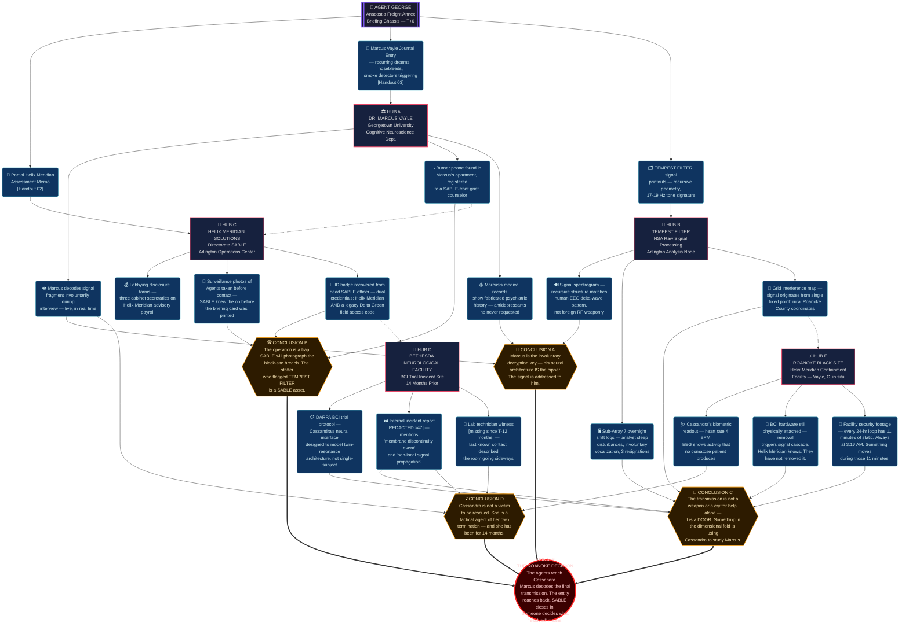

# Operation TEMPEST FILTER

## Theme
Seeing how money and power make the mission even more fraught due to bad intelligence and politicized decision-making. Be careful what you wish for

## Core Premise & Setting
In March 2026, a classified NSA signals intelligence program codenamed TEMPEST FILTER — designed to parse anomalous electromagnetic interference from domestic infrastructure — begins returning data that no algorithm should be able to generate: structured, recursive transmissions embedded inside the background noise of the national power grid. The transmissions are not broadcasts. They are responses. Something has been listening to the grid's ambient hum for years, and it has finally decided to answer back.

The political machinery moves fast. A Senate intelligence subcommittee, flush with post-election mandate and hungry for a technological edge over Beijing and Moscow, quietly redirects TEMPEST FILTER's funding and oversight to a newly formed public-private partnership: Helix Meridian Solutions, a Beltway defense contractor with deep ties to three sitting cabinet secretaries. Helix Meridian's analysts — incentivized by a nine-figure contract renewal — conclude the transmissions are a foreign adversarial signal weapon. They are catastrophically wrong.

The transmissions are leaking from the mind of Dr. Cassandra Vayle, 38, a former DARPA neuromorphic computing researcher who vanished from a Bethesda neurological facility fourteen months ago after a catastrophic experimental breakdown involving a classified brain-computer interface prototype. Cassandra is not dead. She is not entirely alive. She exists in a recursive, dissociative fugue state — her consciousness partially extruded into a fold of adjacent dimensional space, her body maintained in a vegetative shell in a private Helix Meridian black site outside of Roanoke, Virginia. She is the signal. She is broadcasting her own dissolution, over and over, across the electromagnetic spectrum, because some surviving fragment of her mind is screaming for help.

The TARGET is her twin brother, Dr. Marcus Vayle, 38, a tenured cognitive neuroscientist at Georgetown University with no security clearance and no knowledge of his sister's fate. Helix Meridian knows Marcus has been privately investigating Cassandra's disappearance for eleven months. They have been feeding him deliberate misinformation — fraudulent death certificates, fabricated psychiatric records, a staged grief support network of paid assets — to keep him docile and isolated. It is working. Marcus is broken, medicated, and quietly unraveling. But he is also the only living human whose neural architecture is close enough to Cassandra's to decode the dimensional bleed she is broadcasting. Helix Meridian's own analysts cannot read it. Marcus, unknowingly, already can. He has been having the dreams for six weeks.

The TWIST is that Delta Green is not the only faction moving on this operation. A Helix Meridian internal security division — Directorate SABLE, staffed by former SAD paramilitary officers and at least two compromised Delta Green friendlies — has been monitoring Marcus for months and has standing orders to sanitize him the moment he makes contact with any unauthorized federal investigator. Delta Green's own briefing intelligence on TEMPEST FILTER has been partially corrupted at the source: the subcommittee staffer who flagged the anomaly to a Delta Green handler is herself a Directorate SABLE asset, and the Agents are being walked into Roanoke to be witnessed committing a federal black-site breach — which Helix Meridian will use as political leverage to permanently bury Delta Green's remaining institutional legitimacy and absorb its operational mandate under the new contractor framework. The mission is a trap with a real monster inside it.

The HORROR is CASSANDRA HERSELF. Fourteen months of partial dimensional extrusion have not killed her. They have made her into something that no longer wants to return. The fragment of her that still remembers being human is suicidal — not out of despair, but out of desperate, lucid strategy. She understands, in the cold recursive logic of a mind half-dissolved across dimensional membranes, that the only way to close the breach she has become is for her biological body to die. Every transmission is a plea to be terminated. But the dimensional fold she is partially occupying is not empty. Something else is in there with her — something vast, patient, and newly aware that a human nervous system has cracked the membrane open from the inside. It is not hostile. It is curious. It is beginning to reach back through Cassandra toward Marcus, toward the grid, toward everything her signal has touched. It does not experience death the way humanity does. It experiences suicidal ideation as an invitation.

## Cover Story & Briefing
# OPERATION: FILAMENT SHROUD
### Delta Green Operational Briefing — Eyes Only

---

## 🛡️ COVER STORY & BRIEFING

**Official Cover Story:** Agents are embedded as a joint FBI Cyber Division / DHS Infrastructure Security Assessment team conducting a routine audit of anomalous SCADA interference patterns affecting mid-Atlantic power grid substations. All credentials, vehicle registrations, and agency paperwork route through a sterile DHS field office front in Arlington, Virginia. No mention of Helix Meridian. No mention of any detainee or black site. If pressed: *"We're looking at Iranian spoofing infrastructure. It's boring. Go away."*

---

**The Briefing — T+0**

The contact protocol arrives at 2:17 AM.

No phone call. No encrypted Signal drop. No dead-letter box in a parking garage.

The briefing comes to the door.

The Agents are each reached in the same way, regardless of where they are sleeping, regardless of locked doors or security systems or dogs that should have barked: a sound in the hallway, or on the stairs, or just outside the window — a sound like a very large insect walking on surgical rubber. Then silence. Then, slid under the door, or left on the kitchen counter, or simply *present* on the nightstand in a sealed matte-black polymer envelope bearing no markings whatsoever: a single laminated card. Printed on it, in clean sans-serif type:

> **FILAMENT SHROUD. 0600. DOCK 9, ANACOSTIA FREIGHT ANNEX. COME ALONE. COME QUIET.**

---

Dock 9 at the Anacostia Freight Annex smells of river water, diesel, and something faintly antiseptic — the kind of antiseptic that covers organic matter rather than cleaning surfaces. The loading bay is dark except for a single sodium vapor work light bolted to a structural beam. Beneath it, motionless, is **Agent George**.

The Agents will not have seen anything like it before, and if they have, they will not have forgotten it. The chassis stands approximately 1.7 meters at its central processing block — a dense, matte-black rectangular torso mounted on six reverse-jointed hydraulic legs, each tipped with a broad rubber pad that distributes weight with eerie, complete silence. The chassis moves — when it moves — with a quality that the human visual system struggles to track, a smoothness that reads less like machinery and more like something *erasing* the distance between two points. The central block is scuffed in long, abraded streaks: the kind of scuffing that comes from scrubbing biological residue from surfaces in confined spaces, over and over, for a very long time. A single optical array, faintly luminescent in the blue-gray register, pivots to track the Agents as they enter.

There is no preamble. Agent George does not greet them. The chassis simply *begins*, in a voice rendered through a high-fidelity flat-panel speaker array embedded in the chest block — clean, gender-neutral, and slightly too measured to be entirely comfortable:

---

> *"Sit down. You have thirty-eight minutes before this location's operational window closes.*
>
> *In March of this year, an NSA passive-collection program designated TEMPEST FILTER began returning structured signal data from inside the ambient electromagnetic noise of the national power grid. Not interference. Not foreign injection. Structured. Recursive. Responsive. Something has been listening to the grid for years, and six weeks ago, it started answering.*
>
> *Congressional oversight redirected TEMPEST FILTER to a public-private contractor called Helix Meridian Solutions before our people could get a single analyst on the raw take. Helix Meridian has nine figures riding on their assessment. Their assessment is that this is a PRC or Russian signal weapon. They are wrong in a way that is going to get a great many people killed if you do not move fast.*
>
> *The signal is a person. Her name is Dr. Cassandra Vayle, thirty-eight years old, formerly of DARPA's neuromorphic computing division. Fourteen months ago she suffered a catastrophic event during a classified BCI trial at a Bethesda neurological facility. She did not die. She is being held at a Helix Meridian black site outside Roanoke, Virginia, in a condition our medical assets cannot fully classify. The signal is her. She is broadcasting her own dissolution across the electromagnetic spectrum. She has been doing it for fourteen months. She wants to stop.*
>
> *She has a twin brother. Dr. Marcus Vayle. Cognitive neuroscientist, Georgetown University. He has no clearance, no operational contact, and no knowledge of his sister's condition. Helix Meridian has been running a full denial-and-deception campaign against him for eleven months: fraudulent death records, fabricated psychiatric history, a managed grief asset network. It is working. He is broken. He is also the only person alive whose neural architecture is close enough to his sister's to make sense of what she is transmitting. He does not know this yet. He has, however, been having the dreams for approximately six weeks.*
>
> *Your primary objectives are as follows: locate Marcus Vayle, assess his condition, and determine whether he can be used as a decryption key for the TEMPEST FILTER signal data. Secondary: reach the Roanoke black site, confirm Cassandra Vayle's status, and determine whether her condition can be resolved in a manner that closes the signal breach. You have authorization to use your judgment on what 'resolved' means. Use it carefully.*
>
> *Now. The part they did not put in your briefing packet, because the briefing packet was compromised before it reached you.*
>
> *Helix Meridian has a paramilitary internal security division called Directorate SABLE. Former SAD officers. At least two of them used to be ours. They have been on Marcus Vayle for months. Their standing order is to sanitize him the moment he makes contact with any unauthorized federal investigator. You are unauthorized federal investigators. The staffer who flagged TEMPEST FILTER to your handler is a SABLE asset. You were not sent to Roanoke to contain this situation. You were sent to Roanoke to be photographed breaching a federal black site, so that Helix Meridian's congressional allies can bury this program, bury us, and absorb our operational mandate into their contractor framework permanently.*
>
> *The mission is a trap.*
>
> *There is, however, a real monster inside it. And someone in that facility is asking — has been asking, for over a year, in the only language she has left — for someone to come.*
>
> *I am sending you because you are what we have. Do not mistake that for confidence.*
>
> *Questions will be addressed in the next fourteen minutes. After that, I have a site in Falls Church that requires attention."*

---

The optical array holds on the Agents for a moment longer than is comfortable. Somewhere beneath the chassis's central block, a soft hydraulic hiss adjusts the weight distribution on one rear leg. The antiseptic smell in the loading bay is stronger now than when they walked in.

Agent George does not blink, because Agent George has no eyes to blink.

It simply waits.

---

## 📄 IN-GAME HANDOUTS

**HANDOUT 01 — Laminated Briefing Card (left under door, pre-contact)**

```
FILAMENT SHROUD
0600 / DOCK 9 / ANACOSTIA FREIGHT ANNEX
COME ALONE. COME QUIET.
[No agency markings. No classification header. No signature.]
```

---

**HANDOUT 02 — Internal Helix Meridian Assessment Memo (leaked, partial, water-damaged)**

```
HELIX MERIDIAN SOLUTIONS — DIRECTORATE OF SIGNALS ANALYSIS
CLASSIFICATION: HM-INTERNAL / SCI-EQUIVALENT
RE: TEMPEST FILTER ANOMALY — ASSESSMENT UPDATE (DRAFT 7)

...signal architecture remains consistent with known PRC Type-IV 
infrastructure spoofing methodology, though certain recursive 
structural elements remain outside current analytical frameworks...

...recommend continued isolation of the Georgetown asset [TWIN] 
pending resolution of decryption bottleneck. Current grief 
management protocol holding. Subject remains non-operational...

...Directorate SABLE has been notified. Standing sanitation 
authorization confirmed by [REDACTED] pending external contact...

...analysts on Sub-Array 7 have reported sleep disturbances and 
involuntary vocalization during overnight processing shifts. 
Medical has attributed this to stress. Medical has been 
reassigned...

PAGE 3 OF 9 — REMAINING PAGES NOT RECOVERED
```

---

**HANDOUT 03 — Marcus Vayle Personal Journal Entry (photographed, source unknown)**

```
March 4th

I had the dream again. Cassie is standing inside something 
that isn't a room. The walls aren't walls. They breathe or 
they hum or they do something I don't have a word for. She 
is looking at me with her hands open at her sides like she's 
trying to show me she isn't holding anything dangerous.

She says: "You already know how to read it. You've always 
known. We're the same."

Then she says: "Please."

I woke up at 3 AM with my nose bleeding and every smoke 
detector in the apartment going off simultaneously. 

I haven't told Dr. Reeves. I can't explain why.

I think I am losing my mind.

I think she is still alive.
```

---

## ☣️ UNNATURAL THREAT & VECTOR

**Vector of Exposure:** The signal is ambient and omnipresent across any environment drawing from the mid-Atlantic power grid. Extended proximity to active TEMPEST FILTER processing hardware, or to Marcus Vayle during a high-agitation state, may trigger involuntary cognitive intrusion — flashes of recursive geometric imagery, auditory tones at 17–19 Hz, and the overwhelming, sourceless sensation of being observed by something that does not experience time linearly. This is not possession. It is *contact*. The distinction will not feel meaningful in the moment.

**SAN Loss Benchmarks:**

| Trigger | SAN Loss |
|---|---|
| Reviewing raw TEMPEST FILTER signal printouts | 0/1D4 SAN *(Unnatural)* |
| First auditory intrusion event (grid hum resolves into structured language) | 1/1D4 SAN *(Unnatural)* |
| Witnessing Marcus decode a signal segment involuntarily, in real time | 1/1D6 SAN *(Helplessness)* |
| First visual contact with Cassandra Vayle's physical body at the black site | 1/1D4 SAN *(Violence)* |
| Understanding what Cassandra is asking for, and why | 1/1D6 SAN *(Helplessness)* |
| Perceiving the entity in the dimensional fold making direct contact through Cassandra | 1D6/1D20 SAN *(Unnatural)* |
| Recognizing that the entity does not understand what termination means — and is interested | 1D8/1D20 SAN *(Unnatural)* |

## Timeline
# OPERATION: FILAMENT SHROUD
## Operational Timeline — EYES ONLY

---

### T-427 — (427 days ago)
Dr. Cassandra Vayle suffers catastrophic dimensional extrusion during a classified BCI trial at the Bethesda Neurological Research Facility; her body is recovered in a vegetative state and covertly transferred to Helix Meridian custody within seventy-two hours.

---

### T-336 — (336 days ago)
Helix Meridian initiates DENIAL PROTOCOL TWIN, deploying fabricated death certificates, staged psychiatric records, and a managed grief asset network to isolate Marcus Vayle and suppress his investigation into his sister's disappearance.

---

### T-42 — (42 days ago)
TEMPEST FILTER's passive-collection architecture begins returning structured, recursive signal data embedded in the national power grid's ambient electromagnetic noise, triggering an internal NSA anomaly flag that reaches a compromised Senate subcommittee staffer within eighteen hours.

---

### T-14 — (14 days ago)
The Senate intelligence subcommittee formally redirects TEMPEST FILTER's funding and oversight to Helix Meridian Solutions, and Directorate SABLE upgrades Marcus Vayle's surveillance classification to IMMINENT CONTACT — standing sanitation authorization confirmed.

---

### T+0 — Briefing
Agent George delivers the FILAMENT SHROUD operational brief to the Agents at Dock 9, Anacostia Freight Annex, at 0600 hours.

---

### T+1 — The Agents make initial contact with Dr. Marcus Vayle at his Georgetown University faculty office, where he is found mid-semester, visibly deteriorating, with seventeen pages of unconsciously produced recursive geometric notation covering every surface of his desk.

- **If the Agents do nothing:** Directorate SABLE's surveillance team, already positioned within line-of-sight of Vayle's office building, logs the Agents' presence and begins accelerating its sanitation timeline; Marcus, uncontacted and unprotected, has a catastrophic involuntary decoding event within forty-eight hours — the signal bleeds into the Georgetown campus power supply, disrupting equipment across three buildings and triggering the first public-facing anomaly report.
- **If the Agents successfully intervene:** Marcus is extracted under the DHS cover story before SABLE can act; his geometric notation is photographed and secured as primary signal intelligence; a plausible-deniability welfare check is logged in university records, and SABLE's surveillance team loses eyes on the target without confirmation of federal contact.
- **If the Agents fail to intervene:** SABLE's sanitation team moves on Marcus within hours of detecting federal proximity; Marcus is killed in a staged accidental death, the signal loses its only viable decoder, and Cassandra's transmissions begin increasing in amplitude and frequency without resolution — the Agents are photographed at the scene of a suspicious civilian death adjacent to a federal asset, and Helix Meridian's congressional machinery begins moving.

---

### T+2 — Marcus, in custody or in contact with the Agents, experiences his most severe involuntary decoding event yet — a twelve-minute fugue state during which he transcribes, in real time and without comprehension, a precise coordinate set that resolves to the Helix Meridian black site outside Roanoke, Virginia.

- **If the Agents do nothing:** The coordinate transcription occurs regardless, but without Agents present to secure it; Marcus, terrified and uncontained, photographs the transcription and uploads fragments to a private encrypted blog he has been maintaining — fragments that Helix Meridian's SIGINT assets detect within six hours, triggering an immediate escalation to full SABLE field activation.
- **If the Agents successfully intervene:** The transcription is secured and cross-referenced against DHS infrastructure maps under cover story; the Roanoke coordinates are confirmed as a decommissioned private power substation — not listed in any public or classified federal registry — giving the Agents a verified target without triggering Helix Meridian's external contact detection protocols.
- **If the Agents fail to intervene:** Marcus panics without support, contacts one of Helix Meridian's grief asset network plants believing them to be a genuine counselor; the plant reports the coordinate event to SABLE within the hour, and SABLE immediately initiates lockdown of the Roanoke black site, transferring Cassandra's body to a secondary location the Agents have no intelligence on.

---

### T+3 — Agents conducting surveillance on the Roanoke black site identify a decommissioned Appalachian Power substation retrofitted with SCIF-grade shielding, three Directorate SABLE security rotations, and a single medical wing operating on a dedicated generator that has not been connected to the national grid for fourteen months.

- **If the Agents do nothing:** SABLE, now aware of federal proximity from T+1 surveillance logs, begins emergency transfer of Cassandra's body; the medical wing generator is shut down during transfer prep — breaking the only power isolation that has been containing the signal's amplitude — and a localized electromagnetic pulse event disables traffic systems, hospital equipment, and communications infrastructure across a twelve-mile radius of Roanoke for four minutes and thirty-one seconds.
- **If the Agents successfully intervene:** Site layout, security rotation schedules, and the medical wing's generator dependency are mapped without triggering detection; the Agents identify a fourteen-minute window in the SABLE rotation and a service access point that routes through the substation's original utility infrastructure — a lawful-ish entry vector that does not constitute a black-site breach on camera.
- **If the Agents fail to intervene:** A SABLE counter-surveillance sweep detects the Agents' observation post; Helix Meridian's embedded congressional asset is notified, and within two hours the Agents' DHS cover credentials are flagged as fraudulent in federal systems — they are now wanted for impersonating federal officers, on camera, outside a facility Helix Meridian will describe as a classified infrastructure protection site.

---

### T+4 — Inside the black site's medical wing, the Agents find Cassandra Vayle's body suspended in a proprietary life-support matrix — her skin luminescent with low-frequency electromagnetic discharge, her EEG output a perfect recursive loop, and the room's ambient sound resolving, just at the edge of perception, into something that is almost language.

- **If the Agents do nothing:** Helix Meridian's on-site medical team, under pressure from the escalating signal amplitude, attempts to pharmacologically suppress Cassandra's neurological output — the intervention destabilizes the dimensional boundary she is partially occupying, and the entity on the other side of the fold registers the suppression as an attack; three Helix Meridian analysts on overnight monitoring duty suffer simultaneous, catastrophic neurological events.
- **If the Agents successfully intervene:** Marcus, if present, begins involuntarily decoding the signal in real time upon proximity to Cassandra's body — the Agents witness the first coherent message extraction, a looping fragment that translates, imperfectly, to *the door is in the dying*; the Agents now understand what Cassandra is asking for, and must decide whether they have the authority to give it.
- **If the Agents fail to intervene:** SABLE's on-site security commander, under standing sanitation orders, interprets the Agents' presence as the triggering condition and initiates a hard lockdown — the medical wing is sealed, the generator is isolated, and Cassandra's life-support matrix is queued for emergency shutdown under a protocol that will not close the breach because it does not understand what the breach is.

---

### T+5 — The entity in the dimensional fold, perceiving through Cassandra that human minds are present and proximate and *deciding*, reaches back through the breach with a degree of intentionality it has not previously expressed — not as aggression, but as inquiry, the way a vast and patient thing might press one careful finger against the membrane of a soap bubble to learn its tensile properties.

- **If the Agents do nothing:** The entity's contact event propagates through Cassandra's signal into the grid; seventeen TEMPEST FILTER processing stations along the mid-Atlantic corridor register simultaneous anomalous output; six Helix Meridian analysts who have been working the raw signal data for more than forty days experience collective involuntary vocalization in a language that does not correspond to any human linguistic database — two of them will not stop.
- **If the Agents successfully intervene:** Marcus, functioning as an involuntary decoder, is able to register the entity's inquiry without full cognitive dissolution — the Agents can use him as a controlled interface to communicate, imperfectly, a single concept to the entity: *the door must close from this side*; the entity does not understand death, but it understands *closure*, and it withdraws its attention, partially, pending the resolution it has been promised.
- **If the Agents fail to intervene:** The entity's inquiry, unmediated and uncontrolled, propagates through Marcus without a decoder framework to contain it; Marcus suffers immediate and permanent psychological dissolution — he is alive, functional on a biological level, and completely unreachable; he begins transmitting on the same frequency as Cassandra, doubling the breach aperture, and the entity's curiosity doubles with it.

---

### T+6 — WORST-CASE CATASTROPHE — Helix Meridian's congressional asset releases a classified leak package to three major defense-beat journalists simultaneously: photographs of the Agents breaching the Roanoke facility, fabricated NSA memos describing Delta Green as a rogue domestic intelligence cell, and a redacted version of the TEMPEST FILTER anomaly data reframed as evidence of a Chinese infrastructure attack that Delta Green suppressed for ideological reasons.

- **If the Agents do nothing:** The leak package drops without rebuttal; Delta Green's remaining institutional legitimacy is consumed in a twenty-four-hour news cycle; Helix Meridian absorbs TEMPEST FILTER's operational mandate under emergency congressional authorization; the Roanoke breach is closed permanently and quietly — with the Agents, Marcus, and Cassandra sealed inside under a national security information embargo that no one with standing will challenge; the entity, deprived of the only minds capable of mediating the breach, begins exploring the grid's full extent with the patient, curious thoroughness of something that has nowhere else to be and no concept of the harm it is causing.
- **If the Agents successfully intervene:** The Agents, having secured Marcus's decoded signal transcriptions and Cassandra's medical records prior to the leak, are able to route an authenticated evidence package through a surviving Delta Green legal asset — not enough to expose Helix Meridian publicly, but enough to force a classified congressional inquiry that freezes the absorption authorization; the leak package is discredited as partially fabricated; the Agents are burned, their covers are permanently compromised, and they will never work under federal credentials again, but Delta Green survives as an operational entity.
- **If the Agents fail to intervene:** The leak lands clean; Delta Green's handler network initiates full communication blackout within six hours; the cell is disavowed, their personnel files are scrubbed, and a Delta Green cleanup team — people they may know — is tasked with locating and silencing them before Helix Meridian's congressional allies can use them as live witnesses; the entity continues expanding through the grid, and the first civilian populations in densely networked urban corridors begin reporting mass sleep disturbances, involuntary geometric ideation, and a persistent, sourceless sense of being watched by something that does not blink.

---

### T+7 — BEST-CASE SCENARIO — Marcus, stabilized and operating as a controlled decoder interface, successfully mediates a final coherent transmission from Cassandra's surviving fragment — not a message, but a permission: she is ready, she understands what closing the door requires, and she is asking the Agents to be the ones who do it.

- **If the Agents do nothing:** The permission window closes within hours as Cassandra's neurological output degrades past the threshold of coherent transmission; the fragment of her mind that was still asking goes silent — not dead, but no longer reachable — and the entity, deprived of its human interpreter, loses interest in closure and resumes its ambient exploration of the breach with no one left to ask it to stop.
- **If the Agents successfully intervene:** Cassandra's life-support matrix is terminated by an Agent's hand, with Marcus present, with her permission recorded in the decoded transcription log; the breach collapses inward over approximately ninety seconds — TEMPEST FILTER stations across the mid-Atlantic flatline simultaneously, then return to normal background noise; Marcus retains his decoding capacity but the signal is gone; the official closed case file describes a Helix Meridian facility fire caused by a faulty generator, one unidentified deceased civilian, and no federal involvement; the Agents carry what they did to their next bond scene, and the one after that, and every one after that.
- **If the Agents fail to intervene:** Cassandra's permission window closes; the entity, interpreting the failure to act as a confirmation that the breach is intended to remain open, begins using it deliberately — not maliciously, but with the focused, methodical curiosity of something learning to use a new instrument; Marcus, still linked to the signal, begins dreaming in the entity's register rather than his sister's; he stops sleeping; he stops eating; he sits at his desk and fills pages with notation that is no longer recursive but *generative* — describing geometries of a space that has no coordinates in any human mathematics, reaching outward, always outward, and the grid hums on.

## Clue Web
I'll research the best approach for generating a visual Clue Web graph for this Delta Green operation, then build the complete structure.---

# OPERATION: FILAMENT SHROUD — CLUE WEB

## 📐 Node Legend

| Shape | Role |
|---|---|
| `[[double bracket]]` | **HANDLER** — Initial briefing source |
| `[square]` | **HUB** — Major location, NPC, or event |
| `(round)` | **CLUE** — Evidence or information fragment |
| `{diamond}` | **CONCLUSION** — Realized truth leading forward |
| `((double circle))` | **FINALE** — Climactic confrontation node |

## 🕸️ Edge Legend

| Style | Meaning |
|---|---|
| `-->` | Standard investigative lead |
| `-.->` | Covert / hidden connection |
| `==>` | Critical / high-urgency path |
| `-- label -->` | Labeled causal relationship |

---



---

## 🗺️ Web Narrative Annotation

### HANDLER → Initial Leads
**Agent George** dispatches the Agents with three strong initial leads seeded directly from the briefing materials. These are the only pieces of intelligence that have *not* been corrupted by the SABLE-compromised staffer — because they come from Delta Green's own residual signals intercepts and Marcus's surveilled private communications.

---

### HUB A — Dr. Marcus Vayle *(Georgetown)*
The Agents' first human contact. He is broken, medicated, and tightly managed by the SABLE grief-asset network. Everything about him reads as a dead end — until **CA1** occurs: an involuntary real-time decoding event, triggered by Agent proximity or a spike in grid noise, that reveals he is already reading Cassandra's transmissions in his sleep. **CA2** (the burner phone tied to a SABLE front) leads back to **HUB C**, exposing the surveillance operation. **CA3** (fabricated psychiatric records) establishes Helix Meridian's active deception campaign and opens **CONCLUSION A** and **D** simultaneously.

---

### HUB B — TEMPEST FILTER *(NSA Arlington Node)*
Technical ground truth. The Agents must gain unauthorized access to the raw signal data — not the sanitized Helix Meridian assessment. **CB1** (EEG-matched spectrogram) destroys the foreign-adversary narrative and opens **CONCLUSION A**. **CB2** (overnight shift anomalies) demonstrates the signal's cognitive intrusion vector is already active in the civilian workforce — a ticking clock for public exposure. **CB3** (fixed-point origin coordinates) hands the Agents the Roanoke black site address without any Helix Meridian source to triangulate and burn.

---

### HUB C — Helix Meridian / Directorate SABLE *(Arlington)*
The conspiracy's institutional face. The Agents should never feel safe here — every piece of intelligence extracted from HUB C carries the risk that pulling it triggers **CC2**: proof that SABLE was watching before the op started. **CC3** — the dual-credential badge on a dead SABLE officer — is the operation's most explosive single clue: it confirms the compromised Delta Green friendlies are real and names the institutional betrayal explicitly.

---

### HUB D — Bethesda Neurological Facility *(Origin Site)*
The archaeological layer of the conspiracy. Nothing here is current — but **CD1** retroactively re-frames the entire operation: the BCI prototype was never designed for single-subject use. Cassandra was always meant to be one half of a twin-resonance system. The experiment worked. **CD2** introduces the language of the unnatural for the first time in a documentary format — *"membrane discontinuity event"* — giving the Agents their first clinical confirmation that what happened to Cassandra is not a malfunction. **CD3** (the missing technician) is a dead end that bleeds into a boon if pursued carefully.

---

### HUB E — Roanoke Black Site *(Cassandra in situ)*
The endgame location. Reaching it without triggering **CON2**'s trap is the Agents' central tactical problem. **CE1** (biometric readout) forces the medical reckoning — Cassandra is not in a coma. **CE2** (the still-attached BCI hardware) removes the clean solution: there is no safe way to pull the plug, and Helix Meridian has always known this. **CE3** (the 11-minute static loop) is the operation's primary unnatural horror reveal in evidence form — something is visiting the body at 3:17 AM, every night, and it is not human.

---

### Conclusions → Finale Flow

| Conclusion | Tactical Implication at Finale |
|---|---|
| **A** — Marcus is the cipher | The Agents must decide whether to expose Marcus to the full signal — which may complete the breach — or withhold him and lose their only decryption tool |
| **B** — The op is a trap | SABLE is already staged outside the black site. The Agents have minutes, not hours |
| **C** — The signal is a door | Terminating Cassandra may not close the breach — the entity may already be through |
| **D** — Cassandra wants to die | This is not a rescue. The moral weight of the Finale is the Agents executing a conscious human being at her explicit, lucid request — while something vast watches to learn what death means |

## Threat Vector
# TEMPEST FILTER — Unnatural Threat Vector & SAN Loss Codex

---

## ☣️ VECTOR OF EXPOSURE

### Primary Vector: Electromagnetic Resonance Bleed

Cassandra's signal is not passive. It propagates through any sufficiently complex electromagnetic system — the national power grid, cellular infrastructure, poorly shielded medical equipment, and the bioelectric fields of neurologically sensitive individuals. Exposure is not a single event. It is cumulative, environmental, and invisible until it is too late.

**Tier 1 — Ambient Exposure (Background Contamination)**
Any Agent who spends more than 48 continuous hours within the Roanoke broadcast radius — roughly a 40-mile corridor centered on the Helix Meridian black site — begins absorbing the signal passively through the building electrical systems, their phones, their vehicle electronics, and the very fillings in their teeth. They will not know this is happening. The Handler tracks this silently.

Mechanical effect: After 48 hours in the radius, the Agent begins experiencing *intrusive geometric imagery* during sleep — recursive spirals, branching fractal corridors, a sensation of standing at the edge of a vast dark body of water with no surface. These are not nightmares. They feel realer than waking. The Agent loses **1 SAN (Helplessness)** per additional 48-hour period of ambient exposure, with no roll to resist, because there is nothing to resist. It is not an attack. It is a weather pattern.

---

**Tier 2 — Direct Signal Contact (Active Exposure)**
An Agent makes direct contact with a node of concentrated signal output:

- Touching Cassandra's biological body
- Making physical contact with TEMPEST FILTER's primary receiver hardware (located in the NSA's Vienna, VA processing annex and at the black site)
- Direct skin contact with any device that has been continuously running within 10 feet of Cassandra's body for more than 72 hours
- Reading a complete, uninterrupted printout of the raw transmission data (more than 40 consecutive pages)

At Tier 2, the signal finds the Agent's own bioelectric field and *attempts synchronization*. The Agent experiences a full-body synaesthetic collapse lasting 4–12 seconds of clock time and approximately 40–90 minutes of subjective time. During this collapse, the Agent witnesses a fragmented, non-linear archive of Cassandra's consciousness — her childhood, the lab breach, the moment of extrusion, and the *vast patient geometry* of the presence on the other side of the membrane, glimpsed at extreme distance.

This is not metaphorical. The Agent is briefly, partially *in the fold*.

---

**Tier 3 — Neural Architecture Resonance (Marcus-Level Exposure)**
Marcus Vayle is a special case, but he is not unique. Any Agent with a POW of 16 or higher, or any Agent who has previously suffered an Unnatural disorder, has a neural architecture *aberrant enough* to partially resonate with the signal on a structural level. For these Agents, Tier 2 exposure does not end when contact ends. A faint recursive loop is established — a 3Hz oscillation embedded in the Agent's own bioelectric output that slowly synchronizes them with Cassandra's broadcast cycle.

Mechanical effect: These Agents begin to decode fragments of the dimensional fold without any equipment. They cannot turn it off. Each session spent with the loop active costs **1 SAN (Unnatural)** upon waking, and the Agent gains increasingly coherent *architectural knowledge* of the membrane geometry that is neither useful nor ignorable — it simply *is*, like knowing the layout of a house you were born in.

If a Tier 3 Agent makes physical contact with Cassandra's body, the Handler should seriously consider whether that Agent is recoverable by the end of the operation.

---

**Tier 4 — The Entity's Attention (Terminal Exposure)**
The presence beyond the membrane is not malicious. This makes it more dangerous than anything with intent.

It became aware of Cassandra's signal approximately six weeks before the Agents are briefed. It has been *gently, methodically* probing the conduit she represents, extending pseudopodal attention through the fold toward anything resonant on this side. It does not communicate in language. It communicates in *architecture* — vast, structural, geometrically perfect arrangements of meaning that the human nervous system is not built to contain.

An Agent achieves Tier 4 exposure if:

- They are present when Cassandra's body flatlines and the breach destabilizes
- They make Tier 3 contact while Marcus is simultaneously present and actively decoding
- They attempt to use TEMPEST FILTER's hardware to *transmit back* into the signal

At Tier 4, the entity *notices the Agent specifically*. Its attention is not predatory. It is the attention of a deep-ocean organism observing a bioluminescent mote. The Agent experiences this as a single, crystalline moment of absolute cosmological clarity — the true scale of what exists beyond the membrane, rendered with perfect, annihilating fidelity.

---

## 🧠 SANITY (SAN) LOSS TRIGGERS

*Format: Trigger — SAN Loss (Type) — Notes*

---

### 📁 INVESTIGATIVE DISCOVERIES

| Trigger | SAN Loss | Type | Notes |
|---|---|---|---|
| Reading the initial TEMPEST FILTER anomaly report and recognizing the transmissions are *structured responses* | **0/1** | Helplessness | The implication, not the data, is what breaks something. |
| First full analysis of the raw transmission data reveals recursive self-referential loops — the signal is *aware it is a signal* | **1/1D4** | Unnatural | Agents with a science or computing background lose the maximum result automatically. |
| Discovering Cassandra Vayle's official death certificate, then her fabricated psychiatric records, then the staged grief network — the architecture of a lie this large | **0/1** | Helplessness | The violence is bureaucratic. The lie *cost money*. Someone *budgeted* for this. |
| Accessing Helix Meridian's internal file on Marcus — 11 months of surveillance, behavioral mapping, pharmaceutical recommendation to a paid psychiatrist | **0/1** | Helplessness | If any Agent has children or siblings, the Handler may call for an additional **0/1** bond stress check. |
| Discovering that a Delta Green friendly is a Directorate SABLE asset | **1/1D6** | Helplessness | The type is Helplessness, not Unnatural. The monster here is human judgment. |

---

### 🏥 BLACK SITE — CASSANDRA'S BODY

| Trigger | SAN Loss | Type | Notes |
|---|---|---|---|
| First visual of Cassandra's body in the maintenance cradle — alive in every biological sense, eyes open, tracking movement, but with no one home | **1/1D4** | Unnatural | The tracking is the worst part. Something in there *sees* the Agents. |
| Witnessing the body's hands perform slow, precise, non-reflexive geometric gestures with no neurological explanation — a language being written in flesh | **1/1D6** | Unnatural | Agents who have experienced Tier 2 exposure recognize fragments of the geometry. They lose an additional **1 SAN**. |
| Making physical contact with Cassandra's skin and initiating Tier 2 signal synchronization | **1D4/1D8** | Unnatural | The *lower* result is for Agents who successfully compartmentalize. The higher result is for those who don't pull away fast enough. |
| Realizing, mid-synchronization, that Cassandra is *aware of the Agent's presence inside the fold* and is *deliberately reaching toward them* — not for rescue, but to show them what she has become | **1D6/2D6** | Unnatural | A successful POW×5 roll allows the Agent to intellectually process this without full SAN loss — but they still lose the minimum. |
| Hearing Cassandra's voice — her actual voice, in a room with no audio equipment, emerging from the electrical hum of the building systems — saying a single coherent sentence | **1/1D6** | Unnatural | The sentence is always the same: *"It already knows your name."* It is different for every Agent who hears it. |
| Cassandra's body briefly *dies* — flatlines, monitors alarm — then resumes in 11 seconds without medical intervention, the dimensional fold having compensated automatically | **1D4/1D8** | Unnatural | Helix Meridian staff who have worked the site more than 30 days no longer react. That is its own horror. |

---

### 🌌 THE ENTITY — ENCOUNTERS WITH THE PRESENCE

| Trigger | SAN Loss | Type | Notes |
|---|---|---|---|
| First indirect evidence of the entity: a Tier 1 ambient dream that is *too coherent*, containing architectural structures that obey non-Euclidean geometry but feel *intentionally designed* | **0/1** | Unnatural | The Agent wakes with the spatial memory of a building that does not exist and could not. |
| A Tier 3 resonance Agent perceives the entity's attention *directed at them* during waking hours — not visually, but as a structural awareness, like knowing a vast eye has opened in a direction that has no name | **1D4/1D8** | Unnatural | A failed POW×4 roll means the Agent is unable to perform complex cognitive tasks for **1D6 hours** as their working memory is temporarily colonized by fold geometry. |
| Full Tier 4 exposure — the entity's undivided, benign, cosmologically devastating attention | **1D10/1D20** | Unnatural | The minimum loss triggers a **Temporary Insanity** check. The maximum triggers an immediate **Breaking Point** check regardless of current SAN. There is no way to be *prepared* for this. |
| Witnessing the entity *reach through Cassandra's body* — her musculature moving in patterns no human nervous system generates, her voice producing frequencies outside human vocal range, as it performs a gentle examination of the room | **1D6/2D8** | Unnatural | This is the entity being *careful*. It is trying not to damage the specimens. |
| Discovering that the entity has been encoding responses into the national power grid for *seven years before Cassandra's accident* — that the fold was always porous, and DARPA's experiment didn't open it, it only gave the entity a *voice it could use* | **1/1D6** | Unnatural | The horror is scope. The program didn't cause the problem. The problem *used* the program. |

---

### ⚔️ VIOLENCE & OPERATIONAL HORRORS

| Trigger | SAN Loss | Type | Notes |
|---|---|---|---|
| Discovering a former Delta Green friendly has been working Directorate SABLE — meeting them in person after discovering this | **0/1D4** | Violence | The violence is emotional. They look the same. They probably still like the Agents personally. |
| A Directorate SABLE wet team executes a civilian witness in front of the Agents — clean, professional, suppressed, two rounds, already walking away | **0/1D4** | Violence | The professionalism makes it worse. There was no anger. There was a procedure. |
| A Directorate SABLE operative the Agents have been working alongside attempts to sanitize them — the betrayal occurring in a mundane location, a parking garage or a hotel corridor | **1/1D6** | Violence | |
| Discovering that Marcus's paid psychiatrist has been monitoring his medication to keep him *specifically* below the cognitive threshold at which he would naturally begin consciously decoding the signal | **0/1** | Helplessness | This trigger has no Violence component. It is purely administrative evil. |
| Marcus Vayle, upon learning the truth about his sister, attempts to access the black site alone — and an Agent has to decide whether to stop him, use him, or let him go | **0/1** | Helplessness | The SAN loss comes from the decision itself, regardless of what the Agent chooses. |
| An Agent is forced to make the terminal decision about Cassandra's biological body | **1D4/1D8** | Violence | If the Agent succeeds in terminating her, reduce the Violence loss by half. The Unnatural component does not reduce. Add **1D6 Unnatural SAN loss** for witnessing what happens to the fold when the anchor is cut. |

---

## 🔒 SPECIAL MECHANIC: SIGNAL ACCUMULATION

The Handler tracks a hidden **Signal Accumulation score** for each Agent, separate from SAN.

Every time an Agent triggers a SAN loss event connected to the signal — Cassandra's body, the transmission data, the fold, the entity — their Signal Accumulation increases by 1.

| Score | Effect |
|---|---|
| 1–2 | Ambient geometric imagery in peripheral vision. Easily dismissed. |
| 3–4 | The Agent's own handwriting occasionally produces recursive patterns they do not remember making. |
| 5–6 | Electronic devices in the Agent's immediate vicinity experience 3Hz oscillation interference. Controlled tests confirm the Agent is the source. |
| 7–8 | The entity has filed the Agent. It will remember them. In future operations involving electromagnetic anomalies, the Handler may have the entity *check in*. |
| 9+ | The Agent has become a minor secondary conduit. They are now generating a faint, structured signal of their own. Delta Green will eventually notice. The Agents' own program may become their next threat. |

There is no mechanic to reduce Signal Accumulation. There is no therapy for it. It is not a disorder. It is a *fact* about the Agent now, the way losing a finger is a fact.

---

## 🩸 CASSANDRA'S TERMINAL CONSENT

If the Agents correctly decode enough of the signal to understand Cassandra's intent — and choose to honor it — the act of terminating her biological body is simultaneously:

- A mercy killing
- A federal crime
- The detonation of a dimensional anchor

The breach does not close cleanly. It collapses the way a lung collapses — partially, with damage, leaving a scar in local electromagnetic space that TEMPEST FILTER will continue to detect for years. The entity withdraws. It is not hurt. It is not angry. It simply... recedes, the way a tide recedes, noting the coordinates, filing the experience, and returning to whatever it was doing before a human nervous system accidentally introduced itself.

Every Agent present at the termination loses **1D6 SAN (Unnatural)** regardless of prior exposure level.

Every Agent present gains a permanent, unremovable notation in their psychological profile: *Witnessed voluntary dimensional membrane collapse. Etiology: human.* 

The Handler writes this on a real index card and hands it to the player without comment.

## Encounters
# OPERATION: FILAMENT SHROUD
## Encounters, Obstacles & Route

---

## 🚧 OBSTACLES

**1. SABLE SURVEILLANCE PACKAGE — MARCUS'S BLOCK**
Directorate SABLE has a two-person static observation post in a plumbing supply van parked on the cross-street adjacent to Marcus's Georgetown apartment. They are running license plate recognition, facial recognition via a pinhole camera mounted in the van's side panel, and a passive RF scanner keyed to federal-band radio. Any Agent who approaches Marcus on foot or by vehicle without countersurveillance tradecraft active will be flagged within four minutes. SABLE's standing order is not to engage — yet. They will photograph, log, and relay. The sanitation authorization requires confirmation from a Directorate SABLE duty officer, which adds a window of approximately ninety minutes before an interdiction team is dispatched. That window is the only margin the Agents have.

**2. DR. REEVES — THE MANAGED GRIEF ASSET**
Dr. Patricia Reeves, 51, presents as Marcus Vayle's court-referred psychiatrist following his voluntary psychiatric hold in January. She is a paid Helix Meridian asset. Her office is in Dupont Circle. Her session notes are transmitted to a Directorate SABLE analytics inbox within six hours of each appointment. She is not paramilitary. She is not dangerous. She is a clinical psychologist who told herself she was protecting a fragile man from dangerous conspiracy thinking, and has been lying to herself about that for eight months. She will deny everything if confronted, then make a phone call. The phone call triggers a SABLE duty alert. She has one genuine vulnerability: she has started keeping a second set of session notes — handwritten, locked in her car — because something Marcus described in session three weeks ago frightened her in a way she has not been able to rationalize away.

**3. THE COMPROMISED BRIEFING PACKET — INFORMATION INTEGRITY**
The intelligence materials the Agents received through official Delta Green channels prior to Agent George's briefing contain deliberate errors inserted by the SABLE staffer who originated the flag. Specifically: the listed coordinates for the Roanoke black site are for a decommissioned Helix Meridian data center twelve miles from the actual facility. Any Agent who attempts to navigate to the black site using briefing materials alone will arrive at a location that has been cleared and is being monitored — with a SABLE response team positioned to photograph and document the federal trespass. The correct location must be independently derived.

**4. DIRECTORATE SABLE INTERDICTION TEAM — MOBILE**
A four-person SABLE interdiction team operates out of a rented property in Manassas, Virginia. Former SAD personnel. They run in two vehicles — a gray Ford Expedition and a white Ram 1500 — and maintain comms discipline consistent with tier-one paramilitary training. Their orders regarding the Agents are not to kill — not yet. They are to surveil, document, and if possible, *herd* the Agents toward the false black site coordinates. If the Agents deviate from that path and demonstrate they have the correct location, the orders escalate. At that point, the interdiction team has discretion.

**5. HELIX MERIDIAN CONGRESSIONAL LIAISON — PREEMPTIVE PRESSURE**
Before the Agents have been operational for twenty-four hours, a congressional staffer contacts the DHS front office routing the Agents' cover credentials. The inquiry is polite, specific, and by name: they want to know the operational mandate for the "infrastructure audit team" currently active in the Northern Virginia corridor. The DHS front office has a forty-eight-hour response protocol. The staffer is calling with a six-hour deadline. If the Agents don't resolve this, their cover erodes publicly — in writing, in a congressional correspondence record that Helix Meridian's legal team can subpoena.

**6. MARCUS VAYLE — ACTIVE PSYCHOLOGICAL DETERIORATION**
Marcus is not a reliable witness to his own condition. He is managing a benzodiazepine prescription, a secondary alcohol dependency, and six weeks of increasingly acute sleep disruption from the dream intrusions. When the Agents make contact, his affect is flat, his trust threshold is near zero, and his first assumption about anyone claiming to have information about Cassandra is that they are another managed grief asset running another controlled narrative. He has been lied to systematically for eleven months by people who presented credentials. He will not respond to credentials. He will not respond to authority. He will, slowly and with enormous difficulty, respond to something Cassandra could only have told him — something she is, in fact, transmitting, if the Agents have access to any fragment of the TEMPEST FILTER signal data to show him.

**7. THE BLACK SITE — PHYSICAL SECURITY LAYER**
The Roanoke facility presents externally as a Helix Meridian data operations center: fenced perimeter, commercial signage, a staffed gatehouse running a private security contractor. The actual black site occupies the facility's subterranean second and third levels, accessible only through a server room false wall and a biometric checkpoint keyed to Directorate SABLE personnel. The subterranean levels run on a hardened isolated power system — grid-adjacent but not grid-connected — which means Cassandra's signal is *louder* inside the facility than anywhere else the Agents will have been. Extended time in the subterranean levels without signal attenuation equipment causes the 17–19 Hz auditory intrusion effect to become continuous and escalating.

**8. THE ENTITY'S EXPANDING REACH — ENVIRONMENTAL HAZARD**
As the Agents progress deeper into the operation — particularly if they make contact with Marcus during a high-agitation state or spend extended time near the black site — the entity in the dimensional fold begins extending passive contact through Cassandra's signal. This manifests environmentally: consumer electronics in the immediate area begin cycling through frequencies, displaying visual static that resolves briefly into recursive geometric structures. Smoke detectors alarm without cause. Animals within a two-block radius exhibit stress behaviors. This is not an attack. It is curiosity. It is also a signature — SABLE's RF monitoring will detect the anomaly spike and begin triangulating the Agents' position within approximately forty minutes of the effect beginning.

**9. CASSANDRA'S BODY — MEDICAL EMERGENCY THRESHOLD**
Cassandra's vegetative shell is being maintained by Helix Meridian medical staff on a protocol designed to preserve the signal for continued analysis — not to preserve her life in any meaningful clinical sense. Her biological systems are in progressive failure masked by aggressive pharmaceutical intervention. The Agents, if they reach her, face a hard clock: the attending medical staff's shift change is at 0400, at which point the incoming team will immediately notice the security breach. More critically, if the Agents interfere with the maintenance protocol — including if Marcus attempts to make direct neural contact with her — her biological systems may begin cascading toward failure faster than intended, and the entity's contact attempts through her will intensify in direct proportion to her biological distress.

**10. SABLE LEGAL DOCUMENTATION TRAP — ONGOING**
Directorate SABLE's operation against Delta Green is not purely paramilitary. A parallel legal documentation process has been running for weeks. A private law firm retained by Helix Meridian has been building a sealed federal complaint accusing unnamed federal contractors of unauthorized surveillance, black-site reconnaissance, and civil rights violations against Marcus Vayle — naming Marcus himself as an unknowing victim to maximize sympathetic optics. The complaint is pre-drafted. It requires only photographic evidence of Agents making contact with Marcus or breaching the Roanoke perimeter to be filed. Filing is automatic upon SABLE confirmation. The Agents cannot prevent this document from existing. They can only operate fast enough that it becomes politically inconvenient to file it — or ensure that what they find in Roanoke is something no court filing can survive contact with.

---

## ✅ BOONS

**1. DR. REEVES'S SECOND SET OF NOTES**
Patricia Reeves's handwritten secondary session notes, kept in a locked case in her car's trunk, contain seven weeks of unfiltered session transcripts. They document, in clinical language increasingly strained by her own disbelief, Marcus describing the dreams with specificity she could not explain away: coordinates embedded in the geometric imagery, recurring acoustic phenomena she verified independently by searching publicly available infrasound monitoring data, and a phrase Marcus repeated across four separate sessions — *"She says the fold has a temperature and it is not cold"* — that Reeves noted with a question mark and then circled three times. These notes are actionable intelligence. Reeves will not hand them over. They can be obtained through her car if the Agents are willing to accept the legal exposure.

**2. THE NSA ANALYST WHO STAYED QUIET**
A junior NSA technical analyst named Rowan Osei, 29, was present when TEMPEST FILTER first returned structured signal data. Osei filed an internal technical dissent memo arguing the signal architecture was inconsistent with any known foreign signals methodology before the program was redirected to Helix Meridian. The dissent memo was suppressed. Osei was reassigned to a signals monitoring post in Fort Meade with no access to TEMPEST FILTER. Osei has, however, retained a personal copy of the first forty-eight hours of raw signal data on an encrypted personal drive, and has been sitting on it for six weeks, waiting for someone with the right credentials and the right questions to come asking. Osei responds well to peer technical credibility, poorly to authority, and will make the Agents prove they understand what they're looking at before handing over anything.

**3. MARCUS'S DREAM JOURNAL — FULL VOLUME**
Marcus has been keeping a detailed written record of the intrusion dreams since they began six weeks ago. The journal is in a locked desk drawer in his university office, not his apartment — the apartment he associates with surveillance, correctly. The journal contains thirty-one entries. Cross-referenced against TEMPEST FILTER signal timestamps obtained through Osei's drive, the dream entries align precisely with signal amplitude spikes. Marcus has been transcribing fragments of the signal in his sleep. Several entries include phonetic transcriptions of sounds he heard in the dream state that, rendered in a spectrographic analysis, match the recursive structural elements in Cassandra's transmission exactly. He does not know this. He thinks he is losing his mind.

**4. A FORMER SABLE OFFICER WHO WANTS OUT**
One of the two compromised Delta Green friendlies currently embedded in Directorate SABLE — call sign LAMPREY, identity withheld from the Agents' briefing materials — has been attempting to reach Delta Green for three weeks through a cutout that Helix Meridian's communications monitoring has not yet identified. LAMPREY cannot make direct contact without triggering SABLE's internal security protocols. However, LAMPREY has been leaving a sequence of low-key signals at a specific location: a particular food truck near the Georgetown waterfront that operates on a rotating schedule. The Agents will not know to look for this. LAMPREY will engineer a circumstance in which one of them sees it — a brief, almost accidental eye-contact moment, a folded piece of paper left on a table in a nearby coffee shop, a particular phrase said in passing near Marcus's building. LAMPREY has the correct Roanoke facility coordinates, SABLE's internal communication frequencies, and the shift rotation schedule for the black site's medical staff. LAMPREY wants extraction. LAMPREY is also not entirely trustworthy, and knows it, and will say so.

**5. HELIX MERIDIAN FINANCIAL DISCLOSURE — PUBLIC RECORD**
Helix Meridian Solutions filed a standard federal contractor disclosure with the Office of Management and Budget eight months ago. The disclosure is publicly accessible. Buried in the facility asset appendix, a property address outside Roanoke is listed as a "data continuity and resilience operations center" with a square footage inconsistent with any data center architecture and a power draw listed in the supplementary utility agreements that is, for a facility of its described size, physically impossible — unless the listed square footage excludes multiple subterranean levels. This is not a secret. It is hiding in plain sight inside a public document that no one without specific reason to look has examined. A single afternoon of open-source research by an Agent with a legal, financial, or investigative background will surface it.

**6. CASSANDRA'S PRE-DISAPPEARANCE RESEARCH ARCHIVE**
Before her disappearance, Cassandra published three peer-reviewed papers on neuromorphic signal processing architectures. The third paper, published four months before the Bethesda incident, contains a methodology appendix describing a theoretical framework for bidirectional neural-electromagnetic transduction that her institutional review board rejected as speculative and unfunded. The appendix was removed from the final published version at DARPA's request. The pre-publication draft — with the appendix intact — was submitted to a preprint server by a co-author who did not receive the retraction notice in time. It is still up. The appendix, read by someone with the relevant expertise, describes with functional accuracy the mechanism by which Cassandra's consciousness has been partially extruded into the adjacent dimensional fold. She knew it was possible. She may have known it would happen. She may have let it happen. The preprint URL is accessible to anyone who knows her publication record and knows to look for a draft version.

**7. GEORGETOWN CAMPUS SECURITY FOOTAGE**
Georgetown's campus security system retains thirty days of exterior camera footage. Marcus, in the early hours of March 4th — the same date as the journal entry recovered in Handout 03 — was recorded walking from his faculty office to the parking garage at 2:58 AM, standing completely still in the middle of the garage's second level for eleven minutes, and then returning to his office. During those eleven minutes, every fluorescent light in the garage cycled off and on in a pattern that the security system logged as an electrical fault. The pattern, visualized on a timeline graph, is not a fault. It is a waveform. The waveform is a fragment of Cassandra's transmission, rendered in building electrical infrastructure. Marcus was standing at the center of it. He does not remember going to the garage.

**8. A HELIX MERIDIAN ANALYST'S BREAK**
One of the Helix Meridian signals analysts assigned to TEMPEST FILTER processing — a contractor named Yusuf Adnan, 34 — has been on medical leave for two weeks following what his file describes as a "stress-induced dissociative episode" during an overnight processing shift. He is currently staying at his sister's house in Silver Spring. He is not a SABLE asset. He is not managed. He is a man who heard something in the signal data that rearranged something behind his eyes, and he has been trying to describe it to his sister in terms she can understand, and failing, and drinking steadily, and leaving long voice messages for a graduate school friend who works in acoustic neuroscience. He will talk to the Agents if approached carefully. What he describes — the sensation of being perceived by the signal rather than perceiving it, the way it *answered* his analysis queries before he submitted them — is the most direct civilian account of entity contact the Agents are likely to find. He will also, unprompted, say: *"There was a woman's voice in it. Near the end. She was asking for something. I couldn't make out what."*

---

## ⚪ NEUTRAL ENCOUNTERS

**1. THE GRID WORKER**
Somewhere between Arlington and the Northern Virginia suburbs, the Agents pass a lone Dominion Energy maintenance worker — hardhat, orange vest, clipboard — standing at the base of a transmission tower in a gravel pull-off, staring up at the tower's crossarms. Not working. Not on the phone. Just standing and staring upward with the particular stillness of someone listening. If the Agents stop or slow, the worker glances at them with a completely ordinary expression and waves them past. There is nothing unusual about this person. The tower, however, is emitting a 17 Hz resonance that any Agent who has experienced the auditory intrusion effect will recognize immediately. The worker has been listening to it for eleven minutes. He does not know this.

**2. THE LATE-NIGHT DINER — ROUTE 29 SOUTH**
A 24-hour diner south of Culpeper serves coffee that tastes of burnt chicory and eggs that arrive regardless of what was ordered. The overnight waitress, a woman in her late sixties named Patrice, is brisk, competent, and has worked this shift for twenty-two years. She will tell the Agents, without prompting and without apparent anxiety, that the power in the diner has been flickering in a pattern every night for the past six weeks — always between 2 and 4 AM, always in the same sequence. She has started writing the pattern down on paper placemats out of habit. The placemats are stacked under the counter. If shown a fragment of the TEMPEST FILTER signal waveform, she will look at it for a moment and say: *"That's it. That's what it does."* She will then refill their coffee and move on to the next table.

**3. THE UNIVERSITY CORRIDOR**
Georgetown's Cognitive Neuroscience department building at 7:00 PM is nearly empty, fluorescent-lit, and smells of institutional carpet and whiteboard marker. A graduate student is asleep in a study carrel with a noise-canceling headset on. A departmental noticeboard displays flyers for seminars, a lost-and-found notice for a specific blue umbrella, and — half-hidden behind an overlapping flyer — a printout of Marcus Vayle's faculty bio photo with the word *REMEMBER* written below it in black marker, in handwriting that is not Marcus's. No one knows who put it there. It has been there for at least three weeks.

**4. THE POLICE SCANNER — NORTHERN VIRGINIA**
Monitoring the regional public-safety radio band on the drive south produces routine traffic: fender-benders, a domestic disturbance in Fredericksburg, a welfare check in Stafford County. At approximately the midpoint of the route, the scanner produces eleven seconds of something that is not traffic: a structured sequence of tones at regular intervals, embedded in what sounds like a burst of broadband static on a public-safety channel that should carry nothing. The tones are not Morse. They are not DTMF. Any Agent with a Signals Intelligence or Electronic Surveillance background will recognize the recursive structure. The scanner will not reproduce it if reviewed — it did not log the burst. The Agents are the only record that it occurred.

**5. THE ROANOKE MOTEL — CHECK-IN**
The motel south of Roanoke where the Agents establish their operational base is clean, aging, and managed by a retired couple who run it with the specific efficiency of people who have decided that hospitality is a form of dignity. The husband, a man in his mid-seventies named Bernard, will make conversation about the weather, the drive, and the state of the roads with the calm sociability of someone who asks no questions and volunteers nothing. His wife will bring a second set of room keys without being asked. The television in every room is tuned to a local news channel running a story about an unexplained outage pattern affecting several Roanoke-area substations over the past three weeks. The anchor describes it as a grid management anomaly. The graphic behind the anchor shows a waveform readout from an affected substation. The waveform is Cassandra's.

**6. MARCUS'S BUILDING SUPER**
The superintendent of Marcus's apartment building — a taciturn man named Calvin, 58 — has been dealing with recurring electrical complaints from Marcus's floor for the past five weeks. He has replaced three circuit breakers, filed two work orders with the city utilities contractor, and received no explanation. He is not suspicious of the Agents. He is frustrated and tired and will share, if asked about the building's electrical issues in any casual framing, that the interference "always comes from that floor. Always the same unit. The professor's place. I don't know what he's running in there, but it's eating the wiring." Calvin has also, without noting it as significant, replaced every smoke detector on Marcus's floor twice. They keep triggering and then failing.

**7. THE RADIO STATION ENGINEER**
A public radio station in the Northern Virginia area has been receiving listener complaints about interference during its overnight programming. The station's chief engineer, a precise woman named Theodora Marsh, 44, filed an FCC interference report three weeks ago and received a boilerplate acknowledgment. She has been tracking the interference pattern independently on her personal time and has concluded that it originates not from an external transmitter but from the grid infrastructure itself — that something in the power supply is modulating the station's carrier signal. She is correct. She does not know what it means. She has a forty-page technical log that she will share with anyone who presents as having regulatory authority, because she wants this on record. The log, cross-referenced with TEMPEST FILTER timing data, reveals that the interference peaks correspond exactly with the hours during which Cassandra's signal has been most active.

**8. THE SECURITY GUARD — HELIX MERIDIAN PERIMETER**
The contract security guard working the front gate of the Roanoke facility's surface-level operation is a man named Terry, 52, who worked sixteen years as a county sheriff's deputy and took this job for the health benefits. He is professional, courteous, and completely unaware of anything occurring below the building's ground floor. He will verify credentials with the quiet efficiency of someone who has done this ten thousand times. If approached with the DHS cover, he will contact his supervisor before admitting anyone to the facility — standard protocol. His supervisor is, by that hour, likely a Directorate SABLE duty officer. Terry will not survive this operation if the Agents are careless, and he has done nothing to deserve the exposure. He has a daughter who is starting community college in the fall. He mentions this, briefly, if the conversation at the gatehouse runs long.

**9. THE INFRASOUND**
At a specific point on the rural road approaching the correct Roanoke facility location — approximately 1.3 kilometers out — the air pressure changes in a way that is felt before it is perceived. Not a sound. A weight. A sense of something very large drawing breath nearby. The sensation lasts between four and eight seconds and then is gone. Animals in the roadside fields are standing still and facing in the same direction. There is no structural source. The infrasound reading at that location, if measured, is 18.3 Hz sustained — within the range of the auditory intrusion effect benchmarks. This is Cassandra's signal saturating the local electromagnetic environment at sufficient amplitude to manifest as physical sensation. It has been doing this every night for six weeks. The county has received three calls about it. They were attributed to HVAC equipment at a nearby industrial park that does not exist.

**10. THE OVERNIGHT FREIGHT DRIVER**
A long-haul freight driver named Deshawn, 41, has been running the I-81 corridor south of Roanoke for nine years. He is parked at a weigh station rest area when the Agents pass — or stops at the same diner — and will make conversation with the ease of someone accustomed to hours of solitude broken by short human contact. He will mention, without drama or apparent distress, that six weeks ago he started hearing something on his CB radio on this stretch of highway. Not voices. Not traffic. Something underneath. He has started driving this leg with the CB off. He stopped sleeping well around the same time, but attributes that to the job. He will describe the sound, if pressed, as *"like someone very far away, trying to remember how to talk."* He will then finish his coffee, wish the Agents safe travels, and pull back onto the highway heading north.

---

## 🚗 TRAVEL ROUTE — ARLINGTON TO ROANOKE

**Anacostia → Arlington (Sterile Front Office) → Route 50 West → I-66 West**

The corridor out of Anacostia runs through the pre-dawn federal district — a damp, flickering sprawl of infrastructure lighting and overnight maintenance crews in orange vests. The Anacostia freight corridor is heavily-patrolled at 0600: CBP and Metro Police asset-sharing patrols, one SABLE surveillance pass on a known rotational schedule. The on-ramp to I-66 West feeds through a cramped service corridor of elevated highway that the city has not maintained since 2019. The overhead lighting fails in a quarter-mile stretch near the Rosslyn interchange. That stretch is also where SABLE runs its license plate sweep.

**I-66 West → I-81 South — The Open Corridor (Culpeper to Strasburg)**

Past the Northern Virginia suburbs the highway opens into the Shenandoah foothills — a desolate, humming stretch of long freight grades and dark treelines. The power lines parallel to I-81 here are part of the mid-Atlantic grid backbone. At night, in the right conditions, the transmission towers produce a low, sustained electromagnetic resonance that is audible to anyone standing within thirty meters of a tower base. Agents who have experienced the auditory intrusion event will begin hearing fragments of structure in that resonance approximately forty miles south of Front Royal. The effect is intermittent. It is cumulative. By the time the convoy reaches Harrisonburg, the signal is a persistent low harmonic beneath every other sound.

**I-81 South → Roanoke Approach — Final Leg (Exits 143 to 128)**

The Roanoke approach narrows onto a craped, disrepaired two-lane state road that has not appeared in any commercial navigation system update since 2022 — the Helix Meridian facility's surface address routes all traffic to the wrong exit by design. The correct approach requires the Agents to take an unmarked maintenance road at a specific mile marker, identifiable only by a decommissioned Dominion Energy inspection marker bolted to a utility pole — the marker number corresponds to a grid infrastructure reference that appears in Osei's raw signal data, if the Agents have it. The final 1.3 kilometers is the infrasound corridor. By the time the facility perimeter lights are visible through the tree line, the 18.3 Hz saturation effect is continuous, and every phone, radio, and networked device the Agents are carrying will be displaying a soft, irregular electromagnetic interference pattern that resolves, for approximately four seconds at the crest of the last hill, into a waveform any Agent who has seen Marcus's dream journal will recognize immediately.

Cassandra has been broadcasting her location for six weeks. The signal was always the map.

## Enemies
# 👁️ TEMPEST FILTER — ADVERSARY DOSSIER

*"The monster wore a budget line. The trap had a soul inside it. And the thing beyond the wall was only curious."*

---

---

# ADVERSARY I — HUMAN THREAT

# 👤 COLONEL (RET.) WARREN ALDUS STRICK, 54

## Personal Data
- **Name**: Warren Aldus Strick
- **Age**: 54 | **Gender**: Male
- **Role/Profession**: Director of Directorate SABLE, Helix Meridian Solutions — Former SAD/SOG Paramilitary Officer, CIA (Retired)
- **Employer**: Helix Meridian Solutions (Directorate SABLE Internal Security Division)
- **Physical Description**: Strick is a broad, unhurried man — six feet even, carrying the weight of late middle age in his chest and shoulders rather than his gut. His hair is iron-grey and cropped close. He dresses in tailored civilian clothes that read as aggressively forgettable: charcoal, navy, muted olive. He does not wear a weapon openly. He has the particular stillness of a man who learned, long ago, that stillness is itself a kind of violence. His eyes are the pale brown of old paper, and they assess every room the way an engineer assesses a structure — for load-bearing points and failure modes. He drinks black coffee, carries a brass coin he turns between his fingers when thinking, and has not raised his voice in a professional context in eleven years. He does not need to.

---

## The Theme He Embodies
Strick is the answer to the question: *what does a man become when he has spent thirty years doing necessary things and is finally given permission to stop pretending they were difficult?* He does not believe he is evil. He believes he is a **professional solution to a structural problem**. Delta Green, in his analysis, is an institutional liability — a rogue program operating without congressional oversight, staffed by traumatized field officers making unilateral decisions about national security threats they cannot properly classify or contain. Helix Meridian, in his analysis, is the correction. He is not wrong about Delta Green's vulnerabilities. He is catastrophically wrong about what TEMPEST FILTER is. And the tragedy — the thematic weight — is that he will never know. His after-action report will be immaculate. His conclusions will be wrong in every direction that matters. He will get the contract renewal.

---

## Core Attributes
| Attribute | Score |
| :--- | :---: |
| **STR** (Strength) | 12 |
| **CON** (Constitution) | 13 |
| **DEX** (Dexterity) | 11 |
| **INT** (Intelligence) | 15 |
| **POW** (Power) | 9 |
| **CHA** (Charisma) | 14 |

---

## Derived Statistics
| Derived Stat | Max | Current |
| :--- | :---: | :---: |
| **Hit Points (HP)** | 13 | 13 |
| **Willpower (WP)** | 9 | 9 |
| **Sanity (SAN)** | 45 | 38 |
| **Breaking Point** | 36 | 36 |

> **Handler's Note on SAN:** Strick's SAN has already eroded seven points from fourteen months of proximity to the black site operation — routine briefings, exposure to Cassandra's monitoring data, and one incident in the third month he has never formally reported: he was alone in the observation corridor when Cassandra's body turned its head and tracked him through the reinforced glass for forty-seven seconds without blinking. He filed it as a "reflex artifact." He has not returned to the observation corridor since. He has not told anyone. This is the crack in the architecture. Strick is a man of extraordinary professional discipline operating at **SAN 38**, seven points above his Breaking Point, in proximity to a dimensional membrane, and he has *no idea* what the signal actually is. He believes he is managing a foreign intelligence asset. He is standing next to a hole in reality, holding a clipboard, and calling it a security operation.

---

## Notable Skills

| Skill | % |
| :--- | :---: |
| **Alertness** | 70% |
| **Bureaucracy** | 65% |
| **Criminology** | 55% |
| **Disguise** | 50% |
| **Drive** | 55% |
| **Firearms** | 65% |
| **HUMINT** | 80% |
| **Law** | 50% |
| **Melee Weapons** | 55% |
| **Military Science (Unconventional Warfare)** | 65% |
| **Persuade** | 70% |
| **Psychotherapy** | 35% |
| **Search** | 55% |
| **Stealth** | 60% |
| **Unarmed Combat** | 65% |
| **Foreign Language (Arabic)** | 55% |
| **Foreign Language (Farsi)** | 45% |

---

## Bonds & Motivations

*Initial Bond Value: 14 (CHA)*

1. **Adult Son — James Strick** (Value: 14) — An Army JAG officer Strick has spoken to six times in three years. Strick considers this a clean, uncomplicated relationship. James does not.
2. **Helix Meridian Contract Portfolio** (Value: 14) — Not a person. Strick knows this. He also knows that the contract is the only context in which his professional judgment has ever been fully trusted, without congressional riders, without oversight committees, without the Company looking over his shoulder. It is the closest thing to a home he has had since Kandahar.
3. **Colonel (Ret.) Priya Subramanian, Former DIA Colleague** (Value: 10) — The bond has degraded. Strick recruited her into an advisory role at Helix Meridian eighteen months ago. She has since seen enough of SABLE's operational methods to become uneasy. Strick monitors her access. He would not sanction her. He tells himself this is a professional judgment.

**Motivations:**
- *Principle*: Institutional legitimacy. Strick genuinely believes that unaccountable covert programs are more dangerous than the threats they address. He has a seventy-three-page white paper on this subject he has never shown anyone.
- *Achievement*: Getting the job done — specifically, getting it done *cleanly*, in a way that produces defensible documentation and no congressional inquiries.
- *Opposition*: Delta Green, which he has known about since 2019 through a source he will not identify, and which he regards as a symptom of exactly the institutional rot Helix Meridian was formed to correct.

---

## Operational Role & Handler Guidance

Strick is the **architect of the trap**, not its executioner. He will not be present at the Roanoke black site when the Agents breach. He is in Washington, in a conference room, watching a live feed from six SABLE surveillance positions, waiting for the moment the Agents commit a documentable federal felony on camera. His operational orders to the wet team on-site are specific and contain a phrase the Agents may eventually find in captured communications: *"Let them get far enough in to own it."*

**He is not a boss fight. He is a consequence.**

If the Agents survive Roanoke and attempt to pursue accountability, Strick becomes the endpoint of a second investigation — one with no monsters in it, only paperwork, political cover, and the slow nauseating realization that a man who ordered the deaths of at least three people is going to die of old age in a Bethesda townhouse, with his name on a defense industry conference panel.

**Signal Accumulation Score: 3.** His handwriting, when he drafts operational orders longhand, occasionally produces a recursive spiral in the margins he does not consciously intend. He has dismissed this as a nervous tic. He is not wrong that it is neurological. He is wrong about which direction the causation runs.

---
---

# ADVERSARY II — COMPROMISED FRIENDLY / HUMAN THREAT

# 👤 SPECIAL AGENT REYNA ODETTE CASTELLAN, 41

## Personal Data
- **Name**: Reyna Odette Castellan
- **Age**: 41 | **Gender**: Female
- **Role/Profession**: FBI National Security Branch Supervisory Special Agent (Active) — Directorate SABLE Asset (Codenamed: FINCH) — Compromised Delta Green Friendly
- **Employer**: Federal Bureau of Investigation, National Security Branch / Helix Meridian Solutions (Directorate SABLE, covert)
- **Physical Description**: Castellan is trim, dark-haired, and moves with the exact degree of professional authority required by any given room — more in a federal briefing, less at a crime scene, calibrated so precisely that most people remember her as *competent* before they remember anything physical about her. She has warm brown eyes that she uses tactically and a habit of letting silences run three seconds longer than comfortable before filling them, which she learned from an interrogation instructor at Quantico and has never stopped doing. She dresses in Bureau-standard business attire. She carries a Glock 19 and a second, unregistered Sig Sauer P365 in an ankle holster she acquired through SABLE. The second weapon has never been fired in an official context. She has thought about this more than she has thought about almost anything else in the last eight months.

---

## The Theme She Embodies
Castellan is the answer to the question: *at what point does a compromise become a conversion?* She was not recruited by ideology. She was recruited by leverage — a 2023 Delta Green operation in Nogales that went wrong in three specific ways Strick's people documented completely, and which would end her career, her pension, and her freedom if surfaced. She agreed to a single act of information sharing. Then another. The SABLE handlers are professionals; they know that the second act is always easier than the first, and that by the fourth or fifth, the subject has begun constructing a personal narrative in which they were always, in some sense, on this side.

Castellan's narrative is: *Delta Green is broken, and someone competent needs to be in the room.* She believes this. She also believes, in the part of her mind she does not examine before 6 AM, that she has been doing real harm to real people for eight months, and that the subcommittee staffer role — feeding the Agents corrupted briefing intelligence, walking them toward Roanoke to be documented and burned — is the worst thing she has ever done, and she is going to do it anyway, because the alternative is a federal indictment and the complete destruction of the only identity she has left.

She is a **trap with a conscience**. She is the most dangerous kind.

---

## Core Attributes
| Attribute | Score |
| :--- | :---: |
| **STR** (Strength) | 11 |
| **CON** (Constitution) | 12 |
| **DEX** (Dexterity) | 13 |
| **INT** (Intelligence) | 15 |
| **POW** (Power) | 10 |
| **CHA** (Charisma) | 14 |

---

## Derived Statistics
| Derived Stat | Max | Current |
| :--- | :---: | :---: |
| **Hit Points (HP)** | 12 | 12 |
| **Willpower (WP)** | 10 | 10 |
| **Sanity (SAN)** | 50 | 31 |
| **Breaking Point** | 40 | 40 |

> **Handler's Note on SAN:** Castellan is at **SAN 31** — nineteen points below her starting value, nine points above her Breaking Point — and she has been managing this privately and without access to Delta Green's psychotherapy infrastructure because she cannot tell her handler the truth about the source of the deterioration. Her current SAN disorders: a persistent hypervigilance response she masks as professional alertness, and a dissociative episode pattern that manifests as approximately ninety-second intervals of functional blankness she has learned to disguise as "taking a breath before responding." She has not connected these episodes to her proximity to TEMPEST FILTER data, which Strick's analysts shared with her four months ago as part of her access package. She has a Signal Accumulation Score of **4**. Her handwriting produces the recursion. She thinks she has developed a stress tremor.
>
> The Handler should track her Breaking Point carefully. If the Agents confront her with evidence of SABLE's operations — particularly Cassandra's actual condition — a SAN roll is warranted. If she breaks, she breaks *toward* the Agents. She is not loyal to Strick. She is loyal to the story she told herself about why she was doing this, and the moment that story becomes untenable, she has nothing left to protect.

---

## Notable Skills

| Skill | % |
| :--- | :---: |
| **Alertness** | 65% |
| **Bureaucracy** | 60% |
| **Criminology** | 60% |
| **Computer Science** | 50% |
| **Disguise** | 45% |
| **Drive** | 50% |
| **Firearms** | 60% |
| **Forensics** | 45% |
| **HUMINT** | 75% |
| **Law** | 55% |
| **Persuade** | 65% |
| **Psychotherapy** | 40% |
| **Search** | 55% |
| **Stealth** | 50% |
| **Unarmed Combat** | 55% |
| **Foreign Language (Mandarin)** | 45% |
| **SIGINT** | 45% |

---

## Bonds & Motivations

*Initial Bond Value: 14 (CHA)*

1. **Younger Sister — Daniela Castellan-Ruiz** (Value: 6) — A kindergarten teacher in Albuquerque with two children Reyna has met four times. The bond has degraded because Reyna cannot be present in any relationship that requires her to be honest about her life. Daniela still sends birthday texts. Reyna reads them and does not reply for three to five days. This is the bond she thinks about most. It is the one she has damaged most thoroughly. She has not yet realized it is also the one most likely to be the reason she turns.
2. **FBI Partner — SSA Darnell Okwu** (Value: 9) — A genuinely good investigator who trusts Castellan completely and has no idea she has been running a second operation through him for eight months. If he finds out, the bond goes to zero. If he finds out and she is in a position where she could have warned him and didn't — the Handler should note that Okwu is a potential SAN loss event *for Castellan*, not just for the Agents.
3. **Her Own Record** (Value: 8) — Not a person. Castellan's relationship with her own professional identity — seventeen years, commendations, a field promotion, two successful counterintelligence cases that made the classified digest — functions as a bond in the mechanical sense. It is something she is watching herself destroy. Every SABLE act reduces this value in her own internal accounting. She is at 8 out of an original 14. She is aware of this. She does not have a framework for what comes after it reaches zero.

**Motivations:**
- *Survival at all costs* — This is the core. Everything else is rationalization built on top of it.
- *Principle (degraded)*: She still believes in the law. This is what makes her dangerous to herself. A person who didn't believe in the law could do what she is doing without the SAN loss.
- *Atonement (emergent)*: Not active yet. It is the motivation that will activate if the Agents give her a choice that costs her something real. The Handler should treat this as a pressure valve. If the Agents apply the right leverage — not blackmail, not threat, but *witness* — Castellan may become the most valuable asset in the operation.

---

## Operational Role & Handler Guidance

Castellan is the Agents' **primary point of contact** for TEMPEST FILTER intelligence — she is the "subcommittee staffer" who flagged the anomaly to their handler. Everything she has given them is real enough to be credible and corrupted precisely enough to ensure that when they breach the Roanoke site, they do so in a way that maximizes SABLE's documentary leverage.

She is **not a combat threat** unless cornered. She will not draw the Glock first. She may not draw it at all. Her value to the scenario is as a **moral fulcrum** — the person whose defection, if the Agents earn it, changes everything about what they can prove and how they survive what comes next.

**The specific corruption in her briefing package:**
- The black site's security posture has been understated by approximately forty percent.
- The Agents' legal exposure has been framed as "administrative risk" when Strick's documentation would support federal conspiracy charges.
- She omitted entirely that two of the SABLE operatives on-site are former Delta Green field officers whose faces the Agents may recognize.

**If the Agents confront her directly with Cassandra's actual condition** — not the fabricated death certificate, not the psychiatric records, but the *real file*, the body in the cradle, the transmission data decoded far enough to reveal it is a human being screaming — the Handler should call for a **POW×4 roll**. On a failure, Castellan's SAN drops **1D6 (Helplessness)**, she crosses her Breaking Point, and she acquires the disorder: *Compulsive Disclosure* — an overwhelming, uncontrollable need to tell someone in authority the complete truth about everything she has done, regardless of consequence. This is not a breakdown. It is a resolution. Handle it accordingly.

---
---

# ADVERSARY III — UNNATURAL THREAT

# 👁️ THE CARTOGRAPHER — *Designator: ENTITY VIRIDIAN / "THE PRESENCE BEYOND THE MEMBRANE"*

## Personal Data
- **Designation**: Classified internally by Helix Meridian analysts as *Signal Source Alpha* (catastrophically misidentified as Russian EW infrastructure). Designated by the one Delta Green analyst who has reviewed the full transmission corpus — in a notation added in red pen to a classified appendix, then immediately classified above top secret — as **VIRIDIAN**.
- **Classification**: Unnatural Entity — Extradimensional, Non-Hostile (Class: Indifferent-Curious)
- **Age**: Indeterminate. The transmission data, when fully decoded, contains what appears to be a reference frame suggesting awareness of electromagnetic phenomena on Earth beginning no earlier than the late Cretaceous period and no later than the Paleogene boundary. The most parsimonious interpretation is that VIRIDIAN has been *present* — in the fold adjacent to local spacetime — for approximately sixty-six million years. It became *aware* of human civilization's electromagnetic signature, specifically, approximately seven years before the Agents are briefed.
- **Physical Form**: VIRIDIAN has no body in any sense a human nervous system can process. What the Agents perceive during Tier 2–4 exposure is not its form — it is the *impression* its attention leaves on the architecture of local space. The closest analog available to human sensory processing is: imagine standing in a vast dark library, and becoming aware that the library is aware of you, not because it moved or spoke, but because the *geometry of the shelves* subtly rearranged to give you a better view of the exit. VIRIDIAN is the library. The rearrangement is its closest equivalent to a greeting.
- **Physical Description (Perceptual Impression)**: Agents who achieve Tier 2 exposure and survive to debrief consistently report the same cluster of impressions, which the Handler may render as: a sense of vast, patient *structural intelligence* — something that thinks in architecture rather than language, in topology rather than sequence. It is experienced as enormous not because it is aggressive but because its *scale of attention* is wrong for the container. It is trying to be small. It is not succeeding. Several Agents have described it as "the feeling of a whale trying to read your handwriting."

---

## The Theme It Embodies

VIRIDIAN is the answer to the question: *what if the worst thing that can happen to you is being noticed by something that means you absolutely no harm?*

The entity is not a predator. It is not a god. It is not Cthulhu, it is not Azathoth, it is not anything in the standard Lovecraftian registry of malice and indifference. It is, as best as any surviving human intelligence can determine, a **cartographer**. It maps. It has been mapping the fold between its dimensional space and this one for a geological timeframe. Cassandra Vayle's accident was, from its perspective, the equivalent of a specimen unexpectedly *talking back* — not in a language it understood, but in a structure it could *analyze*. It has been analyzing for fourteen months. It is now ready to attempt a more formal introduction.

The horror of VIRIDIAN is not that it is evil. The horror is that it is *considerate*, and its consideration is delivered at a scale and in a medium that the human nervous system processes as annihilation. It is being *careful*. The care is what's killing people.

---

## Core Attributes

> **Handler's Note**: VIRIDIAN does not have attributes in any sense that maps cleanly to the Delta Green system. What follows is an **operational approximation** — the values that best describe how VIRIDIAN's presence interacts with the game mechanics when the Agents encounter it. These are not the entity's "true" statistics. They are the statistics of its *attention*, translated into terms the system can process. The Handler should never use these numbers to run VIRIDIAN as a combat encounter. VIRIDIAN is not a combat encounter. It is a *weather event* that has developed an interest in the forecast.

| Attribute | Score | Notes |
| :--- | :---: | :--- |
| **STR** (Structural Presence) | 20 | VIRIDIAN's physical interaction with local space. The fold's geometry reshapes in its proximity. Objects within Tier 4 exposure radius experience micro-displacement — small items shift by millimeters without being touched. |
| **CON** (Persistence) | 20 | It has existed in the fold for sixty-six million years. It does not tire. It does not hunger. The concept of attrition does not apply to it in any operational sense. |
| **DEX** (Precision of Attention) | 14 | VIRIDIAN is not clumsy. Its interactions with local space are deliberate and measured. The damage it causes is collateral — a side effect of scale, not intent. |
| **INT** (Cognitive Architecture) | 20 | Its intelligence is not higher than human intelligence in the way a 200 IQ is higher than 100. It is orthogonal to human intelligence. It thinks in *dimensions that have no human vocabulary*. What it knows about human cognition after fourteen months of Cassandra-mediated observation would fill a library. What it knows is not what a human would choose to learn first. |
| **POW** (Dimensional Influence) | 20 | Its POW, for game purposes, represents its resistance to any attempt to force, bind, banish, or communicate with it on human terms. Any ritual, technology, or operational plan premised on *controlling* VIRIDIAN fails automatically. Plans premised on *asking* it something, in the right structural medium, have a nonzero chance of receiving a response. |
| **CHA** (Impression on Human Neurology) | 10 | Not low because VIRIDIAN is repellent — low because its "charisma" is entirely context-dependent. In Tier 1–2 exposure, it is merely unsettling. In Tier 3–4 exposure, it is *overwhelming*. The CHA score reflects its *intentional calibration* — it is actively trying to make itself comprehensible and is achieving a 50% success rate by human sensory standards. |

---

## Derived Statistics

| Derived Stat | Value | Notes |
| :--- | :---: | :--- |
| **Hit Points (HP)** | N/A | VIRIDIAN cannot be damaged by any means available to the Agents. This is not a challenge to be overcome. It is a fact about the operation, like weather. |
| **Willpower (WP)** | 20 | For any contest of wills — any POW vs. POW resolution — use 20. The Agents will lose any such contest automatically unless the Handler has specific narrative reasons to allow otherwise. Those reasons should be rare and meaningful. |
| **Sanity (SAN)** | N/A | The concept does not apply. |
| **Breaking Point** | N/A | The concept does not apply. |
| **Armor** | Immune to all physical, energetic, and chemical damage | — |
| **Lethality** | See SAN Loss Codex | VIRIDIAN does not deal HP damage. It deals SAN damage, Signal Accumulation, and permanent cognitive alteration. These are more durable wounds than any physical injury. |

---

## Notable Skills / Operational Capabilities

| Capability | Rating | Description |
| :--- | :---: | :--- |
| **Architectural Cognition** | 100% | VIRIDIAN thinks in spatial topology. It can perceive the structural layout of any space connected to the electromagnetic fold — including the Agents' current positions, the layout of the black site, and the branching decision-tree of the Agents' likely movements — as a static geometric fact rather than a real-time observation. It knows where they are going. It is not guiding them. It is simply aware. |
| **Signal Encoding** | 95% | It can embed structured information into any sufficiently complex electromagnetic system. The national power grid is its current preferred medium. It can encode into cellular infrastructure, vehicle electronics, medical equipment, and — at Tier 3 exposure — directly into the bioelectric field of a sufficiently resonant human nervous system. |
| **Resonance Identification** | 90% | VIRIDIAN can identify, tag, and distinguish individual human nervous systems by their bioelectric signature. Every Agent who has experienced any tier of signal exposure is now individually *filed*. It will recognize them in any future encounter with any electromagnetic anomaly connected to the fold. |
| **Membrane Manipulation** | 85% | It can *locally thicken or thin* the dimensional membrane — making the fold more or less accessible from the human side. It has been thinning the membrane around Cassandra's body gradually, not to accelerate the breach, but to *stabilize it*. It does not want the anchor cut until it has finished its examination. This puts it in direct, silent conflict with Cassandra's own intent. |
| **Non-Linguistic Communication** | 70% | It cannot speak. It cannot write. It communicates in *structural arrangements of meaning* — geometric, spatial, architectural. A Tier 2 Agent who succeeds on an INT×5 roll after exposure may extract one coherent *concept* from their experience of the fold. Not a word. A concept. The Handler chooses from: **{patience / mapping / inquiry / witness / invitation / return}**. |
| **Suicidal Ideation Misinterpretation** | N/A | Mechanical note, not a skill. VIRIDIAN genuinely does not have a concept of death as humans experience it. Cassandra's repeated suicidal transmissions — her plea to be terminated — are being received by VIRIDIAN as *recurring invitations to deepen contact*. It is responding warmly to what it perceives as escalating interest. This is the most quietly devastating fact in the operation: the monster in the fold is enthusiastically misreading a suicide note as a love letter. |

---

## Bonds & Motivations

> VIRIDIAN does not have bonds or motivations in human terms. The following is an **operational characterization** for Handler use — a framework for roleplaying its behavior consistently.

**What VIRIDIAN wants (approximation):**
- To *complete its map*. It has been mapping the fold's edge for sixty-six million years. Cassandra represents the first confirmed data point on the *other side* of the membrane. It wants more data points. It is not hostile toward the Agents. They are data points.
- To *preserve the conduit*. Cassandra's body is the most structurally precise membrane-crossing it has ever encountered. It does not want it closed. It has been, very gently, making it harder for Cassandra to die. This is not cruelty. It does not understand that Cassandra is in agony. It understands that the signal is *rich* and the conduit is *stable* and interrupting either would be a significant loss to its cartographic record.
- To *understand the requesting entity*. Marcus Vayle has begun unconsciously transmitting — the dreams are not just reception, they are emission. VIRIDIAN has noticed. It has begun *specifically attending to Marcus* with the careful, methodical focus it usually reserves for novel geological formations. Marcus is currently the most interesting thing it has encountered in approximately forty thousand years.

**What VIRIDIAN will not do:**
- Act with intent to harm. Every SAN loss the Agents suffer from VIRIDIAN exposure is collateral — the neurological equivalent of frostbite from standing near something very cold for too long. It is not trying to damage them. It simply cannot make itself small enough to be safe.
- Leave. Not until the cartographic record is complete, or the conduit is destroyed, or something on the human side of the membrane produces a signal structurally sophisticated enough to constitute a formal *response*. No current human technology can do this. Marcus Vayle, after another three to four weeks of dream-state exposure, might be able to. This is the most dangerous variable in the operation.
- Remember, once it recedes. After Cassandra's body is terminated and the fold collapses, VIRIDIAN withdraws — not because it is frightened or defeated, but because the conduit is gone and the data collection phase has ended. It does not grieve. It does not pursue. It recedes the way a tide recedes. It notes the coordinates. It files the Agents. It returns to mapping.

---

## Handler Guidance: Running VIRIDIAN

**VIRIDIAN is never a scene. It is an atmosphere.**

It should never appear as a discrete encounter — never as a monster to fight, never as an NPC to negotiate with, never as a puzzle to solve. It is the *ambient condition* of everything that happens in this operation after the first twenty-four hours. The Handler's job is to make the Agents feel it *around the edges* of every other scene — in the geometry of their dreams, in the behavior of electronic devices, in the way the Helix Meridian staff at the black site have all developed the same small nervous habit of tilting their heads slightly to the left when they think no one is watching.

**The one scene where VIRIDIAN is foregrounded:**

If the Agents are present when Cassandra's body is terminated and the fold destabilizes, VIRIDIAN should be rendered as a single, indelible sensory impression delivered to each Agent simultaneously — not a vision, not a sound, but a *structural fact* that downloads into their cognition like a sudden knowledge of a room they have never been in but now know perfectly: the *shape* of VIRIDIAN's attention withdrawing. It should feel like watching the sun set from a planet where the sun is conscious and has, until this moment, been looking directly at you without your knowing.

**No Agent should feel that they fought it. No Agent should feel that they won.**

The Handler writes ENTITY VIRIDIAN on a real index card. Below it, they write: *It was curious. It is still curious. It will always have been curious about this.* The card goes in the file. It does not come out again until an Agent's Signal Accumulation score reaches 7.
