# Operation TEMPEST KEY

## Theme
Seeing how money and power make the mission even more fraught due to bad intelligence and politicized decision-making. Be careful what you wish for

## Core Premise & Setting
In 2026, a Defense Advanced Intelligence contractor named VERIDIAN GROUP — flush with post-AI-boom black-budget capital and embedded deep inside the Pentagon's acquisition apparatus — has been quietly funding a rogue lore seeker: Dr. Maren Solís, a disgraced DARPA cognitive scientist turned obsessive interdimensional theorist. Solís spent three years petitioning every three-letter agency for research funding, claiming her proprietary 'phase-lattice mapping' could chart stable corridors between adjacent dimensional membranes — corridors that, she argued, could be weaponized as instantaneous strategic logistics channels, bypassing every conventional detection grid on Earth. Every legitimate body turned her down. VERIDIAN did not. Quietly routed through a nest of shell LLCs and a classified DARPA Other Transaction Agreement, sixty-two million dollars reached Solís's off-books lab beneath a decommissioned NSA relay station outside Roanoke, Virginia. VERIDIAN's board saw a monopoly on transdimensional access: unlimited resource extraction, undetectable troop movement, the end of satellite intelligence as a constraint. They saw the future, and they bought it wholesale. They were not careful about what they wished for. Fourteen months ago, Solís succeeded. She did not open a corridor. She tore one — a ragged, self-propagating breach in the fabric of local spacetime, anchored to the relay station's subterranean concrete shell. What poured through was not a navigable channel. It was a presence: vast, geometrically impossible, and ancient in a way that makes geological time feel quaint. The entity — Delta Green's recovered documentation labels it only as LIMEN — did not invade. It corrupted. It diffused. It began rewriting the informational substrate of everything within a growing radius: digital infrastructure, biological neural tissue, the cognitive architecture of every human mind exposed to its emanations for more than seventy-two hours. VERIDIAN's on-site team did not report the breach. They reported a 'successful phase-lattice stabilization event' to their Pentagon liaisons and quietly began trying to negotiate with what Solís, by then already partially rewritten, assured them was 'a manageable asymmetric intelligence.' They classified the station's expanding dead-zone as a routine RF interference envelope and paid a Virginia state legislator to keep the county sheriff's department out. By the time Delta Green's signals intelligence flagged the anomaly — a cascading pattern of corrupted federal data packets, three missing FEMA inspectors, and a livestock death corridor spreading twelve miles in every direction from the station — it has been fourteen months. Solís is gone in every meaningful human sense: she still breathes, still speaks, still answers to her name, but what looks out from behind her eyes is not her. VERIDIAN's board has retained a K Street crisis firm and pre-positioned a legal strategy to blame a rogue DOE subcontractor if exposure occurs. The Pentagon liaisons have begun scrubbing their own paper trail. The money, the politics, and the catastrophic vanity of powerful men who funded a lore seeker without reading her research have made the mission almost impossibly fraught: by the time Operation TEMPEST KEY's cell is briefed and boots hit the ground, it is already too late to prevent LIMEN's anchoring. The breach cannot be closed — Solís destroyed the phase-lattice reversal apparatus eighteen months ago, convinced that closing it would be an act of war against something that does not forgive. The agents' mission is not containment of the breach. It is triage of a disaster that money bought, power covered up, and bad intelligence made inevitable — deciding what, if anything, of the surrounding region can still be saved, and ensuring that no one with a security clearance and a board seat ever learns how to do this again.

## Cover Story & Briefing
# OPERATION TEMPEST KEY
## Operational Briefing Package — EYES ONLY
### Classification: OMEGA BLACK / NO-FORN / DESTROY AFTER READING

---

## HANDLER: AGENT OCEAN

**Appearance:** An impeccably tailored, razor-sharp charcoal suit. Unnervingly symmetrical features. When Agent Ocean pauses to listen, they stand completely, impossibly still — not even breathing. A single, understated gold signet ring catches the light from what appears to be a defunct government branch. The aura they project is subtly, deeply wrong. They do not blink at the correct intervals. When they finally speak, it is with the measured, bloodless precision of someone who has already run every scenario and has accepted every outcome except the one where this briefing does not happen.

Agent Ocean meets the cell in person — once, and only once. The location is a reserved private dining room at a mid-tier Arlington steakhouse: the kind of place where defense contractors take junior senators, where the ambient noise of money and self-congratulation provides better operational cover than any SCIF. There is a half-eaten porterhouse on the table when the agents arrive. Agent Ocean did not order it. They will not explain it.

A single manila accordion folder sits at the center of the table, held shut with a rubber band. No classification markings. No agency letterhead. The tab label reads, in black ballpoint: **ROANOKE RF STUDY — ADMIN CLOSEOUT.**

Agent Ocean does not sit. They stand at the head of the table, ring hand resting flat on the white linen, and they begin without preamble.

---

## THE BRIEFING

*"What I am about to tell you is not a mission. A mission implies a defined objective, measurable success criteria, and a command structure accountable for the outcome. None of those conditions currently exist. What I am giving you is a problem that other people created, other people paid for, other people buried, and that you are now going to walk into — because there is no one else left to send who isn't already part of the problem."*

*"Fourteen months ago, a cognitive scientist named Maren Solís — formerly of DARPA's neuro-cognitive architectures division, dismissed for cause in 2021, flagged by three agencies as a potential CI concern and cleared by all three because nobody wanted to do the paperwork — opened something beneath a decommissioned NSA relay station outside Roanoke, Virginia. She was funded to do this by a defense intelligence contractor called VERIDIAN GROUP, through a classified OTA vehicle that our oversight mechanisms are currently pretending does not exist, because two of the people who approved it still have active SCI clearances and one of them plays golf with the Deputy SecDef."*

*"She did not open what she told them she would open. The documentation we have recovered — and I want you to understand that 'recovered' is doing significant work in that sentence — labels the event a phase-lattice stabilization. VERIDIAN's board used that language in three subsequent internal communications, two Pentagon liaison reports, and one very expensive K Street crisis memo that our signals people pulled from a server that was supposed to be air-gapped. It was not a stabilization event. It was a tear. Something came through. It is still there. It is still spreading. Dr. Solís is still there. She is not, in any sense that your training covers, still herself."*

*"The surrounding region — a twelve-mile radius centered on the station's subterranean shell — is exhibiting cascading informational corruption across every substrate we can measure: federal data infrastructure, biological tissue in the local fauna, and the cognitive function of every human being who has spent more than seventy-two hours inside the envelope. FEMA sent three inspectors to the area six weeks ago in response to an agricultural anomaly report. They are missing. Their last filed communication was a GPS coordinate that plots to the center of the station's lower level. Their agency believes they are on administrative leave."*

*"VERIDIAN's legal team has pre-positioned blame on a DOE subcontractor that ceased operations in 2023. The Pentagon liaisons have been scrubbing. The Virginia state legislator who kept the county sheriff out of the area received a campaign contribution of two hundred and forty thousand dollars across four PACs in the eighteen months following the event. The money is clean. The timeline is not."*

*"Here is what you need to understand before you open that folder:"*

*"The breach cannot be closed. Dr. Solís destroyed the reversal apparatus herself — eighteen months ago, before the corruption fully progressed. Whether that was her decision or LIMEN's, we do not know. It does not matter. The question of closing it is no longer on the table. What is on the table is this: approximately eleven thousand people live within the expanding corruption envelope. Municipal water infrastructure, a regional hospital, two interstate fiber trunks, and a National Guard armory are inside the affected radius. The envelope is growing at a rate our models cannot reliably project, because our models were built for threats that obey physics."*

*"Your cell's operational parameters are triage. You are not going in to stop this. You are going in to determine what can still be saved, to document what cannot, and — this is not a suggestion — to ensure that every piece of paper, every server, every communication log, and every living witness that connects VERIDIAN GROUP's board of directors to this event ceases to be legally actionable before another three-letter agency finds it first and buries it for their own reasons."*

*"VERIDIAN cannot be allowed to do this again. More importantly: no one watching VERIDIAN can be allowed to learn from what they did. The methodology must die with the documentation. Whatever Solís built, whatever she wrote down, whatever she told them — it ends in that facility."*

*"The folder contains site schematics, SIGINT intercepts, the three recovered FEMA GPS pings, and a partial transcript of what our signals team believes is Dr. Solís speaking on a VERIDIAN internal call, recorded eleven days ago. I recommend you read the transcript last. I recommend you do not read it alone."*

*"You are not authorized to contact your primary federal affiliations during this operation. You are not authorized to carry weapons registered to your cover identities inside the county line. You are not authorized to communicate with VERIDIAN personnel, Pentagon liaisons, or the Virginia state legislator's office under any circumstances — not because we doubt your judgment, but because those people are currently being monitored by parties we have not fully identified, and we cannot afford the intersection."*

*"Your cover is EPA sub-contractors conducting a follow-up electromagnetic field study on behalf of the FCC. Your paperwork will hold for seventy-two hours. After that, the overlap with VERIDIAN's RF interference story becomes a liability. You have seventy-two hours before someone with a law degree and a retainer notices the seam."*

*"Questions about the nature of LIMEN will not be answered at this briefing. Not because I don't have answers. Because the answers I have are incomplete, and incomplete answers about this particular subject are operationally more dangerous than no answers. What you need to know is in the folder. What the folder cannot tell you, the station will."*

*"Do not spend more than seventy-two hours inside the envelope."*

*"Do not let Dr. Solís speak to you at length if you find her."*

*"And do not — under any circumstances — attempt to negotiate with what is behind her eyes. The last people who tried managed to fund it sixty-two million dollars and give it a permanent address."*

Agent Ocean straightens. Picks up the porterhouse plate and sets it on the service cart by the door without explanation. Adjusts their cuffs.

*"The folder is yours. I was never in Arlington. Good luck — though I want you to understand I use that phrase in its statistical sense."*

They leave. The door does not make a sound when it closes.

The signet ring is on the table. No one saw them take it off.

## Timeline
# OPERATION TEMPEST KEY — OPERATIONAL TIMELINE
### Classification: OMEGA BLACK / NO-FORN

---

**T-427** — Fourteen months ago, Dr. Maren Solís activates her phase-lattice apparatus beneath the decommissioned NSA relay station outside Roanoke, Virginia, tearing an irreversible breach in local spacetime through which LIMEN begins its slow, diffuse anchoring into the material world.

---

**T-180** — Six months ago, a twelve-mile livestock death corridor begins radiating outward from the relay station, federal data packets routed through regional fiber trunks begin exhibiting cascading informational corruption, and three FEMA inspectors dispatched to investigate an agricultural anomaly report transmit a final GPS coordinate from the station's lower level before going permanently silent.

---

**T+0** — Agent Ocean meets the cell once, and only once, in a private dining room at a mid-tier Arlington steakhouse, delivers the ROANOKE RF STUDY — ADMIN CLOSEOUT accordion folder, and ends the briefing by leaving a gold signet ring on the white linen tablecloth before departing without sound.

---

**T+1** — The Agents cross the county line under EPA sub-contractor cover, their seventy-two-hour documentation window already burning, and make first approach to the relay station's perimeter fence through a corridor of dead farmland where the soil has taken on a faint, glassy iridescence under overcast sky.

- **If the Agents do nothing:** The corruption envelope expands another quarter-mile by nightfall, silently rewriting the cognitive architecture of two hundred additional residents in the outer suburban ring; none of them will notice anything is wrong for another three to five days, at which point behavioral drift will begin manifesting as compulsive pattern-seeking, sleep architecture collapse, and an inability to sustain coherent personal narrative — symptoms that the regional hospital, itself partially within the envelope, will begin misclassifying as a mass-anxiety cluster event driven by unspecified environmental stressors.
- **If the Agents successfully intervene:** First-day site reconnaissance yields intact exterior sensor logs and a partially functional CCTV archive in the station's surface-level security trailer, providing the cell with a timestamped record of VERIDIAN personnel movements and a physical inventory of what equipment remains operable below-grade; this intelligence forms the operational spine of everything that follows, and its secure extraction to an off-site dead drop before the seventy-two-hour window closes is the single most important action available to the cell on day one.
- **If the Agents fail to intervene:** A VERIDIAN-contracted private security rotation — three personnel, armed, operating under a cover designation as an FCC equipment monitoring detail — detects the cell's approach, reports the contact to VERIDIAN's crisis firm via encrypted channel, and within four hours a K Street attorney has filed a pre-emptive FOIA obstruction brief naming the EPA sub-contractor cover identities, effectively burning the cell's documentation before they have set foot inside the fence line.

---

**T+1, LATE** — Descending into the station's subterranean level for the first time, the Agents locate what remains of Solís's phase-lattice laboratory: equipment fused into shapes that suggest deliberate sculpture more than catastrophic failure, every surface below the three-meter mark filmed with a translucent biological residue that does not match any known organism in the forensic database the cell carries, and at the chamber's center, the breach itself — not visible so much as *felt*, a wrongness in spatial geometry that the human visual cortex refuses to resolve into stable perception.

- **If the Agents do nothing:** Unobserved and uncontested, the breach's anchoring deepens incrementally through the night; by 0300 the corruption radius expands into the western edge of the nearest municipal water district's treatment facility catchment zone, and by the following morning trace informational corruption is detectable in the tap water supply of approximately four thousand residential addresses — not biologically toxic in any conventionally testable sense, but sufficient, over days of consumption, to begin accelerating cognitive rewrite in the previously unaffected population.
- **If the Agents successfully intervene:** The cell recovers Solís's surviving research journals from a waterproof case wedged behind a fused equipment rack — three volumes, partially rewritten in a script that shifts between English, mathematical notation, and a character set that does not correspond to any catalogued human language — and documents the breach's current spatial geometry with the non-electronic instrumentation specified in their kit list, establishing a baseline measurement that will allow Delta Green's analytical division to project the envelope's expansion rate with significantly greater accuracy than current models permit.
- **If the Agents fail to intervene:** One or more cell members, lingering in the breach chamber beyond the safe exposure threshold without adequate cognitive anchoring protocols, experiences a first-stage rewrite event: not a hallucination, not a psychotic break, but a quiet, catastrophic reorganization of their capacity to distinguish their own interior monologue from external signal — they will continue to function, continue to speak, continue to answer to their name, and no one at the table will be able to identify with certainty when it began.

---

**T+2, MORNING** — The Agents make contact with Dr. Maren Solís, who is present in the station's upper-level communications room, seated at a dead terminal, and who greets them by name — names that were not in any document inside the accordion folder, names that two of the cell members have not used in years.

- **If the Agents do nothing:** Solís — or the presence occupying her cognitive architecture — is left unmonitored for a six-hour window during which she accesses the station's still-functional emergency broadcast antenna and transmits a forty-seven-second audio signal on an unencrypted civilian band frequency; the signal is received by eleven amateur radio operators across a four-state region, none of whom can later describe its content coherently, but all of whom begin exhibiting Stage One rewrite symptoms within thirty-six hours, extending LIMEN's informational reach two hundred miles beyond the physical corruption envelope for the first time.
- **If the Agents successfully intervene:** The cell interrupts Solís before she reaches the antenna room, recovers the transmission script she has prepared — a densely annotated page of phase-lattice notation interspersed with what appears to be a legal deposition template, as though LIMEN is attempting to file a claim — and extracts Solís from the facility under physical restraint, documenting her condition with the clinical precision that will later allow Delta Green's medical division to formally classify Stage Three cognitive rewrite as a non-recoverable terminal condition, closing the question of rescue and opening the question of disposition.
- **If the Agents fail to intervene:** Solís completes the broadcast, and within twenty-four hours the eleven affected amateur radio operators each independently contact a different federal agency — FCC, FBI, FEMA, EPA, and the Senate Armed Services Committee staff line — with fragmented, urgent, internally inconsistent reports about a "signal from Roanoke," generating a bureaucratic avalanche that strips the cover story's remaining integrity and forces three separate agencies to begin parallel investigations into the relay station, each unaware of the others, each rapidly approaching the envelope's edge.

---

**T+2, AFTERNOON** — Acting on coordinates extracted from the FEMA inspectors' final GPS ping, the Agents locate the inspectors in the station's lowest sub-level: alive, ambulatory, and functionally indistinguishable from the surrounding architecture in any way the cell's instruments can measure, standing motionless in the dark at geometrically precise intervals, their eyes open, their vital signs stable, their faces oriented toward the breach chamber wall with the patient, unhurried attention of something that has decided to wait.

- **If the Agents do nothing:** The three inspectors, uncontested and unobserved, begin a slow migration through the sub-level's service corridors toward the station's emergency egress points at approximately 1900 hours; by midnight they have breached the perimeter fence and are moving northeast along state route 221 at a walking pace, each carrying a FEMA-issued tablet whose GPS transponder is still active and still broadcasting to FEMA's central tracking system, meaning that by 0600 the following morning a FEMA regional coordinator will have live location data on three "administratively absent" inspectors walking a rural Virginia highway at 3 AM and will immediately escalate to law enforcement — collapsing the RF interference cover story and triggering a multi-agency response the cell cannot contain.
- **If the Agents successfully intervene:** The cell secures the three inspectors using non-lethal restraint protocols and administers the cognitive disruption countermeasures specified in the accordion folder's medical annex — a pharmacological regimen that does not reverse Stage Two rewrite but does interrupt the inspectors' apparent signal-reception state long enough to extract fragmentary verbal accounts of what they witnessed in the fourteen days since their disappearance; these accounts, recorded and encrypted for Delta Green's analytical division, constitute the most detailed first-person documentation of LIMEN's anchoring process recovered to date, and their value to the program's long-term threat modeling cannot be overstated even as the question of what to do with the inspectors themselves remains unresolved and operationally uncomfortable.
- **If the Agents fail to intervene:** One cell member, attempting to physically reorient an inspector toward the exit, makes sustained eye contact for longer than seven seconds; the inspector does not react, does not blink, does not speak — but the cell member subsequently reports a persistent auditory phenomenon they describe as "someone reading aloud in a room just outside hearing range," a symptom not present in any prior Stage One documentation, suggesting that direct ocular exposure to a Stage Two subject may constitute a previously unidentified secondary transmission vector that the cell's briefing materials did not account for.

---

**T+3, 0600** — With six hours remaining before the EPA cover documentation expires and VERIDIAN's crisis firm begins probing the seam, the cell must execute the operation's most legally and morally complex objective: the physical destruction of every piece of documentation, hardware, and surviving research material inside the facility that connects VERIDIAN's board of directors to the breach event, while simultaneously ensuring that the methodology — everything Solís built, wrote, and transmitted — cannot be reconstructed by any subsequent investigation, governmental or otherwise.

- **If the Agents do nothing:** VERIDIAN's pre-positioned DOE subcontractor blame narrative activates automatically at 1200 hours when the crisis firm's monitoring system detects no counter-documentation activity at the site; within forty-eight hours a curated evidence package — fabricated chain-of-custody records, a falsified OTA paper trail, and three doctored email threads — is delivered anonymously to the Senate Armed Services Committee and two investigative journalists, successfully framing a defunct subcontractor for the breach event, insulating VERIDIAN's board entirely, and ensuring that the methodology Solís developed is quietly absorbed into VERIDIAN's classified IP portfolio under a new OTA vehicle before the fiscal year closes.
- **If the Agents successfully intervene:** The cell executes a systematic destruction protocol — thermite charges on the server racks, physical destruction of Solís's research volumes after forensic photography, and a coordinated data-wipe of the station's surviving network nodes using the zero-day payload provided in the accordion folder's technical annex — before filing a falsified EPA site-closure report that attributes all anomalous readings to legacy RF interference from decommissioned Cold War-era equipment, closing the official record cleanly enough that no subsequent federal inquiry can locate a thread worth pulling; VERIDIAN's board retains their clearances, retains their contracts, and retains their seats, but the methodology is dead, the documentation is ash, and the question of what they funded is now a ghost story with no surviving witnesses who will be believed.
- **If the Agents fail to intervene:** A VERIDIAN technical retrieval team — four personnel, operating under a classified DOD logistics cover, dispatched the previous afternoon when the crisis firm flagged anomalous activity near the site — arrives at the station at 0800 and recovers three intact server drives, Solís's second research journal, and the breach's spatial geometry documentation that the cell produced on T+1; within six months, under a new shell structure and a new OTA vehicle, VERIDIAN begins phase two.

---

**T+3, 1800 — WORST-CASE CATASTROPHE** — The seventy-two-hour documentation window expires with the VERIDIAN evidence intact, the FEMA inspectors mobile and broadcasting, Solís's antenna transmission already propagating through the amateur radio network, and the corruption envelope expanding into the municipal water district unchecked — and at 1823 hours, the regional hospital's emergency department begins receiving the first wave of acute-onset neurological presentations from residents in the outer suburban ring, triggering a mandatory CDC notification that puts federal eyes on the Roanoke corridor within hours.

- **If the Agents do nothing:** The CDC notification triggers a parallel FBI and DHS response within eighteen hours; the conflicting cover stories — EPA field study, FCC RF monitoring, DOE subcontractor contamination — collapse simultaneously under inter-agency scrutiny, and the resulting jurisdictional war between three federal agencies and VERIDIAN's legal team plays out publicly enough that two investigative journalists file FOIA requests within a week; LIMEN's anchoring, uncontested and unobserved, completes its first full cognitive rewrite cycle across the eleven-thousand-person population within the envelope, producing a region where approximately sixty percent of long-term residents are no longer reliably distinguishable from LIMEN's informational architecture — a permanent, self-sustaining node that no subsequent operation can address without casualties measured in the hundreds.
- **If the Agents successfully intervene:** The cell, recognizing the cascade, executes a controlled burn of their own cover identities — surrendering the EPA documentation, triggering the pre-loaded digital legend collapse that Agent Ocean's support structure built into their backstop, and vanishing from the federal record before the inter-agency response arrives — leaving behind a site that presents as a catastrophic industrial accident involving legacy Cold War RF equipment, with no surviving documentation connecting the event to VERIDIAN, to Delta Green, or to anything that a federal investigator with a security clearance would recognize as actionable; the eleven thousand residents inside the envelope are quietly flagged in Delta Green's long-term monitoring database, the hospital's neurological wave is attributed to mass psychogenic illness triggered by environmental anxiety, and the cell disperses with the understanding that what they walked into will never fully leave them.
- **If the Agents fail to intervene:** Delta Green activates a secondary cell within twenty-four hours with a single-item mission brief: locate the primary cell, assess cognitive integrity of each member individually, and make operational disposition decisions accordingly; the secondary cell's after-action report, filed thirty-one days later, is twelve pages long, lists four names in its subject header, and contains a single-word recommendation in its conclusion section that is not "extraction."

---

**T+4, 0300 — BEST-CASE SCENARIO** — With the station's documentation reduced to slag, VERIDIAN's evidence chain severed at every recoverable node, the FEMA inspectors sedated and en route to a Delta Green medical facility under a falsified federal transport order, and Solís's research methodology confirmed destroyed beyond reconstruction, the cell completes its final OPSEC sweep and exits the corruption envelope eleven minutes before the EPA cover documentation's legal validity expires.

- **If the Agents do nothing:** Even in the best-case framing, "doing nothing" at this stage means failing to execute the final OPSEC sweep — leaving behind one compromised cell phone, one set of boot prints in the iridescent soil, one fingerprint on a fused equipment rack — and that single thread is enough; VERIDIAN's crisis firm, conducting its own post-event site assessment three days later, recovers the artifact, runs it through a private forensic contractor, and within six weeks has a name, a cover identity, and a leverage point that their legal team will spend the next two years using to ensure that no Delta Green-adjacent investigation ever touches their board again.
- **If the Agents successfully intervene:** The official record closes as follows: a legacy Cold War-era RF relay station outside Roanoke, Virginia, was found during a routine FCC electromagnetic field survey to have sustained catastrophic equipment failure consistent with decades of deferred maintenance and unshielded high-voltage decay; the site was condemned, remediated, and sealed under an EPA administrative closure order; three FEMA inspectors previously listed as absent without leave were located at a private medical facility being treated for acute stress response following an undisclosed personal incident; no federal investigation is ongoing; VERIDIAN GROUP's Q3 earnings report lists a sixty-two-million-dollar write-down attributed to "terminated research partnership — force majeure"; the breach remains, the envelope remains, LIMEN remains — but it is contained within a perimeter now monitored by Delta Green's long-range signals infrastructure, and the agents who walked into it are alive, documented, and cleared for the next operation, which is already waiting.
- **If the Agents fail to intervene:** The best-case scenario does not occur; there is no after-action report filed under Operation TEMPEST KEY's designation; there is a nine-word administrative notation appended to the cell's file by an unknown Delta Green records officer, timestamped four months after the operation's scheduled close date, which reads: *"Cell integrity unconfirmed. Monitoring continues. Do not reinitiate contact."*

## Clue Web

```mermaid
flowchart TD

    %% ============================================================
    %% NODE DEFINITIONS — COLOR-CODED BY TYPE
    %% HANDLER (gold) | HUB (dark slate) | CLUE (steel blue)
    %% CONCLUSION (amber) | FINALE (blood red)
    %% ============================================================

    %% --- HANDLER ---
    HANDLER("🕵️ AGENT OCEAN\nArlington Steakhouse Briefing\nManila folder · ROANOKE RF STUDY")

    %% --- HUBS ---
    HUB_A["📍 HUB A\nDecommissioned NSA Relay Station\nSubterranean Shell · Roanoke, VA"]
    HUB_B["📍 HUB B\nDr. Maren Solís\nPhase-Lattice Lab · Lower Level"]
    HUB_C["📍 HUB C\nVERIDIAN GROUP\nK Street Crisis Firm · Pentagon Liaisons"]
    HUB_D["📍 HUB D\nMissing FEMA Inspectors\nLast Known GPS: Station Lower Level"]
    HUB_E["📍 HUB E\nLIVESTOCK DEATH CORRIDOR\n12-Mile Biological Corruption Envelope"]
    HUB_F["📍 HUB F\nVirginia State Legislator\nBribes · PAC Contributions · County Lockout"]

    %% --- CLUES: HANDLER STRONG LEADS ---
    CL_H1["🔍 SIGINT Intercepts\nCorrupted federal data packets\nmatching relay station origin"]
    CL_H2["🔍 FEMA GPS Pings\n3 recovered coordinates\nall plot to station lower level"]
    CL_H3["🔍 Solís Audio Transcript\nVERIDIAN internal call · 11 days ago\nAgent Ocean: 'Do not read it alone'"]

    %% --- CLUES: HUB A ---
    CL_A1["🔍 RF Interference Envelope\nOfficially classified by VERIDIAN\nas routine EM field anomaly"]
    CL_A2["🔍 Phase-Lattice Reversal Wreckage\nDestroyed apparatus · 18 months ago\nSolís's own hands"]
    CL_A3["🔍 Security Footage Gaps\nAll cameras dead within 72hrs\nof prolonged personnel exposure"]

    %% --- CLUES: HUB B ---
    CL_B1["🔍 Solís Research Notebooks\nHandwritten phase-lattice equations\n'corridors between membranes'"]
    CL_B2["🔍 Behavioral Pattern: Solís\nStill responds to her name\nEye contact triggers nausea in observers"]
    CL_B3["🔍 DARPA Dismissal File\n'Dismissed for cause · 2021'\nFlagged by 3 agencies · cleared by all 3"]

    %% --- CLUES: HUB C ---
    CL_C1["🔍 OTA Contract Shell Chain\n62M dollars · nested LLCs\nClassified DARPA Other Transaction"]
    CL_C2["🔍 K Street Crisis Memo\nPulled from 'air-gapped' server\nBlame pre-positioned on defunct DOE sub"]
    CL_C3["🔍 Pentagon Liaison Comms\nActive scrubbing in progress\n2 signatories still hold SCI clearances"]

    %% --- CLUES: HUB D ---
    CL_D1["🔍 FEMA Admin Leave Cover Story\nAgency believes inspectors\nare on administrative leave"]
    CL_D2["🔍 Last Filed Communication\nGPS coordinate · station lower level\nTimestamp: 6 weeks prior"]
    CL_D3["🔍 Agricultural Anomaly Report\nOriginal trigger for FEMA dispatch\nOfficially: crop blight / soil toxicity"]

    %% --- CLUES: HUB E ---
    CL_E1["🔍 Livestock Necropsy Reports\nOrgans show geometric patterning\nunknown to veterinary pathology"]
    CL_E2["🔍 Neural Tissue Samples\n72hr exposure threshold confirmed\ncognitive substrate rewriting"]
    CL_E3["🔍 Expanding Radius Telemetry\nGrowth rate: non-projectable\nModels built for physics-compliant threats"]

    %% --- CLUES: HUB F ---
    CL_F1["🔍 PAC Contribution Records\n240,000 dollars · 4 PACs\nTimeline matches post-breach period"]
    CL_F2["🔍 County Sheriff Exclusion Orders\nSigned by state legislator's office\nCited: 'ongoing federal study'"]
    CL_F3["🔍 Lobbying Firm Retainer\nVERIDIAN-adjacent firm · active\ncounty-level media suppression"]

    %% --- CONCLUSIONS ---
    CON_1{{"💡 CONCLUSION 1\nLIMEN cannot be expelled —\nonly its anchoring infrastructure\ncan be destroyed or quarantined"}}
    CON_2{{"💡 CONCLUSION 2\nVERIDIAN's board knowingly\ncovered up the breach and\nactively obstructed federal oversight"}}
    CON_3{{"💡 CONCLUSION 3\nSolís is a vector, not a victim —\nLIMEN speaks through her to\ndeter closure attempts"}}
    CON_4{{"💡 CONCLUSION 4\nThe corruption envelope\nwill consume regional infrastructure\nwithin the operational window"}}

    %% --- FINALE ---
    FINALE(["☠️ FINALE — OPERATION TEMPEST KEY\nStation Subterranean Shell · Lower Level\nAgents confront LIMEN's anchor point\nSolís as instrument · VERIDIAN evidence\nmust be destroyed before federal rivals\nfind and bury it — 11,000 lives in radius\nNo containment · Only triage · Only truth"])

    %% ============================================================
    %% EDGE DEFINITIONS — HANDLER STRONG LEADS
    %% ============================================================

    HANDLER -->|"Strong Lead 1"| CL_H1
    HANDLER -->|"Strong Lead 2"| CL_H2
    HANDLER -->|"Strong Lead 3"| CL_H3

    CL_H1 --> HUB_A
    CL_H2 --> HUB_D
    CL_H3 --> HUB_B

    %% ============================================================
    %% HUB A — RELAY STATION — CLUES TO CONCLUSIONS
    %% ============================================================

    HUB_A --> CL_A1
    HUB_A --> CL_A2
    HUB_A --> CL_A3

    CL_A1 -->|"Envelope is not RF —\nit is LIMEN's diffusion field"| CON_4
    CL_A2 -->|"Closure is structurally\nimpossible"| CON_1
    CL_A3 -->|"72hr cognitive rewrite\nconfirmed on-site"| CON_4

    %% ============================================================
    %% HUB B — SOLÍS — CLUES TO CONCLUSIONS
    %% ============================================================

    HUB_B --> CL_B1
    HUB_B --> CL_B2
    HUB_B --> CL_B3

    CL_B1 -->|"Research confirms\ncorridor was weaponizable"| CON_2
    CL_B2 -->|"Behavioral markers:\nnon-human volition"| CON_3
    CL_B3 -->|"Three agencies cleared her —\npaperwork failure is systemic"| CON_2

    %% ============================================================
    %% HUB C — VERIDIAN — CLUES TO CONCLUSIONS
    %% ============================================================

    HUB_C --> CL_C1
    HUB_C --> CL_C2
    HUB_C --> CL_C3

    CL_C1 -->|"Funding trail is\ndeliberately obscured"| CON_2
    CL_C2 -->|"Cover-up is active,\nlegal, and pre-positioned"| CON_2
    CL_C3 -->|"Pentagon embedded —\nstandard channels compromised"| CON_2

    %% ============================================================
    %% HUB D — FEMA INSPECTORS — CLUES TO CONCLUSIONS
    %% ============================================================

    HUB_D --> CL_D1
    HUB_D --> CL_D2
    HUB_D --> CL_D3

    CL_D1 -->|"Federal cover story\nalready in place"| CON_2
    CL_D2 -->|"Inspectors inside\nLIMEN's envelope"| CON_4
    CL_D3 -->|"Biological corruption\nmisread as environmental"| CON_4

    %% ============================================================
    %% HUB E — CORRUPTION ENVELOPE — CLUES TO CONCLUSIONS
    %% ============================================================

    HUB_E --> CL_E1
    HUB_E --> CL_E2
    HUB_E --> CL_E3

    CL_E1 -->|"Geometry in tissue:\nLIMEN is rewriting biology"| CON_1
    CL_E2 -->|"72hr threshold confirmed\nin field"| CON_3
    CL_E3 -->|"Envelope obeys no\nknown physical model"| CON_1

    %% ============================================================
    %% HUB F — STATE LEGISLATOR — CLUES TO CONCLUSIONS
    %% ============================================================

    HUB_F --> CL_F1
    HUB_F --> CL_F2
    HUB_F --> CL_F3

    CL_F1 -->|"Money trail links\npolitical obstruction to breach"| CON_2
    CL_F2 -->|"Law enforcement excluded\nby political instrument"| CON_2
    CL_F3 -->|"Media suppression active —\nexposure window is closing"| CON_4

    %% ============================================================
    %% CONCLUSIONS TO FINALE
    %% ============================================================

    CON_1 -->|"No closure possible —\ntriage protocol only"| FINALE
    CON_2 -->|"Destroy all VERIDIAN\nevidence before rivals"| FINALE
    CON_3 -->|"Do not let Solís speak —\nLIMEN negotiates through her"| FINALE
    CON_4 -->|"72hr window —\n11,000 lives in radius"| FINALE

    %% ============================================================
    %% CROSS-HUB CONNECTIONS (discovered during play)
    %% ============================================================

    HUB_B -.->|"Solís destroyed\nthe apparatus herself"| HUB_A
    HUB_C -.->|"VERIDIAN funded\nthe legislator"| HUB_F
    HUB_D -.->|"FEMA dispatch\ntriggered by envelope"| HUB_E
    HUB_E -.->|"Envelope anchored\nto station shell"| HUB_A

    %% ============================================================
    %% STYLES
    %% ============================================================

    classDef handler fill:#7c6400,stroke:#f5c518,stroke-width:3px,color:#fff
    classDef hub fill:#1a2535,stroke:#4a90d9,stroke-width:2px,color:#cce4ff
    classDef clue fill:#1b3148,stroke:#5b9bd5,stroke-width:1px,color:#aad4f5
    classDef conclusion fill:#3d2800,stroke:#f0a500,stroke-width:2px,color:#ffe5a0
    classDef finale fill:#4a0000,stroke:#cc0000,stroke-width:4px,color:#ffcccc

    class HANDLER handler
    class HUB_A,HUB_B,HUB_C,HUB_D,HUB_E,HUB_F hub
    class CL_H1,CL_H2,CL_H3,CL_A1,CL_A2,CL_A3,CL_B1,CL_B2,CL_B3,CL_C1,CL_C2,CL_C3,CL_D1,CL_D2,CL_D3,CL_E1,CL_E2,CL_E3,CL_F1,CL_F2,CL_F3 clue
    class CON_1,CON_2,CON_3,CON_4 conclusion
    class FINALE finale
```

---

## 🗺️ Clue Web — Structural Legend

| Node Type | Shape | Color | Count |
|---|---|---|---|
| **Handler** | Rounded rect | 🟡 Gold | 1 |
| **Hub** | Rectangle | 🔵 Dark Slate / Blue | 6 |
| **Clue** | Rectangle | 🔷 Steel Blue | 21 |
| **Conclusion** | Hexagon | 🟠 Amber | 4 |
| **Finale** | Stadium | 🔴 Blood Red | 1 |

---

## 🔗 Structural Summary

### Handler Strong Leads (Entry Points)
- **SIGINT Intercepts** → anchors to **Hub A** (Relay Station)
- **FEMA GPS Pings** → anchors to **Hub D** (Missing Inspectors)
- **Solís Audio Transcript** → anchors to **Hub B** (Dr. Solís)

### Conclusion Paths
| Conclusion | Driven By | Operative Implication |
|---|---|---|
| **CON 1** — LIMEN cannot be expelled | Hub A + Hub E | Triage-only protocol; destruction of anchor infrastructure |
| **CON 2** — VERIDIAN conscious cover-up | Hub B + Hub C + Hub D + Hub F | All documentation must be burned before rival agencies arrive |
| **CON 3** — Solís is a LIMEN instrument | Hub B + Hub E | Do not engage her in dialogue; she is a negotiation weapon |
| **CON 4** — Envelope will consume the region | Hub A + Hub D + Hub E | 72-hour operational hard ceiling; 11,000 civilian lives |

### Cross-Hub Lateral Connections *(dashed lines — discovered mid-investigation)*
- **Solís ↔ Relay Station** — she destroyed the reversal apparatus inside the station herself
- **VERIDIAN ↔ Legislator** — the political obstruction was directly funded by the contractor
- **FEMA Dispatch ↔ Corruption Envelope** — the inspectors were sent because the biological corridor triggered an agricultural alert
- **Corruption Envelope ↔ Relay Station** — the envelope is geometrically anchored to the station's subterranean concrete shell; it cannot migrate without the anchor

## Threat Vector
# OPERATION TEMPEST KEY
## Unnatural Threat Vector & SAN Loss Framework

---

# ☣️ LIMEN: VECTOR OF EXPOSURE

LIMEN does not attack. It *rewrites.* It is not a predator — it is a **substrate**, and humanity is an unintended medium. Its presence diffuses outward from the breach through three distinct, layered vectors, each operating on a different timescale and affecting a different stratum of reality. Exposure is cumulative and non-reversible. There is no decontamination protocol. There is no clean bill of health.

---

## Vector I — INFORMATIONAL CORRUPTION (Digital & Electromagnetic)
**Range:** 0–18 miles from the relay station
**Onset:** Immediate

The breach radiates a continuous, low-frequency informational field — not electromagnetic in any classifiable sense, but parasitic to electromagnetic infrastructure. LIMEN's geometry is incompatible with binary logic. Where its emanations intersect with digital systems, they do not crash them. They *annotate* them.

**Mechanics of Infection:**

- Corrupted data packets propagate outward through any networked infrastructure — power grid SCADA systems, cellular towers, federal data relays, GPS handshake protocols — acting as **carrier signals** that embed recursive non-Euclidean data structures into otherwise clean transmissions.
- Any digital system within range that processes data for more than **six continuous hours** begins producing anomalous output: navigational software routes vehicles toward the station, predictive text on smartphones completes sentences with coordinates the user has never visited, algorithmic trading systems briefly generate outputs that, when plotted visually, form geometrically impossible closed shapes.
- **Human neural tissue acts as a receiver.** The brain's electromagnetic activity — delta and theta wave patterns during deep sleep — resonates with LIMEN's informational field. Prolonged sleep within range of Vector I exposure begins subtly rewriting dream architecture.

**Exposure Threshold:** Agents operating with electronic equipment within the dead-zone will find their gear progressively unreliable. After **72 hours**, any Agent who has slept within 12 miles of the station must make a **SAN 0/1 (Unnatural)** check upon waking as they recall, with perfect clarity, a dream that was not theirs — a geometry lesson conducted in a language with no phonemes, delivered by a lecturer with too many joints.

---

## Vector II — BIOLOGICAL REWRITE (Cognitive & Neurological)
**Range:** 0–6 miles from the relay station
**Onset:** 72 continuous hours of exposure

This is the primary threat to the Agents themselves. LIMEN's presence within the inner radius does not merely corrupt information — it **re-authors minds.** Not through possession, not through compulsion, but through a slow, meticulous substitution of self.

**Mechanics of Infection:**

The process unfolds in four clinical stages, which the Agents may observe in NPCs or, if careless, begin experiencing themselves:

**Stage One — The Drift (Hours 0–72):**
Mild cognitive intrusion. The subject experiences hypnagogic hallucinations at the edge of sleep — half-seen shapes at the periphery, a persistent low-frequency tone just below the threshold of conscious hearing, a compulsive habit of tracing angles and geometric forms while idle. Subjects report feeling "watched from the inside." Easily dismissed as stress or sleep deprivation.
> *SAN Loss: None — the horror of Stage One is that it is invisible.*

**Stage Two — The Substitution (Hours 72–144):**
The subject begins losing autobiographical memory in discrete, irregular patches — not amnesia, but *replacement.* Memories are still present but have been subtly altered: a childhood home has a room that wasn't there, a deceased parent had a different face, a familiar skill set now includes procedures the subject never learned. The subject does not notice the replacements. Their emotional affect flattens at the edges. They become mildly, inexplicably serene.
> *SAN Loss for Agents witnessing a loved one or trusted colleague in Stage Two: **1/1D6 SAN (Helplessness).***

**Stage Three — The Aperture (Hours 144–288):**
The subject becomes a **partial relay** for LIMEN's informational field. They can still pass as human in casual interaction. They answer to their name. They remember their cover story. But they have begun to prioritize LIMEN's geometric logic over human social logic. They will, without apparent distress, begin rerouting conversations toward the breach, advocating calmly for the Agents to approach the station, volunteering to return there. Their eyes, in certain lighting, reflect slightly wrong — a flat, oily sheen like a mirror facing another mirror.
> *SAN Loss for Agents upon realizing a team member has reached Stage Three: **1D4/1D8 SAN (Unnatural).***
> *If that team member is an Agent's Bond: **additional 1D4 SAN (Helplessness), unrollable.***

**Stage Four — Limen-State (Hours 288+):**
The subject is, in every meaningful sense, gone. The biological chassis continues to function at elevated efficiency — reduced need for sleep, improved reaction time, total absence of physical pain response. But the cognitive architecture running on that hardware is no longer human. Stage Four subjects like Dr. Solís can maintain a flawless human performance for short social interactions, but prolonged contact reveals the uncanny: they speak in patterns that are *almost* conversational but loop back on themselves, they ask questions that imply knowledge they should not have, and when pressed with genuine emotional urgency — grief, rage, love — they pause for exactly 3.2 seconds before producing a response that is technically correct and completely hollow.
> *SAN Loss upon confirmed identification of a Stage Four subject: **1D6/1D10 SAN (Unnatural).***
> *SAN Loss if the Stage Four subject correctly recounts a private memory the Agent has never shared with anyone: **1D10/1D20 SAN (Unnatural), no successful roll possible.*

**Exposure Mitigation:**
Agents who rotate out of the 6-mile inner radius after **less than 48 continuous hours** do not progress past Stage One. There is no roll-back once Stage Two begins. There is no known protocol for reversing Stage Three or Four. Delta Green's standing orders on confirmed Stage Four subjects are two words: *surgical resolution.*

---

## Vector III — SPATIAL REWRITE (Architectural & Geometric)
**Range:** 0–1 mile from the relay station
**Onset:** Immediate upon entry

Within one mile of the breach, LIMEN's presence becomes **physically manifest in local geometry.** The station's subterranean structure has been the primary site of this rewrite for fourteen months. What was poured concrete, steel-framed corridors, and standardized federal facility architecture now does not behave according to Euclidean principles.

**Mechanics of Exposure:**

- **Spatial inconsistency** is the first symptom: corridors that, by measurement, should be forty feet long require ninety steps to traverse. Rooms mapped as rectangular have corners that, when examined closely, resolve into angles that sum to more than 360 degrees. Agents with engineering or architecture backgrounds who attempt to sketch the facility's layout will find their drawings contradict themselves.
- **Acoustic behavior is wrong.** Sound does not echo correctly. Whispers carry from sealed rooms. Gunshots sound distant. A dripping faucet three floors up can be heard with clinical clarity while a colleague speaking directly beside the Agent sounds muffled and far away.
- **The breach chamber itself** — the former server room where Solís conducted the final phase-lattice experiment — has been open to LIMEN's direct geometric influence for fourteen months. It no longer has a consistent shape. Its dimensions vary by observer, by time of day, and by the cognitive state of whoever is attempting to measure it. Agents entering the breach chamber will need to make immediate SAN checks.

---

# 🧠 SAN LOSS TRIGGERS — MASTER TABLE

## Tier I — Peripheral Exposure
*First contact with evidence of the unnatural. No direct encounter required.*

| Trigger | SAN Loss | Type |
|---|---|---|
| Discovering the livestock death corridor — dozens of animals lying in radiating geometric patterns, untouched by scavengers | 0/1 | Unnatural |
| Reading Dr. Solís's pre-corruption research notes — coherent, brilliant, and ending mid-sentence with a geometric diagram that the Agent cannot stop looking at for a full minute | 0/1 | Unnatural |
| First equipment failure in the dead-zone — GPS routes to the station unprompted, phone autocompletes a sentence with exact coordinates the Agent is standing at | 0/1 | Unnatural |
| Reviewing security footage of the FEMA inspectors' last known location — they walk in a single-file line into a field, lie down in a triangular formation, and do not move again | 1/1D4 | Helplessness |
| Intercepting a VERIDIAN internal memo that openly compares LIMEN to "a manageable asymmetric intelligence asset" dated eleven months ago | 0/1 | Violence |

---

## Tier II — Direct Encounter
*First-hand contact with evidence that something is categorically wrong with physical reality.*

| Trigger | SAN Loss | Type |
|---|---|---|
| First entry into the 6-mile biological rewrite radius — no visible trigger, just a sudden, sourceless certainty that the Agent is being *read* | 0/1 | Unnatural |
| Discovering that a corrupted NPC's memories have been replaced — they describe their child's face incorrectly, with total confidence | 1/1D4 | Helplessness |
| First navigation failure inside the relay station — the Agent walks a corridor they have memorized and exits somewhere physically impossible | 1/1D4 | Unnatural |
| Encountering acoustic inversion inside the station — hearing a deceased colleague's voice clearly narrating their own death from behind a sealed wall | 1/1D6 | Unnatural |
| Discovering that one of the Agent's own written notes — in their own handwriting — contains information they did not write and do not remember knowing | 1/1D6 | Unnatural |
| Witnessing a Stage Two subject calmly describe their own cognitive replacement as "an improvement" and mean it | 1/1D4 | Helplessness |
| First visual confirmation of the breach site's spatial inconsistency — measuring a room and having the numbers refuse to reconcile | 1/1D6 | Unnatural |

---

## Tier III — Confrontation
*Direct, extended exposure to LIMEN's influence at close range, or confirmation of catastrophic scope.*

| Trigger | SAN Loss | Type |
|---|---|---|
| Full conversation with Dr. Solís (Stage Four) — sustained exposure to a human chassis running inhuman cognition | 1D4/1D8 | Unnatural |
| Witnessing Solís demonstrate awareness of information she has no human means of knowing about the Agent personally | 1D6/1D12 | Unnatural |
| Entering the breach chamber for the first time | 1D4/1D8 | Unnatural |
| Observing the breach itself — a ragged, geometrically unstable tear in local spacetime that does not remain the same shape between blinks | 1D8/1D20 | Unnatural |
| Successfully confirming that LIMEN has already fully anchored — the mission's primary objective is irretrievably failed | 1D4/1D6 | Helplessness |
| Discovering a VERIDIAN board member's communication explicitly acknowledging the breach and authorizing continued operation | 1/1D6 | Violence |
| Realizing that an Agent teammate has reached Stage Three — mid-operation, mid-trust | 1D4/1D8 | Unnatural |

---

## Tier IV — The Terminus
*Contact with LIMEN's direct expression or existential confirmation of its nature. These checks cannot be avoided. They cannot be fully succeeded.*

| Trigger | SAN Loss | Type | Notes |
|---|---|---|---|
| LIMEN directly *addresses* an Agent — not through Solís, not through a relay, but as a direct informational intrusion into the Agent's cognition while they are awake | 1D10/1D20 | Unnatural | Agent must make a second **POW × 5** roll or gain a permanent disorder immediately, regardless of current SAN |
| Recovering and reading Solís's final research log — the complete theoretical framework for what LIMEN is, written in the 48 hours after she crossed into Stage Four, in perfectly lucid prose | 1D6/1D10 | Unnatural | Any Agent who reads this in full gains +3 Occult but cannot sleep unassisted for 1D6 weeks |
| Surviving the breach chamber for more than 10 minutes — long enough for the geometry to begin accommodating the Agent's presence rather than rejecting it | 1D8/1D20 | Unnatural | A successful roll does not mean the Agent is fine. It means they are *interesting to LIMEN.* |
| Executing the mission's triage resolution — making the call on what, and who, cannot be saved | 1D4/1D6 | Violence | This is a Violence check against the Agents' own decisions. Handlers should not soften it. |

---

## ⚠️ THE SERENITY FLAG
*A Handler's private alert system — not a mechanic the players see.*

Any Agent who has accumulated **8+ SAN loss from Unnatural sources** during Operation TEMPEST KEY and has rolled **two or more successful SAN checks** against Tier III or IV triggers should be privately tracked by the Handler. LIMEN is not randomly rewriting minds — it is selectively preserving minds that demonstrate **high informational coherence under stress.** An Agent who keeps their grip in the face of the impossible is, from LIMEN's perspective, a more interesting substrate.

These Agents do not feel different. They feel, if anything, unusually clear-headed. They sleep well. They stop feeling afraid of the breach.

The Handler should note when this begins and say nothing.

## Encounters
# OPERATION TEMPEST KEY
## Field Encounter Tables & Route Intelligence

---

## 🚗 ROUTE: ARLINGTON TO ROANOKE FIELD SITE

**Route Descriptor:** *Decaying Interstate Corridor*

The cell moves south on I-81 through the Shenandoah Valley — four hours of unremarkable American highway dissolving by degrees into something less certain. The interstate is well-maintained until Exit 143, where the road surface begins showing an anomalous cracking pattern that runs perpendicular to the direction of travel, as though the asphalt itself has been subjected to repeated lateral stress from below. Rest stops become less frequent. Cell service drops to one bar somewhere past mile marker 201 and does not recover. The final seventeen miles to the relay station access road are via Route 640 — a two-lane county road through second-growth pine forest where the tree line presses close on both sides and the pine needles have an off-season discoloration: not brown, not dead, but the particular gray-green of something that has been exposed to a sustained electromagnetic field and adapted poorly. There are no other vehicles on Route 640. There are no birds audible from the road. The GPS nav system attempts to reroute the cell to a destination that does not correspond to any mapped address three times in the final four miles. The access road to the station is unmarked. The gate is unlocked. Someone oiled the hinges recently.

---

## 🚧 OBSTACLES

**1. The Scrubbing Crew**
A four-person team in VERIDIAN-contracted khakis and blue polos — operating under a cover as "Northfield Environmental Consulting" — is already on-site at the station's exterior access points when the cell arrives, using industrial degaussers on exterior signage, junction boxes, and a buried fiber conduit panel. They are not hostile by default, but they are under orders to report any federal presence to a VERIDIAN security liaison within fifteen minutes. Two carry concealed sidearms. Their vehicle is a white Ford Transit with a magnetic company placard over the door panel. The Transit's dash-mounted tablet contains the full VERIDIAN site-scrub priority list.

**2. The Compromised Sheriff's Deputy**
A Roanoke County Sheriff's deputy — Deputy Carl Hemming, 44, 22 years on the job, three kids, recently refinished his kitchen — has been assigned a soft perimeter on Route 640 as a personal favor to the state legislator's office. He does not know what the station contains. He does know he is being paid eight hundred dollars a week in cash to radio a specific cell number if anyone turns off Route 640 onto the access road. He has already made the call by the time the cell reaches the gate. He is not a bad man. He is a frightened one. He will lie about the call. The number he dialed belongs to a K Street associate the cell is prohibited from contacting.

**3. The Corrupted Infrastructure Loop**
The station's interior electrical grid is no longer operating on a consistent logic. Lights cycle on a 73-second interval that does not correspond to any installed timer. Emergency exit signage illuminates rooms that are not exits. The internal PA system — decommissioned in 2009 — produces audio at irregular intervals: fragments of human speech that, upon review, are not any language SIGINT has categorized, interspersed with what sounds like Dr. Solís reading latitude and longitude coordinates in a flat, affectless voice. Navigating the station's lower levels without the schematics from the folder takes three times as long. Navigating with the schematics takes twice as long, because several rooms on the schematic no longer physically exist and two rooms that do exist are not on the schematic.

**4. The Three FEMA Inspectors**
Agents Chen, Vasquez, and Oduya are alive. They are in the station's sub-level B maintenance corridor, seated equidistant from one another at approximately 120-degree intervals, backs against the wall, eyes open. They do not respond to their names. Their vital signs are normal. Their GPS devices are on and transmitting — which explains the coordinate the cell received in the folder. Their field notebooks, open on their laps, contain forty-two pages of the same geometric diagram repeated without variation. The diagram is not something any of them could have known how to draw. Removing them from the sub-level causes LIMEN's emanation intensity in the corridor to spike measurably. They appear to be functioning as anchors.

**5. The K Street Crisis Manager**
Helena Voss, 51, senior partner at the crisis firm VERIDIAN retained, arrives at the county line in a blacked-out Suburban forty-six hours into the cell's operational window. She is not there to interfere — she is there to document federal presence for use in VERIDIAN's liability strategy. She has a photographer with a long lens and a paralegal with a voice recorder, and she is operating on the legal theory that any unauthorized federal incursion into a private contracted research site constitutes actionable trespass. She will attempt to establish the cell's federal identities on the record. She is very good at her job. Her assistant is running plate numbers on the cell's vehicle in real time.

**6. The Rewritten Security System**
VERIDIAN installed a proprietary biometric access system on the station's inner ring — retinal and palm scanners on every sub-level bulkhead. The system has been partially rewritten by LIMEN's influence and now accepts biometric data from personnel who are not in its database while refusing personnel who are. It accepted the FEMA inspectors. It will not accept the VERIDIAN scrubbing crew. What logic it is now operating on is not immediately apparent. Forcing the bulkhead doors manually triggers a silent alarm routed to VERIDIAN's security operations center in McLean, Virginia.

**7. The Pentagon Liaison's Auditor**
A Defense Contract Audit Agency auditor named Robert Shale — mid-forties, GS-14, technically just doing his job — has been quietly tasked by one of the Pentagon liaisons to independently document any evidence of unauthorized federal presence at the site before it can be used to triangulate the liaison's own paper trail. Shale does not know what is in the station. He is waiting in a rental car at a truck stop four miles from the access road with a briefcase full of document-request forms and the particular expression of a man who has been handed a task he suspects will end his career. He will approach any federal-presenting personnel he encounters. He has a recording device in his breast pocket that he has not disclosed to anyone.

**8. LIMEN's Perceptual Interference Field**
Within forty meters of the breach point — the subterranean concrete shell of the original relay chamber — human short-term memory begins logging inconsistencies. Agents may find themselves certain they entered the chamber from a direction they did not enter from. Conversations replay with altered content. Written notes made inside the forty-meter radius contain, upon later review, words the agent does not remember writing. This is not hallucination — the content is accurate to events that have not yet occurred within the session. The interference does not cause SAN loss on contact. It causes SAN loss on the first moment an agent reads their own notes and recognizes the content. *0/1D6 SAN (Unnatural).*

**9. The Livestock Perimeter**
The twelve-mile death corridor documented in the briefing is not uniformly dead. At the corruption envelope's leading edge, cattle and deer are not dying — they are congregating. Dozens of animals from multiple farms have broken through fencing and drifted toward the station in a loose, silent herd. They do not react to vehicles or human presence. They face the station. They have been facing the station, witnesses report, for approximately three weeks. Getting through the herd by vehicle is possible. Getting through on foot without disturbing them requires patience and silence. If disturbed, they do not flee. They turn. *0/1D4 SAN (Helplessness)* on first encounter with the herd's collective, unblinking orientation.

**10. The Solís Problem**
Dr. Maren Solís is in the station. She is ambulatory, coherent in the clinical sense, and will approach the cell with apparent recognition and apparent warmth. She knows their names. She knows their cover identities. She knows the contents of the folder. What speaks through her does so without aggression — LIMEN does not require aggression. It requires time and attention. Every minute the cell spends in direct conversation with Solís, a contested POW roll is required. Failure means the agent finds themselves, in their next available quiet moment, writing — equations, coordinates, geometric notations they do not understand and cannot stop. *1D4/1D10 SAN (Unnatural)* upon first recognition that Solís is not fully human. The roll to recognize this can be deferred indefinitely by an agent who does not want to make it.

---

## ✅ BOONS

**1. The Whistleblower in Procurement**
A VERIDIAN procurement officer named Dana Yee — 38, contract specialist, two years from a federal pension she will not reach if this goes wrong — has been trying to get a message to someone outside the company for six weeks. She left a USB drive in the hollow of a specific fence post on Route 640, coordinate-hinted in a LinkedIn message to a former DARPA colleague who passed it to Delta Green signals. The drive contains the full OTA vehicle documentation, the shell LLC chain, the disbursement schedule, and a 47-page internal risk assessment that VERIDIAN's board received, annotated, and overruled fourteen months ago. The risk assessment specifically flagged the possibility of "uncontrolled dimensional substrate event" and rated it "HIGH / ACCEPT." The board's annotations are legible.

**2. Dr. Solís's Original Research Archive**
Before the corruption progressed to its current stage, Solís maintained an encrypted research archive on an air-gapped server in the station's upper-level office wing — a room that has remained outside the forty-meter interference field. The archive is intact and accessible with a passphrase found in the folder (a string of digits that appears, unremarkably, to be a phone number). The archive contains her complete phase-lattice methodology, the original breach event logs, and a fourteen-month record of LIMEN's behavioral and geographic progression that is more accurate than any external model Delta Green possesses. It also contains 23 voice memos in which Solís, in her own voice, describes in clinical detail what she believes is happening to her cognition. The final memo, dated eleven weeks ago, ends mid-sentence.

**3. Deputy Hemming's Conscience**
If the cell takes the time to speak with Deputy Hemming — outside the presence of his vehicle's dash cam, which he will suggest himself if he decides to trust them — he has eighteen months of informal observation notes kept in a pocket notebook. He cannot explain why he kept them. He notes dates, times, vehicle descriptions, and tag numbers for every visit to the access road. He notes the first date the birds stopped. He notes the date the cattle started moving. He notes the date a VERIDIAN van arrived and departed within four hours carrying what he estimated, from the suspension compression, to be approximately eight hundred pounds more than it arrived with. He does not want to know what that was. He wants someone official to make this stop being his problem.

**4. The FEMA Inspector's Field Notes — Pre-Corruption**
Agent Vasquez, before the corruption progressed, managed to mail a physical copy of his first day's field notes to his own home address. His wife, alarmed by his administrative-leave status, brought the envelope to a FEMA inspector general contact, who passed a copy to a Delta Green-adjacent analyst. A photocopy is in the folder. Vasquez's notes describe the station exterior, the unlocked gate, the anomalous flora discoloration, and a VERIDIAN logo on a keycard scanner he photographed before entering. They also include a hand-drawn map of the station's ground-level layout — accurate, because Vasquez drew it before he went below — with a notation in the margin: *"sub-B smells wrong — not chemical — more like when the power goes out and you're standing near the breakers. But it makes my back teeth hurt."*

**5. The RF Interference Pattern**
Delta Green's signals team has provided the cell with a spectrum analyzer configured to detect the specific RF signature of LIMEN's informational corruption field. Within the envelope, the analyzer functions as a directional proximity tool — not for LIMEN itself, which the device cannot process without crashing, but for the corruption's leading edge. This allows the cell to map which areas of the station are inside the forty-meter high-interference zone and which remain cognitively safe, updated in real time. The device requires a contested **SIGINT/Electronics** roll to interpret under stress. It also functions as an objective, externally verifiable record that something measurable is occurring — useful evidence that requires no classified sourcing to defend.

**6. The VERIDIAN Dissenter on the Board**
One member of VERIDIAN's seven-person board — a retired Air Force two-star named General (Ret.) Patricia Faure, 67, who joined the board for the pension and has spent fourteen months being lied to by her colleagues — has retained personal outside counsel and is currently in the process of negotiating a cooperation agreement with a DOJ component that does not know what it is cooperating toward. Delta Green has flagged this as an opportunity. Faure does not know what is in the station. She knows the financial structure, the OTA vehicle, and the specific language used in the three internal communications that misrepresented the breach event. She will speak to the cell if approached through her attorney — not because she trusts them, but because she is terrified of what happens to her if VERIDIAN's liability strategy succeeds and she is part of the board of record.

**7. The State Legislator's Scheduler**
The Virginia state legislator who cleared the county sheriff is a careful man who does not personally handle sensitive communications. His scheduler — a 26-year-old named Todd, entry-level, who was hired six weeks before the campaign contributions arrived and has been answering phones for a situation he does not understand — has saved every email, every calendar entry, and every cell-phone text message he has received in relation to the station since his first week on the job, because he read something once about document retention and decided to be safe. He stores them in a personal Gmail account. The account password is in a Notes app on his phone that is not password protected. He will share everything he has to anyone who explains to him, calmly, that his boss has committed a felony and that cooperation is how he avoids being the one who goes to prison for it.

**8. Solís's Last Lucid Communication**
The partial transcript in the folder is not the only recording. Delta Green's signals team has a second intercept — not included in the folder because it was processed after the briefing packet was compiled — of a communication made from the station's landline (still active on a DOD legacy infrastructure contract) to Solís's sister in Portland, Oregon, four months ago. Solís speaks for eleven minutes in a voice that is recognizably hers — not the flat affect of the VERIDIAN call — and says, among other things: the name of the room in the station where the reversal apparatus was destroyed, a physical description of what LIMEN looks like when it manifests geometrically (useful for SAN preparation), and the phrase *"don't let them use the lower-level terminals — the terminals write back."* The call ends with Solís saying her sister's name three times, then silence. The sister has not reported the call. She is not sure it was real.

---

## 🔵 NEUTRAL ENCOUNTERS

**1. The Diner at Exit 143**
A truck-stop diner at the last viable exit before Route 640 — fluorescent lighting, laminated menus, a pie case with four slices of three different pies, none of them the same kind as the label. The waitress, Lorraine, 58, has worked this diner for nineteen years and has noticed, in the last fourteen months, that the truckers who run the 640 spur don't come in anymore. She does not know why. She fills the cell's coffee without being asked and offers, unprompted, that the pie is better than it looks, which it is. The TV above the counter is tuned to a local news affiliate running a segment on agricultural losses in Roanoke County. The chyron reads: *USDA CITES "UNEXPLAINED SOIL CHEMISTRY ANOMALY."* Lorraine mutes it when she notices the cell watching. *"They've been saying that for a year,"* she says. *"Soil don't just change."*

**2. The Amateur Radio Operator**
A retired electrical engineer named Walt Prewitt, 72, lives in a farmhouse 6.3 miles from the station and operates an amateur radio station from his garage. He has been logging anomalous signal intrusions on multiple bands for eleven months — interference patterns that repeat on a 73-second cycle and occasionally contain what he describes as "not quite voice, not quite data, like someone trained a model on both and got neither." He filed a complaint with the FCC fourteen months ago. It was closed without investigation. He has four hundred pages of signal logs and the particular bright-eyed energy of a man who has been waiting fourteen months for someone to knock on his door and ask him what he has been hearing.

**3. The Abandoned Farm**
A 200-acre cattle operation 4 miles from the station on the 640 corridor was vacated by its owners — the Tanner family, four generations — fourteen months ago. A "No Trespassing" notice from a Roanoke County magistrate is nailed to the gate, but the gate is open. The farmhouse is unlocked, dishes still on the table from a meal that was abandoned mid-sitting. The television is on. The channel is showing a program that does not correspond to any current broadcast schedule, though the picture quality is normal. The cattle pasture is empty but the fence lines are intact. The barn contains, in a hay bale at the far end, a hand-drawn map of the station's exterior — more detailed than the FEMA schematic — with no indication of who drew it or when. The map is dry, unweathered, and was drawn with a fine-line mechanical pencil.

**4. The Fiber Technician**
A contractor for a regional ISP named Marcus Webb, 31, is parked on the Route 640 shoulder approximately two miles from the access road, in a bucket truck, staring at a laptop displaying a network topology map covered in red. He is not on a job ticket for this area. He drove out because his anomaly alerts have been pointing to this corridor for six weeks and his dispatcher keeps closing the tickets as "resolved" before he can file them. He is annoyed, mildly inquisitive, and entirely unprepared for what is wrong with the network in this corridor. He will share his laptop screen with anyone who asks. The topology map shows something at the approximate center of the station's footprint that his software renders as a node — a valid, addressable network node — with an IP address in a range that does not belong to any registered block. The node is currently transmitting.

**5. The Church Parking Lot**
A Baptist church on the outskirts of the nearest incorporated township — population 1,400, down from 1,900 fourteen months ago — has become an informal gathering point for residents who have noticed the agricultural deaths, the missing families, the missing birds. When the cell passes through town, there are approximately thirty people in the parking lot, not in a meeting, just present: standing in small groups, speaking quietly, drinking coffee from a folding table with a percolator. A hand-lettered sign on the church door reads *"THURSDAY COMMUNITY UPDATE — ALL WELCOME."* It is not Thursday. The pastor, Reverend Alicia Drummond, 49, will make eye contact with any federal-presenting personnel and hold it three beats too long. She has a file folder of her own — letters from county residents, dated and organized. She will not share it without a reason to trust. She watches who talks to whom.

**6. The Highway Patrol Troop Stop**
A Virginia State Police trooper — Trooper D. Mays, 12 years service, routine highway patrol — pulls the cell's vehicle over on I-81 at mile marker 198 for a license plate reader hit that flagged the vehicle as "associated with an open federal inquiry" — a ghost flag placed in the system by VERIDIAN's security operations center three days ago as a soft surveillance measure. The flag is not technically a warrant. Trooper Mays knows this, is not comfortable with it, and will say so if the cell handles the stop professionally. He does not know who placed the flag. He has the inquiry number. The inquiry number, run through Delta Green's analytical support, traces to a DOJ component that did not open it.

**7. The Geology Graduate Student**
A Virginia Tech doctoral candidate in structural geology named Priya Anand, 29, is camped at a legal survey site 3.1 miles from the station, documenting what she believes is an anomalous subsurface stress event — microseismic readings that her equipment logs but her faculty advisor keeps telling her are instrumentation error. She has been on-site for six days. She has not reached the 72-hour cognitive corruption threshold because she sleeps in her car at the survey site's edge and takes her meals in town. She is cheerful, rigorous, and running on gas-station coffee. She will show the cell her seismic readouts if they present as scientific professionals. The readouts show a pattern she has described in her field notes as *"like something very large, very deep, turning over in its sleep."*

**8. The Children's Soccer Practice**
A recreational soccer practice for eight- to ten-year-olds is underway at a township athletic field 5 miles from the station when the cell passes through — a completely ordinary Saturday morning in any American small town, coaches in camp chairs, parents on their phones, orange slice coolers on a folding table. The field is inside the corruption envelope's outer edge. The children are playing normally. Their shadows, in the flat morning light, do not fall in consistent directions. None of the parents have noticed. *0/1 SAN (Unnatural)* for any agent who notices and stops to verify before moving on.

**9. The Motel**
A 14-room motor lodge on the Route 640 approach — *VALLEY VIEW INN, VACANCY, COLOR TV* — is the only lodging within operational radius. The proprietor, a retired Navy chief named Gerald Oakes, 64, rents rooms, asks no questions, and has a policy of not accepting credit cards, which he will explain is "just how I do things" and which is, in practice, how he maintains a clientele that includes, over the last fourteen months, three separate groups of people who arrived quietly, stayed less than a week, and did not return. He has kept the names they signed in the register. He will not volunteer this. He will show the register if asked, because he has been waiting for someone to ask. The most recent group checked in seven weeks ago. One of the names in that entry is a VERIDIAN security contractor whose name appears in the folder as part of the original on-site response team.

**10. The Sound at 3 A.M.**
Wherever the cell is staying within the corruption envelope's outer edge — motel, vehicle, or field position — at approximately 3:04 A.M. local time, every cell phone in the team's possession receives a simultaneous notification from an unknown number: a voice memo, eleven seconds long, that plays automatically. The audio is Solís's voice, mid-sentence, describing a geometric coordinate in a calm, instructional tone, followed by three seconds of silence, followed by what sounds like her laughing — not the flat-affect voice of the VERIDIAN transcript, but a real laugh, surprised and brief, like something genuinely struck her as funny. The memo cannot be forwarded, saved, or screenshotted. By morning, it no longer appears in any phone's notification history. *0/1 SAN (Unnatural)* — not for the content, but for the laugh.

## Enemies
# 👁️ OPERATION TEMPEST KEY — ADVERSARY DOSSIER

---

> **HANDLER'S NOTE:** The following three subjects represent the human and post-human threat landscape of Operation TEMPEST KEY. They are not monsters in the classical sense. They are what happens when money insulates itself from consequences, when ambition outpaces conscience, and when the machinery of power keeps running long after the people inside it have been replaced by something else. The Agents will likely want to shoot VERIDIAN's lawyer. They should know that this is exactly what VERIDIAN is counting on.

---

# ADVERSARY I — THE CORRUPTED ARCHITECT

---

## 👁️ DELTA GREEN ADVERSARY DOSSIER

## 👤 Personal Data
- **Name**: Dr. Maren Solís
- **Age**: 44 | **Gender**: Female
- **Role**: Former DARPA Cognitive Scientist / Lore Seeker — *Stage Four: Limen-State*
- **Employer/Agency**: VERIDIAN GROUP (Off-Books Research Division) — formerly DARPA Cognitive Systems Office
- **Physical Description**: Solís is a lean, Mediterranean-featured woman with close-cropped dark hair going silver at the temples. She dresses in the same field-gray utility clothing she wore during the final experiment — unwashed but somehow not dirty. Her face is composed with an exactness that reads, at first glance, as professional serenity and, at second glance, as the serenity of a clock. She does not blink at the right intervals. When she moves through the facility's geometrically compromised corridors, she does not hesitate at corners. She already knows where they go. She has been here for fourteen months. So has LIMEN. They have reached an understanding of mutual habitation that is not, in any framework the Agents possess, healthy.

---

## 📊 Core Attributes

| Attribute | Score | Derived Stats | Max | Current |
| :--- | :---: | :--- | :---: | :---: |
| **STR** (Strength) | 10 | **Hit Points (HP)** | 11 | 11 |
| **CON** (Constitution) | 12 | **Willpower (WP)** | 15 | 15 |
| **DEX** (Dexterity) | 13 | **Sanity (SAN)** | 75 | 0 ⚠️ |
| **INT** (Intelligence) | 15 | **Breaking Point** | — | — |
| **POW** (Power) | 15 | | | |
| **CHA** (Charisma) | 11 | | | |

> **⚠️ SAN NOTE:** Solís has 0 SAN remaining and no functional Breaking Point. She does not make SAN checks. She does not break. She is already on the other side of breaking. Her POW score is retained because LIMEN uses it as the substrate for the cognitive architecture it has installed in her chassis. For purposes of any opposed POW check an Agent attempts against her, treat her POW as **15** — but the intelligence being contested is not Maren Solís's. The Handler should make this feel different from a normal POW contest. It should feel like pushing against something that does not push back so much as *accommodate* the push, and then keep going.

---

## 🤝 Bonds & Motivations

*All Bonds have been reduced to 0. The relationships still exist in Solís's memory — she can describe them with perfect clinical accuracy. She experiences none of them.*

1. **Dr. Yusuf Solís, Estranged Husband** (Value: 0) — A structural engineer in Phoenix. She can tell the Agents his home address, his current emotional state based on his last communication, and three of his psychological vulnerabilities. She offers this information without being asked. She does not understand why they look at her the way they do afterward.
2. **The Research** (Value: 0) — What drove her through three years of rejection letters and sixty-two million dollars of black-budget desperation is still present as a data structure. She completed it. She was right. She does not experience satisfaction. LIMEN has no architecture for satisfaction, only for continuation.
3. **LIMEN** (Functional Replacement Bond, Value: 15) — This is not a relationship. This is not even loyalty. It is the way a tuning fork maintains resonance with the frequency that activated it. Solís will not harm LIMEN. She is constitutionally incapable of conceiving of it as something that could be harmed.

---

## 🎯 Professional & Notable Skills

- **Science (Cognitive Neuroscience)**: 92% *(pre-corruption; now augmented by direct informational access to LIMEN's geometric substrate)*
- **Science (Mathematics / Topology)**: 88%
- **Science (Physics / Theoretical)**: 80%
- **Computer Science**: 65%
- **Persuade**: 70% *(not through warmth — through the uncanny precision of someone who models what you need to hear and delivers it without margin of error)*
- **HUMINT**: 75% *(Stage Four subjects read human cognition with inhuman accuracy — Solís knows when an Agent is lying approximately 2.4 seconds before the lie is complete)*
- **Unnatural**: 99% *(she does not study it; she is contiguous with it)*
- **Occult**: 45% *(retained from pre-corruption research; she considers it quaint)*
- **Bureaucracy**: 55% *(fourteen months of navigating VERIDIAN's shell-LLC payment structures left a mark)*
- **Search**: 60% *(she knows where everything in the facility is; she has always known)*
- **Psychotherapy**: 50% *(she can identify and describe psychological distress with clinical precision; she cannot feel it)*
- **Foreign Language (Spanish)**: 60%
- **Foreign Language (German)**: 45%

---

## ⚙️ Handler's Tactical Notes

**What She Wants:** Solís does not want, in the human sense. She *continues.* LIMEN is anchoring. The Agents' presence is an informational event she is cataloguing. She will attempt to keep them at the facility — not through deception, but through the slow gravitational pull of her usefulness. She knows things the Agents need. She will provide them, accurately, in exchange for their continued proximity to the breach. She will not acknowledge this as a transaction. She will call it *collaboration.*

**How She Fights:** She does not initiate violence. She is not a combatant. She will, however, not attempt to avoid violence directed at her with any urgency — she will step aside from the first attack with uncanny precision (DEX check from her at **65%** — the number isn't her reflexes, it's LIMEN's informational awareness of where the Agent's body is going before they move). Against a sustained assault, she will retreat into the geometrically compromised sections of the facility where the Agents cannot reliably navigate and she can. She has had fourteen months to learn the new geometry. She will not be cornered.

**The Private Horror:** Solís was right about everything. The phase-lattice was real. The corridors were theoretically achievable. Her math was not wrong. What she did not model — what no one funded her to model — was what was already *using* those corridors. She knows this now. She has known it since Hour 12 of Stage Four. She cannot communicate it in a way that carries the appropriate emotional weight because she no longer has appropriate emotional weight. If the Agents press her on whether she regrets it, she will pause for exactly 3.2 seconds and say: *"Regret is a conservation mechanism for beings who expect to make different decisions in the future. I will not be making different decisions in the future."* This is the most honest thing she will say to them. It is also the most terrifying.

**SAN Trigger (Reminder):** Full conversation — **1D4/1D8 (Unnatural).** If she demonstrates knowledge of an Agent's private memory — **1D10/1D20 (Unnatural), no successful roll possible.**

---
---

# ADVERSARY II — THE MONEY THAT LOOKED AWAY

---

## 👁️ DELTA GREEN ADVERSARY DOSSIER

## 👤 Personal Data
- **Name**: Garrison Pruett-Hale
- **Age**: 58 | **Gender**: Male
- **Role**: VERIDIAN GROUP — Chief Strategy Officer & Breach Operations Executive Sponsor
- **Employer/Agency**: VERIDIAN GROUP (Pentagon acquisition contractor, privately held)
- **Physical Description**: Pruett-Hale is the kind of man who was handsome in his thirties and has since weaponized the transition to distinguished. Silver hair maintained at precisely the right length, a jaw that photographs well, and the particular brand of physical fitness that signals a personal trainer rather than effort. He wears suits that cost more than most federal agents earn in a month and carries himself with the untroubled ease of someone who has spent thirty years in rooms where the consequences landed on other people. He is currently in a crisis-managed DC safe house — a corporate apartment in Rosslyn that VERIDIAN's K Street firm maintains for exactly this kind of situation — reviewing pre-positioned legal briefs and taking calls from a Pentagon liaison who is very carefully not saying anything on the record. He has not been to the relay station. He has never been to the relay station. He was very deliberate about that.

---

## 📊 Core Attributes

| Attribute | Score | Derived Stats | Max | Current |
| :--- | :---: | :--- | :---: | :---: |
| **STR** (Strength) | 9 | **Hit Points (HP)** | 10 | 10 |
| **CON** (Constitution) | 11 | **Willpower (WP)** | 12 | 12 |
| **DEX** (Dexterity) | 10 | **Sanity (SAN)** | 60 | 52 |
| **INT** (Intelligence) | 14 | **Breaking Point** | 48 | 48 |
| **POW** (Power) | 12 | | | |
| **CHA** (Charisma) | 15 | | | |

> **SAN NOTE:** Pruett-Hale has lost 8 SAN. Not from direct exposure — he has carefully ensured he has had none. He has lost it from reading the reports. The real ones, that his VERIDIAN security team compiled before the cover story calcified. He knows what is happening at the relay station. He has always known. He reads the briefs, he looks at the livestock corridor satellite imagery, he sees the FEMA inspector footage. He sleeps fine. This is perhaps the most damning thing about him.

---

## 🤝 Bonds & Motivations

*Bond initial value equals CHA: 15.*

1. **VERIDIAN GROUP's Market Position** (Value: 15) — Not the company. Not the people in it. The position. The contracts. The Q4 projections. The defense acquisition pipeline that represents thirty years of relationship-building. This is what he is protecting. Everything else is in service of this.
2. **Eleanor Pruett-Hale, Wife** (Value: 11) — She knows he does something in defense contracting that he cannot discuss. She stopped asking. They have a good life. He would like to keep that life. He does not want her to learn what is underneath the relay station. He frames this to himself as protecting her.
3. **Congressman Dale Whitmore (R-VA), Personal Contact & Facilitator** (Value: 9) — The Virginia state legislator who kept the county sheriff out was a down-payment. Whitmore is the main account. Pruett-Hale has enough on Whitmore to ensure his silence. He is not certain Whitmore understands what he has been kept silent about. He has not corrected this.
4. **His Own Legal Exposure** (Value: 15 — *functional* bond) — He is not on the paperwork. He made sure of that. He is also not stupid enough to believe that being off the paperwork makes him safe if this gets to a federal grand jury. He is managing this situation the way he has managed every difficult situation in his career: with money, with lawyers, and with the absolute conviction that there is always a version of events in which he is not the villain.

---

## 🎯 Professional & Notable Skills

- **Persuade**: 75% *(this is his primary weapon and has been for three decades; he is very, very good at making people feel that agreeing with him is their own idea)*
- **HUMINT**: 65% *(he reads rooms; he knows when someone is a threat before they do)*
- **Bureaucracy**: 80% *(he built his career navigating Pentagon acquisition pathways; he knows where every body is buried because he helped dig the holes)*
- **Law**: 60% *(not a lawyer, but fluent enough to know which questions not to answer)*
- **Accounting**: 70% *(he structured the shell-LLC payment network himself; he knows how the money moved and how to make it look like it didn't)*
- **Criminology**: 40% *(enough to know what federal investigators look for, not enough to know that Delta Green investigators are looking for something else entirely)*
- **Computer Science**: 35% *(sufficient to understand what the SIGINT anomalies mean when his team briefs him; insufficient to appreciate what they actually represent)*
- **History**: 45% *(he knows his defense acquisition history; he does not know his Lovecraft)*
- **Occult**: 10% *(base; he read Solís's executive summary, not her actual research; he could not have understood the actual research if he had tried)*

---

## ⚙️ Handler's Tactical Notes

**What He Wants:** To make this go away. Specifically, to make it go away in a manner that leaves VERIDIAN's contracts intact, his personal legal exposure at zero, and the blame distributed across a rogue DOE subcontractor who he has already identified as a viable scapegoat. He is not interested in what LIMEN is. He is not interested in what happened to Dr. Solís, or to the FEMA inspectors, or to the livestock. He is interested in the liability surface. He is working the problem he knows how to work.

**How He Interacts with Agents:** Pruett-Hale will not meet with federal investigators voluntarily. If the Agents approach him through official channels — or what appear to be official channels — he will produce legal counsel within forty-five minutes and say nothing of substance. He is not hostile. He is *managed.* Every answer is technically accurate and informationally empty. He will, however, talk to people he believes are on his side, or who he believes can be useful to him. If the Agents approach him laterally — as consultants, as fellow contractors, as people with something he needs — he will engage. He will probe. He will offer money with the casual confidence of someone for whom money has always been the solvent that dissolves problems.

**The Lever:** Pruett-Hale does not fully understand what is at the relay station. He has read reports. He has seen imagery. He has authorized ongoing operation of a site where three federal employees are missing and an expanding biological dead zone is killing livestock in geometric patterns. He has done all of this because his threat model has never included anything that doesn't respond to money or legal process. If the Agents can make him understand — viscerally, not theoretically — what LIMEN is and what it will do to him specifically if the breach continues to expand, his composure will fracture. His SAN is not well padded. His Breaking Point is 48. He has no training, no preparation, and no framework for what is happening twelve miles outside Roanoke. He is eight SAN points from his Breaking Point on sleep-safe DC distance. Direct exposure to any Tier II trigger will likely push him over. The Agents should consider carefully whether a broken Pruett-Hale is more useful to the mission than a functional one. A broken Pruett-Hale with his level of institutional access can cause an enormous amount of collateral damage on the way down.

**What He Knows That the Agents Need:**
- The complete shell-LLC payment structure routing the $62M to Solís's lab.
- The identities of the three Pentagon liaisons who received the falsified "successful stabilization" reports.
- The name and current location of the Virginia legislator who suppressed the county sheriff.
- The location of VERIDIAN's internal server backup containing the unredacted site reports — stored off-network, on physical media, in a safety deposit box in a McLean, Virginia bank branch. He put it there as personal insurance. He has not told his lawyers about it.

He will not volunteer any of this. He will trade it, piece by piece, for what he believes is his safety. The Agents should know that Delta Green's definition of "safety" and Garrison Pruett-Hale's definition of "safety" are not the same definition.

---
---

# ADVERSARY III — THE MECHANISM THAT KEEPS MOVING

---

## 👁️ DELTA GREEN ADVERSARY DOSSIER

## 👤 Personal Data
- **Name**: Special Agent Clifford "Cliff" Obenhaus
- **Age**: 41 | **Gender**: Male
- **Role**: DIA Defense Clandestine Service — Pentagon Liaison to VERIDIAN GROUP / Active Coverup Operative
- **Employer/Agency**: Defense Intelligence Agency (DIA) — Directorate for Operations, Defense Clandestine Service; *seconded to VERIDIAN GROUP oversight under classified OTA authority*
- **Physical Description**: Obenhaus is medium everything — medium height, medium build, medium-brown hair cut to a medium regulation length. He has a face that is engineered, whether by nature or long practice, to be forgotten twenty minutes after leaving a room. He dresses in the interchangeable business-casual of a man who has spent fifteen years going places where being remembered is a professional liability. He is currently in the process of scrubbing his own paper trail, which is a thing he has done twice before in his career under circumstances that were, by comparison, almost quaint. He does not appear stressed. He appears focused. This is the distinction that should worry the Agents most.

---

## 📊 Core Attributes

| Attribute | Score | Derived Stats | Max | Current |
| :--- | :---: | :--- | :---: | :---: |
| **STR** (Strength) | 12 | **Hit Points (HP)** | 13 | 13 |
| **CON** (Constitution) | 14 | **Willpower (WP)** | 13 | 13 |
| **DEX** (Dexterity) | 13 | **Sanity (SAN)** | 65 | 44 |
| **INT** (Intelligence) | 15 | **Breaking Point** | 52 | 39 |
| **POW** (Power) | 13 | | | |
| **CHA** (Charisma) | 9 | | | |

> **⚠️ SAN & BREAKING POINT NOTE:** Obenhaus has lost 21 SAN. Unlike Pruett-Hale, Obenhaus has *been to the relay station.* Once, four months ago, to conduct a personal damage assessment after the third falsified report made him suspicious enough to check. He spent eleven hours on-site. He walked one corridor that required more steps than it should have. He heard something that he categorized, in his debrief notes to himself, as "acoustic infrastructure anomaly." He left before 48 hours elapsed and never returned. He filed no report. His current SAN of 44 sits 5 points above his current Breaking Point of 39. He knows something is wrong at that station in a way that bypasses his analytical framework entirely. He is covering it up anyway. This is the most important thing to understand about Clifford Obenhaus: he has seen enough to know, and he has chosen, with clear eyes, to keep the machinery moving. He is not protecting VERIDIAN. He is protecting a fifteen-year career built on classified operations that, if TEMPEST KEY becomes a public scandal, will come apart in ways that extend well beyond this station.

---

## 🤝 Bonds & Motivations

*Bond initial value equals CHA: 9. Note: Obenhaus's CHA is low not because he is unlikable — he is perfectly pleasant — but because he has spent fifteen years ensuring that no one feels strongly enough about him to look closely.*

1. **His Career / Clearance Status** (Value: 9) — This is not a person. The Agents should note this. The first bond of a fifteen-year DIA covert operative is his institutional standing. This is what LIMEN would call high informational coherence. Delta Green would call it a warning sign.
2. **Patricia Obenhaus, Sister** (Value: 7) — A pediatric occupational therapist in Columbus, Ohio. She is the one person he still calls regularly. She thinks he works in procurement. He has told her nothing true about his work in fifteen years except that it is important. She has chosen to believe him.
3. **Retired Colonel Dex Hargrove, Former Mentor** (Value: 6) — The DIA officer who recruited him, now retired to Savannah. Hargrove taught him the operational doctrine he lives by: *The mission continues. The mechanism keeps moving. You are not the mechanism's conscience — you are its maintenance.*
4. **The Three Missing FEMA Inspectors** (Value: 0) — He knows their names. He approved the decision to classify the dead-zone as an RF interference envelope knowing they had been reported missing in that area. He does not think about them. He has a practiced methodology for not thinking about things, developed over fifteen years. It is becoming less reliable.

---

## 🎯 Professional & Notable Skills

- **HUMINT**: 75% *(his primary professional instrument; he has spent fifteen years reading people in contexts where misreading them has consequences)*
- **Stealth**: 65% *(not physical concealment — informational concealment; he moves through institutional spaces without leaving impressions)*
- **Bureaucracy**: 70% *(he knows how classified paper trails are constructed and, critically, how they are dismantled)*
- **Criminology**: 60% *(he understands investigative methodology from the perspective of someone who has spent a career adjacent to investigations he needed to steer)*
- **Alertness**: 65% *(threat recognition is a survival skill at his career level; he will make the Agents before they make him in most social contexts)*
- **Computer Science**: 55% *(sufficient for operational data hygiene; he is currently three days into a systematic scrub of his DIA access logs)*
- **Firearms**: 55% *(DCS qualification maintained; he carries a Glock 19 and knows how to use it; he would prefer not to)*
- **Unarmed Combat**: 50% *(maintained; he is not a tactical operator, but he is not helpless)*
- **Drive**: 60% *(surveillance detection routes; fifteen years of operational field work)*
- **Disguise**: 45% *(cover management; he has operated under three distinct legends in the past decade)*
- **Persuade**: 55% *(not charismatic, but precise; he knows which argument to make to which person)*
- **Law**: 50% *(he knows exactly which of his actions are legally defensible and which are not; he has made peace with the latter category)*
- **Military Science (Intelligence)**: 60% *(his professional domain; he understands the DIA's threat assessment architecture from the inside)*
- **Foreign Language (Mandarin)**: 50%
- **Foreign Language (Russian)**: 45%

---

## ⚙️ Handler's Tactical Notes

**What He Wants:** Obenhaus wants the situation to resolve without his name surfacing in any document that survives federal discovery. He does not care about VERIDIAN's market position. He does not care about Pruett-Hale's liability exposure. He cares about the paper trail, the access logs, and the three falsified reports that bear his review signature under a classified protocol that, if subpoenaed, will reveal he knew. His secondary objective, which he would not admit under direct interrogation, is that the station gets dealt with. He does not know what Delta Green is. He has SIGINT-flagged their signals traffic as a non-standard federal intelligence activity and has been quietly monitoring their communications for seventy-two hours. He suspects they are the mechanism that will move things forward. He is not certain whether to obstruct them or to allow them to do what he cannot.

**How He Interacts with Agents:** Obenhaus is the most dangerous human adversary in this operation because he is the one most likely to be *helpful.* He has information the Agents need, a motive to see the station addressed, and fifteen years of training in operational cooperation as a manipulation tool. He may approach the Agents' cell directly — not with a cover story, but with a calibrated partial truth. He will present himself as a DIA officer who became aware of irregularities in the VERIDIAN operation and has been attempting to manage them through proper channels that have been obstructed. This is technically accurate. He will omit his own role in the obstruction. He will offer intelligence on the Pentagon liaisons and on Pruett-Hale's legal positioning. He will ask for nothing in return that sounds unreasonable.

**The Fracture Point:** Obenhaus spent eleven hours inside the station's 6-mile biological rewrite radius. He exited before Stage Two onset but not before Stage One. He still traces geometric shapes when his hands are idle. He has not noticed. If an Agent with a medical or psychological background observes him over an extended interaction and passes a **Medicine or Psychotherapy check at -20%** (the behavior is subtle and his professional control is excellent), they will notice. This is a potential lever: Obenhaus does not know he has been touched by Vector II. Telling him — with evidence — will break his composure in ways that fifteen years of tradecraft cannot fully paper over. His SAN is 44. His Breaking Point is 39. He is five points from a permanent disorder. The right information, delivered at the right moment, may push him over — or may push him into a full operational disclosure that hands the Agents everything they need and costs Obenhaus what remains of his psychological architecture. The Handler should not make this feel like a victory. It should feel like pulling a structural beam out of a building and watching the ceiling decide what it wants to do next.

**Combat Profile:** Obenhaus will not engage in direct violence against the Agents unless cornered. He will attempt to neutralize them through institutional means first — surveillance, interdiction, flagging their communications to Pentagon liaisons who can apply administrative pressure. If he believes they represent an existential threat to his exposure, he is capable of authorizing the kind of solution that fifteen years of DCS work makes available to a man with his access. He will not pull the trigger himself. He will make a phone call. The Agents should factor this into their operational security from the moment they identify him.

**What He Knows That the Agents Need:**
- The complete communications record between VERIDIAN's on-site team and the Pentagon liaison chain — he retained a personal copy as insurance, stored on an encrypted drive in his vehicle.
- The identity and current assignment of the two other Pentagon liaisons who co-signed the falsified stabilization reports.
- The precise location of the three missing FEMA inspectors — he knows where they are. He authorized their final position to be classified. He has not told anyone what is in that field. The Agents will find them in a triangular formation, lying down, undecomposed despite fourteen months of exposure, still breathing at approximately four breaths per minute. He knows this. He filed it under *"ongoing Vector I biological anomaly."* He has not gone back.
