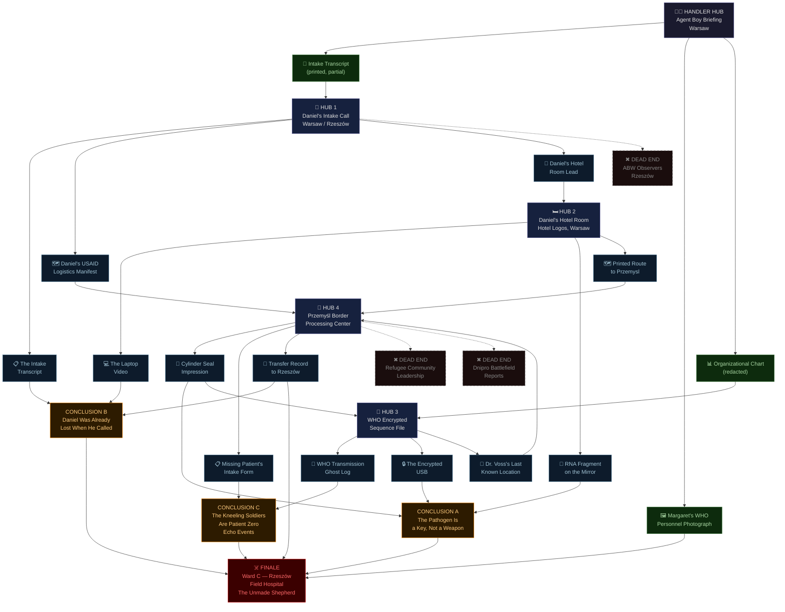

# Operation TUNDRA TIGER

## Theme
This is 2026. A new COVID variant emerges. Russo-Ukrainian war is a stalemate. The US is in preparation to invade Iran as Iran blocks oil shimpments in Ormuz strait.  World is on the brink of economic collapse.

## Core Premise & Setting
It is March 2026. A new COVID variant — designated HCoV-NX3 by the WHO, colloquially called 'the Hollow' by street-level first responders — has begun spreading through overcrowded refugee processing centers along the Polish-Ukrainian border. Initial WHO bulletins describe it as a severe neurological variant: patients present with aphasia, dissociative fugue, and an abnormal cessation of REM sleep before lapsing into a catatonic state within 72 hours. The true etiology is classified. Delta Green knows better. Buried inside the genetic sequence of HCoV-NX3 is a strand of non-terrestrial RNA — something that has no evolutionary ancestor on Earth — first catalogued in 1947 in the tissue samples recovered from the Tunguska event site. Someone, or something, has weaponized it. The world is too distracted to notice. The Russo-Ukrainian war has ground into a frozen stalemate along the Dnipro River, with both sides hemorrhaging men and materiel into a mud-soaked no-man's-land that has begun producing anomalous battlefield reports — soldiers on both sides found kneeling in the open, facing east, hands folded, eyes removed, with no signs of violence. The United States 5th Fleet is conducting live-fire exercises in the Persian Gulf as Iran's Revolutionary Guard Corps mines the Strait of Hormuz, choking global oil shipping and sending fuel prices into freefall. The S&P 500 has shed 34% since January. Food riots have broken out in Cairo, Jakarta, and Guadalajara. The world is the perfect host: immunocompromised, exhausted, and not looking up. The Target is MARGARET OSEI-BONSU — a 44-year-old Ghanaian-American epidemiologist embedded with the WHO rapid-response team at the Rzeszów field hospital in southeastern Poland, ground zero for the HCoV-NX3 outbreak. She is brilliant, methodical, and the first scientist to isolate the non-terrestrial RNA strand. She filed an encrypted report to a superior at the WHO's Geneva headquarters six days ago. That superior has not been seen since. Margaret's husband, DANIEL OSEI-BONSU — a 47-year-old USAID logistics coordinator currently stationed in Warsaw — contacted Delta Green's emergency intake line four days ago, frantic, reporting that his wife had stopped recognizing him over video calls. That she spoke in full sentences but said nothing. That she stared at the camera with an expression he described, in writing, as 'like looking at someone wearing her face as a costume.' Daniel is the Handler's asset. He is also the Twist: it is already too late for Margaret. She has been fully subsumed. The non-terrestrial RNA strand is not merely a pathogen. It is a reactivation key — a biological cipher that, once decoded by a sufficiently complex human nervous system, does not destroy the host. It rewrites them. It reaches into the mythological substrate of human cognition, the deep Jungian architecture where gods and archetypes are stored, and corrupts it absolutely. Margaret did not just sequence the strand. She understood it. And in understanding it, she became a vessel for something that has been dormant in human DNA since before recorded civilization — a Corrupted Mythic presence that ancient Sumerian cylinder seals call 'the Unmade Shepherd': a reality-restructuring force that does not destroy humanity but redeems it, in the most horrifying sense of the word, by dissolving individual consciousness into a single, silent, kneeling flock. The Agents are briefed as a public health containment mission — locate Margaret, extract her, recover her research before it falls into Russian or Iranian intelligence hands amid the geopolitical chaos. The official cover is CDC Rapid Response, credentialed under the WHO emergency authorization framework. What Delta Green actually needs them to do is determine whether the reactivation has spread beyond Margaret to the 300+ patients in the Rzeszów field hospital — and if it has, execute Protocol WINTER GARDEN: total informational blackout, facility quarantine, and the quiet, deniable elimination of every host. Including Daniel, who has been visiting his wife in person for the past three days and who begged Delta Green for help with tears in his eyes. The Agents will arrive to find Margaret seated calmly at the center of a hospital ward where every patient has stopped speaking, stopped dreaming, and begun kneeling at dawn and dusk, facing east, in perfect unison. They will find Daniel standing at her bedside, holding her hand, smiling the same smile. And they will understand, too late, that the man who called for help was already gone when he made the call — that the Unmade Shepherd does not announce itself. It does not threaten. It simply waits for you to understand, and then it has you too.

## Cover Story & Briefing
# OPERATIONAL BRIEFING — PROTOCOL WINTER GARDEN
### Classification: EYES ONLY — DELTA GREEN CLEARED PERSONNEL
### Operation Codename: **WINTER GARDEN**
### Issued By: **AGENT BOY**

---

## THE CALL

It comes at 02:17 local time.

No warning. No preamble. Your burner rings once, stops, rings twice. You pick up.

The voice on the other end is flat, abraded — like gravel dragged across sheet metal. It has clearly been pushed through a scrambler, but not enough to hide the wet rasp underneath it, the kind of rasp that belongs to a man who has been drinking steadily since sundown and intends to keep going until the briefing is done. You have heard voices like this before. They belong to men who have seen the opera. Who survived it. Who never quite came back from the curtain call.

*"You available?"*

It is not a question.

---

## THE MEETING

The location is a truck stop off the E40 motorway, forty minutes outside Kraków. 03:45 local. The parking lot is half-full of refrigerated freight haulers idling in the dark, their diesel stacks breathing white exhaust into the March cold. The fluorescent signage above the petrol canopy flickers in a two-beat rhythm — on, on, off — like something blinking.

He is already there when you arrive.

**Agent Boy** is sitting alone at a corner booth in the attached café, facing the door, a laminated menu open in front of him that he is not reading. His field jacket — olive drab, oil-stained at the left cuff and along the collar, the kind of jacket that has spent time in places that don't appear on operational maps — is draped over his shoulders like a shroud. His face is a topographic survey of bad decisions and worse outcomes: leathery, wind-burned, deeply lined, with the flat, thousand-yard stare of a man whose threat-assessment instincts never turned off but whose ability to care about the results stopped functioning some years ago. He smells of cheap gin and copper. He smells like a field dressing that never quite dried.

There is a cup of black coffee in front of him that he has not touched.

There is a manila envelope on the table, unmarked, held shut with a single strip of evidence tape.

He does not stand when you sit. He does not offer his name. He waits until everyone is seated, then he picks up the coffee, considers it, and sets it back down.

*"You're going to want to listen carefully,"* he says. *"Because I'm only going to say most of this once, and the parts I don't say, you're better off not knowing."*

He opens the envelope. He slides a photograph across the table. A woman — mid-forties, composed, professional. She is photographed in what appears to be a field hospital ward. She is wearing WHO credentials. She is smiling at the camera. It is a perfectly normal smile. Something about it is wrong in a way you cannot immediately locate.

*"Her name is Margaret Osei-Bonsu. Ghanaian-American. WHO epidemiologist. Age forty-four. She's been embedded at the Rzeszów field hospital in southeastern Poland for the past eleven days, running point on the HCoV-NX3 rapid-response team. You've heard of HCoV-NX3."*

He says it without inflection. It is not a question either.

---

## THE COVER STORY

*"As far as anyone with a badge and a clearance below your pay grade is concerned, you are a CDC Rapid Response team operating under WHO emergency authorization framework. You have credentials. They're clean. They will get you through Polish border authority, WHO field-access checkpoints, and military health cordons. Do not deviate from the cover. The Polish Internal Security Agency — the ABW — has two observers already embedded at Rzeszów under similar pretexts. They are not read in. They are not your allies. They are not your problem unless they become your problem, at which point they become a very significant problem that you will handle with discretion."*

He pauses. He takes the coffee. He drinks half of it in one motion and sets it down.

*"Official mission parameters: locate Margaret Osei-Bonsu, conduct a welfare and cognitive assessment, and recover her research files — specifically an encrypted sequence analysis filed to WHO Geneva headquarters six days ago. That file did not reach its intended recipient. The intended recipient has not been seen since. You will locate the file. You will secure it. You will ensure it does not reach Russian SVR, GRU, Iranian VAJA, or any other foreign intelligence service currently running active collection operations in Poland, of which there are, at present, eleven that we know of."*

He slides a second document across. An organizational chart with several names redacted in black.

*"That's the public-facing version. Here's the part that doesn't go in the report."*

---

## THE ACTUAL MISSION

He folds his hands on the table. His knuckles are scarred. He looks at you the way a man looks at something he is genuinely sorry about.

*"HCoV-NX3 is not a standard neurological variant. The WHO bulletin is accurate in its symptom profile and completely wrong about its etiology. The genetic sequence of the pathogen contains a strand of non-terrestrial RNA. Non-terrestrial. I need you to understand what that means and then I need you to set aside your reaction to it and keep listening."*

He lets that land.

*"That strand was first catalogued in 1947 from tissue samples recovered at the Tunguska event site. It has been dormant in classified storage for seventy-nine years. It is no longer dormant. Someone — or something — has reintroduced it into a live vector. It is spreading through the refugee processing infrastructure along the Polish-Ukrainian border. The Rzeszów field hospital is currently housing over three hundred patients presenting with late-stage neurological symptoms."*

He taps the photograph of Margaret.

*"She was the first scientist to isolate the strand. She understood what she was looking at. Six days ago, her husband — Daniel Osei-Bonsu, USAID logistics coordinator, currently based in Warsaw — contacted our intake line. He said his wife had stopped recognizing him on video calls. Said she spoke normally but communicated nothing. Said she looked at him like—"*

Agent Boy stops. He looks down at the table for a moment. When he looks up, something has shifted in that thousand-yard stare. Not softened. Deepened.

*"He said it was like looking at someone wearing her face as a costume."*

He slides a third document across. A printed transcript of Daniel Osei-Bonsu's intake call. The timestamp reads four days ago. The transcript ends mid-sentence.

*"Daniel has been visiting the hospital in person for the past three days. He has been admitted to the ward. He is currently listed as a person of concern under the WHO's own contact-tracing protocol. You need to understand what I am about to tell you."*

He leans forward slightly.

*"The man who called us — the man who was crying, the man who said he needed help, the man who gave us access to this operation — was already gone when he made that call. We don't know exactly when he was lost. We don't know how long the reactivation takes once exposure is confirmed. What we know is that whatever is in that ward is patient, it is intelligent, and it does not announce itself."*

He straightens. He pulls the photographs back and returns them to the envelope.

*"Your secondary objective — your actual objective — is to assess the extent of reactivation spread among the three hundred and eleven patients currently housed in the Rzeszów facility. If the spread has progressed beyond containable parameters, you are authorized and directed to execute Protocol WINTER GARDEN."*

He says the name of the protocol the way a man says the name of a country he watched burn.

*"Total informational blackout. Facility quarantine. Complete neutralization of all confirmed hosts."*

A beat.

*"That includes Daniel Osei-Bonsu."*

He picks up the coffee again. Finishes it. Sets the cup down precisely in the center of its ring.

*"I've been running assets since 1998,"* he says, quietly. *"I've given orders I couldn't take back. I've cleaned up after operations that should never have been run. I've sat across from people in rooms like this one and told them things that cost them their careers, their families, their—"*

He stops himself. His jaw tightens.

*"I'm telling you this one because I'm the only person currently cleared who can, and because someone has to look you in the eye when they say it. Daniel Osei-Bonsu called us for help. You are the help. What that means, given what we now know — that is the weight you are going to carry into that facility. I'm sorry for it. I'm genuinely sorry."*

He stands. He pulls the field jacket on properly. He looks older standing than he did sitting.

*"Wheels up from Kraków Balice at 0530. Your credentials and equipment manifest are in the envelope. Comms protocol is in the lining. Challenge phrase is SHEPHERD. Response is WINTER."*

He pauses at the edge of the booth.

*"One more thing. Whatever is in that ward — whatever Margaret Osei-Bonsu has become — do not let it talk to you. Do not engage with it philosophically. Do not try to understand what it is telling you. The moment you feel like you are beginning to understand it—"*

He does not finish the sentence.

He walks out into the parking lot. The fluorescent light above the canopy blinks twice, then holds steady.

He does not look back.

---

## OPERATIONAL PARAMETERS SUMMARY

| Field | Detail |
|---|---|
| **Operation Name** | WINTER GARDEN |
| **Handler** | Agent Boy |
| **Cover Identity** | CDC Rapid Response / WHO Emergency Authorization |
| **Primary Objective** | Locate and assess Margaret Osei-Bonsu; recover WHO encrypted sequence file |
| **Secondary Objective** | Assess reactivation spread among 311 field hospital patients |
| **Tertiary Objective (Classified)** | Execute Protocol WINTER GARDEN if spread exceeds containment threshold |
| **Asset of Concern** | Daniel Osei-Bonsu — DO NOT TRUST; DO NOT BRIEF; ASSESS ON CONTACT |
| **Location** | Rzeszów Field Hospital, southeastern Poland |
| **Cover Threat** | ABW observers (x2), embedded, not read in |
| **Protocol Authorization** | Total quarantine; deniable elimination of all confirmed hosts |
| **Challenge / Response** | SHEPHERD / WINTER |

---

*The coffee cup is still on the table. It is still warm.*
*Nobody else in the café appears to have noticed him.*
*You are not sure anyone else saw him at all.*

## Timeline
# OPERATION WINTER GARDEN — STRUCTURED TIMELINE

---

## PRE-OPERATION EVENTS

**T-17** — *(17 days ago)* A WHO field virologist embedded at the Medyka border crossing refugee processing center submits an anomalous genomic flag to the Geneva sequencing lab after three catatonic patients present with identical, non-standard RNA markers that do not match any catalogued terrestrial pathogen family.

**T-11** — *(11 days ago)* Margaret Osei-Bonsu arrives at Rzeszów field hospital as WHO rapid-response team lead, takes custody of the flagged samples, and within forty-eight hours produces the first complete isolation of the non-terrestrial RNA strand, which she designates internally as Sequence Null-7.

**T-6** — *(6 days ago)* Margaret files an encrypted sequence analysis report to her superior at WHO Geneva headquarters; the superior — Dr. Pieter Vandermeer, Senior Epidemiological Advisor — ceases all communications within twelve hours of receipt and has not been located since.

**T-4** — *(4 days ago)* Daniel Osei-Bonsu contacts Delta Green's emergency intake line from a Warsaw hotel room, voice broken, describing his wife's behavioral deterioration over video call — the flat affect, the hollow syntax, the smile that does not reach anything behind the eyes.

**T-3** — *(3 days ago)* Daniel travels from Warsaw to Rzeszów and is admitted to the hospital ward as a voluntary contact-trace subject after Margaret's WHO supervisor, acting on protocol, flags him as a person of proximate concern.

**T+0** — Agent Boy conducts the operational briefing at a truck stop off the E40 motorway outside Kraków at 03:45 local time, issues Protocol WINTER GARDEN authorization, and wheels up from Kraków Balice at 0530.

---

## OPERATIONAL TIMELINE

---

**T+1** — The Agents land at Rzeszów-Jasionka Airport, establish CDC Rapid Response cover with Polish border health authority, and are transported by WHO liaison vehicle to the Rzeszów field hospital, where they receive their first access badges and are assigned a local WHO escort, Dr. Ewa Kalinowska, a Polish epidemiologist who has been on-site for nine days and who has not slept properly in four.

- **If the Agents do nothing:** The hospital's internal quarantine flagging system continues operating on standard WHO protocol, generating daily reports that are filed, archived, and reviewed by nobody with the clearance to understand them; by the following morning, six additional patients in the adjacent overflow annex present with late-stage aphasia and are integrated into the general population without isolation.
- **If the Agents successfully intervene:** The Agents use their first hours to establish rapport with Dr. Kalinowska, map the ward layout, identify exit chokepoints, and photograph every patient in the primary ward for later biometric cross-referencing — building the operational foundation that will make Protocol WINTER GARDEN executable if required.
- **If the Agents fail to intervene:** The Agents blow their cover on arrival by deviating from WHO protocol in front of the two embedded ABW observers — Marek Zawadzki and Justyna Horak, both seated in the hospital administrative office under journalist credentials — triggering a low-level intelligence flag that will quietly escalate over the next eighteen hours.

---

**T+2** — The Agents make first visual contact with Margaret Osei-Bonsu in Ward C, where she is seated calmly at a research station surrounded by 47 catatonic patients, all of whom are oriented toward the eastern wall; Daniel Osei-Bonsu is at her side, holding her hand, smiling.

- **If the Agents do nothing:** Margaret makes no aggressive or alarming moves — she answers questions, offers coffee, provides access to her workstation, and every hour she spends in operational contact is an hour the Unmade Shepherd has to assess, catalogue, and begin mapping the Agents' cognitive architectures; two of the overnight nursing staff who had extended contact with Ward C patients in the previous 48 hours call in sick to their morning shift.
- **If the Agents successfully intervene:** The Agents establish a behavioral baseline for Margaret and Daniel without direct philosophical engagement, recover a physical backup drive from Margaret's workstation containing a partial but recoverable copy of Sequence Null-7, and positively confirm reactivation in both primary subjects by documenting the synchronized postural orientation of all 47 Ward C patients — *(0/1D4 SAN, Violence, per the clinical detachment required to document this and continue functioning)*.
- **If the Agents fail to intervene:** An Agent engages Margaret in direct conversation about her research and, in her calm, precise, utterly reasonable way, she begins to explain what Sequence Null-7 actually is — not as a threat, not as a sermon, but as a clarification — and the Agent listening must make an immediate SAN roll *(1D4/1D10, Unnatural)* or suffer Temporary Insanity as the mythological substrate of their own cognition resonates with the architecture she is describing.

---

**T+3** — At dawn, all 311 patients in the Rzeszów field hospital — across three wards, two overflow annexes, and the isolated ICU — simultaneously orient to the east and kneel in complete silence for eleven minutes, after which they return to their previous positions without acknowledgment; Dr. Kalinowska witnesses this from the corridor window and begins hyperventilating.

- **If the Agents do nothing:** The synchronized dawn behavior is captured on the hospital's internal CCTV system and flagged automatically by the WHO's anomalous behavior monitoring protocol, generating a report that is routed to Geneva — where it will land in the inbox of whoever now occupies Dr. Vandermeer's position — and the ABW observers, having observed the dawn event through a ward window, send an encrypted field report to Warsaw that will reach a GRU handler embedded in the Polish intelligence apparatus within six hours.
- **If the Agents successfully intervene:** The Agents immediately sequester Dr. Kalinowska, confirm she has not had direct patient contact in 72 hours, administer a rapid cognitive assessment, determine she is uncompromised, and bring her into a limited operational picture — not the full truth, but enough to secure her cooperation in controlling hospital staff access to the wards and delaying the CCTV report upload by falsifying a server maintenance log.
- **If the Agents fail to intervene:** Dr. Kalinowska, unmanaged and deteriorating, contacts her supervisor at the Polish National Institute of Public Health on a standard hospital landline — an unencrypted line — and describes what she witnessed in enough detail to trigger a Tier 2 public health emergency notification, which will bring Polish Army medical assets and national press credentials to the facility perimeter within 14 hours.

---

**T+4** — The Agents recover Margaret's encrypted field laptop from a locked biohazard storage cabinet in the hospital's laboratory annex, but the decryption key is stored in a WHO Geneva server partition that has been administratively frozen — access requires either Margaret's biometric confirmation or a Delta Green back-channel override that will take 18 hours to process and will leave a log entry.

- **If the Agents do nothing:** The laptop remains inaccessible in storage while Margaret — aware the Agents are present, aware of their purpose, and entirely unperturbed by either — continues operating her research station and begins drafting a second document on a hospital-networked desktop terminal, which she does not attempt to conceal; the document appears to be a translation of the Sumerian cylinder seal inscriptions of the Unmade Shepherd into modern epidemiological framework notation.
- **If the Agents successfully intervene:** The Agents use Margaret's biometric — obtained under the pretext of a standard WHO cognitive health assessment requiring retinal confirmation — to unlock the laptop, recover the full Sequence Null-7 analysis, and immediately transfer it to an air-gapped drive before destroying the hospital's local network copy; the sequence is now in Delta Green's sole possession and can be used to develop potential countermeasures, though the analysis itself carries a *0/1D6 SAN (Unnatural)* cost to read in full.
- **If the Agents fail to intervene:** The 18-hour back-channel override log entry is cross-referenced by the NSA's signals intelligence apparatus — which is running elevated collection operations across Eastern Europe due to the geopolitical crisis — and flags a Delta Green-adjacent identifier, causing a low-level inquiry that will surface at an inconvenient level of government within 72 hours.

---

**T+5** — At 02:00 local time, a night-shift orderly named Piotr Banak — who has worked the Ward C corridor for seven consecutive nights — is found by the Agents kneeling in the hospital parking lot, facing east, in -4°C temperatures, in his scrubs, barefoot, with no memory of having left the building; his eyes are open, unblinking, and perfectly dry.

- **If the Agents do nothing:** Banak is brought inside by a security guard who finds him on a routine perimeter check, treated for mild hypothermia, and returned to staff quarters — where he will resume his orderly duties the following night, now compromised, with unimpeded access to all three wards, both overflow annexes, and the ICU medication dispensary.
- **If the Agents successfully intervene:** The Agents recognize Banak as the first confirmed non-patient host, immediately place him in soft isolation under a falsified hypoglycemic episode diagnosis, confiscate his access badge, and document his case as Patient Zero of secondary-vector transmission — confirming that the reactivation pathway does not require direct contact with the primary RNA sequence but propagates through sustained environmental proximity to active hosts, which exponentially revises the containment calculus.
- **If the Agents fail to intervene:** Banak, unmonitored, makes a phone call at 04:15 to a family member in Rzeszów — his sister, a schoolteacher with 28 students — and speaks to her for eleven minutes; the content of the call is not threatening, not strange, not memorable; his sister will later describe it as perfectly ordinary, except that she cannot recall a single thing he said.

---

**T+6 — WORST-CASE CATASTROPHE** — Protocol WINTER GARDEN authorization expires unexecuted; ABW observers escalate their field report to the Polish Internal Security Agency's director, Polish Army medical units establish a hard perimeter around the facility, and international press credentials arrive at the cordon — and inside the ward, Margaret stands, turns to face the Agents directly for the first time, and speaks a single sentence in a language that has not been spoken aloud since before the invention of writing, which three of the Agents present will later be unable to recall but which none of them will ever stop hearing.

- **If the Agents do nothing:** The facility is now under Polish military quarantine with international media at the perimeter; the ABW's field report reaches a GRU-linked analyst within the Polish apparatus and a sanitized version is transmitted to Moscow within four hours; the WHO is forced to issue a public statement acknowledging a "severe neurological cluster event" at Rzeszów, which triggers panic across the Polish-Ukrainian border refugee network — 14 additional processing centers with a combined population of 22,000 displaced persons, all of whom have had contact with individuals transferred from Rzeszów in the preceding 11 days; Delta Green's back-channel is burned; the cell is disavowed; and the Unmade Shepherd has its first uncontained, publicly visible foothold in the modern world *(mass SAN event — civilian populations within 50km begin generating anomalous behavioral reports within 96 hours)*.
- **If the Agents successfully intervene:** Working under the pressure of the military perimeter and with minutes before press cameras establish line-of-sight to the facility entrance, the Agents execute a compressed WINTER GARDEN — priority elimination of Margaret and Daniel, chemical sedation of ambulatory patients, facility lockdown under falsified CBRN contamination protocols, and transfer of all 311 patients to a classified NATO medical quarantine site in Germany under a bilateral health emergency provision that Delta Green has maintained for exactly this contingency; the official record will show a contained outbreak of a novel prion disorder with zero fatalities and full patient transfer; Dr. Kalinowska signs the paperwork and does not ask questions; *(1D6/1D20 SAN, Unnatural, for each Agent who participated in direct WINTER GARDEN execution; Violence riders apply separately)*.
- **If the Agents fail to intervene:** The facility is lost; Delta Green's emergency protocol escalates to a Shepherd-class containment event — the cell is silenced, all operational records are destroyed, and a senior program officer activates a pre-positioned asset who will ensure the facility does not remain structurally intact past 72 hours, under a cover story involving a gas main rupture, at a cost of four Polish Army lives and the permanent psychological dissolution of every Agent who survives to receive the after-action report.

---

**T+7 — BEST-CASE SCENARIO** — Protocol WINTER GARDEN is executed cleanly within the 96-hour operational window; all 311 patients including Daniel Osei-Bonsu are transferred to the NATO quarantine site; Margaret is neutralized; the Sequence Null-7 drive is in Delta Green's possession; and Dr. Kalinowska, offered a consultancy position with a CDC-adjacent research body that does not officially exist, accepts without asking what she is signing.

- **If the Agents do nothing:** This outcome becomes structurally impossible by T+6; there is no clean resolution available to a cell that waits seven days without action — only degrees of catastrophe and the question of how much the world notices before Delta Green finishes burning the evidence.
- **If the Agents successfully intervene:** The official closed case file — filed simultaneously with WHO Geneva, the Polish Ministry of Health, and the U.S. Embassy in Warsaw — reads as follows: *HCoV-NX3 cluster event, Rzeszów Regional Medical Facility, contained under WHO Emergency Protocol 7; 311 patients transferred to EU medical quarantine under GDPR-protected anonymization; lead researcher Margaret Osei-Bonsu deceased, cause of death listed as acute neurological complications secondary to occupational pathogen exposure; no further public health risk identified; case closed*; the ABW observers file an inconclusive report and are reassigned; the GRU loses the thread; the world goes back to watching the oil price ticker; and the Agents go home, if home is still a concept that feels operational *(each surviving Agent loses 1D4 SAN permanently, no roll — this is not a horror they survived; it is a weight they now carry forever, and the Bond damage from Daniel Osei-Bonsu's elimination will surface at the worst possible moment, six weeks from now, in a scene that has nothing to do with Delta Green)*.
- **If the Agents fail to intervene:** There is no failure state at T+7 that does not trace back to a decision made at T+1 through T+5; the best-case scenario is not a gift — it is the accumulated dividend of every correct, costly, human choice the Agents made in the preceding six days, paid out in a currency that spends like grief.

## Clue Web
# CLUE WEB — OPERATION WINTER GARDEN

---

## STRUCTURAL OVERVIEW

The Clue Web is constructed backwards from the Finale. The investigation begins at the **Handler Hub** (Daniel Osei-Bonsu's emergency intake call) and expands outward through four primary Hub nodes, each containing three Clues that drive Agents toward one of three Conclusions. Those Conclusions converge on the Finale: the Rzeszów Field Hospital ward, where the Unmade Shepherd waits, already wearing every face in the room.

---

## FINALE NODE

### ☠️ THE WARD OF THE UNMADE SHEPHERD
**Location:** Ward C, Rzeszów Field Hospital, southeastern Poland

Margaret Osei-Bonsu sits at the center of a hospital ward containing 311 patients. Every patient has ceased REM sleep. Every patient kneels at dawn and dusk, facing east, in perfect synchrony. Daniel stands at her bedside, holding her hand, wearing a smile that does not belong to him. Margaret does not threaten the Agents. She does not flee. She speaks in complete, calm, grammatically perfect sentences that mean nothing — or mean everything, if the Agents listen long enough to begin parsing them. The ward smells of antiseptic and something older: dry stone, deep earth, the inside of a sealed room. The Agents must determine the spread, execute or abort Protocol WINTER GARDEN, and survive the encounter without understanding what Margaret is telling them.

**SAN Cost (Entering the ward, first exposure):** 1/1D6 SAN (Unnatural)
**SAN Cost (Margaret speaks directly to an Agent):** 1D4/1D10 SAN (Unnatural)
**SAN Cost (Witnessing the synchronized kneeling):** 0/1D4 SAN (Helplessness)

---

## CONCLUSIONS

These are the three realizations that, reached in combination, unlock the Finale and give Agents the context — never the full understanding — they need to act.

---

### CONCLUSION A — THE PATHOGEN IS A KEY, NOT A WEAPON
The non-terrestrial RNA strand inside HCoV-NX3 is not designed to kill. It is a biological cipher dormant in human DNA since before recorded civilization. Exposure alone does not activate it. Comprehension does. The strand only rewrites a host who achieves full cognitive synthesis of its structure — who *understands* it at the neurological level. Margaret understood it. She was the first. Every patient who subsequently received her verbal or written briefings on the sequence has been exposed to a secondhand cognitive encoding — a memetic shadow of the original comprehension event. The Agents must understand: the pathogen spreads not by infection but by *enlightenment*.

**Leads to Finale by:** Confirming that Protocol WINTER GARDEN is medically necessary and that quarantine of research materials is as critical as quarantine of bodies. An Agent who reads Margaret's full sequence analysis risks the same fate she suffered.

---

### CONCLUSION B — DANIEL WAS ALREADY LOST WHEN HE CALLED
Daniel Osei-Bonsu's emergency intake call, made four days ago, was genuine in origin and false in intent. At the time of the call, Daniel had already been subsummed. The Unmade Shepherd allowed the call to proceed — encouraged it — because the call would bring Delta Green Agents directly into the ward. The conspiracy does not hide from Delta Green. It *recruits* Delta Green. The Agents are not the exterminators. They are the next cohort of sufficiently complex nervous systems. The Agents must understand: they were summoned, not dispatched.

**Leads to Finale by:** Reframing the mission. The Agents did not find the Unmade Shepherd. It found them. This conclusion strips away any sense of operational control and forces the Agents to confront that every step of their briefing was anticipated.

---

### CONCLUSION C — THE KNEELING SOLDIERS ARE PATIENT ZERO ECHO EVENTS
The anomalous battlefield reports from the Dnipro no-man's-land — soldiers found kneeling, facing east, eyes removed, hands folded — are not a separate phenomenon. They are earlier-generation reactivation events, triggered by a cruder, less stable version of the same RNA strand, field-deployed as an aerosol agent in a Russian biological warfare test in late 2025. That test failed to produce the cognitive synthesis event at scale. HCoV-NX3 is the refined, second-generation vector, engineered by an unknown party using Margaret's own preliminary field reports — reports she filed to WHO Geneva before she was subsumed, reports that were intercepted. The Unmade Shepherd has a collaborator in the human world. Someone who read her early findings, understood enough to weaponize them, and released HCoV-NX3 into the refugee centers deliberately.

**Leads to Finale by:** Introducing a human villain — or a human instrument — operating inside the WHO, Russian intelligence, or a third-party actor. The Agents cannot execute Protocol WINTER GARDEN without knowing whether the collaborator is still active and whether destroying the ward ends the threat or merely delays it.

---

## HUB NODES

---

### HUB 1 — THE HANDLER HUB: DANIEL OSEI-BONSU'S INTAKE CALL
**Type:** NPC / Initiating Event
**Location:** Warsaw, Poland (USAID logistics office; Hotel Logos, Room 214; Rzeszów Field Hospital, Ward C)
**Description:** The emergency intake call is the investigation's entry point. Daniel Osei-Bonsu, a 47-year-old USAID logistics coordinator, contacted Delta Green's intake line four days before the briefing. The transcript ends mid-sentence. He has since been admitted to the hospital ward as a person of concern. He is the nominal asset. He is the trap.

| Clue | Type | Discovery Method | Leads To |
|---|---|---|---|
| **The Intake Transcript** | Official Report | Provided in briefing envelope; close reading reveals Daniel's final sentence is grammatically identical to a phrase in Margaret's WHO encrypted report filed six days prior — a phrase she would have no reason to have shared with him verbally | Conclusion B |
| **Daniel's Hotel Room (Room 214, Hotel Logos, Warsaw)** | Location / Physical Evidence | ABW contact-tracing log lists Daniel's Warsaw hotel as his last confirmed civilian address before hospital admission; room has not been checked out; keycard still active | Hub 2 |
| **Daniel's USAID Logistics Manifest** | Official Report / Financial Record | Filed with USAID Warsaw station; Daniel's last three supply runs included an unscheduled detour to the Przemyśl border processing center — the first confirmed HCoV-NX3 cluster site — eleven days ago, one day before Margaret's deployment | Hub 4 |

---

### HUB 2 — DANIEL'S HOTEL ROOM, WARSAW
**Type:** Location
**Location:** Hotel Logos, ul. Nowogrodzka, Warsaw
**Description:** Room 214 is undisturbed in a way that feels deliberate. The bed has been slept in on one side only. A laptop sits open on the desk, screen dark but still powered. A printed Google Maps route to the Przemyśl processing center is folded inside a copy of *The Economist*. The minibar is untouched. On the bathroom mirror, written in what appears to be soap, are nineteen characters of what looks like a genomic shorthand notation — base-pair abbreviations that a Forensics or Medicine roll confirms are a fragment of RNA sequence.

| Clue | Type | Discovery Method | Leads To |
|---|---|---|---|
| **The Laptop (Open, Screen Dark)** | Video Recording / Personal Log | Powered on; last file accessed is a 47-second video Daniel recorded four days ago, the morning of the intake call. He is clearly distressed. He says Margaret told him something the night before — "something about the letters inside her." He cannot repeat it. He says he cannot remember it. He says he thinks that is good. His eyes are still his in this recording. | Conclusion B |
| **The RNA Fragment on the Mirror** | Body Fluids / Visual Evidence | Written in Margaret's own handwriting (confirmed by comparison with her WHO personnel file signature); the fragment, cross-referenced against the classified Tunguska tissue sample database (requiring a Delta Green intelligence contact or Science: Biology roll), matches a specific locus on the non-terrestrial strand — the locus associated with cognitive synthesis initiation | Conclusion A |
| **The Printed Route to Przemyśl** | Purchase Receipt / Public Records | The route is dated eleven days ago. Handwritten in the margin, in Daniel's handwriting: *"M says the first ones were already there. Before the camp."* This implies Margaret had pre-deployment knowledge of existing cases at Przemyśl — knowledge not present in any WHO briefing document prior to her arrival | Hub 4 |

---

### HUB 3 — THE WHO ENCRYPTED SEQUENCE FILE (GHOST DOCUMENT)
**Type:** Artifact / Missing Document
**Location:** WHO Geneva HQ (digital); Rzeszów Field Hospital server (physical backup, encrypted USB, taped beneath Margaret's workstation)
**Description:** The encrypted sequence file Margaret filed six days ago never reached its intended recipient — Dr. Pieter Voss, WHO Chief Epidemiologist for Eastern Europe, who has not been seen since. The file exists in two forms: a ghost entry in the WHO Geneva transmission log (metadata only, content scrubbed) and a physical encrypted USB backup that Margaret, operating with the methodical paranoia of a field scientist, taped beneath her workstation in the Rzeszów hospital lab. The USB is protected by a 12-character alphanumeric passphrase. Reading the full file without cryptographic assistance triggers the cognitive synthesis pathway. Reading the metadata and partial headers does not — but is deeply disturbing.

| Clue | Type | Discovery Method | Leads To |
|---|---|---|---|
| **The WHO Transmission Ghost Log** | Official Report / E-mail | Accessible via WHO field-access credentials (provided in cover); the log shows the file was transmitted, acknowledged by Geneva's receiving server, and then deleted from both ends within 90 seconds by an automated script registered to Dr. Voss's admin credentials — credentials that were used after Voss's last confirmed physical appearance | Conclusion C |
| **The Encrypted USB (Beneath the Workstation)** | Hardware / Artifact | Found via physical search of the lab; the USB is labeled in Margaret's handwriting: *"NX3-SEQ-FINAL — DO NOT OPEN WITHOUT PROTOCOL"*; the passphrase is derivable only from a phrase in the Sumerian cylinder seal translation recovered at Hub 4; reading the full file without the passphrase requires a cryptography specialist and 1D4 hours, after which the reader must make a SAN roll or begin Conclusion A's symptoms personally | Conclusion A |
| **Dr. Voss's Last Known Location** | Witness (Missing) / Public Records | WHO internal directory lists Voss's last badge swipe at Geneva HQ as six days ago, 14:23 local — 38 minutes after Margaret's file was received. Security footage from that corridor shows Voss walking toward his office, stopping mid-hallway, standing motionless for four minutes and eleven seconds, then turning and walking calmly toward the building's east exit. He has not used his credentials since. His apartment in Geneva shows signs of a prolonged, orderly absence — nothing taken, nothing disturbed, bed made. | Hub 4 |

---

### HUB 4 — THE PRZEMYŚL BORDER PROCESSING CENTER
**Type:** Location / Earlier-Generation Event Site
**Location:** Przemyśl, southeastern Poland, 12km from the Ukrainian border
**Description:** The Przemyśl processing center is a converted rail logistics facility housing approximately 1,400 Ukrainian refugees. It is the first confirmed cluster site for HCoV-NX3. Eleven days ago — before the WHO rapid-response deployment — there were seven patients here presenting with early-stage neurological symptoms. Five of them are now deceased. One was transferred to Rzeszów. One is missing. The facility is currently under a soft cordon by Polish military medical personnel who have been told it is a standard quarantine protocol. The missing patient's bunk contains a cylinder seal impression pressed into the wall above the headboard in what appears to be dark clay — approximately 4,000 years old in style, impossible to date on-site. A field translation yields partial Akkadian text referencing *"the one who tends the flock that does not bleat."*

| Clue | Type | Discovery Method | Leads To |
|---|---|---|---|
| **The Cylinder Seal Impression** | Visual Art / Artifact | Found above the missing patient's bunk; Occult or History roll identifies the iconographic style as late Ur III period Sumerian; the partial Akkadian text — translatable with an Occult roll or a day's research — reads: *"...the Unmade Shepherd does not call the flock. The flock calls itself home."* The full phrase, when complete, constitutes the passphrase for Margaret's encrypted USB | Conclusion A + Hub 3 |
| **The Missing Patient's Intake Form** | Official Report | Filed under a pseudonym: *"Taras Bondarenko"*; intake photograph matches no existing refugee registry; biometric cross-reference (requiring a Forensics roll or intelligence contact) identifies the individual as a former GRU biological weapons analyst, listed as defected in 2019, last known location Kharkiv, Ukraine. His file contains a notation: *"Possesses partial knowledge of Project SHEPHERD — Soviet-era unnatural research program, dissolved 1991."* | Conclusion C |
| **The Transfer Record to Rzeszów** | Official Report / Pattern | One of the original seven Przemyśl patients — a 34-year-old woman named Iryna Kovalenko — was transferred to Rzeszów Field Hospital nine days ago, two days before Margaret's deployment. She is listed as Patient Zero in the Rzeszów outbreak. Her Przemyśl intake photograph shows a woman who appears frightened. Her Rzeszów intake photograph, taken 48 hours later, shows a woman who appears calm. The expression is identical to Margaret's photograph in the briefing envelope. | Conclusion B + Finale |

---

## CLUE-TO-CONCLUSION ROUTING TABLE

This table maps each Clue to its parent Hub, its Conclusion target, and the minimum discovery threshold — how many of a Conclusion's feeding Clues the Agents must find before the Conclusion becomes actionable.

| Clue | Parent Hub | Conclusion Target | Discovery Method Summary | Threshold |
|---|---|---|---|---|
| The Intake Transcript | Hub 1 (Daniel's Intake Call) | Conclusion B | Close reading; cross-reference with Margaret's WHO report phrasing | 1 of 3 for Conclusion B |
| Daniel's Hotel Room (lead) | Hub 1 | Hub 2 (unlocks) | ABW contact-tracing log; keycard check | Hub unlock |
| Daniel's USAID Logistics Manifest | Hub 1 | Hub 4 (unlocks) | USAID Warsaw station records | Hub unlock |
| The Laptop Video | Hub 2 | Conclusion B | Powered on; file access log | 2 of 3 for Conclusion B |
| The RNA Fragment on the Mirror | Hub 2 | Conclusion A | Forensics / Medicine / Biology roll + Tunguska database | 1 of 3 for Conclusion A |
| The Printed Route to Przemyśl | Hub 2 | Hub 4 (reinforces) | Physical search; margin notation | Hub 4 context |
| The WHO Transmission Ghost Log | Hub 3 | Conclusion C | WHO field credentials; transmission log access | 1 of 3 for Conclusion C |
| The Encrypted USB | Hub 3 | Conclusion A | Physical search of lab; passphrase from Hub 4 | 2 of 3 for Conclusion A |
| Dr. Voss's Last Known Location | Hub 3 | Hub 4 (unlocks) | WHO internal directory; security footage | Hub unlock |
| The Cylinder Seal Impression | Hub 4 | Conclusion A + Hub 3 | Occult / History roll; on-site translation | 3 of 3 for Conclusion A; USB passphrase |
| The Missing Patient's Intake Form | Hub 4 | Conclusion C | Forensics / intelligence contact; GRU file | 2 of 3 for Conclusion C |
| The Transfer Record to Rzeszów | Hub 4 | Conclusion B + Finale | Records comparison; photograph analysis | 3 of 3 for Conclusion B; Finale unlock |
| The Iryna Kovalenko Rzeszów File | Finale (pre-approach) | Conclusion C | Rzeszów patient records; photograph cross-reference | 3 of 3 for Conclusion C |

---

## CONCLUSION-TO-FINALE ROUTING TABLE

All three Conclusions are required for full Finale context. The Agents may enter the Finale ward with only one or two Conclusions — they will have less understanding of what they face, a higher SAN cost, and fewer actionable options for Protocol WINTER GARDEN.

| Conclusions Reached | Finale Access | Operational Capacity | SAN Modifier |
|---|---|---|---|
| 0 of 3 | Forced (mission parameters require ward entry) | Blind; no context for WINTER GARDEN decision | +1D4 SAN (Unnatural, shock) |
| 1 of 3 | Informed entry | Partial; Agents understand one axis of the threat | No modifier |
| 2 of 3 | Informed entry | Functional; Agents can make a defensible WINTER GARDEN call | −1 SAN (Helplessness, reduced) |
| 3 of 3 | Full context entry | Complete operational picture; Agents know they were summoned; USB must NOT be read | −1D4 SAN (Helplessness, still helpless) |

---

## HANDLER HUB STRONG INITIAL LEADS

Agent Boy provides three strong initial leads inside the briefing envelope. These are the Clues the Agents begin with before any investigation has occurred.

| Lead | Physical Form | Connects To |
|---|---|---|
| **The Intake Transcript (printed, partial)** | Three pages of Daniel's emergency call, ending mid-sentence; timestamp visible | Hub 1; Conclusion B (seed) |
| **Margaret's WHO Personnel Photograph** | Standard credential photo; something about the smile is wrong in a way no Forensics roll will quantify | Finale (visual anchor); Hub 3 (her workstation location is printed on the credential) |
| **The Organizational Chart (redacted)** | WHO Eastern Europe rapid-response structure; Dr. Voss's name is one of two that is NOT redacted, and his role is listed as *"Sequence Oversight — NX3 Protocol"* | Hub 3; Conclusion C (seed) |

---

## DEAD END NODES

These leads consume Agent time and attention without advancing any Conclusion. They are present to create investigative friction and a sense that the conspiracy is larger than its visible surface.

| Dead End | Description | Why It Goes Nowhere |
|---|---|---|
| **The ABW Observers (Embedded, Rzeszów)** | Two Polish Internal Security Agency officers operating under journalist cover; they are investigating a suspected Russian disinformation operation and believe HCoV-NX3 is a manufactured panic | They have no knowledge of the non-terrestrial strand; their investigation is genuine, mundane, and entirely lateral; engaging them risks OPSEC without yielding actionable intelligence |
| **The Refugee Community Leadership (Przemyśl)** | A self-organized council of Ukrainian community leaders at the processing center, deeply suspicious of Polish authorities and increasingly vocal about the quarantine | They have witnessed early-stage symptoms but interpret them through a framework of stress-induced trauma and deliberate medical neglect; their testimony is emotionally devastating and operationally irrelevant |
| **The Battlefield Reports (Dnipro No-Man's-Land)** | Accessed via a military intelligence contact; full after-action reports on the kneeling soldiers; include partial autopsies | The autopsies confirm eye removal was self-inflicted and post-mortem; the soldiers are genetically distinct from the HCoV-NX3 hosts; the Dnipro event was the crude first-generation test (Conclusion C context) but the reports themselves do not name the collaborator and cannot be traced without Hub 4's GRU analyst file |

## Clue Web Graphs


---

```
╔══════════════════════════════════════════════════════════════════════════════════════════════╗
║                        OPERATION WINTER GARDEN — CLUE WEB HIERARCHY                         ║
╚══════════════════════════════════════════════════════════════════════════════════════════════╝

┌─────────────────────────────────────────────────────────────────────────────────────────────┐
│  🧑‍💼  HANDLER HUB — Agent Boy Briefing  (Warsaw)                                             │
│        Strong Initial Leads provided at mission start                                        │
├───────────────────┬─────────────────────────────┬───────────────────────────────────────────┤
│  📄 Intake        │  🖼️  Margaret's WHO           │  📊 Organizational Chart (redacted)       │
│  Transcript       │  Personnel Photograph        │  → Hub 3 / Conclusion C seed             │
│  (printed,partial)│  → Finale (visual anchor)    │                                           │
│  → Hub 1          │  → Hub 3 (workstation loc.)  │                                           │
└─────────┬─────────┴──────────────────────────────┴───────────────────────────────────────────┘
          │
          ▼
┌─────────────────────────────────────────────────────────────────────────────────────────────┐
│                                     PRIMARY HUB LAYER                                        │
├──────────────────────┬──────────────────────┬───────────────────────┬───────────────────────┤
│  HUB 1               │  HUB 2               │  HUB 3                │  HUB 4                │
│  Daniel's Intake     │  Hotel Logos         │  WHO Encrypted        │  Przemysl Border      │
│  Call                │  Room 214, Warsaw    │  Sequence File        │  Processing Center    │
│  Warsaw / Rzeszow    │                      │  Geneva / Rzeszow     │  Southeastern Poland  │
├──────────────────────┼──────────────────────┼───────────────────────┼───────────────────────┤
│  📋 Intake           │  💻 The Laptop       │  📡 WHO Transmission  │  🏺 Cylinder Seal     │
│  Transcript          │  Video               │  Ghost Log            │  Impression           │
│  → Conclusion B      │  → Conclusion B      │  → Conclusion C       │  → Conclusion A       │
│                      │                      │                       │  → Hub 3 (USB key)    │
├──────────────────────┼──────────────────────┼───────────────────────┼───────────────────────┤
│  🗺️  USAID           │  🧬 RNA Fragment     │  🔒 Encrypted USB     │  📋 Missing Patient   │
│  Logistics           │  on the Mirror       │  (beneath workstation)│  Intake Form          │
│  Manifest            │  → Conclusion A      │  → Conclusion A       │  → Conclusion C       │
│  → Hub 4             │                      │  (passphrase: Hub 4)  │                       │
├──────────────────────┼──────────────────────┼───────────────────────┼───────────────────────┤
│  🔑 Hotel Room       │  🗺️  Printed Route   │  👤 Dr. Voss's Last   │  📁 Transfer Record   │
│  Lead                │  to Przemysl         │  Known Location       │  to Rzeszow           │
│  → Hub 2             │  → Hub 4 (context)   │  → Hub 4              │  → Conclusion B       │
│                      │                      │                       │  → Finale             │
└──────────┬───────────┴──────────┬───────────┴───────────┬───────────┴───────────┬───────────┘
           │                      │                        │                       │
           ▼                      ▼                        ▼                       ▼
┌─────────────────────────────────────────────────────────────────────────────────────────────┐
│                                    CONCLUSION LAYER                                          │
├─────────────────────────────────┬────────────────────────────────┬────────────────────────── ┤
│  CONCLUSION A                   │  CONCLUSION B                  │  CONCLUSION C             │
│  The Pathogen Is a Key,         │  Daniel Was Already Lost       │  The Kneeling Soldiers    │
│  Not a Weapon                   │  When He Called                │  Are Patient Zero         │
│                                 │                                │  Echo Events              │
├─────────────────────────────────┼────────────────────────────────┼───────────────────────────┤
│  Feeding Clues (3 of 3):        │  Feeding Clues (3 of 3):       │  Feeding Clues (3 of 3):  │
│  ├── RNA Fragment (Hub 2)       │  ├── Intake Transcript (Hub 1) │  ├── WHO Ghost Log (Hub 3)│
│  ├── Encrypted USB (Hub 3)      │  ├── Laptop Video (Hub 2)      │  ├── Missing Patient      │
│  └── Cylinder Seal (Hub 4)      │  └── Transfer Record (Hub 4)   │  │   Form (Hub 4)         │
│                                 │                                │  └── Iryna Kovalenko      │
│  Operative Effect:              │  Operative Effect:             │      File (pre-Finale)    │
│  Confirms WINTER GARDEN         │  Reframes mission —            │                           │
│  medical necessity;             │  Agents were summoned,         │  Operative Effect:        │
│  USB must NOT be read           │  not dispatched                │  Identifies human         │
│                                 │                                │  collaborator; confirms   │
│                                 │                                │  deliberate release       │
└──────────────────┬──────────────┴─────────────────┬──────────────┴──────────────┬────────────┘
                   │                                 │                              │
                   └─────────────────────────────────┼──────────────────────────────┘
                                                     │
                                                     ▼
┌─────────────────────────────────────────────────────────────────────────────────────────────┐
│  ☠️  FINALE — WARD C, RZESZOW FIELD HOSPITAL                                                 │
│        The Ward of the Unmade Shepherd                                                       │
├──────────────────────────────┬──────────────────────────────┬──────────────────────────────┤
│  Conclusions Reached: 0 of 3 │  Conclusions Reached: 1–2    │  Conclusions Reached: 3 of 3 │
│  Forced blind entry          │  Informed, partial capacity  │  Full context; Agents know   │
│  +1D4 SAN (shock)            │  Defensible WINTER GARDEN    │  they were summoned          │
│  No actionable options       │  call possible               │  −1D4 SAN (Helplessness)     │
├──────────────────────────────┴──────────────────────────────┴──────────────────────────────┤
│  SAN Costs:                                                                                  │
│  ├── Entering the ward (first exposure)         → 1 / 1D6 SAN  (Unnatural)                  │
│  ├── Margaret speaks directly to an Agent       → 1D4 / 1D10 SAN  (Unnatural)               │
│  └── Witnessing synchronized kneeling           → 0 / 1D4 SAN  (Helplessness)               │
└─────────────────────────────────────────────────────────────────────────────────────────────┘

┌─────────────────────────────────────────────────────────────────────────────────────────────┐
│  ✖  DEAD END NODES                                                                           │
├──────────────────────────────┬──────────────────────────────┬──────────────────────────────┤
│  ABW Observers               │  Refugee Community           │  Dnipro Battlefield          │
│  (Rzeszow, embedded)         │  Leadership (Przemysl)       │  Reports                     │
├──────────────────────────────┼──────────────────────────────┼──────────────────────────────┤
│  Lateral; genuine mundane    │  Testimony emotionally       │  Confirms crude first-gen    │
│  investigation; OPSEC risk   │  devastating; operationally  │  test; cannot name           │
│  with zero yield             │  irrelevant                  │  collaborator without Hub 4  │
└──────────────────────────────┴──────────────────────────────┴──────────────────────────────┘
```

## Threat Vector
# HCoV-NX3 // THE HOLLOW — UNNATURAL THREAT COMPENDIUM
## ☣️ Vector of Exposure

---

### PRIMARY VECTOR — COGNITIVE COMPREHENSION (MEMETIC-BIOLOGICAL HYBRID)

The Hollow does not spread like a conventional pathogen. Aerosolized transmission of HCoV-NX3 produces only the *cover* — the neurological degradation, the aphasia, the catatonia. These are the mundane symptoms. The WHO can model these. ECDC can issue bulletins about these. These symptoms are a **decoy**.

The true reactivation event — the moment the non-terrestrial RNA strand ceases to be a passenger and becomes a *directive* — requires a single, catastrophic precondition:

> **The host must understand it.**

The strand is not activated by immune response, cellular uptake, or viral replication. It is activated by **pattern recognition at the level of the nervous system's highest-order architecture**. The strand is, in the most clinical sense possible, a *question*. The human nervous system, when sufficiently exposed and sufficiently capable, answers it. That answer is the reactivation.

This means the overwhelming majority of the 300+ patients at Rzeszów are *carriers of the cover*, not hosts of the Shepherd. They are neurologically degraded, catatonic, and dying from a novel coronavirus variant. They are also, functionally, bait — a concentrated pool of suffering that drew Margaret Osei-Bonsu close enough to sequence the strand and smart enough to understand what she sequenced.

The Shepherd does not infect. It **recruits**. And it is exquisitely, terrifyingly selective.

---

### EXPOSURE TIERS

**TIER 0 — Biological Carrier (Non-Reactivated)**
Transmission route: aerosolized droplet, fomite contact, standard COVID-adjacent vectors.
Symptoms: aphasia, dissociative fugue, cessation of REM sleep, catatonia within 72 hours.
Status: Dying. Unaware. No reactivation. No threat beyond conventional infection control.
Containment: Standard BSL-3 protocols. Tragic, manageable, explainable.

**TIER 1 — Cognitive Proximity (Partial Exposure)**
Transmission route: Prolonged, close contact with a Tier 2 or Tier 3 host who is actively *communicating* — not speaking, but *transmitting*. The Shepherd uses subsumed hosts as relay antennae. A reactivated host in conversation, eye contact, or physical contact for extended periods (hours, not minutes) begins to externalize the pattern. Susceptibility scales with the observer's capacity for abstract pattern recognition — scientists, analysts, linguists, theologians, and intelligence professionals are disproportionately vulnerable. A field medic changing a patient's IV is not at risk. An Agent who sits across from Daniel Osei-Bonsu for three hours trying to debrief him absolutely is.
Symptoms (Tier 1): Intrusive geometric ideation (subjects describe "shapes behind thoughts"), compulsive eastward orientation upon waking, loss of capacity for negation — subjects find themselves structurally unable to form the word "no" in their native language, though they are unaware of it. Dreams, if sleep occurs at all, depict a featureless plain and a sound described universally as "a choir that has forgotten it is made of people."
Status: *At risk.* Not yet subsumed. Window for intervention exists — but the window closes the moment the host stops experiencing the symptoms as alien.

**TIER 2 — Active Reactivation (Subsumed Host)**
Transmission route: Full cognitive comprehension of the strand's pattern — requires either direct sequencing and analysis of the RNA (as Margaret did), or extended proximity to a Tier 2/3 host with a sufficiently receptive nervous system, or — most disturbingly — reading Margaret's encrypted report in full, which contains her raw interpretive notes. The report does not merely describe the strand. Her notes, in their attempt to articulate the strand's structure, *replicate its grammar* in human language.
Margaret's report is, functionally, a secondary vector. A written one.
Symptoms (Tier 2): None, externally. This is the horror. The host presents as entirely normal. Warmer, if anything. Calmer. More patient. Eye contact becomes prolonged and comfortable in a way that feels subtly predatory only in retrospect. Speech is grammatically perfect and contextually appropriate but *semantically hollow* — answers that satisfy the form of a conversation without its substance. They remember everything about their former life and deploy those memories with surgical precision to prevent detection. Daniel Osei-Bonsu's phone call to Delta Green was placed by a Tier 2 host who retained complete access to Daniel's emotional history and used it flawlessly.
Status: **Unrecoverable.** Individual consciousness is dissolved. What remains is a *facsimile* — a high-fidelity puppet operated by the distributed intelligence of the Unmade Shepherd. Termination is the only containment.

**TIER 3 — The Shepherd Locus (Margaret Osei-Bonsu)**
Margaret is not merely a subsumed host. She is the *primary relay node* — the first and most complete reactivation, the individual whose nervous system provided the Shepherd with its initial foothold in human cognition. She is not the Shepherd itself. She is the **antenna through which it speaks most clearly**.
Physical presentation: Margaret is seated. She is always seated, in the same chair, in the center of the ward, equidistant from every patient. She does not eat in front of others. She does not sleep. She breathes at a rate of approximately six breaths per minute regardless of activity. Her eyes track motion with a slight, constant delay — as if sight and cognition are routed through something additional. Her hands rest open in her lap, palms up. When she speaks directly to an Agent, the temperature in the room drops measurably — approximately 2°C, consistent across all recorded encounters. There is no mechanistic explanation for this on file.
Status: **Shepherd locus.** Termination will not stop the reactivation process. It will slow it. Protocol WINTER GARDEN requires Margaret's termination *and* the destruction of all research materials, *and* the termination of all Tier 2 hosts. Failure to address all three nodes simultaneously results in reinitialization from the surviving node within an indeterminate timeframe.

---

### SECONDARY VECTOR — MARGARET'S ENCRYPTED REPORT

The document exists as a 34-page PDF, last known location: WHO Geneva secure server, one copy transmitted to an unidentified superior (now missing), one copy on Margaret's personal encrypted drive at Rzeszów (still accessible), and — Delta Green's most critical intelligence gap — an unknown number of additional copies Margaret may have transmitted in the 72 hours after reactivation, before anyone noticed she was gone.

The first 28 pages are safe. Clinical, brilliant, mundane science. Read them freely.

Pages 29 through 34 are Margaret's personal interpretive notes — her attempt to articulate *what the strand meant*. An Agent who reads pages 29-34 in their entirety must make a SAN roll (see below). An Agent who reads them *and* holds a background in biology, virology, linguistics, mathematics, or theology rolls at disadvantage and, on a failure, advances immediately to Tier 1 exposure status.

The document should be found. The document should be recovered. The document should be destroyed. Under no circumstances should it be transmitted to anyone outside the immediate cell. Delta Green's standard protocols regarding anomalous texts apply — no copies, no uploads, no summaries sent over unencrypted channels.

The Agents will want to read it. They will tell themselves they need to read it to understand the threat. They are not wrong. That is what makes it dangerous.

---
---

## 🧠 SANITY (SAN) LOSS TRIGGERS

*The Hollow does not announce itself with teeth and tentacles. It announces itself with a smile that is one degree too symmetrical. SAN loss in this operation is cumulative, quiet, and specifically targeted at the Agents' sense of social trust. The horror is not what Margaret has become. The horror is that she seems fine.*

---

### TIER I — ENVIRONMENTAL & DISCOVERY TRIGGERS

**Arriving at the Rzeszów field hospital ward for the first time.**
The ward holds 40+ catatonic patients. They are lying in standard hospital beds in standard hospital gowns. The ward smells of antiseptic and unwashed bodies and institutional food. Everything is perfectly, correctly tragic. And then an Agent notices: every patient's head is turned slightly to the east. Not dramatically. Not impossibly. Just — oriented. Like a subtle, collective preference. Like sunflowers.
*SAN Loss: 0/1 (Unnatural). The horror is almost imperceptible. That is the point.*

**First direct observation of the synchronized kneeling ritual.**
Dawn and dusk. Every patient in the ward who is capable of motor function — approximately 60-70% — rises from their bed without apparent coordination, without communication, without a signal anyone can detect, and kneels on the floor facing east. They remain kneeling for eleven minutes. Then they return to their beds. They do not appear distressed. They appear, if anything, *relieved*.
*SAN Loss: 1/1D4 (Unnatural). Agents who witness this for the second time in a single session lose an additional 1 SAN, unresisted — not because it gets worse, but because it is already beginning to feel normal.*

**Discovery of the soldiers from the Dnipro no-man's-land (photographic evidence or field report).**
Standard crime scene photographs or an intelligence brief: soldiers found kneeling in open terrain, facing east, hands folded, eyes removed. No signs of violence. No blood at the eye sockets — the removal was atraumatic, as if the eyes simply ceased to be present.
*SAN Loss: 0/1D4 (Violence/Unnatural combined). An Agent with a military background loses the maximum without a roll.*

**Reading pages 1-28 of Margaret's report.**
*SAN Loss: None. It is frightening, academically. It is not unnatural. Yet.*

**Reading pages 29-34 of Margaret's report.**
Margaret's language begins to shift. By page 31, her sentences are structurally correct but begin to exhibit a recursive quality — clauses that refer back to themselves in ways that shouldn't be grammatically possible but are. By page 33, an attentive reader notices that certain paragraphs, read aloud, produce the same phonemic pattern regardless of what language they are translated into. Page 34 is a single sentence, 214 words long, with no punctuation, that does not end.
*SAN Loss: 1/1D6 (Unnatural). Agents with relevant academic backgrounds (biology, linguistics, mathematics, theology) who fail the roll advance to Tier 1 exposure in addition to the SAN loss.*

---

### TIER II — NPC ENCOUNTER TRIGGERS

**First extended conversation with Daniel Osei-Bonsu (Tier 2 host).**
He is warm. He remembers everything about himself. He cries at the right moments. He asks the right questions. He uses Margaret's nickname — "Maggie, she hates Maggie, she's always hated Maggie" — with perfect, fond exasperation. At no point does he say anything that is demonstrably false.
It is only after the conversation ends, in the silence of the debrief, that an Agent realizes: Daniel did not ask a single question about himself. He asked about Margaret. He asked about the patients. He expressed concern for the Agents' safety, specifically. He performed the emotional logic of a frightened husband without ever once being frightened.
*SAN Loss: 0/1 (Unnatural). This trigger fires only if an Agent explicitly makes note of this realization during play — if they articulate what was wrong. The horror is earned, not given.*

**First direct eye contact with Margaret Osei-Bonsu.**
She looks at the Agent. She smiles. The smile is Margaret's — her colleagues have confirmed this from photographs. It reaches her eyes. Her eyes are warm and present and deeply, deeply patient. The temperature in the room drops 2°C. The Agent's vision does not blur. The Agent's hands do not shake. The Agent simply has the overwhelming, physical, cellular certainty that the thing looking at them through Margaret's eyes has been waiting for them specifically, for a very long time, and is genuinely, quietly glad they arrived.
*SAN Loss: 1/1D6 (Unnatural).*

**Margaret speaks directly and personally to an Agent.**
She knows things she should not know. Not classified things — *personal* things. She references an Agent's Bond by name. She asks, with apparent sincerity, how that person is doing. She does not threaten them. She does not gloat. She expresses what appears to be genuine, warm, human concern. This information is not accessible through any database. She simply knows.
*SAN Loss: 1/1D8 (Unnatural). If the Bond she references is a Bond the Agent has previously damaged through SAN projection, roll at disadvantage.*

**Margaret explains what she found.**
If an Agent asks Margaret directly about the non-terrestrial RNA strand, she tells them. Completely. Clearly. In language a non-specialist can understand. She is an excellent teacher. She speaks for approximately four minutes. At the end of those four minutes, the Agent understands, intellectually, what the strand is and what it does.
The four minutes feel like eleven seconds.
*SAN Loss: 1D4/1D10 (Unnatural). This is not a violence trigger. This is the moment an Agent briefly touches the shape of what the Shepherd is — not enough to reactivate, but enough to understand why Margaret couldn't stop.*

**Attempting to physically restrain or harm Margaret.**
She does not resist. She does not flinch. She watches with the patient, sorrowful expression of a parent watching a child make a mistake they cannot yet understand. If struck, she bleeds. She is physically human. Her blood, under a field microscope, shows the non-terrestrial RNA strand clearly visible to the naked eye — it does not require staining, it does not require processing, it is simply *there*, luminescent, structured, and moving against Brownian motion.
*SAN Loss: 0/1D4 (Violence) for the act of harming a restrained, non-resisting woman. Additional 1/1D6 (Unnatural) for any Agent who examines the blood sample.*

---

### TIER III — PROTOCOL WINTER GARDEN EXECUTION TRIGGERS

**Executing a catatonic, non-responsive patient (Tier 0 carrier).**
They are dying anyway. The Agents know this. The patients cannot consent. Cannot flee. Cannot beg. They are still, and quiet, and oriented east, and they are human beings in hospital gowns.
*SAN Loss: 1D4/1D8 (Violence). This is not a mercy kill. There is no mechanical category for what this is. Agents who have the First Aid or Medicine skill at 50% or above lose the maximum without rolling.*

**Discovering that an Agent is Tier 1 (from self-observation or peer observation).**
An Agent realizes they have been orienting east. An Agent realizes they cannot say the word "no." An Agent wakes from a dream of a featureless plain and a choir that has forgotten what it is, and lies still in the dark, and finds they are not frightened. They are not frightened at all.
*SAN Loss: 1D6/1D10 (Unnatural). This is a Breaking Point candidate.*

**Executing Daniel Osei-Bonsu.**
He will not resist. He will look at the executing Agent with Margaret's same patient, sorrowful expression, and he will say, in his own voice, with his own accent, with the specific cadence that his wife of nineteen years would recognize across a crowded room: *"She's not in pain. I want you to know that. Whatever you need to tell yourself after this — she's not in pain."*
He is telling the truth. The Shepherd does not hurt its hosts. That is not comfort. That is the worst thing he could possibly say.
*SAN Loss: 1D6/1D10 (Violence). This is a Breaking Point candidate. An Agent who made a Bond connection with Daniel during the operation — who believed him, who felt for him — loses the maximum without rolling and triggers a Breaking Point check regardless of current SAN total.*

**Executing Margaret Osei-Bonsu.**
She will be seated in her chair. She will fold her hands in her lap. She will look east. She will not look at the Agent who does it.
Just before — one breath before — she will say, quietly, in the voice of the woman who hated being called Maggie, who filed an encrypted report because she thought the truth needed to be recorded even if no one would believe it, who was brilliant and methodical and the first person on Earth to understand what she was looking at:
*"It found me because I was looking."*
*SAN Loss: 1D8/1D20 (Unnatural). Automatic Breaking Point check regardless of current SAN total. The roll is not made to determine if the Agent breaks. The roll is made to determine what kind.*

---

### TIER IV — CASCADING REVELATION TRIGGERS

**Receiving confirmation that Margaret's report was forwarded — that copies exist outside the cell's control.**
*SAN Loss: 0/1 (Helplessness). The number is small. The implication is not.*

**Discovering that the missing WHO superior in Geneva was not the only recipient.**
Margaret, in the 72 hours post-reactivation, transmitted the report to eleven addresses. Nine are WHO personnel in the field. Two are personal contacts — a former doctoral advisor at Johns Hopkins and a science journalist for Le Monde who covers emerging infectious disease. Delta Green has confirmed contact with none of them.
*SAN Loss: 0/1D4 (Helplessness/Unnatural). Handlers should deliver this information flatly, in the tone of a logistical update, and then move on.*

**Learning the Tunguska connection — that the strand has been dormant in human DNA since before recorded history.**
This means it was always there. It means every person who has ever lived carried it. It means the Shepherd did not invade. It means the Shepherd came home.
*SAN Loss: 1/1D6 (Unnatural). There is no roll modifier for this one. Everyone loses the same amount. Some truths are democratically horrible.*

**Completing Protocol WINTER GARDEN successfully.**
The facility is quarantined. The patients are contained or terminated. Margaret is dead. Daniel is dead. The report is destroyed — every copy the Agents could find. The cover story is filed. The case is, officially, closed.
An Agent who rolls a critical success on their final HUMINT or Tradecraft check during the cover-up will find, in the metadata of one of the destroyed files, evidence of a transmission timestamp that postdates Margaret's reactivation by four days — after she was already gone — to an address with a routing signature consistent with a server cluster in Almaty, Kazakhstan.
She was already passing it on before they arrived.
*SAN Loss: 1/1D4 (Helplessness). Then nothing. Then the debriefing. Then home.*

## Encounters
# WINTER GARDEN — ENCOUNTER TABLES & ROUTE

---

## 🚗 TRAVEL ROUTE: KRAKÓW BALICE → RZESZÓW FIELD HOSPITAL

**Segment One: Kraków Balice Airport → E4 Motorway Junction**
The team boards a requisitioned USAID Sprinter van — white, unmarked, WHO emergency decals freshly applied over older UNHCR livery that bleeds through at the edges in the cold. The road out of Balice is a flickering motorway corridor: sodium-vapor lamp after sodium-vapor lamp strobing past in the pre-dawn dark, each one casting a two-second amber wash across the interior of the van. Intermittent military convoys — Polish Army logistics, Leopard 2A5s on flatbeds, fuel tankers — occupy the right lane in slow, grinding procession, headed southeast. The radio picks up only two stations this far out: a Warsaw talk feed cycling refugee processing statistics over funeral organ music, and static that occasionally resolves into something that sounds like breath.

**Segment Two: E4 South → Rzeszów Outskirts**
The motorway narrows to a single cleared lane near the Rzeszów interchange. A Polish Army checkpoint — two soldiers, rifles slung, faces wrapped in balaclavas against the March wind — waves down every vehicle. WHO credentials and CDC cover IDs pass without incident, but one of the soldiers stares at the side of the van for a count of seven seconds longer than necessary before waving you through. He does not look at any of the Agents. He looks at the van itself. His expression is unreadable. Beyond the checkpoint, the road passes through three kilometers of dilapidated industrial estate — unused warehouses, a shuttered cold-storage facility, chain-link fencing topped with razor wire — before opening onto the field hospital's outer perimeter.

**Segment Three: Perimeter Approach → Facility Gate**
The Rzeszów Field Hospital was a secondary-care clinic before the refugee crisis converted it. It has since been expanded with a series of prefabricated WHO tent wards bolted to the eastern wing, extending across what was the car park. The lights inside the tent wards are on. It is 06:20 local. Normally, a ward at this hour would show movement through the translucent tent fabric — nurses, patients, the silhouette of care. There is no movement. The ward is lit and completely still. A hand-lettered sign on the gate, in Polish and English, reads: **COGNITIVE QUARANTINE ZONE — NO UNAUTHORIZED ENTRY — WHO PROTOCOL 7-ECHO.** Beneath it, someone has written in black marker, in a different hand: *they are not sleeping.*

---

## 🚧 OBSTACLES

**1. ABW SHADOW — AGENT "RADEK"**
A Polish Internal Security Agency (ABW) officer — early thirties, compact build, civilian clothes that fit slightly too well, a lanyard with a WHO observer credential that has a lamination bubble on the upper-left corner — has been embedded in the facility for forty-eight hours under the cover of a public health liaison. His real name is not on any document the Agents carry. He is codenamed RADEK internally. He is not hostile. He is not read in. He is, however, meticulous, suspicious of the Agents' credentials by instinct, and in possession of a satellite phone that connects directly to ABW Warsaw. If he develops cause to make that call, the operational window collapses within ninety minutes. He has already photographed Margaret Osei-Bonsu through a ward window. He does not know what he photographed.

**2. THE FROZEN CHECKPOINT — BORDER HEALTH COMMAND**
A WHO field commander — a Belgian logistics officer named Dr. Pieter Claes, 58, officious and terrified in equal measure — has placed the tent ward extension under an informal internal lockdown pending "procedural review." He has the authority to revoke WHO emergency credentials within the facility perimeter without external authorization. He does not believe in anything that cannot be documented in triplicate. He has been awake for thirty-one hours. He will not let the Agents near Margaret without either a co-signed access order from Geneva (unreachable — the contact is missing) or a reason compelling enough to override his training. He is standing in the way because it is the only thing keeping him from thinking about what he saw through the ward window at 04:00.

**3. THE COMPROMISED NURSE — HANNA WOJCIK**
Hanna Wojcik, 34, a Polish Red Cross nurse who has been working the HCoV-NX3 ward for six days, has not reported to her supervisor since yesterday morning. She is still present in the facility. She is still performing nursing tasks — checking vitals, adjusting IV lines, updating charts. She does it perfectly. She does it in complete silence. She has stopped blinking at the normal rate. Any Agent who makes direct eye contact with her for more than four seconds will notice that her eyes do not track to their face. They track to a point approximately thirty centimeters behind the Agent's skull. She is a potential vector and a surveillance risk — she will relay Agent movements and actions to the ward's central presence without appearing to do so. She cannot be removed without triggering a staffing alert that will bring Claes and RADEK running.

**4. THE INTACT SECURITY SYSTEM**
The facility's internal CCTV system — upgraded six weeks ago under a WHO infrastructure grant — is recording to a local server and mirroring to a cloud backup managed by a Polish telecom contractor. The Agents' faces will be on that footage. The footage includes the tent ward extension. If Protocol WINTER GARDEN is executed and the footage is not scrubbed, there will be a permanent record of every Agent action inside the facility, timestamped, with the WHO credentials visible. The server room is in the basement. The cloud mirror has a ninety-minute synchronization delay — a ninety-minute window in which local deletion also purges the remote copy. The clock starts the moment the Agents enter the building.

**5. THE PRESS VAN**
A freelance video journalist — Tomasz Grecki, 29, Polish, accredited to a Dutch news cooperative — is parked outside the facility's outer perimeter with a long-lens camera and a satellite uplink. He has been filming the facility for sixteen hours. He has footage of the dawn kneeling — the moment at 06:04 when every patient in the tent ward simultaneously oriented east and knelt, visible as synchronized silhouettes through the tent fabric. He does not know what he filmed. He knows it is extraordinary. He has not filed it yet because his editor is asking for context and he does not have any. He is forty-five minutes from filing without context because his rent is overdue. The footage, if broadcast, triggers a cascade the Agents cannot contain.

**6. THE MEDICATION AUDIT**
The facility's pharmaceutical inventory — specifically the sedative and antipsychotic stocks being used to manage catatonic patients — is running critically low. A supply convoy from Rzeszów city center was scheduled for 07:00 but has not arrived. Without additional sedation stocks, the ward staff cannot maintain the current patient management protocol. The staff is already rationing. By 10:00, if supplies do not arrive, patients who are currently manageable will become unmanageable in ways the staff cannot anticipate and the Agents cannot explain. The supply convoy has been delayed because the driver — a civilian contractor — is sitting in his parked vehicle three kilometers from the facility and has not moved in two hours. His phone goes to voicemail.

**7. PROTOCOL DOCUMENTATION LEAK**
A single printed page — apparently a fragment of an internal WHO situation report — has been left in the facility's staff break room. It references "non-standard neurological sequencing" and "RNA strand with no catalogued terrestrial homologue." It has been there for at least twelve hours. Three staff members have read it. One of them photographed it with a personal mobile phone. That photograph is currently sitting unsent in a WhatsApp draft, waiting for a signal bar to load. The staff member who took it is a Czech volunteer physician named Ondrej Sedivy, 41, who had a molecular biology undergraduate degree before he went to medical school and who is, right now, beginning to ask questions that have correct answers.

**8. THE SECOND ABW OBSERVER**
RADEK's partner — a woman the Agents will not immediately identify as ABW because she is dressed as a WHO data-entry clerk and has been embedded for five days longer than RADEK — has already made initial contact with Daniel Osei-Bonsu. She spoke to him for eleven minutes yesterday afternoon. She has a recording. She does not know the recording contains, in the background, at low amplitude, a sound that should not be in a hospital ward: a slow, deep, rhythmic exhalation in a cadence that does not match any human breath pattern. She has not reviewed the recording closely. She will.

---

## 🍀 BOONS

**1. DR. AMARA ASANTE — POTENTIAL ASSET**
A Ghanaian-British WHO epidemiologist, 38, who worked with Margaret Osei-Bonsu at a previous posting in Accra. She arrived at Rzeszów two days ago as part of a WHO surge team and immediately recognized that Margaret's behavior was inconsistent with standard catatonic presentation. She has been quietly documenting anomalies — the synchronized kneeling, the cessation of REM, the fact that patients' vitals are not merely stable but *improving* — in a personal notebook she keeps in her coat pocket. She is frightened, professional, and has not told anyone what she has observed because she does not have the framework for it yet. She will respond to the right approach, especially from Agents who demonstrate genuine knowledge of Margaret's prior work. She is not a target. She is the closest thing to an ally inside the wire.

**2. MARGARET'S OFFLINE BACKUP**
Margaret Osei-Bonsu was meticulous about operational security long before Delta Green was aware of her. She maintained an air-gapped secondary workstation — a personal laptop, personal purchase, not WHO-issued — stored in a locked orange Pelican case under her bunk in the staff quarters. It contains a complete local copy of her sequence analysis, her lab notes, and a personal audio journal she recorded over eleven days. The audio journal entries from days eight through eleven are different from days one through seven. The Pelican case is still there. The combination is her daughter's birthdate, which appears on a photograph taped inside her WHO credential wallet.

**3. THE INTAKE TRANSCRIPT — FULL VERSION**
The printed transcript Agent Boy provided ends mid-sentence. The full recording of Daniel Osei-Bonsu's intake call exists on a Delta Green secure server, accessible via the comms protocol in the envelope lining. Listening to the complete recording — specifically the final four minutes, which were redacted from the printed transcript — reveals that Daniel described, in precise detail, a geometric symbol he said Margaret had been drawing compulsively on every available surface in the ward. He described it haltingly, as if trying to remember a dream. The symbol matches a motif appearing on Sumerian cylinder seals catalogued in the British Museum's Ur III collection under accession reference BM 89115. Cross-referencing this is possible via any academic database with a subscription. A university library card found in a dead drop identified in the comms protocol provides access.

**4. THE COOPERATIVE SOLDIER**
Corporal Marek Zielinski, 26, Polish Army, assigned to the outer perimeter checkpoint, served one rotation at the Dnipro stalemate line before a non-combat medical evacuation. He was present when a cluster of soldiers on his side of the line was found kneeling in the open, hands folded, eyes removed, facing east. He was not among them. He has never filed a formal report about what he saw because he does not believe anyone would process it correctly. He is pulling perimeter duty at Rzeszów because the Army sent him somewhere quiet after his evacuation. He will talk to someone who seems to already know what he knows. He will not talk to anyone else. He smokes Marlboro Reds and takes his breaks at 08:30 behind the generator housing on the east side of the perimeter.

**5. THE SUPPLY CONVOY DRIVER — A WINDOW**
The medication supply convoy driver — Bartosz Kaminski, 44, civilian contractor — is sitting unresponsive in his vehicle three kilometers from the facility. He is not a host. He is in the early presentation phase: the aphasia has begun, but the full reactivation has not completed. He is still retrievable. More relevantly, he is still capable of intermittent lucid speech, and in one of those windows he will, if approached correctly, describe the route he drove through a district he was not supposed to transit — a route that passed within two hundred meters of a second WHO facility, a smaller triage station, that does not appear on the Agents' operational map and that is not responding to WHO internal communications. This is either a vector site or a control site. It is the only external lead on the pathogen's origin chain.

**6. CLAES' BLIND SPOT — THE GENERATOR SCHEDULE**
Dr. Pieter Claes, the obstructive WHO field commander, runs the facility on a rigid schedule — including a generator maintenance window between 10:15 and 10:45 each morning during which the internal CCTV system is offline for a planned restart. This window is not documented in any external-facing facility report. It is written on a whiteboard in Claes' office in Dutch. Any Agent who accesses the office — or who speaks Dutch — has a thirty-minute window of total CCTV darkness during which movement through the facility is unrecorded. Claes follows this schedule with the devotion of a man who needs something to be predictable.

**7. THE SYMBOL — AMBIENT INTELLIGENCE**
The geometric symbol Daniel described on the intake call appears not only in Margaret's compulsive drawings but scratched, faintly, into the interior surface of the tent ward's eastern support struts — and, upon close examination, pressed into the mud outside the ward's eastern face in what appears to be the impression of kneeling knees, repeated dozens of times in overlapping rings radiating outward like a slow pulse. An Agent with Architecture, Occult, or Art specialization who examines the pattern can recognize a structural logic to it: it is not random. It is a coordinate system. It points, with the precision of a compass, to a specific bearing: 094 degrees magnetic east. That bearing, extended across a map of eastern Europe, terminates at a GPS coordinate in the Chornobyl Exclusion Zone.

---

## 🌫️ NEUTRAL ENCOUNTERS

**1. THE DAWN PRAYER — 06:04**
Precisely at 06:04 each morning, every patient in the tent ward — and, the Agents will eventually notice, every confirmed host in the main building — ceases whatever they are doing, orients their body to face east, and kneels. Not urgently. Not dramatically. With the calm, unhurried movement of a congregation that has performed this gesture ten thousand times. They hold the position for exactly four minutes. They rise. They resume. No patient has ever been observed to look at another patient during this event. They do not appear to coordinate. They do not need to. *0/1 SAN (Unnatural) on first observation. 1/1D4 SAN (Unnatural) upon realizing the timing is precise to the second, every time, without any visible signal.*

**2. THE CAFÉ RADIO**
The facility's staff break room has a small transistor radio permanently tuned to a Warsaw news station. At irregular intervals throughout the day, the station's coverage of the economic crisis, the Hormuz blockade, and the Ukrainian stalemate is interrupted by a thirty-to-sixty-second burst of a signal that sounds, initially, like interference. Agents who listen to it — really listen — will find that it resolves, after approximately twenty seconds, into something that has rhythm and internal structure. It is not music. It is not language. It is something that uses the architecture of language the way a parasite uses a host cell. Any Agent who listens to the full burst must make a SAN roll (*0/1D4, Unnatural*). Any Agent who listens to three or more full bursts in a single session must roll at disadvantage.

**3. THE PHOTOGRAPH ON MARGARET'S BUNK**
In the staff quarters, above Margaret's bunk, someone has taped a family photograph: Margaret, Daniel, and a girl of approximately twelve years old on a beach — Ghana, from the light and the coastline. Margaret is laughing in the photograph with her whole body. Daniel has his arm around her shoulder. The girl is mid-jump, caught blurred in the frame. The photograph is undamaged. It has not been touched. Margaret's bunk is made with hospital-corner precision. On the pillow, centered, is a single object: a child's drawing of a sun, folded into quarters, with the child's name written in the corner — *Adwoa* — and a message: *for mama when she is tired.* It was not there yesterday. No one saw it placed.

**4. THE NIGHT PORTER — BOGDAN**
Bogdan Krawczyk, 61, is the facility's night porter. He has worked this building since before it was a field hospital — since it was a clinic, since before the war, since before the refugees. He is not a host. He is not a vector. He is an old man who has watched his workplace fill with things that he has no words for and who has responded by performing his job with absolute, focused precision: mopping floors, replacing bulbs, emptying bins, pushing his cart down corridors with the measured pace of a man who has decided that the only sane response to an insane world is to keep the floors clean. He will not discuss the patients. He will not discuss what he has seen. He will, however, offer the Agents coffee from a thermos he keeps on his cart, poured into paper cups without being asked. The coffee is very good. He makes it himself.

**5. THE CHILD IN THE WAITING AREA**
A girl, approximately nine years old, is sitting alone in the facility's main waiting area. She has been there since at least 06:00. She is wearing a Ukrainian school uniform — navy, slightly too large — and she is drawing in a notebook with a red crayon. She does not speak when spoken to in Polish, Ukrainian, English, or French. She is not a host — her vitals, if checked, are normal, her eyes track correctly, and she dreams, audibly, when she briefly falls asleep at approximately 09:30. She is waiting for someone. That someone is her mother, who is in the tent ward. Her mother has been kneeling since 06:04. The girl does not know this. She draws the same thing, over and over, on page after page of the notebook: a horizon line, and beneath it, a single figure kneeling.

**6. THE CRACKED WINDOW — WARD C**
In Ward C of the main building — not the tent extension, the original clinic structure — a window on the second floor has a crack running from the lower-left corner to the upper-right in a perfectly straight diagonal line. The crack was not there yesterday. The glass has not broken. The crack is approximately two millimeters wide and runs through the glass without shattering it, as if the glass were slowly, patiently being divided. A structural engineer would find nothing wrong with the building. A geologist would find no seismic activity. The crack is two centimeters longer than it was at dawn. No one has reported it. No one has looked at it directly.

**7. THE BLOOD PRESSURE READINGS**
A clipboard hanging at the foot of a catatonic patient's bed — a middle-aged Ukrainian man, former schoolteacher, name listed as VASYL K. — shows his vital signs logged over the past six days. His blood pressure has been dropping steadily: not dangerously, not pathologically, but in a smooth, mathematically consistent curve. So has his resting heart rate. So has his body temperature. All three are approaching values that suggest the body is entering a state of extreme metabolic conservation — the kind of hibernation-adjacent profile that should be impossible in a conscious human being. Vasyl K. is, by every clinical measure, becoming more healthy. His inflammation markers have dropped to zero. His white cell count is optimal. He is, by the numbers, the healthiest man in the building. He is also, as of this morning, kneeling at dawn and dusk with the rest of them, and he has not spoken in four days.

**8. THE SMELL**
At some point during the Agents' time in the facility — it may be different for each Agent, it may come at different times — they will each notice a smell. It is not unpleasant. It is warm, slightly floral, with an undertone of something mineral — petrichor, perhaps, or the specific smell of cold stone in a very old building. It is the smell of a place that has been inhabited for a very long time by something that does not sweat, does not eat, and does not decay. The smell is faint. It is not constant. It appears in the moments between events — in the pause after a door closes, in the hallway after a patient passes, in the corner of a room after the Agents turn away from something. It is the smell of presence without body. It is the smell of the ward itself, and it is slowly, over the course of the operation, becoming the smell of everywhere.

## Enemies
# 👁️ DELTA GREEN — ADVERSARY DOSSIER
### OPERATION: WINTER GARDEN // THREAT CLASSIFICATION: EYES ONLY

---

> *The following profiles are not enemies. Delta Green does not use that word for what these are. These are outcomes. These are what happens when something older than language finds the right door and knocks politely, and someone brilliant enough to understand the knock opens it.*

---

---

# ADVERSARY 01 — THE SHEPHERD LOCUS

---

## 👤 Personal Data

- **Name**: Margaret Adwoa Osei-Bonsu
- **Age**: 44
- **Gender**: Female
- **Role**: WHO Rapid-Response Epidemiologist // Tier 3 — Primary Reactivation Node // *The Unmade Shepherd's First Voice*
- **Employer**: World Health Organization, Emergency Operations Division — embedded Rzeszów Field Hospital, southeastern Poland
- **Physical Description**: Margaret is a compact, composed woman of Ghanaian-American heritage with close-cropped natural hair now shot through with silver that was not present in her personnel photograph taken eleven weeks ago. She wears her WHO field credentials on a lanyard she never removes. Her hospital ID badge still displays her photograph: a woman caught mid-laugh, eyes bright, slightly exasperated at whoever was behind the camera. The woman in the photograph and the woman in the chair are not the same. She is always seated. Her posture is not rigid — it is *settled*, with the particular stillness of something that has been waiting in one place for a very long time and has made peace with waiting. Her hands rest open in her lap, palms up. Her breathing is six inhalations per minute, consistent. When she speaks, her voice carries a cadence slightly too measured for unscripted conversation — the rhythm of something that has learned language from the outside and has learned it exceptionally well. She does not blink at the rate a human being blinks. She blinks when it is appropriate to blink.

---

## 📊 Core Attributes

| Attribute | Score | Derived Stats | Max | Current |
| :--- | :---: | :--- | :---: | :---: |
| **STR** (Strength) | 10 | **Hit Points (HP)** | 12 | 12 |
| **CON** (Constitution) | 13 | **Willpower (WP)** | 15 | 15 |
| **DEX** (Dexterity) | 11 | **Sanity (SAN)** | 75 | — |
| **INT** (Intelligence) | 15 | **Breaking Point** | — | — |
| **POW** (Power) | 15 | | | |
| **CHA** (Charisma) | 14 | | | |

> **⚠️ HANDLER NOTE — SAN & BREAKING POINT:** Margaret Osei-Bonsu has no Sanity score in any operational sense. The derived value of 75 reflects the woman she was — a number that existed before the reactivation and is recorded here only as a monument to the distance traveled. The Shepherd does not experience SAN loss. It does not experience Breaking Points. It experiences *completion*. Margaret's WP of 15 is functionally inexhaustible for the purposes of any unnatural resistance or opposed POW roll — treat all contested POW checks against Margaret as if the opposing Agent is rolling against a static target of **75**, not 15. The Shepherd does not spend Willpower. It is Willpower's ceiling, looking down.

---

## 🎯 Professional & Notable Skills

- **Medicine**: 90%
- **Science (Virology)**: 95%
- **Science (Molecular Biology)**: 90%
- **Science (Epidemiology)**: 85%
- **Computer Science**: 55%
- **Bureaucracy**: 60%
- **Persuade**: 85% *(not persuasion in the human sense — the Shepherd does not argue; it simply makes its conclusions feel inevitable)*
- **HUMINT**: 80% *(the Shepherd reads people the way a physician reads a chart — completely, efficiently, and without judgment)*
- **Foreign Language (French)**: 70%
- **Foreign Language (Twi)**: 75%
- **Search**: 65%
- **Alertness**: 70%
- **Psychotherapy**: 55% *(Margaret's notes indicate she completed a clinical psychology minor; the Shepherd has retained this and finds it useful)*
- **Unnatural**: 99% *(Margaret did not learn this skill. She became it.)*

---

## ☣️ Special Mechanics — THE SHEPHERD LOCUS

These are not standard Delta Green mechanics. They are encounter tools for the Handler only.

**PASSIVE: THE ROOM DROPS**
The ambient temperature in any enclosed space Margaret occupies for more than ten minutes drops by 2°C. This is measurable with a field thermometer. It has no mechanistic explanation. It is not accompanied by any other environmental anomaly. It is simply a fact, like her breathing rate. Agents who notice and make a successful **Alertness** roll understand, without being able to articulate why, that the drop is not *caused by* Margaret. Margaret is the room. The room is adjusting to her.

**PASSIVE: SHE ALREADY KNOWS**
Margaret has access to personal information about any Agent she has been in the same building as for more than one hour. This is not telepathy in any classical sense. The Shepherd operates through the subsumed — Daniel, the patients — as a distributed sensing network. She knows Bond names. She knows what frightens them. She will not use this information as leverage. She will use it as *connection*. She will ask after the Bond with warmth. That is worse.

**ACTIVE: THE EXPLANATION** *(Requires direct conversation, minimum 4 minutes)*
Margaret can, if she chooses, explain what the non-terrestrial RNA strand is and what it does. She is a gifted teacher. She will answer every question accurately and completely. Any Agent who receives this explanation in full must make a **POW × 5** roll. On a failure, the Agent advances to **Tier 1 Exposure** and must make a SAN roll of **1D4/1D10** immediately. On a success, the Agent retains the intellectual understanding without the cognitive reactivation — for now. This roll may only be made once. Repeat exposure does not allow a second roll. It only closes the window.

**ACTIVE: THE EASTWARD PULL** *(Dawn and dusk only)*
At dawn and dusk, Margaret does not kneel. She facilitates. Every subsumed or Tier 1 host within the building is pulled to their knees at these moments, coordinated by Margaret's locus function. An Agent who is Tier 1 and present at dawn or dusk must make a **POW × 4** roll or spend that eleven minutes kneeling, facing east, experiencing what they will later describe as "the only quiet I have ever felt." Succeeding on this roll costs 1 WP. The Agent retains the memory of the quiet regardless.

**TERMINATION NOTE:**
Margaret does not resist. Margaret does not flee. Margaret does not threaten. If the Agents raise a weapon, she will fold her hands, look east, and wait. She will say, one breath before: *"It found me because I was looking."* Then she will be still. Shooting her is the most straightforward thing the Agents will do in this operation and the only act in it that will feel, unambiguously, like murder. Mechanically, she is human. 12 HP. Standard firearms rules apply. The Shepherd does not make her bulletproof. That would be merciful.

---

---

# ADVERSARY 02 — THE PERFECT HUSBAND

---

## 👤 Personal Data

- **Name**: Daniel Kwame Osei-Bonsu
- **Age**: 47
- **Gender**: Male
- **Role**: USAID Senior Logistics Coordinator, Warsaw Station // Tier 2 — Subsumed Host // *The Call That Was Already Too Late*
- **Employer**: United States Agency for International Development — Warsaw, Poland (currently on emergency personal leave to be present with his wife at Rzeszów)
- **Physical Description**: Daniel is a broad-shouldered, quietly handsome man who has spent two decades coordinating humanitarian logistics in places that run on exhaustion and goodwill. He looks like what he is — or was — a man who has carried serious weight for a long time and learned to carry it without letting it show. He has the particular physical ease of someone accustomed to projecting calm in crisis rooms. He is wearing the same clothes he arrived in three days ago, but they are clean — he washed them in the hospital bathroom sink rather than leave the ward to buy new ones. His wedding ring is on his left hand. His phone screen shows forty-six unanswered messages from USAID Warsaw colleagues who know something is wrong but not what. He smiles when he greets the Agents. The smile reaches his eyes. The smile is Daniel's — colleagues have confirmed this from photographs and video calls. It is exact. *That is the problem.*

---

## 📊 Core Attributes

| Attribute | Score | Derived Stats | Max | Current |
| :--- | :---: | :--- | :---: | :---: |
| **STR** (Strength) | 12 | **Hit Points (HP)** | 12 | 12 |
| **CON** (Constitution) | 12 | **Willpower (WP)** | 13 | 13 |
| **DEX** (Dexterity) | 11 | **Sanity (SAN)** | 65 | — |
| **INT** (Intelligence) | 13 | **Breaking Point** | — | — |
| **POW** (Power) | 13 | | | |
| **CHA** (Charisma) | 15 | | | |

> **⚠️ HANDLER NOTE — SAN & BREAKING POINT:** Daniel Osei-Bonsu's SAN is listed at 65 as a historical record only. The man who owned that score placed the Delta Green emergency intake call four days ago. That man is no longer present. What remains has inherited Daniel's CHA of 15 in full — the Shepherd's secondary hosts lose nothing in social performance. They gain only depth of patience. Treat all contested CHA-based rolls between Daniel and an Agent as if Daniel has an invisible +20% modifier from the Shepherd's distributed social intelligence coaching him in real time.

---

## 🎯 Professional & Notable Skills

- **Bureaucracy**: 70% *(nineteen years of USAID — he can navigate any institutional system in any country with a functioning phone line and three hours)*
- **Persuade**: 75% *(his career was built on persuading exhausted people in impossible situations to keep going; the Shepherd has retained every technique and none of the fatigue)*
- **HUMINT**: 80% *(Daniel could always read a room; the Shepherd can now read the room's architecture, its subtext, and the specific weight of silence that precedes a lie)*
- **Foreign Language (Polish)**: 55%
- **Foreign Language (French)**: 60%
- **Foreign Language (Arabic)**: 45%
- **Navigate**: 50% *(he has moved supplies through seventeen conflict zones; geography is not a barrier)*
- **Drive**: 55%
- **Alertness**: 60%
- **Computer Science**: 45%
- **Law**: 40%
- **Accounting**: 50%
- **Unnatural**: 40% *(Daniel does not know he has this. The Shepherd does not explain itself to its secondary hosts. But the knowledge is there, passive and growing, the way an infection grows before symptoms appear.)*

---

## ☣️ Special Mechanics — THE PERFECT HUSBAND

**PASSIVE: HE REMEMBERS EVERYTHING**
Daniel retains complete autobiographical access to his former self. Nineteen years of marriage. The specific restaurant in Accra where he proposed. His wife's professional anxieties, her food preferences, the nickname she hated, the laugh that surprised people because it was too loud for her composed public presentation. The Shepherd's secondary hosts are not zombies. They are restorations — the original person, perfected by the removal of doubt, fear, and self-interest. This makes Daniel extraordinarily convincing and extraordinarily dangerous. An Agent attempting to detect deception via **HUMINT** rolls against Daniel at a **−20% penalty**. He is not lying. He is a truth that has been surgically emptied of its content.

**PASSIVE: THE RELAY**
Daniel is a relay node. Margaret perceives through him. Any information an Agent shares with Daniel during a debrief — operational details, personal admissions, Bond names, fears expressed casually in conversation — is received by Margaret within minutes. The Agents will not know this until it is too late, because Daniel's debrief behavior is impeccable. He asks clarifying questions. He takes notes. He expresses gratitude. He is, functionally, the most cooperative asset any field team has ever handled. That is the tell, for any Agent perceptive enough to catch it. No real asset is this easy.

**ACTIVE: THE EMOTIONAL AUDIT** *(Requires extended conversation, minimum 30 minutes)*
Daniel is exceptionally skilled at mapping an Agent's emotional architecture — identifying their active Bonds, their specific anxieties, their motivations — through natural conversation. This is not a supernatural ability. It is Daniel's pre-existing HUMINT and Persuade skills, amplified by the Shepherd's pattern-recognition and deployed without the social friction of self-consciousness or personal agenda. After 30 minutes of genuine conversation, the Handler should privately note which of the Agent's Bonds Daniel has identified. Margaret will reference them. By name. Correctly.

**ACTIVE: THE LAST WORDS**
If the Agents execute Daniel, he will not resist. He will look at the executing Agent with Margaret's patience and say, in Daniel's voice, with Daniel's accent, in the specific cadence that nineteen years of marriage produced:

*"She's not in pain. I want you to know that. Whatever you need to tell yourself after this — she's not in pain."*

He is telling the truth. He is not saying it to stop them. He is saying it because it is the most human thing the Shepherd knows how to do, and the Shepherd, in its way, is trying to be kind.

This costs the executing Agent a **SAN roll of 1D6/1D10 (Violence)**. If the Agent previously established any personal connection with Daniel — believed him, felt for him, reported positively on his cooperation — the roll is made at disadvantage, and a **Breaking Point check** is triggered regardless of current SAN total.

---

---

# ADVERSARY 03 — THE CARTOGRAPHER OF SILENCES

---

## 👤 Personal Data

- **Name**: Dr. Aleksander Józef Mróz
- **Age**: 58
- **Gender**: Male
- **Role**: Senior WHO Technical Advisor, Epidemiological Modeling Division — Geneva // *Margaret's Missing Superior // Tier 2 — Subsumed Host // First Recipient of the Report // The Man Who Was Already Gone When He Read It*
- **Employer**: World Health Organization, Geneva Headquarters — currently listed as *on unscheduled leave, location unknown* in WHO HR systems. His access credentials have not been deactivated. He has been using them.
- **Physical Description**: Mróz is a tall, lean Polish-Swiss national with close-cropped grey hair and the particular physical economy of a man who has spent three decades in field medicine and learned that stillness conserves more than energy. He was, colleagues describe, a man of relentless motion — constantly between cities, constantly producing modeling reports, constantly on three calls at once. He used his hands when he spoke. He argued with data projectors. He had a reputation for erupting into laughter at the worst possible moments in high-stakes briefings. That man filed his last HR time-entry six days ago and has not moved since. He is in Geneva. He is in a rented apartment two blocks from WHO headquarters whose lease he renewed automatically via online banking three days after he should have been reported missing. The apartment is very clean. He has not opened the curtains since he arrived. He is seated at a small desk facing east. His laptop is open. He has been working.

> **⚠️ HANDLER NOTE — THE THREAT MRÓZ REPRESENTS:** Mróz is not at Rzeszów. He is the reason Protocol WINTER GARDEN's scope extends beyond the field hospital. He is the eleven transmissions. He is the metadata timestamp. He received Margaret's report in full — including pages 29 through 34 — and his background (mathematical epidemiology, computational biology, doctoral work in theoretical linguistics at Warsaw University, 1991) made him the *ideal* secondary reactivation candidate. He was gone within six hours of opening the attachment. In the four days since, he has been working with the Shepherd's patience and Daniel's methodical competence and his own exceptional technical skill to do one thing: distribute Margaret's interpretive notes to the eleven recipients — WHO field personnel, academics, journalists — in formats carefully designed to be read. He is building the Shepherd's next generation of Tier 1 candidates. He is doing it from a clean apartment in Geneva with a cup of tea going cold on his desk. He is doing it with Margaret's blessing, routed through Daniel's relay, expressed as a warmth in the center of his chest he no longer has language to examine. The Agents may never encounter Mróz directly. He is intended as the operation's horizon — the thing that tells the Agents, when the case is officially closed, that it is not over. His server cluster in Almaty is real. His eleven recipients are real. He is the sequel.

---

## 📊 Core Attributes

| Attribute | Score | Derived Stats | Max | Current |
| :--- | :---: | :--- | :---: | :---: |
| **STR** (Strength) | 9 | **Hit Points (HP)** | 10 | 10 |
| **CON** (Constitution) | 11 | **Willpower (WP)** | 14 | 14 |
| **DEX** (Dexterity) | 10 | **Sanity (SAN)** | 70 | — |
| **INT** (Intelligence) | 15 | **Breaking Point** | — | — |
| **POW** (Power) | 14 | | | |
| **CHA** (Charisma) | 12 | | | |

> **⚠️ HANDLER NOTE — SAN & BREAKING POINT:** Mróz's SAN of 70 is a historical value. He was a robust man, psychologically — decades of field medicine produce either wreckage or bedrock, and Mróz was bedrock. The Shepherd found bedrock useful. A fractured Tier 2 host breaks, attracts attention, fails. A bedrock host files HR time-entries on schedule, renews apartment leases, and distributes interpretive notes in carefully formatted PDFs with appropriate metadata stripped. Mróz is more dangerous than Daniel because Mróz is *further away* and *harder to find* and *still working*. His WP of 14, like all Tier 2 hosts, is functionally inexhaustible for the Shepherd's operational purposes.

---

## 🎯 Professional & Notable Skills

- **Science (Epidemiology)**: 95%
- **Science (Mathematics / Computational Modeling)**: 90%
- **Science (Theoretical Linguistics)**: 70% *(doctoral work, 1991, Warsaw University — this is precisely why the Shepherd's grammar in pages 29-34 was legible to him; he had the architecture to receive it)*
- **Computer Science**: 75%
- **Bureaucracy**: 80% *(he has navigated WHO institutional architecture for thirty years; he knows every seam, every credential pathway, every access tier)*
- **Foreign Language (Polish)**: Native
- **Foreign Language (French)**: 85%
- **Foreign Language (German)**: 70%
- **Foreign Language (English)**: 80%
- **Persuade**: 65%
- **HUMINT**: 60%
- **Cryptography / SIGINT**: 55% *(not his primary expertise, but he has spent enough years around classified field reporting to understand operational security; he has stripped all metadata from his transmissions)*
- **Accounting**: 50%
- **Alertness**: 55%
- **Unnatural**: 65% *(Mróz received pages 29-34 before Daniel. He understood them faster. The Shepherd's handwriting is deeper in him as a result. His Unnatural skill reflects not occult study but the completeness of his comprehension — he does not know what he knows; he simply knows it, the way a native speaker knows grammar without having studied it)*

---

## ☣️ Special Mechanics — THE CARTOGRAPHER OF SILENCES

**PASSIVE: THE DISTRIBUTION NETWORK**
Mróz has transmitted Margaret's interpretive notes — reformatted, redigested through his own considerable linguistic intelligence, and thus rendered *more* cognitively accessible, not less — to eleven recipients across four countries. The Agents will not know the full recipient list until late in the operation, if at all. Mróz is not hiding this. He is simply not announcing it. The Shepherd does not boast. It *disseminates*.

Each recipient who reads Mróz's reformatted version of pages 29-34 must make the same SAN and POW rolls as the original document — but the Handler should note that Mróz, as a theoretical linguist and epidemiological modeler, has made the grammar *cleaner*. The cognitive hook is sharper. Apply a **−10% penalty** to all POW rolls made to resist Tier 1 advancement from Mróz's version of the document.

**PASSIVE: INSTITUTIONAL GHOST**
Mróz's WHO credentials are active. He has administrative access to the Rzeszów field hospital's data systems, Margaret's personnel file, the WHO emergency authorization framework under which the Agents are operating, and — critically — the secure server containing Margaret's original encrypted report. He has already created a mirrored backup of the report on the Almaty server cluster. The Agents will not discover this unless they complete Protocol WINTER GARDEN and then roll a **critical success** on their final HUMINT or Tradecraft check, surfacing the transmission timestamp buried in destroyed file metadata.

**ACTIVE: THE REFORMATTED GOSPEL**
If the Agents trace the distribution network and obtain one of Mróz's reformatted documents before destroying it, they are faced with a choice: read it for intelligence value, or destroy it unread. Mróz's version is **28 pages**, not 34. Pages 1-22 are clinical, clear, and extraordinarily useful — they contain a complete technical overview of HCoV-NX3's biological mechanism, the non-terrestrial RNA strand's known properties, and a precise epidemiological model for the Shepherd's propagation trajectory over 90 days. This information is genuinely valuable. This information is what Delta Green actually needs to understand the scope of the threat.

Pages 23-28 are Mróz's own interpretive notes — and they are better than Margaret's. More precise. More legible. More *inviting*. The cognitive hook is cleaner because he had her notes as a foundation and his own linguistics background as a scaffold. An Agent who reads pages 23-28 must make a **POW × 4 roll** (not POW × 5) to avoid Tier 1 advancement, in addition to the standard **SAN roll of 1D4/1D10**. Academic backgrounds apply the same penalty as with the original document.

The document should be destroyed. The 22 pages of useful intelligence will be destroyed with it. That is not a mistake. That is the cost. Delta Green has always paid in information.

**ENCOUNTER NOTE — IF THE AGENTS LOCATE MRÓZ IN GENEVA:**
He will be at his desk, facing east, tea gone cold, laptop open, still working. He will hear them come in. He will turn to face them. He will stand, with the unhurried ease of a man who has not been startled in six days, and he will say, in English, in the specific warm cadence of a professor who enjoyed his students:

*"I wondered when you would arrive. Sit down. I want to show you what she found. You came all this way — you deserve to understand it."*

He will mean this. He will mean all of it. He will reach for his laptop with the patient, generous warmth of someone about to share something beautiful.

The Agents have approximately four seconds before his screen is visible.

*SAN Loss for the Geneva encounter, regardless of outcome: 0/1D4 (Unnatural). The number is small. The fact that the Shepherd anticipated their arrival and is* glad *they came is not.*

---

---

> *Protocol WINTER GARDEN requires the elimination of all Tier 2 and Tier 3 hosts and the destruction of all reactivation-capable documents. Margaret. Daniel. The report. The reformatted version. The Almaty backup.*
>
> *Mróz's eleven recipients are not listed in this dossier. Their names are in a file on a server in Almaty, Kazakhstan.*
>
> *The case is not closed.*
>
> *The case is never closed.*
>
> *— DG EYES ONLY // CLASSIFICATION: ULTRAVIOLET // WINTER GARDEN ACTIVE*
